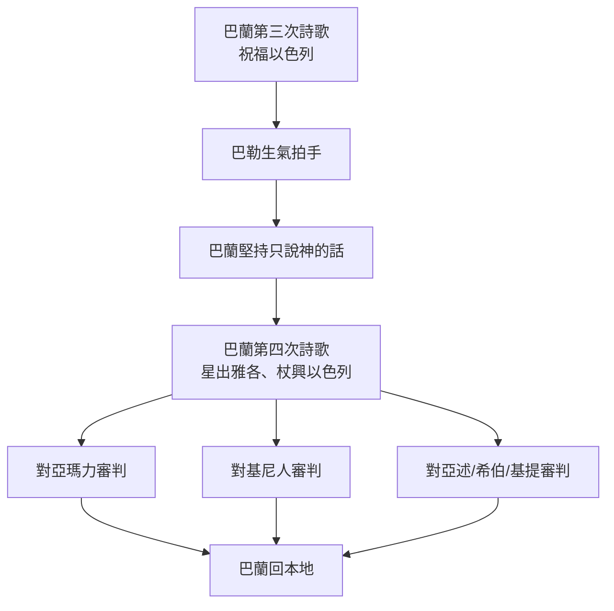

# 民數記 第24章

1. 巴蘭見耶和華喜歡賜福與以色列，就不像前兩次去求法術，卻面向[[曠野]]。
2. 巴蘭舉目，看見以色列人[[巴蘭舉目看見以色列按支派居住|照著支派居住]]。神的靈就臨到他身上，
3. 他便題起詩歌說：比珥的兒子巴蘭說，眼目閉住（閉住或作：睜開）的人說，
4. 得聽神的言語，得見全能者的異象，眼目睜開而仆倒的人說：
5. 雅各啊，你的[[巴蘭第三次詩歌預言祝福以色列|帳棚何等華美]]！以色列啊，你的[[巴蘭第三次詩歌預言祝福以色列|帳幕何其華麗]]！
6. 如[[巴蘭第三次詩歌預言祝福以色列|接連的山谷]]，如[[巴蘭第三次詩歌預言祝福以色列|河旁的園子]]，如耶和華所栽的[[巴蘭第三次詩歌預言祝福以色列|沉香樹]]，如[[巴蘭第三次詩歌預言祝福以色列|水邊的香柏木]]。
7. 水要從他的桶裡流出；種子要撒在多水之處。他的[[巴蘭第三次詩歌預言祝福以色列|王必超過亞甲]]；他的[[巴蘭第三次詩歌預言祝福以色列|國必要振興]]。
8. [[巴蘭第三次詩歌預言祝福以色列|神領他出埃及]]；他似乎[[巴蘭第三次詩歌預言祝福以色列|有野牛之力]]。他要[[巴蘭第三次詩歌預言祝福以色列|吞吃敵國]]，折斷他們的骨頭，用箭射透他們。
9. 他蹲如公獅，臥如母獅，[[巴蘭第三次詩歌預言祝福以色列|誰敢惹他]]？凡給你祝福的，願他蒙福；凡咒詛你的，願他受咒詛。
10. [[巴勒向巴蘭生氣拍手|巴勒向巴蘭生氣]]，就拍起手來，對巴蘭說：我召你來為我咒詛仇敵，不料，你這三次竟為他們祝福。
11. 如今你[[巴勒向巴蘭生氣拍手|快回本地去]]吧！我想使你得大尊榮，耶和華卻[[巴勒向巴蘭生氣拍手|阻止你不得尊榮]]。
12. 巴蘭對[[巴勒]]說：我豈不是對你所差遣到我那裡的使者說：
13. [[巴勒]]就是將他[[巴蘭宣稱只說神的話|滿屋的金銀]]給我，我也不得越過耶和華的命，憑自己的心意行好行歹。耶和華說什麼，我就要說什麼？
14. 現在我要回本族去。你來，我告訴你這民日後要怎樣待你的民。
15. 他就題起詩歌說：比珥的兒子巴蘭說：眼目閉住（閉住或作：睜開）的人說，
16. 得聽神的言語，明白至高者的意旨，看見全能者的異象，眼目睜開而仆倒的人說：
17. 我看他卻不在現時；我望他卻不在近日。有[[星出於雅各（彌賽亞）|星]]要出於雅各，有[[杖興於以色列（彌賽亞掌權）|杖]]要興於以色列，必打破摩押的四角，[[巴蘭預言彌賽亞星出雅各|毀壞擾亂之子]]。
18. 他必得[[巴蘭預言彌賽亞星出雅各|以東為基業]]，又得仇敵之地[[巴蘭預言彌賽亞星出雅各|西珥為產業]]；以色列必行事勇敢。
19. 有一位出於雅各的，必掌大權；他要除滅城中的餘民。
20. 巴蘭觀看[[巴蘭預言亞瑪力終必沉淪|亞瑪力]]，就題起詩歌說：亞瑪力原為[[巴蘭預言亞瑪力終必沉淪|諸國之首]]，但他[[巴蘭預言亞瑪力終必沉淪|終必沉淪]]。
21. 巴蘭觀看[[巴蘭預言基尼人被亞述擄去|基尼人]]，就題起詩歌說：你的[[巴蘭預言基尼人被亞述擄去|住處本是堅固]]；你的[[巴蘭預言基尼人被亞述擄去|窩巢做在巖穴中]]。
22. 然而基尼必至衰微，直到[[亞述]]把你擄去。
23. 巴蘭又題起詩歌說：[[巴蘭預言基提人苦害亞述希伯|哀哉]]！神行這事，誰能得活？
24. 必有人[[巴蘭預言基提人苦害亞述希伯|乘船從基提界而來]]，苦害[[亞述]]，[[巴蘭預言基提人苦害亞述希伯|苦害希伯]]；[[巴蘭預言基提人苦害亞述希伯|他也必至沉淪]]。
25. 於是[[巴蘭回本地巴勒也回去|巴蘭起來]]，[[巴蘭回本地巴勒也回去|回他本地去]]；[[巴蘭回本地巴勒也回去|巴勒也回去了]]。

<!-- fhl-map-links:start -->
## 相關地圖

- [[appendix/fhl_maps/maps/023|〈民圖四〉分地給兩個半支派]]
<!-- fhl-map-links:end -->

---

## 本章知識節點

### 事件
- [[巴蘭見神喜悅賜福不求法術]]
- [[巴蘭舉目看見以色列按支派居住]]
- [[巴蘭第三次詩歌預言祝福以色列]]
- [[巴勒向巴蘭生氣拍手]]
- [[巴蘭宣稱只說神的話]]
- [[巴蘭預言彌賽亞星出雅各]]
- [[巴蘭預言亞瑪力終必沉淪]]
- [[巴蘭預言基尼人被亞述擄去]]
- [[巴蘭預言基提人苦害亞述希伯]]
- [[巴蘭回本地巴勒也回去]]

### 神學
- [[星出於雅各預表彌賽亞]]
- [[杖興於以色列預表基督掌權]]
- [[以色列如獅得勝預表基督]]
- [[巴蘭預言以色列得摩押亞瑪力基尼地]]
- [[星出於雅各（彌賽亞）]]
- [[杖興於以色列（彌賽亞掌權）]]

### 探討
- [[巴蘭是否真心順服神]]
- [[巴蘭第三次預言是否完全順服]]

### 人物
- [[亞甲（亞瑪力王）]]

### 地點
- [[基提]]

---

## 本章整理

### 巴蘭轉向尋求神旨（v1-2）
巴蘭見耶和華喜悅賜福與以色列，不再像前兩次去求法術，而是面向 [[曠野]]。這標誌著 [[巴蘭見神喜悅賜福不求法術|態度的轉折]]：他不再試圖操控屬靈力量，而是等候神的靈臨到。當他舉目看見以色列人照著支派居住時，神的靈便臨到他身上（[[巴蘭舉目看見以色列按支派居住]]）。

### 第三首詩歌：以色列蒙福如園如獅（v3-9）
巴蘭題起詩歌，自稱「得聽神的言語、得見全能者的異象、眼目睜開而仆倒的人」。他以優美意象描繪以色列：帳棚如接連山谷、河旁園子、耶和華所栽的沉香樹、水邊香柏木。水從桶裡流出、種子撒在多水之處，預表生命豐盛與繁衍。王必超過 [[亞甲（亞瑪力王）|亞甲]]，國度振興。神領他們出埃及，賜野牛之力，吞吃敵國、折斷骨頭、箭射透敵人。以色列蹲如公獅、臥如母獅，無人敢惹；凡祝福他們的蒙福，咒詛他們的受咒詛（[[巴蘭第三次詩歌預言祝福以色列]]、[[以色列如獅得勝預表基督]]）。

### 巴勒發怒與巴蘭的堅持（v10-14）
[[巴勒]] 向巴蘭生氣，拍手說：「我召你來咒詛仇敵，你這三次竟為他們祝福！」（[[巴勒向巴蘭生氣拍手]]）。巴勒命他速回本地，原想使他得大尊榮，卻被耶和華阻止。巴蘭回應：我豈不是對使者說過，巴勒就是將滿屋金銀給我，我也不得越過耶和華的命，憑己意行好行歹？耶和華說什麼，我就說什麼（[[巴蘭宣稱只說神的話]]）。這引出關鍵探討：[[巴蘭是否真心順服神]]、[[巴蘭第三次預言是否完全順服]]。

### 第四首詩歌：彌賽亞星杖興起（v15-19）
巴蘭再題詩歌，自稱「得聽神的言語、明白至高者意旨、看見全能者異象、眼目睜開而仆倒的人」。他預言：「我看他卻不在現時；我望他卻不在近日。有星要出於雅各，有杖要興於以色列，必打破摩押的四角，毀壞擾亂之子。他必得以東為基業，又得仇敵之地西珥為產業；以色列必行事勇敢。有一位出於雅各的，必掌大權；他要除滅城中的餘民。」（[[巴蘭預言彌賽亞星出雅各]]、[[星出於雅各預表彌賽亞]]、[[杖興於以色列預表基督掌權]]、[[巴蘭預言以色列得摩押亞瑪力基尼地]]）

### 對列國的審判詩歌（v20-24）
巴蘭觀看亞瑪力、基尼人、亞述、希伯、基提，發出審判預言：
- 亞瑪力原為諸國之首，但終必沉淪（[[巴蘭預言亞瑪力終必沉淪]]）
- 基尼住處堅固、窩巢在巖穴，卻必衰微，直到亞述把你擄去（[[巴蘭預言基尼人被亞述擄去]]）
- 哀哉！神行這事，誰能得活？必有人乘船從 [[基提]] 界而來，苦害亞述、苦害希伯；他也必至沉淪（[[巴蘭預言基提人苦害亞述希伯]]）

### 雙方各自歸回（v25）
於是巴蘭起來，回他本地去；巴勒也回去了（[[巴蘭回本地巴勒也回去]]）。這場咒詛變祝福的對抗以雙方各自散場告終，但預言的種子已播下。

### 跨章脈絡：星與杖的彌賽亞應驗
「星出於雅各、杖興於以色列」成為舊約重要彌賽亞預表，新約啟示錄 22:16 耶穌自稱「我是大衛的根胤，又是他的後裔，我是明亮的晨星」。馬太福音 2:1-2 東方博士看見祂的星而來朝拜。這預言跨越巴蘭時代、大衛王朝、被擄歸回，終在基督裡成就：祂是真正的王，掌權審判列國，賜福萬民。巴蘭雖非以色列先知，神卻借他口宣告救贖大計，顯出神主權超越人意。

**參考資料**
https://www.ccbiblestudy.org/Old%20Testament/04Num/04CT24.htm
https://www.ccbiblestudy.org/Old%20Testament/04Num/04GT24.htm
https://www.kingcomments.com/en/bible-studies/Num/24
https://biblehub.com/study/numbers/24.htm
