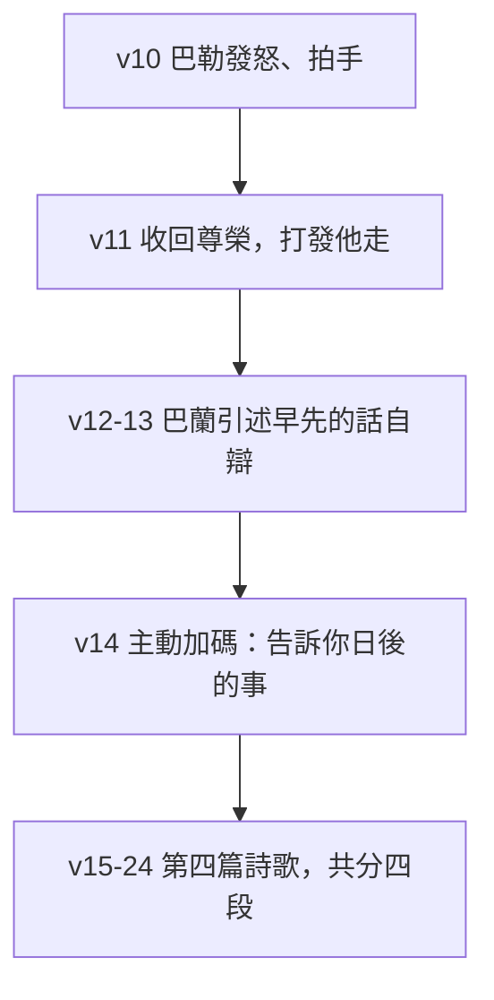

# 民數記 第24章

<!-- chapter-navigation:start -->
| [前一章](../04%20民數記/第23章.md) | [回目錄](../04%20民數記/全書目錄及綱要.md) | [下一章](../04%20民數記/第25章.md) |
| :--- | :---: | ---: |
<!-- chapter-navigation:end -->

1. [[巴蘭（比珥的兒子）|巴蘭]]見耶和華喜歡賜福與以色列，就不像前兩次去求[[斷沒有法術可以害雅各|法術]]，卻面向[[曠野]]。
2. [[巴蘭（比珥的兒子）|巴蘭]]舉目，看見以色列人[[安營與纛|照著支派居住]]。[[神的靈在人身上|神的靈]]就臨到他身上，
3. 他便題起[[詩歌（ma.shal）|詩歌]]說：比珥的兒子[[巴蘭（比珥的兒子）|巴蘭]]說，[[眼目閉住還是睜開（sha.tam）|眼目閉住]]（閉住或作：睜開）的人說，
4. 得聽神的言語，得見[[全能的神（El Shaddai）|全能者]]的異象，[[眼目明亮（ga.lah）|眼目睜開]]而[[眼目睜開而仆倒是敬虔還是術士的徵候|仆倒]]的人說：
5. 雅各啊，你的[[以色列營帳的華美|帳棚]]何等華美！以色列啊，你的[[以色列營帳的華美|帳幕]]何其華麗！
6. 如[[接連的山谷（na.chal）|接連的山谷]]，如河旁的園子，如耶和華所栽的[[沉香樹]]，如水邊的[[香柏木（潔淨儀式用）|香柏木]]。
7. 水要從他的桶裡流出；[[種子（ze.ra）|種子]]要撒在多水之處。他的王必超過[[亞甲是人名還是王朝稱號|亞甲]]；他的國必要振興。
8. 神領他出埃及；他似乎有[[野牛之力（re.em）|野牛之力]]。他要吞吃敵國，折斷他們的骨頭，用箭射透他們。
9. 他蹲如[[母獅與公獅的比喻|公獅]]，臥如[[母獅與公獅的比喻|母獅]]，誰敢惹他？凡給你[[祝福與咒詛|祝福]]的，願他蒙福；[[咒詛你的我必咒詛他（創12：3）|凡咒詛你的]]，願他受咒詛。
10. [[巴勒]]向[[巴蘭（比珥的兒子）|巴蘭]]生氣，就[[拍手的手勢|拍起手來]]，對巴蘭說：我召你來為我[[咒詛（a.rar 與 qa.vav）|咒詛]]仇敵，不料，你這三次竟為他們[[祝福與咒詛|祝福]]。
11. 如今你快回本地去吧！我想使你得大尊榮，耶和華卻阻止你不得尊榮。
12. [[巴蘭（比珥的兒子）|巴蘭]]對[[巴勒]]說：我豈不是對你所差遣到我那裡的使者說：
13. [[巴勒]]就是將他滿屋的金銀給我，我也不得[[越過耶和華的口（peh）|越過耶和華的命]]，憑自己的心意行好行歹。耶和華說什麼，我就要說什麼？
14. 現在我要回本族去。你來，我告訴你這民日後要怎樣待你的民。
15. 他就題起[[詩歌（ma.shal）|詩歌]]說：比珥的兒子[[巴蘭（比珥的兒子）|巴蘭]]說：[[眼目閉住還是睜開（sha.tam）|眼目閉住]]（閉住或作：睜開）的人說，
16. 得聽神的言語，明白[[至高的神|至高者]]的意旨，看見[[全能的神（El Shaddai）|全能者]]的異象，[[眼目明亮（ga.lah）|眼目睜開]]而[[眼目睜開而仆倒是敬虔還是術士的徵候|仆倒]]的人說：
17. 我看他卻不在現時；我望他卻不在近日。[[星與杖的王權象徵|有星要出於雅各]]，[[星與杖的王權象徵|有杖要興於以色列]]，必打破[[摩押的四角（pe.ah）|摩押的四角]]，毀壞[[擾亂之子是塞特的後裔嗎|擾亂之子]]。
18. 他必得[[以東]]為基業，又得仇敵之地[[西珥]]為產業；以色列必行事勇敢。
19. 有一位出於雅各的，必掌大權；他要除滅城中的餘民。
20. [[巴蘭（比珥的兒子）|巴蘭]]觀看[[亞瑪力]]，就題起[[詩歌（ma.shal）|詩歌]]說：亞瑪力原為諸國之首，但他終必沉淪。
21. [[巴蘭（比珥的兒子）|巴蘭]]觀看[[基尼人]]，就題起[[詩歌（ma.shal）|詩歌]]說：你的住處本是堅固；你的[[窩巢與基尼的雙關（qen 與 qa.yin）|窩巢]]做在巖穴中。
22. 然而[[與以色列友好的基尼人為何遭難|基尼必至衰微]]，[[巴蘭詩歌中的亞述指哪一個|直到亞述把你擄去]]。
23. [[巴蘭（比珥的兒子）|巴蘭]]又題起[[詩歌（ma.shal）|詩歌]]說：哀哉！神行這事，誰能得活？
24. 必有人乘船從[[基提（Kittim）|基提]]界而來，苦害[[亞述]]，苦害[[詩歌中的希伯是誰|希伯]]；他也必至沉淪。
25. 於是[[巴蘭（比珥的兒子）|巴蘭]]起來，回他本地去；[[巴勒]]也回去了。

---

## 本章知識節點

### 人物
- [[巴蘭（比珥的兒子）]]
- [[巴勒]]
- [[亞瑪力]]
- [[基尼人]]
- [[希伯]]

### 地點
- [[曠野]]
- [[以東]]
- [[西珥]]
- [[亞述]]
- [[摩押地]]
- [[基提（Kittim）]]

### 原文
- [[詩歌（ma.shal）]]
- [[眼目閉住還是睜開（sha.tam）]]
- [[眼目明亮（ga.lah）]]
- [[接連的山谷（na.chal）]]
- [[種子（ze.ra）]]
- [[野牛之力（re.em）]]
- [[咒詛（a.rar 與 qa.vav）]]
- [[越過耶和華的口（peh）]]
- [[摩押的四角（pe.ah）]]
- [[窩巢與基尼的雙關（qen 與 qa.yin）]]

### 主題
- [[巴蘭的七篇詩歌]]
- [[以色列營帳的華美]]
- [[安營與纛]]
- [[母獅與公獅的比喻]]
- [[祝福與咒詛]]
- [[星與杖的王權象徵]]

### 神學
- [[神的靈在人身上]]
- [[斷沒有法術可以害雅各]]
- [[全能的神（El Shaddai）]]
- [[至高的神]]
- [[彌賽亞]]
- [[神的主權]]

### 文化
- [[沉香樹]]
- [[香柏木（潔淨儀式用）]]
- [[拍手的手勢]]

### 解經爭議
- [[巴蘭是先知還是術士]]
- [[眼目睜開而仆倒是敬虔還是術士的徵候]]
- [[亞甲是人名還是王朝稱號]]
- [[擾亂之子是塞特的後裔嗎]]
- [[巴蘭詩歌中的亞述指哪一個]]
- [[與以色列友好的基尼人為何遭難]]
- [[詩歌中的希伯是誰]]

### 互文
- [[咒詛你的我必咒詛他（創12：3）]]
- [[圭必不離猶大（創49：10）]]
- [[東方博士見他的星（太2：1-2）]]
- [[明亮的晨星（啟22：16）]]
- [[掃羅擊殺亞甲（撒上15：8）]]
- [[巴蘭的教訓（啟2：14）]]

---

## 本章整理

### 他不再去求法術（v1-2）

前兩次，[[巴蘭（比珥的兒子）|巴蘭]] 都是築壇獻祭之後離開 [[巴勒]]，到高處去等神的話。這一次他放棄了那一套。經文說他「不像前兩次去求[[斷沒有法術可以害雅各|法術]]，卻面向[[曠野]]」——而 STEP語言資料顯示，這裡的「法術」是 ne.cha.Shim（H5173，簡要義域 na.chash: divination），正是他自己在前一章宣告過斷沒有法術可以害雅各的那個字。他親口說那東西無效，這一章他就不再用了。

各家對他為什麼收手，講法不同。GT《聖經精讀本》讀出的是算計：「他認為前兩次的失敗,是因為在神面前使用了法術,所以這次為了得到神的好意沒有再使用法術。」GT《舊約聖經背景註釋》講的是機制：「巴蘭是個美索不達米亞的先知，他召喚神的慣常步驟應該包括某種 * 占卜。一旦知道耶和華的意思是要祝福以色列人，巴蘭就放棄了機械式的方法，容許自己直接受神啟示。」CT 則把整件事歸給神的管理，說他「身不由己的作了他所不想作的」。

接著出現全章的轉折點：「[[神的靈在人身上|神的靈]]就臨到他身上」。前兩次是神把話放在他口中，這一次是靈直接臨到。CT 在〔話中之光〕特別加了一道防線：「『神的靈就臨到他身上，』並不是因為巴蘭內心蒙神喜悅。神為了成就自己的旨意使用了巴蘭，與巴蘭的意志無關」。KC 從別的角度說同一件事——他拿掃羅作對照，說在不信的掃羅身上也發生過類似的事。他看見的是照著支派 [[安營與纛|安營]] 的以色列，KC 說那是「他看見這百姓在神面前所處的次序」（He sees the people in the order they have before God）。

### 第三篇詩歌：從高處看見的營帳（v3-9）

第三篇 [[詩歌（ma.shal）|詩歌]] 的開場是一句和合本自己都給了兩種譯法的話：「[[眼目閉住還是睜開（sha.tam）|眼目閉住]]（閉住或作：睜開）的人說」。STEP語言資料給的本節譯義是 opened，CT〔原文字義〕給的字義也是「打開」；CT 與 GT 丁良才《民數記註釋》用同一句話把兩種譯法收攏：「閉住或作睜開，這四個字的意思歸於一，因為肉眼雖閉住，心眼卻睜開了。」下一句的「[[眼目明亮（ga.lah）|眼目睜開]]」則是另一個字（H1540I），正是民22:31 神開他眼睛時用的那個「揭開」。

同一句話裡的「[[眼目睜開而仆倒是敬虔還是術士的徵候|仆倒]]」，四家評價相反。CT 說「指行法術的人，正常的先知看見異象時並不仆倒」，丁良才引撒上19:24 說「忠心于主的先知，見異象的時候，沒有這樣撲倒的」；BH 的判斷正好相反，說俯伏表示對神的敬畏與順服，是遇見神時常見的反應，並舉但以理與約翰為例。

接下來的四個比喻，是全章最常被引用的段落。

| 比喻 | STEP 原文 | Strong | 值得注意的地方 |
|---|---|---|---|
| 帳棚／帳幕（見 [[以色列營帳的華美]]） | 'o.ha.Lei./kha／mish.ke.no.Tei./kha | H168G／H4908 | 後者與會幕的「帳幕」同一個字 |
| 接連的山谷（見 [[接連的山谷（na.chal）]]） | ki/n.cha.Lim | H5158B | 本節譯義作 wadis，簡要義域卻列 palm-tree |
| 沉香樹（見 [[沉香樹]]） | ka./'a.ha.Lim | H174 | 原產地不在迦南 |
| 香柏木（見 [[香柏木（潔淨儀式用）]]） | ka./'a.ra.Zim | H730 | 以樹身高大取譬 |

KC 讀這一段時，特別指出巴蘭沒有說的部分：「巴蘭並沒有談論那些帳棚裡正在發生的事。那些帳棚裡有很多埋怨，但他沒有講那些。」GT 丁良才則記下一個延續至今的用法：「猶太人到如今，每逢安息日和節期進會堂的時候，還唱這些話。」

第7節從景物轉向未來。STEP語言資料顯示「[[種子（ze.ra）|種子]]」在本節被譯為 offspring（後裔），而不是農作的種粒，這正好接上下半句的王與國。「他的王必超過[[亞甲是人名還是王朝稱號|亞甲]]」是全章唯一能用外部年代檢驗的一句，也因此成了一場爭論。第8、9節則回到力量的意象：「[[野牛之力（re.em）|野牛之力]]」、「[[母獅與公獅的比喻|他蹲如公獅，臥如母獅]]」，收在 [[咒詛你的我必咒詛他（創12：3）|創12:3 的老話]]——「凡給你[[祝福與咒詛|祝福]]的，願他蒙福；凡[[咒詛（a.rar 與 qa.vav）|咒詛]]你的，願他受咒詛」。

### 交易破裂：巴勒收回尊榮（v10-14）

巴勒的反應是一個手勢：「[[拍手的手勢|拍起手來]]」。同一個動作，CT 與 GT 串珠讀作藐視（哀2:15），KC 讀作驚駭與極度不安（伯27:23），BH 讀作古代近東常見的憤怒表達。三種讀法之間沒有調和，但下一句話很清楚：「我想使你得大尊榮，耶和華卻阻止你不得尊榮。」

CT 把這句話背後的性質講白了：「巴蘭和巴勒走在一起，一開始就是一種赤裸裸的金錢交易」，而「巴蘭既然未能按約定履行義務，巴勒自然就不會按約定付上薪酬」。巴蘭的回答則搬出他在民22:18 說過的同一句話——「我也不得[[越過耶和華的口（peh）|越過耶和華的命]]」。CT 對這句自辯不留情面：「巴蘭說這話顯得很清高，其實他言不由衷。照他的本心是貪不義之財的（參彼後二15），只是他無法說咒詛以色列人的話，並非他不願意說。」

```mermaid
flowchart TD
  A["v10 巴勒發怒、拍手"] --> B["v11 收回尊榮，打發他走"]
  B --> C["v12-13 巴蘭引述早先的話自辯"]
  C --> D["v14 主動加碼：告訴你日後的事"]
  D --> E["v15-24 第四篇詩歌，共分四段"]
```

值得注意的是第14節：交易已經破局，巴蘭卻主動說「我告訴你這民日後要怎樣待你的民」。KC 說這表示巴勒在民22:3 對「這民」的懼怕是有根據的，只是那件事要等到將來才會成真。

### 第四篇詩歌：星與杖（v15-19）

第四篇詩歌的開頭重複了第三篇的自述，只多加一個神名。STEP語言資料把這個遞進標得很清楚：

| 節 | 神名 | STEP 原文 | Strong |
|---|---|---|---|
| v4 | 神、全能者（見 [[全能的神（El Shaddai）]]） | 'El／sha.Dai | H410G／H7706 |
| v16 | 神、至高者（見 [[至高的神]]）、全能者 | 'El／el.Yon／sha.Dai | H410G／H5945B／H7706 |

KC 對這個新出現的名字有話說：「這裡巴蘭用了神的一個新名字：至高者。這是神在千年國度中的名字。」

然後是那一句：「有星要出於雅各，有杖要興於以色列。」[[星與杖的王權象徵|星與杖]] 在古代近東都是王權符號，GT《舊約聖經背景註釋》把判準講得很仔細：「星在古代近東雖然經常代表君王，這隱喻在聖經中卻甚少用到（賽十四12；結三十二7）。但它在此與代表王權（詩四十五6：『你國權的杖是正直的杖』）的權杖同現，卻確定了這個詮釋。」STEP語言資料另給一條中文譯本看不見的線索：這裡的「杖」是 she.vet（H7626G），與第2節「照著支派居住」的「支派」（H7626H）同一個字根——巴蘭一開頭看見十二個 she.vet 安營，最後宣告一個 she.vet 要興起。

這一句的去向，四套來源分成兩層。歷史層，GT《啟導本聖經註釋》寫「三百年後，大衛王朝建立」，GT 串珠補上大衛打敗 [[摩押地|摩押]]、降伏 [[以東]] 與 [[西珥]] 的記載（撒下8:2、14）。神學層，CT 說本句暗示他看見了 [[彌賽亞]]，KC 說「巴蘭在這裡提到的星，後來要引領東方的博士來到彌賽亞那裡」，並加了一句分辨：這是[[東方博士見他的星（太2：1-2）|一顆從雅各出來的星]]，不是一顆從天上來到雅各那裡的星。CT 引的經文串裡包含[[明亮的晨星（啟22：16）|啟二28、二十二16]]，而「杖」則一路連回[[圭必不離猶大（創49：10）|創49:10 的圭]]。

至於「必打破[[摩押的四角（pe.ah）|摩押的四角]]，毀壞[[擾亂之子是塞特的後裔嗎|擾亂之子]]」——前半的「打破」與第8節「用箭射透」是同一個動詞（H4272），後半則是全章最沒有共識的四個字。

### 最後三段短詩：亞瑪力、基尼、基提（v20-25）

第四篇詩歌以「題起詩歌」四次分段，後三段轉向列國。

- **[[亞瑪力]]（v20）**：「原為諸國之首，但他終必沉淪。」GT《背景註釋》說「諸國之首」可能是亞瑪力人的自稱，也可能表示他們是首先與以色列人對敵的民族。CT 把應驗指向[[掃羅擊殺亞甲（撒上15：8）|撒上15章]]。
- **[[基尼人]]（v21-22）**：這兩節在原文裡連用三個相近的字——族名 qe.ni、[[窩巢與基尼的雙關（qen 與 qa.yin）|窩巢 qen]]、以及第22節改用的 qa.yin。CT 明說這是「『窩巢』雙關語」，既指窩巢又指基尼人；KC 從第22節的用字讀出「他們要像該隱一樣被消耗」。而[[與以色列友好的基尼人為何遭難|友好的基尼人為何遭難]]，GT《啟導本》直接把問題寫出來，並列了三種解釋。
- **[[亞述]] 與 [[基提（Kittim）|基提]]（v23-24）**：「哀哉！神行這事，誰能得活？」KC 說「生命只有在與神的聯結中才可能」。而[[巴蘭詩歌中的亞述指哪一個|這裡的亞述是哪一個亞述]]、[[詩歌中的希伯是誰|苦害的希伯又是誰]]，四套來源各執一詞。

第25節收得很平淡：「於是巴蘭起來，回他本地去；巴勒也回去了。」KC 的評語是：「可憐的人！有那麼一刻，他們是在神話語的影響之下。然而那話沒有觸及他們的良心。」GT 丁良才則指出這不是結局：「但巴蘭仍舊住在米甸人中，用別的方法，謀害以色列人」——這條線一路通到[[巴蘭的教訓（啟2：14）|啟2:14 的巴蘭教訓]]，也就是下一章的事。

### 四個名字，四場沒有結論的爭論

本章與其他章不同的地方，在於它提到大量本書其他地方沒出現過的專名，而每一個都引出一場爭論。這些爭論不是各家沒讀清楚，而是材料本身就不足以定案。

| 名字 | 爭的是什麼 | 各家落點 |
|---|---|---|
| 亞甲（v7） | 本名還是王朝稱號 | CT、丁良才、《靈修版》判為稱號；《背景註釋》說「並無證據」 |
| 擾亂之子（v17） | 專名還是通名 | CT 讀作摩押諸王；《精讀本》讀作爭戰或驕傲的人；BH 說學者各異 |
| 亞述（v22、24） | 帝國、亞書利還是亞塞爾 | 五種判定並存，關鍵在詩歌的年代定位 |
| 希伯（v24） | 是不是以色列 | 多數讀作希伯來人；《背景註釋》說這樣讀會使以色列反而遭咒詛 |

STEP語言資料在這四處只能做同一件事：確認詞形、Strong 與 morphology。它可以告訴我們 Shet（H8352）在本節被標為專有名詞陽性、'a.Shur（H804G）是專有地名、'E.ver（H5677G）是專有名詞陽性——但這些名字在歷史上指向誰，是註釋層的判斷。[[巴蘭是先知還是術士|巴蘭這個人本身]] 也一樣：本章同時給了兩邊的證據，神的靈臨到他，他卻在仆倒中說預言、在交易破裂後才肯多說。[[神的主權]] 是全章唯一沒有爭議的部分——用巴蘭自己的話說，「耶和華說什麼，我就要說什麼」。

**參考資料**
https://www.ccbiblestudy.org/Old%20Testament/04Num/04CT24.htm
https://www.ccbiblestudy.org/Old%20Testament/04Num/04GT24.htm
https://www.kingcomments.com/en/bible-studies/Num/24
https://biblehub.com/study/numbers/24.htm
https://github.com/STEPBible/STEPBible-Data

<!-- appendix-links:start -->
## 附錄

### 相關地圖
- [[appendix/fhl_maps/maps/023|〈民圖四〉分地給兩個半支派]]
<!-- appendix-links:end -->

<!-- chapter-navigation:start -->
| [前一章](../04%20民數記/第23章.md) | [回目錄](../04%20民數記/全書目錄及綱要.md) | [下一章](../04%20民數記/第25章.md) |
| :--- | :---: | ---: |
<!-- chapter-navigation:end -->
