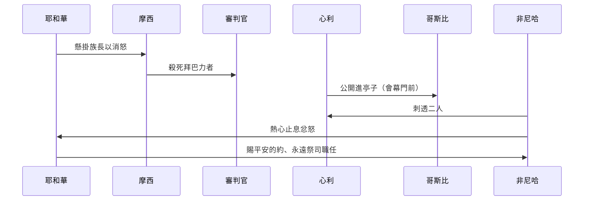

# 民數記 第25章

1. 以色列人住在什亭，百姓與[[以色列在什亭與摩押女子行淫|摩押女子]]行起淫亂。
2. 因為這女子叫百姓來，一同[[以色列在什亭與摩押女子行淫|給他們的神獻祭]]，百姓就[[以色列在什亭與摩押女子行淫|吃他們的祭物]]，[[以色列在什亭與摩押女子行淫|跪拜他們的神]]。
3. 以色列人與巴力[[毘珥（Peor）|毘珥]]連合，[[以色列與巴力毘珥連合|耶和華的怒氣]]就向以色列人發作。
4. 耶和華吩咐[[摩西]]說：將百姓中所有的族長在我面前[[公開的罪與公開的審判|對著日頭懸掛]]，使我向以色列人所發的[[神吩咐摩西懸掛族長|怒氣可以消了]]。
5. 於是[[摩西]]吩咐以色列的審判官說：凡屬你們的人，有與巴力[[毘珥（Peor）|毘珥]]連合的，你們[[摩西吩咐審判官殺死拜巴力者|各人要把他們殺了]]。
6. [[摩西]]和以色列全會眾正在[[會幕門前]][[會幕門前|哭泣]]的時候，誰知，有以色列中的一個人，當他們眼前，帶著一個[[心利帶米甸女人哥斯比進亭子|米甸女人]]到他弟兄那裡去。
7. 祭司[[非尼哈|亞倫的孫子]]，[[非尼哈|以利亞撒的兒子]]非尼哈看見了，就從會中起來，手裡拿著槍，
8. 跟隨那以色列人[[心利帶米甸女人哥斯比進亭子|進亭子]]裡去，便將以色列人和那女人[[心利帶米甸女人哥斯比進亭子|由腹中刺透]]。這樣，在以色列人中[[瘟疫作為神的審判|瘟疫]]就[[瘟疫作為神的審判|止息]]了。
9. 那時遭[[瘟疫作為神的審判|瘟疫]]死的，有二萬四千人。
10. 耶和華曉諭[[摩西]]說：
11. 祭司[[非尼哈|亞倫的孫子]]，[[非尼哈|以利亞撒的兒子]]非尼哈，使我向以色列人所發的怒消了；因他在他們中間，以我的[[非尼哈的熱心為神|忌邪為心]]，使我不在忌邪中把他們除滅。
12. 因此，你要說：我將我平安的約賜給他。
13. 這約要給他和他的後裔，作為[[神賜非尼哈平安的約|永遠當祭司職任]]的約；因他[[神賜非尼哈平安的約|為神有忌邪的心]]，為以色列人贖罪。
14. 那與[[心利帶米甸女人哥斯比進亭子|米甸女人]]一同被殺的以色列人，名叫心利，是撒路的兒子，是西緬一個宗族的首領。
15. 那被殺的[[心利帶米甸女人哥斯比進亭子|米甸女人]]，名叫哥斯比，是蘇珥的女兒；這蘇珥是米甸一個宗族的首領。
16. 耶和華曉諭[[摩西]]說：
17. 你要[[神吩咐擾害擊殺米甸人|擾害米甸人]]，[[神吩咐擾害擊殺米甸人|擊殺他們]]；
18. 因為他們用詭計擾害你們，在[[毘珥（Peor）|毘珥]]的事上和他們的姊妹、米甸首領的女兒哥斯比的事上，用這詭計誘惑了你們；這哥斯比，當[[瘟疫作為神的審判|瘟疫]]流行的日子，因毘珥的事被殺了。

<!-- fhl-map-links:start -->
## 相關地圖

- [[appendix/fhl_maps/maps/023|〈民圖四〉分地給兩個半支派]]
- [[appendix/fhl_maps/maps/036|〈書圖九〉西緬和猶大支派的地業]]
<!-- fhl-map-links:end -->

---

## 本章知識節點

### 神學
- [[公開的罪與公開的審判]]
- [[瘟疫作為神的審判]]
- [[非尼哈的熱心為神]]
- [[非尼哈的熱心止息神的忿怒（民 25：11-13）]]
- [[非尼哈的熱心預表基督的代贖（民 25：11-13；來 7：23-28）]]

### 人物
- [[摩西]]
- [[非尼哈]]
- [[心利]]
- [[哥斯比]]
- [[心利（Zimri）]]
- [[哥斯比（Cozbi）]]

### 地點
- [[什亭]]
- [[會幕門前]]
- [[毘珥（Peor）]]

### 族群
- [[米甸人]]

### 事件
- [[以色列在什亭與摩押女子行淫]]
- [[以色列與巴力毘珥連合]]
- [[神吩咐摩西懸掛族長]]
- [[摩西吩咐審判官殺死拜巴力者]]
- [[心利帶米甸女人哥斯比進亭子]]
- [[非尼哈以熱心止息瘟疫]]
- [[神賜非尼哈平安的約]]
- [[心利與哥斯比被殺]]
- [[神吩咐擾害擊殺米甸人]]
- [[米甸人的詭計與毘珥之事]]

### 偶像
- [[巴力毘珥]]

### 問題
- [[非尼哈是否真心為神還是為個人榮耀]]
- [[神是否命令摩西懸掛族長還是審判官執行]]

---

## 本章整理

### 什亭的淫亂與拜偶像（v1-3）
以色列人安營在 [[什亭]]，百姓與 [[以色列在什亭與摩押女子行淫|摩押女子]] 行淫，並參與她們向神獻祭、跪拜的儀式，導致 [[以色列在什亭與摩押女子行淫]] 與 [[以色列與巴力毘珥連合]]。這不僅是性道德的敗壞，更是屬靈的奸淫，直接觸犯耶和華的忌邪，引發 [[瘟疫作為神的審判]]。

### 神的審判與摩西的執行（v4-5）
耶和華命令摩西將所有族長在日頭下懸掛（[[神吩咐摩西懸掛族長]]），以平息怒氣；摩西轉傳命令給審判官，要他們殺死凡與巴力毘珥連合的人（[[摩西吩咐審判官殺死拜巴力者]]）。此處出現執行層面的張力：神說「懸掛族長」，摩西卻吩咐「審判官殺死拜偶像者」，引發關於 [[神是否命令摩西懸掛族長還是審判官執行]] 的討論。

### 非尼哈的熱心與瘟疫止息（v6-9）
正當會眾在 [[會幕門前]] 哭泣求告時，西緬族首領 [[心利]] 公開帶米甸女子 [[哥斯比]] 進入亭子（[[心利帶米甸女人哥斯比進亭子]]），這是 [[公開的罪與公開的審判]] 的極致挑釁。祭司非尼哈（亞倫孫子、以利亞撒兒子）憤而起身，手持槍刺透二人（[[非尼哈以熱心止息瘟疫]]、[[心利與哥斯比被殺]]），瘟疫隨即止息，但已有二萬四千人死亡。

### 神賜非尼哈平安的約（v10-13）
耶和華向摩西確認非尼哈的行動「以我的忌邪為心」，使神不至在忌邪中滅絕以色列（[[非尼哈的熱心止息神的忿怒（民 25：11-13）]]）。神因此賜給他「平安的約」與「永遠當祭司職任的約」（[[神賜非尼哈平安的約]]、[[非尼哈的熱心為神]]）。這約既是獎賞，也預表基督作為大祭司以熱心成就永久贖罪（[[非尼哈的熱心預表基督的代贖（民 25：11-13；來 7：23-28）]]），但也留下關於動機的探討：[[非尼哈是否真心為神還是為個人榮耀]]。

### 被殺者身份與針對米甸的命令（v14-18）
經文具體點名：以色列人是西緬族首領 [[心利（Zimri）|心利]]，米甸女子是首領蘇珥的女兒 [[哥斯比（Cozbi）|哥斯比]]（v14-15），凸顯這是領袖級的公開叛逆。耶和華隨後命令摩西 [[神吩咐擾害擊殺米甸人]]，因他們用詭計在 [[毘珥（Peor）|毘珥]] 之事上誘惑以色列（[[米甸人的詭計與毘珥之事]]），為後續第 31 章米甸之戰埋下伏筆。

> [!important] 本章樞紐
> 非尼哈的暴力介入雖然現代讀者感到不適，但在敘事邏輯中卻是「止息瘟疫」的關鍵轉折，並成為祭司職任永續的神學依據。

> [!question] 懸而未決
> - 摩西為何將「懸掛族長」改為「審判官殺死拜偶像者」？是寬容還是誤解？
> - 非尼哈的熱心是否包含個人野心？拉比文獻與新約視角有異同。

### 神學反思：熱心、代贖與預表（跨章脈絡）
本章呈現「罪—審判—代求/熱心—和好—立約」的完整循環，預表基督在十字架上以熱心滿足神公義、止息忿怒，並建立永約。非尼哈的祭司職任因熱心而永續，指向基督「因永遠活著，能以拯救到底」（來 7:25）。同時，米甸人的詭計提醒屬靈爭戰中「誘惑」比「敵對」更隱蔽、更致命。

**參考資料**
https://www.ccbiblestudy.org/Old%20Testament/04Num/04CT25.htm
https://www.ccbiblestudy.org/Old%20Testament/04Num/04GT25.htm
https://www.kingcomments.com/en/bible-studies/Num/25
https://biblehub.com/study/numbers/25.htm
