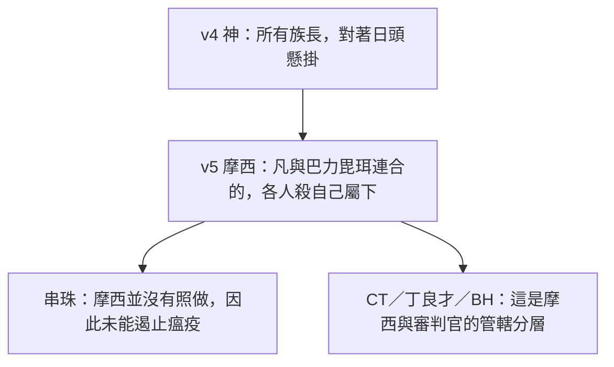

# 民數記 第25章

<!-- chapter-navigation:start -->
| [前一章](../04%20民數記/第24章.md) | [回目錄](../04%20民數記/全書目錄及綱要.md) | [下一章](../04%20民數記/第26章.md) |
| :--- | :---: | ---: |
<!-- chapter-navigation:end -->

1. 以色列人住在[[什亭（亞伯什亭）|什亭]]，百姓與[[摩押人|摩押女子]][[行起淫亂（za.nah）|行起淫亂]]。
2. 因為這女子叫百姓來，一同給他們的神獻祭，百姓就吃他們的祭物，跪拜他們的神。
3. 以色列人與[[巴力毘珥]][[連合（tsa.mad）|連合]]，耶和華的怒氣就向以色列人發作。
4. 耶和華吩咐[[摩西]]說：將百姓中所有的族長在我面前[[對著日頭懸掛是什麼刑罰|對著日頭懸掛]]，使我向以色列人所發的怒氣可以消了。
5. 於是[[摩西]]吩咐以色列的[[審判官]]說：凡屬你們的人，有與[[巴力毘珥]][[連合（tsa.mad）|連合]]的，[[摩西是否照神的吩咐處死族長|你們各人要把他們殺了]]。
6. [[摩西]]和以色列全會眾正在[[會幕（帳幕整體）|會幕]]門前哭泣的時候，誰知，有以色列中的一個人，當他們眼前，帶著一個[[米甸]]女人[[帶到他弟兄那裡去是什麼意思|到他弟兄那裡去]]。
7. 祭司[[亞倫]]的孫子，[[以利亞撒]]的兒子[[非尼哈]]看見了，就從會中起來，[[非尼哈的行為是否可效法|手裡拿著槍]]，
8. 跟隨那以色列人進[[亭子（qub.bah）|亭子]]裡去，便將以色列人和那女人[[由腹中刺透（qo.vah）|由腹中刺透]]。這樣，在以色列人中[[耶和華擊打百姓的瘟疫|瘟疫]]就止息了。
9. 那時遭[[耶和華擊打百姓的瘟疫|瘟疫]]死的，有[[二萬四千與林前10：8 的二萬三千|二萬四千人]]。
10. 耶和華曉諭[[摩西]]說：
11. 祭司[[亞倫]]的孫子，[[以利亞撒]]的兒子[[非尼哈]]，使我向以色列人所發的怒消了；因他在他們中間，以我的[[忌邪（嫉妒）|忌邪]]為心，使我不在忌邪中把他們除滅。
12. 因此，你要說：我將我[[平安的約]]賜給他。
13. 這約要給他和他的後裔，作為[[非尼哈後裔承接大祭司（士20：28）|永遠當祭司職任的約]]；因他為神有[[忌邪的神|忌邪的心]]，為以色列人[[贖罪]]。
14. 那與[[米甸]]女人一同被殺的以色列人，名叫[[心利（撒路的兒子）|心利]]，是撒路的兒子，是[[西緬]]一個宗族的首領。
15. 那被殺的[[米甸]]女人，名叫[[哥斯比（蘇珥的女兒）|哥斯比]]，是[[蘇珥（米甸首領）|蘇珥]]的女兒；這蘇珥是米甸一個宗族的首領。
16. 耶和華曉諭[[摩西]]說：
17. 你要[[擾害（tsa.rar）|擾害]][[米甸]]人，[[米甸人為何被追討而摩押人沒有|擊殺他們]]；
18. 因為他們用[[詭計（ne.khel）|詭計]][[擾害（tsa.rar）|擾害]]你們，在毘珥的事上和他們的姊妹、[[米甸]]首領的女兒[[哥斯比（蘇珥的女兒）|哥斯比]]的事上，用這詭計誘惑了你們；這哥斯比，當[[耶和華擊打百姓的瘟疫|瘟疫]]流行的日子，因毘珥的事被殺了。

---

## 本章知識節點

### 人物
- [[非尼哈]]
- [[以利亞撒]]
- [[亞倫]]
- [[摩西]]
- [[米甸]]
- [[摩押人]]
- [[西緬]]
- [[心利（撒路的兒子）]]
- [[哥斯比（蘇珥的女兒）]]
- [[蘇珥（米甸首領）]]

### 地點
- [[什亭（亞伯什亭）]]

### 背景
- [[巴力毘珥]]
- [[巴力（迦南主神）]]

### 原文
- [[行起淫亂（za.nah）]]
- [[連合（tsa.mad）]]
- [[亭子（qub.bah）]]
- [[由腹中刺透（qo.vah）]]
- [[擾害（tsa.rar）]]
- [[詭計（ne.khel）]]
- [[忌邪（嫉妒）]]
- [[審判官]]

### 主題
- [[平安的約]]

### 神學
- [[忌邪的神]]
- [[贖罪]]
- [[會幕（帳幕整體）]]

### 事件
- [[耶和華擊打百姓的瘟疫]]

### 歷史
- [[掛在木頭上_懸屍示眾]]

### 解經爭議
- [[對著日頭懸掛是什麼刑罰]]
- [[摩西是否照神的吩咐處死族長]]
- [[帶到他弟兄那裡去是什麼意思]]
- [[二萬四千與林前10：8 的二萬三千]]
- [[米甸人為何被追討而摩押人沒有]]
- [[非尼哈的行為是否可效法]]

### 互文
- [[非尼哈後裔承接大祭司（士20：28）]]
- [[詩106：28-31 記念毘珥的事]]
- [[巴蘭的教訓（啟2：14）]]

---

## 本章整理

### 從安營變成住下（v1-3）

上一章 [[巴蘭（比珥的兒子）|巴蘭]] 才剛宣告完沒有法術可以害雅各，本章開頭以色列就自己倒了。KC 把這個落差當成本章的入口：「在民數記23-24 章我們看見神怎麼看祂的百姓：作祂恩典與看顧的對象。民數記25 章與此形成極大的對比。」

[[什亭（亞伯什亭）|什亭]] 是進迦南前的最後一站。KC 從一個動詞讀出徵兆：「百姓『住』在什亭，而先前他們是安營在摩押平原（民22:1）。『安營』是著眼於隨時要繼續前進，『住』則帶著比較長久的性質。」STEP語言資料可以印證這個用字：本節動詞是 va/i.Ye.shev（H3427），本節譯義是 and it remained。

跌倒的次序，各家講法一致。GT《聖經精讀本》說：「摩押女子一開始並沒有強迫以色列的男子拜偶像,而是邀請他們參加淫亂的宴席,使他們自然地跪拜偶像。」GT 丁良才《民數記註釋》在第2節說同一件事：「以色列人若不是先受女子的引誘，行起淫亂，也未必肯去拜巴力。」而[[行起淫亂（za.nah）|「行起淫亂」]]這個詞本身就有兩層——CT 說它「有宗教及情欲雙重的意思」。

到了第3節，動作變成[[連合（tsa.mad）|「連合」]]。STEP 顯示這是 Niphal 反身形（H6775），本節譯義是 and it joined itself；CT 記下一個譯法：「『聯合』有的譯為『負軛』」，KC 說這個字帶著「與人同負一軛」的力量。[[巴力毘珥]] 是毘珥山上的地方巴力，GT《舊約聖經背景註釋》指出這是以色列第一次與迦南豐饒之神接觸，「這次接觸以災難收場，成了神對拜偶像反應嚴厲的先例」。

### 兩道命令的落差（v4-5）

第4節神吩咐的是把所有[[對著日頭懸掛是什麼刑罰|族長對著日頭懸掛]]，第5節[[摩西]] 轉達給[[審判官]] 的卻是「凡屬你們的人，有與巴力毘珥連合的，你們各人要把他們殺了」。對象不一樣。

```mermaid
flowchart TD
  A["v4 神：所有族長，對著日頭懸掛"] --> B["v5 摩西：凡與巴力毘珥連合的，各人殺自己屬下"]
  B --> C1["串珠：摩西並沒有照做，因此未能遏止瘟疫"]
  B --> C2["CT／丁良才／BH：這是摩西與審判官的管轄分層"]
```

[[摩西是否照神的吩咐處死族長|這個落差要不要讀成不服從]]，四套來源分成兩邊。GT《民數記串珠聖經註釋》是唯一一套明說的：「摩西並沒有照做」，並補上一句「個中原因這裡沒有交代，可能摩西擔心損失將領會削弱軍力」。另外三套讀成分層授權——丁良才說「唯有摩西管轄族長的事，審判官只能管轄屬自己的人」。

至於[[掛在木頭上_懸屍示眾|懸掛]]這個刑罰怎麼執行，各家也不同。STEP 給的本節譯義是 impale（H3363，簡要義域 ya.qa: to dislocate/hang），CT 說是「處死後掛在木架上示眾」，丁良才說「指先斬了首級，以後又被懸掛起來」，GT《背景註釋》則說「處死的方法雖然不明」，並補上一條背景：「將屍體插在柱上示眾是 * 亞述的常例」。

### 一個人的行動止住了瘟疫（v6-9）

第6節是全章最刺眼的一幕：全會眾正在 [[會幕（帳幕整體）|會幕]] 門前哭泣，[[心利（撒路的兒子）|心利]] 卻當著眾人的面[[帶到他弟兄那裡去是什麼意思|把一個米甸女人帶到他弟兄那裡去]]。這個動作到底是什麼意思，GT《背景註釋》一口氣列了三種讀法（介紹給家人／鼓勵家中男子參與儀式化性交／「家人」指祖先之靈），GT《靈修版聖經註釋》另主張改譯：「『到他兄弟那裡去』這句話若譯為『帶到他的內室去』更佳」。

[[非尼哈]] 的反應是拿槍跟進[[亭子（qub.bah）|亭子]]，把兩人[[由腹中刺透（qo.vah）|由腹中刺透]]。STEP 顯示這一節特別標明 she.nei./Hem（H8147），本節譯義是 both of them——同一擊刺穿兩人；而「止息」是 va./te.'a.Tzar（H6113，簡要義域 a.tsar: to restrain）。

| 人物 | 身分 | 名字字義 |
|---|---|---|
| 心利 | 西緬一個宗族的首領（見 [[西緬]]） | CT：我的音樂 |
| 哥斯比（見 [[哥斯比（蘇珥的女兒）]]） | 蘇珥的女兒（見 [[蘇珥（米甸首領）]]） | CT：虛假的 |

KC 由此提出一個提醒：「敢犯下這樣一樁罪的人，是一個父家首領的兒子。這教導我們，出身或地位絕不保證一個人不會跌進最可怕的罪裡。」至於[[耶和華擊打百姓的瘟疫|遭瘟疫死的]][[二萬四千與林前10：8 的二萬三千|二萬四千人]]與林前10:8 的二萬三千怎麼調和，四套來源給了四種解法，其中 GT 艾基斯《舊約聖經難題彙編》走得最遠——他主張林前10:8 講的根本不是本章，而是金牛犢事件。

### 神的回應：忌邪與平安的約（v10-15）

第11節連用三次同一個字根。STEP語言資料顯示：「以我的[[忌邪（嫉妒）|忌邪]]為心」的動詞是 be./kan.'/O（H7065），名詞是 kin.'a.T/i（H7068），「使我不在忌邪中」再用一次同一個名詞。CT〔原文字義〕給的兩個字義是「嫉妒，發熱心」與「狂熱，妒忌」。GT《聖經精讀本》先劃清一件事：「希伯來語中『忌邪』是指神自己的忌邪之心,而不是指為神而有的人感情上的嫉妒。」也就是說，[[忌邪的神|這份忌邪]]屬於神，而非尼哈做的是以它為心。

神的回應是[[平安的約]]。CT 說這約指神應許非尼哈和他的子孫永遠繼承大祭司的職分，為神的百姓獻祭[[贖罪]]，「平息神的忿怒，使神與人和睦相安」；串珠解釋名稱的來由：「這約稱為『平安的約』（12），因為祭司的職事使神與人和好。」GT《背景註釋》把它與大衛之約並列為「永遠」的約。這條線後來確實[[非尼哈後裔承接大祭司（士20：28）|走了下去]]——丁良才說「非尼哈後來果然繼續他父親[[以利亞撒]] 做了大祭司（士二十28）」。

[[非尼哈的行為是否可效法]]，是本章分歧最大的一點。丁良才只用一句話劃界：「非尼哈所作的，是特別的辦法，是我們現在不可效法的。」KC 的方向完全相反：「非尼哈的靈必須成為我們所有人的特徵。」CT 與 BH 則走中間——CT 強調那是危急時刻，BH 說對神的熱心值得稱許，前提是它與神的旨意一致。

### 為什麼被追討的是米甸（v16-18）

引誘的是摩押女子，被吩咐[[擾害（tsa.rar）|擾害]]的卻是[[米甸]] 人。[[米甸人為何被追討而摩押人沒有|這個錯位]]有三種解釋：丁良才說米甸在引誘的事上作了禍首，摩押另有懲罰（申二9、申二十三3-4）；GT《啟導本》說「神要消滅的是屬摩押族的米甸人，而非所有的米甸族」；KC 說：「以色列對米甸人的態度，是由米甸人對以色列的態度決定的。」

第18節自己給了兩件證據：毘珥的事，與哥斯比的事。經文用的字是[[詭計（ne.khel）|「詭計」]]——STEP 顯示同一節裡名詞（H5231）與動詞（H5230）同根。丁良才把這個手段的特徵講得最清楚：「米甸人沒有明明地攻擊以色列人，乃是用巧法謀害使他們自取滅亡。」CT 直接指出這計謀的來源：「『用詭計擾害…用這詭計誘惑』出自[[巴蘭的教訓（啟2：14）|巴蘭的教訓]]」。

[[詩106：28-31 記念毘珥的事|這件事沒有隨本章結束]]。KC 說「這樁罪的記憶在以色列的歷史中被牢牢地保存下來」，並列出書22:17、詩106:28-31、何9:10 三處。KC 為整章下的結語是：「在前面幾章，巴蘭沒能使神對祂的百姓不忠。神一直信實地持守祂看待百姓的方式。如今仇敵試著從百姓那一邊下手。」

**參考資料**
https://www.ccbiblestudy.org/Old%20Testament/04Num/04CT25.htm
https://www.ccbiblestudy.org/Old%20Testament/04Num/04GT25.htm
https://www.kingcomments.com/en/bible-studies/Num/25
https://biblehub.com/study/numbers/25.htm
https://github.com/STEPBible/STEPBible-Data

<!-- appendix-links:start -->
## 附錄

### 相關地圖
- [[appendix/fhl_maps/maps/023|〈民圖四〉分地給兩個半支派]]
- [[appendix/fhl_maps/maps/036|〈書圖九〉西緬和猶大支派的地業]]
<!-- appendix-links:end -->

<!-- chapter-navigation:start -->
| [前一章](../04%20民數記/第24章.md) | [回目錄](../04%20民數記/全書目錄及綱要.md) | [下一章](../04%20民數記/第26章.md) |
| :--- | :---: | ---: |
<!-- chapter-navigation:end -->
