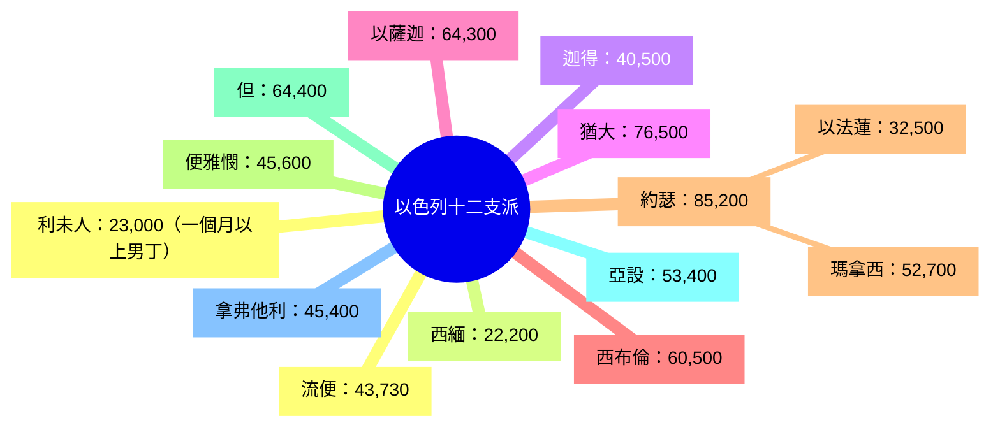

# 民數記 第26章

1. 瘟疫之後，耶和華曉諭[[摩西]]和祭司亞倫的兒子[[以利亞撒]]說：
2. 你們要將以色列全會眾，按他們的宗族，凡以色列中從[[瘟疫後第二次人口普查|二十歲以外]]、[[瘟疫後第二次人口普查|能出去打仗的]]，計算總數。
3. [[摩西]]和祭司[[以利亞撒]]在[[摩押平原]]與[[耶利哥]]相對的[[約但河]]邊向以色列人說：
4. 將你們中間從[[瘟疫後第二次人口普查|二十歲以外]]的計算總數；是照耶和華吩咐出埃及地的[[摩西]]和以色列人的話。
5. 以色列的長子是[[流便支派被數點|流便]]。流便的眾子：屬哈諾的，有哈諾族；屬法路的，有法路族；
6. 屬希斯倫的，有希斯倫族；屬迦米的，有迦米族；
7. 這就是[[流便支派被數點|流便的各族]]；其中被數的，共有[[流便支派被數點|四萬三千七百三十名]]。
8. 法路的兒子是以利押。
9. 以利押的眾子是尼母利、[[大坍、亞比蘭|大坍]]、[[大坍、亞比蘭|亞比蘭]]。這大坍、亞比蘭，就是從會中選召的，與可拉一黨同向耶和華爭鬧的時候也向[[摩西]]、亞倫爭鬧；
10. 地便開口吞了他們，和可拉、[[可拉的背叛（預告）|可拉的黨類]]一同死亡。那時火燒滅了二百五十個人；他們就作了警戒。
11. 然而[[可拉的背叛（預告）|可拉的眾子]]沒有死亡。
12. 按著家族，[[西緬支派被數點|西緬]]的眾子：屬尼母利的，有尼母利族；屬雅憫的，有雅憫族；屬雅斤的，有雅斤族；
13. 屬謝拉的，有謝拉族；屬掃羅的，有掃羅族。
14. 這就是[[西緬支派被數點|西緬的各族]]，共有[[西緬支派被數點|二萬二千二百名]]。
15. 按著家族，[[迦得支派被數點|迦得]]的眾子：屬洗分的，有洗分族；屬哈基的，有哈基族；屬書尼的，有書尼族；
16. 屬阿斯尼的，有阿斯尼族；屬以利的，有以利族；
17. 屬亞律的，有亞律族；屬亞列利的，有亞列利族。
18. 這就是[[迦得支派被數點|迦得子孫的各族]]，照他們中間被數的，共有[[迦得支派被數點|四萬零五百名]]。
19. [[猶大支派被數點|猶大]]的兒子是珥和俄南。這珥和俄南死在迦南地。
20. 按著家族，[[猶大支派被數點|猶大]]其餘的眾子：屬示拉的，有示拉族；屬法勒斯的，有法勒斯族；屬謝拉的有謝拉族。
21. 法勒斯的兒子：屬希斯倫的，有希斯倫族；屬哈母勒的，有哈母勒族。
22. 這就是[[猶大支派被數點|猶大的各族]]，照他們中間被數的，共有[[猶大支派被數點|七萬六千五百名]]。
23. 按著家族，[[以薩迦支派被數點|以薩迦]]的眾子：屬陀拉的，有陀拉族；屬普瓦的，有普瓦族；
24. 屬雅述的，有雅述族；屬伸崙的，有伸崙族。
25. 這就是[[以薩迦支派被數點|以薩迦的各族]]，照他們中間被數的，共有[[以薩迦支派被數點|六萬四千三百名]]。
26. 按著家族，[[西布倫支派被數點|西布倫]]的眾子：屬西烈的，有西烈族；屬以倫的，有以倫族；屬雅利的，有雅利族。
27. 這就是[[西布倫支派被數點|西布倫的各族]]，照他們中間被數的，共有[[西布倫支派被數點|六萬零五百名]]。
28. 按著家族，[[約瑟支派被數點（瑪拿西、以法蓮）|約瑟]]的兒子有[[約瑟支派被數點（瑪拿西、以法蓮）|瑪拿西]]、[[約瑟支派被數點（瑪拿西、以法蓮）|以法蓮]]。
29. [[約瑟支派被數點（瑪拿西、以法蓮）|瑪拿西]]的眾子：屬瑪吉的，有瑪吉族；瑪吉生基列；屬基列的，有基列族。
30. 基列的眾子：屬伊以謝的，有伊以謝族；屬希勒的，有希勒族；
31. 屬亞斯烈的，有亞斯烈族；屬示劍的，有示劍族；
32. 屬示米大的，有示米大族；屬希弗的，有希弗族。
33. 希弗的兒子：[[西羅非哈女兒|西羅非哈]]沒兒子，只有女兒。西羅非哈女兒的名字就是[[西羅非哈女兒|瑪拉、挪阿、曷拉、密迦、得撒]]。
34. 這就是[[約瑟支派被數點（瑪拿西、以法蓮）|瑪拿西的各族]]；他們中間被數的，共有五萬二千七百名。
35. 按著家族，[[約瑟支派被數點（瑪拿西、以法蓮）|以法蓮]]的眾子：屬書提拉的，有書提拉族；屬比結的，有比結族；屬他罕的，有他罕族。
36. 書提拉的眾子：屬以蘭的，有以蘭族。
37. 這就是[[約瑟支派被數點（瑪拿西、以法蓮）|以法蓮子孫的各族]]，照他們中間被數的，共有三萬二千五百名。按著家族，這都是[[約瑟支派被數點（瑪拿西、以法蓮）|約瑟]]的子孫。
38. 按著家族，[[便雅憫支派被數點|便雅憫]]的眾子：屬比拉的，有比拉族；屬亞實別的，有亞實別族；屬亞希蘭的，有亞希蘭族；
39. 屬書反的，有書反族；屬戶反的，有戶反族。
40. 比拉的眾子是亞勒、乃幔。屬亞勒的，有亞勒族；屬乃幔的，有乃幔族。
41. 按著家族，這就是[[便雅憫支派被數點|便雅憫的子孫]]，其中被數的，共有[[便雅憫支派被數點|四萬五千六百名]]。
42. 按著家族，[[但支派被數點|但]]的眾子：屬[[但支派被數點|書含]]的，有書含族。按著家族，這就是[[但支派被數點|但的各族]]。
43. 照其中被數的，[[但支派被數點|書含]]所有的各族，共有[[但支派被數點|六萬四千四百名]]。
44. 按著家族，[[亞設支派被數點|亞設]]的眾子：屬音拿的，有音拿族；屬亦施韋的，有亦施韋族；屬比利亞的，有比利亞族。
45. 比利亞的眾子：屬希別的，有希別族；屬瑪結的，有瑪結族。
46. [[亞設支派被數點|亞設]]的女兒名叫[[亞設支派被數點|西拉]]。
47. 這就是[[亞設支派被數點|亞設子孫的各族]]，照他們中間被數的，共有[[亞設支派被數點|五萬三千四百名]]。
48. 按著家族，[[拿弗他利支派被數點|拿弗他利]]的眾子：屬雅薛的，有雅薛族；屬沽尼的，有沽尼族；
49. 屬耶色的，有耶色族；屬示冷的，有示冷族。
50. 按著家族，這就是[[拿弗他利支派被數點|拿弗他利的各族]]；他們中間被數的，共有[[拿弗他利支派被數點|四萬五千四百名]]。
51. 以色列人中被數的，共有六十萬零一千七百三十名。
52. 耶和華曉諭[[摩西]]說：
53. 你要[[普查總數與分地指示|按著人名的數目將地分給]]這些人為業。
54. 人多的，你要把產業多分給他們；人少的，你要把產業少分給他們；要照被數的人數，把產業分給各人。
55. 雖是這樣，還要[[普查總數與分地指示|拈鬮分地]]。他們要按著祖宗各支派的名字承受為業。
56. 要按著所拈的[[拈鬮分地（goral）|鬮]]，看人數多，人數少，把產業分給他們。
57. 利未人，按著他們的各族被數的：屬革順的，有革順族；屬哥轄的，有哥轄族；屬米拉利的，有米拉利族。
58. 利未的各族有立尼族、希伯倫族、瑪利族、母示族、可拉族。哥轄生暗蘭。
59. 暗蘭的妻名叫約基別，是利未女子，生在埃及。他給暗蘭生了亞倫、[[摩西]]，並他們的姊姊米利暗。
60. 亞倫生拿答、亞比戶、[[以利亞撒]]、以他瑪。
61. 拿答、亞比戶在耶和華面前獻凡火的時候就死了。
62. 利未人中，凡一個月以外、被數的男丁，共有[[利未人被數點|二萬三千]]。他們本來沒有數在以色列人中；因為在以色列人中，沒有分給他們產業。
63. 這些就是被[[摩西]]和祭司[[以利亞撒]]所數的；他們在[[摩押平原]]與[[耶利哥]]相對的[[約但河]]邊數點以色列人。
64. [[但支派被數點|但]]被數的人中，沒有一個是[[摩西]]和祭司亞倫從前在西乃的曠野所數的以色列人，
65. 因為耶和華論到他們說：他們必要死在曠野。所以，除了[[迦勒|耶孚尼的兒子]]迦勒和[[約書亞|嫩的兒子]]約書亞以外，[[老一代在曠野死盡|連一個人也沒有存留]]。

<!-- fhl-map-links:start -->
## 相關地圖

- [[appendix/fhl_maps/maps/023|〈民圖四〉分地給兩個半支派]]
<!-- fhl-map-links:end -->

---

## 本章知識節點

### 神學
- [[利未人無產業預表基督徒天上產業（民26：62）]]
- [[可拉叛亂與大坍亞比蘭被吞預表叛逆下場（民26：9-10）]]
- [[第二次普查總數與第一次相近預表神信實（民26：51）]]
- [[第二次普查預表新約教會清點（民26：1-51）]]
- [[西羅非哈女兒繼承產業預表基督裡男女同為後嗣（民26：33）]]
- [[迦勒約書亞存留預表得勝者（民26：65）]]

### 歷史背景
- [[瘟疫後第二次人口普查]]
- [[人口普查（mipqad）]]
- [[老一代在曠野死盡]]
- [[普查總數與分地指示]]
- [[拈鬮分地（goral）]]
- [[拈鬮分地是否完全由神主權決定（民26：55-56）]]

### 支派記載
- [[流便支派被數點]]
- [[西緬支派被數點]]
- [[迦得支派被數點]]
- [[猶大支派被數點]]
- [[以薩迦支派被數點]]
- [[西布倫支派被數點]]
- [[約瑟支派被數點（瑪拿西、以法蓮）]]
- [[便雅憫支派被數點]]
- [[但支派被數點]]
- [[亞設支派被數點]]
- [[拿弗他利支派被數點]]
- [[利未人被數點]]

### 人物事件
- [[大坍、亞比蘭]]
- [[西羅非哈女兒]]
- [[西羅非哈女兒繼承權是否適用所有情況（民26：33）]]

---

## 本章整理

### 瘟疫後第二次人口普查命令（v1-4）
耶和華在[[瘟疫後第二次人口普查|瘟疫之後]]曉諭[[摩西]]和祭司[[以利亞撒]]，吩咐按宗族計算以色列全會眾中二十歲以上、能出去打仗的男丁總數。這是[[人口普查（mipqad）|第二次全國性點閱]]，距離西乃曠野第一次普查（民1章）已過三十八年，新一代已在[[摩押平原]]、[[約但河]]邊、[[耶利哥]]對面預備進迦南。神的命令彰顯祂對應許之信實，即使老一代在曠野死盡，祂仍保守百姓數目基本維持。

### 各支派點閱名冊（v5-51）
經文按支派順序逐一列出宗族名單與人數，形成完整的家譜結構：

| 支派 | 本章人數 | 民1章人數 | 差異 |
|------|----------|-----------|------|
| 流便 | 43,730 | 46,500 | -2,770 |
| 西緬 | 22,200 | 59,300 | -37,100 |
| 迦得 | 40,500 | 45,650 | -5,150 |
| 猶大 | 76,500 | 74,600 | +1,900 |
| 以薩迦 | 64,300 | 54,400 | +9,900 |
| 西布倫 | 60,500 | 57,400 | +3,100 |
| 瑪拿西 | 52,700 | 32,200 | +20,500 |
| 以法蓮 | 32,500 | 40,500 | -8,000 |
| 便雅憫 | 45,600 | 35,400 | +10,200 |
| 但 | 64,400 | 62,700 | +1,700 |
| 亞設 | 53,400 | 41,500 | +11,900 |
| 拿弗他利 | 45,400 | 53,400 | -8,000 |
| **總計（不含利未）** | **601,730** | **603,550** | **-1,820** |

總數 601,730 人，與第一次普查 603,550 人相差極小，印證[[第二次普查總數與第一次相近預表神信實（民26：51）|神在曠野管教中保守祂的百姓]]。流便長子名分因犯罪失去（創49:4），猶大成為最大支派，預表彌賽亞出自猶大。瑪拿西支派中[[西羅非哈女兒|西羅非哈無子只有五個女兒]]（瑪拉、挪阿、曷拉、密迦、得撒），為後來產業繼承案例鋪墊。利未人單獨點閱共 23,000 人（一個月以上男丁），不在以色列人中得地業，因耶和華是他們的產業，預表[[利未人無產業預表基督徒天上產業（民26：62）|新約信徒屬天的產業]]。

> [!note] 可拉叛亂的歷史回顧
> 經文在流便支派中特別提到[[大坍、亞比蘭|大坍、亞比蘭]]與[[可拉的背叛（預告）|可拉一黨]]同向耶和華爭鬧，地開口吞滅他們，火燒滅二百五十人，作為警戒（v9-10）。這彰顯[[可拉叛亂與大坍亞比蘭被吞預表叛逆下場（民26：9-10）|叛逆神所立權柄的嚴重後果]]，也說明可拉的眾子並未死亡（v11），保留了可拉後裔的祭司職分（參詩篇42等）。

### 產業分配原則（v52-56）
耶和華指示[[摩西]]：「你要按著名數將地分給他們為業。」確立「按人數分地、拈鬮定界」的雙重原則：人數多的多分、少的少分（公平原則），並要拈鬮決定具體地界（神主權原則）。這兼顧公義與恩典，體現[[普查總數與分地指示|普查總數直接服務於分地]]，也引發[[拈鬮分地是否完全由神主權決定（民26：55-56）|關於拈鬮是否完全由神主權決定的神學探討]]。[[拈鬮分地（goral）|拈鬮（goral）]]在舊約中代表神的揀選與主權（參箴16:33）。

### 利未人單獨點閱（v57-62）
利未人按家族（革順、哥轄、米拉利）及宗族（立尼、希伯倫、瑪利、母示、可拉等）點閱，共 23,000 個一個月以上的男丁。他們不在以色列人中得地業，因耶和華是他們的產業（民18:20），這歷史事實預表[[利未人無產業預表基督徒天上產業（民26：62）|新約信徒作祭司的體系，承受屬天不朽壞的產業]]（彼前1:4；2:9）。

### 點閱總結與曠野世代結束（v63-65）
[[摩西]]和祭司[[以利亞撒]]在[[摩押平原]]、[[耶利哥]]對面的[[約但河]]邊點閱。被數點的人中，沒有一個是三十八年前在西乃曠野被數點的（除了[[迦勒]]和[[約書亞]]）。這標誌著[[老一代在曠野死盡|曠野漂流世代的結束]]，新一代準備進入應許之地，再次見證神對應許之信實不因世代更替而改變，也完成了[[瘟疫後第二次人口普查|第二次人口普查]]的歷史使命。[[迦勒約書亞存留預表得勝者（民26：65）|迦勒和約書亞的存留]]預表屬靈得勝者必得著應許。

### 西羅非哈女兒與產業繼承（v33，關聯民27章）
瑪拿西支派中[[西羅非哈女兒|西羅非哈]]無子只有五個女兒。她們在民27章為父求產業，神判斷「女子若無兄弟，可得父業」，確立女性繼承權的法律先例。這彰顯[[西羅非哈女兒繼承產業預表基督裡男女同為後嗣（民26：33）|在基督裡男女同為後嗣的神學真理]]（加3:28），也引發[[西羅非哈女兒繼承權是否適用所有情況（民26：33）|關於此繼承權是否適用所有情況的釋經討論]]。這案例體現神的律法兼顧公義與憐憫，保障弱勢族群在產業分配中的權益。

**參考資料**
https://www.ccbiblestudy.org/Old%20Testament/04Num/04CT26.htm
https://www.ccbiblestudy.org/Old%20Testament/04Num/04GT26.htm
https://www.kingcomments.com/en/bible-studies/Num/26
https://biblehub.com/study/numbers/26.htm
