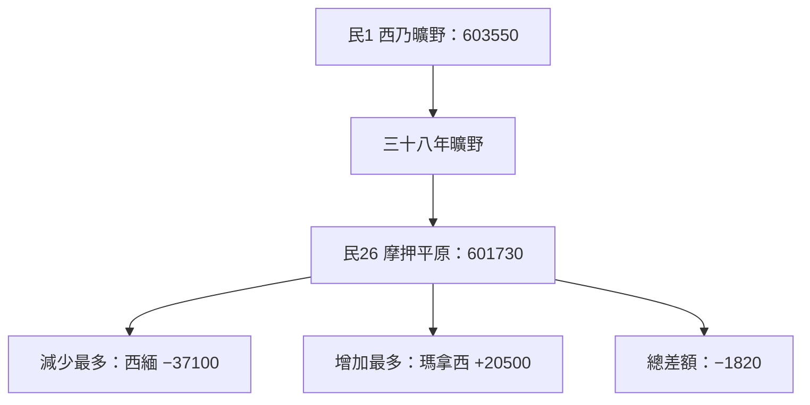

# 民數記 第26章

<!-- chapter-navigation:start -->
| [前一章](../04%20民數記/第25章.md) | [回目錄](../04%20民數記/全書目錄及綱要.md) | [下一章](../04%20民數記/第27章.md) |
| :--- | :---: | ---: |
<!-- chapter-navigation:end -->

1. [[耶和華擊打百姓的瘟疫|瘟疫]]之後，耶和華曉諭[[摩西]]和祭司[[亞倫]]的兒子[[以利亞撒]]說：
2. 你們要將以色列全會眾，按他們的宗族，凡以色列中從二十歲以外、能出去打仗的，[[計算總數（抬起頭）|計算總數]]。
3. [[摩西]]和祭司[[以利亞撒]]在[[摩押平原]]與[[耶利哥]]相對的[[約但河]]邊向以色列人說：
4. 將你們中間從二十歲以外的[[計算總數（抬起頭）|計算總數]]；是照耶和華吩咐出埃及地的[[摩西]]和以色列人的話。
5. 以色列的長子是[[流便]]。流便的眾子：屬哈諾的，有哈諾族；屬法路的，有法路族；
6. 屬希斯倫的，有希斯倫族；屬迦米的，有迦米族；
7. 這就是[[流便]]的各族；其中被數的，共有四萬三千七百三十名。
8. 法路的兒子是以利押。
9. 以利押的眾子是尼母利、[[可拉大坍亞比蘭等領首聯合的大反亂|大坍]]、[[可拉大坍亞比蘭等領首聯合的大反亂|亞比蘭]]。這大坍、亞比蘭，就是從會中選召的，與[[可拉的背叛（預告）|可拉]]一黨同向耶和華爭鬧的時候也向[[摩西]]、[[亞倫]]爭鬧；
10. [[地破裂吞吃可拉與大坍亞比蘭之家與其財物|地便開口吞了他們]]，和[[可拉的背叛（預告）|可拉]]、可拉的黨類一同死亡。那時火燒滅了二百五十個人；他們就[[作了警戒（nes）|作了警戒]]。
11. 然而[[可拉的眾子沒有死亡]]。
12. 按著家族，[[西緬]]的眾子：屬尼母利的，有尼母利族；屬雅憫的，有雅憫族；屬雅斤的，有雅斤族；
13. 屬謝拉的，有謝拉族；屬掃羅的，有掃羅族。
14. 這就是[[西緬]]的各族，共有[[西緬支派人數銳減|二萬二千二百名]]。
15. 按著家族，[[迦得（萬幸）|迦得]]的眾子：屬洗分的，有洗分族；屬哈基的，有哈基族；屬書尼的，有書尼族；
16. 屬阿斯尼的，有阿斯尼族；屬以利的，有以利族；
17. 屬亞律的，有亞律族；屬亞列利的，有亞列利族。
18. 這就是[[迦得（萬幸）|迦得]]子孫的各族，照他們中間被數的，共有[[支派人數減少的原因之爭|四萬零五百名]]。
19. [[猶大支派|猶大]]的兒子是[[珥和俄南死在迦南地（創38：6-10）|珥和俄南]]。這[[珥和俄南死在迦南地（創38：6-10）|珥和俄南死在迦南地]]。
20. 按著家族，[[猶大支派|猶大]]其餘的眾子：屬示拉的，有示拉族；屬法勒斯的，有法勒斯族；屬謝拉的有謝拉族。
21. 法勒斯的兒子：屬希斯倫的，有希斯倫族；屬哈母勒的，有哈母勒族。
22. 這就是[[猶大支派|猶大]]的各族，照他們中間被數的，共有七萬六千五百名。
23. 按著家族，[[以薩迦（價值）|以薩迦]]的眾子：屬陀拉的，有陀拉族；屬普瓦的，有普瓦族；
24. 屬雅述的，有雅述族；屬伸崙的，有伸崙族。
25. 這就是[[以薩迦（價值）|以薩迦]]的各族，照他們中間被數的，共有六萬四千三百名。
26. 按著家族，[[西布倫（同住）|西布倫]]的眾子：屬西烈的，有西烈族；屬以倫的，有以倫族；屬雅利的，有雅利族。
27. 這就是[[西布倫（同住）|西布倫]]的各族，照他們中間被數的，共有六萬零五百名。
28. 按著家族，[[約瑟]]的兒子有[[瑪拿西]]、[[以法蓮]]。
29. [[瑪拿西]]的眾子：屬瑪吉的，有瑪吉族；瑪吉生基列；屬基列的，有基列族。
30. 基列的眾子：屬伊以謝的，有伊以謝族；屬希勒的，有希勒族；
31. 屬亞斯烈的，有亞斯烈族；屬示劍的，有示劍族；
32. 屬示米大的，有示米大族；屬希弗的，有希弗族。
33. 希弗的兒子：[[西羅非哈的女兒|西羅非哈]]沒兒子，只有女兒。西羅非哈女兒的名字就是瑪拉、挪阿、曷拉、密迦、得撒。
34. 這就是[[瑪拿西]]的各族；他們中間被數的，共有[[瑪拿西支派人數大增|五萬二千七百名]]。
35. 按著家族，[[以法蓮]]的眾子：屬書提拉的，有書提拉族；屬比結的，有比結族；屬他罕的，有他罕族。
36. 書提拉的眾子：屬以蘭的，有以蘭族。
37. 這就是[[以法蓮]]子孫的各族，照他們中間被數的，共有三萬二千五百名。按著家族，這都是[[約瑟]]的子孫。
38. 按著家族，[[便雅憫]]的眾子：屬比拉的，有比拉族；屬亞實別的，有亞實別族；屬亞希蘭的，有亞希蘭族；
39. 屬書反的，有書反族；屬戶反的，有戶反族。
40. 比拉的眾子是亞勒、乃幔。屬亞勒的，有亞勒族；屬乃幔的，有乃幔族。
41. 按著家族，這就是[[便雅憫]]的子孫，其中被數的，共有四萬五千六百名。
42. 按著家族，[[但支派|但的眾子]]：屬書含的，有書含族。按著家族，這就是但的各族。
43. 照其中被數的，書含所有的各族，共有[[但支派至終定居於何地|六萬四千四百名]]。
44. 按著家族，[[亞設（有福）|亞設]]的眾子：屬音拿的，有音拿族；屬亦施韋的，有亦施韋族；屬比利亞的，有比利亞族。
45. 比利亞的眾子：屬希別的，有希別族；屬瑪結的，有瑪結族。
46. [[亞設（有福）|亞設]]的女兒名叫[[亞設的女兒西拉|西拉]]。
47. 這就是[[亞設（有福）|亞設]]子孫的各族，照他們中間被數的，共有五萬三千四百名。
48. 按著家族，[[拿弗他利]]的眾子：屬雅薛的，有雅薛族；屬沽尼的，有沽尼族；
49. 屬耶色的，有耶色族；屬示冷的，有示冷族。
50. 按著家族，這就是[[拿弗他利]]的各族；他們中間被數的，共有四萬五千四百名。
51. 以色列人中被數的，共有[[第二次數點人口|六十萬零一千七百三十名]]。
52. 耶和華曉諭[[摩西]]說：
53. 你要按著人名的數目將地分給這些人為業。
54. 人多的，你要把產業多分給他們；人少的，你要把產業少分給他們；要照被數的人數，把產業分給各人。
55. 雖是這樣，還要[[拈鬮分地（go.ral）|拈鬮分地]]。他們要按著祖宗各支派的名字承受為業。
56. 要按著所拈的鬮，看人數多，人數少，把產業分給他們。
57. [[利未支派|利未人]]，按著他們的各族被數的：屬[[利未三族分工|革順]]的，有革順族；屬[[哥轄子孫|哥轄]]的，有哥轄族；屬[[利未三族分工|米拉利]]的，有米拉利族。
58. 利未的各族有立尼族、希伯倫族、瑪利族、母示族、[[可拉的背叛（預告）|可拉]]族。[[哥轄子孫|哥轄]]生[[暗蘭]]。
59. [[暗蘭]]的妻名叫[[約基別]]，是利未女子，生在埃及。他給暗蘭生了[[亞倫]]、[[摩西]]，並他們的姊姊[[米利暗]]。
60. [[亞倫]]生[[拿答]]、[[亞比戶]]、[[以利亞撒]]、以他瑪。
61. [[拿答]]、[[亞比戶]]在耶和華面前獻[[凡火]]的時候就死了。
62. [[利未支派|利未人]]中，凡一個月以外、被數的男丁，共有二萬三千。他們本來沒有數在以色列人中；因為在以色列人中，[[耶和華是事奉者的業與分|沒有分給他們產業]]。
63. 這些就是被[[摩西]]和祭司[[以利亞撒]]所數的；他們在[[摩押平原]]與[[耶利哥]]相對的[[約但河]]邊數點以色列人。
64. 但被數的人中，沒有一個是[[摩西]]和祭司[[亞倫]]從前[[數點民數|在西乃的曠野所數的]]以色列人，
65. 因為耶和華論到他們說：[[他們必要死在曠野（民14：29-35）|他們必要死在曠野]]。所以，除了耶孚尼的兒子[[迦勒]]和嫩的兒子[[約書亞]]以外，連一個人也沒有存留。

---

## 本章知識節點

### 事件
- [[第二次數點人口]]
- [[數點民數]]
- [[耶和華擊打百姓的瘟疫]]
- [[利未三族分工]]
- [[可拉大坍亞比蘭等領首聯合的大反亂]]
- [[地破裂吞吃可拉與大坍亞比蘭之家與其財物]]

### 人物
- [[摩西]]
- [[以利亞撒]]
- [[亞倫]]
- [[約書亞]]
- [[迦勒]]
- [[流便]]
- [[西緬]]
- [[迦得（萬幸）]]
- [[猶大支派]]
- [[以薩迦（價值）]]
- [[西布倫（同住）]]
- [[瑪拿西]]
- [[以法蓮]]
- [[約瑟]]
- [[便雅憫]]
- [[但支派]]
- [[亞設（有福）]]
- [[拿弗他利]]
- [[利未支派]]
- [[哥轄子孫]]
- [[拿答]]
- [[亞比戶]]
- [[約基別]]
- [[暗蘭]]
- [[米利暗]]
- [[西羅非哈的女兒]]
- [[亞設的女兒西拉]]
- [[可拉的背叛（預告）]]

### 地點
- [[摩押平原]]
- [[約但河]]
- [[耶利哥]]

### 原文
- [[計算總數（抬起頭）]]
- [[作了警戒（nes）]]

### 主題
- [[拈鬮分地（go.ral）]]
- [[西緬支派人數銳減]]
- [[瑪拿西支派人數大增]]
- [[凡火]]

### 神學
- [[可拉的眾子沒有死亡]]
- [[耶和華是事奉者的業與分]]

### 解經爭議
- [[支派人數減少的原因之爭]]
- [[但支派至終定居於何地]]

### 互文
- [[珥和俄南死在迦南地（創38：6-10）]]
- [[他們必要死在曠野（民14：29-35）]]

---

## 本章整理

### 瘟疫之後（v1-4）

本章開頭四個字就把時間定住了：「瘟疫之後」。KC 認為這是全書的界碑：『瘟疫之後』這個說法標誌著民數記這卷書歷史中的一個轉折點。他接著解釋，前一章[[耶和華擊打百姓的瘟疫|那場瘟疫]]是擊打這百姓作為「曠野的百姓」的最後一場大瘟疫，曠野的旅程結束了。GT《聖經精讀本》說的是同一件事：這意味著充滿罪惡的曠野生活結束了，以色列人要以新的秩序進入迦南地。

說話的對象也換了人。CT 指出：「因亞倫已死（參二十28），故從此神改向[[摩西]]和新任大祭司[[以利亞撒]]說話。」[[第二次數點人口|這次數點]]辦在[[摩押平原]]、[[約但河]]東邊、與[[耶利哥]]相對的地方——正是渡河前的最後一站。

[[計算總數（抬起頭）|「計算總數」]]在原文是一個動作片語。STEP語言資料顯示第2節是 se.'U 'et- rosh（H5375V＋H7218L），本節譯義是 lift up ... the head of，字面就是「把頭抬起來」；CT〔原文字義〕給「總數」的答案也只有兩個字：人頭。KC 另注意到一個次序問題：這次數點不只點「能出去打仗的」，也是「按他們宗族」點的，而後者才是更重要的，因為經文先提它。

KC 在動筆之前先劃了一條界線：「沒有神明確的吩咐而數點百姓，是一件罪。」他舉大衛落在這罪裡（代上21:1-7）作對照——分別就在於這一次是神先開口。

### 名單裡的兩段往事（v5-11、v19-22）

族譜本可以只列名字，本章卻兩次停下來講一段不光彩的事。KC 注意到這個模式：猶大的名單和流便的名單一樣，都在開頭回顧了一段黑暗往事。

[[流便]] 那一段回到[[可拉大坍亞比蘭等領首聯合的大反亂|可拉、大坍、亞比蘭的背叛]]，並重述了[[地破裂吞吃可拉與大坍亞比蘭之家與其財物|地開口吞人]]與火燒二百五十人的結局，最後用四個字收尾：[[作了警戒（nes）|「他們就作了警戒」]]。STEP語言資料顯示這裡的「警戒」是 le./Nes（H5251H，簡要義域 nes: ensign），本節譯義是 a warning sign——字面是他們成了一個記號。

緊接著是本章最短的一節：[[可拉的眾子沒有死亡]]。原因四家講法不同：CT 與 GT《聖經精讀本》說是因為他們沒有參與父親的罪，KC 卻明白拒絕這個解釋——他說他們屬於一個註定滅亡的家族，除了神的恩典之外找不到別的動機。而四套來源都追蹤到同一個結局：[[哥轄子孫|可拉的後裔]]後來在聖殿管理作樂，詩篇多篇題名歸給他們。

[[猶大支派]] 那一段回到[[珥和俄南死在迦南地（創38：6-10）|珥和俄南的死]]。這件往事在本章有實際後果：CT 指出猶大五族裡有兩族其實是孫輩，補的正是他們留下的空缺，而其中的希斯倫一線通向大衛與基督的家譜。

### 數字說了什麼（v12-51）

```mermaid
flowchart TD
  A["民1 西乃曠野：603550"] --> B["三十八年曠野"]
  B --> C["民26 摩押平原：601730"]
  C --> D1["減少最多：西緬 −37100"]
  C --> D2["增加最多：瑪拿西 +20500"]
  C --> D3["總差額：−1820"]
```

[[西緬支派人數銳減|西緬]] 是本章最刺眼的數字：二萬二千二百名，比民1 少了三萬七千一百人。原因四套來源一致，都指向前一章：CT 說「大概是因為他們中有多人受了米甸人的引誘，西緬支派的族長心利（參二十五14），也在其中」；GT《聖經精讀本》給了比例，說減少了 63%，而且這個支派從第三大變成最小。丁良才另記下一個後續：摩西臨終祝福十二支派時（申33），沒有提到西緬。

[[瑪拿西支派人數大增|瑪拿西]] 走的是相反方向：五萬二千七百名，增加兩萬零五百人，是增幅最大的支派——本章也因此把它排在[[以法蓮]] 之前。原因兩家講法不同：GT《精讀本》說這證明這個支派在曠野生活中比其他支派更順服；KC 則把它歸給[[西羅非哈的女兒]]——她們對產業有特別的關切，而神看重這一點。同一個[[約瑟]] 家，以法蓮反而少了八千名。

至於其餘幾個下降的支派，[[支派人數減少的原因之爭|要不要給理由]]本身就是分歧。CT 與丁良才注意到[[流便]]、西緬、[[迦得（萬幸）|迦得]] 三個支派都在會幕南邊安營、與可拉相鄰，因此推出「同情者」的解釋；GT《啟導本》則直說「但其他支派何以減少則原因不明」，而丁良才自己在論[[拿弗他利]] 與以法蓮時，也兩次承認不知道理由。

| 支派 | 民1 | 民26 | 增減 |
|---|---:|---:|---:|
| 流便 | 46500 | 43730 | −2770 |
| 西緬 | 59300 | 22200 | −37100 |
| 迦得 | 45650 | 40500 | −5150 |
| [[猶大支派]] | 74600 | 76500 | +1900 |
| [[以薩迦（價值）]] | 54400 | 64300 | +9900 |
| [[西布倫（同住）]] | 57400 | 60500 | +3100 |
| 瑪拿西 | 32200 | 52700 | +20500 |
| 以法蓮 | 40500 | 32500 | −8000 |
| [[便雅憫]] | 35400 | 45600 | +10200 |
| [[但支派]] | 62700 | 64400 | +1700 |
| [[亞設（有福）]] | 41500 | 53400 | +11900 |
| 拿弗他利 | 53400 | 45400 | −8000 |
| 總數 | 603550 | 601730 | −1820 |

名單中間插進兩個女人的名字。第33節的[[西羅非哈的女兒]]有明確理由——四套來源都說這是民27 與民36 繼承權問題的伏筆，而 GT《精讀本》正面處理了它造成的技術矛盾：這違背了第2節「只數點能出去打仗的人」的原則，但因為這次數點也是為了分地，所以可以接受。第46節的[[亞設的女兒西拉]]則沒有給理由；CT 推測她可能有傑出的表現，BH 引的是猶太傳統。

總數才是最大的意外。上一代二十歲以上的人全數死盡，新的一代卻補回幾乎同樣的人數。KC 說儘管有這一切的災殃，這百姓的人數幾乎沒有減少，這是神極大的神蹟，也是祂恩典的證明。

### 分地的兩把尺（v52-56）

數點的第二個目的在這裡揭曉。GT《民數記串珠聖經註釋》整理得最清楚：「分配地業是根據兩個原則：１ 按以上統計的人數，人數多的支派便多分地業；２ 地點的選擇卻用[[拈鬮分地（go.ral）|拈鬮]]作出決定，以免支派間因地理環境、土質不同而產生爭執。」丁良才一句話概括：「分地的時候，一按人數定多少，二按拈鬮定方向。」

STEP語言資料顯示「拈鬮」是 be./go.Ral（H1486），本節譯義是 by lot；CT〔原文字義〕給的是一個很具體的畫面：「拈鬮」小鵝卵石。為什麼要用這個方法，GT 串珠說拈鬮在當時是尋求神旨意的一個方法（箴16:33），GT《精讀本》另列兩個實際理由：認識到自己所得的地是神預備的，以及避免因土地好壞而生爭鬥。GT《舊約聖經背景註釋》給了一條外部平行：「在美索不達米亞，* 馬里的君王也是用這方法將封地分配給藩屬和退伍者。」

### 利未人與最後一句判語（v57-65）

[[利未支派|利未人]] 另行數點，範圍也不同：一個月以外的男丁，共二萬三千。名單走到[[暗蘭]] 與[[約基別]] 這一家時，經文順帶交代了[[米利暗]]、亞倫與摩西的出身，也順帶記下[[拿答]]、[[亞比戶]] 獻[[凡火]] 而死。KC 說利未這個蒙特權支派的數點，同樣讓人想起他們作祭司歷史開頭那件黑暗的事——拿答與亞比戶的不忠並沒有被遮蓋。

第62節給了利未人不被計入以色列人中的理由：「因為在以色列人中，沒有分給他們產業。」CT 把這句話翻成正面：「[[耶和華是事奉者的業與分|利未人雖然沒有分得固定的地業，但神自己就是他們的產業]]（參十八20），這是最上好的福分。」

全章以一句應驗收尾。[[他們必要死在曠野（民14：29-35）|「他們必要死在曠野」]]——STEP語言資料顯示第65節用的是 Mot ya.Mu.tu（H4191 出現兩次，morphology 為 HVqaa＋HVqi3mp），本節譯義是 certainly to die ... they will die，是希伯來文表達強調的固定組合。[[數點民數|第一次被數的人]]中，除了[[迦勒]] 與[[約書亞]] 以外連一個也沒有存留。CT 補了一個限定：這是指十二支派當時二十歲以上的人而言，摩西與以利亞撒兩人除外。丁良才則注意到一個時間差：以色列人在曠野時已大略知道這件事，「到這次數點民數的時候，才真詳細知道了」。

KC 給的結語只有兩句：「神成就了祂審判的話，正如祂成就祂祝福的話。神總是照著祂所說的去行。」

**參考資料**
https://www.ccbiblestudy.org/Old%20Testament/04Num/04CT26.htm
https://www.ccbiblestudy.org/Old%20Testament/04Num/04GT26.htm
https://www.kingcomments.com/en/bible-studies/Num/26
https://biblehub.com/study/numbers/26.htm
https://github.com/STEPBible/STEPBible-Data

<!-- appendix-links:start -->
## 附錄

### 相關地圖
- [[appendix/fhl_maps/maps/023|〈民圖四〉分地給兩個半支派]]
<!-- appendix-links:end -->

<!-- chapter-navigation:start -->
| [前一章](../04%20民數記/第25章.md) | [回目錄](../04%20民數記/全書目錄及綱要.md) | [下一章](../04%20民數記/第27章.md) |
| :--- | :---: | ---: |
<!-- chapter-navigation:end -->
