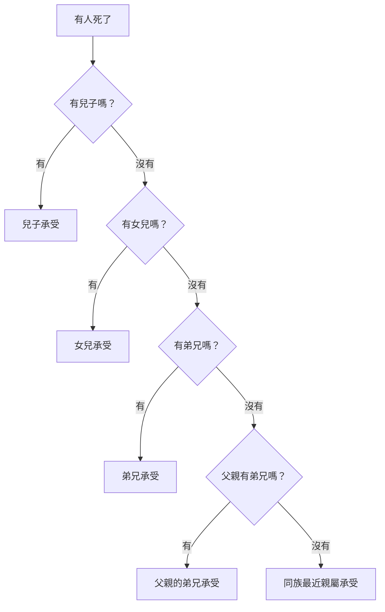

# 民數記 第27章

<!-- chapter-navigation:start -->
| [前一章](../04%20民數記/第26章.md) | [回目錄](../04%20民數記/全書目錄及綱要.md) | [下一章](../04%20民數記/第28章.md) |
| :--- | :---: | ---: |
<!-- chapter-navigation:end -->

1. 屬約瑟的兒子[[瑪拿西]]的各族，有瑪拿西的玄孫，瑪吉的曾孫，基列的孫子，希弗的兒子[[西羅非哈的女兒]]，名叫瑪拉、挪阿、曷拉、密迦、得撒。他們前來，
2. 站在[[會幕門口]]，在[[摩西]]和祭司[[以利亞撒]]，並眾首領與全會眾面前，說：
3. 我們的父親死在曠野。他不與[[可拉的背叛（預告）|可拉同黨]]聚集攻擊耶和華，是在自己罪中死的；他也沒有兒子。
4. 為什麼因我們的父親沒有兒子就把他的名從他族中除掉呢？求你們在我們父親的弟兄中[[業地（a.chuz.zah）|分給我們產業]]。
5. 於是，[[摩西]]將他們的[[判斷（mish.pat）|案件]]呈到耶和華面前。
6. 耶和華曉諭[[摩西]]說：
7. [[西羅非哈的女兒]]說得有理。你定要在他們父親的弟兄中，[[業地（a.chuz.zah）|把地分給他們為業]]；要將他們父親的[[產業（na.cha.lah）|產業]]歸給他們。
8. 你也要曉諭以色列人說：人若死了沒有兒子，就要把他的[[女兒承受產業的條例|產業歸給他的女兒]]。
9. 他若沒有女兒，就要把他的[[產業（na.cha.lah）|產業]]給他的弟兄。
10. 他若沒有弟兄，就要把他的[[產業（na.cha.lah）|產業]]給他父親的弟兄。
11. 他父親若沒有弟兄，就要把他的[[產業（na.cha.lah）|產業]]給他族中最近的親屬，他便要得為業。這要作以色列人的律例[[判斷（mish.pat）|典章]]，是照耶和華吩咐[[摩西]]的。
12. 耶和華對[[摩西]]說：你上這[[亞巴琳山]]，觀看[[地不可永賣（地權屬神）|我所賜給以色列人的地]]。
13. 看了以後，你也必[[歸到他列祖|歸到你列祖]]（原文作本民）那裡，像你哥哥[[亞倫]]一樣。
14. 因為你們在尋的曠野，當會眾爭鬧的時候，違背了我的命，沒有在湧水之地、會眾眼前[[在米利巴未將耶和華尊為聖|尊我為聖]]。（這水就是尋的曠野[[加低斯]]米利巴水。）
15. [[摩西]]對耶和華說：
16. 願耶和華[[萬人之靈的神]]，立一個人治理會眾，
17. 可以在他們面前[[出入（領袖用語）|出入]]，也可以引導他們，免得耶和華的會眾如同[[沒有牧人的羊群]]一般。
18. 耶和華對[[摩西]]說：嫩的兒子[[約書亞]]是心中有[[聖靈]]的；你將他領來，[[按手]]在他頭上，
19. 使他站在祭司[[以利亞撒]]和全會眾面前，囑咐他，
20. 又將你的[[尊榮（hod）|尊榮]]給他幾分，使以色列全會眾都聽從他。
21. 他要站在祭司[[以利亞撒]]面前；以利亞撒要憑[[烏陵和土明|烏陵]]的[[判斷（mish.pat）|判斷]]，在耶和華面前為他求問。他和以色列全會眾都要遵以利亞撒的命[[出入（領袖用語）|出入]]。
22. 於是[[摩西]]照耶和華所吩咐的將[[約書亞]]領來，使他站在祭司[[以利亞撒]]和全會眾面前。
23. [[按手]]在他頭上，囑咐他，是照耶和華藉[[摩西]]所說的話。

---

## 本章知識節點

### 主題
- [[女兒承受產業的條例]]
- [[沒有牧人的羊群]]
- [[摩西與約書亞的權柄差異]]

### 事件
- [[摩西不得進入應許之地]]
- [[約書亞承接摩西]]
- [[摩西擊打磐石兩下]]

### 人物
- [[西羅非哈的女兒]]
- [[摩西]]
- [[約書亞]]
- [[以利亞撒]]

### 原文
- [[產業（na.cha.lah）]]
- [[業地（a.chuz.zah）]]
- [[判斷（mish.pat）]]
- [[出入（領袖用語）]]
- [[尊榮（hod）]]
- [[按手]]
- [[烏陵和土明]]

### 地點
- [[會幕門口]]
- [[亞巴琳山]]
- [[加低斯]]
- [[迦南地]]

### 神學
- [[地不可永賣（地權屬神）]]
- [[在米利巴未將耶和華尊為聖]]
- [[萬人之靈的神]]
- [[聖靈]]

---

## 本章整理

### 五位女兒把難題帶到會眾中央（v1-5）

本章從一串家譜開始，目的不是堆名字。五位[[西羅非哈的女兒]]屬[[瑪拿西]]支派；父親沒有兒子，她們便走到[[會幕門口]]，在[[摩西]]、祭司[[以利亞撒]]、眾首領和全會眾面前發言。她們先說清楚父親沒有參與[[可拉的背叛（預告）|可拉同黨]]，卻也不替父親開脫：「是在自己罪中死的。」請求的焦點是父親的名字不應因沒有兒子就從族中消失，並要在父親弟兄中取得一份地業。

CT：「她們為父家求留名分和產業，動機可嘉。」KC（中譯）把她們與曠野一再抱怨、想回埃及的氣氛對照：「這些女子向前看；她們最先顯出對應許之地的渴望。」她們尚未跨過約但河就來求地，所求因此同時包含生活保障、家名延續和對神賜地應許的信心。

公開地點也很重要。BH（中譯）把這一幕解作一項公開法律申訴：摩西、祭司、領袖與會眾都在場，使裁決可以被整個群體知道。摩西沒有猜答案；第5節只說他把「她們的案件」帶到耶和華面前。KC（中譯）：「這是前所未有的案件；摩西沒有現成答案，也不以此為恥，他知道應把問題帶到哪裡。」

STEP語言資料讓女兒的措辭更清楚：第4節「除掉」是 H1639 的 Niphal 未完成式，簡要義域是減少、撤去；她們擔心的是父親的名字被動地從家族份額中抹去。同節中文「產業」用 H272 a.chuz.zah，指可持有的[[業地（a.chuz.zah）|業地]]；第5節「案件」則是 H4941H mish.pa.Ta/n，帶第三人稱陰性複數後綴，字面結構是「她們的案件」。

### 個案成為全以色列的條例（v6-11）

神的回答先給結論：「西羅非哈的女兒說得有理。」接著不只處理她們一家，也建立[[女兒承受產業的條例]]。CT：「神的判例也適用於類似情況的人。」這使一件難案成為全以色列的律例典章。

這個次序既保障女兒，也讓土地留在父家與支派架構裡。GT《串珠聖經註釋》：「女兒通常沒有任何繼承權，兒子才有此權利」；女子出嫁時通常領嫁妝並加入丈夫家族。本章在沒有兒子的情況下補上女兒承業的規則，民數記36章再處理承業女子的婚姻，避免土地轉到別支派。BH（中譯）也說，這項裁決「保存了父親的名字和財產，使其仍留在瑪拿西支派內」。

GT《聖經精讀本》把這項制度放進更大的土地觀：「這地是神所賜的禮物」，以色列人是領受並管理者；[[禧年（第五十年）]]與贖回條例都防止家族永久失去地業。這與既有的[[地不可永賣（地權屬神）|地權屬神]]原則相連。本章法律的範圍仍很明確：女兒在沒有兒子時承受，父系親屬次序與支派邊界繼續存在。

| 中文譯法 | STEP語言資料 | 本段作用 |
|---|---|---|
| v4「產業」、v7「為業」 | H272 a.chuz.zah，陰性單數絕對形／附屬形 | 可實際持有的地業 |
| v7-11「產業」 | H5159 na.cha.lah，共六次 | 父家逐級傳遞的繼承份（見 [[產業（na.cha.lah）]]） |
| v5「案件」、v11「典章」、v21「判斷」 | H4941H／H4941G mish.pat 詞族 | 從個案、公共規範到求問所得的判斷（見 [[判斷（mish.pat）]]） |

同一個中文「產業」對應兩個希伯來名詞，因此不能只按中文把它們視為同一詞。第7節甚至把兩者放在同一句：先給她們可持有的地業，再把父親原有的繼承份轉給她們。

### 摩西看見終點，先為羊群求牧者（v12-17）

神命摩西登上[[亞巴琳山]]觀看[[迦南地|所賜之地]]。BH（中譯）把亞巴琳描述為「約但河東、與耶利哥相對的一系列山地」，其中包括摩西後來登上的尼波山。STEP語言資料把第12節地名標為 H5682 ha./a.va.Rim，帶定冠詞的複數地名。

緊接著，神重申[[摩西不得進入應許之地]]。原因回到[[加低斯]]米利巴水：摩西與亞倫違背命令，沒有在會眾眼前尊神為聖。第14節「尊我為聖」是 H6942G le./hak.di.She./ni，使役式不定詞附第一人稱受詞，context gloss 是「把我當作聖」。這與[[在米利巴未將耶和華尊為聖]]的判詞完全相接。第13節「歸到列祖」使用 H622 的 Niphal 形，字面結構是「被聚集」；受罰與[[歸到他列祖|被聚集歸回本民]]同時成立。

摩西聽見死亡通知後沒有為自己爭辯，反而求神立一位能治理會眾的人。KC（中譯）：「摩西毫無苦毒或嫉妒；他沒有陷入自憐，他的心仍然向著神的百姓。」他稱神為[[萬人之靈的神]]，把選人的權利交還給最認識每個人內在生命的神。STEP語言資料顯示，第16節 H7307G ru.Chot 是陰性複數「眾靈」，第18節約書亞裡面的 ru.ach 則是同一 Strong 的陰性單數。

摩西所求的領袖輪廓可以濃縮成三項：

1. 在百姓面前出入，自己的生活與行動可作榜樣；
2. 能引導百姓出去、帶他們回來；
3. 使會眾不致成為[[沒有牧人的羊群]]。

CT：「本句說明領袖的兩大要件：(1)出入，指生活為人，含有作眾人的表率之意；(2)引導，指行動方向，含有指揮帶領眾人之意。」STEP語言資料又顯示，第17節先用 H3318G／H935G 描寫領袖自己出去、進來，再用 H3318H／H935P 的使役形描述他領眾人出去、帶眾人進來。這套[[出入（領袖用語）|出入用語]]把榜樣與實際帶領放在一起；「牧人」ro.'Eh 是 H7462B 的 Qal 主動分詞，詞典形 ra.ah 的簡要義域是牧放。

### 公開交接，也保留權柄界線（v18-23）

神立即點名[[約書亞]]。GT 丁良才：「約書亞先得了聖靈的恩賜，後受了摩西的分派。」中文第18節說他「心中有[[聖靈]]」；STEP直接確認的是 H7307G ru.ach 陰性單數，四套註釋再按神揀選與任命的上下文，解作神所賜、使他能承擔職分的靈。

[[約書亞承接摩西]]不是一句宣布就結束，而是一套全會眾看得見的程序：

| 程序 | 經文重點 | STEP／註釋補充 |
|---|---|---|
| 神選人 | 約書亞裡面有靈 | 權柄先來自神的揀選 |
| 摩西[[按手]] | v18 命令、v23 實行 | 兩處均為 H5564 sa.makh；GT《背景註釋》也列出古代授職時伸手的圖像平行 |
| 公開站立 | 在以利亞撒與全會眾面前 | CT：「摩西遵照神的命令公開執行交接儀式。」 |
| 囑咐／任命 | v19、v23 | H6680 在本段三次出現，語境是吩咐、任命 |
| 分授尊榮 | 使全會眾聽從 | H1935 [[尊榮（hod）]] 前有「從……中」的介系詞；CT 說中文「幾分」沒有獨立對應字 |
| 保留求問程序 | 以利亞撒憑烏陵求問 | H224 是複數「[[烏陵和土明]]」，H4941G 是「判斷」 |

公開儀式使百姓知道約書亞確實得到神與摩西的認可。BH（中譯）：「在全會眾面前任命，是神揀選與摩西認可的可見記號，為以色列進入應許之地維持秩序與連續性。」KC（中譯）另補充，曠野三十八年間很少再聽見約書亞的事，「但神認識他，也塑造了他」。領袖的預備可以長期不顯眼，任命時卻必須公開而清楚。

本章最後也留下[[摩西與約書亞的權柄差異]]。GT《啟導本》：「摩西可以面對面與神直接說話；約書亞卻須藉著大祭司以利亞撒的『烏陵和土明』來尋問神的旨意。」約書亞得到足以讓全會眾服從的尊榮，卻仍要由祭司求問後，和會眾一同照命出入。KingComments（中譯）把這關係概括為「領導始終受祭司職分約束」；GT 丁良才則描述二人互助：約書亞負軍政領導，以利亞撒負祭司求問。接班帶來真正權柄，也把領袖放在神已設定的指引程序之下。

**參考資料**
https://www.ccbiblestudy.org/Old%20Testament/04Num/04CT27.htm
https://www.ccbiblestudy.org/Old%20Testament/04Num/04GT27.htm
https://www.kingcomments.com/en/bible-studies/Num/27
https://biblehub.com/study/numbers/27.htm
https://github.com/STEPBible/STEPBible-Data

<!-- appendix-links:start -->
## 附錄

### 相關地圖
- [[appendix/fhl_maps/maps/023|〈民圖四〉分地給兩個半支派]]
<!-- appendix-links:end -->

<!-- chapter-navigation:start -->
| [前一章](../04%20民數記/第26章.md) | [回目錄](../04%20民數記/全書目錄及綱要.md) | [下一章](../04%20民數記/第28章.md) |
| :--- | :---: | ---: |
<!-- chapter-navigation:end -->
