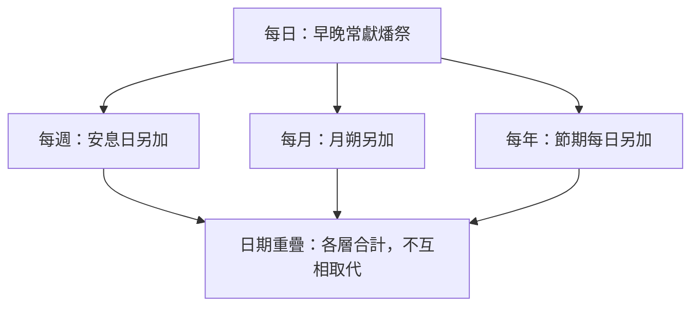

# 民數記 第28章

<!-- chapter-navigation:start -->
| [前一章](../04%20民數記/第27章.md) | [回目錄](../04%20民數記/全書目錄及綱要.md) | [下一章](../04%20民數記/第29章.md) |
| :--- | :---: | ---: |
<!-- chapter-navigation:end -->

1. 耶和華曉諭[[摩西]]說：
2. 你要吩咐以色列人說：獻給我的[[供物（qorban）|供物]]，就是[[獻給神的食物|獻給我作馨香火祭的食物]]，你們要[[以獻祭安排時間|按日期]]獻給我；
3. 又要對他們說：你們要獻給耶和華的[[火祭（isheh）|火祭]]，就是[[沒有殘疾的祭牲|沒有殘疾]]、一歲的公羊羔，每日兩隻，作為[[每日獻祭（常獻燔祭）|常獻的燔祭]]。
4. 早晨要獻一隻，[[在黃昏的時候|黃昏的時候]]要獻一隻；
5. 又用細麵[[伊法]]十分之一，並搗成的油一[[欣（hin）|欣]]四分之一，調和作為[[素祭（minchah）|素祭]]。
6. 這是[[西乃山]]所命定為[[每日獻祭（常獻燔祭）|常獻的燔祭]]，是獻給耶和華為[[馨香之氣|馨香]]的[[火祭（isheh）|火祭]]。
7. 為這一隻羊羔，要同獻[[奠酒|奠祭]]的酒一[[欣（hin）|欣]]四分之一。在聖所中，你要將[[醇酒（she.khar）|醇酒]]奉給耶和華為奠祭。
8. 晚上，你要獻那一隻羊羔，必照早晨的[[素祭（minchah）|素祭]]和同獻的[[奠酒|奠祭]]獻上，作為[[馨香之氣|馨香]]的[[火祭（isheh）|火祭]]，獻給耶和華。
9. 當[[安息日]]，要獻兩隻[[沒有殘疾的祭牲|沒有殘疾]]、一歲的公羊羔，並用調油的細麵[[伊法]]十分之二為[[素祭（minchah）|素祭]]，又將同獻的[[奠酒|奠祭]]獻上。
10. 這是每[[安息日]]獻的[[燔祭]]；那[[每日獻祭（常獻燔祭）|常獻的燔祭]]和同獻的[[奠酒|奠祭]]在外。
11. 每[[月朔]]，你們要將兩隻公牛犢，一隻公綿羊，七隻[[沒有殘疾的祭牲|沒有殘疾]]、一歲的公羊羔，獻給耶和華為[[燔祭]]。
12. 每隻公牛要用調油的細麵[[伊法]]十分之三作為[[素祭（minchah）|素祭]]；那隻公羊也用調油的細麵伊法十分之二作為素祭；
13. 每隻羊羔要用調油的細麵[[伊法]]十分之一作為[[素祭（minchah）|素祭]]和[[馨香之氣|馨香]]的[[燔祭]]，是獻給耶和華的[[火祭（isheh）|火祭]]。
14. 一隻公牛要[[奠酒]]半[[欣（hin）|欣]]，一隻公羊要奠酒一欣三分之一，一隻羊羔也奠酒一欣四分之一。這是每月的[[燔祭]]，一年之中要月月如此。
15. 又要將一隻公山羊為[[贖罪祭]]，獻給耶和華；要獻在[[每日獻祭（常獻燔祭）|常獻的燔祭]]和同獻的[[奠酒|奠祭]]以外。
16. 正月十四日是耶和華的[[逾越節]]。
17. 這月十五日是節期，要吃[[無酵節|無酵餅七日]]。
18. 第一日當有[[聖會]]；什麼[[勞碌的工（a.vo.dah）|勞碌的工]]都不可做。
19. 當將公牛犢兩隻，公綿羊一隻，一歲的公羊羔七隻，都要[[沒有殘疾的祭牲|沒有殘疾]]的，用火獻給耶和華為[[燔祭]]。
20. 同獻的[[素祭（minchah）|素祭]]用調油的細麵；為一隻公牛要獻[[伊法]]十分之三；為一隻公羊要獻伊法十分之二；
21. 為那七隻羊羔，每隻要獻[[伊法]]十分之一。
22. 並獻一隻公山羊作[[贖罪祭]]，為你們贖罪。
23. 你們獻這些，要[[節期祭物層層累加|在早晨常獻的燔祭以外]]。
24. 一連七日，每日要照這例把[[馨香之氣|馨香]][[火祭（isheh）|火祭]]的食物獻給耶和華，是[[節期祭物層層累加|在常獻的燔祭和同獻的奠祭以外]]。
25. 第七日當有[[聖會]]，什麼[[勞碌的工（a.vo.dah）|勞碌的工]]都不可做。
26. [[七七節（五旬節）|七七節]][[初熟|莊稼初熟]]，你們獻[[新素祭]]給耶和華的日子，當有[[聖會]]；什麼[[勞碌的工（a.vo.dah）|勞碌的工]]都不可做。
27. 只要將公牛犢兩隻，公綿羊一隻，一歲的公羊羔七隻，作為[[馨香之氣|馨香]]的[[燔祭]]獻給耶和華。
28. 同獻的[[素祭（minchah）|素祭]]用調油的細麵；為每隻公牛要獻[[伊法]]十分之三；為一隻公羊要獻伊法十分之二；
29. 為那七隻羊羔，每隻要獻[[伊法]]十分之一。
30. 並獻一隻公山羊為你們贖罪。
31. 這些，你們要獻[[節期祭物層層累加|在常獻的燔祭和同獻的素祭並同獻的奠祭以外]]，都要[[沒有殘疾的祭牲|沒有殘疾]]的。

---

## 本章知識節點

### 主題
- [[以獻祭安排時間]]
- [[群體性獻祭]]
- [[節期祭物層層累加]]
- [[火祭（isheh）]]
- [[新素祭]]

### 人物
- [[摩西]]

### 原文
- [[供物（qorban）]]
- [[在黃昏的時候]]
- [[素祭（minchah）]]
- [[伊法]]
- [[欣（hin）]]
- [[醇酒（she.khar）]]
- [[初熟]]
- [[勞碌的工（a.vo.dah）]]

### 文化
- [[奠酒]]
- [[聖會]]

### 歷史
- [[月朔]]
- [[逾越節]]
- [[基督預表（逾越節羔羊）]]
- [[無酵節]]
- [[七七節（五旬節）]]

### 神學
- [[獻給神的食物]]
- [[燔祭]]
- [[每日獻祭（常獻燔祭）]]
- [[馨香之氣]]
- [[安息日]]
- [[贖罪祭]]
- [[沒有殘疾的祭牲]]
- [[燔祭平安祭同獻的素祭與奠祭比例]]

### 互文
- [[聖靈分賜預表五旬節（徒2：1-4）]]

### 背景
- [[五旬節與律法頒布]]
- [[節期祭物詳情另見民數記28-29章]]

---

## 本章整理

### 從領袖交接回到每天的敬拜（v1-8）

第27章剛記完領袖交接，第28章便從人的領導轉回神當得的敬拜。耶和華仍藉[[摩西]]吩咐以色列人；KC（中譯）直接說：「領導權由摩西轉交約書亞，並不改變向神獻祭的事。」制度的連續性不依某一位領袖存續，而依神自己的命令。本章也不是要求每家每天各獻完整一套祭物。GT《啟導本聖經註釋》說：「本章記的是祭司每天必須為全民獻的祭。」所以這是[[群體性獻祭]]：祭司實際執行，全體以色列共同被代表；民數記15章個人因許願或自願所獻的祭仍是另一層責任。

第2節是全章標題。四次第一人稱所有格把視線集中在神：我的供物、我的食物、我的火祭、我的馨香；句末又說按指定日期「獻給我」。[[獻給神的食物]]並不是神要靠祭物維生。BH（中譯）說：「這些供物不是為了供養神，而是代表百姓倚靠祂的供應。」祭壇上的「食物」是歸屬、相交和蒙悅納的圖像；敬拜者把從神領受的羊羔、細麵、油和酒，再按祂規定的方式獻回。

STEP語言資料可精確拆開本節，但不替代註釋：H7133A qor.ban、H3899G le.chem、H801 isheh、H5207 ni.cho.ach 都帶第一人稱單數後綴；H4150G mo.ed 在「按日期」中為附屬形並帶第三人稱單數後綴，語境是「在它指定的時候」。這些詞形確認了「屬我」和「指定時間」的語法重心；祭物如何表達神的悅納，則須由整段獻祭脈絡理解。

[[每日獻祭（常獻燔祭）]]是整套日曆的底層：每日兩隻一歲、[[沒有殘疾的祭牲|沒有殘疾]]的公羊羔，早晨一隻，[[在黃昏的時候|黃昏]]一隻。每隻配伊法十分之一細麵、四分之一欣油和同量奠酒。STEP把反覆出現的 H8548 tamid 譯作「持續／常常」；第4、8節的時間片語由 H996G「在……之間」配 H6153 的雙數「兩個晚上」構成。這不要求讀者只採某一套後來的時計法，卻清楚表明一天開始和結束都由相同的祭物環抱。第6節又回指[[西乃山]]：本章是在進地前重申既有命令，不是臨時創造一套新祭。

### 安息日與月朔：加在每日祭物之上（v9-15）

每七日到[[安息日]]，另加兩隻羊羔、伊法十分之二細麵及奠祭。每月起頭的[[月朔]]，祭物規模再擴大。GT《民數記串珠聖經註釋》說：「每日常獻的祭物排在最先，然後是每週、每月、每年節期當獻之物。若日子重疊，便須獻兩項祭物的總數。」這句抓住了本章容易忽略的規則：特別日子從不把日常敬拜取消。

| 時段 | 另加燔祭 | 另加贖罪祭 | 經文的累加提示 |
|---|---|---|---|
| 每日 | 早晚各一隻羊羔 | 無 | 全章共同底層（見 [[每日獻祭（常獻燔祭）]]） |
| 每安息日 | 兩隻羊羔 | 無 | 「常獻的燔祭……在外」 |
| 每月朔 | 兩隻公牛、一隻公羊、七隻羊羔 | 一隻公山羊 | 「在常獻的燔祭……以外」 |

月朔的原文不是一個神祕節名。STEP顯示第11節由 H7218J rosh 的複數附屬形「各起頭」，加上 H2320G cho.desh「你們的月份」組成；第14節又說一年中月月如此。GT《舊約聖經背景註釋》把它放回古代陰曆環境：「新月（月朔）是每個月的初一日。」鄰近文化也按月相慶祝，甚至與月神崇拜相連；以色列的條例卻明說把祭物獻給耶和華，將月份更新納入與立約之神的共同敬拜。

經文也給出可核對的配套比例。公牛配伊法十分之三細麵、半[[欣（hin）]]酒；公羊配十分之二細麵、三分之一欣酒；羊羔配十分之一細麵、四分之一欣酒。H1969 hin 在本章出現五次，全是帶定冠詞的陽性名詞單數絕對形。[[伊法]]計量細麵，欣計量油酒；祭牲越大，[[燔祭平安祭同獻的素祭與奠祭比例|配套的素祭與奠祭]]也增加。本筆記保留經文自己的分數，因各註釋採用的現代容量換算並不一致，不能讓推算值遮住確定的比例。

第7節的[[醇酒（she.khar）]]也值得單獨看。STEP收錄 שֵׁכָר（she.Khar），H7941，陽性名詞單數絕對形，語境義為 strong drink；第14節一般的「酒」卻是 H3196 yayin。CT的原文字義欄寫：「『醇酒』濃酒。」這項字詞差異能說明中文為何特譯「醇酒」，但不足以把它等同某一種現代蒸餾酒。它在本段的功能很清楚：四分之一欣，被澆奠給耶和華，成為每日羊羔所配的[[奠酒]]。

### 逾越與無酵：救贖記念中的七日加獻（v16-25）

正月十四日是[[逾越節]]，十五日起是七日[[無酵節]]。本章只用一節標出逾越日期，沒有重述宰羊羔、塗血或家庭筵席；焦點是接續七日的公共祭物。KC（中譯）說：「逾越節彷彿流入無酵節，顯出兩者緊密相連。」因此兩節可以相連閱讀，卻不能抹去區別：逾越節記念出埃及的拯救，無酵節則從次日起連續七日吃無酵餅、首末日舉行[[聖會]]。CT、GT、KC與BH另由出埃及和新約互文，把逾越羊羔讀為[[基督預表（逾越節羔羊）]]；這是基督教註釋的正典發展，不是民28:16本身重述的祭物程序。

每一天都另獻兩隻公牛、一隻公羊、七隻羊羔和一隻公山羊，牛羊須無殘疾，並配上細麵和油。第22節明說公山羊作[[贖罪祭]]，「為你們贖罪」在STEP是 H3722A ki.pher 的 Piel不定詞。第18、25節的「聖會」由 H4744 miq.ra 和 H6944 qo.desh 組成，可直譯作「聖潔的召集」；「勞碌的工」則是 H4399「工作」配 H5656I a.vo.dah「勞動／服役」。GT《聖經精讀本》說：「禁止勞動，是為了讓他們單單地事奉神。」這不是把七日變成沒有內容的假期，而是挪開日常勞作，讓會眾共同守節。

無酵節也最清楚展示[[節期祭物層層累加]]。第23-24節兩次說祭物在早晨及每日常獻燔祭「以外」。STEP中第23節的 H905J mil.le.vad 是 besides；第24節 H5921A al 在上下文表達加在常獻祭之上。若無酵節的一天同時是安息日，當日總數便是：每日兩隻羊羔，加安息日兩隻，再加節期兩隻公牛、一隻公羊、七隻羊羔、一隻公山羊，也就是兩隻公牛、一隻公羊、十一隻羊羔和一隻公山羊，另有每層相配的素祭與奠祭。

這張圖顯示的不是祭物價值高低，而是計算方向。BH（中譯）稱它為「層疊的性質」；CT也直接說：「無論是常獻的或是特獻的，所有的祭牲都必須是完美無瑕疵、無殘缺的。」日常祭不因節期而停止，特別祭也不能拿低品質祭牲交差。

### 七七節：先把新收成獻給神（v26-31）

本章最後來到[[七七節（五旬節）]]。第26節把三件事放在一起：莊稼[[初熟]]、獻[[新素祭]]、舉行聖會並停止勞碌的工。GT《啟導本聖經註釋》說：「『七七節』在無酵節後五十天舉行。新約時代，此節又叫『五旬節』。」節日按七週數算，也落在收割初熟的農業節奏中；百姓先把新收成獻給神，承認出產不是只靠人的勞力。

STEP語言資料把關鍵詞分得很清楚：H7620G sha.vu.a 是「週」的節名詞，本節用複數並帶「你們的」後綴；H1061 bik.kur 是初熟果子；H4503G מִנְחָה（min.Chah）是陰性單數「素祭」，H2319H חֲדָשָׁה（cha.da.Shah）是與它配合的陰性單數形容詞「新的」。所以「新」直接修飾這份素祭，指用新收成獻的供物，不是另創一種與素祭無關的祭類。第31節 H8549G tamim 再以複數形容詞要求祭牲完整、無瑕。

| 層次 | 可確定的內容 | 閱讀界線 |
|---|---|---|
| 民28直接規定 | 兩公牛、一公羊、七羊羔作燔祭；一公山羊贖罪；配素祭；全都另加在常獻祭之外 | 是本章明文 |
| 利23互補 | 數算五十日，並獻兩個初熟、有酵的餅（見 [[五旬節兩個有酵餅的搖祭條例]]） | 是摩西五經互文，不是民28逐字重述 |
| 猶太傳統 | 把五旬節與西乃山頒律法相連（見 [[五旬節與律法頒布]]） | GT《舊約背景註釋》和BH記錄的後期傳統 |
| 新約互文 | 徒2記聖靈在五旬節降臨（見 [[聖靈分賜預表五旬節（徒2：1-4）]]） | GT、KC、BH的基督教互文，並非原文字典義 |

利未記23章與民數記28章列出的七七節祭牲數目並不完全相同：前者有一隻公牛、兩隻公羊，後者則有兩隻公牛、一隻公羊。CT列出兩種讀法：「《民數記》改變了《利未記》的條例」，或「《利未記》所記的是在節期時常獻的祭牲，而《民數記》所記的是指常獻的燔祭以外另加上的。」GT丁良才也保留相同分歧。本章自身沒有明說兩套清單如何合併，因此不應把其中一種解法寫成無爭議定論；可以確定的是，民數記28章要求本章所列祭物加在每日常獻祭之外。

從早晨羊羔到初熟新糧，本章的核心不是繁瑣數字，而是[[以獻祭安排時間]]：每天有不間斷的根基，安息日與月朔有規律增加，救贖和收割的年度節期又使會眾一起記念、感恩和贖罪。時間、祭物品質、分量與敬拜對象都由神指定；越是特別的日子，越不是放下平日的忠誠，而是在它上面加深。

**參考資料**
https://www.ccbiblestudy.org/Old%20Testament/04Num/04CT28.htm
https://www.ccbiblestudy.org/Old%20Testament/04Num/04GT28.htm
https://www.kingcomments.com/en/bible-studies/Num/28
https://biblehub.com/study/numbers/28.htm
https://github.com/STEPBible/STEPBible-Data

<!-- chapter-navigation:start -->
| [前一章](../04%20民數記/第27章.md) | [回目錄](../04%20民數記/全書目錄及綱要.md) | [下一章](../04%20民數記/第29章.md) |
| :--- | :---: | ---: |
<!-- chapter-navigation:end -->
