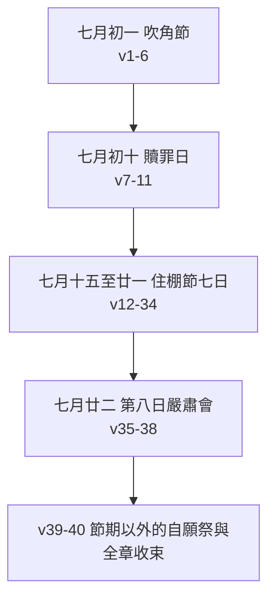

# 民數記 第29章

<!-- chapter-navigation:start -->
| [前一章](../04%20民數記/第28章.md) | [回目錄](../04%20民數記/全書目錄及綱要.md) | [下一章](../04%20民數記/第30章.md) |
| :--- | :---: | ---: |
<!-- chapter-navigation:end -->

1. [[吹角節（七月初一）|七月初一日]]，你們當有[[聖會]]；什麼[[勞碌的工（a.vo.dah）|勞碌的工]]都不可做，是你們當守為[[吹角的日子（te.ru.'Ah）|吹角的日子]]。
2. 你們要將[[公牛犢]]一隻，[[公綿羊]]一隻，[[沒有殘疾的祭牲|沒有殘疾]]、一歲的公羊羔七隻，作為[[馨香之氣|馨香]]的[[燔祭]]獻給耶和華。
3. 同獻的[[素祭（minchah）|素祭]]用調油的[[細麵]]；為一隻[[公牛犢|公牛]]要獻[[伊法]]十分之三；為一隻公羊要獻伊法十分之二；
4. 為那七隻羊羔，每隻要獻[[伊法]]十分之一。
5. 又獻一隻[[鬼魔（seirim，公山羊）|公山羊]]作[[贖罪祭]]，為你們贖罪。
6. 這些是在[[月朔]]的[[燔祭]]和同獻的[[素祭（minchah）|素祭]]，並[[每日獻祭（常獻燔祭）|常獻的燔祭]]與同獻的素祭，以及照例同獻的[[奠酒|奠祭]]以外，都作為[[馨香之氣|馨香]]的[[火祭（isheh）|火祭]]獻給耶和華。
7. [[大贖罪日（Yom Kippur）條例|七月初十日]]，你們當有[[聖會]]；要[[刻苦己心（禁食悔改）|刻苦己心]]，[[一切的工（me.la.khah）|什麼工都不可做]]。
8. 只要將[[公牛犢]]一隻，[[公綿羊]]一隻，一歲的公羊羔七隻，都要[[沒有殘疾的祭牲|沒有殘疾]]的，作為[[馨香之氣|馨香]]的[[燔祭]]獻給耶和華。
9. 同獻的[[素祭（minchah）|素祭]]用調油的[[細麵]]：為一隻[[公牛犢|公牛]]要獻[[伊法]]十分之三；為一隻公羊要獻伊法十分之二；
10. 為那七隻羊羔，每隻要獻[[伊法]]十分之一。
11. 又獻一隻[[鬼魔（seirim，公山羊）|公山羊]]為[[贖罪祭]]。[[贖罪日的贖罪祭（ki.pu.Rim）|這是在贖罪祭和常獻的燔祭]]，[[節期祭物層層累加|與同獻的素祭並同獻的奠祭以外]]。
12. [[住棚節（利23節期規定）|七月十五日]]，你們當有[[聖會]]；什麼[[勞碌的工（a.vo.dah）|勞碌的工]]都不可做，要向耶和華[[守節|守節七日]]。
13. 又要將[[住棚節公牛逐日遞減|公牛犢十三隻]]，[[公綿羊]]兩隻，一歲的公羊羔十四隻，都要[[沒有殘疾的祭牲|沒有殘疾]]的，用火獻給耶和華為[[馨香之氣|馨香]]的[[燔祭]]。
14. 同獻的[[素祭（minchah）|素祭]]用調油的[[細麵]]；為那十三隻[[公牛犢|公牛]]，每隻要獻[[伊法]]十分之三；為那兩隻公羊，每隻要獻伊法十分之二；
15. 為那十四隻羊羔，每隻要獻[[伊法]]十分之一。
16. 並獻一隻[[鬼魔（seirim，公山羊）|公山羊]]為[[贖罪祭]]，這是在[[每日獻祭（常獻燔祭）|常獻的燔祭]]和同獻的[[素祭（minchah）|素祭]]並同獻的[[奠酒|奠祭]]以外。
17. 第二日要獻[[公牛犢]]十二隻，[[公綿羊]]兩隻，[[沒有殘疾的祭牲|沒有殘疾]]、一歲的公羊羔十四隻；
18. 並為[[公牛犢|公牛]]、公羊，和羊羔，按數照例，獻同獻的[[素祭（minchah）|素祭]]和同獻的[[奠酒|奠祭]]。
19. 又要獻一隻[[鬼魔（seirim，公山羊）|公山羊]]為[[贖罪祭]]。這是在[[每日獻祭（常獻燔祭）|常獻的燔祭]]和同獻的[[素祭（minchah）|素祭]]並同獻的[[奠酒|奠祭]]以外。
20. 第三日要獻[[公牛犢|公牛]]十一隻，公羊兩隻，[[沒有殘疾的祭牲|沒有殘疾]]、一歲的公羊羔十四隻；
21. 並為[[公牛犢|公牛]]、公羊，和羊羔，按數照例，獻同獻的[[素祭（minchah）|素祭]]和同獻的[[奠酒|奠祭]]。
22. 又要獻一隻[[鬼魔（seirim，公山羊）|公山羊]]為[[贖罪祭]]。這是在[[每日獻祭（常獻燔祭）|常獻的燔祭]]和同獻的[[素祭（minchah）|素祭]]並同獻的[[奠酒|奠祭]]以外。
23. 第四日要獻[[公牛犢|公牛]]十隻，公羊兩隻，[[沒有殘疾的祭牲|沒有殘疾]]、一歲的公羊羔十四隻；
24. 並為[[公牛犢|公牛]]、公羊，和羊羔，按數照例，獻同獻的[[素祭（minchah）|素祭]]和同獻的[[奠酒|奠祭]]。
25. 又要獻一隻[[鬼魔（seirim，公山羊）|公山羊]]為[[贖罪祭]]。這是在[[每日獻祭（常獻燔祭）|常獻的燔祭]]和同獻的[[素祭（minchah）|素祭]]並同獻的[[奠酒|奠祭]]以外。
26. 第五日要獻[[公牛犢|公牛]]九隻，公羊兩隻，[[沒有殘疾的祭牲|沒有殘疾]]、一歲的公羊羔十四隻；
27. 並為[[公牛犢|公牛]]、公羊，和羊羔，按數照例，獻同獻的[[素祭（minchah）|素祭]]和同獻的[[奠酒|奠祭]]。
28. 又要獻一隻[[鬼魔（seirim，公山羊）|公山羊]]為[[贖罪祭]]。這是在[[每日獻祭（常獻燔祭）|常獻的燔祭]]和同獻的[[素祭（minchah）|素祭]]並同獻的[[奠酒|奠祭]]以外。
29. 第六日要獻[[公牛犢|公牛]]八隻，公羊兩隻，[[沒有殘疾的祭牲|沒有殘疾]]、一歲的公羊羔十四隻；
30. 並為[[公牛犢|公牛]]、公羊，和羊羔，按數照例，獻同獻的[[素祭（minchah）|素祭]]和同獻的[[奠酒|奠祭]]。
31. 又要獻一隻[[鬼魔（seirim，公山羊）|公山羊]]為[[贖罪祭]]。這是在[[每日獻祭（常獻燔祭）|常獻的燔祭]]和同獻的[[素祭（minchah）|素祭]]並同獻的[[奠酒|奠祭]]以外。
32. 第七日要獻[[公牛犢|公牛]]七隻，公羊兩隻，[[沒有殘疾的祭牲|沒有殘疾]]、一歲的公羊羔十四隻；
33. 並為[[公牛犢|公牛]]、公羊，和羊羔，按數照例，獻同獻的[[素祭（minchah）|素祭]]和同獻的[[奠酒|奠祭]]。
34. 又要獻一隻[[鬼魔（seirim，公山羊）|公山羊]]為[[贖罪祭]]。這是在[[每日獻祭（常獻燔祭）|常獻的燔祭]]和同獻的[[素祭（minchah）|素祭]]並同獻的[[奠酒|奠祭]]以外。
35. [[住棚節第八日的嚴肅會|第八日]]你們當有[[嚴肅會（a.Tze.ret）|嚴肅會]]；什麼[[勞碌的工（a.vo.dah）|勞碌的工]]都不可做；
36. 只要將[[公牛犢|公牛]]一隻，公羊一隻，[[沒有殘疾的祭牲|沒有殘疾]]、一歲的公羊羔七隻作[[火祭（isheh）|火祭]]，獻給耶和華為[[馨香之氣|馨香]]的[[燔祭]]；
37. 並為[[公牛犢|公牛]]、公羊，和羊羔，按數照例，獻同獻的[[素祭（minchah）|素祭]]和同獻的[[奠酒|奠祭]]。
38. 又要獻一隻[[鬼魔（seirim，公山羊）|公山羊]]為[[贖罪祭]]。這是在[[每日獻祭（常獻燔祭）|常獻的燔祭]]和同獻的[[素祭（minchah）|素祭]]並同獻的[[奠酒|奠祭]]以外。
39. 這些祭要在你們的[[所定的節期（mo.'ed）|節期]]獻給耶和華，都在[[許願|所許的願]]並[[甘心樂意的奉獻|甘心所獻]]的以外，作為你們的[[燔祭]]、[[素祭（minchah）|素祭]]、[[奠酒|奠祭]]，和[[平安祭]]。
40. 於是，[[摩西]]照耶和華所吩咐他的一切話告訴以色列人。

---

## 本章知識節點

### 節期架構
- [[七月的三個節期]]
- [[以獻祭安排時間]]
- [[群體性獻祭]]
- [[聖會]]
- [[勞碌的工（a.vo.dah）]]
- [[所定的節期（mo.'ed）]]
- [[耶和華的節期年曆總覽（利未記23章七大節期架構）]]
- [[七是節期中最要緊的數目]]

### 吹角節（v1-6）
- [[吹角節（七月初一）]]
- [[吹角的日子（te.ru.'Ah）]]
- [[銀號]]
- [[銀號與主再來天使吹號（太24：31）]]
- [[宗教曆與民事曆兩種曆法]]
- [[月朔]]

### 贖罪日（v7-11）
- [[大贖罪日（Yom Kippur）條例]]
- [[贖罪日的節期獻祭（民29：7-11）]]
- [[刻苦己心（禁食悔改）]]
- [[一切的工（me.la.khah）]]
- [[贖罪日的贖罪祭（ki.pu.Rim）]]

### 住棚節（v12-38）
- [[住棚節（利23節期規定）]]
- [[守節]]
- [[住棚節公牛逐日遞減]]
- [[公牛逐日遞減的原因之爭]]
- [[住棚節第八日的嚴肅會]]
- [[嚴肅會（a.Tze.ret）]]
- [[七十的屬靈意義]]
- [[三大節期]]
- [[住棚裡是棚或帳的難題]]
- [[安息日]]

### 祭物種類與分量
- [[燔祭]]
- [[素祭（minchah）]]
- [[奠酒]]
- [[贖罪祭]]
- [[火祭（isheh）]]
- [[馨香之氣]]
- [[每日獻祭（常獻燔祭）]]
- [[沒有殘疾的祭牲]]
- [[細麵]]
- [[公牛犢]]
- [[公綿羊]]
- [[鬼魔（seirim，公山羊）]]
- [[伊法]]

### 自願獻祭與全章收束
- [[平安祭]]
- [[許願]]
- [[甘心樂意的奉獻]]
- [[全年為全會眾所獻祭牲總數]]
- [[節期祭物層層累加]]
- [[節期祭物詳情另見民數記28-29章]]
- [[民29：40 在希伯來聖經屬民30：1]]
- [[摩西]]

---

## 本章整理

### 一個月裡塞進三個節期（v1-40）

民28 已經把每日、每安息日、每月朔，一路到春天的逾越節與七七節都列完了。本章只講一個月：[[七月的三個節期|七月]]。初一、初十、十五各有一個節期，而最後那個一擺就是八天。GT 丁良才算過這筆帳——「七月中有節期的日子，比全年其餘各月之節期的日子更多。」

為什麼全擠在七月，各家給的角度不同，卻可以疊在一起看。GT《民數記串珠聖經註釋》從農事講：「七月是適合休息和慶祝的時間，因為莊稼已經收成了」。GT《聖經精讀本》從百姓的狀況講，說把三個節期集中在一個月，是「為了振作以色列百姓屬靈的士氣,使他們盡情享受從神得到的一切祝福和恩典」。KingComments 則注意到上下半年的分工：「第一組主要應用在教會身上，第二組則對以色列有特別的意義。」

三個節期的次序也不是隨手排的。GT《聖經精讀本》說初一的吹角「同時也是預告贖罪日的悔改(十日)和住棚節的慶典(十五日)」——先被叫醒，再認罪，最後才慶祝。

三個節期日都要有[[聖會]]，都禁工，也都在每日[[每日獻祭（常獻燔祭）|常獻的燔祭]]之上再加祭物——[[節期祭物層層累加|「以外」這個詞在本章出現了十次]]。BibleHub 用 layered nature（層層相疊）形容這個結構：節期的祭從來不取代日常的祭，只往上加。

### 吹角的日子：七月初一（v1-6）

和合本說這天「當守為[[吹角的日子（te.ru.'Ah）|吹角的日子]]」，但原文其實沒有提到任何樂器。STEP 顯示這個名字只有兩個字：H3117G Yom（日子）加 H8643 te.ru.'Ah，本節譯義是「[the] sound of a loud blast」，簡明字義作 shout——大聲呼喊。

同一個 te.ru.'Ah 在民數記另外出現三次，場合完全不同：民10:5-6 是拔營的號令，民23:21 是巴蘭遠遠看見的營中歡呼「有歡呼王的聲音在他們中間」，民31:6 則是非尼哈出戰時「手裡拿著聖所的器皿和吹大聲的號筒」。行軍、敬拜、爭戰、過節，共用同一種聲音。

至於當天吹的到底是什麼，四套註釋沒有統一答案。CT 說「吹角的用意是宣告喜樂的消息，號召四散的以色列人聚集」；GT《民數記串珠聖經註釋》說「此日吹角是宣告快樂的日子臨到（10:10），百姓當守聖會」；GT《舊約聖經背景註釋》說是公綿羊的角；GT 丁良才則記下當日兩種聲音都有——「有猶太的注釋家說，當那一日，除了祭司所吹的銀號筒以外，有百姓從日出到日落吹角。」提到[[銀號]]的正是這一句。

這一天還壓著兩套曆法。GT《啟導本聖經註釋》說「本節的『七月初一』乃民事曆的年首」，丁良才則說它是「聖年七月初一號，就是常年的正月初一」——同一天在[[宗教曆與民事曆兩種曆法|一套曆裡是七月，在另一套裡是元旦]]。BibleHub 也說希伯來曆的七月是提斯利月，通常落在九月或十月。因為既是初一又是節期，v6 特別交代這天的祭是在[[月朔]]的燔祭之外再加的。

### 刻苦己心的一天：七月初十（v7-11）

贖罪日的祭牲數目和吹角節一模一樣：公牛犢一隻、公綿羊一隻、一歲的公羊羔七隻，外加一隻公山羊。真正的差別在兩個地方，而且兩處都要看原文才看得清楚。

第一，禁工的範圍不同。v1、12、35 寫的是「什麼勞碌的工都不可做」，原文是 kol- me.Le.khet 'a.vo.Dah，STEP 把這兩個字分別標為 work of 與 servitude——被禁的是服役性質的工。v7 寫的卻是「什麼工都不可做」，原文只有 [[一切的工（me.la.khah）|kol- me.la.Khah]]，少掉 'a.vo.Dah 這個限定字，譯義只有 work。中文用「什麼工」與「什麼勞碌的工」區分的，正是原文本來就有的兩種寫法。CT 解釋前一種是「指身體勞動的工，例如建築、紡織、收割、打榖、推磨等」。GT《聖經精讀本》另外提醒不要把禁工讀成貶低工作：「聖經說勞動是神的命令,是人的神聖義務(創3:19;帖後3:10)。」

第二，這天有兩份贖罪祭。v11 先說要獻一隻公山羊為贖罪祭，緊接著說「這是在贖罪祭和常獻的燔祭，與同獻的素祭並同獻的奠祭以外」——那個「以外」所指的贖罪祭，STEP 標為 cha.Tat ha./ki.pu.Rim（H2403H＋H3725），直譯是[[贖罪日的贖罪祭（ki.pu.Rim）|那贖罪的贖罪祭]]，就是利16 大祭司帶進至聖所的那一份。GT 丁良才從這裡讀出舊約祭牲的限度：「這贖罪祭在利十六章上所記的以外，表明牛羊的血不能完全贖罪。」CT 則把重點放在行政層面，說這隻公山羊「是專為贖罪日的贖罪祭之用」，其餘日常的祭照舊規矩辦，不計算在內。

至於「[[刻苦己心（禁食悔改）|刻苦己心]]」，STEP 標為 H6031B 的 Piel 動詞加上 naf.sho.tei/Khem（你們的魂），GT 丁良才說「這吩咐，大概也包括禁食的意思。雖然摩西五經上沒有提到這事，以色列人當大贖罪日也禁食（徒二十七9）」；BibleHub 也說這句話傳統上理解為「禁食、苦待自己的魂」。KingComments 讀的是這一天的心境：「贖罪日表達出神重新對待祂地上子民的第一個果效。」利16 記的是至聖所裡發生的事，本段補上同一天壇上的[[贖罪日的節期獻祭（民29：7-11）|節期祭]]，兩處相加才是[[大贖罪日（Yom Kippur）條例|贖罪日]]的全貌。

### 八天、七十隻公牛的住棚節（v12-38）

v12 說要「向耶和華[[守節]]七日」，原文是同源的動詞加名詞（ve./cha.go.Tem chag），CT 也註明這是原文雙字，首字是過節、次字是節慶集會。[[住棚節（利23節期規定）|住棚節]]是全年最後一個節期，也是[[三大節期|三大朝聖節期]]之一；BibleHub 說這節男丁都要上耶路撒冷朝見耶和華。GT 串珠說百姓要在[[住棚裡是棚或帳的難題|帳棚裡住七天]]紀念祖先出埃及後的日子，GT《舊約聖經背景註釋》則說那象徵是「建築以綠葉為裝飾的棚，讓收割者可以休息」。

本章真正花篇幅的是數字。七天裡只有[[住棚節公牛逐日遞減|公牛]]每天變，其餘一律不動：

| 日次 | 節 | 公牛 | 公綿羊 | 一歲公羊羔 | 贖罪祭公山羊 |
|---|---|---:|---:|---:|---:|
| 第一日 | v13 | 13 | 2 | 14 | 1 |
| 第二日 | v17 | 12 | 2 | 14 | 1 |
| 第三日 | v20 | 11 | 2 | 14 | 1 |
| 第四日 | v23 | 10 | 2 | 14 | 1 |
| 第五日 | v26 | 9 | 2 | 14 | 1 |
| 第六日 | v29 | 8 | 2 | 14 | 1 |
| 第七日 | v32 | 7 | 2 | 14 | 1 |
| 第八日 | v36 | 1 | 1 | 7 | 1 |

七天的公牛加起來正好[[七十的屬靈意義|七十隻]]。GT 丁良才：「每天減去一隻，到七天有七隻，共有七十只。」CT 說「住棚節中所獻的祭牲，是全年所有的節期中最多的」；GT《舊約聖經背景註釋》連八天一起算，得出「七十一隻公牛、十五隻公羊、一百零五隻羊羔、八隻山羊」。KingComments 形容這個規模：「在這最後一個節期上，彷彿又加上一道祭物的浪潮。」

**為什麼要遞減，經文一個字都沒說**，這正是本章分歧最大的地方。

| 來源 | 對遞減的解釋 |
|---|---|
| GT《舊約聖經背景註釋》 | 「理由可能是反映時間的過去，或免得國家最貴重的牲口過度損耗。」 |
| KingComments | 隨和平國度的時日過去，人對基督之祭的賞識會漸漸減退；但遞減最多只到第七日的七隻為止 |
| BibleHub | 祭物數目每日遞減，象徵神供應的完成與成全 |
| GT《聖經精讀本》 | 不解釋遞減，只說七十隻的總數「表示對神完全的奉獻和忠心」 |
| CT | 只記數字怎麼變，不給理由 |

同一個現象被讀成牲口的實務成本、賞識的減退、供應的成全、對神的忠心——[[公牛逐日遞減的原因之爭|四種落點都在，經文沒有替其中任何一種背書]]。

七天過完還有一天。v35 的「[[嚴肅會（a.Tze.ret）|嚴肅會]]」在原文是 'a.Tze.ret，和前面三次的「聖會」（mik.ra' ko.desh）不是同一個詞，而且整卷民數記只出現這一次。[[住棚節第八日的嚴肅會|這一天]]的祭牲回到節期開頭的規格，GT 丁良才說「第八日所獻的和七月初一初十日所獻的一樣」，KingComments 也說「第八日所獻的祭與贖罪日所獻的相同」。祭獻得最少，地位卻最高——丁良才：「在第八日所獻的祭，雖是這樣少，這日仍算為住棚節最大的日子（約七37）。」CT 說這天視同[[安息日]]，百姓要到會幕前聚集；KingComments 讀出的是另一層：「然而還有第八日。這說出一個新的開始，也說出一個沒有終結的開始。」

### 祭物的配比與計量（v2-38）

不管哪一天，一套祭的組成都一樣：[[燔祭]]為主，配上[[素祭（minchah）|素祭]]與[[奠酒|奠祭]]，再加一隻[[鬼魔（seirim，公山羊）|公山羊]]作[[贖罪祭]]。祭牲一律要[[沒有殘疾的祭牲|沒有殘疾]]（STEP 標 te.mi.Mim，本節譯義 unblemished），成品稱為[[馨香之氣|馨香]]的[[火祭（isheh）|火祭]]——v13 的原文是 'i.Sheh Rei.ach ni.Cho.ach 三個字串成的構造鏈，直譯是舒暢香氣的火祭。

素祭的分量按祭牲大小走：[[公牛犢|公牛]]三份、[[公綿羊|公羊]]兩份、羊羔一份，材料一律是[[細麵|調油的細麵]]。這裡有個容易讀漏的地方：和合本寫「[[伊法]]十分之三」，但 STEP 顯示本章十二處全都只有 H6241 'es.ro.Nim（十分之一），整章沒有出現「伊法」這個字，伊法是中文譯本補出的基準單位。CT 給的換算是：十分之三約六點六公升，十分之二約四點四公升，十分之一約二點二公升。

### 節期以外的，與全章的收束（v39-40）

v39 把整套條例收在一句話裡：這些祭要在「你們的[[所定的節期（mo.'ed）|節期]]」獻上，都在[[許願|所許的願]]並[[甘心樂意的奉獻|甘心所獻]]的以外。STEP 把這一節標得很整齊——「節期」是 mo.'a.dei/Khem（H4150H，字義 meeting: festival），「所許的願」是 ne.der，「甘心所獻」是 ne.da.vah，後面接的四種祭依序是燔祭、素祭、奠祭、[[平安祭]]。義務與自願分屬兩層：GT 串珠說「以上兩章主要記述節日當獻的祭物，這些是神清楚指明的（39），是必須獻上的。至於自願或許願獻的祭則是額外的，不在此列」，這正是本章屬於[[群體性獻祭|全民公共祭]]的原因。KingComments 從神那一面說同一件事：「祂也尋找那些以甘心的敬拜親近祂的心。」

丁良才在這裡做了一次[[全年為全會眾所獻祭牲總數|全年總結]]：按民28-29 所記，每年為全會眾要獻公牛犢一百十三隻、公綿羊三十七隻、公羊羔一千零六十七隻、公山羊三十只，總共一千二百四十七隻，逾越節另外還有許多羊羔不計在內。這也說明了為什麼[[節期祭物詳情另見民數記28-29章|這兩章要放在一起讀]]——[[以獻祭安排時間|時間表在民28，七月的細目在本章]]。

最後一節「於是，[[摩西]]照耶和華所吩咐他的一切話告訴以色列人」，位置本身就有講究。CT 指出[[民29：40 在希伯來聖經屬民30：1|希伯來文聖經把它放在民三十章的第一節]]，當作下一章的序言。放在這裡，它是民28-29 全套節期條例的收束；放在那裡，它就成了許願條例的開場白。

**參考資料**
https://www.ccbiblestudy.org/Old%20Testament/04Num/04CT29.htm
https://www.ccbiblestudy.org/Old%20Testament/04Num/04GT29.htm
https://www.kingcomments.com/en/bible-studies/Num/29
https://biblehub.com/study/numbers/29.htm
https://github.com/STEPBible/STEPBible-Data

<!-- chapter-navigation:start -->
| [前一章](../04%20民數記/第28章.md) | [回目錄](../04%20民數記/全書目錄及綱要.md) | [下一章](../04%20民數記/第30章.md) |
| :--- | :---: | ---: |
<!-- chapter-navigation:end -->
