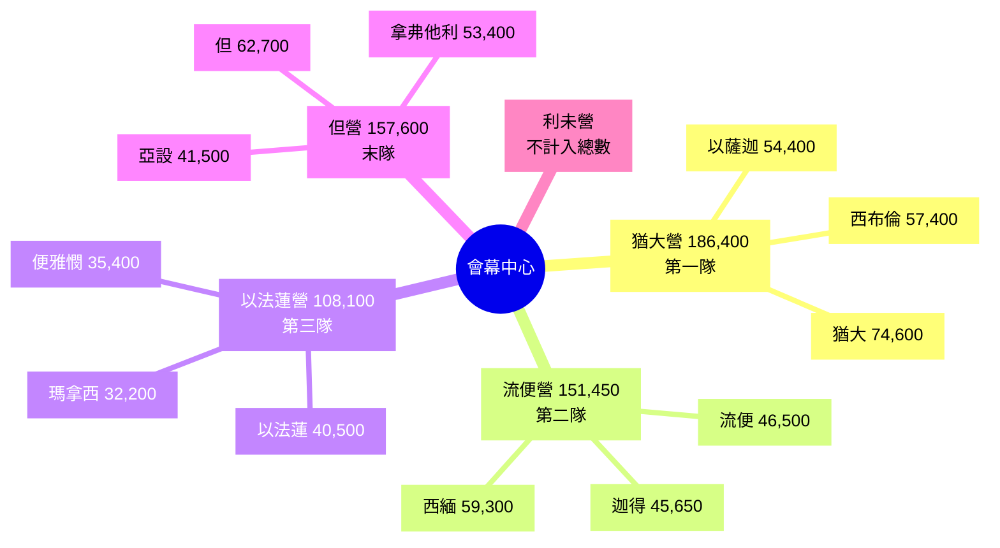

# 民數記 第2章

1. [[亞倫|耶和華曉諭摩西、亞倫]]說：
2. [[以色列|以色列人要]]各歸自己的纛下，在本族的旗號那裡，對著會幕的四圍[[安營]]。
3. 在東邊，[[東邊|向日出之地]]，[[軍隊|照著軍隊]][[安營]]的是[[猶大（雅各之子）|猶大]]營的纛。有亞米拿達的兒子拿順作猶大人的首領。
4. 他[[軍隊|軍隊被數的]]，共有七萬四千六百名。
5. 挨著他[[安營]]的是[[以薩迦（價值）|以薩迦支派]]。有蘇押的兒子[[以薩迦（價值）|拿坦業]]作以薩迦人的首領。
6. 他[[軍隊|軍隊被數的]]，共有五萬四千四百名。
7. 又有[[西布倫（同住）|西布倫支派]]。希倫的兒子[[西布倫（同住）|以利押]]作西布倫人的首領。
8. 他[[軍隊|軍隊被數的]]，共有五萬七千四百名。
9. 凡屬[[猶大（雅各之子）|猶大]]營、[[軍隊|按著軍隊]]被數的，共有十八萬六千四百名，要[[第一隊往前行|作第一隊往前行]]。
10. [[南邊|在南邊]]，[[軍隊|按著軍隊]]是[[流便]]營的纛。有示丟珥的兒子以利蓿作流便人的首領。
11. 他[[軍隊|軍隊被數的]]，共有四萬六千五百名。
12. 挨著他[[安營]]的是[[西緬|西緬支派]]。蘇利沙代的兒子[[西緬|示路蔑]]作西緬人的首領。
13. 他[[軍隊|軍隊被數的]]，共有五萬九千三百名。
14. 又有[[迦得（萬幸）|迦得支派]]。丟珥的兒子[[迦得（萬幸）|以利雅薩]]作迦得人的首領。
15. 他[[軍隊|軍隊被數的]]，共有四萬五千六百五十名，
16. 凡屬[[流便]]營、[[軍隊|按著軍隊]]被數的，共有十五萬一千四百五十名，要[[第二隊往前行|作第二隊往前行]]。
17. 隨後，會幕要[[起行|往前行]]，有[[利未人|利未營]]在諸營中間。[[他們怎樣安營就怎樣往前行]]，[[各按本位，各歸本纛]]。
18. [[西邊|在西邊]]，[[軍隊|按著軍隊]]是[[以法蓮]]營的纛。亞米忽的兒子以利沙瑪作以法蓮人的首領。
19. 他[[軍隊|軍隊被數的]]，共有四萬零五百名。
20. 挨著他的是[[瑪拿西|瑪拿西支派]]。比大蓿的兒子[[瑪拿西|迦瑪列]]作瑪拿西人的首領。
21. 他[[軍隊|軍隊被數的]]，共有三萬二千二百名。
22. 又有[[便雅憫|便雅憫支派]]。基多尼的兒子[[便雅憫|亞比但]]作便雅憫人的首領。
23. 他[[軍隊|軍隊被數的]]，共有三萬五千四百名。
24. 凡屬[[以法蓮]]營、[[軍隊|按著軍隊]]被數的，共有十萬零八千一百名，要[[第三隊往前行|作第三隊往前行]]。
25. [[北邊|在北邊]]，[[軍隊|按著軍隊]]是[[但（審判）|但]]營的纛。亞米沙代的兒子亞希以謝作但人的首領。
26. 他[[軍隊|軍隊被數的]]，共有六萬二千七百名。
27. 挨著他[[安營]]的是[[亞設（有福）|亞設支派]]。俄蘭的兒子[[亞設（有福）|帕結]]作亞設人的首領。
28. 他[[軍隊|軍隊被數的]]，共有四萬一千五百名。
29. 又有[[拿弗他利|拿弗他利支派]]。以南的兒子[[拿弗他利|亞希拉]]作拿弗他利人的首領。
30. 他[[軍隊|軍隊被數的]]，共有五萬三千四百名。
31. 凡[[但（審判）|但]]營被數的，共有十五萬七千六百名，要[[各按本位，各歸本纛|歸本纛]][[末隊往前行|作末隊往前行]]。
32. 這些[[以色列|以色列人]]，[[總人數統計|照他們的宗族]]，[[總人數統計|按他們的軍隊]]，在諸營中被數的，共有[[總人數統計|六十萬零三千五百五十名]]。
33. 惟獨[[利未人]]沒有數在[[以色列|以色列人]]中，是照耶和華[[照耶和華所吩咐摩西的|所吩咐摩西的]]。
34. [[以色列|以色列人]][[以色列人就這樣行|就這樣行]]，各人照他們的家室、宗族歸於本纛，[[安營]][[起行]]，都是照耶和華[[照耶和華所吩咐摩西的|所吩咐摩西的]]。

<!-- fhl-map-links:start -->
## 相關地圖

- [[appendix/fhl_maps/maps/019|〈出圖二〉以色列人出埃及到西乃山]]
- [[appendix/fhl_maps/maps/020|〈民圖一〉從西乃山到加低斯]]
<!-- fhl-map-links:end -->

---

## 本章知識節點

### 神學
- [[會幕中心安營]]
- [[順服神吩咐]]
- [[十字架隊形]]
- [[起行次序]]

### 歷史地理
- [[東邊]]
- [[南邊]]
- [[西邊]]
- [[北邊]]
- [[會幕要往前行]]
- [[利未營在諸營中間]]

### 人物
- [[猶大（雅各之子）]]
- [[以薩迦（價值）]]
- [[西布倫（同住）]]
- [[流便]]
- [[西緬]]
- [[迦得（萬幸）]]
- [[以法蓮]]
- [[瑪拿西]]
- [[便雅憫]]
- [[但（審判）]]
- [[亞設（有福）]]
- [[拿弗他利]]
- [[利未人]]
- [[摩西]]
- [[亞倫]]
- [[以色列]]

### 制度
- [[纛與旗號]]
- [[四面安營條例]]
- [[安營]]
- [[軍隊]]
- [[總人數統計]]
- [[利未支派不被數點條例]]

### 事件
- [[起行]]
- [[第一隊往前行]]
- [[第二隊往前行]]
- [[第三隊往前行]]
- [[末隊往前行]]
- [[他們怎樣安營就怎樣往前行]]
- [[各按本位，各歸本纛]]
- [[以色列人就這樣行]]
- [[照耶和華所吩咐摩西的]]

### 圖像
- [[猶大營(東方第一隊)]]
- [[流便營(南方第二隊)]]
- [[以法蓮營(西方第三隊)]]
- [[但營(北方末隊)]]
- [[利未營在中間]]

---

## 本章整理

### 神命四面安營（v1-2）
耶和華曉諭[[摩西]]、[[亞倫]]，吩咐[[以色列]]人「各歸自己的[[纛]]下，在本族的[[旗號]]那裡，對著[[會幕中心安營]]的四圍[[安營]]」（v2）。這確立了[[四面安營條例]]的核心原則：[[會幕中心安營]]，十二支派按[[纛與旗號]]分列四方，[[利未營在諸營中間]]守護聖所。神不僅關心人數，更關心空間秩序——[[安營]]與[[起行]]皆要「[[各按本位，各歸本纛]]」（v17, 34），彰顯[[順服神吩咐]]的絕對性。

### 東方猶大營——領軍先鋒（v3-9）
| 位置 | 支派 | 首領 | 軍隊人數 |
|------|------|------|----------|
| 東方領隊 | [[猶大（雅各之子）]] | 亞米拿達兒子拿順 | 74,600 |
| 挨近猶大 | [[以薩迦（價值）]] | 蘇押兒子拿坦業 | 54,400 |
| 挨近以薩迦 | [[西布倫（同住）]] | 希倫兒子以利押 | 57,400 |
| **小計** | **[[猶大營(東方第一隊)]]** | | **186,400** |

[[猶大營(東方第一隊)]]總計 186,400 名，作「[[第一隊往前行]]」（v9）。猶大作長子權支派，領軍向東——日出之地，預表彌賽亞「獅子」從猶大興起。

### 南方流便營——次隊啟行（v10-16）
| 位置 | 支派 | 首領 | 軍隊人數 |
|------|------|------|----------|
| 南方領隊 | [[流便]] | 示丟珥兒子以利蓿 | 46,500 |
| 挨近流便 | [[西緬]] | 蘇利沙代兒子示路蔑 | 59,300 |
| 挨近西緬 | [[迦得（萬幸）]] | 丟珥兒子以利雅薩 | 45,650 |
| **小計** | **[[流便營(南方第二隊)]]** | | **151,450** |

[[流便營(南方第二隊)]]總計 151,450 名，作「[[第二隊往前行]]」（v16）。流便雖為長子，因犯罪失去領袖地位，位居南方次隊。

### 會幕與利未營居中（v17）
> [!important] 空間神學樞紐
> 「隨後，[[會幕要往前行]]，有[[利未營在諸營中間]]。他們怎樣[[安營]]就怎樣[[起行]]，[[各按本位，各歸本纛]]」（v17）。
> [[利未人]]不計入[[總人數統計]]（v33，參[[利未支派不被數點條例]]），專職看守會幕，體現「聖潔居中、百姓圍繞」的敬拜秩序。

### 西方以法蓮營——三隊繼進（v18-24）
| 位置 | 支派 | 首領 | 軍隊人數 |
|------|------|------|----------|
| 西方領隊 | [[以法蓮]] | 亞米忽兒子以利沙瑪 | 40,500 |
| 挨近以法蓮 | [[瑪拿西]] | 比大蓿兒子迦瑪列 | 32,200 |
| 挨近瑪拿西 | [[便雅憫]] | 基多尼兒子亞比但 | 35,400 |
| **小計** | **[[以法蓮營(西方第三隊)]]** | | **108,100** |

[[以法蓮營(西方第三隊)]]總計 108,100 名，作「[[第三隊往前行]]」（v24）。以法蓮為約瑟長子，蒙雅各交叉按手祝福，領西方隊。

### 北方但營——殿後末隊（v25-31）
| 位置 | 支派 | 首領 | 軍隊人數 |
|------|------|------|----------|
| 北方領隊 | [[但（審判）]] | 亞米沙代兒子亞希以謝 | 62,700 |
| 挨近但 | [[亞設（有福）]] | 俄蘭兒子帕結 | 41,500 |
| 挨近亞設 | [[拿弗他利]] | 以南兒子亞希拉 | 53,400 |
| **小計** | **[[但營(北方末隊)]]** | | **157,600** |

[[但營(北方末隊)]]總計 157,600 名，作「[[末隊往前行]]」（v31）。但支派人數最多，殿後防禦，顧全大軍安全。

### 總數統計與順服記載（v32-34）
十二支派[[軍隊]]總數 **603,550** 名（v32），與前章統計一致。[[利未人]]單獨歸神，不在其中（v33）。經文以「[[以色列人就這樣行]]……都是[[照耶和華所吩咐摩西的]]」（v34）作結，強調[[順服神吩咐]]是安營起行的唯一依據。

### 跨章脈絡：會幕中心的行軍神學
本章將[[十字架隊形]]（四方各三支派）與[[起行次序]]（東→南→中→西→北）定型，貫穿曠野四十年。[[會幕中心安營]]象徵神同在，[[利未營在中間]]守護聖所，十二支派如同活石圍繞靈宮。[[纛]]與[[旗號]]不僅軍事標識，更宣告神是我們的旌旗。新約啟示：基督為真會幕，教會在祂裏面被建造成為神居住的所在，行軍次序預表教會跟隨羔羊「無論往哪裡去都跟隨祂」。

**參考資料**
https://www.ccbiblestudy.org/Old%20Testament/04Num/04CT02.htm
https://www.ccbiblestudy.org/Old%20Testament/04Num/04GT02.htm
https://www.kingcomments.com/en/bible-studies/Num/2
https://biblehub.com/study/numbers/2.htm
