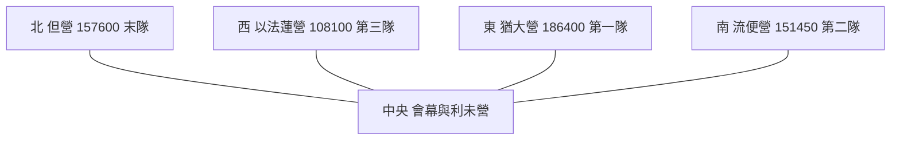

# 民數記 第2章

<!-- chapter-navigation:start -->
| [前一章](../04%20民數記/第1章.md) | [回目錄](../04%20民數記/全書目錄及綱要.md) | [下一章](../04%20民數記/第3章.md) |
| :--- | :---: | ---: |
<!-- chapter-navigation:end -->

1. 耶和華曉諭摩西、亞倫說：
2. 以色列人要[[安營與纛|各歸自己的纛下]]，在[[安營與纛|本族的旗號]]那裡，[[安營與纛|對著會幕的四圍安營]]。
3. 在東邊，向日出之地，[[以色列人的軍隊|照著軍隊安營]]的是[[猶大支派|猶大營的纛]]。有亞米拿達的兒子[[拿順]][[十二族長協助數點|作猶大人的首領]]。
4. 他軍隊被數的，共有七萬四千六百名。
5. 挨著他安營的是[[以薩迦（價值）|以薩迦]]支派。有蘇押的兒子拿坦業[[十二族長協助數點|作以薩迦人的首領]]。
6. 他軍隊被數的，共有五萬四千四百名。
7. 又有[[西布倫（同住）|西布倫]]支派。希倫的兒子以利押作西布倫人的首領。
8. 他軍隊被數的，共有五萬七千四百名。
9. 凡屬猶大營、[[以色列人的軍隊|按著軍隊被數的]]，共有十八萬六千四百名，要作[[行軍次序|第一隊往前行]]。
10. 在南邊，[[以色列人的軍隊|按著軍隊]]是[[流便|流便營的纛]]。有示丟珥的兒子以利蓿作流便人的首領。
11. 他軍隊被數的，共有四萬六千五百名。
12. 挨著他安營的是[[西緬]]支派。蘇利沙代的兒子示路蔑作西緬人的首領。
13. 他軍隊被數的，共有五萬九千三百名。
14. 又有[[迦得（萬幸）|迦得]]支派。丟珥的兒子以利雅薩作迦得人的首領。
15. 他軍隊被數的，共有四萬五千六百五十名，
16. 凡屬[[流便]]營、[[以色列人的軍隊|按著軍隊被數的]]，共有十五萬一千四百五十名，要作[[行軍次序|第二隊往前行]]。
17. 隨後，[[會幕（帳幕整體）|會幕要往前行]]，有[[利未支派|利未營在諸營中間]]。他們怎樣安營就怎樣往前行，各按本位，[[安營與纛|各歸本纛]]。
18. 在西邊，[[以色列人的軍隊|按著軍隊]]是[[以法蓮|以法蓮營的纛]]。亞米忽的兒子以利沙瑪作以法蓮人的首領。
19. 他軍隊被數的，共有四萬零五百名。
20. 挨著他的是[[瑪拿西]]支派。比大蓿的兒子迦瑪列作瑪拿西人的首領。
21. 他軍隊被數的，共有三萬二千二百名。
22. 又有[[便雅憫]]支派。基多尼的兒子亞比但作便雅憫人的首領。
23. 他軍隊被數的，共有三萬五千四百名。
24. 凡屬[[以法蓮]]營、[[以色列人的軍隊|按著軍隊被數的]]，共有十萬零八千一百名，要作[[行軍次序|第三隊往前行]]。
25. 在北邊，[[以色列人的軍隊|按著軍隊]]是[[但支派|但營的纛]]。亞米沙代的兒子亞希以謝作但人的首領。
26. 他軍隊被數的，共有六萬二千七百名。
27. 挨著他安營的是[[亞設（有福）|亞設]]支派。俄蘭的兒子帕結作亞設人的首領。
28. 他軍隊被數的，共有四萬一千五百名。
29. 又有[[拿弗他利]]支派。以南的兒子亞希拉作拿弗他利人的首領。
30. 他軍隊被數的，共有五萬三千四百名。
31. 凡但營被數的，共有十五萬七千六百名，要歸本纛作[[行軍次序|末隊往前行]]。
32. 這些以色列人，照他們的宗族，按他們的軍隊，在諸營中被數的，共有六十萬零三千五百五十名。
33. 惟獨[[利未支派|利未人沒有數在以色列人中]]，是照耶和華所吩咐摩西的。
34. 以色列人就這樣行，各人照他們的家室、宗族歸於本纛，[[行軍次序|安營起行]]，都是照耶和華所吩咐摩西的。

---

## 本章知識節點

### 主題
- [[安營與纛]]
- [[會幕（帳幕整體）]]

### 事件
- [[行軍次序]]
- [[十二族長協助數點]]
- [[六十萬零三千五百五十人（出38：26）]]

### 人物
- [[利未支派]]
- [[猶大支派]]
- [[流便]]
- [[以法蓮]]
- [[但支派]]
- [[瑪拿西]]
- [[便雅憫]]
- [[西緬]]
- [[拿弗他利]]
- [[拿順]]
- [[以薩迦（價值）]]
- [[西布倫（同住）]]
- [[迦得（萬幸）]]
- [[亞設（有福）]]

### 神學
- [[神的同在]]
- [[十二支派起源]]
- [[以色列人的軍隊]]

### 解經爭議
- [[六十萬人的數目]]

---

## 本章整理

### 一句命令，一個中心（v1-2）

第二章接著第一章往下走：人數點完了，接著要決定每個人站在哪裡。神的吩咐只有一句話，卻定了三件事——「以色列人要各歸自己的[[安營與纛|纛]]下，在本族的旗號那裡，對著[[會幕（帳幕整體）|會幕]]的四圍安營」（v2）：各歸本纛、按本族旗號、環繞會幕。

這一句和合本用的三個詞，在原文是三個不同的字：

| 和合本 | STEP 原形 | Strong | 詞典義 | 本章出現 |
|---|---|---|---|---|
| 纛 | דֶּ֫גֶל（de.gel） | H1714 | standard | 8 次 |
| 旗號 | אוֹת（ot） | H226H | sign、indicator | v2 |
| 對著 | נֶ֫גֶד（ne.ged） | H5048 | before | v2 |

CT 的原文字義也把前兩者分開注：「纛」作旗幟、軍旗，「旗號」作記號、旗幟。而「對著」那個帶前置詞的寫法（STEP 逐字譯作「from／before」），正對應 GT《啟導本》所說「對著會幕」也可譯為「與會幕間有相當距離」——該註釋並引約書亞記三4，說約櫃與支派安營間的距離為二千肘（約一千公尺）。

纛上究竟畫什麼，經文一個字也沒說。GT《民數記串珠聖經註釋》講得很老實：「領導支派的纛及各族的旗號是什麽模樣的，聖經未有記載」，接著才依猶太人的傳統補上。GT《聖經精讀本》給的版本更細，連底色和理由都有：

| 方位 | 支派 | 串珠版 | 精讀本版（含底色） | 精讀本給的理由 |
|---|---|---|---|---|
| 東 | 猶大 | 獅子 | 畫著獅子的綠旗 | 依雅各「猶大是個小獅子」（創49:9） |
| 南 | 流便 | 人首 | 畫著人的紅旗 | 流便作為長子是家族的頭 |
| 西 | 以法蓮 | 牛 | 畫著牛犢的黃旗 | 約瑟解開牛夢，救埃及與以色列脫離饑荒 |
| 北 | 但 | 鷹 | 畫著鷹的紅白旗 | 但不喜歡被描述成蛇（創49:17），選了蛇的天敵鷹 |

同一份註釋還整理出舊約表示旗幟的三個詞，用法各不相同：

- **旌旗**：表示集體或特定的團體，或指打仗時的軍號
- **大旗**：有標竿的意思，指人們聚集的地方或所關心的地方
- **旗**：意思與旌旗類似，但旌旗用於很多會眾或軍隊，這個詞用於較少的會眾或家族

BH 從古代近東的通例看這件事：用旗幟編組在當時很普遍，既維持行進與安營的秩序，也讓各支派在共同身分之下保有自己的識別；它並把「纛」接到雅歌二4「以愛為旗」，指出旗幟在聖經裡也能象徵神的同在與引導。

KC 則從纛引出一段對今日的話，方向和上面幾家都不同。他說在基督教界高舉的旗幟並不造成合一，反而造成分裂——有人用一個人的名字立旗，有人用一套教義立旗，凡贊同的就聚到那面旗下，而「每一面旗都是把自己與別人分別開來的旗，那不是神所要的」。在他看來神所立的中心只有一個，就是主耶穌，那真正的會幕，祂要把四散的兒女聚集為一；祂自己就是那面「超乎萬人之上」的旗（歌5:10）。

### 四個方位，四種讀法（v3-31）

經文按東、南、西、北的順序排完十二支派。四個方位在原文裡用的字並不成套，各有各的來歷：

| 方位 | STEP 原形 | Strong | 詞典義 | 註釋家從字面讀出的意思 |
|---|---|---|---|---|
| 東 | קֵ֫דֶם（qe.dem）＋מִזְרָח（miz.rach） | H6924B、H4217H | east（兩個字） | 和合本「在東邊，向日出之地」各對一個 |
| 南 | תֵּימָן（te.man） | H8486 | south | KC 讀作「右邊」；精讀本說右邊意味力量與祝福 |
| 西 | יָם（yam） | H3220H | sea、west | KC 讀作「海的那一邊」——STEP 義域同列兩義 |
| 北 | צָפוֹן（tsa.phon） | H6828G | north | KC 讀作「隱藏」 |

註釋家從這些字讀出來的東西差別不小，下面逐面看。

| 方位 | 領頭支派 | 同營支派 | 母系 | 人數 | 起行 |
|---|---|---|---|---|---|
| 東 | 猶大 | 以薩迦、西布倫 | 利亞所生 | 186,400 | 第一隊 |
| 南 | 流便 | 西緬、迦得 | 利亞所生＋悉帕所生 | 151,450 | 第二隊 |
| 西 | 以法蓮 | 瑪拿西、便雅憫 | 拉結所生／所出 | 108,100 | 第三隊 |
| 北 | 但 | 亞設、拿弗他利 | 辟拉、悉帕所生 | 157,600 | 末隊 |

**東邊（v3-9）。** 這一句和合本譯作「在東邊，向日出之地」，看起來像同義重複，其實原文確實是兩個不同的字：STEP 顯示一個原形是 קֵ֫דֶם（qe.dem，H6924B），另一個是 מִזְרָח（miz.rach，H4217H），兩個都譯作「east」。CT 解釋這個方位為什麼重要：「會幕門口即面向東邊（出27:13,16），摩西和亞倫也安營在東邊的內層安營，可見是最重要的方位。」GT《聖經精讀本》說[[猶大支派]]站在行軍行列的前面，預表耶穌站在全人類的前面把人引到永遠的國度裡（約10:4）；這個位置成就了雅各對猶大的預言（創49:10），在大衛時期展開（撒下2:4-7；5:1-3），「並通過耶穌基督得以成就」（來7:14）。KC 補上字義：猶大的意思是「讚美」，而「讚美的靈就是能力的靈」（代下20:22）。BH 則指出東方在聖經裡本就與新起頭相連——伊甸園在東方，會幕入口朝東，而瑪拉基書四2 說「公義的日頭」要升起。

**南邊（v10-16）。** STEP 給的「南」原形是 תֵּימָן（te.man，H8486，詞典義 south）。GT《聖經精讀本》從行軍方向解釋：「在南邊」按行軍的方向來看指右邊，而對希伯來人來講右邊意味著「力量」和「祝福」，可以理解為這是對長子[[流便]]的特殊照顧（出15:6；傳10:2）。KC 走同一條路而落點在基督：右邊在聖經裡講的是尊榮的地位，主耶穌「坐在高天至大者的右邊」（來1:3；8:1；10:12；12:2），信徒在基督裡也同得這地位（弗2:6）。GT 丁良才則給了一個很實際的理由：南邊安排流便、[[西緬]]（利亞之長子和次子的後裔），「這樣就使他們少生嫉妒猶大支派的心」，再加上[[迦得（萬幸）|迦得]]（利亞之婢女悉帕之長子的後裔）。

**西邊（v18-24）。** 這裡 STEP 的資料最直接：「在西邊」的原形是 יָם（yam，H3220H），而簡要義域同時列出 sea 與 west 兩義。KC 正是從這一點展開——西邊字面上是「海的那一邊」，而海講的是信徒生活中的試煉與難處，人在這些試煉中為神結出果子（參創1:20-23）；他並指出[[以法蓮]]的意思是「加倍的果子」，用作西邊的掌旗支派十分相稱。GT 丁良才指出以法蓮、[[瑪拿西]]、[[便雅憫]]「都是同一個祖母（拉結）的子孫，他們在法櫃後行走」，並說「此處可解明詩八十1-2節的話」；KC 也引同一篇詩，說詩人求神在以色列受苦的日子像曠野的日子那樣顯出能力（民10:35）。BH 補一句：西邊面向日落，象徵完成與安息。

**北邊（v25-31）。** STEP 給的「北」原形是 צָפוֹן（tsa.phon，H6828G，詞典義 north）。KC 從字面讀出另一層：北面是最暗的一面、離日頭最遠，而「北」的字面意思是「隱藏」，代表神在地上見證中陰暗的那一面——聚會照常舉行，卻可能因為隱而未現的罪而失去能力，只剩習慣。他並指出雅各稱但為「蛇」（創49:17），但人後來有一個可疑的「殊榮」：是頭一個把偶像帶進以色列的（士18:30）。GT《聖經精讀本》給的評價卻是正面的：[[但支派]]是「除了猶大以外被數點的人數最多」的支派，是勇敢的人群，擔負著守衛以色列陣營後方的重要任務。BH 從防務解釋殿後的價值：走在最後才能保護整個隊伍的後方、確保沒有人掉隊，而以賽亞書五十二12 正是用這個意象說神自己要作以色列的後盾。

### 中間那一隊（v17）

第17節單獨一節，講的是會幕自己：「隨後，會幕要往前行，有[[利未支派|利未營]]在諸營中間。他們怎樣安營就怎樣往前行，各按本位，各歸本纛。」

GT 丁良才指出「有利未營在諸營中間」就是哥轄族（民10:17註），並說這樣「神的住處常在選民中間」（參詩46:5）。GT《聖經精讀本》講得更具體：帳幕中的聖物與帳幕分開，「佔據了以色列所有支派中最中心的位置」，神就是這樣讓百姓即使在行軍中也維持以神為中心的信仰生活。

不過「第幾隊」這件事有一個容易讀漏的地方。第17節說會幕在諸營中間，可是比對民數記第十章的實際行軍，GT《聖經精讀本》指出流便營起行之前，革順和米拉利的子孫已經抬著帳幕先走了（民10:17-20）——「也就是說屬於猶大纛的人在前面行，跟在他們後邊的是抬著帳幕的利未人，跟在利未人後邊的才是屬於流便纛的人。所以，屬於流便纛的人在整個行軍的隊伍中位於第三行列。」同一份註釋在第24節補上另一半：以法蓮營按纛的順序是第三隊，實際上路時卻是跟在抬聖物的哥轄子孫後面。營盤上的「第幾隊」講的是四營之間的先後，真正[[行軍次序|上路的行列]]則因為利未人分成兩批而更複雜。

KC 注意到這一節先說「安營」再說「起行」，而兩個動作是彼此配合的：安營是為了敬拜與親近神，起行是為了防衛與保護，講的都是同一件事——神與祂百姓的關係，而利未人在這兩種活動裡都有份，與兩者都分不開。

### 這個數字又出現一次（v32-34）

第32節重述總數：六十萬零三千五百五十名，與第一章第46節、出埃及記三十八章26節完全相同。CT 指出這是四個營加起來的總數，並解釋這一節的兩個詞：「『宗族』指十二支派；『軍隊』指猶大、流便、以法連、但等四個營。」第33節隨即重申[[利未支派|利未人]]沒有數在其中，CT 說明那是「因為他們另有任務，負責搬運會幕和其中的器具」。

這個數字換算成人口有多大，本章給了一種在別處看不到的算法。GT《舊約聖經背景註釋》把「千」字可讀作「部隊」的那條路線，用本章的逐營數字實際算了一遍：

- **前提**：希伯來語的「千」字（'lp）寫法與譯作「軍事部隊」的字眼相同
- **逐營**：「七萬四千六百名」（v4）可改讀成「七十四個部隊，共六百人」
- **總數**：v32 本來是五百九十八個部隊（'lp），五千（'lp）五百人
- **混淆**：抄寫傳遞時兩個字混同，加在一起成為「六百零三千」（即六十萬三千）
- **結論**：照這個算法，[[六十萬人的數目|出埃及的人數大約有二萬]]
另一頭，GT《啟導本》從實際效果反推，引巴蘭看見這個陣容時所說的話：「以色列啊，你的賬幕何其華麗！如連接的山谷……如水邊的香柏木」（民24:5-6）；KC 也引同一句作為全章的收束。

全章最後一節是順服：「以色列人就這樣行，各人照他們的家室、宗族歸於本纛，安營起行，都是照耶和華所吩咐摩西的」（v34）。CT 說這表示百姓對神絕對順服，「人在神面前所要採取的、最美麗的樣式，是謙卑和順服」（參撒上15:22）。GT《聖經精讀本》提醒「安營起行」這四個字涵蓋的是以色列三十八年的曠野旅程（申2:14）。

### 這個陣形要說的話

十二支派分四組各占一個方位，中間是會幕。CT 從這個形狀讀出十字：「十二個支派分作四組，各占一個方位圍著會幕安營，那就是一個十字的隊形」，並說「會幕裡面的內容是十字架，安營的隊形也是十字架，裡外都是十字架」。

```mermaid
flowchart TB
    N["北 但營 157600 末隊"]
    W["西 以法蓮營 108100 第三隊"]
    C["中央 會幕與利未營"]
    E["東 猶大營 186400 第一隊"]
    S["南 流便營 151450 第二隊"]
    N --- C
    W --- C
    E --- C
    S --- C
```

分組的依據，GT《啟導本》歸到母親身上：「這四組支派的排列和他們的母系有很大關係」，並逐組列出——東營三支派皆利亞所生，南營是利亞所生加悉帕所生，西營皆拉結所出，北營皆使女所生。KC 順著同一條線指出十二這個數字如何補足：流便和西緬是利亞最年長的兩個兒子，利未既不列入數點，補上他位置的是悉帕的長子迦得；[[以薩迦（價值）|以薩迦]]、[[西布倫（同住）|西布倫]]與猶大同母，[[亞設（有福）|亞設]]、[[拿弗他利]]則與但同屬使女所生（見[[十二支派起源]]）。

至於每一面三個支派誰站哪裡，GT《民數記串珠聖經註釋》說得保留：「至於每面三個支派的準確位置，本章未有清楚說明」，從上下文看「最自然的次序是順時鐘方向」。同一份註釋把這個陣形往後拉：它「也是聖城的模式」，以西結（結40章）與約翰（啟21章）所見的聖城都有類似的結構。

GT 丁良才在全章末了把會幕居中的意思收成三句話：

1. 神與人同在
2. 都當倚靠神
3. 都可親近神

這三句正好對上[[神的同在]]在本章的三個層面——神在營中、營要倚靠祂、營可以近前來。KC 則把整件事說成戰事的中心：一切都圍繞著會幕，那是[[以色列人的軍隊|軍隊]]的中心，起行的命令從那裡發出；四面的纛所對的，正是外來影響進來的四個方向。

**參考資料**
https://www.ccbiblestudy.org/Old%20Testament/04Num/04CT02.htm
https://www.ccbiblestudy.org/Old%20Testament/04Num/04GT02.htm
https://www.kingcomments.com/en/bible-studies/Num/2
https://biblehub.com/study/numbers/2.htm
https://github.com/STEPBible/STEPBible-Data

<!-- chapter-navigation:start -->
| [前一章](../04%20民數記/第1章.md) | [回目錄](../04%20民數記/全書目錄及綱要.md) | [下一章](../04%20民數記/第3章.md) |
| :--- | :---: | ---: |
<!-- chapter-navigation:end -->
