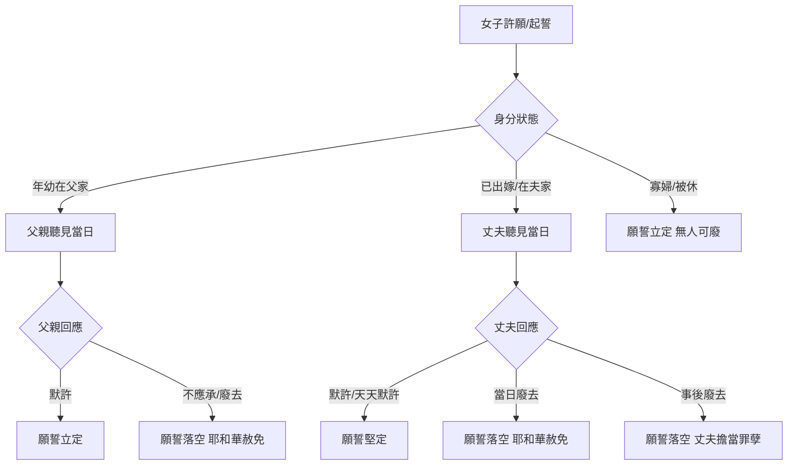

# 民數記 第30章

1. 摩西曉諭以色列各支派的首領說：耶和華所吩咐的乃是這樣：
2. 人若向耶和華[[許願與起誓律例|許願]]或[[許願與起誓律例|起誓]]，要約束自己，就不可[[不可食言（lo yachel devaro）|食言]]，必要按口中所出的一切話行。
3. [[女子許願父親權柄|女子年幼]]、[[父女夫妻律例（chuqqim av uvat, ish ve'ishah）|還在父家]]的時候，若向耶和華[[許願與起誓律例|許願]]，要約束自己，
4. 他父親也聽見他所許的願並[[丈夫天天默許堅定願誓|約束自己的話]]，卻向他[[丈夫家中許願丈夫權柄|默默不言]]，他所許的願並約束自己的話就[[寡婦被休婦人許願自主|都要為定]]。
5. 但他父親聽見的日子若不應承他所許的願和[[丈夫天天默許堅定願誓|約束自己的話]]，就都不得為定；耶和華也必赦免他，因為他[[女子許願父親權柄|父親不應承]]。
6. 他若[[出嫁婦人許願丈夫權柄|出了嫁]]，[[出嫁婦人許願丈夫權柄|有願在身]]，或是[[冒失話（nidrei shegagah）|口中出了約束自己的冒失話]]，
7. 他丈夫聽見的日子，卻向他[[丈夫家中許願丈夫權柄|默默不言]]，他所許的願並[[丈夫天天默許堅定願誓|約束自己的話]]就[[寡婦被休婦人許願自主|都要為定]]。
8. 但他丈夫聽見的日子，若不應承，就算廢了他所許的願和他出口約束自己的冒失話；耶和華也必赦免他。
9. [[寡婦被休婦人許願自主|寡婦]]或是[[寡婦被休婦人許願自主|被休的婦人]]所許的願，就是他[[丈夫天天默許堅定願誓|約束自己的話]]，[[寡婦被休婦人許願自主|都要為定]]。
10. 他若[[丈夫家中許願丈夫權柄|在丈夫家裡]][[丈夫家中許願丈夫權柄|許了願]]或起了誓，約束自己，
11. 丈夫聽見，卻向他[[丈夫家中許願丈夫權柄|默默不言]]，也沒有不應承，他所許的願並[[丈夫天天默許堅定願誓|約束自己的話]]就[[寡婦被休婦人許願自主|都要為定]]。
12. 丈夫聽見的日子，若[[丈夫家中許願丈夫權柄|把這兩樣全廢了]]，婦人口中所許的願或是[[丈夫天天默許堅定願誓|約束自己的話]]就都不得為定，因他丈夫已經把這兩樣廢了；耶和華也必赦免他。
13. 凡他所許的願和[[刻苦約束自己（anah nephesh）|刻苦約束自己]]所起的誓，他丈夫可以堅定，也可以廢去。
14. 倘若他丈夫[[丈夫天天默許堅定願誓|天天向他默默不言]]，[[丈夫天天默許堅定願誓|就算是堅定]]他所許的願和[[丈夫天天默許堅定願誓|約束自己的話]]；因丈夫聽見的日子向他默默不言，就使這兩樣堅定。
15. 但他[[丈夫事後廢去擔當罪孽|丈夫聽見以後]]，若[[丈夫事後廢去擔當罪孽|使這兩樣全廢了]]，就要[[丈夫事後廢去擔當罪孽|擔當婦人的罪孽]]。
16. 這是[[父女夫妻律例（chuqqim av uvat, ish ve'ishah）|丈夫待妻子]]，[[父女夫妻律例（chuqqim av uvat, ish ve'ishah）|父親待女兒]]，[[父女夫妻律例（chuqqim av uvat, ish ve'ishah）|女兒年幼]]、[[父女夫妻律例（chuqqim av uvat, ish ve'ishah）|還在父家]]，[[父女夫妻律例（chuqqim av uvat, ish ve'ishah）|耶和華所吩咐摩西的律例]]。

---

## 本章知識節點

### 神學
- [[許願與起誓律例]]
- [[屬靈遮蓋權柄]]

### 原文
- [[不可食言（lo yachel devaro）]]
- [[冒失話（nidrei shegagah）]]
- [[刻苦約束自己（anah nephesh）]]

### 人物關係
- [[女子許願父親權柄]]
- [[出嫁婦人許願丈夫權柄]]
- [[寡婦被休婦人許願自主]]
- [[丈夫家中許願丈夫權柄]]
- [[丈夫天天默許堅定願誓]]
- [[丈夫事後廢去擔當罪孽]]

---

## 本章整理

### 總綱：人不可食言（v1-2）
經文開篇即確立核心原則：人向耶和華[[許願與起誓律例|許願或起誓]]，[[不可食言（lo yachel devaro）|不可食言]]，必須按口中所出的一切話行（v2）。這不僅是道德勸勉，更是立約群體中「言出必行」的法律基石。摩西向各支派首領傳達此[[父女夫妻律例（chuqqim av uvat, ish ve'ishah）|律例]]，凸顯其在家庭與部落層面的執行權威。

### 情境一：父家女子的許願與父親遮蓋權（v3-5）
年幼仍在父家的女子許願[[刻苦約束自己（anah nephesh）|約束自己]]，父親聽見當日若[[丈夫天天默許堅定願誓|默默不言]]，願誓立定（v4）；若父親當日[[女子許願父親權柄|不應承]]，願誓落空，耶和華必赦免她（v5）。這揭示父親在女兒婚前擁有屬靈遮蓋權柄，可在「聽見的日子」單方面廢棄女兒的屬靈負債，保護家庭免受輕率許願（[[冒失話（nidrei shegagah）|冒失話]]）的捆綁。

### 情境二：出嫁婦人與丈夫的權柄互動（v6-8, 10-15）
經文細分兩種狀況：
1. **婚前許願/冒失話帶入婚姻（v6-8）**：丈夫聽見當日默許則立定，若當日廢去則赦免。
2. **婚後在丈夫家中許願（v10-15）**：丈夫擁有更完整的[[丈夫家中許願丈夫權柄|決定權]]——可堅定、可廢去（v13）。**關鍵機制**在於「聽見的日子」：
   - **默許（天天默默不言）**：視為[[丈夫天天默許堅定願誓|堅定]]（v14）。
   - **事後廢去**：丈夫必[[丈夫事後廢去擔當罪孽|擔當婦人的罪孽]]（v15），顯示屬靈遮蓋伴隨責任。

### 情境三：寡婦與被休婦人的完全自主（v9）
脫離父權與夫權遮蓋的女子（寡婦、被休者），其許願「都要為定」，無人可廢。這確立了獨立女性在屬靈誓約上的完全法律人格。

### 決策流程圖：女子許願的效力判定

### 對照表：三類女子許願權柄比較
| 類別 | 權柄持有者 | 廢棄時限 | 廢棄後果 | 經文 |
|---|---|---|---|---|
| **父家女子** | 父親 | 聽見當日 | 願誓落空，耶和華赦免女子 | v3-5 |
| **夫家婦人** | 丈夫 | 聽見當日 / 事後 | 當日廢：赦免；事後廢：丈夫擔罪 | v6-8, 10-15 |
| **寡婦/被休** | 本人 | 不適用 | 願誓永立定 | v9 |

### 總結律例（v16）
經文以「這是耶和華所吩咐摩西的律例」收尾，將上述案例法定性為[[父女夫妻律例（chuqqim av uvat, ish ve'ishah）|父女、夫妻之間的永久律例]]。核心神學張力在於：**屬靈權柄（遮蓋）與責任（擔罪）的對等**——丈夫/父親的默許非被動，而是主動承擔誓約生效的屬靈後果；其廢棄權非專制，乃保護家庭免受[[冒失話（nidrei shegagah）|冒失話]]之害。這章為後世拉比傳統《Nedarim》誓約法典奠定經文基礎。

**參考資料**
https://www.ccbiblestudy.org/Old%20Testament/04Num/04CT30.htm
https://www.ccbiblestudy.org/Old%20Testament/04Num/04GT30.htm
https://www.kingcomments.com/en/bible-studies/Num/30
https://biblehub.com/study/numbers/30.htm
