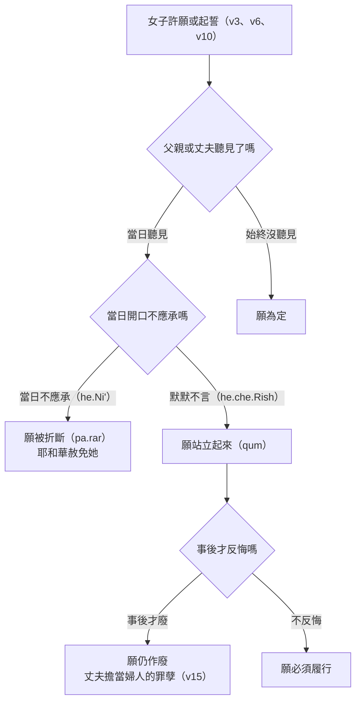

# 民數記 第30章

<!-- chapter-navigation:start -->
| [前一章](../04%20民數記/第29章.md) | [回目錄](../04%20民數記/全書目錄及綱要.md) | [下一章](../04%20民數記/第31章.md) |
| :--- | :---: | ---: |
<!-- chapter-navigation:end -->

1. [[摩西]]曉諭以色列各支派的[[摩西立首領|首領]]說：耶和華所吩咐的乃是這樣：
2. 人若向耶和華[[許願]]或起誓，要[[許願與約束自己的分別|約束自己]]，就不可[[褻瀆（cha.lal）|食言]]，必要按口中所出的一切話行。
3. 女子年幼、還在父家的時候，若向耶和華[[許願]]，要[[許願與約束自己的分別|約束自己]]，
4. 他父親也聽見他所許的願並[[許願與約束自己的分別|約束自己]]的話，卻向他[[默默不言就是默許|默默不言]]，他所許的願並約束自己的話就都要[[為定與廢去（qum 與 pa.rar）|為定]]。
5. 但他父親聽見的日子若不應承他所許的願和[[許願與約束自己的分別|約束自己]]的話，就都不得為定；耶和華也必[[赦免]]他，因為他父親不應承。
6. 他若[[民30：6-8 是已出嫁還是被聘未嫁|出了嫁]]，有願在身，或是口中出了[[許願與約束自己的分別|約束自己]]的[[冒失發誓|冒失話]]，
7. 他丈夫聽見的日子，卻向他[[默默不言就是默許|默默不言]]，他所許的願並[[許願與約束自己的分別|約束自己]]的話就都要為定。
8. 但他丈夫聽見的日子，若不應承，就算廢了他所許的願和他出口[[許願與約束自己的分別|約束自己]]的[[冒失發誓|冒失話]]；耶和華也必[[赦免]]他。
9. [[寡婦與被休的婦人可以自主許願|寡婦]]或是被休的婦人所許的願，就是他[[許願與約束自己的分別|約束自己]]的話，都要為定。
10. 他若在丈夫家裡許了願或起了誓，[[許願與約束自己的分別|約束自己]]，
11. 丈夫聽見，卻向他[[默默不言就是默許|默默不言]]，也沒有不應承，他所許的願並[[許願與約束自己的分別|約束自己]]的話就都要為定。
12. 丈夫聽見的日子，若把這兩樣全廢了，婦人口中所許的願或是[[許願與約束自己的分別|約束自己]]的話就都不得為定，因他丈夫已經把這兩樣廢了；耶和華也必[[赦免]]他。
13. 凡他所許的願和[[刻苦己心（禁食悔改）|刻苦約束自己]]所起的誓，他丈夫可以堅定，也可以[[為定與廢去（qum 與 pa.rar）|廢去]]。
14. 倘若他丈夫天天向他[[默默不言就是默許|默默不言]]，就算是堅定他所許的願和[[許願與約束自己的分別|約束自己]]的話；因丈夫聽見的日子向他默默不言，就使這兩樣堅定。
15. 但他丈夫聽見以後，若使這兩樣全廢了，就要[[丈夫擔當婦人的罪孽|擔當婦人的罪孽]]。
16. 這是丈夫待妻子，父親待女兒，女兒年幼、還在父家，耶和華所吩咐[[摩西]]的律例。

---

## 本章知識節點

### 頒布背景
- [[摩西]]
- [[摩西立首領]]
- [[民29：40 在希伯來聖經屬民30：1]]
- [[許願條例為何插在民29 與民31 之間]]
- [[五種必須償還的願]]

### 許願與起誓
- [[許願]]
- [[許願與約束自己的分別]]
- [[褻瀆（cha.lal）]]
- [[冒失發誓]]
- [[拿細耳人（nazir）]]
- [[許願獻人估價表（年齡性別分級）]]
- [[平安祭的三類（感謝祭、還願祭、甘心祭）]]
- [[不可妄稱耶和華你神的名]]
- [[甘心樂意的奉獻]]
- [[群體性獻祭]]
- [[太5：33-37 什麼誓都不可起]]

### 生效與作廢的機制
- [[為定與廢去（qum 與 pa.rar）]]
- [[默默不言就是默許]]
- [[赦免]]

### 女子的地位
- [[女子在以色列社會的法律地位]]
- [[民30：6-8 是已出嫁還是被聘未嫁]]
- [[寡婦與被休的婦人可以自主許願]]
- [[女兒承受產業的條例]]
- [[撒上1（Shmuel Aleph 1）]]

### 丈夫的權柄與責任
- [[丈夫擔當婦人的罪孽]]
- [[擔當干犯聖所與祭司職任的罪孽]]
- [[贖愆祭（asham）]]
- [[刻苦己心（禁食悔改）]]
- [[大贖罪日（Yom Kippur）條例]]
- [[以弗所書5章基督與教會的婚姻奧祕]]

---

## 本章整理

### 一章插在祭與戰爭中間的家庭法（v1-2）

民29 剛把七月的節期祭數到最後一隻羊羔，民31 就要出兵打米甸，中間卻插進整整一章談[[許願]]。[[許願條例為何插在民29 與民31 之間|GT《民數記串珠聖經註釋》給了三個理由]]：還願要獻感恩祭，而節期正是還願的場合；「在戰爭之前起願是常見的（例：民21:2）」；以色列人即將與迦南人爭戰，神在此刻先把立願條例定清楚。[[群體性獻祭|KingComments 補上另一半]]：前幾章講的是神期待百姓帶來的祭物，那是全民的義務；本章講的是神期待的另一樣東西——他們自己，那是[[甘心樂意的奉獻|個人自願的]]。

v1 說話的對象是[[摩西立首領|各支派的首領]]，不是全會眾。GT 丁良才給的理由很實際：「這是因為各支派的首領要判斷那些因許願而起爭論的，所以曉諭他們。」這一節在希伯來文聖經裡其實是第二節——[[民29：40 在希伯來聖經屬民30：1|上一章的最後一句被算成本章的序言]]。

**v2 一節之內出現三組同源的動詞加名詞**，是全章的定義句：

| 中文 | 原文 | Strong | STEP 本節譯義 |
|---|---|---|---|
| 許願 | yi.Dor Ne.der | H5087＋H5088 | he will vow a vow |
| 起誓 | hi.Sha.va' she.vu.'Ah | H7650＋H7621 | he will swear an oath |
| 約束自己 | le/'.Sor 'i.Sar 'al- naf.Sh/o | H631＋H632＋H5315I | to bind an obligation on his self |

[[許願與約束自己的分別|兩種願的方向剛好相反]]。GT 丁良才用兩句話分開：「『許願』——就是立志要作什麼。『要約束自己』——就是立志不作什麼。」串珠說的是同一件事：一種是積極為神作事，例如獻祭或作[[拿細耳人（nazir）|拿細耳人]]，另一種是消極地約束自己不作某些事。

「不可[[褻瀆（cha.lal）|食言]]」這句話的原文很重。STEP 標為 H2490H ya.Chel 加上「他的話」，簡明字義是 חָלַל（cha.lal）——把分別出來的東西弄髒。CT 引《呂振中譯本》正是這樣譯：「不可褻瀆自己的話。」

### 願怎樣站起來、又怎樣被折斷（v3-15）

本章的法律效力靠三個動詞在跑，而中文譯名把它們的具體性磨掉了：

| 中文 | 原文 | Strong | 字面 |
|---|---|---|---|
| 為定、堅定 | ya.Kum、he.Kim、ye.ki.Me./nu | H6965I（qum） | 站立起來、使它站立 |
| 不應承 | he.Ni' | H5106（nu） | 攔阻、禁止 |
| 廢了、廢去 | ya.Fer、ye.fe.Re./nu | H6565A（pa.rar） | 使它破裂 |

[[為定與廢去（qum 與 pa.rar）|一個願不是被登記或註銷，而是被立起來或被折斷]]。v13 把兩者並排在同一句：「他丈夫可以堅定，也可以廢去」——ye.ki.Me./nu 對 ye.fe.Re./nu，句型完全對稱。

```mermaid
flowchart TD
    A["女子許願或起誓（v3、v6、v10）"] --> B{"父親或丈夫聽見了嗎"}
    B -- "當日聽見" --> C{"當日開口不應承嗎"}
    B -- "始終沒聽見" --> D["願為定"]
    C -- "當日不應承（he.Ni'）" --> E["願被折斷（pa.rar）<br/>耶和華赦免她"]
    C -- "默默不言（he.che.Rish）" --> F["願站立起來（qum）"]
    F --> G{"事後才反悔嗎"}
    G -- "事後才廢" --> H["願仍作廢<br/>丈夫擔當婦人的罪孽（v15）"]
    G -- "不反悔" --> I["願必須履行"]
```

這張流程只適用於 v3-15 的女子。v2 的男子與 v9 的寡婦、被休婦人不進這個判斷——她們的願一開口就直接站立。

**真正啟動這套機制的，是不說話。** v4、7、11、14 四次用「[[默默不言就是默許|默默不言]]」（H2790B），CT 的解釋只有四個字：「『默默不言』表示默認」。v14 更把它寫成強調句：ha.cha.Resh ya.cha.Rish，後面接 mi./Yom 'el- yOm（一日又一日）——不是一時沒開口，是一天一天地不開口。BibleHub 說在當時的文化與法律脈絡中，沉默或不提出異議被視為同意，並舉波阿斯與那位更近的親屬（得4:1-8）為同型的例子。

願被廢掉的人不會因此有罪。v5、8、12 三次說「耶和華也必[[赦免]]他」，GT 丁良才解釋得很乾脆：「她既然沒有食言的罪，神也就不罰她。」KingComments 讀出的是恩典：她以為自己在討神喜悅，卻沒有想清楚自己的處境與能力。

**五種情況，只有兩種完全自主：**

| # | 情況 | 節 | 是否需要應承 |
|---|---|---|---|
| 1 | 男子許的願 | v2 | 不需要 |
| 2 | 未婚女子在父家所許的願 | v3-5 | 父親默默不言即確定 |
| 3 | 女子婚前所立、帶進婚姻的願 | v6-8 | 丈夫默許即確定 |
| 4 | 寡婦或被休婦人所許的願 | v9 | 不需要 |
| 5 | 女子婚後所起的願 | v10-15 | 丈夫默許即確定 |

[[五種必須償還的願|這張表出自 GT 串珠]]。第四種——[[寡婦與被休的婦人可以自主許願|寡婦與被休的婦人]]——是全章唯一與男子同等的女性條款。它並在最後寫下通則：「以上條例強調兒子須順服父母、妻子須順服丈夫，向神起願也不得違反這層次。」

第三種是本章唯一有爭議的一段。[[民30：6-8 是已出嫁還是被聘未嫁|v6「他若出了嫁」講的是哪一種女子]]，四套註釋分成兩邊。GT 丁良才說「6-8節大概是論到被聘還未出嫁的女子」，KingComments 同樣讀成訂婚未過門。

CT 的讀法相反，它直接註明：「『出了嫁』指為人妻子」。BibleHub 也照婚後讀，說婚姻帶進一個新的權柄結構。STEP 顯示原文是 ha.Yo tih.Yeh le./'Ish（不定詞絕對式加未完成式，譯義 certainly to belong／she will belong to a husband），未完成式指向尚未完成的歸屬，但同一節接著說她「有願在身」，原文的時態不足以獨力裁決。

至於 v6、8 的「[[冒失發誓|冒失話]]」，STEP 標為 H4008 miv.Ta'，簡明字義就是 rash word；GT 丁良才甚至推測「本章的條例，或者是因這些冒失話定的」。

### 沉默的代價與制度的背景（v15-16）

本章唯一的罰則落在丈夫身上。v15 說他若在「聽見的日子」之後才把願廢了，[[丈夫擔當婦人的罪孽|就要擔當婦人的罪孽]]（STEP：ve./na.Sa' 加 'a.vo.Na/h）。CT 說他「便須負起妻子違背許願和起誓的罪過，在神面前獻祭贖罪(參利五17~19)」，GT 丁良才指明是[[贖愆祭（asham）|利五14-19節上所定的祭]]，GT《聖經精讀本》則把重點放在領袖責任上：「神通過這些警告領袖們不應僅享受特權,也要負責任(雅3:1)」。兩套英文註釋都往基督身上讀——BibleHub 引賽53:6，KingComments 說「願的作廢只有在它的履行被丈夫接手時才可能發生。這正是主耶穌所作的。」

v13 的「[[刻苦己心（禁食悔改）|刻苦約束自己]]」不是泛稱的克制。STEP 標為 H6031B 的 Piel 不定詞 le./'a.Not 加 H5315I Na.fesh，與[[大贖罪日（Yom Kippur）條例|民29:7 贖罪日]]的用字結構相同；GT 丁良才也直接註「就是禁食等事（利十六29，民二十九7，參五十八5）」。

**父親與丈夫為什麼有這個權柄，答案在制度而不在本章。** [[女子在以色列社會的法律地位|GT《舊約聖經背景註釋》用兩整段說明]]：少女受父親監護「因此不擁有財產」，已婚婦人「不可不與丈夫商酌，便作出對家庭運作或經濟獨立有影響的決定」；能夠任意而行的「似乎只有守寡或年老的婦人」。這也解釋了為什麼 v9 的寡婦與被休婦人是例外——她們在法律上本來就自負其責。同一段點名了一個例外：「哈拿是聖經之中，惟一妻子自行許願，將兒子終身奉獻在示羅會幕之中事奉的案例（撒上一）」，[[撒上1（Shmuel Aleph 1）|撒上1]] 記的正是這件事。民27 [[女兒承受產業的條例|西羅非哈女兒爭產業]]的案子，則是同一套制度的另一面。

### 從願到言語本身（跨章脈絡）

民30 把言語的重量壓在願的履行上；耶穌在登山寶訓裡把它壓在日常言語本身。[[太5：33-37 什麼誓都不可起|四套註釋在本章都提到太5:33-37]]，而且都不讀成廢除。CT 與 GT 啟導本用同一句話收尾：耶穌教訓人什麼誓都不可起，「是就說是，不是就說不是」，「祂要人從死的律法中走出來，恢復當日立法的真精神。」GT《聖經精讀本》給的是歷史軌跡：舊約強調履行許願，這「成了衡量屬神百姓的敬虔和信實的尺度」，到新約時代卻變成在人面前表現敬虔的手段。

同樣的原則也適用在起誓的形式上。GT《舊約聖經背景註釋》說起願是召喚神明與崇拜者建立契約的宗教性行動，「故此絕對不得違約，免得觸怒神明（見：出二十7不得「妄用」神名的命令）」——[[不可妄稱耶和華你神的名|第三誡]]與本章要求的是同一件事。至於還願時該獻什麼，[[平安祭的三類（感謝祭、還願祭、甘心祭）|感謝祭與還願祭]]的條例在利7，[[許願獻人估價表（年齡性別分級）|把人或財物許給神的估價辦法]]則在利27；GT 串珠與《背景註釋》都要讀者回去看那兩處。KingComments 給新約信徒的結論則是：「我們不是靠願而活，而是活在明白神旨意裡。」[[以弗所書5章基督與教會的婚姻奧祕|至於夫妻的次序]]，串珠說本章條例「與新約的教訓原則上是一致的（參弗5:22; 6:1; 西3:18-20）」。

**參考資料**
https://www.ccbiblestudy.org/Old%20Testament/04Num/04CT30.htm
https://www.ccbiblestudy.org/Old%20Testament/04Num/04GT30.htm
https://www.kingcomments.com/en/bible-studies/Num/30
https://biblehub.com/study/numbers/30.htm
https://github.com/STEPBible/STEPBible-Data

<!-- chapter-navigation:start -->
| [前一章](../04%20民數記/第29章.md) | [回目錄](../04%20民數記/全書目錄及綱要.md) | [下一章](../04%20民數記/第31章.md) |
| :--- | :---: | ---: |
<!-- chapter-navigation:end -->
