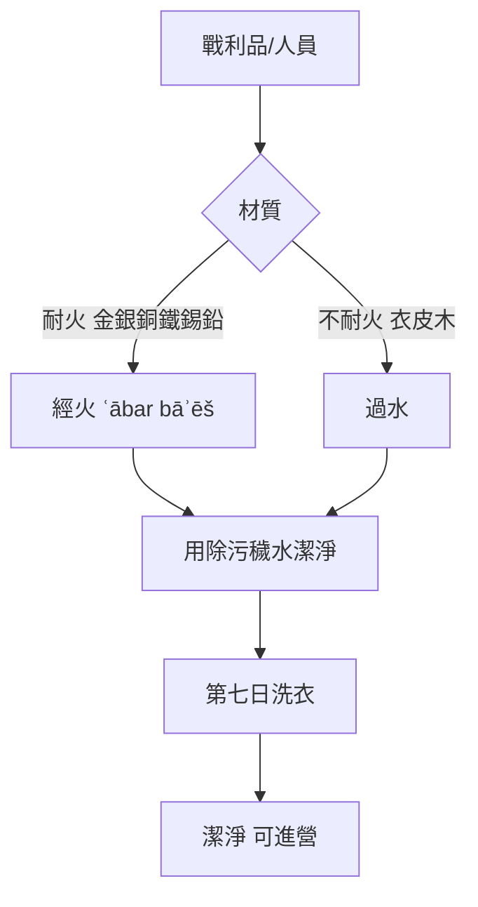

# 民數記 第31章

1. 耶和華吩咐摩西說：
2. 你要在米甸人身上報以色列人的仇，後來要歸到你列祖（原文作本民）那裡。
3. 摩西吩咐百姓說：要從你們中間叫人帶兵器出去[[攻擊米甸報仇|攻擊米甸]]，好在米甸人身上為耶和華報仇。
4. 從以色列眾支派中，每支派要打發一千人去打仗。
5. 於是從以色列千萬人中，每支派交出一千人，共一萬二千人，帶著兵器預備打仗。
6. 摩西就打發每支派的一千人去打仗，並打發祭司以利亞撒的兒子非尼哈同去；非尼哈手裡拿著聖所的器皿和吹大聲的號筒。
7. 他們就照耶和華所吩咐摩西的，與米甸人打仗，殺了所有的男丁。
8. 在所殺的人中，殺了米甸的五王，就是以未、利金、蘇珥、戶珥、利巴，又用刀殺了比珥的兒子巴蘭。
9. 以色列人擄了米甸人的婦女孩子，並將他們的牲畜、羊群，和所有的財物都奪了來，當作擄物，
10. 又用火焚燒他們所住的城邑和所有的營寨，
11. 把一切所奪的、所擄的，連人帶牲畜都帶了去，
12. 將所擄的人，所奪的牲畜、財物，都帶到[[擄獲米甸婦女兒童牲畜財物|摩押平原]]，在約但河邊與耶利哥相對的營盤，交給摩西和祭司以利亞撒，並以色列的[[戰利品歸屬分配|會眾]]。
13. 摩西和祭司以利亞撒，並[[戰利品歸屬分配|會眾]]一切的首領，都出到營外迎接他們。
14. 摩西向打仗回來的軍長，就是[[軍長獻金贖命|千夫長、百夫長]]，發怒，
15. 對他們說：你們要存留這一切婦女的活命嗎？
16. 這些婦女因巴蘭的計謀，叫以色列人在毘珥的事上得罪耶和華，以致耶和華的[[戰利品歸屬分配|會眾]]遭遇瘟疫。
17. 所以，你們要把一切的男孩和所有已嫁的女子都殺了。
18. 但女孩子中，凡沒有出嫁的，你們都可以存留他的活命。
19. 你們要在營外駐紮七日；凡殺了人的，和一切摸了被殺的，並你們所擄來的人口，第三日，第七日，都要潔淨自己，
20. 也要因一切的衣服、皮物、山羊毛織的物，和各樣的木器，潔淨自己。
21. 祭司以利亞撒對打仗回來的兵丁說：耶和華所吩咐摩西律法中的條例乃是這樣：
22. 金、銀、銅、鐵、錫、鉛，
23. 凡能見火的，你們要叫他[[經火潔淨（ʿābar bāʾēš）|經火]]就為潔淨，然而還要用除污穢的水潔淨他；凡不能見火的，你們要叫他過水。
24. 第七日，你們要洗衣服，就為潔淨，然後可以進營。
25. 耶和華曉諭摩西說：
26. 你和祭司以利亞撒，並[[戰利品歸屬分配|會眾]]的各族長，要計算所擄來的人口和牲畜的總數。
27. 把所擄來的分作兩半：一半歸與出去打仗的精兵，一半歸與全[[戰利品歸屬分配|會眾]]。
28. 又要從出去打仗所得的人口、牛、驢、羊群中，每五百取一，作為貢物奉給耶和華。
29. 從他們一半之中，要取出來交給祭司以利亞撒，作為耶和華的舉祭。
30. 從以色列人的一半之中，就是從人口、牛、驢、羊群、各樣牲畜中，每五十取一，交給看守耶和華帳幕的利未人。
31. 於是摩西和祭司以利亞撒照耶和華所吩咐摩西的行了。
32. 除了兵丁所奪的財物以外，所擄來的：羊六十七萬五千隻；
33. 牛七萬二千隻；
34. 驢六萬一千匹；
35. 女人共三萬二千口，都是沒有出嫁的。
36. 出去打仗之人的分，就是他們所得的那一半，共計羊三十三萬七千五百隻，
37. 從其中歸耶和華為貢物的，有六百七十五隻；
38. 牛三萬六千隻，從其中歸耶和華為貢物的，有七十二隻；
39. 驢三萬零五百匹，從其中歸耶和華為貢物的，有六十一匹；
40. 人一萬六千口，從其中歸耶和華的，有三十二口。
41. 摩西把貢物，就是歸與耶和華的舉祭，交給祭司以利亞撒，是照耶和華所吩咐摩西的。
42. 以色列人所得的那一半，就是摩西從打仗的人取來分給他們的。
43. （[[戰利品歸屬分配|會眾]]的那一半有：羊三十三萬七千五百隻；
44. 牛三萬六千隻；
45. 驢三萬零五百匹；
46. 人一萬六千口。）
47. 無論是人口是牲畜，摩西每五十取一，交給看守耶和華帳幕的利未人，是照耶和華所吩咐摩西的。
48. 帶領千軍的各軍長，就是[[軍長獻金贖命|千夫長、百夫長]]，都近前來見摩西，
49. 對他說：僕人權下的兵已經計算總數，並不短少一人。
50. 如今我們將各人所得的金器，就是腳鍊子、鐲子、打印的戒指、耳環、手釧，都送來為耶和華的供物，好在耶和華面前為我們的生命贖罪。
51. 摩西和祭司以利亞撒就收了他們的金子，都是打成的器皿。
52. [[軍長獻金贖命|千夫長、百夫長]]所獻給耶和華為舉祭的金子共有一萬六千七百五十舍客勒。
53. 各兵丁都為自己奪了財物。
54. 摩西和祭司以利亞撒收了[[軍長獻金贖命|千夫長、百夫長]]的金子，就帶進會幕，在耶和華面前作為以色列人的紀念。

<!-- fhl-map-links:start -->
## 相關地圖

- [[appendix/fhl_maps/maps/023|〈民圖四〉分地給兩個半支派]]
<!-- fhl-map-links:end -->

---

## 本章知識節點

### 事件
- [[攻擊米甸報仇]]
- [[殺盡米甸男丁與五王]]
- [[擄獲米甸婦女兒童牲畜財物]]
- [[摩西責備軍長留活婦女]]
- [[潔淨軍兵與戰利品]]
- [[軍長獻金贖命]]
- [[零傷亡見證神保守]]
- [[戰利品歸屬分配]]
- [[巴蘭比珥之子被殺]]
- [[非尼哈以利亞撒之子]]

### 律例
- [[經火潔淨（ʿābar bāʾēš）]]
- [[戰利品歸屬律例]]

---

## 本章整理

### 神命報仇與出兵部署（v1-6）
耶和華吩咐摩西在米甸人身上為以色列人[[攻擊米甸報仇|報仇]]，這是摩西生前最後的重大任務。摩西從各支派各選一千人，共一萬二千人，由祭司以利亞撒的兒子[[非尼哈以利亞撒之子|非尼哈]]率領，手持聖所器皿與號筒出戰。這不是尋常軍事行動，而是帶有強烈祭司色彩的聖戰，號筒聲宣告耶和華親自介入審判。

### 戰果與擄掠：殺盡男丁與五王（v7-12）
以色列人照耶和華吩咐與米甸人打仗，[[殺盡米甸男丁與五王|殺了所有男丁與五王]]（以未、利金、蘇珥、戶珥、利巴），並用刀殺了[[巴蘭比珥之子被殺|比珥的兒子巴蘭]]——這位曾因貪財教導巴勒使以色列人犯罪的先知，終在神的審判下伏法。以色列人[[擄獲米甸婦女兒童牲畜財物|擄獲婦女、孩子、牲畜財物]]，焚燒城邑營寨，將擄物帶到摩押平原耶利哥對面的營盤交給摩西、以利亞撒與會眾。

### 摩西責備軍長與處置俘虜（v13-18）
摩西出營迎接時，向軍長發怒：[[摩西責備軍長留活婦女|「你們要存留這一切婦女的活命嗎？」]] 他指出這些婦女因巴蘭計謀，引誘以色列人在毘珥得罪耶和華，導致會眾遭瘟疫（參民25）。於是下令殺盡男童與已嫁女子，僅存留未出嫁的女童。這顯示聖戰的徹底性：連帶犯罪的媒介也必除淨，免得成為日後網羅。

### 條例：經火潔淨與水潔淨（v19-24）
凡殺人、摸死屍、擄來人口者，須在營外駐紮七日，第三、七日用除污穢的水潔淨。戰利品中[[經火潔淨（ʿābar bāʾēš）|金、銀、銅、鐵、錫、鉛等耐火物必經火]]，再用水潔淨；不可經火者（衣物、皮物、木器）則直接過水。第七日洗衣即為潔淨，可進營。這套[[潔淨軍兵與戰利品|潔淨程序]]將「死的污穢」與「聖營」嚴格隔離。

> [!note] 潔淨原則
> 經文區分「耐火」與「不耐火」材質，核心邏輯在於火能燒盡污穢，水能洗淨殘留；兩者結合確保進營者潔淨無瑕。

### 戰利品分配律例與具體數目（v25-47）
耶和華設立[[戰利品歸屬律例]]：總擄物對半分，一半歸出戰兵丁，一半歸全會眾。再從兵丁半份中每五百取一（0.2%）歸祭司以利亞撒作舉祭；從會眾半份中每五十取一（2%）歸利未人。具體數目如下表：

| 項目 | 總擄獲 | 兵丁半份 | 歸耶和華（祭司） | 會眾半份 | 歸利未人 |
|------|--------|----------|------------------|----------|----------|
| 羊   | 675,000 | 337,500  | 675              | 337,500  | 6,750    |
| 牛   | 72,000  | 36,000   | 72               | 36,000   | 720      |
| 驢   | 61,000  | 30,500   | 61               | 30,500   | 610      |
| 人口 | 32,000  | 16,000   | 32               | 16,000   | 320      |

分配嚴格按比例執行，摩西、以利亞撒悉遵耶和華命令（v31, 41, 47）。這體現「爭戰的勝敗在乎耶和華」（箴21:31），戰利品最終屬神，人只管管家職分。[[戰利品歸屬分配|具體分配細節]]見上表。

### 軍長獻金贖命與零傷亡見證（v48-54）
千夫長、百夫長向摩西報告：[[零傷亡見證神保守|「僕人權下的兵已經計算總數，並不短少一人」]]。這在古代戰爭中極罕見，彰顯神超自然的保守。軍長們自發將所得金器（腳鍊、鐲子、戒指、耳環、手釧）共16,750舍客勒獻上，[[軍長獻金贖命|為生命在耶和華面前贖罪]]。摩西、以利亞撒收金帶進會幕，作為以色列人的紀念。這筆獻金非強制，卻成了得勝後感恩與認罪的自發回應。

### 跨章脈絡：巴蘭結局與聖戰神學
本章為民數記「曠野漂流」劃下句點：[[巴蘭比珥之子被殺|巴蘭之死]]應驗他自語「願我死如義人死」（23:10）的反諷——他未能如義人死，反倒與米甸同受審判。[[非尼哈以利亞撒之子|非尼哈]]手持聖器出戰，呼應25章他因熱心贖罪而得永遠祭司職分。聖戰模式（祭司領軍、號筒吹響、戰利品歸神、零傷亡）預表約書亞記耶利哥之戰，更指向末世羔羊大戰得勝、分賜產業給聖徒的榮耀結局。

**參考資料**
https://www.ccbiblestudy.org/Old%20Testament/04Num/04CT31.htm
https://www.ccbiblestudy.org/Old%20Testament/04Num/04GT31.htm
https://www.kingcomments.com/en/bible-studies/Num/31
https://biblehub.com/study/numbers/31.htm
