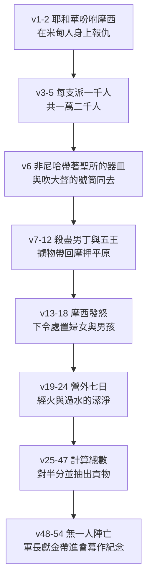

# 民數記 第31章

<!-- chapter-navigation:start -->
| [前一章](../04%20民數記/第30章.md) | [回目錄](../04%20民數記/全書目錄及綱要.md) | [下一章](../04%20民數記/第32章.md) |
| :--- | :---: | ---: |
<!-- chapter-navigation:end -->

1. 耶和華吩咐[[摩西]]說：
2. 你要在[[米甸]]人身上報以色列人的仇，後來要[[摩西最後的任務|歸到你列祖]]（原文作本民）那裡。
3. [[摩西]]吩咐百姓說：要從你們中間叫人帶兵器出去攻擊[[米甸]]，好在米甸人身上為耶和華[[報仇（na.qam 與 nik.mah）|報仇]]。
4. 從以色列眾支派中，[[每支派一千人|每支派要打發一千人]]去打仗。
5. 於是從以色列千萬人中，每支派交出一千人，共一萬二千人，帶著兵器預備打仗。
6. [[摩西]]就打發每支派的一千人去打仗，並打發祭司[[以利亞撒]]的兒子[[非尼哈]]同去；非尼哈手裡拿著[[聖所的器皿是什麼|聖所的器皿]]和[[吹角的日子（te.ru.'Ah）|吹大聲]]的[[銀號|號筒]]。
7. 他們就照耶和華所吩咐[[摩西]]的，與[[米甸]]人打仗，殺了所有的男丁。
8. 在所殺的人中，殺了[[米甸的五王]]，就是以未、利金、[[蘇珥（米甸首領）|蘇珥]]、戶珥、利巴，[[巴蘭之死|又用刀殺了比珥的兒子巴蘭]]。
9. 以色列人擄了[[米甸]]人的婦女孩子，並將他們的牲畜、羊群，和所有的財物都奪了來，當作擄物，
10. 又用火焚燒他們所住的城邑和所有的營寨，
11. 把一切所奪的、所擄的，連人帶牲畜都帶了去，
12. 將所擄的人，所奪的牲畜、財物，都帶到[[摩押平原]]，在[[約但河]]邊與[[耶利哥]]相對的營盤，交給[[摩西]]和祭司[[以利亞撒]]，並以色列的會眾。
13. [[摩西]]和祭司[[以利亞撒]]，並會眾一切的首領，都[[不潔之人出到營外|出到營外]]迎接他們。
14. [[摩西]]向打仗回來的軍長，就是[[摩西立首領|千夫長、百夫長]]，發怒，
15. 對他們說：你們要存留這一切婦女的活命嗎？
16. 這些婦女因[[巴蘭（比珥的兒子）|巴蘭]]的計謀，叫以色列人在[[巴力毘珥|毘珥]]的事上得罪耶和華，以致耶和華的會眾遭遇[[耶和華擊打百姓的瘟疫|瘟疫]]。
17. 所以，你們要把一切的男孩和所有[[已嫁與未嫁的原文判準|已嫁的女子]]都殺了。
18. 但女孩子中，凡沒有出嫁的，你們都可以存留他的活命。
19. 你們要[[營外七天等候（潔淨禮）|在營外駐紮七日]]；凡殺了人的，和一切摸了被殺的，並你們所擄來的人口，[[第三日與第七日的除污穢禮儀|第三日，第七日]]，都要潔淨自己，
20. 也要因一切的衣服、皮物、山羊毛織的物，和各樣的木器，潔淨自己。
21. 祭司[[以利亞撒]]對打仗回來的兵丁說：耶和華所吩咐[[摩西]]律法中的條例乃是這樣：
22. 金、銀、銅、鐵、錫、鉛，
23. 凡能見火的，你們要叫他[[經火與過水的潔淨|經火]]就為潔淨，然而還要用[[除污穢的水]]潔淨他；凡不能見火的，你們要叫他過水。
24. 第七日，你們要洗衣服，就為潔淨，然後可以進營。
25. 耶和華曉諭[[摩西]]說：
26. 你和祭司[[以利亞撒]]，並會眾的[[十二族長協助數點|各族長]]，要計算所擄來的人口和牲畜的總數。
27. 把所擄來的[[戰利品的分配辦法|分作兩半]]：一半歸與出去打仗的精兵，一半歸與全會眾。
28. 又要從出去打仗所得的人口、牛、驢、羊群中，每五百取一，作為[[貢物（Me.khes）|貢物]]奉給耶和華。
29. 從他們一半之中，要取出來交給祭司[[以利亞撒]]，作為耶和華的[[舉祭]]。
30. 從以色列人的一半之中，就是從人口、牛、驢、羊群、各樣牲畜中，每五十取一，交給看守耶和華[[會幕（帳幕整體）|帳幕]]的利未人。
31. 於是[[摩西]]和祭司[[以利亞撒]]照耶和華所吩咐摩西的行了。
32. 除了兵丁所奪的財物以外，所擄來的：羊六十七萬五千隻；
33. 牛七萬二千隻；
34. 驢六萬一千匹；
35. 女人共三萬二千口，都是沒有出嫁的。
36. 出去打仗之人的分，就是他們所得的那一半，共計羊三十三萬七千五百隻，
37. 從其中歸耶和華為[[貢物（Me.khes）|貢物]]的，有六百七十五隻；
38. 牛三萬六千隻，從其中歸耶和華為[[貢物（Me.khes）|貢物]]的，有七十二隻；
39. 驢三萬零五百匹，從其中歸耶和華為[[貢物（Me.khes）|貢物]]的，有六十一匹；
40. 人一萬六千口，從其中歸耶和華的，有三十二口。
41. [[摩西]]把[[貢物（Me.khes）|貢物]]，就是歸與耶和華的[[舉祭]]，交給祭司[[以利亞撒]]，是照耶和華所吩咐摩西的。
42. 以色列人所得的那一半，就是[[摩西]]從打仗的人取來分給他們的。
43. （會眾的那一半有：羊三十三萬七千五百隻；
44. 牛三萬六千隻；
45. 驢三萬零五百匹；
46. 人一萬六千口。）
47. 無論是人口是牲畜，[[摩西]]每五十取一，交給看守耶和華[[會幕（帳幕整體）|帳幕]]的利未人，是照耶和華所吩咐摩西的。
48. 帶領千軍的各軍長，就是[[摩西立首領|千夫長、百夫長]]，都近前來見[[摩西]]，
49. 對他說：僕人權下的兵已經[[計算總數（抬起頭）|計算總數]]，[[全軍無一人陣亡|並不短少一人]]。
50. 如今我們將各人所得的金器，就是腳鍊子、鐲子、打印的戒指、耳環、手釧，都送來為耶和華的[[供物（qorban）|供物]]，好在耶和華面前[[金器贖罪的性質之爭|為我們的生命贖罪]]。
51. [[摩西]]和祭司[[以利亞撒]]就收了他們的金子，都是打成的器皿。
52. [[摩西立首領|千夫長、百夫長]]所獻給耶和華為[[舉祭]]的金子共有一萬六千七百五十[[舍客勒]]。
53. 各兵丁都為自己奪了財物。
54. [[摩西]]和祭司[[以利亞撒]]收了[[摩西立首領|千夫長、百夫長]]的金子，就帶進[[會幕（帳幕整體）|會幕]]，在耶和華面前作為以色列人的紀念。

---

## 本章知識節點

### 出戰前（v1-6）
- [[摩西]]
- [[摩西最後的任務]]
- [[報仇（na.qam 與 nik.mah）]]
- [[米甸]]
- [[摩押人]]
- [[基土拉]]
- [[米甸人為何被追討而摩押人沒有]]
- [[每支派一千人]]
- [[非尼哈]]
- [[以利亞撒]]
- [[約書亞]]
- [[非尼哈的行為是否可效法]]
- [[聖所的器皿是什麼]]
- [[銀號]]
- [[吹角的日子（te.ru.'Ah）]]

### 戰役經過（v7-12）
- [[米甸的五王]]
- [[蘇珥（米甸首領）]]
- [[哥斯比（蘇珥的女兒）]]
- [[巴蘭（比珥的兒子）]]
- [[巴蘭之死]]
- [[巴蘭的教訓（啟2：14）]]
- [[摩押平原]]
- [[約但河]]
- [[耶利哥]]

### 戰後處理（v13-24）
- [[摩西立首領]]
- [[巴力毘珥]]
- [[耶和華擊打百姓的瘟疫]]
- [[殺盡米甸人的道德難題]]
- [[已嫁與未嫁的原文判準]]
- [[米甸人後來又強盛]]
- [[不潔之人出到營外]]
- [[營外七天等候（潔淨禮）]]
- [[第三日與第七日的除污穢禮儀]]
- [[經火與過水的潔淨]]
- [[除污穢的水]]
- [[無殘疾與未曾負軛的紅母牛]]
- [[潔淨與不潔淨]]

### 戰利品分配（v25-47）
- [[計算總數（抬起頭）]]
- [[十二族長協助數點]]
- [[戰利品的分配辦法]]
- [[貢物（Me.khes）]]
- [[舉祭]]
- [[利未人的什一奉獻]]

### 軍長獻金（v48-54）
- [[全軍無一人陣亡]]
- [[金器贖罪的性質之爭]]
- [[供物（qorban）]]
- [[舍客勒]]
- [[半舍客勒（贖罪銀）]]
- [[贖命的價銀]]
- [[會幕（帳幕整體）]]

---

## 本章整理

### 摩西的最後一件差事（v1-6）

民31 開頭把兩件事綁在同一句話裡：「你要在[[米甸]]人身上報以色列人的仇」，接著就說「後來要歸到你列祖（原文作本民）那裡」。次序不能顛倒——[[摩西最後的任務|報完仇，摩西才會離世]]。KingComments 把這一點寫成原則：「神不容許祂的僕人摩西離開世界，直到他看見那完全的報復。我們在這裡也看見，僕人不會在任務完成之前被取去。」GT《聖經精讀本》說法一樣：「攻打米甸是摩西最後的使命。」

**「報仇」在 v2 與 v3 不是同一個寫法。** 神在 v2 說的是「以色列人的仇」，原文是同源的動詞加名詞（ne.Kom nik.Mat，H5358＋H5360）；[[報仇（na.qam 與 nik.mah）|摩西在 v3 轉述時]]卻換成「為耶和華報仇」，動詞改為 H5414H la./Tet（給、置），字面是把耶和華的報復加在米甸身上。CT 從這個轉換讀出結論：「可見，神子民的仇亦即神的仇，榮辱相關。」

被打的為什麼只有米甸？GT 丁良才注意到[[米甸人為何被追討而摩押人沒有|經文沒有提到摩押人]]：「或者是因為引誘以色列人的事，是米甸人的罪。」而米甸與以色列其實是遠親——KingComments 與 BibleHub 都指出米甸是亞伯拉罕從[[基土拉]]所生的後裔（創25:1-2）。

出兵的方式也不尋常。[[每支派一千人|不論支派人數多寡，每支派各出一千人]]，共一萬二千人。CT 把本章的戰爭列為四個特點：「(1)人數不多，僅一萬二千人(參5節)；(2)不論支派人數多寡，每一支派出兵一千人(參4~5節)；(3)祭司菲尼哈也同行(參6節)；(4)特別受神保護，無一人死亡(參49節)。」GT 丁良才列的是同樣四項，並說「這都顯明神與他們同在」。

領軍的不是[[約書亞]]，是祭司[[非尼哈]]。KingComments 給的理由是：這一仗要潔淨以色列因與米甸連結而來的玷污，而[[非尼哈的行為是否可效法|非尼哈先前已經用刀對米甸執行過審判]]（民25:7-8）。GT 串珠補上另一層：大祭司[[以利亞撒]]不可接觸死屍，所以帶兵的是他的兒子。

他手裡拿的東西則留下一道難題。[[聖所的器皿是什麼|「聖所的器皿和吹大聲的號筒」]]究竟是兩樣還是一樣，四套來源給了四個答案：

| 來源 | 判斷 |
|---|---|
| CT | 可能是祭司點火之用的香爐，象徵禱告 |
| GT 丁良才 | 「有注釋家以為本句當作聖所的器皿，就是吹大聲的號筒（十1-10）。」 |
| GT《舊約聖經背景註釋》 | 「本節所指的器皿是什麼並不清楚，但可能包括約櫃、祭司胸牌，和烏陵土明」 |
| KingComments | 器皿就是號筒，並排除烏陵土明，因為非尼哈當時還不是大祭司 |

原文在兩組名詞之間只有一個連接詞，它既能讀成「和」，也能讀成解釋性的「就是」，句法本身不替兩種讀法作結。倒是「吹大聲」這個字很確定——STEP 標為 H8643 [[吹角的日子（te.ru.'Ah）|te.ru.'Ah]]，正是民29:1 吹角節的日子名、民10:5-6 的拔營號令、民23:21 巴蘭聽見的營中歡呼；而「號筒」是 H2689，就是民10:2 的[[銀號]]。

```mermaid
flowchart TD
    A["v1-2 耶和華吩咐摩西<br/>在米甸人身上報仇"] --> B["v3-5 每支派一千人<br/>共一萬二千人"]
    B --> C["v6 非尼哈帶著聖所的器皿<br/>與吹大聲的號筒同去"]
    C --> D["v7-12 殺盡男丁與五王<br/>擄物帶回摩押平原"]
    D --> E["v13-18 摩西發怒<br/>下令處置婦女與男孩"]
    E --> F["v19-24 營外七日<br/>經火與過水的潔淨"]
    F --> G["v25-47 計算總數<br/>對半分並抽出貢物"]
    G --> H["v48-54 無一人陣亡<br/>軍長獻金帶進會幕作紀念"]
```

### 一場沒有傷亡的仗（v7-12）

戰果寫得極短：殺了所有男丁、[[米甸的五王|五王]]，又用刀殺了[[巴蘭之死|比珥的兒子巴蘭]]。CT 指出這一句「暗示[[巴蘭（比珥的兒子）|巴蘭]]不是死在戰場上，乃是後來被殺的」——他無功而退之後仍留在米甸人中。KingComments 說他的名字與五王並列，看來是他們的謀士，「他與神子民的仇敵連結，就與他們一同倒下」。

五王之中有一個熟面孔。CT 註明[[蘇珥（米甸首領）|蘇珥]]「他的女兒[[哥斯比（蘇珥的女兒）|哥斯比]]曾引誘以色列人心利犯姦淫，結果被非尼哈刺死(參二十五14~15)」。民25 非尼哈刺死的女子，她的父親在民31 死在非尼哈帶領的軍隊手下。

**「殺了所有的男丁」不是滅族。** [[米甸人後來又強盛|四套來源都指出同一件事]]：CT 說米甸人散居各地，「因為後來米甸人又成了大族(參士六12)」；GT 啟導本說「米甸人並未完全殲滅；到士師時代，又強盛起來（士六章）」。GT 串珠說明範圍：以色列人在此擊殺的只是摩押地一帶的米甸人。

擄物被帶回[[摩押平原]]，就是[[約但河]]邊與[[耶利哥]]相對的營盤——以色列進迦南前的最後一站。

### 摩西的怒氣與七天的潔淨（v13-24）

凱旋隊伍回來，迎接他們的是摩西的發怒。原因在 v16：這些婦女因[[巴蘭的教訓（啟2：14）|巴蘭的計謀]]，叫以色列人[[巴力毘珥|在毘珥的事上得罪耶和華]]，以致[[耶和華擊打百姓的瘟疫|會眾遭遇瘟疫]]。GT《聖經精讀本》為摩西的反應辯護：他「確信戰爭的勝利是因耶和華神的介入」，也「看出了在得勝的背後所隱藏的可怕的屬靈無知」。

接下來的命令是全書最刺眼的一段。[[殺盡米甸人的道德難題|GT 為此收了兩篇專門的難題文章]]：賈斯樂郝威《聖經難解經文詮釋手冊》強調「這個殺戳行動並非出自摩西的權柄，而是出於耶和華神的命令」；艾基斯《舊約聖經難題彙編》用比喻收尾——「這正如一個患有惡性腫瘤的病人一樣，若要使病人得保性命，就必須把腫瘤徹底割除。」GT 啟導本則把標準拉回一致性：「以色列人舊的一代，包括摩西在內，均死於曠野，不得入迦南。罪的工價就是死，這個原則適用於以色列人，也適用於其他民族。」GT《舊約聖經背景註釋》另外直說，被留下的少女在毘珥事件中「可算無辜」。

**分界線不是婚姻狀態。** v17「已嫁的女子」與 v18「沒有出嫁的」在原文都是同一組字——[[已嫁與未嫁的原文判準|認識、男人、躺臥、男性]]，CT 的原文字義欄逐字拆開，GT 串珠說原意是「曾與男人有性關係者」。

然後全軍要停在營外七天。[[不潔之人出到營外|摩西與首領出到營外迎接]]，CT 說「一面表示隆重歡迎，另一面在營外處理不潔之物」；[[營外七天等候（潔淨禮）|七日的淨化]]要在營外進行，GT《舊約聖經背景註釋》說是「免得玷污其餘的百姓」；[[第三日與第七日的除污穢禮儀|第三日與第七日]]各行一次灑水之禮。這一段的[[潔淨與不潔淨|不潔]]不是道德判斷，而是接觸死屍帶來的禮儀狀態。

[[經火與過水的潔淨|器物的處理分兩路]]，由以利亞撒宣告——GT 丁良才說「這是大祭司．第一次給百姓解釋神借著摩西所傳的律例」：

| 物件 | 處理方式 |
|---|---|
| 能見火的（金、銀、銅、鐵、錫、鉛） | 先經火，再用除污穢的水潔淨 |
| 不能見火的 | 只過水 |
| 衣服 | 第七日洗淨，然後可以進營 |

STEP 顯示「經火」與「過水」在原文是同一個動詞 H5674A ta.'a.Vi.ru（使…經過），差別只在後面接的是火還是水；[[除污穢的水]]是 be./Mei ni.Dah，CT 說就是用[[無殘疾與未曾負軛的紅母牛|純紅母牛的灰]]所調製的水（民19:9）。CT 在 v20 另有一句值得記住的話：這些器物「並沒有甚麼信仰色彩，是中性的」，因此「沒有理由加以毀棄，應該在經過潔淨之後，用為善的方向」。

### 兩個比例與一張數字表（v25-47）

分配的規則只有三條：對半分（v27）、兵丁那一半每五百取一作[[貢物（Me.khes）|貢物]]獻給耶和華（v28-29）、會眾那一半每五十取一交給利未人（v30、47）。執行的是摩西、以利亞撒與[[十二族長協助數點|會眾的各族長]]，先要[[計算總數（抬起頭）|計算總數]]——原文是 na.se.'U 'et- rosh，字面是把頭抬起來，與民1:2、民26:2 數點百姓的用語相同。

| 項目 | 總數 | 兵丁一半 | 歸耶和華 | 會眾一半 | 歸利未人 |
|---|---:|---:|---:|---:|---:|
| 羊 | 675,000 | 337,500 | 675 | 337,500 | 6,750 |
| 牛 | 72,000 | 36,000 | 72 | 36,000 | 720 |
| 驢 | 61,000 | 30,500 | 61 | 30,500 | 610 |
| 人 | 32,000 | 16,000 | 32 | 16,000 | 320 |

[[戰利品的分配辦法|兩個比例合起來剛好對上民18]]。GT 啟導本：「祭司所得為利未人的十分之一，符合《民數記》十八26的規定。」抽給祭司的那一份另有名字，經文稱之為[[舉祭]]；而[[利未人的什一奉獻|利未人所得的]]則佔全部戰利品的百分之一。

「貢物」這個字本身就是本章的印記。STEP 標為 H4371 Me.khes（lexicon 作 a tax），CT 指出「貢物這詞的原文，聖經中僅出現在本章中」。

**沒上戰場的為什麼也有分？** GT 丁良才答得直接：「出去打仗的，多得掠物，是應份的；在家看守的，得些掠物，也是該當的。」他並指出這成了後來的先例——約書亞吩咐河東支派（書22:8），大衛也為上陣的和看守器具的定了平分的規則（撒上30:24-25）。

### 無一人陣亡，與那筆金子（v48-54）

軍長來見摩西，說的第一句話是[[全軍無一人陣亡|「僕人權下的兵已經計算總數，並不短少一人」]]。CT 解釋這個結果：「因有神的同在和保守，致使敵人聞風喪膽，幾乎未經交戰，便棄械就擒。」GT 啟導本另舉兩個同型的戰役：撒上14 約拿單打敗非利士人、士7 基甸打敗米甸人。

於是他們把所得的金器——腳鍊子、鐲子、打印的戒指、耳環、手釧——都送來為耶和華的[[供物（qorban）|供物]]。這個字 STEP 標為 H7133A ka.re.Ban，全卷民數記只出現兩次，另一次正是民28:2 神說的「我的供物」。金子共一萬六千七百五十[[舍客勒]]，CT 換算約192公斤，GT 啟導本說合190公斤。

[[金器贖罪的性質之爭|但這筆金子到底在贖什麼，四套來源給了四個答案]]：

| 來源 | 判斷 |
|---|---|
| GT 啟導本 | 「領兵作戰的軍官或因殺戮太多，希望藉此贖己之罪。」 |
| GT《聖經精讀本》 | 「是指因神在危險之中保存他們的生命,獻上禮物以表達感謝」，「而不是指為某些特定的罪求得饒恕」 |
| GT《舊約聖經背景註釋》 | 是人口統計的[[贖命的價銀]]，回指出30:12 的律法 |
| CT | 「意指因蒙神的保守，全軍生命平安無事，故此用貴重的飾物獻給神當作生命的贖價。」 |

KingComments 注意到的則是另一個層次：贖罪一向保留給血，「把贖罪歸給物質是罕見的」，並舉民16 的香與出30 的[[半舍客勒（贖罪銀）|銀子]]為同樣的例外。

金子最後被帶進[[會幕（帳幕整體）|會幕]]，「在耶和華面前作為以色列人的紀念」——STEP 標為 H2146 zi.ka.Ron。GT《聖經精讀本》說這紀念物「指當作神對以色列的憐憫和保護的記號」。全章從神吩咐報仇起頭，到一筆放在會幕裡的金子收尾，中間夾著一場沒有人陣亡的戰爭。

**參考資料**
https://www.ccbiblestudy.org/Old%20Testament/04Num/04CT31.htm
https://www.ccbiblestudy.org/Old%20Testament/04Num/04GT31.htm
https://www.kingcomments.com/en/bible-studies/Num/31
https://biblehub.com/study/numbers/31.htm
https://github.com/STEPBible/STEPBible-Data

<!-- appendix-links:start -->
## 附錄

### 相關地圖
- [[appendix/fhl_maps/maps/023|〈民圖四〉分地給兩個半支派]]
<!-- appendix-links:end -->

<!-- chapter-navigation:start -->
| [前一章](../04%20民數記/第30章.md) | [回目錄](../04%20民數記/全書目錄及綱要.md) | [下一章](../04%20民數記/第32章.md) |
| :--- | :---: | ---: |
<!-- chapter-navigation:end -->
