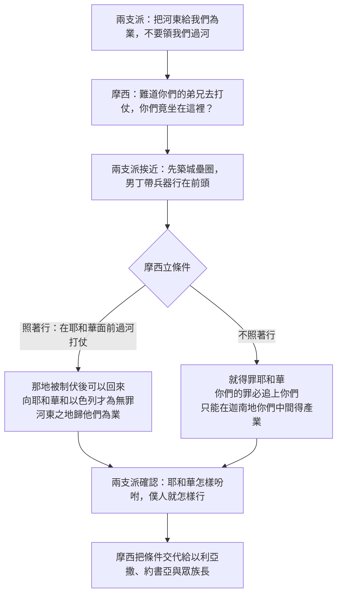

# 民數記 第32章

<!-- chapter-navigation:start -->
| [前一章](../04%20民數記/第31章.md) | [回目錄](../04%20民數記/全書目錄及綱要.md) | [下一章](../04%20民數記/第33章.md) |
| :--- | :---: | ---: |
<!-- chapter-navigation:end -->

1. [[流便]]子孫和[[迦得（萬幸）|迦得]]子孫的牲畜極其眾多；他們看見[[雅謝]]地和[[基列]]地是可牧放牲畜之地，
2. 就來見[[摩西]]和祭司[[以利亞撒]]，並會眾的首領，說：
3. 亞大錄、[[底本]]、[[雅謝]]、寧拉、[[希實本]]、以利亞利、示班、尼波、比穩，
4. 就是耶和華在以色列會眾前面所攻取之地，是可牧放牲畜之地，你僕人也有牲畜；
5. 又說：我們若在你眼前蒙恩，求你把這地給我們[[業地（a.chuz.zah）|為業]]，不要領我們過[[約但河]]。
6. [[摩西]]對[[迦得（萬幸）|迦得]]子孫和[[流便]]子孫說：難道你們的弟兄去打仗，你們竟坐在這裡嗎？
7. 你們為何使以色列人[[為定與廢去（qum 與 pa.rar）|灰心喪膽]]、不過去進入耶和華所賜給他們的那地呢？
8. 我先前從[[加低斯巴尼亞事件|加低斯巴尼亞]]打發你們先祖去[[十二探子窺探迦南地|窺探那地]]，他們也是這樣行。
9. 他們上[[以實各谷的一掛葡萄|以實各谷]]，去[[十二探子窺探迦南地|窺探那地]]回來的時候，使以色列人[[為定與廢去（qum 與 pa.rar）|灰心喪膽]]，不進入耶和華所賜給他們的地。
10. 當日，耶和華的怒氣發作，就起誓說：
11. 凡從埃及上來、二十歲以外的人斷不得看見我對[[亞伯拉罕]]、[[以撒]]、雅各起誓應許之地，因為他們沒有[[專心跟從主與另一個心志|專心跟從]]我。
12. 惟有[[基尼洗人|基尼洗族]]耶孚尼的兒子[[迦勒]]和嫩的兒子[[約書亞]]可以看見，因為他們[[專心跟從主與另一個心志|專心跟從]]我。
13. 耶和華的怒氣向以色列人發作，使他們在[[曠野飄流四十年]]，等到在耶和華眼前行惡的那一代人都消滅了。
14. 誰知，你們起來接續先祖，增添罪人的數目，使耶和華向以色列大發烈怒。
15. 你們若退後不跟從他，他還要把以色列人撇在曠野，便是你們使這眾民滅亡。
16. 兩支派的人挨近[[摩西]]，說：我們要在這裡為牲畜[[壘圈（ge.de.rah）|壘圈]]，為婦人孩子造城。
17. 我們自己要[[帶兵器（cha.lats）|帶兵器]]行在以色列人的前頭，好把他們領到他們的地方；但我們的婦人孩子，因這地居民的緣故，要住在堅固的城內。
18. 我們不回家，直等到以色列人各承受自己的[[產業（na.cha.lah）|產業]]。
19. 我們不和他們在[[約但河]]那邊一帶之地同受[[產業（na.cha.lah）|產業]]，因為我們的產業是坐落在約但河東邊這裡。
20. [[摩西]]對他們說：你們若這樣行，[[在耶和華面前]]帶著兵器出去打仗，
21. 所有[[帶兵器（cha.lats）|帶兵器]]的人都要[[在耶和華面前]]過[[約但河]]，等他趕出他的仇敵，
22. 那地被耶和華制伏了，然後你們可以回來，向耶和華和以色列才為無罪，這地也必[[在耶和華面前]]歸你們[[業地（a.chuz.zah）|為業]]。
23. 倘若你們不這樣行，就得罪耶和華，要知道[[你們的罪必追上你們]]。
24. 如今你們口中所出的，只管去行，為你們的婦人孩子造城，為你們的羊群[[壘圈（ge.de.rah）|壘圈]]。
25. [[迦得（萬幸）|迦得]]子孫和[[流便]]子孫對[[摩西]]說：僕人要照我主所吩咐的去行。
26. 我們的妻子、孩子、羊群，和所有的牲畜都要留在[[基列]]的各城。
27. 但你的僕人，凡[[帶兵器（cha.lats）|帶兵器]]的，都要照我主所說的話，[[在耶和華面前]]過去打仗。
28. 於是，[[摩西]]為他們囑咐祭司[[以利亞撒]]和嫩的兒子[[約書亞]]，並以色列眾支派的族長，說：
29. [[迦得（萬幸）|迦得]]子孫和[[流便]]子孫，凡[[帶兵器（cha.lats）|帶兵器]][[在耶和華面前]]去打仗的，若與你們一同過[[約但河]]，那地被你們制伏了，你們就要把[[基列]]地給他們[[業地（a.chuz.zah）|為業]]。
30. 倘若他們不[[帶兵器（cha.lats）|帶兵器]]和你們一同過去，就要在[[迦南地]]你們中間[[業地（a.chuz.zah）|得產業]]。
31. [[迦得（萬幸）|迦得]]子孫和[[流便]]子孫回答說：耶和華怎樣吩咐僕人，僕人就怎樣行。
32. 我們要[[帶兵器（cha.lats）|帶兵器]]，[[在耶和華面前]]過去，進入[[迦南地]]，只是[[約但河]]這邊、我們所得[[業地（a.chuz.zah）|為業]]之地仍歸我們。
33. [[摩西]]將亞摩利王[[以色列戰勝亞摩利王西宏互文（申2：24-37；3：1-7；詩135：10-12；136：17-22）|西宏]]的國和[[巴珊]]王[[以色列戰勝巴珊王噩互文（申3：1-11；詩135：10-12；136：17-22）|噩]]的國，連那地和周圍的城邑，都給了[[迦得（萬幸）|迦得]]子孫和[[流便]]子孫，並[[約瑟]]的兒子[[瑪拿西]]半個支派。
34. [[迦得（萬幸）|迦得]]子孫建造[[底本]]、亞他錄、亞羅珥、
35. 亞他錄朔反、[[雅謝]]、約比哈、
36. 伯寧拉、伯哈蘭，都是堅固城。他們又壘羊圈。
37. [[流便]]子孫建造[[希實本]]、以利亞利、基列亭、
38. 尼波、巴力免、西比瑪（尼波、巴力免，[[城名是改了的（尼波與巴力免）|名字是改了的]]），又給他們所建造的城另起別名。
39. [[瑪拿西]]的兒子[[瑪吉]]，他的子孫往[[基列]]去，佔了那地，趕出那裡的[[亞摩利人]]。
40. [[摩西]]將[[基列]]賜給[[瑪拿西]]的兒子[[瑪吉]]，他子孫就住在那裡。
41. [[瑪拿西]]的[[睚珥|子孫睚珥]]去佔了基列的村莊，就稱這些村莊為[[哈倭特睚珥]]。
42. [[挪巴]]去佔了基納和基納的鄉村，就按自己的名稱基納為挪巴。

---

## 本章知識節點

### 事件
- [[兩支派半求河東之地為業]]
- [[十二探子窺探迦南地]]
- [[摩西不得進入應許之地]]

### 人物
- [[流便]]
- [[迦得（萬幸）]]
- [[瑪拿西]]
- [[摩西]]
- [[以利亞撒]]
- [[約書亞]]
- [[迦勒]]
- [[基尼洗人]]
- [[亞摩利人]]
- [[瑪吉]]
- [[睚珥]]
- [[挪巴]]
- [[猶大支派]]
- [[亞捫人]]
- [[迦南人]]
- [[約瑟]]
- [[亞伯拉罕]]
- [[以撒]]

### 地點
- [[基列]]
- [[雅謝]]
- [[希實本]]
- [[底本]]
- [[哈倭特睚珥]]
- [[約但河]]
- [[迦南地]]
- [[巴珊]]
- [[摩押平原]]
- [[亞述]]

### 原文
- [[帶兵器（cha.lats）]]
- [[壘圈（ge.de.rah）]]
- [[業地（a.chuz.zah）]]
- [[產業（na.cha.lah）]]
- [[為定與廢去（qum 與 pa.rar）]]

### 神學
- [[你們的罪必追上你們]]
- [[在耶和華面前]]
- [[專心跟從主與另一個心志]]
- [[流便失去長子名分]]

### 主題
- [[過河的四萬人與留守的七萬人]]
- [[拈鬮分地（go.ral）]]
- [[戰利品的分配辦法]]
- [[以實各谷的一掛葡萄]]

### 歷史
- [[加低斯巴尼亞事件]]
- [[曠野飄流四十年]]

### 文化
- [[城名是改了的（尼波與巴力免）]]

### 背景
- [[河東城邑的位置考據]]

### 解經爭議
- [[河東之地是神的旨意還是神的允許]]
- [[摩西是否未求問耶和華就允准]]
- [[瑪拿西半支派為何留在河東]]

### 互文
- [[以色列戰勝亞摩利王西宏互文（申2：24-37；3：1-7；詩135：10-12；136：17-22）]]
- [[以色列戰勝巴珊王噩互文（申3：1-11；詩135：10-12；136：17-22）]]
- [[河東二支派半最先被擄（代上5：25-26）]]

---

## 本章整理

### 一、他們看見了那片草場（v1-5）

民數記32 開頭那一句很平常：[[流便]]子孫和[[迦得（萬幸）|迦得]]子孫的牲畜極其眾多，他們看見[[雅謝]]地和[[基列]]地是可牧放牲畜之地。整章四十二節的來龍去脈，都從這個「看見」開始。

這兩個支派會一起開口，不是偶然。GT 丁良才《民數記註釋》提醒了一個營地上的細節：「按民二10、14節，這兩個支派在一營中，所以有同心商議的好機會。」

至於牲畜為什麼多到這個地步，CT 只交代現況不作推論；GT 丁良才則直接把它接回上一章的[[戰利品的分配辦法|米甸戰利品清單]]，在「牲畜，極其眾多」下面標了「（三十一32-47）」。

他們的請求分兩句話：把這地給我們[[業地（a.chuz.zah）|為業]]，不要領我們過[[約但河]]。CT 對後半句的評語不留餘地：「這話太過自私，所以引來摩西的責難(參6節)。」

KingComments 讀到的是同一件事的動機面：「他們是被自己的眼睛牽著走的：這地悅他們的眼目，也適合他們的牲畜。」

GT《聖經精讀本》的判斷更重：「看見肥沃牧場的兩個支派,落入了貪心的陷阱中,忘記了民族的大使命。」它並指出其他支派同樣有牲畜、同樣看得見這片已征服的地，眼睛卻沒有停在這裡。

第3節那份九座城的名單，後面第34-38節會再出現一次，只是歸屬換了人。CT 把它分成兩半：

| 第3節的城邑 | CT 的歸屬判斷 | 別名 |
|---|---|---|
| 亞大錄、[[底本]]、[[雅謝]]、寧拉 | 「這四個城邑暫時由迦得支派佔居」 | 寧拉又名伯寧拉 |
| [[希實本]]、以利亞利、示班、尼波、比穩 | 「這五個城邑暫時由流便支派佔居」 | 示班又名西比瑪，比穩又名巴力免 |

這些地名多半查得到地方，[[河東城邑的位置考據|GT《舊約背景註釋》為它們各寫了一段考據]]。BibleHub 補的是字義：「亞大錄這個名字意為『冠冕』，可能象徵它的顯要，或周圍土地的肥沃。」

### 二、摩西把三十八年前的事搬出來（v6-15）

摩西的回話不是討論方案，是質問動機：「難道你們的弟兄去打仗，你們竟坐在這裡嗎？」接著他把[[加低斯巴尼亞事件|三十八年前那件事]]整段搬了出來——[[十二探子窺探迦南地|打發探子]]、上[[以實各谷的一掛葡萄|以實各谷]]、回來報惡信、耶和華起誓、[[曠野飄流四十年|全會眾在曠野飄流四十年]]。他的結論是一句很重的話：你們起來接續先祖，增添罪人的數目。

**這裡有一個原文上的連結值得看清楚。** STEP語言資料顯示，第7、9節「使以色列人灰心喪膽」的動詞是 H5106，詞典形 nu，簡要詞典義 to forbid，受詞是 lev（心）；同一個字在民數記裡只出現過另外三次，全在上一組條例裡——[[為定與廢去（qum 與 pa.rar）|民30 那個父親或丈夫「不應承」女子所許的願]]。也就是說，摩西指控兩支派做的，在用字上正是那個「不應承」的動作：他們攔阻的是全會眾的心。

GT《聖經精讀本》從詞源給的解釋方向一致：「這句話是“使心傾斜”的意思,源於具有“禁止”,“反對”,“拒絕”等意思的希伯來語。」

KingComments 把摩西的激動放在他自己的處境裡讀：「迦得人和流便人經歷了曠野一切的試煉，他們得以存活，卻在約但河前拒絕過去。這是可悲的。」對一位[[摩西不得進入應許之地|自己極想進去卻不獲准]]的領袖來說，這句「不要領我們過約但河」的分量不難想像。

第11-12節是這段回顧的樞紐：那一代人「沒有專心跟從我」，只有[[基尼洗人|基尼洗族]]耶孚尼的兒子[[迦勒]]和嫩的兒子[[約書亞]]例外。CT 給的字面意思是[[專心跟從主與另一個心志|「『專心跟從我』字面的意思是『完全跟在我後面』，意指一心一意跟從神，不受任何外在因素的影響。」]]STEP語言資料對得上：這個動詞是 H4390，詞典形 ma.le，簡要詞典義 to fill——原文的說法是在神後面「填滿」。

### 三、挨近說話：折衷方案與條件式的應許（v16-27）

第16節那個動作很小，卻是整章的轉折：兩支派的人「挨近摩西」。KingComments 從這裡讀出一個原則——為了避免誤會、或為了把一件事說清楚，我們需要彼此走近、彼此聆聽、彼此了解；那時分歧也許還在，衝突卻消失了。

他們提出的方案有三項，[[兩支派半求河東之地為業|GT《聖經精讀本》把它列得很整齊]]：先建設保護家族的城邑（16、17節）、事情結束後與其他支派一同在征服迦南的戰爭中充當先鋒（17節）、在約但河西不再分得土地（19節）。摩西接受了，但把它改寫成一份帶條件的協議。

**協議的關鍵詞是一個原文詞。** STEP語言資料顯示，第17、20、21、27、29、30、32節共七處的[[帶兵器（cha.lats）|「帶兵器」]]全是 H2502B，詞典形 cha.lats，簡要詞典義 to arm。頭兩處是 Niphal 動詞——說的是自己武裝起來；其餘五處是被動分詞，指的是「已武裝的人」這個身分。這個字在兩支派最初的請求裡一次都沒出現，它是折衷方案帶進來的。

另一個反覆出現的說法是[[在耶和華面前]]：第20、21、22、27、29、32節共六次。GT《聖經精讀本》數過它的密度：「在20-22節中提到了三次,摩西通過這句話暗示自己與兩個支派之間的約和約的履行。」CT 讀到的則是戰爭中的神：「『在耶和華面前』耶和華被認為是他們的戰神，為以色列人開路(參二十一14；書四5，11~13；六8~9；士五23)」。

第22節的「才為無罪」，CT 的解釋很短：「『才為無罪』指不被追究。」BibleHub 說的是同一件事的條件性：「『免除義務』這個說法意味著一個附帶條件的應許：他們對神與對以色列全國的責任，只有在參與了共同的使命之後才算完成。」

摩西的最後一句是警告：[[你們的罪必追上你們]]。STEP語言資料顯示，這句話裡「罪」是主詞、「你們」是受詞——動詞 H4672（詞典形 ma.tsa，簡要詞典義 to find）是第三人稱陰性單數，正好與陰性名詞「罪」相配。

至於「凡帶兵器的」實際上是多少人，[[過河的四萬人與留守的七萬人|CT 把兩份名冊對了起來]]：兩個支派加上瑪拿西半個支派的戰士總數超過十一萬，過河的僅約四萬，其餘留下看守婦孺與牲畜。

**先安置，再出征。** 兩支派要做的第一件事是[[壘圈（ge.de.rah）|為牲畜壘圈]]。CT 說明了它的實體：「『壘圈』指用田間的石頭壘起石牆，是沒有頂棚的，用以夜間保護牲畜，並防止牲畜走失」。STEP語言資料顯示這個詞在原文是三個字：gid.Rot（H1448，簡要詞典義 wall）＋ tzon（H6629G，簡要詞典義 flock）＋ niv.Neh（H1129，簡要詞典義 to build）——中文的「圈」在原文其實是一道牆。

### 四、分地、築城、改名（v28-42）

[[摩西]]把裁定交代給祭司[[以利亞撒]]、[[約書亞]]與眾族長之後，第33節一次把[[以色列戰勝亞摩利王西宏互文（申2：24-37；3：1-7；詩135：10-12；136：17-22）|亞摩利王西宏的國]]和[[以色列戰勝巴珊王噩互文（申3：1-11；詩135：10-12；136：17-22）|巴珊王噩的國]]分了出去。收受的是三方，取得的方式卻不一樣。

| 誰 | 得到什麼 | 怎麼取得 |
|---|---|---|
| 迦得子孫 | 底本、亞他錄、亞羅珥、亞他錄朔反、雅謝、約比哈、伯寧拉、伯哈蘭 | 交涉：先承諾帶兵器過河 |
| 流便子孫 | 希實本、以利亞利、基列亭、尼波、巴力免、西比瑪 | 交涉：先承諾帶兵器過河 |
| [[瑪拿西]]的兒子[[瑪吉]] | [[基列]] | 自己往基列去，佔了那地、趕出[[亞摩利人]] |
| [[睚珥]] | 基列的村莊，稱為[[哈倭特睚珥]] | 自己去佔，用自己的名字命名 |
| [[挪巴]] | 基納和基納的鄉村 | 自己去佔，用自己的名字命名 |

「建造」這兩個字要照原意讀。GT 丁良才《民數記註釋》講得直白：「“建造”——就是修補的意思，因為這些城早已就有。」CT 的說法相同：「『建造』不是新建，而是修建」。

第38節在名單中間插了一句括號：[[城名是改了的（尼波與巴力免）|尼波、巴力免，名字是改了的]]。四套註釋對這句話的解釋一致——舊名帶著異教神祇的名字。BibleHub 的說法是：「改名象徵著對異教過去的拒絕，也是以色列身分與主權的宣示。」STEP語言資料顯示「名字是改了的」是 mu.sa.Bot（H5437G，詞典形 sa.vav，簡要詞典義 to turn）加上 shem，字面是名字被轉過來。

**兩個名字對同一座城，STEP 的處理不一樣。** 示班（第3節）與西比瑪（第38節）在 STEP 裡是 H7643G 與 H7643H，屬同一組 base Strong 的兩個變體；比穩（第3節）與巴力免（第38節）則各有自己的編號 H1194 與 H1186，兩者是同一地的認定來自註釋，不是來自編號。

值得留意的是分地的方式本身。KingComments 說：「這不是像將在應許之地那樣照[[拈鬮分地（go.ral）|拈鬮]]而行。他把他們自己選的地給了他們。在那地裡，每一個支派得到的是神所選的分。」

### 五、四套註釋分歧最大的三個地方

本章沒有一句話是從耶和華曉諭摩西開始的。責備、立條件、分地，都是摩西自己開口。這使得幾個判斷同時懸而未決，而四套註釋的落點差得很開。

**第一，[[河東之地是神的旨意還是神的允許|河東之地算不算神的應許]]。**

| 來源 | 判斷 |
|---|---|
| CT | 只是神的允許，不是神的應許 |
| GT《啟導本》 | 河東之地也屬神所賜之地，只是不可因此不去取迦南 |
| GT 串珠 | 額外得地是神所容許的，前提是不放棄應許之地 |
| GT《聖經精讀本》 | 兩支派落入了貪心的陷阱 |
| KC | 神的心意包括河東一分，但不是要他們完全定居在那裡 |
| BH | 引出關於神應許性質與計畫彈性的問題，反映神的恩典與供應 |

CT 在第19節的〔話中之光〕把話說得最滿：「看得見的好不一定是神的應許，神的應許也不一定叫人得著眼前的滿足，人常常在這一件事上迷失，古今都是一樣。」

GT《民數記串珠聖經註釋》的收尾則留了餘地：「以色列人額外得地為業，是神所容許的，只是他們不可放棄神應許之地，必須竭力攻取。」

**第二，[[摩西是否未求問耶和華就允准|摩西是不是沒有求問神]]。** CT 在第20節下的判斷是「摩西的回話顯然沒有先求問神」；GT 串珠把這件事接到上一章的起願條例上，說神既未有清楚曉諭即等於默許；GT《聖經精讀本》換個角度，說摩西是以神代理者的權柄和神所賜的智慧直接分配了土地；BibleHub 沒有提出這個問題。

**第三，[[瑪拿西半支派為何留在河東|瑪拿西半個支派為什麼會在這裡]]。** 他們從頭到第32節都沒出場，卻在第33節突然進入分地名單。《聖經精讀本》歸因於他們征服了基列地；串珠推測是見有先例而自動請纓；GT 丁良才坦白說聖經沒有解釋；KingComments 則認為是前兩個支派的態度造成了另一個支派的分裂。

> [!important] 這片地後來的下場
> [[河東二支派半最先被擄（代上5：25-26）|三套資料都把本章的選擇與歷代志上五章的結局接在一起]]：[[亞述]]人先擄掠了約但河東的流便人、迦得人和瑪拿西半支派的人。GT《啟導本聖經註釋》給的地理原因就在同一段裡：「外約但屬高原地帶，雨水豐足，土地肥沃，宜於放牧，但缺少軍事屏障。」

最後仍要記下兩支派做到了的部分。他們沒有食言：GT《啟導本聖經註釋》對這批人的評語是「四十年的曠野生活沒有白過，在風沙中成長的新一代，目光是向前看的，且願為全民的幸福拼死生。」他們把妻兒牲畜留在[[基列]]的各城，帶兵器過了[[約但河]]，[[迦南地|進入迦南]]作先鋒，直到[[產業（na.cha.lah）|以色列人各承受自己的產業]]為止。

**參考資料**
https://www.ccbiblestudy.org/Old%20Testament/04Num/04CT32.htm
https://www.ccbiblestudy.org/Old%20Testament/04Num/04GT32.htm
https://www.kingcomments.com/en/bible-studies/Num/32
https://biblehub.com/study/numbers/32.htm
https://github.com/STEPBible/STEPBible-Data

<!-- appendix-links:start -->
## 附錄

### 相關地圖
- [[appendix/fhl_maps/maps/023|〈民圖四〉分地給兩個半支派]]
<!-- appendix-links:end -->

<!-- chapter-navigation:start -->
| [前一章](../04%20民數記/第31章.md) | [回目錄](../04%20民數記/全書目錄及綱要.md) | [下一章](../04%20民數記/第33章.md) |
| :--- | :---: | ---: |
<!-- chapter-navigation:end -->
