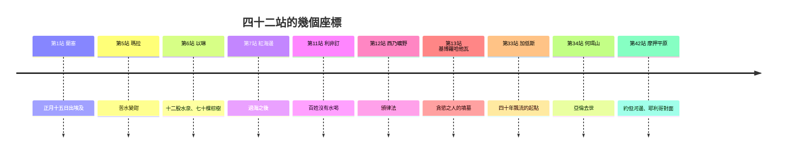

# 民數記 第33章

<!-- chapter-navigation:start -->
| [前一章](../04%20民數記/第32章.md) | [回目錄](../04%20民數記/全書目錄及綱要.md) | [下一章](../04%20民數記/第34章.md) |
| :--- | :---: | ---: |
<!-- chapter-navigation:end -->

1. 以色列人按著軍隊，在[[摩西]]、[[亞倫]]的手下出埃及地所行的[[曠野四十二站|路程]]（或作：站口；下同）記在下面。
2. [[摩西]][[越過耶和華的口（peh）|遵著耶和華的吩咐]][[遵著耶和華的吩咐記載路程|記載]]他們所行的[[曠野四十二站|路程]]，其路程乃是這樣：
3. 正月十五日，就是[[逾越節]]的次日，以色列人從[[蘭塞]]起行，在一切埃及人眼前[[昂然無懼]]地出去。
4. 那時，埃及人正葬埋他們的長子，就是耶和華在他們中間所擊殺的；耶和華也[[敗壞他們的神]]。
5. 以色列人從[[蘭塞]]起行，安營在[[疏割]]。
6. 從[[疏割]]起行，安營在[[以倘|曠野邊的以倘]]。
7. 從[[以倘]]起行，轉到[[比哈希錄]]，是在[[巴力洗分]]對面，就在[[密奪]]安營。
8. 從[[比哈希錄]]對面起行，經過[[海（紅海）|海]]中到了[[書珥的曠野|書珥曠野]]，又在伊坦的曠野走了三天的[[曠野四十二站|路程]]，就安營在[[瑪拉]]。
9. 從[[瑪拉]]起行，來到[[以琳]]（以琳有十二股水泉，七十棵棕樹），就在那裡安營。
10. 從[[以琳]]起行，安營在[[海（紅海）|紅海]]邊。
11. 從[[海（紅海）|紅海]]邊起行，安營在[[汛的曠野]]。
12. 從[[汛的曠野]]起行，安營在脫加。
13. 從脫加起行，安營在亞錄。
14. 從亞錄起行，安營在[[利非訂]]；在那裡，百姓沒有水喝。
15. 從[[利非訂]]起行，安營在[[西乃的曠野]]。
16. 從[[西乃的曠野]]起行，安營在[[基博羅哈他瓦]]。
17. 從[[基博羅哈他瓦]]起行，安營在[[哈洗錄]]。
18. 從[[哈洗錄]]起行，安營在利提瑪。
19. 從利提瑪起行，安營在臨門帕烈。
20. 從臨門帕烈起行，安營在立拿。
21. 從立拿起行，安營在勒撒。
22. 從勒撒起行，安營在基希拉他。
23. 從基希拉他起行，安營在沙斐山。
24. 從沙斐山起行，安營在哈拉大。
25. 從哈拉大起行，安營在瑪吉希錄。
26. 從瑪吉希錄起行，安營在他哈。
27. 從他哈起行，安營在他拉。
28. 從他拉起行，安營在密加。
29. 從密加起行，安營在哈摩拿。
30. 從哈摩拿起行，安營在[[摩西錄]]。
31. 從[[摩西錄]]起行，安營在[[比尼亞干]]。
32. 從[[比尼亞干]]起行，安營在曷哈及甲。
33. 從曷哈及甲起行，安營在約巴他。
34. 從約巴他起行，安營在阿博拿。
35. 從阿博拿起行，安營在[[以旬迦別]]。
36. 從[[以旬迦別]]起行，安營在尋的曠野，就是[[加低斯]]。
37. 從[[加低斯]]起行，安營在[[何珥山]]，[[以東|以東地]]的邊界。
38. 以色列人出了埃及地後四十年，[[亞倫去世的日期|五月初一日]]，祭司[[亞倫]][[越過耶和華的口（peh）|遵著耶和華的吩咐]]上[[何珥山]]，就死在那裡。
39. [[亞倫]]死在[[何珥山]]的時候年一百二十三歲。
40. 住在迦南南地的迦南人[[戰勝亞拉得王|亞拉得王]]聽說以色列人來了。
41. 以色列人從[[何珥山]]起行，安營在撒摩拿。
42. 從撒摩拿起行，安營在[[普嫩]]。
43. 從[[普嫩]]起行，安營在阿伯。
44. 從阿伯起行，安營在以耶亞巴琳，摩押的邊界。
45. 從以耶亞巴琳起行，安營在[[底本|底本迦得]]。
46. 從[[底本|底本迦得]]起行，安營在亞門低比拉太音。
47. 從亞門低比拉太音起行，安營在尼波對面的[[亞巴琳山]]裡。
48. 從[[亞巴琳山]]起行，安營在[[摩押平原]]─[[約但河]]邊、[[耶利哥]]對面。
49. 他們在[[摩押平原]]沿[[約但河]]邊安營，從伯耶施末直到[[什亭（亞伯什亭）|亞伯什亭]]。
50. 耶和華在[[摩押平原]]─[[約但河]]邊、[[耶利哥]]對面曉諭[[摩西]]說：
51. 你吩咐以色列人說：你們過[[約但河]]進[[迦南地]]的時候，
52. 就要從你們面前趕出那裡所有的居民，毀滅他們一切[[毀滅迦南偶像的三道命令|鏨成的石像]]和他們一切鑄成的偶像，又拆毀他們一切的[[邱壇與日像被毀（拜偶像的終極審判）|邱壇]]。
53. 你們要奪那地，住在其中，因我把那地賜給你們為業。
54. 你們要按家室[[拈鬮分地（go.ral）|拈鬮]]，承受那地；人多的，要把[[產業（na.cha.lah）|產業]]多分給他們；人少的，要把產業少分給他們。拈出何地給何人，就要歸何人。你們要按宗族的支派承受。
55. 倘若你們不趕出那地的居民，所容留的居民就必作你們[[眼中的刺與肋下的荊棘|眼中的刺]]，[[眼中的刺與肋下的荊棘|肋下的荊棘]]，也必在你們所住的地上擾害你們。
56. 而且我素常有意怎樣待他們，也必照樣待你們。

---

## 本章知識節點

### 主題
- [[曠野四十二站]]
- [[遵著耶和華的吩咐記載路程]]
- [[毀滅迦南偶像的三道命令]]
- [[亞倫去世的日期]]
- [[拈鬮分地（go.ral）]]

### 神學
- [[神的回顧只記進度不記背叛]]
- [[亞倫卒於何珥山與祭司職任更替]]
- [[不可為自己雕刻偶像]]

### 原文
- [[昂然無懼]]
- [[敗壞他們的神]]
- [[眼中的刺與肋下的荊棘]]
- [[越過耶和華的口（peh）]]
- [[產業（na.cha.lah）]]

### 背景
- [[行程表在古代近東的體裁]]
- [[迦南七族（迦南地原住民）]]

### 解經爭議
- [[民21 與民33 的站名為何不同]]
- [[他備拉與基博羅哈他瓦是否同一地]]

### 人物
- [[摩西]]
- [[亞倫]]

### 地點
- [[蘭塞]]
- [[疏割]]
- [[以倘]]
- [[比哈希錄]]
- [[巴力洗分]]
- [[密奪]]
- [[書珥的曠野]]
- [[瑪拉]]
- [[以琳]]
- [[海（紅海）]]
- [[汛的曠野]]
- [[利非訂]]
- [[西乃的曠野]]
- [[基博羅哈他瓦]]
- [[哈洗錄]]
- [[加低斯]]
- [[何珥山]]
- [[以東]]
- [[底本]]
- [[亞巴琳山]]
- [[摩押平原]]
- [[什亭（亞伯什亭）]]
- [[耶利哥]]
- [[迦南地]]
- [[約但河]]
- [[以旬迦別]]
- [[普嫩]]
- [[摩西錄]]
- [[比尼亞干]]

### 歷史
- [[過紅海]]
- [[戰勝亞拉得王]]
- [[曠野飄流四十年]]
- [[逾越節]]
- [[十災]]
- [[第十災（殺長子之災）]]

### 事件
- [[瑪拉苦水變甜]]
- [[米利暗卒於加低斯]]
- [[拆毀偶像律例]]

---

## 本章整理

### 一、一份奉命寫下的清單（v1-4）

民數記33 是全書最容易被跳過的一章：四十二個地名，一站接一站。但第2節先說明了它的來歷——[[遵著耶和華的吩咐記載路程|「摩西遵著耶和華的吩咐記載他們所行的路程」]]。這份清單不是旅行筆記，是奉命寫下的正式記錄。

KingComments 抓住的正是這個分別：這件事不是照[[摩西]]的吩咐發生的，而是「照耶和華的吩咐」；是神在回顧祂百姓走過的曠野。

STEP語言資料在這一節提供了兩層細節。第一層是[[越過耶和華的口（peh）|「遵著耶和華的吩咐」]]的中心詞：pi（H6310I），詞典形 peh，簡要詞典義 lip: word——字面是照耶和華的口。同一個說法在第38節再出現一次，用在[[亞倫]]上何珥山的時候。第二層是這一節用了兩個名詞：mo.tza（H4161，簡要詞典義 exit）與 mas.sa（H4550，簡要詞典義 journey），而且在同一節裡以相反的次序各出現一次。CT 的原文字義欄也標出這一節的「路程」是雙字。

第3-4節交代出發那一刻。以色列人[[昂然無懼|昂然無懼]]地從[[蘭塞]]出去——CT 註原文是「高舉的手」，GT《聖經精讀本》與 KingComments 給的字面意思相同。這種底氣有它的原因，就寫在下一節：[[敗壞他們的神|「耶和華也敗壞他們的神」]]。

> [!note] 「敗壞」在原文是兩個字
> CT 的原文字義欄：「敗壞(原文雙字)」做，製作，完成(首字)；審判(次字)。STEP語言資料對得上：'a.Sah（H6213A）加 she.fa.Tim（H8201，詞典形 she.phet，簡要詞典義 judgment）。GT《靈修版聖經註釋》給的直譯是「耶和華審判他們的眾神」。

### 二、四十二站怎麼排（v5-49）

[[曠野四十二站|整份清單]]的分段方式，兩套中文註釋給得完全不同。

CT 的內容綱要分成四段：從出埃及到西乃山十二站、從西乃山到[[加低斯]]二十一站、從加低斯到約但河東岸九站，最後是過河前的吩咐。

GT《民數記串珠聖經註釋》則排成六程、每程七站，並指出「四十二為七的倍數」。它列出的對應是這樣：

| 位置 | 落在那裡的事 |
|---|---|
| 第一站 | 神領以色列民出埃及 |
| 第七站 | 過紅海 |
| 第十二站（西乃山） | 頒發律法 |
| 第一程與第五程的第五站 | 神供水的地方（[[瑪拉]]與加低斯） |
| 第四、五、六程的第六站 | 亞倫和摩西死的地方 |

串珠的結論是：「這些都不似巧合，而是在數字上有象徵的意義。」它並注意到第一程與第二程各站發生的事完全類同——第一站與第八站都是神蹟奇事，第四站與第十一站都是爭戰得勝，第六站與第十三站都是供應水和食物。

**原文的公式一字不改。** GT 串珠註：「『從 ...... 起行，安營在 ...... 』是此段的公式語，但每一次其實都有神的雲柱、火柱在帳幕上作指示（9:15-23）。」STEP語言資料顯示這個公式在原文固定是兩個動詞：na.sa（H5265，簡要詞典義 to set out）與 cha.nah（H2583，簡要詞典義 to camp），四十多次沒有變化。

**沿路的地名多半有故事，也多半查不到位置。** 清單裡有[[疏割]]、[[以倘]]、[[比哈希錄]]、[[巴力洗分]]、[[密奪]]、[[書珥的曠野]]、[[以琳]]、[[海（紅海）|紅海邊]]、[[汛的曠野]]、[[利非訂]]、[[西乃的曠野]]、[[基博羅哈他瓦]]、[[哈洗錄]]，這些在出埃及記與民數記前段都有對應的事件；也有[[以旬迦別]]、[[普嫩]]、[[摩西錄]]、[[比尼亞干]]這些只在清單裡出現、卻各有一段來歷的地方。

[[行程表在古代近東的體裁|這種寫法本身有來歷]]。GT《舊約聖經背景註釋》說：「行程表的體裁在古代近東的年表中十分常見，例子之一是主前九世紀 * 亞述王的年表。他們描述戰役的方法，是列數所停的各站和征服的各城。」它同時坦白地說：「不少地名已無從稽考，因為只在聖經此處出現，其他古代史料和現代地理與考古研究都未能提供進一步的資料。」

### 三、清單裡沒說的事（v5-49）

這份清單最值得注意的地方，可能是它省略了什麼。

KingComments 說在這份列表裡，神說的不是背叛，而是前進；如果只有這份地名清單，我們會以為以色列從埃及到摩押一路秩序井然。[[神的回顧只記進度不記背叛|他接著點出一件事]]：真實情況是新一代已經取代了舊一代，但這份報告給人的印象卻像是從來沒有過更早的一代——抵達摩押平原的百姓被看作就是那批離開埃及的百姓。

CT 從一個缺席的名字讀到同一件事：「加低斯是以色列惹神怒氣最嚴重的地方，在那裡開始了四十年的飄流。在行程的記錄裡，神不題加低斯這個名字，這不是說他們沒有到過加低斯，而是神的赦免使加低斯的失敗沒有留下在記錄中。」

GT《聖經精讀本》讀出的方向剛好相反。它算了一筆帳：從埃及到摩押是一般旅行者一週就能走完的短距離，以色列卻走了四十年；這驚人的時間長度是悖逆和不順服的結果，所以這些地名不是單純的地名，而是犯罪、苦難、掙扎、眼淚和恩典的記錄。同一份清單，兩邊讀出的重點正好相反。

**名字對不上，是本章最實在的難題。** [[民21 與民33 的站名為何不同|同一段路，民21 與本章列出的站名不一樣]]，申10:6-7 的次序甚至相反。GT 丁良才在第1節就先給了三種緣故：有些名字是以色列人自己起的、有些是因地形或小村莊起的、有時以色列人同時在兩處安營。GT 另外引賈斯樂郝威《聖經難解經文詮釋手冊》命題29 給出七點解答，其中一點是「兩章所列的行程並非完整的行程；有些只列出作者他認為重要的」。

順帶一提，本章的清單也是判斷[[他備拉與基博羅哈他瓦是否同一地|他備拉與基博羅哈他瓦是不是同一地]]的第一項證據——民11:3 的他備拉沒有出現在這份行程表裡。

### 四、亞倫死在何珥山（v37-40）

第37-40節讓清單短暫地變回敘事。以色列人從加低斯起行，安營在[[何珥山]]，那是[[以東|以東地]]的邊界；[[亞倫卒於何珥山與祭司職任更替|祭司亞倫遵著耶和華的吩咐上何珥山，就死在那裡]]，年一百二十三歲。

[[亞倫去世的日期|這個日期只在這裡出現過一次]]。GT 丁良才《民數記註釋》的說法是：「『以色列人出了埃及地後四十年，五月初一日』——聖書上只在本處記亞倫去世的日期。」他另外給了一個對照：「亞倫站在法老面前的時候，年八十三歲（參出七7）。」CT 給的對照是年齡差：「他比摩西年長三歲(參申三十四7)。」

GT《啟導本聖經註釋》把三位領袖的離世排成一條線：「米利暗死後半年亞倫也死了；亞倫死後六個月，摩西也隨著去世」——這一節因此同時牽動[[米利暗卒於加低斯|米利暗之死]]與摩西自己的結局。

緊接著的第40節換了視角：[[戰勝亞拉得王|住在迦南南地的迦南人亞拉得王聽說以色列人來了]]。CT 在〔話中之光〕裡讀出一句話：「四十年的時光沒有改變他們得勝的行程，終於叫迦南人知道他們來了。」

之後的九站一路往北，經[[普嫩]]、阿伯、以耶亞巴琳、[[底本|底本迦得]]、亞門低比拉太音，到[[亞巴琳山]]，最後停在[[摩押平原]]——[[約但河]]邊、[[耶利哥]]對面，「從伯耶施末直到[[什亭（亞伯什亭）|亞伯什亭]]」。CT 註這兩地從南到北相距約二十公里，以色列軍營展開的長度就是這麼長。

### 五、過河前的四道吩咐（v50-56）

第50節起，鏡頭從後方轉向前方。KingComments 的說法是：回顧之後，現在得到的是前瞻；曠野的路程寫完了，百姓的眼睛轉向那地。

[[毀滅迦南偶像的三道命令|第52節一節之內下了三道命令]]，三個對象分別是那地的[[迦南七族（迦南地原住民）|居民]]、鏨成與鑄成的偶像、以及一切的[[邱壇與日像被毀（拜偶像的終極審判）|邱壇]]，三個動詞各不相同：

| 命令 | 對象 | STEP語言資料的動詞 |
|---|---|---|
| 趕出 | 那裡所有的居民 | ya.rash（H3423H，簡要詞典義 to possess） |
| 毀滅 | 鏨成的石像、鑄成的偶像 | a.vad（H6，簡要詞典義 to perish），同節用兩次 |
| 拆毀 | 一切的邱壇 | sha.mad（H8045，簡要詞典義 to destroy） |

第54節是分地的辦法：[[拈鬮分地（go.ral）|按家室拈鬮]]，人多的多分[[產業（na.cha.lah）|產業]]、人少的少分。CT 把原則列成三項：以家室為單位、按照拈鬮結果、土地大小依據人數多少。他並指出這裡其實有一層張力——「拈鬮的方法是很難達成人多就多得，人少就少得的要求的，但神定規了這樣作。」

第55-56節是警告。不趕出那地的居民，所容留的就必作[[眼中的刺與肋下的荊棘|眼中的刺、肋下的荊棘]]。CT 分開解釋兩個位置：「『眼中的刺』形容令人難受；『肋下的荊棘』形容無法動彈，寢食難安」。STEP語言資料顯示這兩個「刺」在原文是兩個不同的名詞——si.Kim（H7899）與 tz.ni.Nim（H6796），都是陽性複數；GT《聖經精讀本》也指出「刺」的原文是複數。

> [!important] 這道警告後來應驗了
> GT 丁良才：「『倘若你們不趕出那地的居民』——以色列人後來沒有趕出那些居民（書十三13十五63十六10，士一19、21、28、30-36三1-5）。」GT《啟導本聖經註釋》一句話收尾：「以色列人後來果然未能完全消滅迦南人（士1～2章）。」

第56節把後果說盡：「而且我素常有意怎樣待他們，也必照樣待你們。」GT 丁良才對這一句的評語只有六個字：「顯明神不偏待人。」CT 的文意註解則把它接到後來的歷史：以色列人並沒有將拜偶像的迦南人除滅，其結果導致以色列人滅國，且被擄分散至世界各地。

**參考資料**
https://www.ccbiblestudy.org/Old%20Testament/04Num/04CT33.htm
https://www.ccbiblestudy.org/Old%20Testament/04Num/04GT33.htm
https://www.kingcomments.com/en/bible-studies/Num/33
https://biblehub.com/study/numbers/33.htm
https://github.com/STEPBible/STEPBible-Data

<!-- appendix-links:start -->
## 附錄

### 相關地圖
- [[appendix/fhl_maps/maps/022|〈民圖三〉從何珥山到摩押平原]]
- [[appendix/fhl_maps/maps/024|〈民圖五〉出埃及和進迦南的旅程]]
- [[appendix/fhl_maps/maps/026|〈申圖二〉征服東岸及分地給兩個半支派]]
<!-- appendix-links:end -->

<!-- chapter-navigation:start -->
| [前一章](../04%20民數記/第32章.md) | [回目錄](../04%20民數記/全書目錄及綱要.md) | [下一章](../04%20民數記/第34章.md) |
| :--- | :---: | ---: |
<!-- chapter-navigation:end -->
