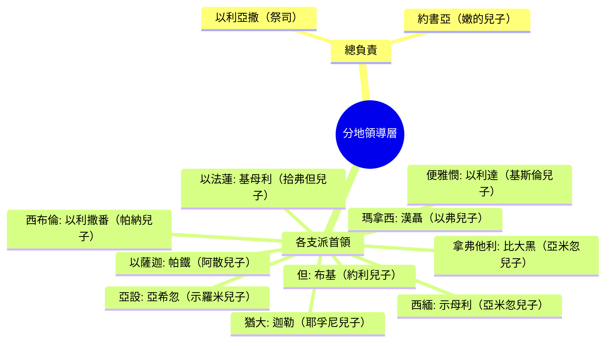

# 民數記 第34章

1. 耶和華曉諭摩西說：
2. 你吩咐以色列人說：你們到了[[迦南地界線|迦南地]]，就是[[迦南地界線|歸你們為業]]的[[迦南地界線|迦南四境]]之地，
3. 南角要從[[南界（尋的曠野至埃及小河）|尋的曠野]]，貼著以東的邊界；[[迦南地界線|南界]]要從鹽海東頭起，
4. 繞到亞克拉濱坡的南邊，接連到尋，直通到[[加低斯]]巴尼亞的南邊，又通到[[南界（尋的曠野至埃及小河）|哈薩亞達]]，接連到押們，
5. 從押們轉到埃及小河，直通到海為止。
6. 西邊要以[[西界（大海）|大海]]為界；這就是你們的西界。
7. 北界要從[[西界（大海）|大海]]起，畫到何珥山，
8. 從何珥山劃到[[哈馬口|哈馬]]口，通到[[北界（何珥山至以難）|西達達]]，
9. 又通到[[北界（何珥山至以難）|西斐崙]]，直到[[北界（何珥山至以難）|哈薩以難]]。這要作你們的北界。
10. 你們要從[[北界（何珥山至以難）|哈薩以難]]劃到示番為東界。
11. 這界要從示番下到亞延東邊的利比拉，又要達到基尼烈湖的東邊。
12. 這界要下到[[東界（以難至鹽海）|約但河]]，通到鹽海為止。這[[迦南地界線|四圍的邊界]]以內，要作你們的地。
13. 摩西吩咐以色列人說：這地就是耶和華吩咐拈鬮給[[按宗族拈鬮分地|九個半支派]]承受為業的；
14. 因為[[約但河東二支派半|流便]]支派和[[約但河東二支派半|迦得]]支派按著宗族受了產業，瑪拿西半個支派也受了產業。
15. 這兩個半支派已經在耶利哥對面、[[東界（以難至鹽海）|約但河]]東、向日出之地受了產業。
16. 耶和華曉諭摩西說：
17. 要給你們分地為業之人的名字是祭司[[分地首領預表基督與使徒|以利亞撒]]和嫩的兒子約書亞。
18. 又要從每支派中選一個首領幫助他們。
19. 這些人的名字：猶大支派有耶孚尼的兒子[[分地首領名單|迦勒]]。
20. 西緬支派有亞米忽的兒子[[分地首領名單|示母利]]。
21. 便雅憫支派有基斯倫的兒子[[分地首領名單|以利達]]。
22. 但支派有一個首領，約利的兒子[[分地首領名單|布基]]。
23. 約瑟的子孫瑪拿西支派有一個首領，以弗的兒子漢聶。
24. 以法蓮支派有一個首領，拾弗但的兒子基母利。
25. 西布倫支派有一個首領，帕納的兒子[[分地首領名單|以利撒番]]。
26. 以薩迦支派有一個首領，阿散的兒子[[分地首領名單|帕鐵]]。
27. 亞設支派有一個首領，示羅米的兒子[[分地首領名單|亞希忽]]。
28. 拿弗他利支派有一個首領，亞米忽的兒子[[分地首領名單|比大黑]]。
29. 這些人就是耶和華所吩咐、在[[迦南地界線|迦南地]]把產業分給以色列人的。

<!-- fhl-map-links:start -->
## 相關地圖

- [[appendix/fhl_maps/maps/021|〈民圖二〉探查應許地和應許地的範圍]]
- [[appendix/fhl_maps/maps/024|〈民圖五〉出埃及和進迦南的旅程]]
- [[appendix/fhl_maps/maps/025|〈申圖一〉應許之地全圖]]
- [[appendix/fhl_maps/maps/030|〈書圖三〉已得和未得之地]]
- [[appendix/fhl_maps/maps/032|〈書圖五〉約但河東兩個半支派的領土]]
- [[appendix/fhl_maps/maps/103|〈結圖三〉以西結預言的應許之地]]
<!-- fhl-map-links:end -->

---

## 本章知識節點

### 地理
- [[迦南地界線]]
- [[南界（尋的曠野至埃及小河）]]
- [[西界（大海）]]
- [[北界（何珥山至以難）]]
- [[東界（以難至鹽海）]]
- [[基內烈湖]]
- [[亞克拉濱坡]]
- [[哈馬口]]
- [[以難]]
- [[示斐崙]]
- [[利比亞]]
- [[鹽海]]
- [[加低斯]]
- [[何珥山]]
- [[埃及河的地理辨識]]

### 制度
- [[按宗族拈鬮分地]]
- [[分地首領名單]]
- [[約但河東二支派半]]

### 神學
- [[迦南地界線預表屬靈產業]]
- [[拈鬮分地預表神主權]]
- [[分地首領預表基督與使徒]]

---

## 本章整理

### 迦南地界線確定（v1-12）

耶和華向摩西詳細勾劃 **[[迦南地界線|迦南四境]]**，作為以色列人將要承受的產業範圍。四界依序為：

| 方向 | 經文路線 | 關鍵地標 |
|------|----------|----------|
| **南界** | 尋的曠野 → 亞克拉濱坡 → 加低斯巴尼亞 → 哈薩亞達 → 押們 → 埃及小河 → 海 | [[亞克拉濱坡]], [[加低斯]], [[埃及河的地理辨識|埃及小河]] |
| **西界** | 大海（地中海） | — |
| **北界** | 大海 → [[何珥山]] → [[哈馬口]] → 西達達 → [[示斐崙]] → [[以難]] | [[何珥山]], [[哈馬口]], [[示斐崙]], [[以難]] |
| **東界** | 以難 → 示番 → 利比拉東邊 → [[基內烈湖]]東邊 → 約但河 → [[鹽海]] | [[利比亞]], [[基內烈湖]], 約但河, [[鹽海]] |

這些界線不僅是地理邊界，更在神學上 **[[迦南地界線預表屬靈產業|預表屬靈產業的確定範圍]]**——神所賜的福分有明確界限，非人自行擴張。

### 產業分配原則與二支派半（v13-15）

摩西宣告：這地要 **[[按宗族拈鬮分地|按宗族拈鬮]]** 分給 **九個半支派**。[[拈鬮分地預表神主權|拈鬮]]一動作強調產業分配完全出於神的主權揀選，而非人謀劃。與此同時，**[[約但河東二支派半|流便、迦得、瑪拿西半支派]]** 已在約但河東、耶利哥對面領受產業，顯示神的應許跨越約但河兩岸。

### 分地首領名單（v16-29）

為執行分地，神指定兩位總負責人——祭司 **以利亞撒** 與 **約書亞**，並從各支派選立一位首領協助。名單如下：

這十位首領連同兩位總負責人，共同構成 **[[分地首領名單|分地執行團隊]]**；在預表層面，他們 **[[分地首領預表基督與使徒|預表基督與使徒]]** 將屬靈產業分賜給神的子民。

### 神學預表與跨章脈絡

> [!important] 本章樞紐
> **地界確定 → 拈鬮分地 → 首領執行** 三步驟完整呈現「應許之地」從藍圖落實為產業的過程。這模式在約書亞記 13-21 章全面展開，並指向新約「在基督裡得著產業」（弗 1:11, 14）。

- **地界的神聖性**：界線由耶和華親自「曉諭」摩西（v1, 13, 16），非人議定，呼應創世記 15:18-21 亞伯拉罕之約的具體化。
- **拈鬮的神學意義**：箴言 16:33「籤投在懷中，凡所定的乃是出於耶和華」；拈鬮排除人為操控，確立 **[[拈鬮分地預表神主權|神主權]]**。
- **首領的代表性**：各支派一名首領，體現「合一中分工」的團體性；迦勒（猶大）作為四十年前探子中的忠心者，今參與分地，見證神應許的成就。
- **二支派半的特殊地位**：他們雖居約但河東，仍屬以色列整體產業架構，預表教會雖在地上分散，在基督裡同為一體（林前 12:12-13）。

> [!question] 待考地名辨識
> 部分地標（如「示番」、「西達達」、「西斐崙」）在考古學上尚無定論；[[哈馬口]] 普遍認同為今敘利亞哈馬附近的奧龍特斯河谷入口，作為北界門戶。

**參考資料**
https://www.ccbiblestudy.org/Old%20Testament/04Num/04CT34.htm
https://www.ccbiblestudy.org/Old%20Testament/04Num/04GT34.htm
https://www.kingcomments.com/en/bible-studies/Num/34
https://biblehub.com/study/numbers/34.htm
