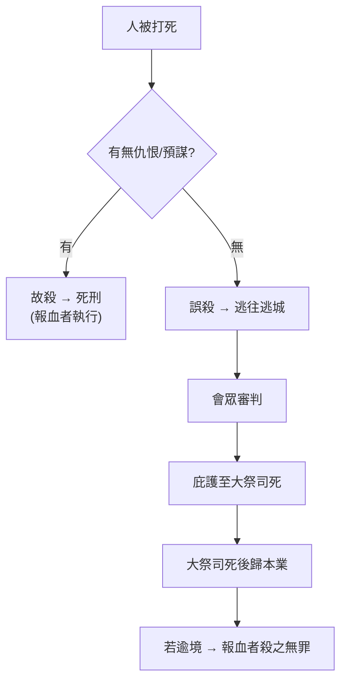

# 民數記 第35章

1. 耶和華在摩押平原─約但河邊、耶利哥對面曉諭摩西說：
2. 你吩咐以色列人，要從所得為業的地中把些城給利未人居住，也要把這城四圍的郊野給利未人。
3. 這城邑要歸他們居住，城邑的郊野可以牧養他們的牛羊和各樣的牲畜，又可以安置他們的財物。
4. 你們給利未人的郊野，要從城根起，四圍往外量一千肘。
5. 另外東量二千肘，南量二千肘，西量二千肘，北量二千肘，為邊界，城在當中；這要歸他們作城邑的郊野。
6. 你們給利未人的城邑，其中當有[[逃城六座|六座逃城]]，使[[誤殺與故殺界線|誤殺]]人的可以逃到那裡。此外還要給他們四十二座城。
7. 你們要給利未人的城，共有四十八座，連城帶郊野都要給他們。
8. 以色列人所得的地業從中要把些城邑給利未人；人多的就多給，人少的就少給；各支派要按所承受為業之地把城邑給利未人。
9. 耶和華曉諭摩西說：
10. 你吩咐以色列人說：你們過約但河，進了迦南地，
11. 就要分出幾座城，為你們作[[逃城六座|逃城]]，使[[誤殺與故殺界線|誤殺]]人的可以逃到那裡。
12. 這些城可以作逃避報仇人的城，使[[誤殺與故殺界線|誤殺]]人的不至於死，等他站在會眾面前聽審判。
13. 你們所分出來的城，要作[[逃城六座|六座逃城]]。
14. 在約但河東要分出三座城，在迦南地也要分出三座城，都作[[逃城六座|逃城]]。
15. 這六座城要給以色列人和他們中間的外人，並寄居的，作為[[逃城六座|逃城]]，使[[誤殺與故殺界線|誤殺]]人的都可以逃到那裡。
16. 倘若人用鐵器打人，以致打死，他就是[[誤殺與故殺界線|故殺]]人的；故殺人的必被治死。
17. 若用可以打死人的石頭打死了人，他就是[[誤殺與故殺界線|故殺]]人的；故殺人的必被治死。
18. 若用可以打死人的木器打死了人，他就是[[誤殺與故殺界線|故殺]]人的；故殺人的必被治死。
19. [[報血者|報血仇]]的必親自殺那[[誤殺與故殺界線|故殺]]人的，一遇見就殺他。
20. 人若因怨恨把人推倒，或是埋伏往人身上扔物，以致於死，
21. 或是因仇恨用手打人，以致於死，那打人的必被治死。他是[[誤殺與故殺界線|故殺]]人的；[[報血者|報血仇]]的一遇見就殺他。
22. 倘若人沒有仇恨，忽然將人推倒，或是沒有埋伏把物扔在人身上，
23. 或是沒有看見的時候用可以打死人的石頭扔在人身上，以致於死，本來與他無仇，也無意害他。
24. 會眾就要照典章，在打死人的和[[報血者|報血仇]]的中間審判。
25. 會眾要救這[[誤殺與故殺界線|誤殺]]人的脫離[[報血者|報血仇]]人的手，也要使他歸入[[逃城六座|逃城]]。他要住在其中，直等到受聖膏的[[逃城保護期限|大祭司死]]了。
26. 但[[誤殺與故殺界線|誤殺]]人的，無論什麼時候，若出了[[逃城六座|逃城]]的境外，
27. [[報血者|報血仇]]的在[[逃城六座|逃城]]境外遇見他，將他殺了，報血仇的就沒有流血之罪。
28. 因為[[誤殺與故殺界線|誤殺]]人的該住在[[逃城六座|逃城]]裡，等到[[逃城保護期限|大祭司死]]了。大祭司死了以後，誤殺人的才可以回到他所得為業之地。
29. 這在你們一切的住處，要作你們世世代代的律例典章。
30. 無論誰[[誤殺與故殺界線|故殺]]人，要憑幾個見證人的口把那故殺人的殺了，只是不可憑一個見證的口叫人死。
31. [[誤殺與故殺界線|故殺]]人、犯死罪的，你們不可收贖價代替他的命；他必被治死。
32. 那逃到[[逃城六座|逃城]]的人，你們不可為他收贖價，使他在大祭司未死以先再來住在本地。
33. 這樣，你們就不污穢所住之地，因為血是污穢地的；若有在地上流人血的，非流那殺人者的血，那地就不得潔淨（潔淨原文作贖）。
34. 你們不可玷污所住之地，就是我住在其中之地，因為我─耶和華住在以色列人中間。

<!-- fhl-map-links:start -->
## 相關地圖

- [[appendix/fhl_maps/maps/024|〈民圖五〉出埃及和進迦南的旅程]]
- [[appendix/fhl_maps/maps/038|〈書圖十一〉利未人的城和十二個支派的地業]]
<!-- fhl-map-links:end -->

---

## 本章知識節點

### 神學
- [[利未人四十八城]]
- [[逃城六座]]
- [[誤殺與故殺界線]]
- [[報血者]]
- [[逃城保護期限]]
- [[兩個見證人原則]]
- [[不可贖故殺人命]]
- [[污染地土]]
- [[逃城預表基督]]
- [[大祭司死預表基督]]

### 地理
- [[哥蘭]]
- [[拉末基列]]
- [[基低斯]]

---

## 本章整理

### 利未人產業與逃城設置（v1-15）
耶和華在摩押平原吩咐摩西，從以色列各支派產業中撥出 **四十八座城** 給利未人居住，連同四圍 **一千肘** 的郊野，再外延 **二千肘** 作為牧場（v4-5）。這 [[利未人四十八城|四十八座城]] 中，指定 **六座為逃城**——約但河東三座、迦南地西三座（v13-14），為 [[誤殺與故殺界線|誤殺人者]] 提供庇護，使其不至於在未經審判前死於 [[報血者|報血者]] 手中（v11-12）。逃城不僅保護以色列人，也庇護寄居的外人（v15），顯示神的公義不分國籍。

### 故殺與誤殺的法律界線（v16-28）
本章以具體器具與動機劃分 ==故殺== 與 ==誤殺==，建立司法判斷標準：

| 類別 | 判斷依據 | 處置 |
|------|----------|------|
| **故殺** | 用鐵器、石頭、木器等足以致死之器械；或因怨恨、埋伏、仇恨出手（v16-21) | 死刑，[[報血者|報血者]] 親自執行（v19,21） |
| **誤殺** | 無仇恨、無預謀、無看見而誤擊（v22-23) | 逃往 [[逃城六座|逃城]]，會眾 審判後庇護至 [[大祭司死預表基督|大祭司]] 死（v24-25） |

> [!important] **樞紐機制：大祭司之死**
> [[逃城保護期限|逃城保護期限]] 以 **受膏大祭司之死** 為終點（v25,28）。這不僅是時間標記，更預表 [[大祭司死預表基督|基督大祭司的死]] 為信徒帶來最終釋放——[[逃城預表基督|逃城預表基督]]，祂是我們永久的避難所（來 6:18-20）。

### 審判原則與地土潔淨（v29-34）
1. **兩個見證人原則**：定死刑案需憑兩三見證，不可憑單一口供（v30），防止冤殺。
2. **不可贖故殺人命**：謀殺罪不可用贖價代替（v31），亦不可為逃城中人收贖價縮短保護期（v32）——生命不可買賣。
3. **血污染地土**：流人血污穢之地，非流殺人者血無法潔淨（v33），因耶和華住在以色列中間（v34）。這奠定「地」與「約」的神學連結：公義審判維繫神的同在。

### 跨章脈絡：逃城制度的救贖預表
- **歷史實踐**：約書亞記 20 章落實六座逃城（[[基低斯|基低斯]]、[[希伯崙|希伯崙]]、[[拉末基列|拉末基列]]、[[哥蘭|哥蘭]] 等），對應本章地理分佈。
- **神學深化**：逃城制度揭示「公義與憐憫並存」——神不輕縱有罪（民 35:33），卻為軟弱者開生路。新約將此指向基督：祂是更美的逃城（來 6:18）、更大的大祭司（來 7:26-27），其死一次成就永遠贖罪，信徒在祂裡得享永不撤銷的庇護。

**參考資料**
https://www.ccbiblestudy.org/Old%20Testament/04Num/04CT35.htm
https://www.ccbiblestudy.org/Old%20Testament/04Num/04GT35.htm
https://www.kingcomments.com/en/bible-studies/Num/35
https://biblehub.com/study/numbers/35.htm
