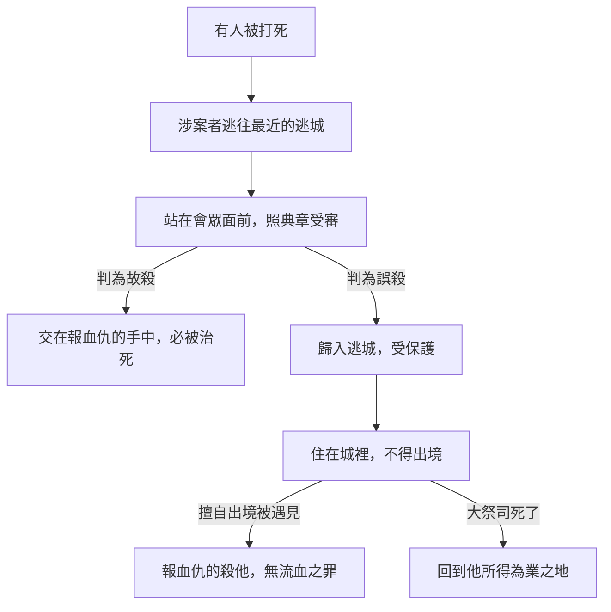

# 民數記 第35章

<!-- chapter-navigation:start -->
| [前一章](../04%20民數記/第34章.md) | [回目錄](../04%20民數記/全書目錄及綱要.md) | [下一章](../04%20民數記/第36章.md) |
| :--- | :---: | ---: |
<!-- chapter-navigation:end -->

1. 耶和華在[[摩押平原]]─[[約但河]]邊、[[耶利哥]]對面曉諭[[摩西]]說：
2. 你吩咐以色列人，要從所得[[產業（na.cha.lah）|為業]]的地中把些城給[[利未支派|利未人]]居住，也要把這城四圍的[[郊野（mig.rash）|郊野]]給利未人。
3. 這城邑要歸他們居住，城邑的[[郊野（mig.rash）|郊野]]可以牧養他們的牛羊和各樣的牲畜，又可以安置他們的財物。
4. 你們給[[利未支派|利未人]]的[[郊野（mig.rash）|郊野]]，要從城根起，四圍往外量一千肘。
5. 另外東量二千肘，南量二千肘，西量二千肘，北量二千肘，為邊界，城在當中；這要歸他們作城邑的[[郊野（mig.rash）|郊野]]。
6. 你們給[[利未支派|利未人]]的城邑，其中當有六座[[逃城]]，使[[殺人（ratsach）|誤殺人的]]可以逃到那裡。此外還要給他們四十二座城。
7. 你們要給[[利未支派|利未人]]的城，共有[[利未人的四十八座城|四十八座]]，連城帶[[郊野（mig.rash）|郊野]]都要給他們。
8. 以色列人所得的地業從中要把些城邑給[[利未支派|利未人]]；人多的就多給，人少的就少給；各支派要按所承受[[產業（na.cha.lah）|為業]]之地把城邑給利未人。
9. 耶和華曉諭[[摩西]]說：
10. 你吩咐以色列人說：你們過[[約但河]]，進了[[迦南地]]，
11. 就要分出幾座城，為你們作[[逃城]]，使[[殺人（ratsach）|誤殺人的]]可以逃到那裡。
12. 這些城可以作逃避[[救贖goel|報仇人]]的城，使[[殺人（ratsach）|誤殺人的]]不至於死，等他站在[[全會眾|會眾]]面前聽審判。
13. 你們所分出來的城，要作六座[[逃城]]。
14. 在[[約但河]]東要分出三座城，在[[迦南地]]也要分出三座城，都作[[逃城]]。
15. 這六座城要給以色列人和他們中間的外人，並[[寄居的]]，作為[[逃城]]，使[[殺人（ratsach）|誤殺人的]]都可以逃到那裡。
16. 倘若人用鐵器打人，以致打死，他就是[[謀殺與誤殺的區分|故殺人的]]；故殺人的[[死刑的罪行|必被治死]]。
17. 若用可以打死人的石頭打死了人，他就是[[謀殺與誤殺的區分|故殺人的]]；故殺人的[[死刑的罪行|必被治死]]。
18. 若用可以打死人的木器打死了人，他就是[[謀殺與誤殺的區分|故殺人的]]；故殺人的[[死刑的罪行|必被治死]]。
19. [[救贖goel|報血仇的]]必親自殺那[[謀殺與誤殺的區分|故殺人的]]，一遇見就殺他。
20. 人若因怨恨把人推倒，或是埋伏往人身上扔物，以致於死，
21. 或是因仇恨用手打人，以致於死，那打人的[[死刑的罪行|必被治死]]。他是[[謀殺與誤殺的區分|故殺人的]]；[[救贖goel|報血仇的]]一遇見就殺他。
22. 倘若人沒有仇恨，忽然將人推倒，或是沒有埋伏把物扔在人身上，
23. 或是沒有看見的時候用可以打死人的石頭扔在人身上，以致於死，本來與他無仇，也無意害他。
24. [[全會眾|會眾]]就要照[[典章]]，在打死人的和[[救贖goel|報血仇的]]中間審判。
25. [[全會眾|會眾]]要救這[[殺人（ratsach）|誤殺人的]]脫離[[救贖goel|報血仇人]]的手，也要使他歸入[[逃城]]。他要住在其中，直等到受[[聖膏油|聖膏]]的[[大祭司死了誤殺者才得釋放|大祭司死了]]。
26. 但[[殺人（ratsach）|誤殺人的]]，無論什麼時候，若出了[[逃城]]的境外，
27. [[救贖goel|報血仇的]]在[[逃城]]境外遇見他，將他殺了，報血仇的就沒有流血之罪。
28. 因為[[殺人（ratsach）|誤殺人的]]該住在[[逃城]]裡，等到[[大祭司死了誤殺者才得釋放|大祭司死了]]。大祭司死了以後，誤殺人的才可以回到他所得[[產業（na.cha.lah）|為業]]之地。
29. 這在你們一切的住處，要作你們世世代代的律例[[典章]]。
30. 無論誰故[[殺人（ratsach）|殺人]]，要[[憑幾個見證人的口]]把那[[謀殺與誤殺的區分|故殺人的]]殺了，只是不可憑一個見證的口叫人死。
31. 故[[殺人（ratsach）|殺人]]、犯死罪的，你們不可收[[贖命的價銀|贖價]]代替他的命；他[[死刑的罪行|必被治死]]。
32. 那逃到[[逃城]]的人，你們不可為他收[[贖命的價銀|贖價]]，使他在[[受膏的祭司|大祭司]]未死以先再來住在本地。
33. 這樣，你們就不[[污穢]]所住之地，因為[[血]]是污穢地的；若有在地上流人血的，非流那[[殺人（ratsach）|殺人]]者的血，那地就[[那地不得潔淨（ki.pher）|不得潔淨]]（潔淨原文作贖）。
34. 你們不可[[玷污自己也玷污地|玷污]]所住之地，就是我住在其中之地，因為我─耶和華[[神住在人間|住在以色列人中間]]。

---

## 本章知識節點

### 主題
- [[利未人的四十八座城]]
- [[利未人分散在各支派中]]
- [[憑幾個見證人的口]]
- [[利未人城邑房屋隨時贖回]]
- [[血]]
- [[污穢]]

### 神學
- [[謀殺與誤殺的區分]]
- [[大祭司死了誤殺者才得釋放]]
- [[救贖goel]]
- [[典章]]
- [[死刑的罪行]]
- [[玷污自己也玷污地]]
- [[神住在人間]]
- [[不可作假見證陷害人]]

### 原文
- [[郊野（mig.rash）]]
- [[殺人（ratsach）]]
- [[那地不得潔淨（ki.pher）]]
- [[產業（na.cha.lah）]]
- [[寄居的]]
- [[聖膏油]]
- [[贖命的價銀]]

### 互文
- [[逃城]]

### 人物
- [[摩西]]
- [[利未支派]]
- [[全會眾]]
- [[受膏的祭司]]

### 地點
- [[摩押平原]]
- [[約但河]]
- [[耶利哥]]
- [[迦南地]]

### 背景
- [[古代近東血仇制度]]
- [[古代近東祭壇庇護]]

---

## 本章整理

### 一、沒有地業的支派要住在哪裡（v1-8）

分地的規則畫完了（民34），還剩一個問題：[[利未支派|利未人]]怎麼辦。他們不分地，那就沒有城可住、沒有地可放牲畜。民35 的前八節就是回答這個問題——各支派從自己所得的地業裡撥城出來，連城帶郊野一起給。

**神說話的地點和上一章一樣。** 第1節「耶和華在[[摩押平原]]─[[約但河]]邊、[[耶利哥]]對面曉諭[[摩西]]說」。GT《聖經精讀本》把以色列在這裡接受的條例整條列出來：第二次數點人口、[[迦南地]]的征服計畫、獻祭和節期的條例、迦南地的分配原則、分配之地的繼承法，以及本章的利未人城邑與逃城制度——本章是這一串預備工作裡的第六項。

**給的是居住權，不是產業。** CT 註第2節：「因利未人並未分配產業之地給他們，除了能得到以色列人出產的十分之一供給他們生活所需之外，尚需居住之地」。GT《啟導本聖經註釋》算過這批地有多小：「這些城邑都很小，連四圍的效野在內，分給利未人的地加起來，只有四十平方公里，占迦南總面積不過千分之一。在靠農業為主的社會裡，這樣小的土地絕難維生；所以利未人仍可說是在以色列人中間沒有產業的支派」。CT 因此在〔話中之光〕說：「利未人只有居住權，而沒有產權」。

**[[郊野（mig.rash）|郊野]]是牧草地，不是農田。** STEP語言資料顯示它是 mig.Rash（H4054），簡要詞典義 pasture；CT 的原文字義給「空地」。KingComments 說明用途：這片地是給利未人的牲畜的，不是給他們耕種的——他們不必撒種收割，神藉別人所出的十分之一供養他們，好讓他們專心研讀律法並教導神的百姓。

尺寸的兩個數字，各家讀法不同：

| 節次 | 原文的量法（STEP語言資料） | CT 的解釋 |
|---|---|---|
| v4 | 從 mi./Kir（H7023，wall）起，四圍往外 'E.lef 'a.Mah（一千肘） | 約450公尺，供建倉房和牲畜欄圈 |
| v5 | 東西南北各 'al.Pa.yim（二千肘），城在當中 | 約900公尺，供設墳地、花園、葡萄園、田園等其他用途 |

GT《民數記串珠聖經註釋》不採兩塊地的讀法，而是畫了一張示意圖把兩個數字放進同一塊：城在正中，從城牆往外一千肘，所以整條邊長是二千肘。它另註明第3節「牛，羊，牲畜，財物」應作「牛群，羊群，牲畜」，原文並無「財物」。

**[[利未人的四十八座城|四十八座城]]怎麼算出來的。** 六座逃城加四十二座，第8節定下分攤原則：「人多的就多給，人少的就少給」。STEP語言資料顯示這一句用了兩組相對的動詞——ha./Rav tar.Bu（H7227A、H7235A）與 ha/m.'At tam.'I.tu（H4592、H4591），末了以 'Ish ke./Fi na.cha.la.T/o（H376I、H6310K、H5159）收束。GT 丁良才《民數記註釋》給了後來實際的數字：「猶大和西緬支派將九座城分給了利未人，拿弗他利給了三座城，其餘的支派，各給了四座城，共四十八座城（書二十一章）。」四十八這個數，GT《民數記串珠聖經註釋》讀成「四乘十二等於四十八，四代表神的國，正如十二支派在帳幕四方安營」；KingComments 讀成六乘八——六是人的數字，八代表新的開始。

> [!important] [[利未人分散在各支派中|散住]]這件事，本來是一句咒詛
> KingComments 說，利未人散居全地是雅各預言的應驗（創49:7）：利未曾行凶暴、當受審判，神卻把這件本身意味著審判的事變成祝福，因為分散，他們才能在各處教導百姓神的律例。GT 丁良才說法相同——這原來是咒詛的話，「神卻因出三十二28-29節的事，叫這話變為祝福」。GT《聖經精讀本》補上另一個理由：分散一方面是因為創世記49:7的預言，「但是更重要的理由是神揀選利未人讓他們代行聖工(利10:11;申33:9,10)」。

### 二、六座逃城（v9-15）

第9節神再開口，講的是同一批城裡的六座。GT《聖經精讀本》先把制度的位置說清楚：神設立報血仇的法則（創9:5,6），「但是在進入迦南之前又制訂了報血仇的例外規定——逃城制度」。

| 位置 | 城名（GT《啟導本聖經註釋》） | 所屬支派 | 誰指定的（GT 丁良才） |
|---|---|---|---|
| 約但河東 | 比悉 | 流便 | 摩西親自選定（申四43） |
| 約但河東 | 拉末 | 迦得 | 摩西親自選定（申四43） |
| 約但河東 | 哥蘭 | 瑪拿西半支派 | 摩西親自選定（申四43） |
| 迦南地 | 基低斯 | 拿弗他利 | 約書亞規定（書二十7） |
| 迦南地 | 示劍 | 以法蓮 | 約書亞規定（書二十7） |
| 迦南地 | 希伯侖 | 猶大 | 約書亞規定（書二十7） |

**為什麼要六座，而且分兩邊。** CT 註第14節：「因河東地區遼闊，為了方便誤殺者逃命，故分設三座逃城」，並在靈意註解說這「表徵救恩的便利性，隨手可得」。GT 丁良才記下一個估算：「有注釋家以為這六座逃城，特被揀選，使迦南各處的人，相離至多有九十裡路」，並提到摩西吩咐日後版圖擴張時還要再添三座（申十九8-9）。KingComments 注意到地形：迦南地的三座城都在高處，遠遠就看得見，他因此引主耶穌的話——「城造在山上，是不能隱藏的」。

**[[逃城]]保護的不只是以色列人。** 第15節把[[寄居的]]也包進來。STEP語言資料顯示這裡是兩個字：Ger（H1616）與 to.Shav（H8453A），簡要詞典義都是 sojourner。CT 把兩者分開：「『他們中間的外人』指傾向猶太教但尚未正式歸化的外邦人；『寄居的』指不接受猶太教禮儀的外邦人」，並在靈意註解說這「表徵救恩的涵蓋性，無所不包」。GT《聖經精讀本》說得更直白：外人也能享受逃城制度的恩惠，「這說明神不僅是以色列的神,也是外邦人的神」。

> [!note] 逃城不是憑空冒出來的
> GT《舊約聖經背景註釋》指出，這套辦法「可能有延伸或替代出埃及記二十一12～14『庇護性祭壇』的作用」，並給了一個祭司角度的理由：祭司團體可能擔心犯法者抓住祭壇的角，有污穢祭壇和聖所之虞；把庇護地區擴大到整個逃城，玷污就不會發生，被告在審訊之前也可以有較佳的住宿環境（見 [[古代近東祭壇庇護]]）。KingComments 補上實務面：進了迦南之後，很多情況下跑到耶路撒冷的壇那裡都太遠，來不及躲開報血仇的（申19:6）。

### 三、故殺與誤殺，怎麼分（v16-24）

第16-21節列故殺，第22-23節列誤殺，第24節交給會眾判。GT《民數記串珠聖經註釋》歸納判準：「謀殺的動機可從武器的種類或先前的仇怨判斷。若用可置人死地的武器，如鐵器、木器，就是蓄意殺人。」

| 判準 | 故殺（v16-21） | 誤殺（v22-23） |
|---|---|---|
| 凶器 | 鐵器、可以打死人的石頭、木器 | 沒有看見的時候扔出的石頭 |
| 動機 | 因怨恨、因仇恨 | 「本來與他無仇，也無意害他」 |
| 手法 | 埋伏往人身上扔物、用手打人 | 忽然推倒、沒有埋伏 |
| 結果 | 必被治死，報血仇的一遇見就殺他 | 會眾審判後歸入逃城 |

CT 把幾樣凶器分別註開：「『鐵器』代表一切能傷害人的凶器」、「『石頭』指臨時入手可得，能傷人致死之物」、「『可以打死人的木器』指粗大堅硬的木器」；動機一面則是「『因怨恨』指行為的動機出於怨恨」、「『埋伏…扔物』指伺機趁對方不注意時擊中要害」。KingComments 從凶器推回意圖：一個人手裡拿著那樣東西打人，他必定知道那能打死人，本來就不該拿它對付別人。GT《聖經精讀本》把整段的重心說出來：「神在行為的結果背後,首先關注其原因和動機(太5:21-28;15:19)」。

**兩種殺人在原文是同一個字。** STEP語言資料顯示，和合本第6、11、12、25-28節的「誤殺人的」與第16-21、30、31節的「故殺人的」都是 ro.Tze.ach（H7523，詞典形 ra.tsach，簡要詞典義 to murder），Qal 主動分詞；分別它們的是第11、15節多出來的一個字 bi/sh.ga.Gah（H7684，簡要詞典義 unintentionally），以及第20-23節描述的仇恨與埋伏。這個字正是[[殺人（ratsach）|第六誡所用的動詞]]，也因此本章第30節出現一個值得慢讀的用法——「把那故殺人的殺了」，STEP語言資料顯示這個「殺」同樣是 ra.tsach（yir.Tzach）。GT 賈斯樂郝威《聖經難解經文詮釋手冊》正是為這個張力寫了一則答問：出二十13 所禁的是謀殺，而民三十五所准許的「是讓人認識到殺人就必被處死的責任。這兩者之間並無衝突」（見 [[謀殺與誤殺的區分]]）。

**[[救贖goel|報血仇的]]，原文是「贖」那個字。** STEP語言資料顯示第12、19、21、24、25、27節的「報血仇的」是 go.'El ha./Dam（H1350H 加 H1818），H1350 的簡要詞典義是 to redeem: avenge。KingComments 直接點出這層雙重身分：「報血仇的」在希伯來文就是 goël，同一個字也用於贖回失去的家業時的「至近親屬」，兩種身分都是在為家族的權利站住。GT 丁良才把至近親屬的兩種本分並列：人若賣身或變賣產業，至近親屬要為他贖回；人若被殺，至近親屬要為他報仇。

> [!info] 為什麼這套家族復仇的辦法需要被修正
> GT 丁良才列出三個缺點：「1被告的人有時無法證明自己無罪；2無法分辨故殺誤殺；3往往因互相報仇的緣故，兩家用死力相爭。故此神設立逃城，要免這些弊病。」GT《舊約聖經背景註釋》的判斷方向相同：這種家族間的血仇「對於司法的執行卻有不良的影響」，設立六個逃城的目的，「就是給人有回復冷靜的時間，以及為被告提供正當程序」（見 [[古代近東血仇制度]]）。

### 四、從逃跑到回家的整條程序（v12、24-29）

```mermaid
flowchart TD
    A["有人被打死"] --> B["涉案者逃往最近的逃城"]
    B --> C["站在會眾面前，照典章受審"]
    C -->|判為故殺| D["交在報血仇的手中，必被治死"]
    C -->|判為誤殺| E["歸入逃城，受保護"]
    E --> F["住在城裡，不得出境"]
    F -->|擅自出境被遇見| G["報血仇的殺他，無流血之罪"]
    F -->|大祭司死了| H["回到他所得為業之地"]
```

第12節先立下原則：逃城是為了「使誤殺人的不至於死，等他站在[[全會眾|會眾]]面前聽審判」。CT 把這句話拆成四層意思：案件不能私了、需經過公開審訊、依據見證和證據、由審判官下達公正的判決。他在靈意註解裡說，這一節是「『愛』與『公義』在此得到平衡；『權利』與『義務』兩全」。第24節說會眾「要照[[典章]]，在打死人的和報血仇的中間審判」——STEP語言資料顯示「典章」是 ha./mish.pa.Tim（H4941G），簡要詞典義 justice: judgement，「審判」的動詞是 sha.fe.Tu（H8199）。

GT 丁良才描述實際運作：「殺人的進入逃城以後，報仇的就不能害他，只可在官長面前告他。審判官大概要在靠近殺人的地方（因為容易得證據），在百姓面前，照著律例審問這事。」KingComments 把整套流程列成五步，其中第三步是逃城的長老要查明這是意外還是蓄意，第五步則是誤殺者留在城中直到[[受膏的祭司|大祭司]]死——只要大祭司還活著，他一離開城，報血仇的仍有權殺他，「安全只在城裡才有保障」。

**住在城裡不是零成本的。** GT 丁良才列出誤殺者不能做的三件事：住在自己的家裡、耕種自己的田地、經理自己的事務——「顯明誤殺的仍要受罰」。CT 也說第26節的「無論什麼時候」意思是「無論住在逃城中有多久，都不得出城」。KingComments 從逃城的性質解釋這條界線：逃城是一個分別出來的地方，帶著利未城的性格。

### 五、兩道不可跨越的線（v30-32）

第30-32節加上兩道限制，一道管證據，一道管金錢。

**[[憑幾個見證人的口|見證人必須不只一個]]。** STEP語言資料顯示第30節「憑幾個見證人的口」是 le./Fi 'e.Dim（H6310I 加 H5707，複數），對比「一個見證」是 'Ed 'e.Chad（H5707 加 H259）。CT 註：「『幾個見證人』指兩個以上的見證人（參申十七6；來十28）」，並說明這道限制的用意——「『不可憑一個見證的口』這是為防止作假見證」（見 [[不可作假見證陷害人]]）。GT《聖經精讀本》說是「為了表明律法的公正性和慎重性,也暗示對生命的敬畏」。KingComments 引保羅：「凡事都要憑兩三個人的口作見證」（林後13:1）。

這裡有個現實問題：多數殺人案根本沒有目擊者。GT 艾基斯《舊約聖經難題彙編》回到原文用法回答——利未記5:1 說「他本是見證，卻不把所看見的，所知道的，說出來」，「所知道的」已經把非目擊的知情者算進去；出埃及記22:13 用同一個字指被野獸撕碎的屍身，那具屍體就是證據。他的結論是：實物或文件都可以作為呈堂證物，「這頗相似於我們今天審訊各類案件時也有的證物」。CT 的講法一致：「『見證人』原意是指在場目睹的證人，可延伸為事發現場的犯罪證據」。

**不可拿錢換命。** 第31、32節兩次禁止收[[贖命的價銀|贖價]]——STEP語言資料顯示原文是 kho.fer（H3724A，簡要詞典義 ransom）。CT 說這條的用意「意指生命無價，用意在防止審判官和受害者家屬貪財，也防止有錢人仗財害命」。GT 丁良才把兩節的理由分開講：第31節是因為「借著求公義，倒成了貪財的心願；所以神全然禁止這事」，第32節則「一面免得人生貪心，一面免得財主比窮人少受刑罰」。GT《舊約聖經背景註釋》把它放進當時的法律環境對照：「赫人和中亞述的法律，都容許贖價買回兇手的性命。亞述法律則採取中間途徑，給予死者最近的親屬權利，選擇處死兇手還是接受贖價。」KingComments 的說法是：無論價碼多高、努力多大，都不能讓一個有罪的殺人者逃過刑罰。

### 六、為什麼要這麼嚴：[[血]]與地（v33-34）

整章收在兩節理由上。STEP語言資料顯示這兩節換了三個不同的動詞：

| 節次 | 和合本 | 原文（STEP語言資料） | 簡要詞典義 |
|---|---|---|---|
| v33 | [[污穢]] | ta.cha.Ni.fu（H2610 cha.neph） | to pollute |
| v33 | 不得潔淨 | ye.khu.Par（H3722A ki.pher） | to atone |
| v34 | 玷污 | te.ta.Me'（H2930A ta.me） | to defile |

和合本自己在第33節句末註明「潔淨原文作贖」，[[那地不得潔淨（ki.pher）|STEP 也證實了這一點]]——那個動詞是 ki.pher，Pual 形；CT 的原文字義給的方向相同：「遮蓋，贖回，平息」。GT《舊約聖經背景註釋》解釋為什麼只有血能贖血：「由於血是生命之源、神的賜與，因此流血所造成的玷污只有藉著流血，才能塗抹。」第34節的「玷污」又換了一個字，把這段接回[[玷污自己也玷污地|地因居民的行為而受污]]這條舊線。CT 則列出土地會不潔淨的兩種原因：「(1)是否敬拜偶像假神；(2)是否流無辜之人的血。為著第一種情形，神命以色列人除滅迦南人；為著第二種情形，神命以色列人嚴格執行逃城制度。」

第34節給出最後一個理由：這地是[[神住在人間|神自己住的地方]]。==STEP語言資料顯示這一節用了兩個不同的「住」==：以色列人「所住之地」是 yo.she.Vim（H3427 ya.shav），神「住在以色列人中間」則是 sho.Khen（H7931 sha.khan）。CT 把這句話的邏輯推完：所住之地若被玷污，便不宜讓神居住其中；而若沒有神的同住，便不適宜供人居住。他並在〔話中之光〕引溫漢（Gordon Wenham）：「由於聖潔的神不能住在污穢的地方，而不審判其中的居民，以色列一定要特別留意保持土地的純潔，流人血的罪一出現，就要立刻處理。本段把流人血的罪挑出來討論，是因為它造成的污穢是最嚴重的。」

### 七、跨章脈絡：從壇的角到大祭司的死

```mermaid
timeline
    title 逃城制度在聖經中的推進
    出21:12-14 : 誤殺者可逃往神所指定的地方，庇護點是壇
    民35 : 六座逃城、審判程序、大祭司之死為期限
    申4:41-43 : 摩西親自分定河東三座城
    申19:1-13 : 重申並預備日後增設三座
    書20:1-9 : 六座城全數指名設立
    書21:1-42 : 四十八座利未城連同逃城一併分配
```

**[[大祭司死了誤殺者才得釋放|把人釋放的不是刑期，是一個人的死]]。** GT《舊約聖經背景註釋》說得最清楚：「解除誤殺人者之罪的，不是這人在逃城流放的日子……任何人被殺都會構成流人血的罪，惟有另一人的死亡，才能把它消除。」STEP語言資料顯示第25節的完整說法是 'ad- mOt ha./ko.Hen ha./ga.Dol 'a.Sher- ma.Shach 'o.T/o be./She.men ha./Ko.desh——直到那位受[[聖膏油|聖膏]]所膏的大祭司死。

四套來源在這一點上收在同一個方向。CT：「大祭司之死乃預表基督救贖之死」；GT 丁良才：大祭司受聖膏是預表基督，他的死有兩種功效——「1使罪惡得塗抹；2使罪人被釋放」；GT《聖經精讀本》：「這預表著我們因著耶穌基督的代死而得救(約1:29;啟1:18)」；BibleHub Study 也把它接到來9:11-14 的終極大祭司。KingComments 另指出一個只有民數記才有的細節：大祭司死後誤殺者才得回產業，這一條在申命記與約書亞記都沒有。

> [!example]- GT 丁良才列的逃城九層預表
> 丁良才《民數記註釋》把逃城逐條對照基督，其中包括：逃城是神所定的、是眾人所共知的、是常為眾人公開的；本地人或外人都可以在逃城裡得救；以色列人常將逃城道路修得十分平坦、安設路牌給人指明方向；在逃城裡常有空閒的寓所；在逃城內以色列人和外邦人並無分別；人若住在逃城裡就能十分穩妥地脫離刑罰；在逃城裡的人得救，是因大祭司的死。

KingComments 把這條線拉到新約：以色列殺了彌賽亞，卻是在無知中做的，所以還有盼望——他引主在十字架上的話「父啊，赦免他們！因為他們所做的，他們不曉得」（路23:34），又引五旬節之後彼得對眾人說的「我曉得你們做這事是出於不知，你們的官長也是如此」（徒3:17）。他說使徒行傳第二章彼得呼籲悔改，就是為那些人打開了逃城的門，而希伯來書六18 所說的「逃往避難所」正落在同一條線上——這使基督成為真正的逃城。CT 從同一段讀出的重點稍有不同，他強調的是限制的一面：「住在逃城裡似乎是接受了限制，但這些限制是把人限定在恩典裡」。

[[死刑的罪行|故殺人必被治死]]這條線也一路貫穿本章。STEP語言資料顯示第31節末尾是 Mot yu.Mat（H4191，不定詞絕對式配 Hophal），語氣是加重的「必定被治死」。GT 丁良才把第31至34節連起來看，給了整章一個總結式的理由：「金銀或能使那被殺之人的親屬止息怒氣，卻不能使造那人之主的震怒止息。神是聖潔的，不肯容讓人的惡行，所以應受罰的人，也必須受罰。」

**參考資料**
https://www.ccbiblestudy.org/Old%20Testament/04Num/04CT35.htm
https://www.ccbiblestudy.org/Old%20Testament/04Num/04GT35.htm
https://www.kingcomments.com/en/bible-studies/Num/35
https://biblehub.com/study/numbers/35.htm
https://github.com/STEPBible/STEPBible-Data

<!-- appendix-links:start -->
## 附錄

### 相關地圖
- [[appendix/fhl_maps/maps/024|〈民圖五〉出埃及和進迦南的旅程]]
- [[appendix/fhl_maps/maps/038|〈書圖十一〉利未人的城和十二個支派的地業]]
<!-- appendix-links:end -->

<!-- chapter-navigation:start -->
| [前一章](../04%20民數記/第34章.md) | [回目錄](../04%20民數記/全書目錄及綱要.md) | [下一章](../04%20民數記/第36章.md) |
| :--- | :---: | ---: |
<!-- chapter-navigation:end -->
