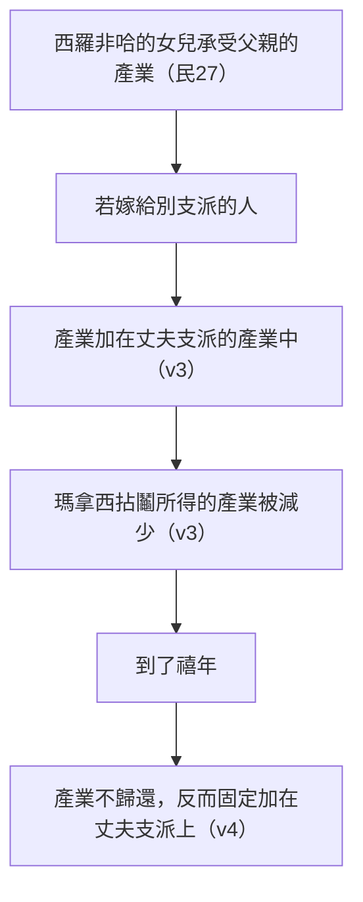

# 民數記 第36章

<!-- chapter-navigation:start -->
| [前一章](../04%20民數記/第35章.md) | [回目錄](../04%20民數記/全書目錄及綱要.md) |  |
| :--- | :---: | ---: |
<!-- chapter-navigation:end -->

1. [[約瑟]]的後裔，[[瑪拿西]]的孫子，[[瑪吉]]的兒子基列，他子孫中的諸族長來到[[摩西]]和作首領的以色列人族長面前，說：
2. 耶和華曾吩咐[[稱摩西為我主|我主]][[拈鬮分地（go.ral）|拈鬮分地]]給以色列人為業，我主也受了耶和華的吩咐將我們兄弟西羅非哈的[[產業（na.cha.lah）|產業]]分給他的眾女兒。
3. 他們若嫁以色列別支派的人，就必將我們祖宗所遺留的[[產業（na.cha.lah）|產業]]加在他們丈夫支派的產業中。這樣，我們[[拈鬮分地（go.ral）|拈鬮]]所得的產業就要[[產業減少（ga.ra）|減少]]了。
4. 到了以色列人的[[禧年（第五十年）|禧年]]，這女兒的[[產業（na.cha.lah）|產業]]就必加在他們丈夫支派的產業上。這樣，我們祖宗支派的產業就[[產業減少（ga.ra）|減少]]了。
5. [[摩西]]照耶和華的話吩咐以色列人說：[[約瑟]]支派的人說得有理。
6. 論到[[西羅非哈的女兒|西羅非哈的眾女兒]]，耶和華這樣吩咐說：他們可以隨意嫁人，只是要嫁[[同宗支派的兩種解釋|同宗支派]]的人。
7. 這樣，以色列人的[[產業（na.cha.lah）|產業]]就不從這支派歸到那支派，因為以色列人要[[各守各的產業（da.vaq）|各守各]]祖宗支派的產業。
8. 凡在以色列支派中[[女兒承受產業的條例|得了產業的女子]]必作[[同宗支派的兩種解釋|同宗支派]]人的妻，好叫以色列人各自承受他祖宗的產業。
9. 這樣，他們的[[產業（na.cha.lah）|產業]]就不從這支派歸到那支派，因為以色列支派的人要[[各守各的產業（da.vaq）|各守各的產業]]。
10. 耶和華怎樣吩咐[[摩西]]，[[西羅非哈的女兒|西羅非哈的眾女兒]]就怎樣行。
11. [[西羅非哈的女兒]]瑪拉、得撒、曷拉、密迦、挪阿都嫁了他們伯叔的兒子。
12. 他們嫁入[[約瑟]]兒子、[[瑪拿西]]子孫的族中；他們的[[產業（na.cha.lah）|產業]]仍留在[[同宗支派的兩種解釋|同宗支派]]中。
13. 這是耶和華在[[摩押平原]]─[[約但河]]邊、[[耶利哥]]對面─藉著[[摩西]]所吩咐以色列人的命令[[典章]]。

---

## 本章知識節點

### 主題
- [[女兒承受產業的條例]]
- [[拈鬮分地（go.ral）]]
- [[家室與宗族]]
- [[稱摩西為我主]]
- [[民數記的結語]]

### 原文
- [[產業（na.cha.lah）]]
- [[禧年（第五十年）]]
- [[各守各的產業（da.vaq）]]
- [[產業減少（ga.ra）]]

### 解經爭議
- [[同宗支派的兩種解釋]]
- [[瑪拿西半支派為何留在河東]]

### 神學
- [[典章]]

### 人物
- [[西羅非哈的女兒]]
- [[摩西]]
- [[瑪吉]]
- [[瑪拿西]]
- [[約瑟]]

### 地點
- [[摩押平原]]
- [[約但河]]
- [[耶利哥]]

---

## 本章整理

### 一、一個被漏掉的後果（v1-4）

民數記27 判過一次：西羅非哈沒有兒子，他的五個女兒可以承受父親的產業。那次判決解決了一個問題，也開了一個沒人算到的口子——女兒出嫁，地會不會跟著人走到別的支派去？

**來提問的是誰。** 第1節：「[[約瑟]]的後裔，[[瑪拿西]]的孫子，[[瑪吉]]的兒子基列，他子孫中的諸族長」。CT 在背景註解裡把這一族的結構算了一遍：「瑪拿西僅有一個兒子瑪吉，瑪吉又僅有一個兒子基列，而基列有六個兒子(參二十六29~32)。這樣，瑪拿西支派中的八個家族，一個是兒子，一個是孫子，另外六個都是曾孫。」來的是曾孫輩那六個族長。

> [!note] 為什麼[[瑪拿西半支派為何留在河東|瑪吉族與基列族的族長沒有一起來]]
> CT 註第1節：「瑪吉族和基列族的產業分配在約但河東，而此次的問題與這兩族無關，故可能他們的族長可能缺席。」GT 丁良才《民數記註釋》說法相同：「瑪姬人的族長不在其內⋯⋯因為他們在約旦河東已經得了基業」，並判斷來的「乃是基列子孫六族的族長」。

**[[稱摩西為我主|他們的開場稱呼]]。** 第2節裡「我主」出現兩次。GT 丁良才注意到這個用詞不常見：「當時的以色列人，比前輩的人對於[[摩西]]更加恭敬⋯⋯按聖書上所記，唯獨亞倫和約書亞曾稱摩西為主。」GT《聖經精讀本》讀出的是承認：「這說明基列子孫的族長承認摩西代表神的權威,是神與人之間的中保」，並指出他們並沒有把問題帶到作為人的摩西面前，而是帶到把權威賦予摩西的神面前解決。==STEP語言資料顯示同一節裡兩個「吩咐」的形態不同==：前半「耶和華曾吩咐」是 tzi.Vah（H6680，Piel 主動），後半「我主也受了耶和華的吩咐」卻是 tzu.Vah ba./Yah.weh（H6680，Pual 被動）——摩西在這一節裡是受命的一方。

**他們算的帳。** 第3-4節是一段兩步的推演：



[[產業減少（ga.ra）|「減少」與「加在」在原文是配對的兩個被動動詞]]。STEP語言資料顯示「減少」是 ve./nig.re.'Ah 與 yi.ga.Re.a'（H1639，詞典形 ga.ra），「加在」是 ve./no.Saf 與 ve./nos.Fah（H3254H，詞典形 ya.saph），兩者都是 Niphal——地不是被誰拿走，是「被減去」與「被加上」。CT 的原文字義給「減少」作「減少，限制，撤回」。

**[[禧年（第五十年）|禧年]]是這段推演的關鍵一步。** 照常理，禧年是所有賣出的地歸回原主的年份，本來應該能救回來。GT 丁良才把這一步講白了：「本節的意思說，到禧年的時候，這地必不歸與我們的支派」，並列出兩種本來還有指望的情況——瑪拿西人把產業買回來，或那些女兒沒有留下兒子——但補上一句：那些女兒若嫁與別支派的人，瑪拿西人雖買回女兒的地，到了禧年，那地還要歸與丈夫的支派。GT《聖經精讀本》講的是同一件事：一旦到了禧年，一切都回到原主人手裡，重新回到繼承產業的女子手中，「所以在禧年以後這個地將永遠屬於丈夫的支派」。==禧年在這裡不是還原鍵，反而把轉移蓋上了永久的章。==

> [!important] 這不是護產，是護見證
> CT 在第4節的〔話中之光〕分辨得很清楚：「增加個人所有是利益的問題，而保守神的賞賜是見證的問題，事實上，神給瑪拿西支派的，別支派的人也不能去接收。」GT《聖經精讀本》也說首領們「出於要持守神的祝福的心願,把這個問題帶到了神面前」。KingComments 讀法相同：族長們提問不是要挑戰民數記27 的裁決，他們對那項裁決的正確性毫無懷疑；他們關心的是拿到之後怎麼守住。他說民數記27 講的是地位，這一章講的是責任。

### 二、神的判決：自由，但有半徑（v5-9）

**摩西沒有自己拿主意。** 第5節「摩西照耶和華的話吩咐以色列人說：約瑟支派的人說得有理」。CT 註：「顯然，摩西曾將此問題求問神，得到神的答覆（參二十七5~6）。」GT《聖經精讀本》也說這一句「暗示摩西並沒有按自己的主張發表意見,而是按神的啟示說話」。BH 同樣指出這句話凸顯摩西行動背後的神聖權柄。

**判決只有一句，卻是兩半。** 第6節：「他們可以隨意嫁人，只是要嫁同宗支派的人。」

| 這一半 | 內容 | 各家的讀法 |
|---|---|---|
| 自由 | 可以隨意嫁人 | CT 靈意註解：表徵神尊重信徒自由選擇的權利 |
| 界線 | 只是要嫁同宗支派的人 | GT《聖經精讀本》：「神就是這樣既給人特權同時也賦予人義務」 |

STEP語言資料顯示「隨意」在原文是 la./Tov be./'ei.nei./Hem（H2896A 加 H5869I），字面是：在他們眼中看為好的；CT 的原文字義給的兩個字也是「眼睛，泉源」與「好的，令人愉悅的」。

> [!question] [[同宗支派的兩種解釋|「同宗支派」到底畫多大的圈]]
> CT 在第6節的備註裡並列兩種解釋：一是指同一支派，理由是這規定的主要動機在避免產業由一個支派轉到別的支派（參7-9節）；二是指同一支派內的同一宗族，理由是西羅非哈的女兒們都嫁給了同一宗族的人（參11-12節），而且分地原則本來就按[[家室與宗族|家室（即宗族）]]人數的多寡。GT 丁良才列出同樣兩解並表明傾向：「以色列人既然要按宗族分地⋯⋯第一個解法或近乎是」，也就是宗族說。STEP語言資料顯示原文片語 le./mish.Pa.chat ma.Teh 'a.vi./Hem 裡兩個詞都在——mish.Pa.chat 是 H4940（簡要詞典義 family），ma.Teh 是 H4294H（簡要詞典義 tribe）。

**第7、9節兩次收在同一句話上。** 「因為以色列人要各守各祖宗支派的[[產業（na.cha.lah）|產業]]」、「因為以色列支派的人要各守各的產業」。[[各守各的產業（da.vaq）|「守」在原文不是站崗，是黏著]]——STEP語言資料顯示動詞是 yid.be.Ku（H1692，詞典形 da.vaq），簡要詞典義 to cleave；CT 的原文字義給「附著，黏住，緊靠」。同一節裡的反向動作是「歸到」，原文 ti.So（H5437G，詞典形 sa.vav），CT 作「轉動，轉向，導向」。一節之內兩個動作正好相反：地不可以在支派之間轉來轉去，人要黏在自己那一份上。

CT 在第7節的〔話中之光〕把這條命令拆成兩面：「(1)不漠視自己的產業，應當視之為神的賜予，繼而以感恩的心好好守著；(2)不侵犯他人的產業，應當視之為道德的紅線，繼而以敬畏的心予以尊重。」他在第9節補上理由：各支派所得的產業不是自己爭來的，是[[拈鬮分地（go.ral）|拈鬮]]分得的，「這是說，是神所安排，所命定的」。GT 丁良才舉了一個後來的實例：「拿伯不賣葡萄園，就是守本節的條例」。

KingComments 從這一句讀出一個對今天的提醒：第7節那句話是額外的鼓勵，而人很容易順著遊移和改變的傾向走；這種不安於位、不再守住所分派的工作或所指定的位置的心態，正是這個時代的特徵，而這股求變的風氣並沒有停在教會門外。他引哥林多前書七20「你們各人蒙召的時候是什麼身分，仍要守住這身分」。

**第8節把個案變成通則。** 「凡在以色列支派中得了產業的女子必作同宗支派人的妻」——[[女兒承受產業的條例|民27 的判例]]到這裡補齊了另一半。GT 丁良才一句話說完：「神為西羅非哈的女兒所定的，成了以色列眾人應守的常典。」GT《民數記串珠聖經註釋》把兩次判決的原則並排：

| 判決 | 處理原則 |
|---|---|
| 民27 | 父親的產業不應因無兒子而落入外人手上，應由女兒或近親承受 |
| 民36 | 一個支派的產業不應因女子出嫁而歸入另一支派，各支派應保全祖傳的產業 |

串珠並說「這問題比上一個更為重要，承業的女子應以此原則為大前提，選擇自己支派的人作婚姻物件」。

### 三、她們照著做了（v10-12）

第10-12節只講結果：「耶和華怎樣吩咐摩西，[[西羅非哈的女兒|西羅非哈的眾女兒]]就怎樣行」，五個人「都嫁了他們伯叔的兒子」，「他們的產業仍留在同宗支派中」。STEP語言資料顯示第11節的名字依序是 mach.Lah（H4244G）、tir.Tzah（H8656G）、cha.ge.Lah（H2295）、mil.Kah（H4435H）、no.'Ah（H5270），「伯叔的兒子」是 li/v.Nei do.dei./Hen（H1121A 加 H1730I）。GT 丁良才註明這五個名字在聖經中共記在四處：民二十六33、民二十七1、民三十六11 與書十七3。

CT 給的名字字義是：「瑪拉」疾病、「得撒」討人喜歡、「曷拉」鷓鴣、「密迦」皇后、「挪阿」動作。他並指出這段的分量：「意指西羅非哈的女兒們為守住父親的產業，得到了一般女子所沒有的特權，也就必須履行與她們的目的相關的義務。」

**各家怎麼看她們的順服。** GT《聖經精讀本》：「西羅非哈的女兒們放棄自己的感情,順服了神的旨意。」CT 在第6節〔話中之光〕講的是同一件事的原則面：「在神的子民中間，神要求人要學習在人的感情上受約束和對付。」KingComments 則把它放在整卷書的收尾位置：她們順服耶和華所說的話，在本族之內嫁娶——隨著這件事，這卷滿是百姓悖逆的書，結束時卻滿有盼望。

> [!info] 這一條也被拿來講今天的婚姻
> CT 在第6節〔話中之光〕把原則延伸到信徒身上：「可以隨意婚嫁，只是要嫁娶同屬基督信仰的人」（參林前七39），並引「你們信和不信原不相配，不可同負一軛」（參林後六14）。BH 也把第6節接到哥林多後書六14 不要與不信者同負一軛的教導上。要留意的是：本章經文管的是產業歸屬，這一層應用是註釋家的延伸，不是經文本身的規定。

### 四、[[民數記的結語|全卷的封底]]（v13）

最後一節不講新事：「這是耶和華在[[摩押平原]]─[[約但河]]邊、[[耶利哥]]對面─藉著[[摩西]]所吩咐以色列人的命令[[典章]]。」

STEP語言資料顯示「命令典章」是 ha./mitz.Vot（H4687，簡要詞典義 commandment）加 ve./ha./mish.pa.Tim（H4941G，簡要詞典義 justice: judgement）；「藉著摩西」是 be./yad- mo.Sheh（H3027J），字面是「藉摩西的手」。CT 的文意註解把兩個詞分開：「『命令』原文意思是誡命，即指所須遵守的律法；『典章』指審判，是神對人是否遵行律法的判定。」

**這一節蓋的範圍比它看起來大。** GT 丁良才：「本節是民數記的總結；將神在摩押平原，和在西奈山所吩咐的命令典章，列為平等（參利二十六46，二十七34）。」也就是說，摩押平原這一批律例的權威，不低於西乃山那一批。

**收在這個地點也是刻意的。** GT《啟導本聖經註釋》：「本書以『約但河邊、耶利哥對面』作結，說明以色列人此際遠望隔岸美地，已為定居作好準備。他們將永居斯土，因為這是神賜給亞伯拉罕子孫為業之地。耶和華要作他們的神，祂要住在祂的子民當中。」GT《民數記串珠聖經註釋》從編排說同一件事：分地的原則既已清楚頒布，「民數記對曠野旅程的描述在此也就完滿結束，尚須交代的是摩西之死和約書亞帶領以色列民取得應許地的事蹟」。

**最後一句話是在提醒誰在說話。** GT《聖經精讀本》：這節經文「強調了本書的所有記錄是神的話語,而不是摩西個人的信仰手記。本書的主人公並不是摩西,而是使用摩西拯救以色列並帶領他們進入迦南的神。」KingComments 的說法一致：神在他的良善裡再一次強調，說話的不是摩西，是他自己；神知道我們在哪裡、要往哪裡去，就以命令和典章的形式給我們指引，裝備我們走前面的路。

### 五、從民27 到民36：一條走了兩次的路

```mermaid
timeline
    title 西羅非哈家的產業問題
    民26:33 : 家譜裡插進五個女人的名字，為後來的爭議埋下伏筆
    民27:1-11 : 五個女兒求地業，神判「說得有理」，立下無子由女承受的通則
    民36:1-4 : 族長們發現通則帶來的副作用，把問題帶到摩西面前
    民36:5-9 : 神判「說得有理」，補上必嫁同宗支派的但書
    民36:10-12 : 五個女兒照著行，嫁入瑪拿西子孫的族中
    民36:13 : 全卷以摩押平原、約但河邊、耶利哥對面作結
```

兩次判決的結構幾乎一樣：有人帶問題來，摩西求問神，神說「說得有理」，然後把個案立成通則。KingComments 把兩次的重心分開講——民數記27 是關於位置（神的兒女都可以享用產業，女兒和兒子一樣），民數記36 是關於責任（拿到之後怎麼不弄丟）。他並說：我們該關心的不只是取得產業，也要守住它。

GT《聖經精讀本》從律法的發展看這一段：以色列本來行的是兒子繼承法，「發現了沒有兒子的家庭不能永久保存他們的土地。神更新了這種不公平的繼承制度,制訂了女兒也能繼承產業的法律(27章)。但同時又發現了問題」，於是有了本章的規定。它並補上一句要緊的分辨：「律法和條例的完善具有漸進性和預表(來10:1),而不是說神的智慧有局限或律法本身有矛盾。」

GT《舊約聖經背景註釋》則把這條律法放進當時的世界比較：本段清楚顯出保全家族的產業是以色列社會最重視的標準之一，「其背後的原因是，土地是盟約的賜與，因此每個家庭所得的地業，就是這家庭在盟約之中的分」；它並下了一個對照——「古代近東其他國家雖然也很重視土地的產權，土地有如此深刻之宗教意義的，卻一個也沒有。」

**參考資料**
https://www.ccbiblestudy.org/Old%20Testament/04Num/04CT36.htm
https://www.ccbiblestudy.org/Old%20Testament/04Num/04GT36.htm
https://www.kingcomments.com/en/bible-studies/Num/36
https://biblehub.com/study/numbers/36.htm
https://github.com/STEPBible/STEPBible-Data

<!-- chapter-navigation:start -->
| [前一章](../04%20民數記/第35章.md) | [回目錄](../04%20民數記/全書目錄及綱要.md) |  |
| :--- | :---: | ---: |
<!-- chapter-navigation:end -->
