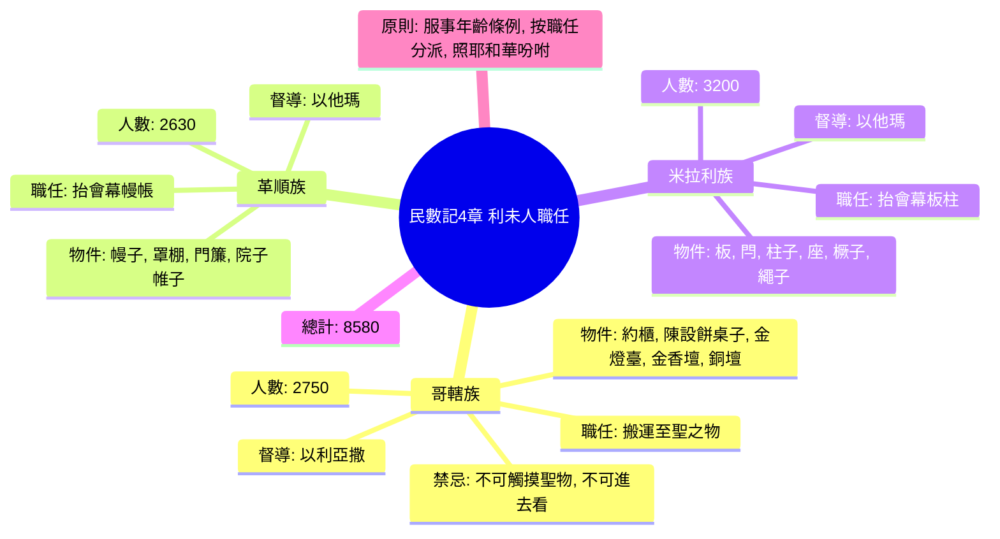

# 民數記 第4章

1. [[摩西|耶和華曉諭摩西]]、亞倫說：
2. 你[[利未人|從利未人中]]，將[[哥轄子孫|哥轄子孫的總數]]，照他們的[[宗族、家室|家室、宗族]]，
3. 從三十歲直到五十歲，凡前來[[任職]]、[[利未人服事年齡條例|在會幕裡辦事的]]，[[利未人服事年齡條例|全都計算]]。
4. [[哥轄子孫|哥轄子孫在會幕]][[搬運]]至聖之物，所辦的事乃是這樣：
5. [[起營的時候|起營]]的時候，亞倫和他兒子要[[進去]][[亞倫和他兒子包裹聖物|摘下遮掩櫃的幔子]]，用以[[蒙蓋]][[約櫃|法櫃]]，
6. 又用海狗皮蓋在上頭，再[[蒙蓋|蒙上]]純藍色的毯子，把[[杠（bad）|槓]]穿上。
7. 又用藍色毯子鋪在陳設餅的桌子上，將盤子、調羹、奠酒的[[奠酒的爵（menakkiyyot）|爵]]，和杯[[盤子、調羹、奠酒的爵、杯（ke'arot, kappot, menakkiyot, qesot）|擺在上頭]]。桌子上也必有常設的餅。
8. 在其上又要[[朱紅色毯子（tolaat shani）|蒙]]朱紅色的毯子，再[[蒙蓋|蒙上海狗皮]]，把[[杠（bad）|槓]]穿上。
9. 要拿藍色毯子，把燈臺和燈臺上所用的燈盞、[[剪刀（melakchayim）|剪子]]、蠟[[杏花杯球花（燈臺裝飾）|花]]盤，並一切[[油壺（kelei shamen）|盛油的器皿]]，全都[[帳幕門簾|遮蓋]]。
10. 又要把燈臺和燈臺的一切器具包在海狗皮裡，放在[[搬運|抬]]架上。
11. 在金壇上要鋪藍色毯子，[[蒙蓋|蒙上海狗皮]]，把[[杠（bad）|槓]]穿上。
12. 又要把聖所用的一切器具包在藍色毯子裡，用海狗皮[[蒙蓋|蒙上]]，放在[[搬運|抬]]架上。
13. 要收去壇上的灰，把紫色毯子鋪在壇上；
14. 又要把所用的一切器具，就是[[火鑵（machtah）|火鼎]]、[[叉子（mazleg）|肉鍤子]]、[[鏟子（ya'eh）|鏟]]子、盤子，一切屬壇的器具都擺在壇上，又[[蒙蓋|蒙上海狗皮]]，把[[杠（bad）|槓]]穿上。
15. 將要[[起營的時候|起營]]的時候，亞倫和他兒子把聖所和聖所的一切器具[[帳幕門簾|遮蓋]]完了，哥轄的子孫就要來[[搬運|抬]]，只是[[不可觸摸聖物|不可摸聖物]]，免得他們死亡。會幕裡這些物件是哥轄子孫所當抬的。
16. [[以利亞撒|祭司亞倫的兒子以利亞撒]][[掌管（šāmar）|所要看守的是]]點燈的油與香料，並當獻的素祭和膏油，也要看守全帳幕與其中所有的，並聖所和聖所的器具。
17. [[摩西|耶和華曉諭摩西]]、亞倫說：
18. 你們不可將[[哥轄子孫|哥轄人]]的支派[[利未人|從利未人中]]剪除。
19. 他們挨近至聖物的時候，亞倫和他兒子要[[進去]][[各人按所辦的事、所擔的擔|派他們]]各人所當辦的，所當[[搬運|抬]]的。這樣待他們，好使他們活著，不致死亡。
20. 只是他們[[不可進去看（ʾal-yābōʾû lirʾôt）|連片時不可進去觀看]]聖所，免得他們死亡。
21. [[耶和華曉諭摩西說]]：
22. 你要將革順子孫的[[數點|總數]]，照著[[米拉利子孫的宗族、家室|宗族、家室]]，
23. 從三十歲直到五十歲，凡前來[[任職]]、[[利未人服事年齡條例|在會幕裡辦事的]]，全都[[數點]]。
24. 革順人各族所辦的事、所[[搬運|抬]]的物乃是這樣：
25. 他們要[[搬運|抬]]帳幕的幔子和會幕，並會幕的蓋與其上的海狗皮，和會幕的門簾，
26. 院子的帷子和門簾（[[院子的帷子|院子是圍帳幕和壇的]]）、[[繩子|繩]]子，並所用的器具，不論是做什麼用的，他們都要經理。
27. 革順的子孫在一切[[搬運|抬]]物[[辦事]]之上都要憑亞倫和他兒子的吩咐；他們所當抬的，要[[各人按所辦的事、所擔的擔|派他們]][[掌管（šāmar）|看守]]。
28. 這是革順子孫的各族在會幕裡所辦的事；他們所[[掌管（šāmar）|看守]]的，必在[[亞倫|祭司亞倫]]兒子[[以他瑪]]的手下。
29. 至於米拉利的子孫，[[你要照]]著[[宗族、家室|家室、宗族]]把他們[[數點]]。
30. 從三十歲直到五十歲，凡前來[[任職]]、[[利未人服事年齡條例|在會幕裡辦事的]]，你都要[[數點]]。
31. 他們辦理會幕的事，就是[[搬運|抬]]帳幕的板、閂、[[柱子|柱]]子，和帶卯的座，
32. 院子四圍的[[柱子|柱]]子和其上帶卯的座、[[橛子|橛]]子、[[繩子|繩]]子，並一切使用的器具。他們所[[搬運|抬]]的器具，你們要按名指定。
33. 這是米拉利子孫各族在會幕裡所辦的事，都在[[亞倫|祭司亞倫]]兒子[[以他瑪]]的手下。
34. [[摩西]]、亞倫與會眾的諸首領將哥轄的子孫，照著[[宗族、家室|家室、宗族]]，
35. 從三十歲直到五十歲，凡前來[[任職]]、[[利未人服事年齡條例|在會幕裡辦事的]]，都[[數點]]了。
36. [[數點|被數的]]共有二千七百五十名。
37. 這是哥轄各族中[[數點|被數的]]，是[[利未人服事年齡條例|在會幕裡辦事的]]，就是[[摩西]]、亞倫照耶和華藉摩西所吩咐[[數點]]的。
38. [[革順子孫被數]]的，照著[[宗族、家室|家室、宗族]]，
39. 從三十歲直到五十歲，凡前來[[任職]]、[[利未人服事年齡條例|在會幕裡辦事的]]，共有二千六百三十名。
40. 併於上節。
41. 這是革順子孫各族中[[數點|被數的]]，是[[利未人服事年齡條例|在會幕裡辦事的]]，就是[[摩西]]、亞倫照耶和華藉摩西所吩咐[[數點]]的。
42. 米拉利子孫中各族[[數點|被數的]]，照著[[宗族、家室|家室、宗族]]，
43. 從三十歲直到五十歲，凡前來[[任職]]、[[利未人服事年齡條例|在會幕裡辦事的]]，共有三千二百名。
44. 併於上節。
45. 這是米拉利子孫各族中[[數點|被數的]]，就是[[摩西]]、亞倫照耶和華藉摩西所吩咐[[數點]]的。
46. [[數點|凡被數的]][[利未人]]，就是[[摩西]]、亞倫並[[以色列]]眾首領，照著[[宗族、家室|家室、宗族]]所[[數點]]的，
47. 從三十歲直到五十歲，凡前來[[任職]]、在會幕裡做[[搬運|抬]]物之工的，共有八千五百八十名。
48. 併於上節。
49. [[摩西]]按他們所辦的事、所[[搬運|抬]]的物，憑耶和華的吩咐[[數點]]他們；他們這樣被摩西數點，正如耶和華所吩咐他的。

<!-- fhl-map-links:start -->
## 相關地圖

- [[appendix/fhl_maps/maps/019|〈出圖二〉以色列人出埃及到西乃山]]
- [[appendix/fhl_maps/maps/038|〈書圖十一〉利未人的城和十二個支派的地業]]
<!-- fhl-map-links:end -->

---

## 本章知識節點

### 神學
- [[會幕（帳幕整體）]]
- [[聖潔]]

### 人物
- [[摩西]]
- [[亞倫]]
- [[以利亞撒]]
- [[以他瑪]]
- [[哥轄]]
- [[革順]]
- [[米拉利]]

### 制度
- [[利未人服事年齡條例]]
- [[利未人各按職任分派]]
- [[數點]]

### 物件
- [[約櫃]]
- [[陳設餅桌子]]
- [[金燈臺]]
- [[金香壇（香壇）]]
- [[銅壇（燔祭壇）]]
- [[聖膏油]]
- [[杠（bad）]]
- [[遮掩櫃的幔子（paroket hamasach）]]
- [[藍色毯子（tekelet）]]
- [[朱紅色毯子（tolaat shani）]]
- [[紫色毯子（argaman）]]
- [[點燈的油]]
- [[馨香的香（qetoret）]]
- [[火鑵（machtah）]]
- [[叉子（mazleg）]]
- [[鏟子（ya'eh）]]
- [[盆（mizraq）]]
- [[調羹（kap）]]
- [[奠酒的爵（menakkiyyot）]]
- [[會幕的板]]
- [[閂（橫閂）]]
- [[柱子]]
- [[帶卯的銅座（院子柱子座）]]
- [[橛子]]
- [[繩子]]
- [[院子的帷子]]
- [[院子四圍的柱子]]
- [[會幕的幔子（帳幕）的幔子（yeri'ot hamishkan）]]
- [[十一幅山羊毛幔子（罩棚）]]
- [[帳幕門簾]]
- [[杏花杯球花（燈臺裝飾）]]

### 地名
- [[曠野]]
- [[西乃山]]
- [[會幕東邊]]

### 事件
- [[起營的時候]]
- [[哥轄子孫搬運至聖之物]]
- [[革順子孫抬會幕幔帳]]
- [[米拉利子孫抬會幕板柱]]
- [[亞倫和他兒子包裹聖物]]
- [[約櫃三層遮蓋]]
- [[陳設餅桌子遮蓋]]
- [[燈臺遮蓋]]
- [[金香壇遮蓋]]
- [[銅壇遮蓋]]
- [[以利亞撒掌管聖所油香]]
- [[哥轄人不可觸摸聖物]]
- [[革順族以他瑪手下服事]]
- [[米拉利族以他瑪手下服事]]
- [[耶和華曉諭摩西說]]
- [[凡被數的利未人]]

---

## 本章整理

### 利未人服事人口普查與職任分派（v1-49）

本章記載[[耶和華曉諭摩西說|耶和華曉諭摩西]]、[[亞倫]]對[[利未人]]三大家族——[[哥轄]]、[[革順]]、[[米拉利]]——進行第二次人口普查，對象限定為**[[三十歲到五十歲]]**、**[[前來任職]]、[[在會幕裡辦事]]**的男丁（[[利未人服事年齡條例]]）。這與民數記 3 章「一個月以上」的普查不同，此處專為**[[搬運]]、[[抬擔]]**等力役而設，體現「[[各人按所辦的事、所擔的擔]]」的分工原則（[[利未人各按職任分派]]）。

#### 哥轄子孫：搬運至聖之物（v1-20, 34-37）

[[哥轄子孫]]被數 **[[二千七百五十名]]**（v36）。他們的任務是抬運[[全帳幕]]內**[[至聖之物]]**：[[約櫃]]、[[陳設餅桌子]]、[[金燈臺]]、[[金香壇（香壇）]]、[[銅壇（燔祭壇）]]與諸器皿。但嚴格規定：**[[不可觸摸聖物]]**，也不可「連片時進去觀看聖所」，[[免得他們死亡]]（v15, 20，[[哥轄人不可觸摸聖物]]、[[不可進去看（ʾal-yābōʾû lirʾôt）]]）。

[[起營的時候]]，必須由[[亞倫和他兒子（祭司）|亞倫和他兒子]]先進去**[[亞倫和他兒子包裹聖物|包裹聖物]]**，程序極其謹嚴：
- **約櫃**：[[摘下]][[遮掩櫃的幔子（paroket hamasach）|遮掩櫃的幔子]]蒙蓋 → 海狗皮 → **[[藍色毯子（tekelet）|純藍色毯子]]** → [[把杠穿上|穿上杠]]（[[約櫃三層遮蓋]]）
- **陳設餅桌子**：鋪[[藍色毯子（tekelet）]] → 擺[[盤子、調羹、奠酒的爵、杯（ke'arot, kappot, menakkiyot, qesot）|盤子、調羹、奠酒爵、杯]]、常設餅 → 蒙**[[朱紅色毯子（tolaat shani）]]** → 海狗皮 → 穿杠（[[陳設餅桌子遮蓋]]）
- **金燈臺**：[[藍色毯子（tekelet）]]遮蓋燈臺與器具（[[燈盞、剪刀、油壺（nerot, melqachayim, mahtehot）|燈盞、剪刀、油壺]]等） → 包海狗皮 → 放抬架（[[燈臺遮蓋]]）
- **金香壇**：[[藍色毯子（tekelet）]] → 海狗皮 → 穿杠（[[金香壇遮蓋]]）
- **銅壇**：收灰 → 鋪**[[紫色毯子（argaman）]]** → 擺[[壇的一切器具|器具]]（[[火鑵（machtah）]]、[[叉子（mazleg）]]、[[鏟子（ya'eh）]]、[[盆（mizraq）]]等） → 海狗皮 → 穿杠（[[銅壇遮蓋]]）

包裹完成後，[[哥轄子孫]]才可進來抬運。[[以利亞撒]]（[[大祭司]]亞倫長子）掌管[[點燈的油]]、[[馨香的香（qetoret）|馨香的香]]、當獻的素祭、[[聖膏油]]，並統管[[全帳幕]]與聖所（v16，[[以利亞撒掌管聖所油香]]）。

> [!important] 核心神學張力
> 神的同在極其聖潔，非凡人可直視或觸摸。[[哥轄子孫]]雖獲准「搬運至聖之物」，卻必須在祭司遮蓋後、隔著杠抬運——**聖潔與恩典的界限**在此顯露無遺。

#### 革順子孫：抬會幕幔帳（v21-28, 38-41）

[[革順子孫]]被數 **[[二千六百三十名]]**（v40）。他們負責較「軟性」的結構物件：
- [[會幕的幔子（帳幕）的幔子（yeri'ot hamishkan）|會幕的幔子]]、[[十一幅山羊毛幔子（罩棚）|罩棚]]、海狗皮蓋
- [[帳幕門簾]]、[[院子的帷子]]與門簾、[[繩子]]及一切使用器具

他們在[[以他瑪]]手下服事（v28，[[革順族以他瑪手下服事]]），憑[[亞倫和他兒子（祭司）|亞倫和他兒子]]吩咐派定各人所抬、所守（v27，[[派他們各人所辦的事]]）。

#### 米拉利子孫：抬會幕板柱（v29-33, 42-45）

[[米拉利子孫]]被數 **[[三千二百名]]**（v44）。他們負責最重、最結構性的組件：
- [[會幕的板、閂、柱子、帶卯的座|會幕的板、閂、柱子、帶卯的座]]
- [[院子四圍的柱子、帶卯的座、橛子、繩子|院子四圍的柱子、帶卯的座、橛子、繩子]]、一切使用器具

器具要**按名指定**（v32），同樣在[[以他瑪]]手下服事（v33，[[米拉利族以他瑪手下服事]]，[[這是米拉利子孫在會幕中所辦的事]]、[[他們要在祭司亞倫的兒子以他瑪手下服事]])。

#### 總計與總結（v46-49）

三族合計 **[[利未人總數八千五百八十|八千五百八十名]]**（v48）。經文三度強調：「[[照耶和華吩咐數點]]」（v37, 41, 45, 49），凸顯**順服神命令**是服事的根基（[[摩西、亞倫、會眾首領照耶和華吩咐數點]]、[[是摩西、亞倫、和以色列會眾首領數點的]]、[[摩西照耶和華的吩咐數點他們]]、[[各人按所辦的事、所擔的擔被數點]])。

| 家族 | 年齡層 | 人數 | 主要職任 | 督導祭司 |
|------|--------|------|----------|----------|
| [[哥轄子孫]] | 30-50 歲 | 2,750 | 搬運至聖之物（約櫃、桌子、燈臺、壇、器具） | [[以利亞撒]] |
| [[革順子孫]] | 30-50 歲 | 2,630 | 抬幔子、蓋、門簾、院子帷子、繩子 | [[以他瑪]] |
| [[米拉利子孫]] | 30-50 歲 | 3,200 | 抬板、閂、柱子、座、橛子、繩子 | [[以他瑪]] |
| **總計** | | **8,580** | | |

> [!note] 歷史與神學注記
> - 三族人數總和（8,580）與民數記 3:39「二萬二千」相差甚遠，因 3 章統計**一個月以上**所有男丁，本章僅統計**[[從三十歲直到五十歲]]**服役男丁。
> - [[哥轄]]雖非長子（[[革順]]為長子，創 46:11），卻獲派最榮貴的「至聖之物」職任，顯示神揀選不拘長幼次序。
> - 三層遮蓋材料（內層功能性幔子 → 中層海狗皮防水 → 外層顏色毯子辨識）兼具實用與神學象徵：藍色（天上的）、朱紅（贖罪/王權）、紫色（君王/榮耀）。

### 跨章脈絡：從西乃山到曠野行軍的聖所物流體系

本章是民數記「曠野行軍秩序」的關鍵一環：
- **民數記 1-2**：以色列十二支派佈陣、利未人環繞會幕
- **民數記 3**：利未人總普查、贖價、家族駐紮方位
- **民數記 4**（本章）：**[[利未人服事年齡條例|服役年齡普查]] + 具體搬運 SOP + 祭司督導機制**
- **民數記 5-6**：營中潔淨、拿細耳人條例
- **民數記 7-9**：獻壇禮、利未人分別、逾越節、雲柱火柱引導

這套「拆裝、包裹、抬運、架設」標準化流程，確保神的同在（約櫃為核心）在曠野四十年行軍中**不被褻瀆、不致失序**。[[耶和華曉諭摩西說|耶和華曉諭摩西]]的每一句細節指令，都是為了讓「聖潔的神」能安全地與「不聖潔的百姓」同行——這正是舊約會幕制度的福音預表：基督作我們的大祭司，藉著自己的血一次進入至聖所，為我們開了「又新又活的路」，使我們不再懼怕「觸摸聖物而死」，卻可坦然無懼地來到施恩寶座前。
