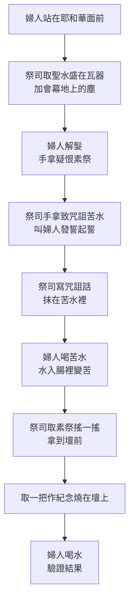

# 民數記 第5章

1. [[摩西|耶和華曉諭摩西]]說：
2. 你[[曉諭|吩咐]][[以色列]]人，使一切[[痲瘋|長大痲瘋]]的，[[營地潔淨條例|患漏症的]]，並[[因死屍不潔淨]]的，都出[[營]]外去。
3. [[無論男女]]都要[[營外|使他們出到營外]]，[[營地潔淨條例|免得污穢他們的營]]；這營是我所住的。
4. [[以色列]]人就這樣行，[[營外|使他們出到營外]]。[[順服神命|耶和華怎樣吩咐摩西]]，[[順服神命|以色列人就怎樣行了]]。
5. [[摩西|耶和華對摩西說]]：
6. 你[[曉諭]][[以色列]]人說：[[無論男女]]，若犯了[[人所常犯的罪]]，以致干犯耶和華，[[那人就有了罪]]。
7. 他要[[犯罪認罪賠償條例|承認所犯的罪]]，將[[所虧負人的]]，如數賠還，另外[[犯罪認罪賠償條例|加上五分之一]]，也歸與所虧負的人。
8. 那人若沒有[[親屬]]可受所賠還的，那所賠還的就要歸與服事耶和華的祭司；至於那為他[[贖罪]]的公羊是在外。
9. [[以色列]]人一切的聖物中，所奉給祭司的[[聖物歸祭司|舉祭]]都要[[歸與祭司]]。
10. 各人所[[聖物歸祭司|分別為聖的物]]，無論是什麼，都要[[歸與祭司|歸給祭司]]。
11. [[摩西|耶和華對摩西說]]：
12. 你[[曉諭]][[以色列]]人說：人的[[妻子|妻]]若有邪行，得罪他[[丈夫]]，
13. 有人與他[[行邪淫|行淫]]，事情嚴密，瞞過他[[丈夫]]，而且他被玷污，沒有[[見證人|作見證的人]]，當他行淫的時候也[[隱藏|沒有被捉住]]，
14. 他[[丈夫]][[心裡起了嫉妒|生了疑恨的心]]，疑恨他，他是被玷污，或是他丈夫生了疑恨的心，疑恨他，他並沒有被玷污，
15. 這人就要將[[妻子|妻]]送到祭司那裡，又為他帶著[[素祭伊法十分之一（minchah 'issaron ha'efah）|大麥麵伊法十分之一]]作供物，不可[[澆上油]]，也不可[[加上乳香]]；因為這是[[嫉妒素祭|疑恨的素祭]]，是[[嫉妒素祭|思念的素祭]]，使人思念罪孽。
16. 祭司要使那[[妻子|婦人]]近前來，[[站在耶和華面前]]。
17. 祭司要把聖水盛在瓦器裡，又從帳幕的地上取點[[會幕地上的塵（aphar mishkan）|塵]]土，放在水中。
18. 祭司要叫那[[妻子|婦人]][[解髮|蓬頭散髮]]，[[站在耶和華面前]]，把[[嫉妒素祭|思念的素祭]]，就是[[嫉妒素祭|疑恨的素祭]]，放在他手中。[[亞倫和他兒子（祭司）|祭司手裡拿]]著致咒詛的[[致咒詛的苦水|苦水]]，
19. 要叫[[妻子|婦人]][[發誓|起誓]]，對他說：若沒有人與你[[行邪淫|行淫]]，也未曾背著[[丈夫]]做污穢的事，你就免受這致咒詛[[致咒詛的苦水|苦水]]的災。
20. 你若背著[[丈夫]]行了污穢的事，在你丈夫以外有人與你[[行邪淫|行淫]]，
21. （祭司叫[[妻子|婦人]][[發誓|發咒起誓]]），願耶和華叫你[[大腿消癟|大腿消瘦]]，肚腹發脹，使你在你民中被人咒詛，成了誓語；
22. 並且這致[[致咒詛的苦水|咒詛的水]]入你的腸中，要叫你的肚腹發脹，[[大腿消癟|大腿消瘦]]。[[妻子|婦人]]要回答說：[[阿們（Amen）|阿們]]，阿們。
23. 祭司要寫這咒詛的話，將所寫的字[[塗抹在苦水裡|抹在苦水裡]]，
24. 又[[叫婦人喝]]這致咒詛的[[致咒詛的苦水|苦水]]；這水要進入他裡面變苦了。
25. 祭司要從[[妻子|婦人]]的手中取那[[嫉妒素祭|疑恨的素祭]]，在耶和華面前搖一搖，拿到壇前；
26. 又要從素祭中取出一把，作為這事的紀念，燒在壇上，然後[[叫婦人喝]]這水。
27. 叫他喝了以後，他若被玷污，得罪了[[丈夫]]，這致[[致咒詛的苦水|咒詛的水]]必進入他裡面變苦了，他的肚腹就要發脹，大腿就要消瘦，那[[妻子|婦人]]便要在他民中被人咒詛。
28. 若[[妻子|婦人]]沒有被玷污，卻是清潔的，就要免受這災，且要懷孕。
29. [[妻子]]背著[[丈夫]]行了污穢的事，
30. 或是人[[心裡起了嫉妒|生了疑恨的心]]，疑恨他的[[妻子|妻]]，就有這[[嫉妒條例|疑恨的條例]]。那時他要叫[[妻子|婦人]][[站在耶和華面前]]，祭司要在他身上照這條例而行。
31. [[丈夫|男人]]就為無罪，[[妻子|婦人]]必[[擔當自己的罪孽]]。

<!-- fhl-map-links:start -->
## 相關地圖

- [[appendix/fhl_maps/maps/019|〈出圖二〉以色列人出埃及到西乃山]]
<!-- fhl-map-links:end -->

---

## 本章知識節點

### 神學
- [[營地潔淨條例]]
- [[犯罪認罪賠償條例]]
- [[嫉妒素祭]]
- [[苦水試驗]]
- [[無辜釋放]]
- [[聖物歸祭司]]
- [[這營是我所住的]]
- [[順服神命]]
- [[擔當罪孽]]
- [[男人免受罪罰]]
- [[無論男女]]
- [[免得污穢]]
- [[曉諭]]
- [[人所常犯的罪]]
- [[那人就有了罪]]
- [[所虧負人的]]
- [[歸與祭司]]
- [[嫉妒條例]]
- [[丈夫疑妻行淫釋疑條例]]
- [[條例]]
- [[免受罪罰]]
- [[污穢營地]]
- [[如數賠還]]
- [[行邪淫]]
- [[干犯丈夫]]
- [[隱藏]]
- [[嫉妒]]
- [[親屬]]
- [[無親屬歸祭司]]
- [[贖罪]]
- [[分別為聖]]
- [[咒詛]]

### 儀式
- [[祭司獻素祭]]
- [[站在耶和華面前]]
- [[解髮]]
- [[發誓]]
- [[取一把]]
- [[在壇上燒]]
- [[叫婦人喝]]
- [[寫在書上]]
- [[塗抹在苦水裡]]
- [[紀念素祭]]
- [[阿們（Amen）]]
- [[在耶和華面前獻上]]
- [[接過來]]
- [[進入腸裡]]
- [[使肚腹發脹]]
- [[使大腿消癟]]
- [[婦人要說阿們]]
- [[祭司在耶和華面前辦完]]
- [[擔當自己的罪孽]]

### 物品
- [[大麥麵（se'orah）]]
- [[無油無乳香]]
- [[聖水]]
- [[瓦器（kelei cheres）]]
- [[會幕地上的塵（aphar mishkan）]]
- [[致咒詛的苦水]]
- [[素祭伊法十分之一（minchah 'issaron ha'efah）]]
- [[澆上油]]
- [[加上乳香]]

### 人物關係
- [[妻子]]
- [[丈夫]]
- [[見證人]]
- [[被捉住]]
- [[心裡起了嫉妒]]
- [[服事耶和華的祭司]]

### 症狀
- [[大腿消癟]]
- [[肚腹發脹]]
- [[懷孕]]
- [[長大痲瘋]]
- [[因死屍不潔淨]]
- [[痲瘋]]
- [[死屍不潔淨]]

### 地點
- [[營]]
- [[營外]]
- [[會幕（帳幕整體）]]

---

## 本章整理

### 營地潔淨：趕出不潔淨者（v1-4）

耶和華[[曉諭]][[摩西]]，吩咐[[以色列]]人將一切[[長大痲瘋]]的、患漏症的、並因[[死屍不潔淨]]的，全都趕到[[營外]]去。無論男女，都要出到營外，==免得污穢他們的營==；因為「[[這營是我所住的]]」。以色列人[[順服神命]]，照著耶和華吩咐摩西的話去行。這段建立了[[營地潔淨條例]]的核心原則：神的同在要求營地聖潔，不潔淨者必須隔離，以免[[污穢營地]]。

### 犯罪認罪與賠償條例（v5-10）

耶和華對摩西說，吩咐以色列人：[[無論男女]]，若犯了[[人所常犯的罪]]，干犯耶和華，[[那人就有了罪]]。他要承認所犯的罪，將[[所虧負人的]][[如數賠還]]，另外加上五分之一，歸與所虧負的人。若沒有[[親屬]]可受所賠還的，所賠還的就歸與[[服事耶和華的祭司]]；至於那為他[[贖罪]]的公羊是在外。此外，以色列人一切的[[聖物歸祭司|聖物]]中所奉給[[服事耶和華的祭司|祭司]]的舉祭都要歸與祭司；各人所[[分別為聖]]的物，無論是什麼，都要歸給祭司。這段確立了[[犯罪認罪賠償條例]]：認罪、賠償、加五分之一、[[無親屬歸祭司]]，並重申[[聖物歸祭司]]的原則。

### 嫉妒素祭與苦水試驗（v11-31）

當[[丈夫]][[心裡起了嫉妒]]，疑恨[[妻子]]，懷疑她[[行邪淫]]、[[干犯丈夫]]，事情嚴密、[[隱藏]]、沒有[[見證人]]、也沒有被[[被捉住]]時，丈夫要將妻送到[[服事耶和華的祭司|祭司]]那裡，帶著[[大麥麵（se'orah）|大麥麵]][[素祭伊法十分之一（minchah 'issaron ha'efah）|伊法十分之一作素祭]]，==不可[[澆上油]]，也不可[[加上乳香]]==；因為這是[[嫉妒素祭|疑恨的素祭]]，是[[嫉妒素祭|思念的素祭]]，使人思念罪孽。

**儀式流程：**

祭司叫婦人[[站在耶和華面前]]，把[[聖水]]盛在[[瓦器（kelei cheres）|瓦器]]裡，從[[會幕地上的塵（aphar mishkan）|會幕地上的塵]]取點放在水中。婦人[[解髮]]，手拿[[嫉妒素祭|思念的素祭]]，祭司手拿[[致咒詛的苦水]]，叫婦人[[發誓]]：若無人與她行淫，免受這水的災；若背著丈夫行污穢事，願耶和華叫她[[大腿消癟]]、[[肚腹發脹]]，在民中被咒詛。婦人要回答「[[阿們（Amen）|阿們]]，阿們」。祭司將咒詛話[[寫在書上]]，[[塗抹在苦水裡]]，叫婦人喝。隨後祭司從婦人手中取素祭，在耶和華面前搖一搖，拿到壇前，[[取一把]]作[[紀念素祭]][[在壇上燒]]，然後叫婦人喝水。

**驗證結果：**

| 情況 | 結果 |
|------|------|
| 婦人被玷污、得罪丈夫 | 苦水入腸變苦，肚腹發脹、大腿消癟，在民中被咒詛 |
| 婦人未被玷污、清潔 | 免受災，且要[[懷孕]] |

這就是[[嫉妒條例|疑恨的條例]]。丈夫就為無罪（[[男人免受罪罰]]），婦人必[[擔當自己的罪孽]]。

> [!important] 本章樞紐
> 民數記 5 章呈現三層聖潔秩序：空間上（[[營地潔淨條例]]）、社會上（[[犯罪認罪賠償條例]]）、家庭上（[[嫉妒素祭]]）。神住在營中，要求全營聖潔；人與人關係破裂需認罪賠償；隱而未發的婚姻不忠，交由神在儀式中公開審判。[[苦水試驗]]不是魔法，而是將隱情帶到神面前，由神親自伸冤或洗清。

> [!note] 歷史背景補充
> 古近東也有「河水試驗」（如漢摩拉比法典 §132），但聖經版本獨特之處：① 由祭司在聖所執行，非法庭；② 使用聖水、會幕塵土、書寫咒詛，強調神的同在；③ 結果由神主權決定，非自然毒性；④ 保護婦人免受丈夫私刑，程序公開、有法律保障。

### 跨章脈絡：從營地秩序到會幕事奉

民數記 1–4 章建立營地佈局與利未人職任；第 5 章轉向營地內部的道德與儀式潔淨。[[營地潔淨條例]]呼應利未記 13–15 章；[[犯罪認罪賠償條例]]發展利未記 5–6 章贖愆祭條例；[[嫉妒素祭]]則是獨特的家庭聖潔條例。這三條例共同為後續拿細耳人條例、會幕啟用鋪路：聖潔的營地、公義的社會、忠信的家庭，才配承接神的同在與祝福。
