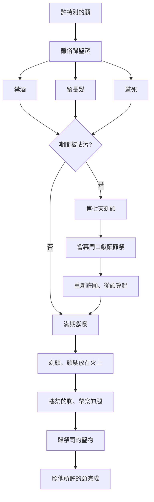

# 民數記 第6章

1. 耶和華對[[摩西]][[說]]：
2. 你[[以色列|曉諭以色列人]][[說]]：無論男女許了特別的願，就是[[特別的願|拿細耳人的願]]（拿細耳就是歸主的意思；下同），要離俗[[歸神|歸耶和華]]。
3. 他就要[[拿細耳人禁酒|遠離清酒濃酒]]，也不可喝什麼清酒濃[[醋（chometz）|酒做的醋]]；不可喝什麼[[葡萄汁（mishrat anavim）|葡萄汁]]，也不可吃[[鮮葡萄（anavim）|鮮葡萄]]和[[乾葡萄（tsimmuqim）|乾葡萄]]。
4. 在一切離俗的日子，凡[[葡萄樹（gefen）|葡萄樹]]上結的，自核至皮所做的物，都不可吃。
5. 在他一切[[拿細耳人條例|許願]]離俗的日子，[[拿細耳人留長髮|不可用剃頭刀剃頭]]，要[[拿細耳人留長髮|由髮綹長長了]]。他[[拿細耳人留長髮|要聖潔]]，直到[[拿細耳人留長髮|離俗歸耶和華的日子滿了]]。
6. 在他離俗[[歸神|歸耶和華]]的一切日子，[[拿細耳人不近死屍|不可挨近死屍]]。
7. 他的父母或是弟兄姊妹死了的時候，他[[拿細耳人不近死屍|不可因他們使自己不潔淨]]，因為那[[拿細耳人不近死屍|離俗歸神的憑據]]是在他頭上。
8. 在他一切離俗的日子是[[歸神|歸耶和華]]為聖。
9. 若在他旁邊忽然有人死了，以致沾染了他離俗的頭，他要在[[第七天|第七日]]，得潔淨的時候，剃頭。
10. 第八日，他要把兩隻斑鳩或兩隻雛鴿帶到[[會幕門口]]，交給[[亞倫和他兒子（祭司）|祭司]]。
11. [[亞倫和他兒子（祭司）|祭司]]要獻一隻作[[贖罪]]祭，一隻作燔祭，為他贖那因死屍而有的罪，並要當日使他的頭成為[[聖潔]]。
12. 他要另選離俗[[歸神|歸耶和華]]的日子，又要牽一隻一歲的[[公羊羔（kebes）|公羊羔]]來作[[公羊羔（kebes）|贖愆祭]]；但先前的日子要歸徒然，因為他在離俗之間被玷污了。
13. [[拿細耳人條例|拿細耳人]][[拿細耳人滿期獻祭|滿了離俗的日子]]乃有這條例：人要領他到[[會幕門口]]，
14. 他要將供物[[獻給耶和華|奉給耶和華]]，就是一隻沒有殘疾、一歲的[[公羊羔（kebes）|公羊羔]]作燔祭，一隻沒有殘疾、一歲的母羊羔作[[贖罪]]祭，和一隻沒有殘疾的[[拿細耳人滿期獻祭|公綿羊]]作[[拿細耳人滿期獻祭|平安祭]]，
15. 並一筐子無酵調油的細麵餅，與抹油的無酵薄餅，並同獻的[[拿細耳人滿期獻祭|素祭]]和奠祭。
16. [[亞倫和他兒子（祭司）|祭司]]要[[亞倫和他兒子（祭司）|在耶和華面前獻]]那人的[[贖罪]]祭和燔祭；
17. 也要把那隻公羊和那筐無酵餅[[獻給耶和華]]作[[拿細耳人滿期獻祭|平安祭]]，又要將同獻的[[拿細耳人滿期獻祭|素祭]]和奠祭獻上。
18. [[拿細耳人條例|拿細耳人]]要在[[會幕門口]]剃離俗的頭，把離俗頭上的髮放在[[拿細耳人滿期獻祭|平安祭]]下的火上。
19. 他剃了以後，[[亞倫和他兒子（祭司）|祭司]]就要取那已煮的公羊一條前腿，又從筐子裡取一個無酵餅和一個無酵薄餅，都放在他手上。
20. [[亞倫和他兒子（祭司）|祭司]]要拿這些作為[[拿細耳人滿期獻祭|搖祭]]，在耶和華面前搖一搖；這與所搖的胸、所舉的腿同為聖物，歸給祭司。然後[[拿細耳人條例|拿細耳人]]可以喝酒。
21. [[拿細耳人條例|許願]]的[[拿細耳人條例|拿細耳人]]為離俗所獻的供物，和他以外所能得的[[獻給耶和華]]，就有這條例。他怎樣許願就當照離俗的條例行。
22. 耶和華曉諭[[摩西]][[說]]：
23. [[你告訴亞倫和他兒子]][[說]]：[[你們要這樣為以色列人祝福]]，說：
24. 願耶和華[[賜福（barakh）|賜福]]給你，[[祭司祝福條例|保護你]]。
25. 願耶和華使他的臉[[光照]]你，[[恩待|賜恩]]給你。
26. 願[[耶和華向你仰臉]]，[[祭司祝福條例|賜你平安]]。
27. 他們要如此奉我的名為[[以色列]]人[[祝福（berakhah）|祝福]]；我也要[[賜福（barakh）|賜福]]給他們。

<!-- fhl-map-links:start -->
## 相關地圖

- [[appendix/fhl_maps/maps/019|〈出圖二〉以色列人出埃及到西乃山]]
<!-- fhl-map-links:end -->

---

## 本章知識節點

### 神學
- [[聖潔]]
- [[歸神]]
- [[祝福（berakhah）]]
- [[賜福（barakh）]]
- [[平安]]
- [[奉我的名]]
- [[我也要賜福給他們]]

### 原文
- [[清酒（yayin）]]
- [[濃酒（shekar）]]
- [[醋（chometz）]]
- [[葡萄汁（mishrat anavim）]]
- [[鮮葡萄（anavim）]]
- [[乾葡萄（tsimmuqim）]]
- [[葡萄樹（gefen）]]
- [[自核至皮（mechartsannim ve'ad zag）]]
- [[髮綹（pera）]]
- [[祝福（berakhah）]]
- [[賜福（barakh）]]
- [[公羊羔（kebes）]]
- [[母羊羔（kibsah）]]

### 人物
- [[摩西]]
- [[亞倫]]
- [[亞倫和他兒子（祭司）]]
- [[參孫]]
- [[撒母耳]]
- [[保羅許願]]

### 制度
- [[拿細耳人條例]]
- [[特別的願]]
- [[終身拿細耳人]]
- [[暫時拿細耳人]]
- [[重新許願]]
- [[從頭算起]]
- [[照他所許的願]]
- [[按他的力量]]

### 祭儀
- [[拿細耳人禁酒]]
- [[拿細耳人留長髮]]
- [[拿細耳人不近死屍]]
- [[拿細耳人被玷污贖罪]]
- [[拿細耳人滿期獻祭]]
- [[剃頭]]
- [[頭髮放在火上]]
- [[搖祭的胸]]
- [[舉祭的腿]]
- [[祭司的聖物]]
- [[獻給耶和華]]
- [[除了他所許的願]]
- [[第七天]]
- [[祭司祝福條例]]
- [[亞倫祝福]]
- [[三重祝福]]
- [[你告訴亞倫和他兒子]]
- [[給以色列人祝福]]
- [[你們要這樣為以色列人祝福]]
- [[說]]
- [[耶和華賜福給你]]
- [[耶和華使臉光照你]]
- [[耶和華向你仰臉]]
- [[他們要奉我的名]]
- [[保護]]
- [[光照]]
- [[恩待]]
- [[仰臉]]
- [[平安]]

---

## 本章整理

### 拿細耳人離俗條例（v1-8）
耶和華對[[摩西]]說，吩咐[[以色列]]人：若男女許[[特別的願]]，作[[拿細耳人條例|拿細耳人]]（意即「[[歸神]]」），須守三大禁制。第一，[[拿細耳人禁酒|全然禁酒]]：不喝[[清酒（yayin）|清酒]]、[[濃酒（shekar）|濃酒]]、其釀成的[[醋（chometz）|醋]]，連[[葡萄汁（mishrat anavim）|葡萄汁]]、[[鮮葡萄（anavim）|鮮葡萄]]、[[乾葡萄（tsimmuqim）|乾葡萄]]，以至[[葡萄樹（gefen）|葡萄樹]][[自核至皮（mechartsannim ve'ad zag）|自核至皮]]所做之物都不可吃。第二，[[拿細耳人留長髮|留長髮]]：離俗期間不可用刀剃頭，任[[髮綹（pera）|髮綹]]長長，作為歸耶和華為[[聖潔]]的憑據。第三，[[拿細耳人不近死屍|不近死屍]]：即使父母弟兄姊妹死，也不可因他們使自己不潔淨，因離俗歸神的憑據在頭上。這些條例將拿細耳人分別為聖，直等到離俗日子滿足。

### 被玷污後的贖罪與重新起算（v9-12）
若旁邊忽然有人死，沾染了離俗的頭，拿細耳人要在[[第七天]]剃頭潔淨，第八日帶兩隻斑鳩或雛鴿到[[會幕門口]]交給[[亞倫和他兒子（祭司）|祭司]]，獻一隻作[[贖罪]]、一隻作燔祭，贖因死屍而有的罪，並使頭當日成聖。隨後須[[重新許願]]，另選離俗日子，牽一歲[[公羊羔（kebes）|公羊羔]]作贖愆祭；先前的日子[[從頭算起|歸徒然]]，因在離俗間被玷污。這顯示[[聖潔]]的嚴謹：一旦破壞，須徹底重來。

### 滿期獻祭與釋放儀式（v13-21）
離俗日子滿，拿細耳人被領到會幕門口，獻上供物：一歲無殘疾[[公羊羔（kebes）|公羊羔]]作燔祭、一歲無殘疾[[母羊羔（kibsah）|母羊羔]]作贖罪祭、一隻無殘疾公綿羊作平安祭，外加一筐無酵調油細麵餅、抹油無酵薄餅，並同獻的素祭和奠祭。[[亞倫和他兒子（祭司）|祭司]]獻上贖罪祭、燔祭後，將公羊與無酵餅作平安祭，拿細耳人在會幕門口[[剃頭|剃離俗的頭]]，把髮[[頭髮放在火上|放在平安祭火上]]。祭司取煮熟的公羊前腿、一個無酵餅、一個無酵薄餅放在拿細耳人手中，作[[搖祭的胸|搖祭]]、[[舉祭的腿|舉祭]]，歸[[祭司的聖物|祭司為聖物]]。此後拿細耳人可喝酒。條例總結：[[照他所許的願]]、[[按他的力量]]、[[獻給耶和華]]、[[除了他所許的願]]，當照離俗條例行。

### 祭司祝福條例與三重祝福（v22-27）
耶和華吩咐[[摩西]]：「[[你告訴亞倫和他兒子|你告訴亞倫和他兒子]]說：[[你們要這樣為以色列人祝福|你們要這樣為以色列人祝福]]，[[說|說]]：
> [[耶和華賜福給你|願耶和華賜福給你，保護你。]]
> [[耶和華使臉光照你|願耶和華使他的臉光照你，賜恩給你。]]
> [[耶和華向你仰臉|願耶和華向你仰臉，賜你平安。]]

[[他們要奉我的名|他們要如此奉我的名]]為以色列人祝福；[[我也要賜福給他們|我也要賜福給他們]]。」這[[祭司祝福條例|祭司祝福條例]]確立了[[亞倫祝福|亞倫祝福]]作為[[三重祝福|三重祝福]]的典範：[[保護]]、[[光照]]/[[恩待]]、[[仰臉]]/[[平安]]，三層遞進彰顯神恩典的豐盛。祭司奉耶和華名宣告，神自己應許[[賜福（barakh）|賜福]]，成為以色列敬拜生活的核心禮儀。

### 跨章脈絡：拿細耳人與祭司祝福的神學意涵
本章呈現兩條平行卻互補的聖潔路徑：[[拿細耳人條例|拿細耳人]]以自願離俗、身體標記（長髮、禁酒、避死）見證「歸主」；[[祭司祝福條例|祭司祝福]]則以神主動恩典、奉名宣告將[[祝福（berakhah）|祝福]]傳遞給全會眾。前者是人向神的獻上（[[特別的願|特別的願]]），後者是神向人的賜下（[[奉我的名|奉我的名]]）。歷史中[[參孫|參孫]]、[[撒母耳|撒母耳]]為[[終身拿細耳人|終身拿細耳人]]；[[保羅許願|保羅]]在新約仍守此願（徒18:18；21:23-26），顯示條例跨越時代。祭司祝福更成為猶太教會堂與基督教禮拜的核心祝禱，將「耶和華向你仰臉，賜你平安」帶入歷代敬拜。

### 流程圖：拿細耳人許願至滿期儀式

