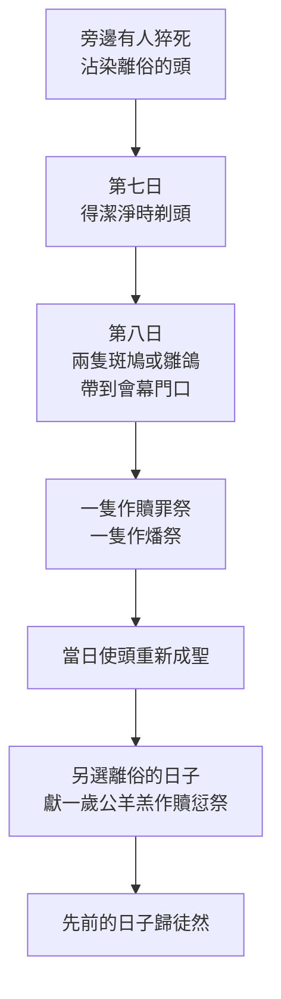

# 民數記 第6章

<!-- chapter-navigation:start -->
| [前一章](../04%20民數記/第5章.md) | [回目錄](../04%20民數記/全書目錄及綱要.md) | [下一章](../04%20民數記/第7章.md) |
| :--- | :---: | ---: |
<!-- chapter-navigation:end -->

1. 耶和華對[[摩西]]說：
2. 你曉諭以色列人說：無論男女許了特別的願，就是[[拿細耳人（nazir）|拿細耳人的願]]（拿細耳就是歸主的意思；下同），要[[離俗歸耶和華]]。
3. 他就要[[遠離葡萄樹與酒|遠離清酒濃酒]]，也不可喝什麼清酒濃酒做的醋；不可喝什麼葡萄汁，也不可吃鮮葡萄和乾葡萄。
4. 在一切[[離俗歸耶和華|離俗]]的日子，凡葡萄樹上結的，[[遠離葡萄樹與酒|自核至皮]]所做的物，都不可吃。
5. 在他一切許願[[離俗歸耶和華|離俗]]的日子，[[剃頭刀不可過頭（拿細耳人長髮）|不可用剃頭刀剃頭]]，要由髮綹長長了。他要聖潔，直到[[離俗歸耶和華]]的日子滿了。
6. 在他[[離俗歸耶和華]]的一切日子，[[不可挨近死屍（拿細耳人的潔淨）|不可挨近死屍]]。
7. 他的父母或是弟兄姊妹死了的時候，他不可因他們使自己不潔淨，因為那[[離俗歸耶和華|離俗歸神]]的憑據是在他頭上。
8. 在他一切[[離俗歸耶和華|離俗]]的日子是歸耶和華為聖。
9. 若在他旁邊忽然有人死了，以致沾染了他[[剃頭刀不可過頭（拿細耳人長髮）|離俗的頭]]，他要在第七日，得潔淨的時候，剃頭。
10. 第八日，他要把兩隻斑鳩或兩隻雛鴿帶到會幕門口，交給祭司。
11. 祭司要獻一隻作[[贖罪祭]]，一隻作[[燔祭]]，為他贖那因死屍而有的罪，並要當日使他的頭成為聖潔。
12. 他要另選[[離俗歸耶和華]]的日子，又要牽一隻一歲的公羊羔來作[[贖愆祭（asham）|贖愆祭]]；但[[意外沾染死屍與重新潔淨條例|先前的日子要歸徒然]]，因為他在離俗之間被玷污了。
13. [[拿細耳人（nazir）|拿細耳人]]滿了[[離俗歸耶和華|離俗]]的日子乃有這條例：人要領他到會幕門口，
14. 他要將供物奉給耶和華，就是一隻沒有殘疾、一歲的公羊羔作[[燔祭]]，一隻沒有殘疾、一歲的母羊羔作[[贖罪祭]]，和一隻沒有殘疾的公綿羊作[[平安祭]]，
15. 並一筐子無酵調油的細麵餅，與抹油的無酵薄餅，並同獻的[[素祭（minchah）|素祭]]和[[奠酒|奠祭]]。
16. 祭司要在耶和華面前獻那人的[[贖罪祭]]和[[燔祭]]；
17. 也要把那隻公羊和那筐無酵餅獻給耶和華作[[平安祭]]，又要將同獻的[[素祭（minchah）|素祭]]和[[奠酒|奠祭]]獻上。
18. [[拿細耳人（nazir）|拿細耳人]]要在會幕門口剃[[剃頭刀不可過頭（拿細耳人長髮）|離俗的頭]]，把離俗頭上的髮放在[[平安祭]]下的火上。
19. 他剃了以後，祭司就要取那已煮的公羊一條前腿，又從筐子裡取一個無酵餅和一個無酵薄餅，都放在他手上。
20. 祭司要拿這些作為[[搖祭]]，在耶和華面前搖一搖；這與所搖的胸、所舉的腿同為聖物，歸給祭司。然後[[拿細耳人（nazir）|拿細耳人]]可以喝酒。
21. 許願的[[拿細耳人（nazir）|拿細耳人]]為[[離俗歸耶和華|離俗]]所獻的供物，和他以外所能得的獻給耶和華，就有這條例。他怎樣許願就當照離俗的條例行。
22. 耶和華曉諭[[摩西]]說：
23. 你告訴[[亞倫]]和他兒子說：你們要這樣為以色列人祝福，說：
24. 願耶和華賜福給你，保護你。
25. 願耶和華使[[臉光照（神的容面）|他的臉光照你]]，賜恩給你。
26. 願耶和華向你仰臉，[[平安（shalom）|賜你平安]]。
27. 他們要如此奉我的名為以色列人祝福；我也要賜福給他們。

---

## 本章知識節點

### 人物
- [[摩西]]
- [[亞倫]]

### 原文
- [[拿細耳人（nazir）]]
- [[贖愆祭（asham）]]
- [[素祭（minchah）]]
- [[搖祭]]
- [[舉祭]]
- [[平安（shalom）]]

### 主題
- [[離俗歸耶和華]]
- [[遠離葡萄樹與酒]]
- [[剃頭刀不可過頭（拿細耳人長髮）]]
- [[不可挨近死屍（拿細耳人的潔淨）]]
- [[亞倫的祝福（祭司祝福）]]
- [[祝福與咒詛]]

### 事件
- [[意外沾染死屍與重新潔淨條例]]
- [[拿細耳人滿期還俗條例]]

### 神學
- [[燔祭]]
- [[贖罪祭]]
- [[平安祭]]
- [[臉光照（神的容面）]]

### 文化
- [[奠酒]]

### 背景
- [[凱特夫欣嫩銀卷與古代近東祝福文]]
- [[拿細耳人三禁令與三種民間宗教]]

### 解經爭議
- [[拿細耳人長髮與保羅禁令的張力]]

---

## 本章整理

### 一個平民也能許的願（v1-2）

前面幾章講的都是身分：利未人歸神是因為出身，祭司供職是因為血統。本章換了一個方向——[[拿細耳人（nazir）|拿細耳人]]的願，任何以色列人都可以自己許，男的女的都行。KC 把這個轉折放在上一章的對照裡讀：上一章寫的是不忠的妻子，「這裡則是另一面：有人親自願意完全而甘心地把自己獻給耶和華」。

和合本自己在第2節作了註：「拿細耳就是歸主的意思」。CT 的原文字義給的是「分別為聖的，獻身者」，GT《聖經精讀本》說這個詞「源於『區別』一詞」，BH 則說它來自希伯來文 nazir，意思是「分別出來的」或「獻上的」。方向比動作重要，這一點 KC 講得最清楚：分別「不是消極的，本身也不是目的，而是分別歸給耶和華」，所以這件事的名字叫[[離俗歸耶和華]]。

不過「離俗」這個譯法有人保留。GT《民數記串珠聖經註釋》指出拿細耳人「並不須離群獨處，仍照常人一樣生活，可見『離俗』（2）不是最貼切的譯法……若譯作『分別為聖』較為準確」。GT 丁良才講得更白：許了這個願「並不是避世，不做事，像那天主教的修道士一樣；乃是照常在家中盡他一切應盡的本分」，而按猶太人的遺傳，這個願「至少須有三十日」。

要許願的人受一些現實限制。GT 丁良才指出已婚婦人須得丈夫同意、未婚女兒須得父親同意才算數（民30:1-16）。至於終身的拿細耳人，聖經只記了三位：參孫、撒母耳、施洗約翰。

### 三條禁令，以及它們背後可能的共同對象（v3-8）

| 禁令 | 經文範圍 | 各家怎麼讀 |
|---|---|---|
| 不可碰葡萄樹的任何產物（見 [[遠離葡萄樹與酒]]） | v3-4，清酒、濃酒、酒醋、葡萄汁、鮮葡萄、乾葡萄，連自核至皮所做的都不可吃 | KC：酒是地上喜樂的圖像，拿細耳人自願放棄；GT《聖經精讀本》：酒「麻痹人的理性，使人不能分辨神的話語」 |
| 不可用剃頭刀剃頭（見 [[剃頭刀不可過頭（拿細耳人長髮）]]） | v5、v7，要由髮綹長長了，因為「離俗歸神的憑據是在他頭上」 | CT：甘心以辱為榮；KC：交出權柄的位置；GT 丁良才並列兩說——獻上力量，或情願為主受辱 |
| 不可挨近死屍（見 [[不可挨近死屍（拿細耳人的潔淨）]]） | v6-7，連父母弟兄姊妹過世也不例外 | CT：比一般祭司嚴（利21:1-3）；GT 串珠與 KC：與大祭司同級（利21:11） |

第一條的範圍常被低估。CT 解釋了一個很實際的理由：古時沒有冷藏也不懂防腐，葡萄放著「不必經過多久，就會起發酵作用，自然變為酒。所以拿細耳人防微杜漸，連葡萄也禁用」。GT《舊約聖經背景註釋》從用字上確認同一件事，本段「只用可以形容葡萄製品的字眼」，因此「這命令所針對的不是醉酒，而是一切的葡萄飲料」。

第三條最難。CT 承認觀感上的困難——「在人看來好像有點不近人情」——但也點出這正是讓神居首位的見證。GT《聖經精讀本》在這裡劃了一條很重要的界線，避免把經文推到極端：這條規定「強調奉獻給神的人，不能愛父母、弟兄超過愛神，但不是讓人斷絕與父母弟兄之間的親情」。KC 從主耶穌那一面補上另一半：祂並沒有像法利賽人那樣與人隔開，「祂沒有藐視不信的人，祂與稅吏和娼妓一同吃飯，卻從來沒有被他們玷污」。

三樣東西為什麼是這三樣，GT《舊約聖經背景註釋》提了一個把它們串起來的解釋，見[[拿細耳人三禁令與三種民間宗教]]：葡萄對應豐饒崇拜、頭髮對應感應法術、屍體對應死人祭儀，而「這是耶和華崇拜設法消滅的三大民間宗教」。它同時對自己的推論留了餘地：「為什麼單選擇這幾件事物，和這願的背後本來是什麼意思，都是難以重構的細節。」

> [!note] 這一條在新約留下一處張力
> 第5節不可剃頭，與林前11:14「男人若有長頭髮，便是他的羞辱」正面相碰。GT 賈斯樂郝威把它立成命題8，以「神聖的義務」為特殊例外處理；延伸出來的第二個問題是保羅在堅革哩許願（徒18:18）該不該做——CT、GT 各家與 BH 肯定，KC 明確否定。兩條線索見[[拿細耳人長髮與保羅禁令的張力]]。

### 被動沾染也算數（v9-12）

有人在拿細耳人旁邊突然死了。他沒選擇，也沒做錯，誓願仍然作廢。CT 把焦點放在一個具體的地方：「整個問題的焦點不在那個人作了甚麼，而是在那個人的『頭』受了沾染」——頭是接受神權柄的記號，那裡不能有死亡的成分。KC 的說法一致：「即使是無法預見的情況，對神來說也不是藉口。」

GT 丁良才把補救程序列成五項：潔淨自己、剃頭、獻贖罪祭和燔祭、另定離俗歸主的日子、獻贖愆祭。整套動作見[[意外沾染死屍與重新潔淨條例]]。

```mermaid
flowchart TD
    A["旁邊有人猝死<br/>沾染離俗的頭"] --> B["第七日<br/>得潔淨時剃頭"]
    B --> C["第八日<br/>兩隻斑鳩或雛鴿<br/>帶到會幕門口"]
    C --> D["一隻作贖罪祭<br/>一隻作燔祭"]
    D --> E["當日使頭重新成聖"]
    E --> F["另選離俗的日子<br/>獻一歲公羊羔作贖愆祭"]
    F --> G["先前的日子歸徒然"]
```

日子的數目不是隨手挑的。CT 說「『七日』是完全的意思」；KC 補完另一半——七是完全的數目，代表「一段完整的時期過去了，在其中他認清了自己所做的事」，而第八日是新的開始，因為剃掉之後頭髮也重新長出來。BH 的方向相同，並舉割禮定在第八日（創17:12）為例。

祭物用的是兩隻鳥。CT 指出這「原是貧窮人的祭物（利5:7）」，但在拿細耳人得潔淨的手續上「不論窮富，均以鳥隻為祭物」；BH 從另一面讀同一件事，說這讓獻祭制度對窮人也是開放的。==最重的一句在第12節==：「但先前的日子要歸徒然」。KC 稱這是「一個使人謙卑的思想」。

### 期滿還俗要走完七步（v13-21）

| 步驟 | 內容 | 節次 |
|---|---|---|
| 一 | 由人領他到會幕門口 | v13 |
| 二 | 獻一歲公羊羔作 [[燔祭]]、一歲母羊羔作 [[贖罪祭]]、公綿羊作 [[平安祭]]，都要沒有殘疾 | v14 |
| 三 | 一筐無酵調油細麵餅與抹油薄餅，並同獻的 [[素祭（minchah）]] 和 [[奠酒]] | v15 |
| 四 | 祭司先獻贖罪祭與燔祭，再獻平安祭與素祭奠祭 | v16-17 |
| 五 | 在會幕門口剃離俗的頭，把頭髮放在平安祭下的火上 | v18 |
| 六 | 祭司取已煮的公羊前腿與兩塊餅放在他手上，作 [[搖祭]] 搖一搖 | v19-20 |
| 七 | 之後拿細耳人可以喝酒 | v20 |

整套禮儀見[[拿細耳人滿期還俗條例]]。獻祭的次序有人特別注意：GT《聖經精讀本》指出祭司「在獻上燔祭之前首先獻上了贖罪祭，這是因為對於人來講最重要的是應首先解決罪的問題」。至於為什麼還俗還要獻贖罪祭，GT 丁良才的答案很直接：「人最好最聖的事都被罪惡玷污，除非流血獻祭，就不得蒙悅納。」

祭司在這一場多拿了東西。CT 指出第19節那條已煮的前腿是「平安祭牲的左腿，因右腿已經指定歸給祭司享用（利7:32）」，本來屬於獻祭的人。GT《民數記串珠聖經註釋》給了這個安排一句解釋：祭司所得除了慣常的胸和[[舉祭|所舉的腿]]，還加上額外的前腿及兩個餅，「表明拿細耳人的事奉是超額的」。

把頭髮燒在平安祭火上，是全章最特別的一個動作。KC 說：「除了拿細耳人的這頭髮以外，我們在任何地方都沒有讀到人身上的任何東西與祭物相連。這證明神極其看重人向祂獻身所作的事。」GT《聖經精讀本》讀的方向不同，認為這是表明那段日子的分別為聖「都是因神的恩典」。

第21節還留了一道彈性：除了規定必須獻的，可以照能力追加。GT《聖經精讀本》把這條彈性讀成神的體貼——這是「因考慮經濟情況所說的話，表明神的慈悲和愛」，並強調「比起人獻上的祭物，神更喜悅的是人的心」。

### 祝福是整段編排的終點（v22-27）

到這裡，神已經把百姓安置在自己周圍、逐名數點、編排事奉、潔淨營盤，最後確定了獻身之人的地位。KC 為這個位置下了一句話：「現在一切都預備好了，可以祝福百姓，把祂的名放在他們身上。」GT《民數記串珠聖經註釋》的說法一致：「22-27節祭司的祝福是1-6章神旨意及其目的之高峰。」這段祝福詞見[[亞倫的祝福（祭司祝福）]]。

GT《啟導本》指出它「用詩歌體寫成，為聖經中最早的一首詩歌」，並提醒「讀經時常易為人忽略」。三家對結構的切法不同，各有道理：

| 來源 | 結構怎麼看 |
|---|---|
| GT 丁良才、CT、KC | 三層對應三一神：聖父賜福保護、聖子賜恩光照、聖靈賜平安（林後13:14） |
| KC | 三對加最後一句總結，合為七項祝福 |
| GT《民數記串珠聖經註釋》 | 神的名出現三次、各帶兩個動詞；六個動詞分兩組——「賜福給、臉光照、向你仰臉」是神朝著子民的舉動，「保護你、賜恩給你、賜你平安」是在子民身上的工作 |

第二層的[[臉光照（神的容面）|臉光照]]，GT 丁良才只用四個字解釋：「就是喜悅的意思。」他並把神的臉排成一組對照——向人掩面，人就必死亡（申31:17）；向人變臉，人就必滅絕（利17:10）；臉光照亮人，人就必得拯救，得生命（詩27:1、44:3）。BH 補上文化背景：在古代近東，臉發光是表示認可與賜福的隱喻。

第三層停在[[平安（shalom）|平安]]。KC 的定義很簡潔：「Shalom：不只是沒有戰爭，也包括興旺、公義與安康。」GT《啟導本》列得更全：健康、財富、安樂的生活、沒有戰事，以及神的拯救。CT 則提醒方向：「我們不該在神之外求平安；真平安的捷徑乃是遵行神的旨意。」

CT 在全章最後加了一句備註，值得單獨抄下來：「請注意聖經的用詞，人對人是『祝福』，神對人是『賜福』。許多基督徒往往混淆不清。」這條分別也是[[祝福與咒詛]]這一組概念在本章的落點。

> [!important] 這段祝福詞出土過
> GT《舊約聖經背景註釋》記載，耶路撒冷凱特夫欣嫩（Keteph Hinnom）的一個主前六、七世紀墓穴出土兩個長約一吋的銀製卷軸護身符，「裡面正好有本段的祝福」，而「這些卷軸是現存最早的聖經經文例證」。西乃半島北部孔蒂拉特阿吉魯的主前九世紀大甕上，也有「願耶和華賜福給你，保護你」的字樣。詳見[[凱特夫欣嫩銀卷與古代近東祝福文]]。

### 原文層：一個字根撐起整章

STEP語言資料顯示，本章反覆出現的「離俗」在原文其實不是一個字，而是同一詞根的三個字，和合本又把它們譯成好幾個不同的中文詞。

| Strong | 詞典形 | 詞典義 | 本章次數 | 和合本譯法 |
|---|---|---|---|---|
| H5139 | na.zir | Nazirite | 6 | 拿細耳人 |
| H5145 | ne.zer | consecration: Nazirite vow | 13 | 離俗、憑據 |
| H5144B | na.zar | be a Nazarite | 5 | 離俗、遠離 |

這個分布與 CT 的逐節原文字義註記完全相符：凡註「拿細耳，為聖，冠冕」的地方（v4、5、7、8、9）都是名詞 ne.zer，凡註「分開，奉獻」的地方（v3、v6）都是動詞 na.zar。第7節特別值得看——和合本在那裡把 ne.zer 譯成「憑據」，所以「那離俗歸神的憑據是在他頭上」講的就是頭髮本身。

這組字還補上了 GT《啟導本》的一個缺口。它說「拿細耳人的頭髮和大祭司的冕與膏油，在希伯來原文都叫做」某個字，而該處的原文在文本中脫落了；STEP語言資料顯示本章這個字是 ne.zer，詞典義同時涵蓋分別歸神與冠冕兩層，正對得上 CT 所記的「拿細耳，為聖，冠冕」。

末段的祝福詞也有一處可以逐字查證的呼應。STEP語言資料顯示，第26節「賜你平安」的「賜」與第27節「奉我的名」的「奉」同為 H7760H（詞典形 sum，詞典義 to set: put）；CT 的原文字義在這兩節也分別註出「放置，設立」。==神把平安放在人身上，與祭司把神的名放在人身上，用的是同一個動作。== CT 對第27節的解釋正是這個意思：「『奉我的名』原文是『將神的名放置在』以色列人身上。」

**參考資料**
https://www.ccbiblestudy.org/Old%20Testament/04Num/04CT06.htm
https://www.ccbiblestudy.org/Old%20Testament/04Num/04GT06.htm
https://www.kingcomments.com/en/bible-studies/Num/6
https://biblehub.com/study/numbers/6.htm
https://github.com/STEPBible/STEPBible-Data

<!-- appendix-links:start -->
## 附錄

### 相關地圖
- [[appendix/fhl_maps/maps/019|〈出圖二〉以色列人出埃及到西乃山]]
<!-- appendix-links:end -->

<!-- chapter-navigation:start -->
| [前一章](../04%20民數記/第5章.md) | [回目錄](../04%20民數記/全書目錄及綱要.md) | [下一章](../04%20民數記/第7章.md) |
| :--- | :---: | ---: |
<!-- chapter-navigation:end -->
