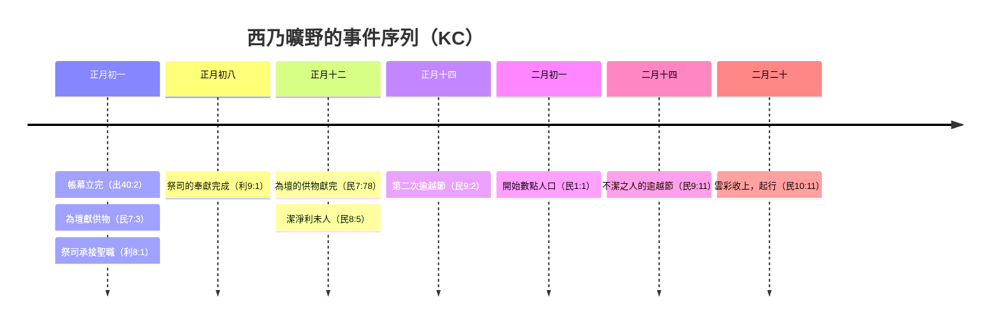

# 民數記 第7章

<!-- chapter-navigation:start -->
| [前一章](../04%20民數記/第6章.md) | [回目錄](../04%20民數記/全書目錄及綱要.md) | [下一章](../04%20民數記/第8章.md) |
| :--- | :---: | ---: |
<!-- chapter-navigation:end -->

1. [[摩西]]立完了帳幕，就把帳幕用膏抹了，使他成聖，又把其中的器具和壇，並壇上的器具，都抹了，使他成聖。
2. 當天，以色列的眾首領，就是各族的族長，都來奉獻。他們是各支派的首領，管理那些被數的人。
3. 他們把自己的[[供物（qorban）|供物]]送到耶和華面前，就是[[奉獻篷車與牛（利未人搬運分工）|六輛篷子車和十二隻公牛]]。每兩個首領奉獻一輛車，每首領奉獻一隻牛。他們把這些都奉到帳幕前。
4. 耶和華曉諭[[摩西]]說：
5. 你要收下這些，好作會幕的使用，都要照利未人所辦的事交給他們。
6. 於是[[摩西]]收了車和牛，交給利未人，
7. 把兩輛車，四隻牛，照[[革順子孫]]所辦的事交給他們，
8. 又把四輛車，八隻牛，照[[米拉利子孫]]所辦的事交給他們；他們都在祭司[[亞倫]]的兒子[[以他瑪]]手下。
9. 但[[奉獻篷車與牛（利未人搬運分工）|車與牛]]都沒有交給[[哥轄子孫]]；因為他們辦的是聖所的事，[[肩頭抬聖物（哥轄子孫）|在肩頭上抬聖物]]。
10. 用膏抹壇的日子，首領都來行[[奉獻壇之禮（十二支派首領奉獻）|奉獻壇的禮]]，眾首領就在壇前獻[[供物（qorban）|供物]]。
11. 耶和華對[[摩西]]說：眾首領為行[[奉獻壇之禮（十二支派首領奉獻）|奉獻壇的禮]]，要[[按日獻供物（十二天奉獻禮）|每天一個首領來獻供物]]。
12. 頭一日獻[[供物（qorban）|供物]]的是猶大支派的亞米拿達的兒子[[拿順]]。
13. 他的[[供物（qorban）|供物]]是：一個銀盤子，重一百三十舍客勒，一個銀碗，重七十舍客勒，都是按[[聖所的平（捨客勒標準）|聖所的平]]，也都盛滿了調油的細麵作[[素祭（minchah）|素祭]]；
14. 一個金盂，重十舍客勒，[[金盂盛滿了香（祈禱與事奉）|盛滿了香]]；
15. 一隻公牛犢，一隻公綿羊，一隻一歲的公羊羔作[[燔祭]]；
16. 一隻公山羊作[[贖罪祭]]；
17. 兩隻公牛，五隻公綿羊，五隻公山羊，五隻一歲的公羊羔作[[平安祭]]。這是亞米拿達兒子[[拿順]]的[[供物（qorban）|供物]]。
18. 第二日來獻的是以薩迦子孫的首領、蘇押的兒子拿坦業。
19. 他獻為[[供物（qorban）|供物]]的是：一個銀盤子，重一百三十舍客勒，一個銀碗，重七十舍客勒，都是按[[聖所的平（捨客勒標準）|聖所的平]]，也都盛滿了調油的細麵作[[素祭（minchah）|素祭]]；
20. 一個金盂，重十舍客勒，[[金盂盛滿了香（祈禱與事奉）|盛滿了香]]；
21. 一隻公牛犢，一隻公綿羊，一隻一歲的公羊羔作[[燔祭]]；
22. 一隻公山羊作[[贖罪祭]]；
23. 兩隻公牛，五隻公綿羊，五隻公山羊，五隻一歲的公羊羔作[[平安祭]]。這是蘇押兒子拿坦業的[[供物（qorban）|供物]]。
24. 第三日來獻的是西布倫子孫的首領、希倫的兒子以利押。
25. 他的[[供物（qorban）|供物]]是：一個銀盤子，重一百三十舍客勒，一個銀碗，重七十舍客勒，都是按[[聖所的平（捨客勒標準）|聖所的平]]，也都盛滿了調油的細麵作[[素祭（minchah）|素祭]]；
26. 一個金盂，重十舍客勒，[[金盂盛滿了香（祈禱與事奉）|盛滿了香]]；
27. 一隻公牛犢，一隻公綿羊，一隻一歲的公羊羔作[[燔祭]]；
28. 一隻公山羊作[[贖罪祭]]；
29. 兩隻公牛，五隻公綿羊，五隻公山羊，五隻一歲的公羊羔作[[平安祭]]。這是希倫兒子以利押的[[供物（qorban）|供物]]。
30. 第四日來獻的是流便子孫的首領、示丟珥的兒子以利蓿。
31. 他的[[供物（qorban）|供物]]是：一個銀盤子，重一百三十舍客勒，一個銀碗，重七十舍客勒，都是按[[聖所的平（捨客勒標準）|聖所的平]]，也都盛滿了調油的細麵作[[素祭（minchah）|素祭]]；
32. 一個金盂，重十舍客勒，[[金盂盛滿了香（祈禱與事奉）|盛滿了香]]；
33. 一隻公牛犢，一隻公綿羊，一隻一歲的公羊羔作[[燔祭]]；
34. 一隻公山羊作[[贖罪祭]]；
35. 兩隻公牛，五隻公綿羊，五隻公山羊，五隻一歲的公羊羔作[[平安祭]]。這是示丟珥的兒子以利蓿的[[供物（qorban）|供物]]。
36. 第五日來獻的是西緬子孫的首領、蘇利沙代的兒子示路蔑。
37. 他的[[供物（qorban）|供物]]是：一個銀盤子，重一百三十舍客勒，一個銀碗，重七十舍客勒，都是按[[聖所的平（捨客勒標準）|聖所的平]]，也都盛滿了調油的細麵作[[素祭（minchah）|素祭]]；
38. 一個金盂，重十舍客勒，[[金盂盛滿了香（祈禱與事奉）|盛滿了香]]；
39. 一隻公牛犢，一隻公綿羊，一隻一歲的公羊羔作[[燔祭]]；
40. 一隻公山羊作[[贖罪祭]]；
41. 兩隻公牛，五隻公綿羊，五隻公山羊，五隻一歲的公羊羔作[[平安祭]]。這是蘇利沙代兒子示路蔑的[[供物（qorban）|供物]]。
42. 第六日來獻的是迦得子孫的首領、丟珥的兒子以利雅薩。
43. 他的[[供物（qorban）|供物]]是：一個銀盤子，重一百三十舍客勒，一個銀碗，重七十舍客勒，都是按[[聖所的平（捨客勒標準）|聖所的平]]，也都盛滿了調油的細麵作[[素祭（minchah）|素祭]]；
44. 一個金盂，重十舍客勒，[[金盂盛滿了香（祈禱與事奉）|盛滿了香]]；
45. 一隻公牛犢，一隻公綿羊，一隻一歲的公羊羔作[[燔祭]]；
46. 一隻公山羊作[[贖罪祭]]；
47. 兩隻公牛，五隻公綿羊，五隻公山羊，五隻一歲的公羊羔作[[平安祭]]。這是丟珥的兒子以利雅薩的[[供物（qorban）|供物]]。
48. 第七日來獻的是以法蓮子孫的首領、亞米忽的兒子以利沙瑪。
49. 他的[[供物（qorban）|供物]]是：一個銀盤子，重一百三十舍客勒，一個銀碗，重七十舍客勒，都是按[[聖所的平（捨客勒標準）|聖所的平]]，也都盛滿了調油的細麵作[[素祭（minchah）|素祭]]；
50. 一個金盂，重十舍客勒，[[金盂盛滿了香（祈禱與事奉）|盛滿了香]]；
51. 一隻公牛犢，一隻公綿羊，一隻一歲的公羊羔作[[燔祭]]；
52. 一隻公山羊作[[贖罪祭]]；
53. 兩隻公牛，五隻公綿羊，五隻公山羊，五隻一歲的公羊羔作[[平安祭]]。這是亞米忽兒子以利沙瑪的[[供物（qorban）|供物]]。
54. 第八日來獻的是瑪拿西子孫的首領、比大蓿的兒子迦瑪列。
55. 他的[[供物（qorban）|供物]]是：一個銀盤子，重一百三十舍客勒，一個銀碗，重七十舍客勒，都是按[[聖所的平（捨客勒標準）|聖所的平]]，也都盛滿了調油的細麵作[[素祭（minchah）|素祭]]；
56. 一個金盂，重十舍客勒，[[金盂盛滿了香（祈禱與事奉）|盛滿了香]]；
57. 一隻公牛犢，一隻公綿羊，一隻一歲的公羊羔作[[燔祭]]；
58. 一隻公山羊作[[贖罪祭]]；
59. 兩隻公牛，五隻公綿羊，五隻公山羊，五隻一歲的公羊羔作[[平安祭]]。這是比大蓿兒子迦瑪列的[[供物（qorban）|供物]]。
60. 第九日來獻的是便雅憫子孫的首領、基多尼的兒子亞比但。
61. 他的[[供物（qorban）|供物]]是：一個銀盤子，重一百三十舍客勒，一個銀碗，重七十舍客勒，都是按[[聖所的平（捨客勒標準）|聖所的平]]，也都盛滿了調油的細麵作[[素祭（minchah）|素祭]]；
62. 一個金盂，重十舍客勒，[[金盂盛滿了香（祈禱與事奉）|盛滿了香]]；
63. 一隻公牛犢，一隻公綿羊，一隻一歲的公羊羔作[[燔祭]]；
64. 一隻公山羊作[[贖罪祭]]；
65. 兩隻公牛，五隻公綿羊，五隻公山羊，五隻一歲的公羊羔作[[平安祭]]。這是基多尼兒子亞比但的[[供物（qorban）|供物]]。
66. 第十日來獻的是但子孫的首領、亞米沙代的兒子亞希以謝。
67. 他的[[供物（qorban）|供物]]是：一個銀盤子，重一百三十舍客勒，一個銀碗，重七十舍客勒，都是按[[聖所的平（捨客勒標準）|聖所的平]]，也都盛滿了調油的細麵作[[素祭（minchah）|素祭]]；
68. 一個金盂，重十舍客勒，[[金盂盛滿了香（祈禱與事奉）|盛滿了香]]；
69. 一隻公牛犢，一隻公綿羊，一隻一歲的公羊羔作[[燔祭]]；
70. 一隻公山羊作[[贖罪祭]]；
71. 兩隻公牛，五隻公綿羊，五隻公山羊，五隻一歲的公羊羔作[[平安祭]]。這是亞米沙代兒子亞希以謝的[[供物（qorban）|供物]]。
72. 第十一日來獻的是亞設子孫的首領、俄蘭的兒子帕結。
73. 他的[[供物（qorban）|供物]]是：一個銀盤子，重一百三十舍客勒，一個銀碗，重七十舍客勒，都是按[[聖所的平（捨客勒標準）|聖所的平]]，也都盛滿了調油的細麵作[[素祭（minchah）|素祭]]；
74. 一個金盂，重十舍客勒，[[金盂盛滿了香（祈禱與事奉）|盛滿了香]]；
75. 一隻公牛犢，一隻公綿羊，一隻一歲的公羊羔作[[燔祭]]；
76. 一隻公山羊作[[贖罪祭]]；
77. 兩隻公牛，五隻公綿羊，五隻公山羊，五隻一歲的公羊羔作[[平安祭]]。這是俄蘭兒子帕結的[[供物（qorban）|供物]]。
78. 第十二日來獻的是拿弗他利子孫的首領、以南兒子亞希拉。
79. 他的[[供物（qorban）|供物]]是：一個銀盤子，重一百三十舍客勒，一個銀碗，重七十舍客勒，都是按[[聖所的平（捨客勒標準）|聖所的平]]，也都盛滿了調油的細麵作[[素祭（minchah）|素祭]]；
80. 一個金盂，重十舍客勒，[[金盂盛滿了香（祈禱與事奉）|盛滿了香]]；
81. 一隻公牛犢，一隻公綿羊，一隻一歲的公羊羔作[[燔祭]]；
82. 一隻公山羊作[[贖罪祭]]；
83. 兩隻公牛，五隻公綿羊，五隻公山羊，五隻一歲的公羊羔作[[平安祭]]。這是以南兒子亞希拉的[[供物（qorban）|供物]]。
84. 用膏抹壇的日子，以色列的眾首領為行[[奉獻壇之禮（十二支派首領奉獻）|獻壇之禮]]所獻的是：銀盤子十二個，銀碗十二個，金盂十二個；
85. 每盤子重一百三十舍客勒，每碗重七十舍客勒。一切器皿的銀子，按[[聖所的平（捨客勒標準）|聖所的平]]，共有二千四百舍客勒。
86. 十二個[[金盂盛滿了香（祈禱與事奉）|金盂盛滿了香]]，按[[聖所的平（捨客勒標準）|聖所的平]]，每盂重十舍客勒，所有的金子共一百二十舍客勒。
87. 作[[燔祭]]的，共有公牛十二隻，公羊十二隻，一歲的公羊羔十二隻，並同獻的[[素祭（minchah）|素祭]]作[[贖罪祭]]的公山羊十二隻；
88. 作[[平安祭]]的，共有公牛二十四隻，公綿羊六十隻，公山羊六十隻，一歲的公羊羔六十隻。這就是用膏抹壇之後，為行[[奉獻壇之禮（十二支派首領奉獻）|奉獻壇之禮]]所獻的。
89. [[摩西]]進會幕要與耶和華說話的時候，聽見[[約櫃|法櫃]]的[[施恩座]]以上、[[二基路伯中間說話的聲音|二基路伯中間有與他說話的聲音]]，就是耶和華與他說話。

---

## 本章知識節點

### 人物
- [[摩西]]
- [[亞倫]]
- [[以他瑪]]
- [[革順子孫]]
- [[米拉利子孫]]
- [[哥轄子孫]]
- [[拿順]]

### 主題
- [[肩頭抬聖物（哥轄子孫）]]
- [[按日獻供物（十二天奉獻禮）]]
- [[金盂盛滿了香（祈禱與事奉）]]
- [[施恩座]]
- [[約櫃]]

### 事件
- [[奉獻篷車與牛（利未人搬運分工）]]
- [[奉獻壇之禮（十二支派首領奉獻）]]

### 文化
- [[聖所的平（捨客勒標準）]]

### 神學
- [[贖罪祭]]
- [[燔祭]]
- [[平安祭]]
- [[二基路伯中間說話的聲音]]
- [[贖罪祭與贖愆祭的分別]]

### 原文
- [[素祭（minchah）]]
- [[供物（qorban）]]

### 背景
- [[民數記第七章的時序與編排]]

---

## 本章整理

### 為什麼時間忽然往回跳（v1）

本章第一句是「摩西立完了帳幕」，把時間拉回出埃及後第二年正月初一日（出40:17）——比民數記第1章的二月初一還早一個月。整卷書在這裡往回走了一段，各家都注意到了，理由卻給得不一樣（見[[民數記第七章的時序與編排]]）。GT 丁良才的說法最直接：「本章的事，原該列在利八10節以後，不過記在此處，免得有防礙於記載西奈山垂律法的事。」GT《啟導本》從寫作意圖解釋：作者希望民數記「可以集中講獻祭和祭司的按立」，先講出發前的準備與利未人分工，之後才介紹奉獻禮物，「不僅層次分明，也讓讀者可以分外明白獻禮物一事的重要性」。GT《民數記串珠聖經註釋》另給三個理由，其中一個是若按日記方式記敘，「便會破壞律法的整體性及實踐的一致性」。

KC 把這段日子的事件排成一條完整的時間線，本章插在哪裡就一目了然：

CT 註明第1節的膏抹本身也不尋常：「用膏抹了」——「本來只有君王、先知、祭司三種職位的人受膏，這裡的會幕是神的居所，當然需要抹膏，使之成聖」。GT《民數記串珠聖經註釋》說得更精確：舊約的膏抹禮通常膏人不膏物，「因為物件並無道德性，唯一例外是帳幕，因為它代表了神居住的所在」。GT《舊約聖經背景註釋》則對材料存疑：本節沒有說明用的是油還是血，「學者一般的見解，是前者可能性較高」。

### 六輛車、十二隻牛，以及一個沒有分到的家族（v2-9）

十二支派的首領自己帶了東西來——「六輛篷子車和十二隻公牛」，兩個首領合獻一輛車，每人各獻一隻牛（v3）。這件事見[[奉獻篷車與牛（利未人搬運分工）]]。

車聽起來不多，但 GT《民數記串珠聖經註釋》提醒當時的處境：十二個支派才獻得出六輛，「因為當時剛開始進入鐵器時代，車輛是非常珍貴的」；以色列人手上的是木頭車，「是從埃及人手中得來的（出12:36）」。GT《聖經精讀本》補上篷子的用途——這是「為了在曠野的風雨、沙等自然災害中保護聖物而預備的車子」。

==這批東西是禮物，不是神指定的祭物==，所以摩西才要先問神能不能收。GT《民數記串珠聖經註釋》把這條界線劃得很清楚：「禮物是額外的，並不是神清楚指定的，因此摩西須尋問神是否接受這些禮物（4）。但人奉獻禮物也是出於神的感動，所以能合乎神使用（5）；至於祭物，則是神清楚指明的。」KC 的觀察方向一致：這些不在神給摩西的會幕指示裡，但神說可以收下，因為它們是「敬畏神之人的果子」。他們帶來的[[供物（qorban）|供物]]因此有一種特別的性質——出於感動，不出於命令。

分配的結果不是平均的：

| 家族 | 分到 | 負責搬什麼 |
|---|---|---|
| [[革順子孫]] | 兩輛車、四隻牛 | 較輕的幕幔、罩棚、帷子、門簾（民4:24-26） |
| [[米拉利子孫]] | 四輛車、八隻牛，在 [[以他瑪]] 手下 | 較重的板、閂、柱子、帶卯的座（民4:31-32） |
| [[哥轄子孫]] | 沒有車也沒有牛 | 聖所的器具，在肩頭上抬（v9） |

沒分到車不等於被虧待，這一點 CT 兩邊都說了：革順與米拉利「事奉的量很沉重，但車輛交給他們使用，他們的服事就變為輕省了」；哥轄子孫則是「用肩頭去抬聖物……這些都是高舉主的服事，服事的人都要付代價去作」，而他們「甘心而沒有怨言」。KC 說得更硬：屬天的事物「應當扛在肩上」，人的資源——他舉的例子是神學訓練——「在這裡沒有位置」。這條定例後來出過人命，見[[肩頭抬聖物（哥轄子孫）]]：GT 丁良才記「後來大衛因忘記了這吩咐，就害了烏撒的命（代上十三7至末）」，KC 另指出非利士人也曾把約櫃放在車上（撒上6:7-11），但他們是出於無知。

KC 從分配不均讀出一個原則：神「不是照人的方式把一切平均分配」，這樣安排是要試驗信心與愛心；心思與神一致的人「會為著在別人身上看見的基督而喜樂，即使自己並不擁有」。

### 十二天，同一份清單抄十二遍（v10-83）

用膏抹壇的日子，首領們前來行[[奉獻壇之禮（十二支派首領奉獻）|奉獻壇的禮]]，神吩咐「要每天一個首領來獻供物」（v11）。從[[拿順]]代表猶大支派的頭一日起，一連十二天，次序與第2章安營起行的次序相同。

每位首領獻的完全一樣：

| 項目 | 內容 | 節次 |
|---|---|---|
| 銀盤子 | 一個，重 130 [[聖所的平（捨客勒標準）]]，盛滿調油細麵作 [[素祭（minchah）]] | v13 |
| 銀碗 | 一個，重 70 舍客勒，同樣盛滿調油細麵 | v13 |
| [[金盂盛滿了香（祈禱與事奉）]] | 一個，重 10 舍客勒，盛滿了香 | v14 |
| [[燔祭]] | 公牛犢一、公綿羊一、一歲公羊羔一 | v15 |
| [[贖罪祭]] | 公山羊一 | v16 |
| [[平安祭]] | 公牛二、公綿羊五、公山羊五、一歲公羊羔五 | v17 |

**為什麼要分十二天，有一個很實際的答案。** GT《民數記串珠聖經註釋》算給讀者看：每支派人口數以萬計，「不能全部齊集在帳幕前，況且利未人的營地將他們與帳幕隔開，所以必須由首領代表獻供物」；而每支派要處理十七隻祭牲，「花一天的時間去處理是相當合理的」。

**為什麼經文不肯省筆，各家的答案彼此呼應**（見[[按日獻供物（十二天奉獻禮）]]）。CT 說得最生活化：「照一般人的作法，各支派相續奉獻，盡可記載『同上』……但聖經的記載，與人的想法不同。」他的結論是神「絕不會漏掉人對祂的敬愛」。KC 用了一個很好的類比：「重複對神來說不是一件累人的事」——詩篇一百三十六篇每一節都重複「因他的慈愛永遠長存」；在讚美中我們常用同樣的話，但神從不說「這我已經聽過了」。GT《啟導本》從責任的角度讀：這「正好說明，每一族在敬拜神、支持會幕和供養祭司的事上，都有同等的責任」。

> [!question] 為什麼沒有贖愆祭？三家的理由不一樣
> 本章只獻了燔祭、素祭、贖罪祭與平安祭四種。CT 的解釋是首領「不是為個人的罪行獻祭，而是代表全支派之人在神面前乃是罪人，故僅獻贖罪祭」；GT《民數記串珠聖經註釋》認為「贖愆祭是要贖人際間的罪咎（參利5章），而本段的獻祭是以神為中心，故此無需獻贖愆祭」；GT《聖經精讀本》則說「是因為他們沒有犯應該向神賠償的特別罪」。三種說法都指向同一個結論，路徑卻不同，見[[贖罪祭與贖愆祭的分別]]。

### 總數，與一句沒有人預料到的結尾（v84-89）

第84至88節把十二天的東西加總。GT 丁良才數完之後給了一個五項評語：以色列人的首領所捐的，「1是樂獻的，2是適用的，3是合捐的，4是豐厚的，5是蒙悅納的」。

| 類別 | 總數 | CT 的換算 |
|---|---|---|
| 銀盤子、銀碗 | 各 12 個，銀共 2,400 舍客勒 | 約 27 公斤 600 公克 |
| 金盂 | 12 個，金共 120 舍客勒 | 約 1 公斤 380 公克 |
| 燔祭牲 | 公牛 12、公羊 12、一歲公羊羔 12 | — |
| 贖罪祭牲 | 公山羊 12 | — |
| 平安祭牲 | 公牛 24、公綿羊 60、公山羊 60、一歲公羊羔 60 | — |

GT 丁良才把牲畜加總為「二百五十二隻」。GT《舊約聖經背景註釋》對這份清單提出一個容易被略過的判斷：「經文不是說這些牲畜立刻被獻為祭……牠們暫時只是聖所的牲口，到有需要時才用得上而已。這些運作的基本所需，可說是聖所喬遷的禮物。」

本章結束在一個安靜的畫面：「摩西進會幕要與耶和華說話的時候，聽見法櫃的[[施恩座]]以上、二基路伯中間有與他說話的聲音」（v89）。CT 解釋[[約櫃|法櫃]]裡存放兩塊法版、嗎哪與亞倫發過芽的杖，而施恩座「希伯來原文字根有『遮蓋』的意思」。摩西當時站在哪裡，GT 丁良才留了兩說：「大概站在聖所裡的內幔前」，但「也有注釋家想摩西是進了至聖所」。

KC 為這一節在章末的位置作了說明：這件事發生在甘心樂意的奉獻記載之後，神才把心意向人顯明——「唯有當我們有一顆甘願的心、滿了對主耶穌的欣賞時，祂才真能與我們分享祂的心思」。他並注意到摩西的作法：在領導的一切忙亂之中，摩西仍然騰出時間到耶和華面前，「聖所的安靜正是作這件事的合宜之處」。這一節見[[二基路伯中間說話的聲音]]。

### 原文層：供物與「帶到近處」

STEP語言資料顯示，本章第3節的兩個關鍵動作在原文是同一個字根。「他們把自己的供物送到耶和華面前」的「供物」是 ka.re.ba.Na/m（H7133A，詞典形 qor.ban，詞典義 offering），而同一節「他們把這些都奉到帳幕前」的「奉到」是 va/i.yak.Ri.vu（H7126H，詞典形 qa.rav，詞典義 to present: bring）。==供物就是「被帶到近處的東西」，而首領所做的動作就是「把它帶到近處」==，名詞與動詞在原文同源。

STEP 也為 GT 丁良才的一項字義判斷提供了支持。他說「篷子車」的「有人以為這是駝轎的意思，蓬子兩個字的原文，在賽六十六20節譯作轎字」。STEP 顯示第3節該處確實是兩個字：'eg.Lot（H5699，詞典形 a.ga.lah，詞典義 cart）配上 tzav（H6632A，詞典形 tsav，詞典義 litter，即轎）。

第9節「他們辦的是聖所的事，在肩頭上抬聖物」在原文裡把職事與肩膀連在一句話中：「事」是 'a.vo.Dat（H5656H，詞典形 a.vo.dah，詞典義 service: ministry），「肩頭」是 ba./ka.Tef（H3802，ka.teph，shoulder），「抬」是 yi.Sa.'u（H5375H，na.sa，to lift: bear）。

第89節則有一組值得並排看的字：「施恩座」是 ha./ka.Po.ret（H3727，kap.po.ret，mercy seat），STEP 給本節的語境譯義是 atonement cover——贖罪的蓋子，正對得上 CT 所記「原文字根有『遮蓋』的意思」；「法櫃」是 'a.Ron（H727，ark）配 ha./'e.Dut（H5715，e.dut，testimony），字面就是「見證的櫃」，與 CT 原文字義所註的「法」見證、「櫃」箱子相符。

**參考資料**
https://www.ccbiblestudy.org/Old%20Testament/04Num/04CT07.htm
https://www.ccbiblestudy.org/Old%20Testament/04Num/04GT07.htm
https://www.kingcomments.com/en/bible-studies/Num/7
https://biblehub.com/study/numbers/7.htm
https://github.com/STEPBible/STEPBible-Data

<!-- chapter-navigation:start -->
| [前一章](../04%20民數記/第6章.md) | [回目錄](../04%20民數記/全書目錄及綱要.md) | [下一章](../04%20民數記/第8章.md) |
| :--- | :---: | ---: |
<!-- chapter-navigation:end -->
