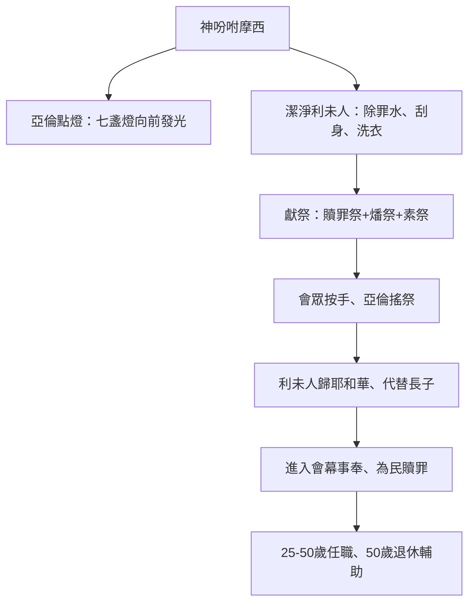

# 民數記 第8章

1. [[摩西|耶和華曉諭摩西說]]：
2. 你[[亞倫|告訴亞倫說]]：點燈的時候，七盞燈都要向[[金燈臺|燈臺]]前面發光。
3. [[亞倫|亞倫便這樣行]]。他[[七盞燈|點燈臺上的燈]]，使燈[[向前發光]]，是照耶和華所吩咐[[摩西]]的。
4. 這[[金燈臺|燈臺]]的做法是[[燈臺點燈條例|用金子錘出來]]的，連座帶花都是錘出來的。[[摩西]]製造燈臺，是照耶和華所指示的[[樣式]]。
5. [[摩西|耶和華曉諭摩西說]]：
6. 你從以色列人中選出[[利未人]]來，潔淨他們。
7. 潔淨他們當這樣行：用[[彈|除罪水彈在他們身上]]，又叫他們用[[潔淨利未人條例|剃頭刀刮全身]]，洗衣服，[[剃頭刮全身|潔淨自己]]。
8. 然後叫他們取一隻公牛犢，並同獻的[[公牛犢燔祭|素祭]]，就是調油的細麵；你要[[公牛犢贖罪祭|另取一隻]]公牛犢作[[贖罪]]祭。
9. 將[[利未人]]奉到會幕前，招聚[[以色列全會眾]]。
10. 將[[利未人]]奉到耶和華面前，[[以色列全會眾|以色列人要按手]]在他們頭上。
11. [[亞倫]]也將他們奉到耶和華面前，為以色列人當作搖祭，使他們好辦耶和華的事。
12. [[利未人]]要[[潔淨利未人條例|按手]]在那兩隻牛的頭上；你要將一隻作[[贖罪]]祭，一隻作[[公牛犢燔祭|燔祭]]，獻給耶和華，為利未人贖罪。
13. 你也要使[[利未人]]站在[[亞倫和他兒子（祭司）|亞倫和他兒子]]面前，將他們當作搖祭奉給耶和華。
14. 這樣，你從以色列人中[[利未人歸耶和華|將利未人分別出來]]，利未人便要歸我。
15. 此後[[利未人]]要進去辦會幕的事，你要潔淨他們，將他們當作搖祭奉上；
16. 因為他們是從以色列人中全然給我的，我揀選他們歸我，是代替[[頭生|以色列人中一切頭生的]]。
17. [[頭生|以色列人中一切頭生的]]，連人帶牲畜，都是我的。我在埃及地擊殺一切頭生的那天，將他們分別為聖歸我。
18. 我揀選[[利未人]]代替[[頭生|以色列人中一切頭生的]]。
19. 我從以色列人中將[[利未人]]當作賞賜給[[亞倫和他兒子（祭司）|亞倫和他的兒子]]，在會幕中辦以色列人的事，又為以色列人[[贖罪]]，免得他們挨近聖所，有災殃臨到他們中間。
20. [[摩西]]、[[亞倫]]，並[[以色列全會眾]]便向[[利未人]]如此行。凡耶和華指著利未人所吩咐摩西的，以色列人就向他們這樣行。
21. 於是[[利未人]][[剃頭刮全身|潔淨自己]]，除了罪，洗了衣服；[[亞倫]]將他們當作搖祭奉到耶和華面前，又為他們[[贖罪]]，潔淨他們。
22. 然後[[利未人]]進去，在[[亞倫和他兒子（祭司）|亞倫和他兒子]]面前，在會幕中辦事。耶和華指著利未人怎樣吩咐[[摩西]]，以色列人就怎樣向他們行了。
23. [[摩西|耶和華曉諭摩西說]]：
24. [[利未人]]是這樣：從二十五歲以外，他們要前來任職，辦會幕的事。
25. 到了五十歲要[[退下|停工退任]]，[[退下|不再辦事]]，
26. 只要在會幕裡，和他們的弟兄一同伺候，[[看守所吩咐的|謹守所吩咐的]]，[[退下|不再辦事]]了。至於所吩咐[[利未人]]的，你要這樣向他們行。

<!-- fhl-map-links:start -->
## 相關地圖

- [[appendix/fhl_maps/maps/019|〈出圖二〉以色列人出埃及到西乃山]]
- [[appendix/fhl_maps/maps/038|〈書圖十一〉利未人的城和十二個支派的地業]]
<!-- fhl-map-links:end -->

---

## 本章知識節點

### 神學
- [[代替長子]]
- [[完全給我]]
- [[為以色列人贖罪]]
- [[免得遭災]]
- [[歸神]]
- [[利未人代替長子]]
- [[利未人歸耶和華]]

### 儀式
- [[潔淨利未人條例]]
- [[利未人作搖祭]]
- [[公牛犢贖罪祭]]
- [[公牛犢燔祭]]
- [[調油的細麵（solet belulah vashemen）]]
- [[除罪水]]
- [[剃頭刮全身]]
- [[彈]]
- [[按手（samak）]]

### 職分
- [[利未人任職年歲]]
- [[利未人退休輔助]]
- [[看守所吩咐的]]
- [[幫助弟兄]]
- [[在會幕前辦事]]
- [[任職年歲]]

### 器具
- [[金燈臺]]
- [[七盞燈]]
- [[樣式]]
- [[燈檯]]
- [[陳設餅桌]]

### 群體
- [[利未人]]
- [[亞倫和他兒子（祭司）]]
- [[以色列全會眾]]
- [[摩西]]
- [[亞倫]]

### 地點
- [[曠野]]
- [[西乃山]]

### 行動
- [[選出利未人]]
- [[進入會幕前]]
- [[向前發光]]
- [[退下]]
- [[以色列人順服]]
- [[潔淨利未人]]

### 概念
- [[頭生]]
- [[贖罪]]
- [[燈臺點燈條例]]
- [[照規條待他們]]
- [[刮]]

---

## 本章整理

### 金燈臺點燈條例（v1-4）
耶和華吩咐[[摩西]]轉告[[亞倫]]：點燈時[[七盞燈]]都要[[向前發光]]，照亮[[金燈臺|燈臺]]前面。這[[金燈臺]]是用純金錘出的（原文 *mikshah*），連座帶花一體成形，完全照[[樣式]]——即神在山上指示摩西的天上原型。[[亞倫]]順服執行，彰顯祭司在聖所中維持光照的責任，也預表神的同在恆常照耀祂的子民。這段經文確立了[[燈臺點燈條例]]，使聖所內的光永不熄滅。

### 潔淨利未人與分別為聖（v5-22）
神指示[[摩西]]從[[以色列全會眾]]中[[選出利未人]]，按[[潔淨利未人條例]]使他們潔淨：用[[除罪水]]（mei chatta't）[[彈]]在他們身上，叫他們[[剃頭刮全身]]、洗衣服。隨後獻上兩隻公牛犢：一隻作[[公牛犢贖罪祭]]，一隻作[[公牛犢燔祭]]，同獻[[調油的細麵（solet belulah vashemen）]]。[[以色列全會眾]]聚集會幕前，按手在利未人頭上（轉移認同）；[[亞倫]]將利未人作[[利未人作搖祭|搖祭]]奉給耶和華，象徵他們完全歸神、在聖所前[[在會幕前辦事]]。[[亞倫和他兒子（祭司）]]再為他們贖罪，利未人才得以[[進入會幕前]]事奉。整個流程嚴謹有序，體現[[潔淨利未人]]的聖潔標準。

> [!important] 核心神學：利未人代替長子
> 神宣告：「利未人是從以色列人中全然給我的，我揀選他們歸我，是[[代替長子]]」（v16-18）。因神在埃及擊殺長子之夜，將以色列一切[[頭生]]（人與牲畜）[[歸神|分別為聖歸我]]。如今[[利未人代替長子]]，成為[[完全給我]]的群體，[[為以色列人贖罪]]，[[免得遭災]]（v19）。這是「贖買」神學的制度化體現，也奠定[[利未人歸耶和華]]的身分基礎。

### 利未人任職年歲與退休輔助（v23-26）
服役年齡設定為 **25-50 歲**（v24-25），即[[利未人任職年歲]]／[[任職年歲]]。滿五十歲[[退下]]，不再承擔重工，但仍留在會幕裡[[幫助弟兄]]、[[看守所吩咐的]]（mishmeret），屬靈經驗轉化為輔助與教導。這[[利未人退休輔助]]機制兼顧體力現實與屬靈傳承，顯示神對事奉生命週期的關懷。

### 跨章脈絡：從聖所光照到事奉群體
本章承接第 7 章獻壇禮，轉向聖所內部運作：[[燈臺點燈條例]]維持光照，[[潔淨利未人]]建立事奉人員。利未人[[利未人歸耶和華|完全歸神]]、[[代替長子]]，成為[[贖罪]]管道，保護百姓[[免得遭災]]。年齡制度（25/50 歲）與[[利未人退休輔助]]機制，顯示神對事奉生命週期的關懷。[[以色列人順服]]「凡耶和華吩咐的……就向他們這樣行」（v20,22），成為曠野旅程中順服的典範。

**參考資料**
https://www.ccbiblestudy.org/Old%20Testament/04Num/04CT08.htm
https://www.ccbiblestudy.org/Old%20Testament/04Num/04GT08.htm
https://www.kingcomments.com/en/bible-studies/Num/8
https://biblehub.com/study/numbers/8.htm
