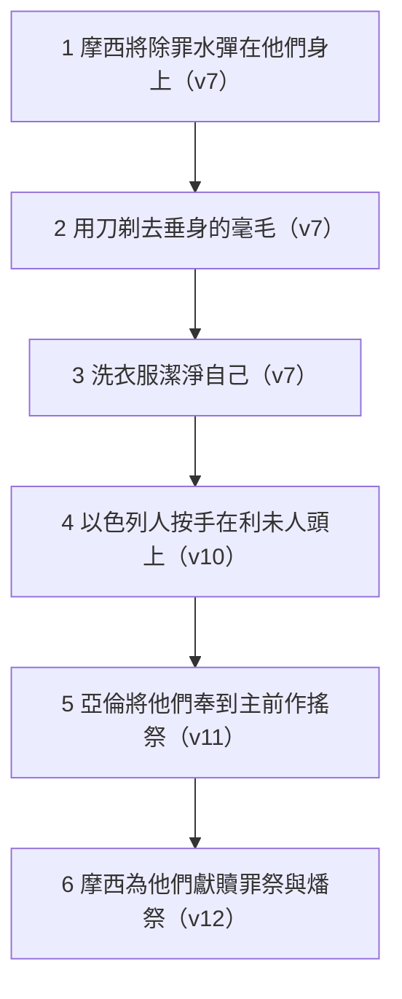

# 民數記 第8章

<!-- chapter-navigation:start -->
| [前一章](../04%20民數記/第7章.md) | [回目錄](../04%20民數記/全書目錄及綱要.md) | [下一章](../04%20民數記/第9章.md) |
| :--- | :---: | ---: |
<!-- chapter-navigation:end -->

1. [[耶和華]]曉諭[[摩西]]說：
2. 你告訴[[亞倫]]說：點燈的時候，七盞燈都要向[[金燈臺|燈臺]]前面發光。
3. [[亞倫]]便這樣行。他點[[金燈臺|燈臺]]上的燈，使燈向前發光，是照[[耶和華]]所吩咐[[摩西]]的。
4. 這[[金燈臺|燈臺]]的做法是用金子錘出來的，連座帶花都是錘出來的。[[摩西]]製造燈臺，是照[[耶和華]]所指示的樣式。
5. [[耶和華]]曉諭[[摩西]]說：
6. 你從[[以色列|以色列人]]中選出[[利未支派|利未人]]來，[[潔淨]]他們。
7. [[潔淨]]他們當這樣行：用[[除罪水]]彈在他們身上，又叫他們用[[剃頭刀]]刮全身，洗衣服，[[潔淨|潔淨自己]]。
8. 然後叫他們取一隻公牛犢，並同獻的[[素祭（minchah）|素祭]]，就是調油的細麵；你要另取一隻公牛犢作[[贖罪祭]]。
9. 將[[利未支派|利未人]]奉到[[會幕（帳幕整體）|會幕]]前，招聚[[以色列]]全會眾。
10. 將[[利未支派|利未人]]奉到[[耶和華]]面前，[[以色列|以色列人]]要[[按手]]在他們頭上。
11. [[亞倫]]也將他們奉到[[耶和華]]面前，為[[以色列|以色列人]]當作[[搖祭]]，使他們好辦耶和華的事。
12. [[利未支派|利未人]]要[[按手]]在那兩隻牛的頭上；你要將一隻作[[贖罪祭]]，一隻作[[燔祭]]，獻給[[耶和華]]，為利未人贖罪。
13. 你也要使[[利未支派|利未人]]站在[[亞倫]]和他兒子面前，將他們當作[[搖祭]]奉給[[耶和華]]。
14. 這樣，你從[[以色列|以色列人]]中將[[利未支派|利未人]]分別出來，利未人便要歸我。
15. 此後[[利未支派|利未人]]要進去辦[[會幕（帳幕整體）|會幕]]的事，你要[[潔淨]]他們，將他們當作[[搖祭]]奉上；
16. 因為他們是從[[以色列|以色列人]]中全然給我的，我揀選他們歸我，是代替以色列人中一切頭生的。
17. [[以色列|以色列人]]中一切頭生的，連人帶牲畜，都是我的。我在[[埃及地]]擊殺一切頭生的那天，將他們分別為聖歸我。
18. 我揀選[[利未支派|利未人]]代替[[以色列|以色列人]]中一切頭生的。
19. 我從[[以色列|以色列人]]中將[[利未支派|利未人]]當作賞賜給[[亞倫]]和他的兒子，在[[會幕（帳幕整體）|會幕]]中辦以色列人的事，又為以色列人贖罪，免得他們挨近[[聖所]]，有災殃臨到他們中間。
20. [[摩西]]、[[亞倫]]，並[[以色列]]全會眾便向[[利未支派|利未人]]如此行。凡[[耶和華]]指著利未人所吩咐摩西的，[[以色列|以色列人]]就向他們這樣行。
21. 於是[[利未支派|利未人]][[潔淨|潔淨自己]]，除了罪，洗了衣服；[[亞倫]]將他們當作[[搖祭]]奉到[[耶和華]]面前，又為他們贖罪，潔淨他們。
22. 然後[[利未支派|利未人]]進去，在[[亞倫]]和他兒子面前，在[[會幕（帳幕整體）|會幕]]中辦事。[[耶和華]]指著利未人怎樣吩咐[[摩西]]，[[以色列|以色列人]]就怎樣向他們行了。
23. [[耶和華]]曉諭[[摩西]]說：
24. [[利未支派|利未人]]是這樣：從二十五歲以外，他們要前來任職，辦[[會幕（帳幕整體）|會幕]]的事。
25. 到了五十歲要停工退任，不再辦事，
26. 只要在[[會幕（帳幕整體）|會幕]]裡，和他們的弟兄一同伺候，謹守所吩咐的，不再辦事了。至於所吩咐[[利未支派|利未人]]的，你要這樣向他們行。

---

## 本章知識節點

### 人物
- [[摩西]]
- [[亞倫]]
- [[以色列]]
- [[利未支派]]

### 地點
- [[埃及地]]
- [[聖所]]

### 主題
- [[金燈臺]]
- [[剃頭刀]]
- [[除罪水]]
- [[會幕（帳幕整體）]]
- [[利未人受職與祭司受職的差別]]
- [[三十歲直到五十歲（利未人任職年齡）]]

### 神學
- [[贖罪祭]]
- [[潔淨]]
- [[耶和華]]

### 原文
- [[素祭（minchah）]]
- [[燔祭]]
- [[搖祭]]
- [[按手]]

### 解經爭議
- [[利未人任職年齡的差異]]

---

## 本章整理

### 燈要照向哪裡（v1-4）

上一章結束在摩西進會幕聽神說話，本章開頭就接著講燈。KC 認為這個接續不是偶然：「這段燈臺的描寫並不是不小心散落到這裡來的」，因為在曠野行路需要神的話，而看見神的話需要光。

神吩咐[[亞倫]]：「點燈的時候，七盞燈都要向燈臺前面發光」（v2）。==問題是「前面」是哪一面。== CT 給的答案很具體：燈臺兩旁各三盞燈的燈光照向中央，中間幹枝上的燈盞則向前發光，也就是照向北面，「使祭司能看見陳設餅的桌子」。GT 丁良才說得更短：「就是向北面有陳設餅的地方。」

這一照就有了意思。GT《啟導本》：陳設餅共有十二個，代表以色列十二支派，「而光是生命的象徵。燈光總是照著陳設餅，等於說神的子民應經常生活在祂面前，享受祂的祝福」。GT《民數記串珠聖經註釋》補上責任歸屬：聖所中祭壇的火和燈檯的火要永遠點著，這分別是祭司（利6:12）和大祭司（利24:2-3）的責任。

KC 讀的方向不同，值得並排看：他認為燈的光應當落在[[金燈臺|燈臺]]本身——「聖靈的光總是落在主耶穌身上」（約16:14），主耶穌是那托著七盞燈的燈臺，信徒是燈。GT《聖經精讀本》則把七盞燈讀為聖靈完全的工作（啟4:5）。

CT 另補一個技術細節與一個猶太傳統：燈臺是「用一塊精金接連在一起錘出來的」（出25:31），而 GT 丁良才記下點燈的方式——「按猶太人的遺傳說，點燈的火，是從祭壇上取來的，先點當中的那一盞，其餘的燈，是從這一盞引著的」。GT《舊約聖經背景註釋》另指出這種軸心兩旁各三個分叉的設計，「在地中海一帶晚銅器時代的文化中頗為常見」。

### 事奉之前要先過六道手續（v5-15）

神吩咐把[[利未支派|利未人]]從以色列人中選出來，[[潔淨]]他們。GT 丁良才把整套程序列成六步：

```mermaid
flowchart TD
    A["1 摩西將除罪水彈在他們身上（v7）"] --> B["2 用刀剃去垂身的毫毛（v7）"]
    B --> C["3 洗衣服潔淨自己（v7）"]
    C --> D["4 以色列人按手在利未人頭上（v10）"]
    D --> E["5 亞倫將他們奉到主前作搖祭（v11）"]
    E --> F["6 摩西為他們獻贖罪祭與燔祭（v12）"]
```

第一道是[[除罪水]]。CT 指出這個詞「全部聖經僅此一次提到這詞」，並列了兩種推測——民19:9 的除污穢水，或洗濯盆裡的水。四套來源在這一點上並沒有共識：GT《啟導本》說「很可能是後者」，GT《聖經精讀本》與 BH 則明確傾向紅母牛灰調成的水。KC 強調的是動作本身：潔淨「不在於洗滌，而在於灑」，而灑是把所灑之物的價值轉移到被灑的人身上。

第二道是[[剃頭刀]]刮全身。GT《聖經精讀本》給的理由很實際——「為了除去用水也洗不乾淨的部分」（利14:8-9）。GT《舊約聖經背景註釋》提供了外部對照：「埃及祭司的淨化步驟，亦有剃盡頭上和身上毛髮的要求」，並描述當時的青銅剃刀有兩種設計。KC 讀剃刀為「加在肉體之上的審判」，並舉驕傲為例。

**接下來是兩次[[按手]]，方向相反。** GT《啟導本》把這一點講得最清楚：「先是以色列人按手在利未人的頭上，然後是利未人按手在牛的頭上（12節）。這兩個儀式的意義是很明顯的。第一次按手是利未人替代以色列人的長子獻給神贖罪；但人不可以當作祭物獻上，故要用牛來替代利未人。」

| 次序 | 誰按在誰身上 | 表示什麼 |
|---|---|---|
| 第一次（v10） | 以色列人按在利未人頭上 | 全會眾把獻頭生男子的責任歸於利未人（GT 丁良才） |
| 第二次（v12） | 利未人按在兩隻公牛頭上 | 人不可以當作祭物獻上，故用牛替代利未人（GT《啟導本》） |

CT 從第一次按手讀出合一：「利未人接受了以色列人的按手，利未人和以色列人就聯合成為一個整體，利未人事奉神，就不是只是利未人的事奉，也是全以色列人的事奉。」

然後亞倫把利未人「當作[[搖祭]]」奉到耶和華面前（v11）。GT《民數記串珠聖經註釋》為這個安排下了一句重話：==「這是舊約聖經中唯一奉獻人為祭物的例子」==，並說明「所謂『當作搖祭』是比喻的語法」。GT《舊約聖經背景註釋》另提到翻譯上的意見：搖祭「『升祭』是更佳的翻譯」。

至於為什麼利未人要獻[[贖罪祭]]，CT 的界定很重要：這隻公牛犢「並非為他們所犯的罪行贖罪，而是為他們生命中原有的罪性」。KC 的說法方向一致——這場儀式「不是罪人悔改歸主的圖畫，而是使信徒被造就成合乎神心意去事奉祂的樣子」，並歸出一條次序：「我們必須先把自己給主，然後才把我們的服事給祂」（林後8:5）。

利未人的就職與祭司的就職差在哪裡，見[[利未人受職與祭司受職的差別]]。

### 代替頭生的，賞賜給祭司（v16-22）

神說明利未人的來歷：「我揀選他們歸我，是代替以色列人中一切頭生的」（v16），而頭生的之所以歸神，是因為「我在[[埃及地]]擊殺一切頭生的那天，將他們分別為聖歸我」（v17）。CT 指出「頭生的」代表最好的——「力量強壯的時候生的，本當大有尊榮，權力超眾」（創49:3）。

第19節加上一個常被略過的功能：利未人「又為[[以色列|以色列人]]贖罪，免得他們挨近[[聖所]]，有災殃臨到他們中間」。CT 說明這裡的「贖罪」不是指獻贖罪祭，而是指利未人作為以色列人的代替。GT 丁良才給了很實際的理由：若讓以色列各家的子孫辦理[[會幕（帳幕整體）|會幕]]中的事，「就難免沒有錯誤，干犯神的震怒，因為他們不熟悉神所吩咐的一切條規」，而利未人「自幼就學習會幕中侍奉神的規矩」；所以神揀選利未人「乃是出於憐憫的心」。他同時提醒這不是保險：「但祭司和利未人有時也不小心，或不恭敬，以致受了神的刑罰。」

GT《舊約聖經背景註釋》從古代近東的比較給「贖罪」下了一個較窄的界定：本段並無獻祭之事，「有的只是祭禮的象徵」；利未人「只是提供贖價，保護以色列人免受神的忿怒而已」，而這種平息神明怒氣的做法在巴比倫與赫人的儀式中十分普遍。

KC 注意到一個往返：第11節亞倫把利未人獻給耶和華，第19節神又把他們賜回給亞倫和他的兒子——「神從不欠人的債。我們絕不可能給祂什麼，是祂不會加倍還回來的。」

### 二十五歲進場，五十歲退場（v23-26）

本章最後給了事奉的起訖，而起點的數字和前面對不上：這裡說二十五歲，民數記4:3、23、30 說三十歲。見[[利未人任職年齡的差異]]。CT 的解法是「大概是指五年的見習階段，等滿三十歲才正式任職」；GT 丁良才的說法一致；GT《聖經精讀本》另指出歷代志上23:24 又把年限降到二十歲。KC 用保羅作例子說明預備期的必要：他歸主後立刻在會堂裡傳講耶穌（徒9:20），之後往阿拉伯去（加1:17），再到安提阿作教師（徒11:25-26），最後才被聖靈分派（徒13:2-3）——「匆忙衝進為主的事奉裡並不好」。

退場的規定見[[三十歲直到五十歲（利未人任職年齡）]]。五十歲以後不再辦事，但仍要「在會幕裡，和他們的弟兄一同伺候，謹守所吩咐的」（v26）。GT《民數記串珠聖經註釋》把這句話譯得更直接：可作「幫助他們的弟兄謹守責任」，並下結論說「利未人的獻身事奉是終身盡忠職守的」。

CT 對這一段有一句很有分量的話：「真實的事奉是退而不休的，因為事奉不是只有事務上的服事，也有生命上的服事。」KC 從實務面說同一件事：僕人不該以為自己不可或缺，工作是主的工作；即使實際的服事停止了，「他們並沒有被丟棄」，仍有支持性的任務——把必要的裝備交給年輕人（提後2:2）。BH 也指出五十歲的界線同時保全了利未人的尊嚴與體力，並讓年長者轉入教導與陪伴的角色。

### 原文層：兩個字撐起「潔淨」與「任職」

STEP語言資料在本章給出三組可以逐字查證的結果。

**第一組在第7節的「潔淨」。** 同一個字根在一節裡出現兩次，形態相反：

| 位置 | 字形 | Strong | 形態 | 語境譯義 |
|---|---|---|---|---|
| 節首 | le./ta.ha.Ra/m | H2891（ta.her） | Piel 不定詞 | 去潔淨他們 |
| 節末 | ve./hi.te.Ha.ru | H2891（ta.her） | Hithpael | 他們要潔淨自己 |

先是別人潔淨他們，然後是他們潔淨自己——兩個動作在同一節裡。

**第二組也在第7節，關於「除罪水」。** 原文是兩個字：mei（H4325G，ma.yim，water）配上 cha.Tat（H2403I，chat.tat），STEP 給的語境譯義是 sin offering。==字面就是「chat.tat 的水」。== 而 H2403 在本章總共只出現三次，另外兩次在第8節與第12節，和合本正是譯作「贖罪祭」。這一層語言事實正落在 CT 所列兩種推測的分歧點上，也解釋了 GT《聖經精讀本》為何主張它是紅母牛灰調成的水——民19:9 的水本來就是焚燒贖罪祭紅母牛的灰調成的。

**第三組在第24至25節，印證了 CT 的原文字義註記。** CT 在第24節註「任職（原文雙字）」，並給了「服事，發動戰爭（首字）；供職，戰爭（次字）」；在第25節註「停工退任（原文雙字）」，給了「返回，轉回（首字）；供職，戰爭（次字）」。STEP 的比對結果完全相符：

- v24 「任職」＝ li/tz.Vo'（H6633，tsa.va，to serve）＋ tza.Va'（H6635I，tsa.va，army: duty）
- v25 「停工退任」＝ ya.Shuv（H7725J，shuv，to return）＋ mi./tze.Va'（H6635I）

兩處都是雙字，而且共用同一個 tsa.va，其詞典義域確實涵蓋軍旅與服役。同章的「辦事」則是另一個字：a.vo.dah（H5656H，service: ministry）與 a.vad（H5647H，to serve: minister）。所以五十歲退的是那個帶軍旅意味的 tsa.va，而不是整個人離開會幕。

**參考資料**
https://www.ccbiblestudy.org/Old%20Testament/04Num/04CT08.htm
https://www.ccbiblestudy.org/Old%20Testament/04Num/04GT08.htm
https://www.kingcomments.com/en/bible-studies/Num/8
https://biblehub.com/study/numbers/8.htm
https://github.com/STEPBible/STEPBible-Data

<!-- chapter-navigation:start -->
| [前一章](../04%20民數記/第7章.md) | [回目錄](../04%20民數記/全書目錄及綱要.md) | [下一章](../04%20民數記/第9章.md) |
| :--- | :---: | ---: |
<!-- chapter-navigation:end -->
