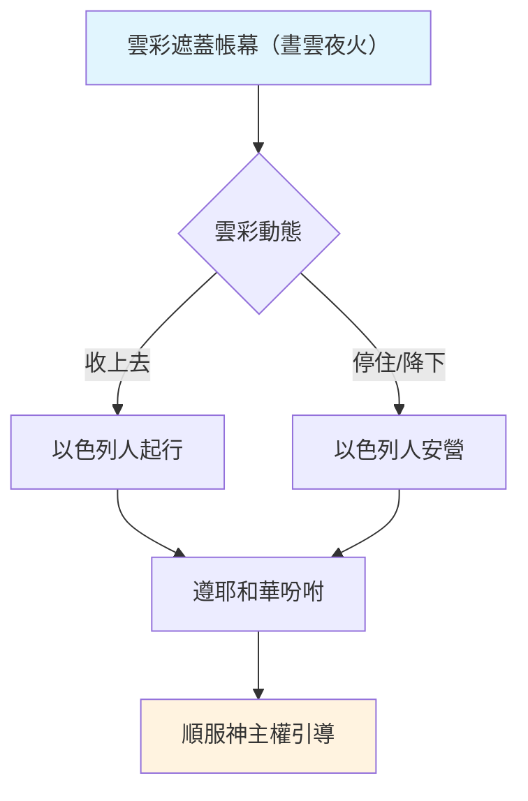

# 民數記 第9章

1. 以色列人出埃及地以後，第二年正月，耶和華在[[西乃的曠野]]吩咐摩西說：
2. 以色列人應當在所定的日期[[守（shamar）|守]]逾越節，
3. 就是本月十四日[[猶太曆法黃昏算日|黃昏]]的時候，你們要在所定的日期[[守（shamar）|守]]這節，要按這節的律例典章而守。
4. 於是摩西吩咐以色列人[[守（shamar）|守]]逾越節。
5. 他們就在[[西乃的曠野]]，正月十四日[[猶太曆法黃昏算日|黃昏]]的時候，[[守（shamar）|守]]逾越節。凡耶和華所吩咐摩西的，以色列人都照樣行了。
6. [[米沙利、以利撒反|有幾個人]]因死屍而[[不潔淨（tame）|不潔淨]]，不能在那日[[守（shamar）|守]]逾越節。當日他們到摩西、亞倫面前，
7. 說：我們雖因死屍而[[不潔淨（tame）|不潔淨]]，為何被阻止、不得同以色列人在所定的日期獻耶和華的供物呢？
8. 摩西對他們說：你們暫且等候，我可以去聽耶和華指著你們是怎樣吩咐的。
9. 耶和華對摩西說：
10. 你曉諭以色列人說：你們和你們後代中，若有人因死屍而[[不潔淨（tame）|不潔淨]]，或[[遠方行路延後守節|在遠方行路]]，還要向耶和華[[守（shamar）|守]]逾越節。
11. 他們要在二月十四日[[猶太曆法黃昏算日|黃昏]]的時候，[[守（shamar）|守]]逾越節。要用無酵餅與苦菜，和逾越節的羊羔同吃。
12. 一點不可留到早晨；[[逾越節羔羊骨頭不可折斷|羊羔的骨頭]]一根也不可折斷。他們要照逾越節的一切律例而[[守（shamar）|守]]。
13. 那潔淨而不行路的人若推辭不[[守（shamar）|守]]逾越節，那人要從民中剪除；因為他在所定的日期不獻耶和華的供物，應該擔當他的罪。
14. 若有外人寄居在你們中間，願意向耶和華[[守（shamar）|守]]逾越節，他要照逾越節的律例典章行，不管是[[外人守逾越節同歸一例|寄居的是本地人]]，同歸一例。
15. 立起[[法櫃的帳幕（見證的帳幕）|帳幕]]的那日，有雲彩遮蓋帳幕，就是法櫃的帳幕；[[雲彩停留長短不定（兩天一月一年）|從晚上到早晨]]，雲彩在其上，形狀如火。
16. [[晝夜雲彩不斷|常是這樣]]，雲彩遮蓋[[法櫃的帳幕（見證的帳幕）|帳幕]]，[[晝夜雲彩不斷|夜間形狀如火]]。
17. 雲彩幾時從[[法櫃的帳幕（見證的帳幕）|帳幕]][[雲彩收上去起行|收上去]]，以色列人就幾時[[雲彩收上去起行|起行]]；雲彩在哪裡停住，以色列人就在那裡[[雲彩停住安營|安營]]。
18. 以色列人[[遵雲彩起行安營|遵耶和華的吩咐起行]]，也[[遵雲彩起行安營|遵耶和華的吩咐安營]]。[[雲彩停住安營|雲彩在帳幕上停住]]幾時，他們就住營幾時。
19. 雲彩在[[法櫃的帳幕（見證的帳幕）|帳幕]]上[[雲彩停留長短不定（兩天一月一年）|停留許多日子]]，以色列人就[[守（shamar）|守]]耶和華所吩咐的不[[雲彩收上去起行|起行]]。
20. 有時雲彩在[[法櫃的帳幕（見證的帳幕）|帳幕]]上[[雲彩停留長短不定（兩天一月一年）|幾天]]，他們就照耶和華的吩咐住營，也照耶和華的吩咐[[雲彩收上去起行|起行]]。
21. 有時[[雲彩停留長短不定（兩天一月一年）|從晚上到早晨]]，有這雲彩在[[法櫃的帳幕（見證的帳幕）|帳幕]]上；早晨[[雲彩收上去起行|雲彩收上去]]，他們就[[雲彩收上去起行|起行]]。有時[[雲彩停留長短不定（兩天一月一年）|晝夜]]雲彩停在帳幕上，收上去的時候，他們就起行。
22. 雲彩停留在[[法櫃的帳幕（見證的帳幕）|帳幕]]上，無論是[[雲彩停留長短不定（兩天一月一年）|兩天]]，是[[雲彩停留長短不定（兩天一月一年）|一月]]，是[[雲彩停留長短不定（兩天一月一年）|一年]]，以色列人就住營不[[雲彩收上去起行|起行]]；但[[雲彩收上去起行|雲彩收上去]]，他們就起行。
23. 他們[[遵雲彩起行安營|遵耶和華的吩咐安營]]，也[[遵雲彩起行安營|遵耶和華的吩咐起行]]。他們[[守（shamar）|守]]耶和華所吩咐的，都是[[順服神的主權引導|憑耶和華吩咐摩西的]]。

<!-- fhl-map-links:start -->
## 相關地圖

- [[appendix/fhl_maps/maps/019|〈出圖二〉以色列人出埃及到西乃山]]
- [[appendix/fhl_maps/maps/020|〈民圖一〉從西乃山到加低斯]]
<!-- fhl-map-links:end -->

---

## 本章知識節點

### 神學
- [[逾越節第二年首次守節]]
- [[神的恩典供應補救條例]]
- [[順服神的主權引導]]
- [[雲彩遮蓋帳幕（民9：15-23）]]
- [[會幕雲光（出40：34-38）]]
- [[雲柱火柱引導（出13：21-22）]]

### 原文
- [[守（shamar）]]
- [[不潔淨（tame）]]

### 制度與條例
- [[補守逾越節條例]]
- [[因死屍不潔延後守節]]
- [[遠方行路延後守節]]
- [[外人守逾越節同歸一例]]
- [[外人守逾越節（出12：48-49）]]
- [[逾越節羔羊骨頭不可折斷]]
- [[死屍不潔條例（民19：11-13）]]

### 預表與應驗
- [[基督預表（逾越節羔羊）]]
- [[希西家守二月逾越節（代下三十）]]

### 歷史與地理
- [[西乃的曠野]]
- [[法櫃的帳幕（見證的帳幕）]]
- [[帳幕立起之日雲彩遮蓋]]
- [[第二年正月初一立帳幕]]
- [[猶太曆法黃昏算日]]
- [[民9：22「一年」是否指加低斯住營一年]]

### 研讀議題
- [[三位祭司能否宰殺所有逾越節羊羔]]
- [[逾越節與無酵節重疊]]

### 行動模式
- [[雲彩收上去起行]]
- [[雲彩停住安營]]
- [[雲彩停留長短不定（兩天一月一年）]]
- [[遵雲彩起行安營]]
- [[晝夜雲彩不斷]]

---

## 本章整理

### 首次守逾越節與補救條例（v1-14）
以色列人出埃及後**第二年正月**在**[[西乃的曠野|西乃曠野]]**，照耶和華吩咐在**十四日黃昏**（[[猶太曆法黃昏算日|日落算日]]）守**[[逾越節第二年首次守節|首次曠野逾越節]]**（v1-5）。然而，有數人因觸**[[不潔淨（tame）|死屍而不潔淨]]**（[[死屍不潔條例（民19：11-13）|參民19條例]]）無法按期獻供，他們向摩西、亞倫陳情：「為何被阻止？」（v6-7）。摩西求問耶和華，神頒布**[[補守逾越節條例|補救條例]]**：因**[[因死屍不潔延後守節|不潔]]**或**[[遠方行路延後守節|在遠方行路]]**者，可在**二月十四日黃昏**守逾越節（v9-11）。此節仍須遵守核心律例：吃羔羊配**無酵餅與苦菜**、**不可留到早晨**、**羔羊骨頭一根不可折斷**（[[逾越節羔羊骨頭不可折斷|預表基督骨頭不被折斷]]；[[基督預表（逾越節羔羊）|林前5:7]]）。若潔淨不在路卻推辭不守，必**從民中剪除**（v13）。**[[外人守逾越節同歸一例|寄居外人]]**願守節，同歸一例（v14；[[外人守逾越節（出12：48-49）|出12:48-49]]）。這條例後來在**[[希西家守二月逾越節（代下三十）|希西家時代]]**再次被啟用，也預表**[[逾越節與主餐（林前5：7-8, 11：24-25）|主餐]]**的恩典邀請。

| 比較項目 | 正月逾越節（v1-5） | 二月逾越節（v9-12） |
| --- | --- | --- |
| **日期** | 正月十四日黃昏 | 二月十四日黃昏 |
| **對象** | 全會眾 | 不潔者、遠行者 |
| **除酵** | 七日除酵（出12:15） | 僅當日吃無酵餅（經文未提七日除酵） |
| **核心律例** | 羔羊、無酵餅、苦菜、骨頭不折、不可留至晨 | 同正月逾越節核心律例 |
| **預表意義** | 基督作逾越節羔羊一次獻上 | 恩典給「錯過」者第二次機會 |

> [!note] 關於二月逾越節的除酵規定
> 經文僅提「要用無酵餅與苦菜，和逾越節的羊羔同吃」（v11），未重複「七日吃無酵餅」的命令。猶太傳統（如密西拿 Pesachim 9:3）多認為二月逾越節**只有一天**，不需除酵七日，這顯示神的恩典在補救條例上簡化了禮儀負擔，卻保留了核心預表（羔羊、骨頭不折）。

### 雲彩遮蓋與以色列人起行安營（v15-23）
**[[帳幕立起之日雲彩遮蓋|立帳幕之日]]**（[[第二年正月初一立帳幕|出40:17]]），**[[法櫃的帳幕（見證的帳幕）|見證的帳幕]]**被雲彩遮蓋，夜間狀如火（**[[晝夜雲彩不斷|晝夜不斷]]**；[[會幕雲光（出40：34-38）|出40:34-38]]、[[雲柱火柱引導（出13：21-22）|出13:21-22]]）。雲彩**[[雲彩收上去起行|收上去]]**→百姓**起行**；雲彩**[[雲彩停住安營|停住]]**→百姓**安營**（v17）。**[[雲彩停留長短不定（兩天一月一年）|停留長短不定]]**——或兩天、一月、一年（**[[民9：22「一年」是否指加低斯住營一年|或指加低斯巴尼亞長期駐營]]**），以色列人**[[遵雲彩起行安營|全憑耶和華吩咐]]**起行安營（v18-22），絕對**[[順服神的主權引導|順服神的主權引導]]**（v23）。

> [!important] 本章樞紐
> **「遵耶和華的吩咐起行，也遵耶和華的吩咐安營」**（v23）貫穿全章：前半段守節**[[守（shamar）|謹守]]**神的**定期**（moed），後半段行程**聽從**神的**帶領**（雲彩）。禮儀與生活同歸於**順服**一個中心。

> [!question] 經文未明說的細節
> 1. **[[三位祭司能否宰殺所有逾越節羊羔|三位祭司能否宰殺所有逾越節羊羔]]**：當時僅有亞倫、以利撒反、以他瑪三位祭司（拿答、亞比戶已死），若全會眾同時宰羊，人力極緊；或許採分批、或利未人協助宰殺（代殺、祭司灑血）。
> 2. **[[民9：22「一年」是否指加低斯住營一年|民9:22「一年」]]**：是否指後來在加低斯巴尼亞停留的三十八年中的第一年？經文未明確對應，僅作為「長短不定」的極端例證。

### 跨章脈絡：禮儀與引導的雙重順服
本章呈現曠野生活的兩大支柱：**定期的禮儀**（逾越節）與**不定期的引導**（雲彩）。前者要求百姓在神設定的**時間**裡[[守（shamar）|謹守]]條例，神甚至提供**[[補守逾越節條例|補救條例]]**讓不潔、遠行者不至失落恩典；後者要求百姓在神未設定的**時間**裡，隨時預備跟隨雲彩動靜。兩者共同塑造「順服」的群體身分——不僅在聖所前，更在曠野路上。這雙重順服預表新約信徒：定期記念**[[逾越節與主餐（林前5：7-8, 11：24-25）|主餐]]**宣告主死，日常靠**聖靈引導**（羅8:14）行事為人，同樣是「遵主吩咐起行，遵主吩咐安營」。

**參考資料**
https://www.ccbiblestudy.org/Old%20Testament/04Num/04CT09.htm
https://www.ccbiblestudy.org/Old%20Testament/04Num/04GT09.htm
https://www.kingcomments.com/en/bible-studies/Num/9
https://biblehub.com/study/numbers/9.htm
