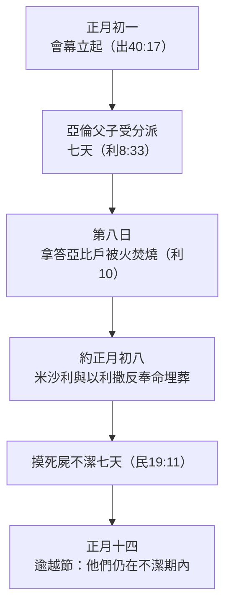
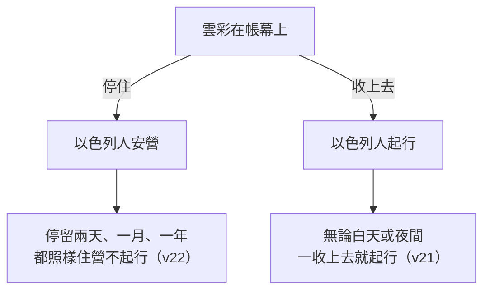

# 民數記 第9章

<!-- chapter-navigation:start -->
| [前一章](../04%20民數記/第8章.md) | [回目錄](../04%20民數記/全書目錄及綱要.md) | [下一章](../04%20民數記/第10章.md) |
| :--- | :---: | ---: |
<!-- chapter-navigation:end -->

1. 以色列人出埃及地以後，第二年正月，耶和華在[[西乃的曠野]]吩咐[[摩西]]說：
2. 以色列人應當在所定的日期守[[逾越節]]，
3. 就是本月十四日黃昏的時候，你們要在所定的日期守這節，要按這節的律例典章而守。
4. 於是[[摩西]]吩咐以色列人守[[逾越節]]。
5. 他們就在[[西乃的曠野]]，正月十四日黃昏的時候，守[[逾越節]]。凡耶和華所吩咐[[摩西]]的，以色列人都照樣行了。
6. 有幾個人因死屍而不潔淨，不能在那日守[[逾越節]]。當日他們到[[摩西]]、[[亞倫]]面前，
7. 說：我們雖因死屍而不潔淨，為何被阻止、不得同以色列人在所定的日期獻耶和華的供物呢？
8. [[摩西]]對他們說：你們暫且等候，我可以去聽耶和華指著你們是怎樣吩咐的。
9. 耶和華對[[摩西]]說：
10. 你曉諭以色列人說：你們和你們後代中，若有人因死屍而不潔淨，或在[[遠方行路]]，還要向耶和華守[[逾越節]]。
11. 他們要在二月十四日黃昏的時候，守[[逾越節]]。要用[[無酵餅]]與[[苦菜]]，和逾越節的[[逾越節羔羊|羊羔]]同吃。
12. 一點不可留到早晨；[[逾越節羔羊|羊羔]]的骨頭一根也不可折斷。他們要照[[逾越節]]的一切律例而守。
13. 那潔淨而不行路的人若推辭不守[[逾越節]]，那人要從民中[[剪除]]；因為他在所定的日期不獻耶和華的供物，應該擔當他的罪。
14. 若有[[寄居的與本地人同歸一例|外人]][[寄居的與本地人同歸一例|寄居]]在你們中間，願意向耶和華守[[逾越節]]，他要照逾越節的律例典章行，不管是[[寄居的與本地人同歸一例|寄居的]]是本地人，同歸一例。
15. 立起[[會幕（帳幕整體）|帳幕]]的那日，有[[雲柱火柱|雲彩]]遮蓋帳幕，就是[[法櫃的帳幕]]；從晚上到早晨，雲彩在其上，形狀如[[雲柱火柱|火]]。
16. 常是這樣，[[雲柱火柱|雲彩]]遮蓋[[會幕（帳幕整體）|帳幕]]，夜間形狀如[[雲柱火柱|火]]。
17. [[雲柱火柱|雲彩]]幾時從[[會幕（帳幕整體）|帳幕]]收上去，以色列人就幾時[[雲柱火柱|起行]]；雲彩在哪裡停住，以色列人就在那裡[[雲柱火柱|安營]]。
18. 以色列人遵耶和華的吩咐[[雲柱火柱|起行]]，也遵耶和華的吩咐[[雲柱火柱|安營]]。[[雲柱火柱|雲彩]]在[[會幕（帳幕整體）|帳幕]]上停住幾時，他們就[[雲柱火柱|住營]]幾時。
19. [[雲柱火柱|雲彩]]在[[會幕（帳幕整體）|帳幕]]上停留許多日子，以色列人就守耶和華所吩咐的不[[雲柱火柱|起行]]。
20. 有時[[雲柱火柱|雲彩]]在[[會幕（帳幕整體）|帳幕]]上幾天，他們就照耶和華的吩咐[[雲柱火柱|住營]]，也照耶和華的吩咐[[雲柱火柱|起行]]。
21. 有時從晚上到早晨，有這[[雲柱火柱|雲彩]]在[[會幕（帳幕整體）|帳幕]]上；早晨[[雲柱火柱|雲彩收上去]]，他們就[[雲柱火柱|起行]]。有時晝夜雲彩停在帳幕上，收上去的時候，他們就起行。
22. [[雲柱火柱|雲彩]]停留在[[會幕（帳幕整體）|帳幕]]上，無論是兩天，是一月，是一年，以色列人就[[雲柱火柱|住營]]不[[雲柱火柱|起行]]；但[[雲柱火柱|雲彩收上去]]，他們就起行。
23. 他們遵耶和華的吩咐[[雲柱火柱|安營]]，也遵耶和華的吩咐[[雲柱火柱|起行]]。他們守耶和華所吩咐的，都是憑耶和華吩咐[[摩西]]的。

---

## 本章知識節點

### 人物
- [[摩西]]
- [[亞倫]]

### 歷史
- [[逾越節]]
- [[逾越節羔羊]]
- [[補行逾越節]]
- [[雲柱火柱]]

### 地點
- [[西乃的曠野]]
- [[法櫃的帳幕]]

### 主題
- [[寄居的與本地人同歸一例]]
- [[會幕（帳幕整體）]]

### 原文
- [[無酵餅]]
- [[苦菜]]
- [[剪除]]

### 神學
- [[死屍不潔]]

### 文化
- [[遠方行路]]

### 互文
- [[希西家守二月逾越節（代下三十）|代下30 希西家照本章的規矩把逾越節挪到二月]]

### 解經爭議
- [[三位祭司能否宰殺所有逾越節羊羔]]

---

## 本章整理

### 出埃及後的第一個逾越節（v1-5）

時間是出埃及後第二年正月，地點在[[西乃的曠野]]。CT 指出這是「立起會幕的那一月（參出40:2），但在數點人數之前（參民1:1）」——換句話說，本章又是一段往回敘的插入。

這是以色列人出埃及以後守的第一個[[逾越節]]。KC 補上一個常被略過的統計：全本聖經只有七次真正記下逾越節被守的紀錄——出12:11、民9:5、書5:10、代下30:15、代下35:1、拉6:19、路22:15。他把這件事與今天對照：==「這使人想起在基督教裡守主的記念之餐的次數是何等稀少。」==

**幾個常被問的實務問題，GT 丁良才都處理過：**

| 問題 | 他給的答案 |
|---|---|
| 曠野哪來這麼多羊羔？ | 三層解法：綿羊山羊羔都可用（出12:5）；可從曠野遊牧之民購買；不久就要起行，所以越發願意宰殺自己群中的羊羔 |
| 三位祭司宰得完那麼多羊嗎？ | 兩個解法：本次的禮節與後來不同，家長可能早已在別處宰羊羔；或另有利未人與祭司幫忙（出24:5、代下30:16、35:11）。見[[三位祭司能否宰殺所有逾越節羊羔]] |
| 有沒有一併守除酵節？ | 「聖書上沒有提到以色列人當時守了除酵節（參出12:18），或是因為他們不能得夠那麼多的面，使百姓吃七天的無酵餅」 |

「黃昏的時候」是幾點，各家都作了說明。CT 指出按猶太曆法「從下午六時日落到次日下午六時日落算為一天」，因此正月十四日黃昏「應當算是正月十五日」；GT《聖經精讀本》的說法相同。GT《民數記串珠聖經註釋》另補上後期的做法：「到新約時代，猶太人約在下午三時開始宰殺逾越節的羔羊。」

### 有幾個人守不成，於是有了第二次機會（v6-14）

有人因摸過死屍而[[死屍不潔|不潔淨]]，趕不上正月十四日。GT 丁良才把這幾個人的身分推得很具體，還原了一條時間線：

```mermaid
flowchart TD
    A["正月初一<br/>會幕立起（出40:17）"] --> B["亞倫父子受分派<br/>七天（利8:33）"]
    B --> C["第八日<br/>拿答亞比戶被火焚燒（利10）"]
    C --> D["約正月初八<br/>米沙利與以利撒反奉命埋葬"]
    D --> E["摸死屍不潔七天（民19:11）"]
    E --> F["正月十四<br/>逾越節：他們仍在不潔期內"]
```

他為這兩人的處境下了一句話：「因此他們在兩難之間：1不敢不守逾越節，因為這是神所吩咐的（出12:47）；2又不敢貿然守節，因為他們是不潔的。」CT 的推測相同，並注意到他們申訴的重點——他們成為不潔並不是自己的過錯，「是你摩西吩咐我們去摸死屍的」。

[[摩西]]沒有當場作主。CT 說他「不敢擅自作主，定意尋求神的旨意」；KC 講得更直接：「能說出自己不知道某件事、並且帶著祂必回答的信心把事情帶到神面前，這是真正的偉大。」GT《聖經精讀本》從當事人的角度補一句：「摩西所求的是神的旨意，而不是人操之過急的結論。」

神的答覆是[[補行逾越節]]——二月十四日黃昏，仍要用[[無酵餅]]與[[苦菜]]，和[[逾越節羔羊|逾越節的羊羔]]同吃，一點不可留到早晨，骨頭一根也不可折斷（v11-12）。

| 適用對象 | 出處 |
|---|---|
| 因死屍而不潔淨的人 | v10 |
| 在[[遠方行路]]的人 | v10 |
| 潔淨、又不行路，卻推辭不守的人 | v13：要從民中[[剪除]] |
| 願意守節的外人 | v14：與本地人同歸一例（見 [[寄居的與本地人同歸一例]]） |

CT 從這條特准讀出三件事：「(1)律法的局限性，律法不是完全的條例，不過是起著預表將要降世的耶穌基督的作用；(2)神不是單單講究形式的神，而是能深深理解人的內心，並根據他們所處的環境施慈悲的神；(3)比起對人的刑罰，神更願意與人和睦，願意饒恕人，是充滿慈愛的神。」

> [!important] 但這不是降低標準
> KC 在同一段特別提出相反方向的提醒：「這條規定並不表示神降低或放寬祂的標準。祂從不這樣做……正月適用的，二月一樣適用。見證的軟弱絕不該改變標準。但神確實把處境考慮進去，我們也必須如此。」他並舉[[希西家守二月逾越節（代下三十）|代下三十章希西家的逾越節]]為實例：許多人未潔淨就吃了逾越節，希西家為他們禱告，「耶和華垂聽希西家的禱告，就醫治百姓」。

GT 丁良才另澄清一個猶太傳統：「猶太人有遺傳說，第二月的逾越節只有一天，不必除酵，但這是與聖書不合。」至於第14節的外人，他與 GT《民數記串珠聖經註釋》、GT《聖經精讀本》都指同一個限制：那是已經受過割禮的外邦人（出12:48-49）。BH 則從另一面讀同一節：這預示了在基督裡「並不分猶太人、希臘人」的合一（加3:28）。

### 雲彩說走就走（v15-23）

後半章換了主題：[[會幕（帳幕整體）|帳幕]]立起來的那日，[[雲柱火柱|雲彩]]遮蓋[[法櫃的帳幕]]，「從晚上到早晨，雲彩在其上，形狀如火」（v15）。

規則簡單到不能再簡單：

```mermaid
flowchart TD
    A["雲彩在帳幕上"] -->|停住| B["以色列人安營"]
    A -->|收上去| C["以色列人起行"]
    B --> D["停留兩天、一月、一年<br/>都照樣住營不起行（v22）"]
    C --> E["無論白天或夜間<br/>一收上去就起行（v21）"]
```

這段話在第18、20、23節反覆說「遵耶和華的吩咐」。KC 數過次數：「一切都必須照著『耶和華的吩咐』（v18 兩次、v20 兩次、v23 三次），而這吩咐就表達在雲彩的移動裡。」

各家對雲彩的解讀集中在同一個方向。GT 丁良才說雲柱預表聖靈與以色列人同在，並列出三樣幫助：護庇他們、光照他們、引導他們。GT《聖經精讀本》列出四點：是以色列的引導者、表示神與以色列同在、是神救贖行為的歷史見證、彰顯了神的愛。BH 稱這朵雲為「Shekinah glory」——神榮耀可見的顯現。KC 則注意到一個常被忽略的細節：這裡的雲「其實是帳幕的遮蓋，而帳幕在這裡被稱為『法櫃的帳幕』」，所以雲所連於的是神所託付的見證。

CT 把等候這件事說得最平實：「為甚麼要住兩天，或是一年？為甚麼要停在這地方？這些問題都不必問，只要認定一件……就是神不會把我們帶到歪路上去，我們只要跟上祂就行了。」KC 從實務面說同一件事：「當我們等候神的時候，沒有時間是白費的。」CT 在章末另歸出神引導的五個特徵：日夜引導、前後引導、隨神旨引導、適宜引導、目標引導。

GT 丁良才對第22節留了一個文本上的問號，值得照錄：「有注釋家以為本段是在以色列人到加低斯以後寫的，因為他們到那時住營才有一年的功夫，也有古譯家想年字的原文，是指著長久的時候。」

### 原文層：兩個雙字詞與一個同源的巧合

STEP語言資料在本章印證了 CT 的兩處原文字義註記，並帶出一個中譯看不見的呼應。

**CT 註「停留許多（原文雙字）」與「停留（原文雙字）」，STEP 的比對結果相符：**

| 節次 | 和合本 | 原文兩個字 | CT 的原文字義 |
|---|---|---|---|
| v19 | 停留許多日子 | ha.'a.Rikh（H748，a.rakh，to prolong）＋ ra.Bim（H7227A，rav，many） | 變長（首字）；很多，大量（次字） |
| v22 | 停留 | ha.'a.Rikh（H748）＋ li/sh.Kon（H7931，sha.khan，to dwell） | 變長（首字）；定居，固定（次字） |

第22節那個「定居」的字，正是「帳幕」的同源字：==雲彩 sha.khan（停駐）在 mish.kan（H4908，帳幕）之上，動詞與名詞出自同一個字根。== 中文讀不出這層，原文裡卻是同一個聲音。

**第13節則把兩章串了起來。** 「他在所定的日期不獻耶和華的供物」——「供物」是 ka.re.Ban（H7133A，qor.ban），「獻」是 hik.Riv（H7126H，qa.rav），正是民數記第7章第3節首領獻車牛時的同一組同源字。同節「剪除」是 ve./nikh.re.Tah（H3772I，詞典形 ka.rat，詞典義 to cut: eliminate），Niphal 被動形；「應該擔當他的罪」則是 chet（H2399，sin）配 na.sa（H5375J，詞典義 to lift: guilt）。

**還有一個字同時管著時間與地點。** 第13節「所定的日期」是 be./Mo.'a.D/o（H4150G，mo.ed，詞典義 meeting: time appointed），而「會幕」在原文是 o.hel mo.ed——同一個 mo.ed。神所定的時候與神所定的相會之處，用的是同一個字。

第15節的「法櫃的帳幕」則是 le./'O.hel ha./'e.Dut（H168G＋H5715，e.dut，詞典義 testimony），字面即「見證的帳棚」，與 CT 原文字義所註的「法櫃」見證相符。

**參考資料**
https://www.ccbiblestudy.org/Old%20Testament/04Num/04CT09.htm
https://www.ccbiblestudy.org/Old%20Testament/04Num/04GT09.htm
https://www.kingcomments.com/en/bible-studies/Num/9
https://biblehub.com/study/numbers/9.htm
https://github.com/STEPBible/STEPBible-Data

<!-- appendix-links:start -->
## 附錄

### 相關地圖
- [[appendix/fhl_maps/maps/019|〈出圖二〉以色列人出埃及到西乃山]]
- [[appendix/fhl_maps/maps/020|〈民圖一〉從西乃山到加低斯]]
<!-- appendix-links:end -->

<!-- chapter-navigation:start -->
| [前一章](../04%20民數記/第8章.md) | [回目錄](../04%20民數記/全書目錄及綱要.md) | [下一章](../04%20民數記/第10章.md) |
| :--- | :---: | ---: |
<!-- chapter-navigation:end -->
