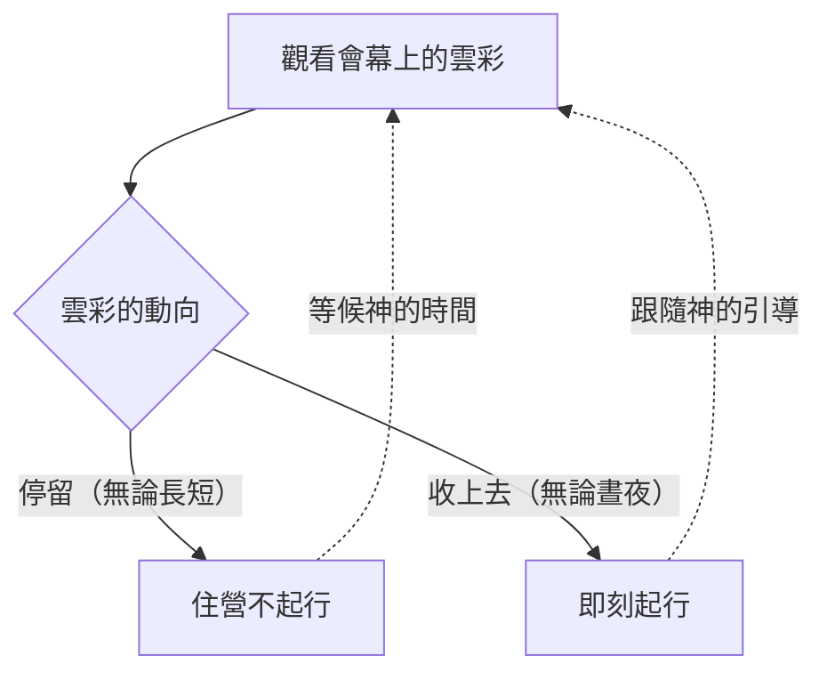

# 民數記 第9章

1. 以色列人出埃及地以後，第二年正月，耶和華在西乃的曠野吩咐摩西說：
2. 以色列人應當在所定的日期守逾越節，
3. 就是本月十四日黃昏的時候，你們要在所定的日期守這節，要按這節的律例典章而守。
4. 於是摩西吩咐以色列人守逾越節。
5. 他們就在西乃的曠野，正月十四日黃昏的時候，守逾越節。凡耶和華所吩咐摩西的，以色列人都照樣行了。
6. 有幾個人因死屍而不潔淨，不能在那日守逾越節。當日他們到摩西、亞倫面前，
7. 說：我們雖因死屍而不潔淨，為何被阻止、不得同以色列人在所定的日期獻耶和華的供物呢？
8. 摩西對他們說：你們暫且等候，我可以去聽耶和華指著你們是怎樣吩咐的。
9. 耶和華對摩西說：
10. 你曉諭以色列人說：你們和你們後代中，若有人因死屍而不潔淨，或在[[遠方行路]]，還要向耶和華守逾越節。
11. 他們要在二月十四日黃昏的時候，守逾越節。要用無酵餅與苦菜，和逾越節的羊羔同吃。
12. 一點不可留到早晨；羊羔的骨頭一根也不可折斷。他們要照逾越節的一切律例而守。
13. 那潔淨而不行路的人若推辭不守逾越節，那人要從民中剪除；因為他在所定的日期不獻耶和華的供物，應該擔當他的罪。
14. 若有外人寄居在你們中間，願意向耶和華守逾越節，他要照逾越節的律例典章行，不管是寄居的是本地人，同歸一例。
15. 立起帳幕的那日，有雲彩遮蓋帳幕，就是法櫃的帳幕；從晚上到早晨，雲彩在其上，形狀如火。
16. 常是這樣，雲彩遮蓋帳幕，夜間形狀如火。
17. 雲彩幾時從帳幕收上去，以色列人就幾時起行；雲彩在哪裡停住，以色列人就在那裡安營。
18. 以色列人遵耶和華的吩咐起行，也遵耶和華的吩咐安營。雲彩在帳幕上停住幾時，他們就住營幾時。
19. 雲彩在帳幕上停留許多日子，以色列人就守耶和華所吩咐的不起行。
20. 有時雲彩在帳幕上幾天，他們就照耶和華的吩咐住營，也照耶和華的吩咐起行。
21. 有時從晚上到早晨，有這雲彩在帳幕上；早晨[[雲彩引導行程|雲彩收上去]]，他們就起行。有時晝夜雲彩停在帳幕上，收上去的時候，他們就起行。
22. 雲彩停留在帳幕上，無論是兩天，是一月，是一年，以色列人就住營不起行；但[[雲彩引導行程|雲彩收上去]]，他們就起行。
23. 他們遵耶和華的吩咐安營，也遵耶和華的吩咐起行。他們守耶和華所吩咐的，都是憑耶和華吩咐摩西的。

---

## 本章知識節點

### 歷史
- [[補行逾越節]]

### 神學
- [[死屍不潔]]
- [[日間雲彩、夜間雲中有火]]
- [[雲彩引導行程]]

### 文化
- [[遠方行路]]

---

## 本章整理

民數記第九章記載了以色列人在西乃曠野守第二次逾越節的經歷，並設立了補行逾越節的恩典條例。隨後，經文詳細描述了神如何藉著會幕上的雲彩與火柱，具體而微地引導以色列全會眾的起行與安營，展現出神在曠野中對百姓的同在與帶領。

### 第二年正月的逾越節（v1-5）

以色列人出埃及地以後的第二年正月，耶黃華在西乃的曠野吩咐摩西，要以色列人按著所定的日期（正月十四日黃昏）守逾越節。這是以色列人在曠野中守的第一次逾越節，也是出埃及後的第二次。

這標誌著神救贖歷史中的重要時刻。逾越節不僅是記念神在埃及擊殺長子、拯救以色列人的歷史事件，更是讓屬神的百姓確認自己蒙拯救的地位與生存目的。根據《CT》的觀點，逾越節的實際是「接受蒙拯救的地位」，不守這節期就是在神的應許上無分無關了。以色列人全然遵照耶和華的吩咐行了，表明了他們對神話語的順服。

### 補行逾越節的條例（v6-14）

在守節的日子，有幾個人因為接觸死屍而帶來了儀式上的不潔淨，無法參與這場聖會。在舊約神學中，[[死屍不潔]]象徵著罪與死亡的玷汙，因此他們被暫時隔絕於神的供物之外。這幾個人（《CT》推測可能是為拿答、亞比戶辦理後事的米沙利和以利撒反）帶著對無法守節的遺憾，來到摩西和亞倫面前詢問。

面對這個律法未曾涵蓋的特例，摩西沒有憑自己的聰明定奪，而是要他們暫且等候，自己去尋求神的指示。神隨後頒布了特別的恩典條例：

> [!important] 神的彈性與恩典
> 神恩准凡因死屍不潔，或在遠方行路的人，可以在二月十四日黃昏[[補行逾越節]]。這展現了神體恤人的真實困境，祂「不是單單講究形式的神，而是能深深理解人的內心，並根據他們所處的環境施慈悲的神」（《GT》精讀本）。

然而，這份恩典並不意味著律法標準的降低。補行者仍必須完全遵照逾越節的一切律例典章，包括吃無酵餅與苦菜、羊羔一點不可留到早晨，且骨頭一根也不可折斷。同時，神嚴厲警告，若有人本身潔淨且沒有遠行，卻「推辭不守逾越節」，這人必從民中剪除。這表示神絕不容忍對救恩的輕忽與故意離棄。此外，寄居的外邦人若願意守節，也同歸一例，顯示神願意萬人蒙恩得救的心意。

### 雲彩與火柱的引導（v15-23）

自從會幕立起的那日，神便以具體的形態顯現祂的同在：日間有雲彩遮蓋帳幕，夜間雲彩形狀如火（[[日間雲彩、夜間雲中有火]]）。這不僅是神保護與光照的記號，更是以色列人曠野旅程的絕對指標。

以色列人的行程完全取決於雲彩的動向（[[雲彩引導行程]]）：
- **起行**：雲彩幾時從帳幕收上去，以色列人就幾時起行。
- **安營**：雲彩在哪裡停住，以色列人就在那裡安營。

經文用極其細膩且重複的語句，描述了雲彩停留時間的種種可能：或一天、或幾天、或一月、或一年。這種不可預測性，徹底考驗並訓練了以色列百姓的順服。

```mermaid
flowchart TD
    A["觀看會幕上的雲彩"] --> B{"雲彩的動向"}
    B -- 停留（無論長短） --> C["住營不起行"]
    B -- 收上去（無論晝夜） --> D["即刻起行"]
    C -. 等候神的時間 .-> A
    D -. 跟隨神的引導 .-> A
```

正如《KC》所指出的，雲彩的引導預表了聖靈在信徒生活中的引導。信徒在曠野般的世界中，不應憑自己的經驗或理性來規劃道路，而必須完全仰望聖靈，將主權交託給神。以色列人「遵耶和華的吩咐起行，也遵耶和華的吩咐安營」，這份全然的順服，是他們在充滿死亡與危機的曠野中，唯一能平安到達應許之地的保障。

**參考資料**
https://www.ccbiblestudy.org/Old%20Testament/04Num/04CT09.htm
https://www.ccbiblestudy.org/Old%20Testament/04Num/04GT09.htm
https://www.kingcomments.com/en/bible-studies/Num/9
https://biblehub.com/study/numbers/9.htm
