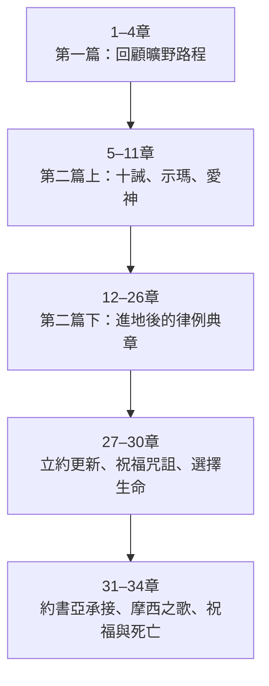
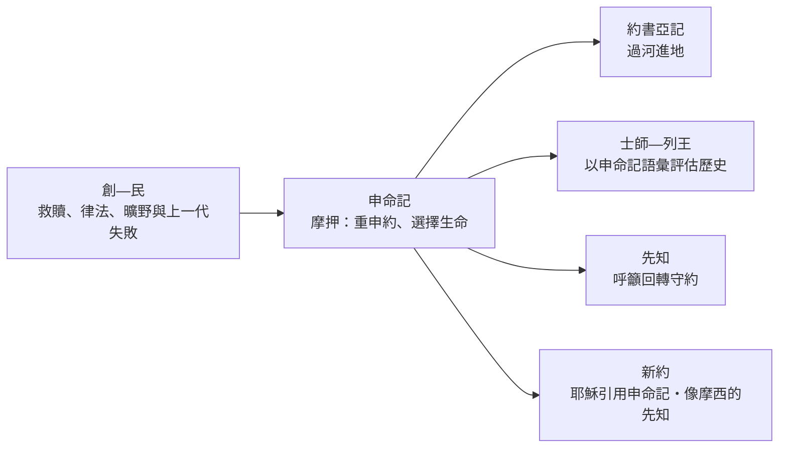

<!-- book-introduction-navigation:start -->
| [[05 申命記/全書目錄及綱要|全書目錄及綱要]] | [[05 申命記/第1章|開始讀第1章]] |
| :--- | ---: |
<!-- book-introduction-navigation:end -->

---

# 申命記

*摩西在摩押平原的臨別講詞・向新世代重申約與生命之路*

《申命記》位在摩西五經的最後一卷，也站在以色列進入迦南的門檻上。上一代已在曠野倒下，新的一代聚集在約旦河東；摩西知道自己不能與他們一同過河，於是回顧四十年的歷史，重新講解神的律法與約，反覆勸百姓要聽、要記念、要愛耶和華、不要忘記。全書像一場長篇臨別勸勉：土地即將在眼前，但真正決定未來的，不只是能不能進去，而是進去之後是否仍選擇忠於與神所立的約。

<!-- sources: CT00, GT00, KC0, BH, BIBLEPROJECT -->

---

## 一覽

| 項目 | 資料 |
| --- | --- |
| 位置 | 摩西五經第五卷；五經總結，也是《約書亞記》的門檻 |
| 章數 | 34 章 |
| 希伯來書名 | דְּבָרִים（Devarim，「話語／這些話」），取自卷首 |
| 希臘／通行書名 | Deuteronomy，帶有「第二律法／律法重申」之意 |
| 傳統作者歸屬 | 摩西為主要作者；第34章摩西之死在傳統中常另作處理 |
| 敘事時地 | 曠野第四十年，約旦河東的摩押平原 |
| 主要形式 | 臨別講詞、律法重申、立約更新、摩西之歌與祝福 |
| 核心呼召 | 聽、愛、記念、順服；在生命與死亡之間選擇生命 |

<!-- sources: CT00, GT00, KC0, BH, BIBLEPROJECT, ENTER_THE_BIBLE, YALE -->

---

## 書名與位置

希伯來書名 **דְּבָרִים（Devarim，「話語／這些話」）** 取自卷首「以下所記的是摩西……所說的話」。這個名稱很貼近全書形式：大部分內容不是新的旅程敘事，而是摩西站在摩押平原，對準備進地的新世代說話。

希臘文傳統的 **Deuteronomy** 常被理解為「第二律法」。這不表示本書只是把《出埃及記》《利未記》《民數記》的法律原封不動抄一次；更準確地說，它是在新的地點、面對新的世代，重新講解與應用神在西乃／何烈所賜的約與誡命。

> [!note] 「重申律法」不是「複製貼上律法」
> 《申命記》會重述十誡，也會重新安排、解釋與應用許多律例。它的語氣不是法典目錄，而是摩西不斷用「今日、你們要聽、不可忘記」向下一代發出勸勉。

<!-- sources: CT00, GT00, KC0, BH, BIBLEPROJECT -->

---

## 作者、成書與摩押背景

猶太教與基督教傳統把《申命記》與摩西聯繫在一起，視為他在生命末期對以色列所作的臨別講詞。CT00、KingComments 與 BibleHub 都沿用這個框架；申命記31章也記載摩西把律法寫下來交給祭司與長老。至於第34章記述摩西死亡與埋葬，傳統解釋通常把這一段另作處理，而不把「摩西主要作者」理解成他親自寫下自己死後的全部敘述。

敘事舞台十分清楚：曠野第四十年，以色列位於約旦河東摩押地，摩西即將去世，約書亞即將接班。這個處境決定了本書強烈的「下一代」語氣——不是只回顧過去，而是要百姓從上一代的失敗中學習，在得到土地之後不要因富足而忘記神。

現代研究則常把《申命記》放在較長的「申命傳統」形成史中。Enter the Bible 介紹的一種常見學術模型，會把部分傳統與北國背景、主前七世紀約西亞改革，以及被擄時期的編整連在一起；同時也有其他重建方式。Yale 則特別把本書的法律與古代近東條約形式、宗教改革與後續歷史敘事放在一起比較。

因此需要分開兩個層次：書中呈現的是「摩西在摩押向新世代講話」的敘事場景；現代成書研究追問的則是這些講詞、律法與框架如何在歷史中傳承、編整成今天的文本。

| 要分開看的問題 | 本卷導論的處理 |
| --- | --- |
| 故事所描寫的時間 | 曠野第四十年、進迦南前夕；摩西生命最後階段。 |
| 傳統作者歸屬 | 摩西為主要作者／講述者；第34章摩西之死在傳統中常視為後加敘事。 |
| 現代成書研究 | 常討論較長的申命傳統、主前七世紀改革與被擄時期編整；具體模型並非完全一致。 |
| 地理舞台 | 約旦河東、摩押平原；對岸就是應許之地。 |

> [!important] 「摩西講話的場景」與「文本形成史」是兩個問題
> 本導論保留《申命記》自己的摩押臨別場景，同時另行說明現代研究如何討論文本的長期形成；兩者不壓成一句單一年代答案。

<!-- sources: CT00, GT00, KC0, BH, ENTER_THE_BIBLE, YALE -->

---

## 主旨：記念、愛神，並選擇生命

摩西首先用歷史說話。1–4章回顧從何烈到摩押的路程，尤其重提探子事件與上一代的不信。這不是懷舊，而是要下一代明白：他們今天站在約旦河邊，不是因為上一代做得好，而是因為神仍信實守約；因此他們不可重蹈覆轍。

5–11章把十誡、示瑪與「愛耶和華你的神」放在一起。這裡的順服不只是外在遵守規則；摩西反覆談「心」、教導兒女、記念、不要忘記，顯示約要求整個人和整個世代把神的話放在生活中心。

12–26章則把約的生活具體化到敬拜、司法、領袖、戰爭、家庭、弱勢者、債務、節期與初熟土產等領域。27–30章把選擇推到最尖銳：祝福與咒詛、生命與死亡擺在百姓面前。31–34章完成領袖交接，讓摩西之歌、祝福與死亡成為五經的收束。

> [!summary] 申命記不斷要求讀者「記得自己是誰」
> **記念神曾經拯救你 → 愛祂 → 聽祂的話 → 在土地上實踐公義 → 把信仰傳給下一代。** 遺忘，正是本書最警惕的危險之一。

<!-- sources: CT00, GT00, KC0, BH, BIBLEPROJECT, ENTER_THE_BIBLE -->

---

## 本書的重要性與特色

《申命記》不只是五經結尾，也深刻影響後面的《約書亞記》《士師記》《撒母耳記》《列王紀》。這些書常以申命記的語言評估以色列歷史：是否敬拜獨一的耶和華、是否遵行約、是否轉去拜別神，以及背約帶來什麼後果。現代研究常因此用「申命史」來描述申命記與約書亞至列王紀之間的密切關係。

新約對本書的使用同樣突出。耶穌在曠野受試探時三次以《申命記》回答；祂把申命記6章「盡心、盡性、盡力愛耶和華」稱為最大的誡命，又與「愛人如己」並列。使徒書信也多次引用申命記的律法、咒詛、話語與先知應許。

**法律被包在勸勉與故事裡**  
摩西不是只發布規章，而是不斷解釋「為什麼」要順服，把律法與出埃及、曠野、土地和下一代連起來。

**「心」是重要焦點**  
愛神、記念、不可心高氣傲、心受割禮等語言，使本書的順服不只是外在行為。

**「今日」讓過去的約臨到新世代**  
即使何烈立約時許多聽眾尚未出生，摩西仍把約說成「耶和華今日與我們立的」，強調每一代都必須重新承擔約的呼召。

**與古代近東條約可比較**  
歷史回顧、條款、祝福與咒詛、見證等元素常被拿來與古代宗主—附庸條約比較；這有助理解形式，但不代表兩者完全相同。

<!-- sources: CT00, GT00, BH, BIBLEPROJECT, ENTER_THE_BIBLE, YALE -->

---

## 全書結構

《申命記》的結構本身就像一場逐步推進的臨別大會：先回顧歷史，再重申約與誡命，接著具體說明進地後的生活，最後以立約更新、領袖交接、詩歌與死亡收束。現有目錄採五大段，對一般讀者尤其清楚。

| 範圍 | 段落 | 內容重點 |
| --- | --- | --- |
| 1–4章 | 第一篇講詞：歷史回顧 | 從何烈到摩押，重看上一代的失敗與神一路的信實。 |
| 5–11章 | 約的核心 | 十誡、示瑪、愛神、記念與不可忘記；說明順服的內在方向。 |
| 12–26章 | 律例典章 | 敬拜、領袖、司法、戰爭、家庭、經濟、節期與社會生活的具體規範。 |
| 27–30章 | 立約更新 | 祝福與咒詛、悔改與恢復，最後把生命與死亡擺在百姓面前。 |
| 31–34章 | 摩西最後的事 | 約書亞承接、律法交付、摩西之歌、支派祝福與摩西之死。 |

<!-- sources: CT00, GT00, BH, BIBLEPROJECT, ENTER_THE_BIBLE, YALE -->

---

## 鑰節、鑰字與核心主題

《申命記》最有辨識度的字不是某一條特殊律法，而是一組不斷重複的動詞：**聽、愛、記念、不可忘記、遵行、教導。** 這些詞把以色列的過去、現在與下一代綁在一起。摩西的問題始終是：當百姓進入富足的土地、不再像曠野那樣每天感到缺乏時，他們還會不會記得那位領他們出埃及的神？

| 經文 | 在全書中的位置 |
| --- | --- |
| 申4:5–9 | 律法被描寫為以色列在列國中智慧與見證的一部分，也要求百姓把所見所聞教給後代。 |
| 申6:4–9 | 示瑪；獨一的耶和華、全心愛神，以及把神的話教導兒女，是全書核心。 |
| 申8:2–18 | 進入富足後最大的危險是忘記；曠野記憶被用來對抗自我中心與驕傲。 |
| 申10:12–19 | 敬畏、愛、事奉神與照顧孤兒寡婦、愛寄居者被放在同一段落。 |
| 申18:15–19 | 應許興起像摩西的先知，成為後續先知傳統與新約的重要互文。 |
| 申30:15–20 | 生命與死亡、祝福與咒詛擺在面前；「選擇生命」總結立約更新的呼召。 |

**鑰字／重複線索：** 聽／Shema、愛、記念／不可忘記、今日、約、心、土地、祝福／咒詛、生命

- **記念與身份**：百姓的倫理建立在「神曾把我們從埃及領出來」的共同記憶上。
- **愛神與順服**：愛不是抽象感情；本書把愛神與聽從祂的話、專一敬拜和實際行動放在一起。
- **土地是恩典，也是試驗**：富足可能使人忘記神，因此進地不是故事結束，而是另一種忠誠考驗的開始。
- **世代傳承**：教導兒女、公開誦讀律法、摩西之歌與領袖交接，都服務於「下一代不要忘記」。

<!-- sources: CT00, GT00, KC0, BH, BIBLEPROJECT, ENTER_THE_BIBLE, YALE -->

---

## 與前後書卷及整本聖經的關係

《申命記》像摩西五經的總結台。它回望《出埃及記》的救贖與十誡、《民數記》的曠野失敗，也把《利未記》等律法重新放進「進地後如何生活」的語境。書末摩西死在應許之地之外，讓讀者自然轉向《約書亞記》：律法已交付，新領袖已被設立，下一步就是過約旦河。

《約書亞記》到《列王紀》持續使用申命記的語言理解以色列歷史，先知也反覆呼籲百姓回到約、愛神與公義。申命記因此不只是律法書最後一卷，也是後續舊約敘事與先知批判的重要神學語彙庫。

新約又把這些主題集中到耶穌身上：曠野受試探時祂引用申命記6–8章；祂以「愛神」總結最大的誡命；使徒行傳則把「像摩西的先知」應用於耶穌。所以《申命記》一方面結束摩西的時代，一方面把「聽神的話、忠於約、期待下一位先知」帶進後面的聖經故事。

<!-- sources: CT00, GT00, KC0, BH, BIBLEPROJECT, ENTER_THE_BIBLE, YALE -->

---

> [!info]- 本頁來源與方法
>
> 本頁以 **CT00 的書卷提要節奏作為編排參考**；CT00、GT00、KC0、BH 是四套既有註釋來源，BibleProject、Enter the Bible、Yale 屬補強層，不加入四家共識票數。
>
> - **CT00**｜[CCBibleStudy 申命記提要](https://www.ccbiblestudy.org/Old%20Testament/05Deut/05CT00.htm)
> - **GT00**｜[CCBibleStudy 申命記導論拾穗](https://www.ccbiblestudy.org/Old%20Testament/05Deut/05GT00.htm)
> - **KC0**｜[KingComments — Deuteronomy Introduction](https://www.kingcomments.com/en/bible-studies/Deu/0)
> - **BH**｜[BibleHub — Deuteronomy Summary and Study Bible](https://biblehub.com/deuteronomy/)
> - **BIBLEPROJECT**｜[BibleProject — Book of Deuteronomy Guide](https://bibleproject.com/guides/book-of-deuteronomy/)
> - **ENTER_THE_BIBLE**｜[Enter the Bible — Deuteronomy](https://enterthebible.org/courses/deuteronomy/)
> - **YALE**｜[Yale Bible Study — Leviticus, Numbers, and Deuteronomy](https://yalebiblestudy.org/courses/leviticus-numbers-and-deuteronomy/)
>
> GT00 是多家導論與研讀資料的合輯，使用其中個別觀點時必須保留子來源；BibleHub 即使整合多種底層資料，在本專案仍只算一個 BH 來源維度。摩西臨別講詞的敘事框架、傳統作者歸屬與現代文本形成研究按不同問題層次並列。

---

<!-- book-introduction-navigation:start -->
| [[05 申命記/全書目錄及綱要|全書目錄及綱要]] | [[05 申命記/第1章|開始讀第1章]] |
| :--- | ---: |
<!-- book-introduction-navigation:end -->
