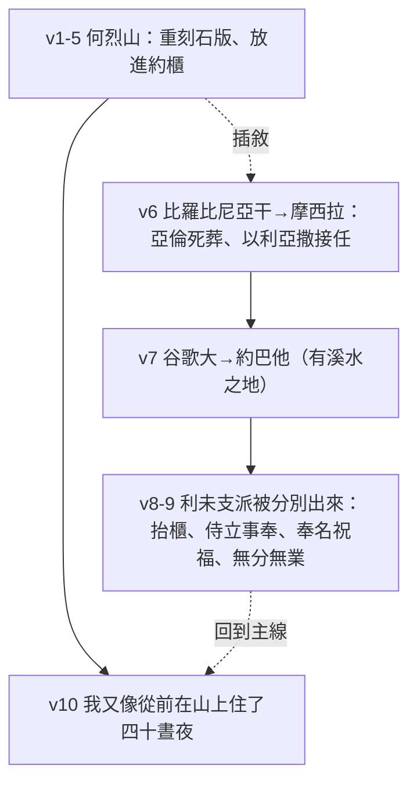
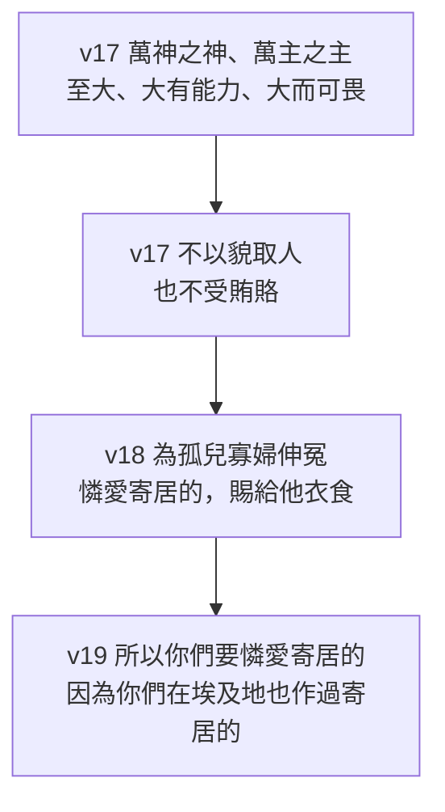

# 申命記 第10章

<!-- chapter-navigation:start -->
| [前一章](../05%20申命記/第9章.md) | [回目錄](../05%20申命記/全書目錄及綱要.md) | [下一章](../05%20申命記/第11章.md) |
| :--- | :---: | ---: |
<!-- chapter-navigation:end -->

1. 那時，耶和華吩咐我說：你要鑿出兩塊[[石版]]，[[摩西鑿石版（第二次法版）|和先前的一樣]]，上山到我這裡來，又要做一[[約櫃|木櫃]]。
2. 你[[摩西摔碎法版（廢約的象徵）|先前摔碎的那版]]，其上的字我要寫在這版上；你要將這版放在櫃中。
3. 於是我用[[皂莢木]]做了一櫃，又鑿出兩塊[[石版]]，[[摩西鑿石版（第二次法版）|和先前的一樣]]，手裡拿這兩塊版上山去了。
4. 耶和華將那[[大會的日子（qa.hal）|大會之日]]、在山上從火中所傳與你們的[[十句話|十條誡]]，照先前所寫的，寫在這版上，將版交給我了。
5. 我轉身下山，將這版放在我所做的櫃中，現今還在那裡，正如耶和華所吩咐我的。
6. （以色列人從[[比尼亞干|比羅比尼亞干]]（或作：亞干井）起行，到了[[摩西錄|摩西拉]]。[[亞倫]]死在那裡，[[亞倫死於摩西拉還是何珥山|就葬在那裡]]。他兒子[[以利亞撒]][[亞倫卒於何珥山與祭司職任更替|接續他供祭司的職分]]。
7. [[申命記十章的非時序編排|他們從那裡起行]]，到了[[谷歌大與約巴他|谷歌大]]，又從谷歌大到了[[河、泉、源（na.chal、a.yin、te.hom）|有溪水之地]]的[[谷歌大與約巴他|約巴他]]。
8. 那時，耶和華將[[利未支派]][[分別為聖|分別出來]]，抬耶和華的[[約櫃]]，又[[侍立事奉（a.mad、sha.rat）|侍立在耶和華面前事奉他]]，[[稱頌（ba.rakh）|奉他的名祝福]]，直到今日。
9. 所以[[利未支派|利未人]]在他弟兄中[[產業（na.cha.lah）|無分無業]]，耶和華[[產業（na.cha.lah）|是他的產業]]，正如耶和華─你神所應許他的。）
10. 我又像從前在山上住了[[四十晝夜]]。那次[[摩西的代求|耶和華也應允我]]，[[敗壞與滅絕同一字根（sha.chat）|不忍將你滅絕]]。
11. 耶和華吩咐我說：[[起來拔營起行（mas.sa）|你起來引導這百姓]]，使他們進去得我向他們列祖起誓應許[[美地|所賜之地]]。
12. 以色列啊，現在耶和華─你[[耶和華向你所要的是什麼呢|神向你所要的是什麼呢]]？只要你[[敬畏神|敬畏耶和華]]─你的神，[[他的道（de.rekh）|遵行他的道]]，愛他，[[你要盡心盡性盡力愛耶和華（a.hav）|盡心盡性]][[事奉與作奴僕同一字根（a.vad）|事奉他]]，
13. 遵守他的誡命律例，就是我今日所吩咐你的，為要叫你[[得福（ya.tav）|得福]]。
14. 看哪，[[天和天上的天]]，地和地上所有的，都屬耶和華─你的神。
15. 耶和華但喜悅你的列祖，愛他們，從萬民中[[神的揀選|揀選]]他們的[[種子（ze.ra）|後裔]]，就是你們，像今日一樣。
16. 所以你們要將[[未受割禮的心若謙卑（認罪悔改的條件）|心裡的污穢除掉]]，不可再[[硬著頸項的百姓|硬著頸項]]。
17. 因為耶和華─你們的神─他是[[萬神之神，萬主之主]]，至大的神，大有能力，[[敬畏與可畏同一字根（ya.re）|大而可畏]]，[[不以貌取人]]，也不受[[古代近東賄賂|賄賂]]。
18. 他為[[孤兒寡婦]]伸冤，又憐愛[[寄居的]]，賜給他衣食。
19. 所以你們要憐愛[[寄居的]]，因為你們在埃及地也作過寄居的。
20. 你要[[敬畏神|敬畏耶和華]]─你的神，[[事奉與作奴僕同一字根（a.vad）|事奉他]]，[[專靠（da.veq）|專靠]]他，也要指著他的名起誓。
21. 他是你所讚美的，是你的神，為你做了那[[敬畏與可畏同一字根（ya.re）|大而可畏]]的事，是你親眼所看見的。
22. 你的列祖[[雅各家七十人與七十五人|七十人下埃及]]；現在耶和華─你的神使你[[亞伯拉罕之約|如同天上的星那樣多]]。

---

## 本章知識節點

### 主題
- [[約櫃]]
- [[美地]]
- [[耶和華向你所要的是什麼呢]]
- [[孤兒寡婦]]

### 事件
- [[摩西鑿石版（第二次法版）]]
- [[摩西摔碎法版（廢約的象徵）]]

### 互文
- [[彌6：8|彌6：8 神向人所要的是行公義好憐憫存謙卑的心]]

### 人物
- [[亞倫]]
- [[以利亞撒]]
- [[利未支派]]

### 地點
- [[摩西錄]]
- [[比尼亞干]]
- [[谷歌大與約巴他]]

### 文化
- [[石版]]

### 背景
- [[古代近東賄賂]]

### 神學
- [[亞倫卒於何珥山與祭司職任更替]]
- [[分別為聖]]
- [[四十晝夜]]
- [[摩西的代求]]
- [[敬畏神]]
- [[神的揀選]]
- [[未受割禮的心若謙卑（認罪悔改的條件）]]
- [[硬著頸項的百姓]]
- [[亞伯拉罕之約]]
- [[萬神之神，萬主之主]]

### 原文
- [[皂莢木]]
- [[十句話]]
- [[大會的日子（qa.hal）]]
- [[河、泉、源（na.chal、a.yin、te.hom）]]
- [[稱頌（ba.rakh）]]
- [[產業（na.cha.lah）]]
- [[敗壞與滅絕同一字根（sha.chat）]]
- [[你要盡心盡性盡力愛耶和華（a.hav）]]
- [[事奉與作奴僕同一字根（a.vad）]]
- [[得福（ya.tav）]]
- [[種子（ze.ra）]]
- [[寄居的]]
- [[專靠（da.veq）]]
- [[侍立事奉（a.mad、sha.rat）]]
- [[起來拔營起行（mas.sa）]]
- [[他的道（de.rekh）]]
- [[天和天上的天]]
- [[敬畏與可畏同一字根（ya.re）]]
- [[不以貌取人]]

### 解經爭議
- [[雅各家七十人與七十五人]]
- [[亞倫死於摩西拉還是何珥山]]
- [[申命記十章的非時序編排]]

---

## 本章整理

### 一、重刻的石版與那只木櫃（v1-5）

第九章停在摩西俯伏四十晝夜的禱告上，第十章一開口就是神的回應：你要鑿出兩塊石版，和先前的一樣。[[摩西鑿石版（第二次法版）|重刻石版]]在本章不是補辦手續，而是約被重新立起來的憑據。

前後兩次的分工不同。第一次的[[石版]]由神預備，這一次由摩西動手鑿；寫字的仍然是神。第4節說耶和華把那[[大會的日子（qa.hal）|大會之日]]從火中所傳的[[十句話|十條誡]]寫在這版上，而且是「照先前所寫的」——CT 對這四個字的註解只有一句：「意指內容完全一樣。」

CT 從「和先前的一樣」讀出的是赦免的完整：「表示神對百姓的悅納和先前的沒有兩樣，這實在是神莫大的恩典，神的赦免是沒有留下一點陰影的，是完全的赦免」。KC 注意到同一點，他說這第二版上寫的和第一版沒有兩樣，不需要任何修訂；神所說的話與神所寫的話彼此相等。

| | 第一次（出24、出32） | 第二次（申10:1-5） |
| --- | --- | --- |
| 誰預備石版 | 神自己預備 | 摩西鑿出 |
| 誰寫字 | 神 | 神 |
| 內容 | 十條誡 | 照先前所寫的，完全一樣 |
| 結局 | 摩西在山下摔碎（見 [[摩西摔碎法版（廢約的象徵）]]） | 放進摩西所做的櫃中 |

真正新加的是存放的地方。第2節神吩咐要把版放在櫃中，第3節摩西用[[皂莢木]]做了一櫃。CT 指出這只木櫃就是[[約櫃]]；GT《啟導本聖經申命記註釋》補上它後來的身分——放在會幕的至聖所裡，是神的寶座或腳凳。GT《聖經精讀本──申命記註解》說明櫃裡不只有石版，還有亞倫發芽之杖與盛滿一俄梅珥嗎哪的金罐子。KC 的重點在材質：櫃是木頭做的，指向主耶穌的人性，因為惟有成為人，他才能把我們與他自己聯合起來。

> [!note] 順序與時間的落差
> GT《聖經精讀本──申命記註解》指出，櫃其實要到出37:1 以下才做成，把石版放進約櫃更在出埃及第二年正月初一之後（出40:17、20）。本章把領受石版與存放石版合為一體回顧，是為了強調聖約已得恢復。這種寫法與下一段的[[申命記十章的非時序編排|非時序編排]]是同一回事。

### 二、插進來的四節行程（v6-9）

第5節剛講完把石版放進櫃裡，第6節突然換成流水帳：從[[比尼亞干|比羅比尼亞干]]起行到了[[摩西錄|摩西拉]]，[[亞倫]]死在那裡、葬在那裡，他兒子[[以利亞撒]]接續他供祭司的職分（見[[亞倫卒於何珥山與祭司職任更替]]）；接著到[[谷歌大與約巴他]]，那是[[河、泉、源（na.chal、a.yin、te.hom）|有溪水之地]]。和合本用一組括號把這四節框起來，正是為了標示這個斷裂。

GT《啟導本聖經申命記註釋》說得最直接：「這四節是插在5與10節中間的一個註釋」，提供有關約櫃、照料約櫃的利未人，以及第一位祭司亞倫的歷史資料。KC 替這種排法給了理由：亞倫換成以利亞撒其實是新石版之後三十八年的事，摩西在這裡跳到旅程的終點，第8節又退回百姓犯罪的時候；在他讀來這裡沒有時間順序，事件是按彼此的內在關聯排列的。

這段插敘也留下一處對不上的紀錄。申10:6 說亞倫死在摩西拉，民20:28 與民33:38 卻說他死在何珥山，[[亞倫死於摩西拉還是何珥山]]因此成為本章最實在的一個歷史難題。GT《啟導本聖經申命記註釋》給的解法最短：「可能何珥山又名摩西拉」。GT 收錄的艾基斯《舊約聖經難題彙編》講得完整些，他認為「有很高的可能性是摩西拉乃一地區名，何珥山則位於此區內」，並拿何烈來類比——何烈是一連串山的名稱，西乃山只是其中一座。CT 另從詞形補一條線索：摩西拉是單數詞、民33:30 的摩西錄是複數詞，兩者很可能是同一地，而兩卷書的站名次序剛好相反。

第8至9節才是這段插敘真正的落點。神把[[利未支派]][[分別為聖|分別出來]]，交給他們三件事。

| 職責 | 經文用詞 | STEP語言資料 | 各家補充 |
| --- | --- | --- | --- |
| 抬櫃 | 抬耶和華的約櫃 | la./Set（H5375H） | GT《聖經精讀本──申命記註解》：抬約櫃是利未支派的義務與特權 |
| 供職 | 侍立在耶和華面前事奉他 | la./'a.Mod（H5975G）加 le./sha.re.T/o（H8334） | CT：由祭司擔任獻祭、點燈、燒香、更換陳列餅等事工 |
| 祝福 | 奉他的名祝福 | u./le./va.Rekh（H1288） | CT：可能屬於大祭司的職責（參民六23~27） |

第三項就是[[稱頌（ba.rakh）|奉他的名祝福]]，CT 的〔原文字義〕給這個字是「祝福，屈膝」。==同樣譯成「事奉」，本章卻用了兩個不同的字：==第8節利未人的是 sha.rat，第12、20節全民的是 a.vad（見[[侍立事奉（a.mad、sha.rat）]]與[[事奉與作奴僕同一字根（a.vad）]]）。

第9節接著說利未人[[產業（na.cha.lah）|無分無業]]，耶和華是他的產業。CT 解釋這是指沒有與一般人同樣謀生的產業，事奉神並從神得到生活必需品的供應。GT《啟導本聖經申命記註釋》講得更白：一家的產業代代相傳、賴以為生，而利未人世代侍奉耶和華神，他們在神前的侍奉便是他們的生計。GT《聖經精讀本──申命記註解》補上實際的安排：神從其他支派取四十八座城邑與十一奉獻賜給他們，作為居住地與生計所需。KC 把這句話讀成一種抬升——比所得的產業更大、比永生的恩賜更大的，是賜下這一切的那一位。

### 三、代求蒙允與重新起行（v10-11）

第10節接回第5節：「我又像從前在山上住了四十晝夜。那次耶和華也應允我，不忍將你滅絕。」CT 指出原文是「像第一次」，所以這是第二次，本節是申九章金牛犢事件的總結。[[四十晝夜]]在申命記裡因此有了兩種用途：上山領受律法用它，替破壞律法的人求情也用它。

「不忍」在原文是 a.vah（H14，簡要詞典義 be willing），「滅絕」則是 sha.chat 的使役語幹（見[[敗壞與滅絕同一字根（sha.chat）]]），與申9:12「敗壞了自己」、9:26「求你不要滅絕你的百姓」同一字根。[[摩西的代求]]在這裡收到了答覆，GT《申命記串珠聖經註釋》的話很短：「是上述事件的一個總結：神答應摩西的代禱，以色列民沒有被滅絕，神與子民的關係得以重新恢復。」

第11節是這段回顧真正的收尾。神說「你起來引導這百姓」，STEP語言資料顯示原文是三個詞連著下：kum（起來）、lekh（走）、le./ma.Sa'（H4550，mas.sa 簡要詞典義 journey）。CT 把它直譯成「起來拔營起行」，並讀出一個結論：這「表示神已經赦免了以色列人的罪」（見[[起來拔營起行（mas.sa）]]）。刑罰免了之外，中斷的行程也重新啟動，百姓可以去得那[[美地|所賜之地]]。KC 從摩西的身分補一句：替百姓代求並作中保的那一位，也可以作那百姓的嚮導。

### 四、那麼神到底要什麼（v12-13）

第12節換了口氣：「以色列啊，現在耶和華─你神向你所要的是什麼呢？」[[耶和華向你所要的是什麼呢|這個問句]]是全章的樞紐——前面十一節講神怎麼重立那個被毀掉的約，從這裡起改講人這一邊該怎麼回應。GT《聖經精讀本──申命記註解》把位置說得很清楚：摩西用了很長的篇幅（9:6-10:11）說明以色列過去四十年的曠野史佈滿不順服與悖逆，卻靠著神恒久忍耐的恩典終於得以進入迦南；本段要曉諭的，就是蒙恩典者當盡的義務。

各家數出來的項目略有出入。CT 歸納成四件：[[敬畏神]]、[[他的道（de.rekh）|遵行他的道]]、[[你要盡心盡性盡力愛耶和華（a.hav）|愛神]]、[[事奉與作奴僕同一字根（a.vad）|事奉神]]，第13節再加上遵守誡命律例。GT《啟導本聖經申命記註釋》數的也是四項，排法略不同：敬畏神、凡吩咐的都當遵行、侍奉神、盡心盡性盡力愛神。GT《申命記串珠聖經註釋》只提兩件——敬畏，與遵行一切的誡命，並指出日後先知彌迦同樣說神要求百姓為貧困人伸張公義、憐愛他們，對神則要謙卑服從（見[[彌6：8]]）。

有兩個細節值得停一下。第一，STEP語言資料顯示本節的「盡」只有心（le.va.ve./Kha，H3824）與性（naf.She./kha，H5315G）兩項，申6:5 的第三項在這裡沒有出現；CT 與 GT《啟導本聖經申命記註釋》在解說時都把申6:5 的「盡力」一併帶了進來。第二，「他的道」在原文是複數形（de.ra.Kha/v，H1870G，陽性複數附屬形），CT 的話中之光也記下這一點：「祂的道(或道路)不是單方面的事，在原文裡這個字是眾數。」它並拿動詞的字面義說事：「行走的動作是繼續不斷的，停了就不是行走了。」

第13節給出目的：為要叫你[[得福（ya.tav）|得福]]（STEP語言資料為 le./Tov，H2896B）。GT《聖經精讀本──申命記註解》說這些律例典章是給人提供生之意義與幸福之路的生命之燈光。CT 在話中之光留下一句反過來說的話：「人的錯誤是常以為自己能給神甚麼，卻沒有先弄清楚神所要的是甚麼。」

### 五、至高的神與沒有靠山的人（v14-22）

第14節先把神放到最高處：「天和天上的天，地和地上所有的，都屬耶和華─你的神。」[[天和天上的天]]在原文是同一個字連用三次（ha./sha.Ma.yim u./she.Mei ha./sha.Ma.yim，H8064）。GT《聖經精讀本──申命記註解》說這是希伯來文學獨特的修辭手法，「用來意指天的廣大無邊與莊重及至高」，並拿萬王之王、歌中歌這類詞語作類比；CT 則說「天上的天」指第三層天（參林後十二2）。

第15節緊接著把範圍縮到最小：耶和華但喜悅你的列祖，愛他們，從萬民中[[神的揀選|揀選]]他們的後裔。擁有全部的那一位，揀選的卻只有一家。GT《申命記串珠聖經註釋》點出「但」這個字的作用，說它「強調這位掌管宇宙的耶和華竟然揀選了列祖和以色列人」。CT 另註明「後裔」在原文是單數詞，直譯是[[種子（ze.ra）|種子]]。

第16節是轉折：「所以你們要將心裡的污穢除掉，不可再硬著頸項。」CT 給的直譯是「為未受割禮的心行割禮」（見[[未受割禮的心若謙卑（認罪悔改的條件）]]）；GT《申命記雷氏研讀本》說這裡用作比喻，指使自己從罪惡裏分別出來；GT《啟導本聖經申命記註釋》補上外在記號與內心改變的關係——以色列人須受割禮才是社會正式成員，也必須把違背神的意向從心裡剷除，才能全心全意把自己歸給神。KC 說得更絕：沒有心的割禮，就談不上真正的敬畏。「[[硬著頸項的百姓|硬著頸項]]」則把申9:6、9:13 的判詞再說一次。

第17至19節是本章最大的落差。

CT 先擋掉一個誤讀，說[[萬神之神，萬主之主]]這組稱號「意指至高的神，但並不意味著在祂之下另有眾神」，而是要以色列人切莫被迦南人所敗的偶像假神吸引了去。接著是兩句限定：[[不以貌取人]]在原文字面是不舉起臉面（動詞 yi.Sa'、名詞 fa.Nim，前面加否定詞 lo'），GT《申命記串珠聖經註釋》解作不偏私（參1:17）；至於不受[[古代近東賄賂|賄賂]]，CT 把兩句合起來解釋，說這「意指祂不受任何權勢和財富力量的影響」。

然後第18節落到[[孤兒寡婦]]與[[寄居的]]身上。GT《聖經精讀本──申命記註解》說孤兒寡婦「是社會經濟上的弱者階層」，容易蒙不白之冤或遭到虐待，寄居的則既沒有屬於自己的地產，也沒有法律權利。CT 說得最短：他們「代表一切弱勢的人們」。第19節把這件事變成以色列自己的義務，理由是他們也當過寄居的——GT《申命記串珠聖經註釋》由此下了一個總判斷：「摩西的律法自始至終都貫徹著憐憫弱者的教訓。」

第20節重述第12節的要求，並加上一項：[[專靠（da.veq）|專靠他]]。GT《申命記串珠聖經註釋》給的直譯是「粘著他」；GT《啟導本聖經申命記註釋》說這個字有忠於神和愛神的意思，要像妻子對丈夫般忠於神並愛他。KC 把第20節的敬畏拆成三樣：事奉是行為上的、專靠是心裡定意的、指著他的名起誓是口裡說出來的。

> [!important] 敬畏與可畏是同一個字
> STEP語言資料顯示，第12、20節的「敬畏」與第17、21節的「大而可畏」同為 H3372H（ya.re）：Le./yir.'ah、ti.Ra' 是動詞形，ve./ha./no.Ra'、ha./no.ra.'Ot 是 Niphal 分詞（見[[敬畏與可畏同一字根（ya.re）]]）。中文分成兩個詞之後這條線就斷了。CT 註明第21節「那大而可畏的事」是「原文複數詞，包括降十災、過紅海、和在曠野中的神蹟奇事等」。

第22節用一組數字收尾：[[雅各家七十人與七十五人|七十人]]下埃及，如今多如天上的星。GT《啟導本聖經申命記註釋》說「七十」表示完整，意思是以色列人的祖先都下到埃及、在那裡寄居。GT《聖經精讀本──申命記註解》把它接回應許：這正應驗神給亞伯拉罕的話，他的子孫必多起來如同天上的星（見[[亞伯拉罕之約]]，參創15:5；22:17）。

### 六、重立的約與被託付的人

把第九章和第十章連起來讀，兩章處理的是同一件事的兩半：第九章講約怎麼被毀，第十章講約怎麼被重立。而重立不等於回到原點——石版還是那兩塊石版、字還是那些字，但這一次多了一只櫃、多了一個支派、多了一段從「你們要憐愛寄居的」開始的社會責任。

KC 為這兩章的分工留了一句話：申命記第9章顯出這百姓心裡有什麼，第10章則從神那一邊給出回應。順著這個讀法，本章的三段就接得起來——重刻石版是約的恢復，利未支派受託是約的執行，第12節之後的要求是約的內容。而這一整套的起點在第15節：至高的那一位先揀選了他們，第16節的心的割禮、第19節的憐愛寄居的，都是接在這件事之後說的。

**參考資料**
https://www.ccbiblestudy.org/Old%20Testament/05Deut/05CT10.htm
https://www.ccbiblestudy.org/Old%20Testament/05Deut/05GT10.htm
https://www.kingcomments.com/en/bible-studies/Deu/10
https://biblehub.com/study/deuteronomy/10.htm
https://github.com/STEPBible/STEPBible-Data

<!-- appendix-links:start -->
## 附錄

### 相關地圖
- [[appendix/fhl_maps/maps/024|〈民圖五〉出埃及和進迦南的旅程]]
- [[appendix/fhl_maps/maps/025|〈申圖一〉應許之地全圖]]
- [[appendix/fhl_maps/maps/026|〈申圖二〉征服東岸及分地給兩個半支派]]
- [[appendix/fhl_maps/maps/038|〈書圖十一〉利未人的城和十二個支派的地業]]
<!-- appendix-links:end -->

<!-- chapter-navigation:start -->
| [前一章](../05%20申命記/第9章.md) | [回目錄](../05%20申命記/全書目錄及綱要.md) | [下一章](../05%20申命記/第11章.md) |
| :--- | :---: | ---: |
<!-- chapter-navigation:end -->
