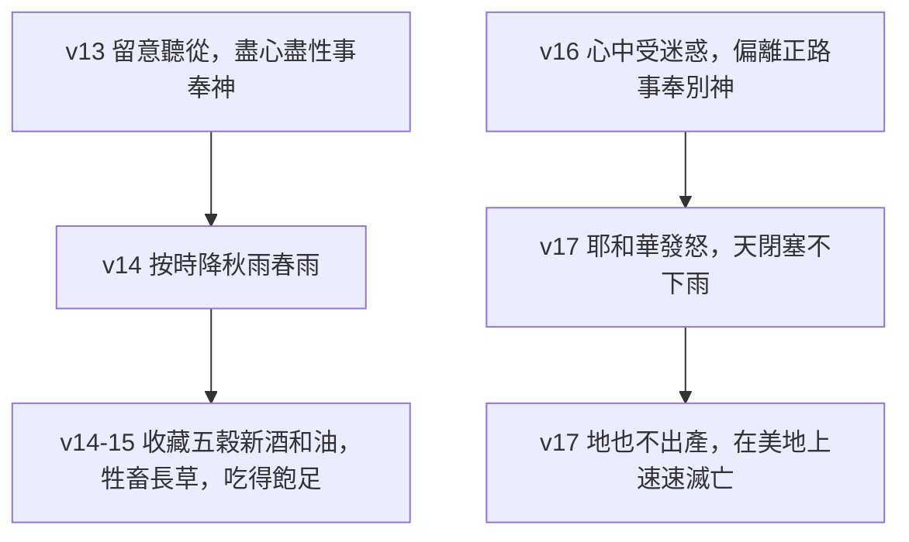

# 申命記 第11章

<!-- chapter-navigation:start -->
| [前一章](../05%20申命記/第10章.md) | [回目錄](../05%20申命記/全書目錄及綱要.md) | [下一章](../05%20申命記/第12章.md) |
| :--- | :---: | ---: |
<!-- chapter-navigation:end -->

1. 你要[[你要盡心盡性盡力愛耶和華（a.hav）|愛耶和華─你的神]]，常守[[吩咐、律例、典章、誡命四個詞|他的吩咐、律例、典章、誡命]]。
2. 你們今日當知道，我本不是和你們的兒女說話；因為他們不知道，也沒有看見耶和華─你們[[苦難與管教|神的管教]]、威嚴、[[大能的手]]，和[[伸出來的膀臂]]，
3. 並他在埃及中向埃及王法老和其全地所行的[[十災|神蹟奇事]]；
4. 也沒有看見他怎樣待埃及的軍兵、車馬，他們追趕你們的時候，耶和華怎樣使[[海（紅海）|紅海]]的水[[紅海分開|淹沒他們，將他們滅絕]]，直到今日，
5. 並他[[曠野飄流四十年|在曠野怎樣待你們]]，以致你們來到這地方；
6. 也沒有看見他怎樣待[[流便|流便子孫]]以利押的兒子[[可拉大坍亞比蘭等領首聯合的大反亂|大坍、亞比蘭]]，[[地破裂吞吃可拉與大坍亞比蘭之家與其財物|地怎樣在以色列人中間開口，吞了他們]]和他們的家眷，並帳棚與跟他們的一切活物。
7. 惟有你們親眼看見耶和華所做的一切大事。
8. 所以，你們要守我今日所吩咐的一切誡命，使你們[[膽壯與大能同一字根（cha.zaq）|膽壯]]，能以進去，得你們所要得的那地，
9. 並使你們的日子在耶和華向你們列祖起誓、應許給他們和他們後裔的地上得以長久；那是[[流奶與蜜之地]]。
10. 你要進去得為業的那地，本不像你出來的[[埃及地]]。你在那裡[[用腳澆灌|撒種，用腳澆灌]]，像澆灌菜園一樣。
11. 你們要過去得為業的那地乃是[[雨水滋潤（ma.tar、sha.tah）|有山有谷、雨水滋潤之地]]，
12. 是耶和華─你神所[[眷顧（da.rash）|眷顧]]的；從歲首到年終，耶和華─你神的眼目時常看顧那地。
13. 你們若[[留意聽從與留意謹守（雙同字）|留意聽從]]我今日所吩咐的誡命，[[你要盡心盡性盡力愛耶和華（a.hav）|愛耶和華─你們的神]]，[[事奉與作奴僕同一字根（a.vad）|盡心盡性事奉他]]，
14. 他（原文是我）必按時降[[秋雨春雨（yo.reh、mal.qosh）|秋雨春雨]]在你們的地上，使你們可以收藏[[五穀、新酒和油（da.gan、ti.rosh、yits.har）|五穀、新酒和油]]，
15. 也必使你吃得飽足，並使田野為你的牲畜長草。
16. 你們要謹慎，免得[[心中受迷惑（pa.tah）|心中受迷惑]]，就偏離正路，去[[事奉與作奴僕同一字根（a.vad）|事奉敬拜別神]]。
17. 耶和華的怒氣向你們發作，就使天閉塞不下雨，地也不出產，使你們在耶和華所賜給你們的[[美地]]上[[快快地（ma.her）|速速滅亡]]。
18. 你們要將我這話存在心內，留在意中，[[記號與經文|繫在手上為記號，戴在額上為經文]]；
19. 也要教訓你們的兒女，無論坐在家裡，行在路上，躺下，起來，都要談論；
20. 又要寫在房屋的門框上，並城門上，
21. 使你們和你們子孫的日子在耶和華向你們列祖起誓、應許給他們的地上得以增多，[[如天覆地的日子那樣多]]。
22. 你們若[[留意聽從與留意謹守（雙同字）|留意謹守遵行]]我所吩咐這一切的誡命，[[你要盡心盡性盡力愛耶和華（a.hav）|愛耶和華─你們的神]]，[[他的道（de.rekh）|行他的道]]，[[專靠（da.veq）|專靠他]]，
23. 他必從你們面前趕出這一切國民，就是比你們更大更強的國民，你們也要得他們的地。
24. 凡你們[[腳掌可踏之處|腳掌所踏之地]]都必歸你們；從[[曠野]]和[[利巴嫩]]，並[[伯拉大河]]，直到[[大海（地中海）|西海]]，[[應許之地的四至|都要作你們的境界]]。
25. 必無一人能在你們面前站立得住；耶和華─你們的神必照他所說的，使[[使天下萬民驚恐懼怕|懼怕驚恐]]臨到你們所踏之地的居民。
26. 看哪，我今日將[[祝福與咒詛]]的話[[神的命令與自由意志|都陳明在你們面前]]。
27. 你們若聽從耶和華─你們神的誡命，就是我今日所吩咐你們的，就必蒙福。
28. 你們若不聽從耶和華─你們神的誡命，偏離我今日所吩咐你們的道，去事奉你們素來所不認識的別神，就必受禍。
29. 及至耶和華─你的神領你進入要去得為業的那地，你就要將祝福的話陳明在[[基利心山與以巴路山|基利心山]]上，將咒詛的話陳明在[[基利心山與以巴路山|以巴路山]]上。
30. 這二山豈不是在[[約但河]]那邊，日落之處，在住[[亞拉巴]]的迦南人之地與[[吉甲]]相對，靠近[[摩利橡樹]]嗎？
31. 你們要過[[約但河]]，進去得耶和華─你們神所賜你們為業之地，在那地居住。
32. 你們要謹守遵行我今日在你們面前所陳明的一切律例典章。

---

## 本章知識節點

### 主題
- [[美地]]
- [[如天覆地的日子那樣多]]
- [[應許之地的四至]]
- [[祝福與咒詛]]
- [[神的命令與自由意志]]

### 事件
- [[可拉大坍亞比蘭等領首聯合的大反亂]]
- [[地破裂吞吃可拉與大坍亞比蘭之家與其財物]]

### 人物
- [[流便]]

### 原文
- [[你要盡心盡性盡力愛耶和華（a.hav）]]
- [[吩咐、律例、典章、誡命四個詞]]
- [[膽壯與大能同一字根（cha.zaq）]]
- [[雨水滋潤（ma.tar、sha.tah）]]
- [[眷顧（da.rash）]]
- [[留意聽從與留意謹守（雙同字）]]
- [[事奉與作奴僕同一字根（a.vad）]]
- [[秋雨春雨（yo.reh、mal.qosh）]]
- [[五穀、新酒和油（da.gan、ti.rosh、yits.har）]]
- [[心中受迷惑（pa.tah）]]
- [[快快地（ma.her）]]
- [[記號與經文]]
- [[他的道（de.rekh）]]
- [[專靠（da.veq）]]
- [[腳掌可踏之處]]
- [[使天下萬民驚恐懼怕]]

### 地點
- [[海（紅海）]]
- [[埃及地]]
- [[曠野]]
- [[利巴嫩]]
- [[伯拉大河]]
- [[大海（地中海）]]
- [[基利心山與以巴路山]]
- [[約但河]]
- [[亞拉巴]]
- [[吉甲]]

### 文化
- [[用腳澆灌]]

### 歷史
- [[十災]]
- [[紅海分開]]
- [[曠野飄流四十年]]

### 神學
- [[苦難與管教]]
- [[大能的手]]
- [[伸出來的膀臂]]
- [[流奶與蜜之地]]

### 背景
- [[摩利橡樹]]

---

## 本章整理

### 愛神，與親眼看見的那一代（v1-7）

本章開頭是一句總結性的吩咐：要愛耶和華你的神，常守他的[[吩咐、律例、典章、誡命四個詞|吩咐、律例、典章、誡命]]。GT《啟導本聖經申命記註釋》說「本節乃十12以後所講各事的結語」；CT 在話中之光把這句話的份量講得更重：「愛神是遵行律法的根本動機與正確態度」。BH 把後半的四個詞逐一分開講：charge 指所託付的職責，statutes 指長期有效的定例，ordinances 指針對個案的判例，commandments 指直接的命令；四個詞疊起來，涵蓋的是整套約的要求，而不是其中某一類規條。這一切的起點，是[[你要盡心盡性盡力愛耶和華（a.hav）|愛]]。

GT《聖經精讀本──申命記註解》替全章下了一句定位：「本章的主題是對神話語的順服與否將會決定生命與死亡、祝福與咒詛、繁榮與破滅」，並說「本章可以說是12:1-26:19所具體論及的諸律法之律例與典章的序論」。KC 給的骨架與此相合：第1至9節回顧身後的事，第10至21節描述眼前那地，第22至32節要百姓現在就作選擇；他並指出愛這個字在三段的開頭各出現一次（第1、13、22節）。

第2節起摩西轉向記憶，並且把聽眾框得很清楚：他今日說話的對象不是兒女，是親眼看見過的人。KC 把這一代人的年紀算了出來——出埃及時他們在零到二十歲之間，如今是四十到六十歲、經驗最豐富的一代。GT《啟導本聖經申命記註釋》講同一件事：「神是與現在這一代人重申前約」。摩西要他們記得的是[[大能的手]]與[[伸出來的膀臂]]，GT《申命記雷氏研讀本》說後者「生動地形容神的保護」。==這一段的說服方式很特別：不講道理，只點名他們的眼睛看過什麼。==

| 經節 | 摩西要他們記得的 | 相關條目 |
| --- | --- | --- |
| v3-4 | 神在埃及所行的神蹟奇事，以及水淹追兵 | [[十災]]、[[海（紅海）]]、[[紅海分開]] |
| v5 | 曠野裡怎樣待他們，直到來到這地方 | [[曠野]]、[[曠野飄流四十年]] |
| v6-7 | 地開口吞了大坍、亞比蘭和他們的家眷 | [[可拉大坍亞比蘭等領首聯合的大反亂]]、[[地破裂吞吃可拉與大坍亞比蘭之家與其財物]]、[[流便]] |

KC 在這裡留意到一個容易被跳過的細節：民數記十六章那場叛亂以可拉為首，本章卻只點名大坍和亞比蘭，沒有提可拉；他推測原因是可拉的兒子並沒有一同死去（民26:9-11）。BH 則從支派著眼，指出大坍、亞比蘭出自[[流便]]，而流便是雅各的長子，這樣的出身可能助長了他們挑戰摩西權柄的心態。

### 那塊不像埃及的地（v8-12）

第8節用「所以」把回顧接到吩咐上。CT 在文意註解指出第3至7節是因、第8節以下是果，並解「膽壯」是「意指剛強勇敢，一往直前」。STEP語言資料顯示這裡藏著一個字根上的呼應：第2節的「大能的手」與第8節的「使你們膽壯」同出 cha.zaq 字根（見 [[膽壯與大能同一字根（cha.zaq）]]）——同一種力量先描述神，再描述領受的人。

第9節把應許之地稱作[[流奶與蜜之地]]。GT《聖經精讀本──申命記註解》在這裡加了一個少見的保留：這句話不只是修辭，奶確實可從牛羊得著、蜜可從野山樹花取得，但迦南地除了一部分肥沃地帶之外，供水不足、溫差大，「處處都有不毛之地」；因此追根究底，「只有神的祝福的地才是真正流奶與蜜之地」。

第10至12節把迦南和[[埃及地]]擺在一起比。埃及要撒種、[[用腳澆灌]]，像澆灌菜園一樣；要進去的那地卻是[[雨水滋潤（ma.tar、sha.tah）|有山有谷、雨水滋潤]]之地。GT《申命記串珠聖經註釋》講得最直接：在埃及，尼羅河的水必須通過人造的溝道才能灌溉，在迦南則「灌溉的工作是毋須靠賴勞力便能完成的，因有神以時雨來灌溉」。KC 把這個對比推到心態上：埃及說尼羅河是他的（結29:3），從不追問河水的來歷。CT 在話中之光則從地形讀出一個道理：「山使雨水匯集谷中，使地肥沃多結果子」。第12節補上最後一句理由——那地是耶和華所[[眷顧（da.rash）|眷顧]]的；CT 說：「從歲首到年終，三百六十五天，神天天看顧他自己所揀選的百姓」。BH 從古代近東的觀念補了一層：當時的人多半認為神明各管一方，這一節顯出的耶和華卻不受地理限制。

| 對照項 | 埃及 | 迦南 |
| --- | --- | --- |
| 水從哪裡來 | 尼羅河，靠人造的溝道 | 天上的雨，見 [[秋雨春雨（yo.reh、mal.qosh）]] |
| 人要出多少力 | 撒種之後用腳踏水車引水 | 不必靠人力引水 |
| 收成握在誰手上 | 河水與勞力 | 神的眼目時常看顧那地 |

### 兩條路：按時的雨，或閉塞的天（v13-17）

第13節是全章第一個大條件句：「你們若留意聽從我今日所吩咐的誡命」。STEP語言資料顯示這裡用了原文常見的同字疊用（見 [[留意聽從與留意謹守（雙同字）]]），到第22節還會再出現一次。條件的答應是雨：[[秋雨春雨（yo.reh、mal.qosh）]]按時降下，收成是[[五穀、新酒和油（da.gan、ti.rosh、yits.har）]]，連田野給牲畜長的草都算進去了。KC 特別點出「按時」這兩個字的份量：雨不是求就有，是照神的時候降下，而他把雨與順服連在一起。==答應的內容一路管到人的飯桌與牲畜的草料。==

第16節掉頭講反面：「你們要謹慎，免得心中受迷惑」（見 [[心中受迷惑（pa.tah）]]）。GT《申命記串珠聖經註釋》解這個「迷惑」是「原指思想開放，接受迦南地所敬拜的假神」，而那些假神管的正好是雨水和土地。GT《啟導本聖經申命記註釋》把這層背景挑明：「按時降雨的是照顧以色列人的神，因祂掌管自然和萬有，不是迦南人所迷信的假神巴力」。GT《聖經精讀本──申命記註解》則說這種鋪排本身就是摩西的講法：「摩西講章的特徵是先羅列順服神所帶來的祝福」，之後才明示不順服所召來的咒詛。第17節說天閉塞不下雨、地也不出產，人要在[[美地]]上速速滅亡——STEP語言資料顯示這個「速速」是 me.he.Rah（H4120），與申命記第9章那個[[快快地（ma.her）|快快地]]同出一個字根，警告的急促就留在句尾。

### 存在心內，也放進兒女口中（v18-21）

第18至20節把第6章說過的話再說一次：存在心內、留在意中、繫在手上為[[記號與經文|記號]]、戴在額上為經文，還要教訓兒女，寫在門框與城門上。CT 在話中之光提醒這件事的重點不在外面的動作，而在「神的話是生活的指導，也是生活的內容」。四個生活場景——坐在家裡、行在路上、躺下、起來——把談論的時間填滿了一天；BH 補上第20節的社會面：城門在古以色列不只是出入口，也是聚集與審判的地方，把話寫在城門上等於要求神的話管到公共生活。

第21節給出結果：日子得以增多，[[如天覆地的日子那樣多]]。GT《申命記串珠聖經註釋》把這句話解為「即永遠」；GT《聖經精讀本──申命記註解》補上兩種譯法的差別，直譯是天在地上的日子那樣長久，意譯是只要天覆蓋著地就一直持續。KC 從這句話讀出兩層——它講的不只是生命的品質，也是它的長度。CT 在話中之光把第15至21節連著讀，說「這段恩言，是當年以色列民的一面鏡子」。

> [!note] 經文盒子是後代的實踐
> 「繫在手上為記號，戴在額上為經文」後來被具體化成經文盒。CT 在文意註解說猶太文士把四段經文寫在小羊皮卷上，放進皮製的四方小匣，祈禱時分別繫在手臂和前額；GT 收錄的李道生《舊約聖經問題總解》講得更細——男子十三歲成為律法之子後開始佩戴，兩種盒子的四段經文是出13:1-10、出13:11-16、申6:4-9 與申11:13-21。這是後代的做法，本章經文本身並沒有規定盒子的形制。

### 腳掌所踏之地（v22-25）

第22節是本章第二個大條件句，用的是同一組疊字：留意謹守遵行、愛神、行[[他的道（de.rekh）|他的道]]、[[專靠（da.veq）|專靠]]他。CT 在原文字義給「專靠」的解是附著、黏住、牢靠，並說那是最親密的關係，如同夫妻一般。答應也跟著放大——神要從他們面前趕出比他們更大更強的國民，[[腳掌可踏之處|凡腳掌所踏之地]]都必歸他們。GT《啟導本聖經申命記註釋》解釋這個說法的來歷：腳是權力的象徵，「被踏在腳下表示征服」；同一段也提醒這片疆界要到很後來才兌現——「到所羅門時代，這廣大土地才為以色列人所取得」，BH 也說東到伯拉大河的範圍要到大衛與所羅門在位時才部分實現（王上4:21）。第25節收在一句應許上：必無一人能站立得住，因為神要[[使天下萬民驚恐懼怕]]。GT《聖經精讀本──申命記註解》讀出的重點是「屬世的權勢敵不住依靠神話語的人」。

第24節的四個地標構成[[應許之地的四至]]。其中三面各家一致，只有「曠野」指哪一面出現分歧，值得並陳。

| 方位 | 地標 | 各家說法 |
| --- | --- | --- |
| 北 | [[利巴嫩]] | 各家一致 |
| 東 | [[伯拉大河]]，即幼發拉底河 | 各家一致 |
| 西 | 西海，即 [[大海（地中海）]] | 各家一致 |
| 未定 | [[曠野]] | CT 說「指巴蘭的曠野為南界」，《啟導本》說「指巴勒斯坦南端的界限，包括南地和西奈半島」，《精讀本》讀為南面的阿拉伯沙漠地帶，BH 讀為南邊的尼革夫曠野；《串珠》則單獨列為「東北的邊界」 |

### 兩座山上的祝福與咒詛（v26-32）

第26節把全章收束成一個抉擇：「我今日將祝福與咒詛的話都陳明在你們面前」（見 [[祝福與咒詛]]）。GT《靈修版聖經註釋》先把咒詛和迷信分開：那不是術士的符咒，而是立約雙方同意的條件，「只有在背約的時候，咒詛才會臨到」。GT《聖經精讀本──申命記註解》把這個抉擇接回伊甸園的善惡果，說神容許人以自由意志作選擇（見 [[神的命令與自由意志]]）。第27與28節把兩條路各講一遍，分界只有一個動作：聽從，或不聽從。

宣告的地點是[[基利心山與以巴路山]]。GT《申命記雷氏研讀本》給的分工最簡單：「基利心山代表祝福，而以巴路山代表咒詛」。至於為什麼挑這兩座山，GT《聖經精讀本──申命記註解》直說「各家眾說紛紜」，並列出日照、植被、方位三種解釋；GT《啟導本聖經申命記註釋》採的是植被說：「基利心山林木茂盛，以巴路山則牛山濯濯；茂盛是福，荒涼乃禍」，CT 的文意註解同一路數，說基利心山「全山林木茂盛，象徵有福氣」，以巴路山「山頂光禿荒涼，象徵禍患」；KC 走的是日照這條路，把基利心山的南面說成溫暖光亮的一面，以巴路山的北面說成寒冷幽暗的一面。

兩山名字的意思，各家給的答案彼此差得更遠。CT 的〔原文字義〕給的是「割除」與「石頭，禿山」，同一份 CT 的話中之光卻說希伯來原文裡基利心是大石頭、以巴路是小石頭；GT 收錄的李道生《舊約聖經問題總解》另給荒地與赤裸。==四個說法擺在一起，本章並沒有替讀者選定其中一種。==

第30節用一串地標替兩山定位：[[約但河]]那邊、日落之處、住[[亞拉巴]]的迦南人之地、與[[吉甲]]相對、靠近[[摩利橡樹]]。這裡的吉甲是個小難題——GT《啟導本聖經申命記註釋》說「聖經學者相信迦南地有兩個吉甲」，本節指的是示劍附近的那一個，不是過河後行割禮的那一個。摩利橡樹則往前接到亞伯拉罕：GT《聖經精讀本──申命記註解》與 BH 都指出那是亞伯拉罕移居迦南後第一次築壇的地方（創12:6-7），CT 與 KC 也都把「摩利」解作教師或教導。==宣告祝福與咒詛的地點，正好是祖先第一次為神築壇的地方。==

這兩座山後來還有下文。GT《申命記串珠聖經註釋》記下撒瑪利亞人「曾在基利心山上建築他們的聖所」，聖所在主前一七○年遭毀壞，「這山直至今日仍是撒瑪利亞人的宗教中心」——約翰福音四章那位婦人對耶穌說「我們的祖宗在這山上禮拜」，講的就是這座山。全章最後兩節把話帶回眼前：他們要過約但河，進去得地，並且謹守遵行今日所陳明的一切律例典章。

**參考資料**
https://www.ccbiblestudy.org/Old%20Testament/05Deut/05CT11.htm
https://www.ccbiblestudy.org/Old%20Testament/05Deut/05GT11.htm
https://www.kingcomments.com/en/bible-studies/Deu/11
https://biblehub.com/study/deuteronomy/11.htm
https://github.com/STEPBible/STEPBible-Data

<!-- appendix-links:start -->
## 附錄

### 相關地圖
- [[appendix/fhl_maps/maps/025|〈申圖一〉應許之地全圖]]
- [[appendix/fhl_maps/maps/026|〈申圖二〉征服東岸及分地給兩個半支派]]
- [[appendix/fhl_maps/maps/028|〈書圖一〉過約但河及征服南方諸王]]
<!-- appendix-links:end -->

<!-- chapter-navigation:start -->
| [前一章](../05%20申命記/第10章.md) | [回目錄](../05%20申命記/全書目錄及綱要.md) | [下一章](../05%20申命記/第12章.md) |
| :--- | :---: | ---: |
<!-- chapter-navigation:end -->
