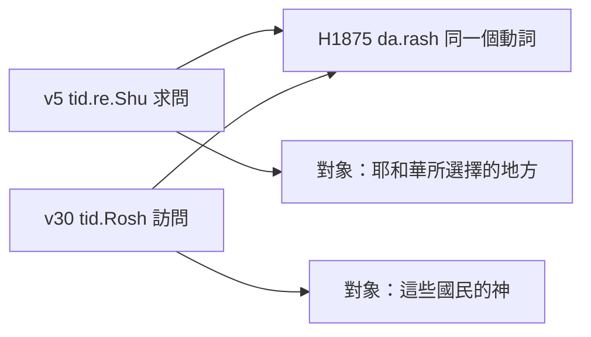
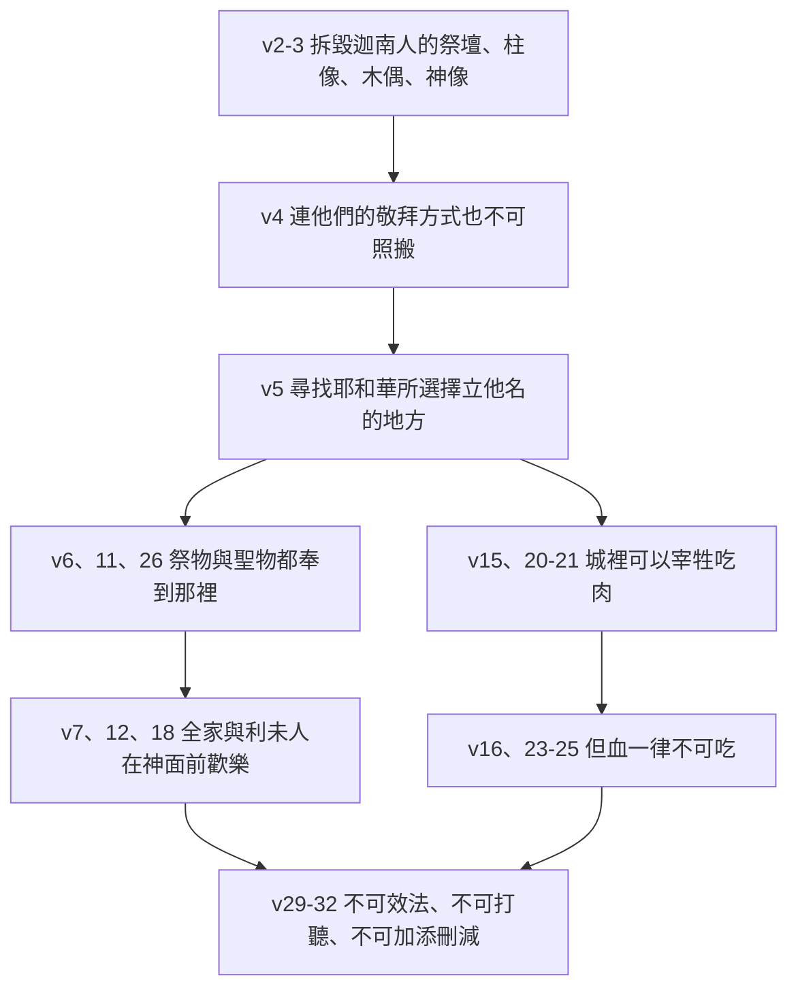

# 申命記 第12章

<!-- chapter-navigation:start -->
| [前一章](../05%20申命記/第11章.md) | [回目錄](../05%20申命記/全書目錄及綱要.md) | [下一章](../05%20申命記/第13章.md) |
| :--- | :---: | ---: |
<!-- chapter-navigation:end -->

1. 你們存活於世的日子，在耶和華─你們列祖的神所賜你們為業的地上，要謹守遵行的[[律例（choq）|律例]][[典章]]乃是這些：
2. 你們要將所趕出的國民[[事奉與作奴僕同一字根（a.vad）|事奉神的各地方]]，無論是在高山，在小山，[[古代近東偶像崇拜|在各青翠樹下]]，[[毀滅迦南偶像的三道命令|都毀壞了]]；
3. 也要拆毀他們的祭壇，打碎他們的[[柱像]]，用火焚燒他們的[[亞舍拉（木偶）|木偶]]，[[毀滅迦南偶像的三道命令|砍下他們雕刻的神像]]，並將其名從那地方除滅。
4. 你們[[不可照他們那樣事奉耶和華]]─你們的神。
5. 但耶和華─你們的神從你們各支派中選擇何處為[[立他名的居所（中央聖所）|立他名的居所]]，你們就當往那裡去[[求問與訪問同一個字（da.rash）|求問]]，
6. 將你們的[[燔祭]]、[[平安祭]]、[[十分之一|十分取一之物]]，和手中的[[舉祭]]，並[[平安祭的三類（感謝祭、還願祭、甘心祭）|還願祭]]、[[平安祭的三類（感謝祭、還願祭、甘心祭）|甘心祭]]，以及[[頭生歸神為聖|牛群羊群中頭生的]]，都奉到那裡。
7. 在那裡，耶和華─你們神的面前，你們和你們的家屬都可以吃，並且因你手所辦的一切事蒙耶和華─你的神賜福，就都[[在耶和華面前歡樂|歡樂]]。
8. 我們今日在這裡所行的是[[各人行自己眼中看為正的事]]，你們將來不可這樣行；
9. 因為你們還沒有到耶和華─你神所賜你的[[安息|安息地]]，所給你的[[產業（na.cha.lah）|產業]]。
10. 但你們過了約但河，得以住在耶和華─你們神使你們承受為業之地，又使你們太平，不被四圍的一切仇敵擾亂，安然居住。
11. 那時要將我所吩咐你們的[[燔祭]]、[[平安祭]]、[[十分之一|十分取一之物]]，和手中的[[舉祭]]，並向耶和華許願獻的一切美祭，都奉到耶和華─你們神[[立他名的居所（中央聖所）|所選擇要立為他名的居所]]。
12. 你們和兒女、僕婢，並住在你們城裡無分無業的[[利未支派|利未人]]，都要在耶和華─你們的神面前[[在耶和華面前歡樂|歡樂]]。
13. 你要謹慎，不可在你所看中的各處獻[[燔祭]]。
14. 惟獨耶和華從你那一支派中[[立他名的居所（中央聖所）|所選擇的地方]]，你就要在那裡獻[[燔祭]]，行我一切所吩咐你的。
15. 然而，在你各城裡都可以照耶和華─你神所賜你的福分，[[隨心所欲（av.vah、ne.phesh）|隨心所欲]][[宰牲與獻祭同一個字（za.vach）|宰牲]]吃肉；[[潔淨|無論潔淨人不潔淨人]]都可以吃，就如吃[[野味|羚羊與鹿]]一般。
16. 只是[[脂油和血都不可吃|不可吃血]]，要倒在地上，如同倒水一樣。
17. 你的[[五穀、新酒和油（da.gan、ti.rosh、yits.har）|五穀、新酒，和油]]的[[十分之一]]，或是[[頭生歸神為聖|牛群羊群中頭生的]]，或是你許願獻的，甘心獻的，或是手中的[[舉祭]]，都不可在你城裡吃。
18. 但要在耶和華─你的神面前吃，在耶和華─你神[[立他名的居所（中央聖所）|所要選擇的地方]]，你和兒女、僕婢，並住在你城裡的[[利未支派|利未人]]，都可以吃；也要因你手所辦的，在耶和華─你神面前[[在耶和華面前歡樂|歡樂]]。
19. 你要謹慎，在你所住的地方永不可丟棄[[利未支派|利未人]]。
20. 耶和華─你的神照他所應許擴張你境界的時候，你心裡想要吃肉，說：我要吃肉，就可以[[隨心所欲（av.vah、ne.phesh）|隨心所欲]]地吃肉。
21. 耶和華─你神[[立他名的居所（中央聖所）|所選擇要立他名的地方]]若離你太遠，就可以照我所吩咐的，將耶和華賜給你的牛羊取些[[宰牲與獻祭同一個字（za.vach）|宰了]]，可以[[隨心所欲（av.vah、ne.phesh）|隨心所欲]]在你城裡吃。
22. 你吃那肉，要像吃[[野味|羚羊與鹿]]一般；[[潔淨|無論潔淨人不潔淨人]]都可以吃。
23. 只是你要心意堅定，[[脂油和血都不可吃|不可吃血]]，因為[[血|血是生命]]；不可將血（原文作生命）與肉同吃。
24. [[脂油和血都不可吃|不可吃血]]，要倒在地上，如同倒水一樣。
25. [[脂油和血都不可吃|不可吃血]]。這樣，你行耶和華眼中看為正的事，你和你的子孫就可以[[得福（ya.tav）|得福]]。
26. 只是你[[分別為聖]]的物和你的[[平安祭的三類（感謝祭、還願祭、甘心祭）|還願祭]]要奉到耶和華[[立他名的居所（中央聖所）|所選擇的地方]]去。
27. 你的[[燔祭]]，連肉帶[[血]]，都要獻在[[祭壇敬拜|耶和華─你神的壇上]]。[[平安祭]]的血要倒在耶和華─你神的壇上；平安祭的肉，你自己可以吃。
28. 你要謹守聽從我所吩咐的一切話，行耶和華─你神眼中看為善，看為正的事。這樣，你和你的子孫就可以[[得福（ya.tav）|永遠享福]]。
29. 耶和華─你神將你要去趕出的國民從你面前剪除，你得了他們的地居住，
30. 那時就要謹慎，不可在他們[[滅盡與除滅的雙同字（sha.mad）|除滅]]之後隨從他們的惡俗，[[網羅|陷入網羅]]，也不可[[求問與訪問同一個字（da.rash）|訪問]]他們的神說：這些國民怎樣[[事奉與作奴僕同一字根（a.vad）|事奉他們的神]]，我也要照樣行。
31. 你不可向耶和華─你的神這樣行，因為他們向他們的神行了耶和華所憎嫌所恨惡的一切事，甚至[[不可使兒女經火歸摩洛|將自己的兒女用火焚燒]]，獻與他們的神。
32. 凡我所吩咐的，你們都要謹守遵行，[[不可加添也不可刪減（ya.saph、ga.ra）|不可加添，也不可刪減]]。

---

## 本章知識節點

### 主題
- [[立他名的居所（中央聖所）]]
- [[各人行自己眼中看為正的事]]
- [[在耶和華面前歡樂]]
- [[平安祭的三類（感謝祭、還願祭、甘心祭）]]
- [[血]]
- [[野味]]
- [[毀滅迦南偶像的三道命令]]
- [[不可使兒女經火歸摩洛]]
- [[會幕（帳幕整體）]]

### 神學
- [[不可照他們那樣事奉耶和華]]
- [[專一敬拜]]
- [[典章]]
- [[燔祭]]
- [[平安祭]]
- [[脂油和血都不可吃]]
- [[潔淨]]
- [[分別為聖]]
- [[祭壇敬拜]]
- [[利未人的什一奉獻]]
- [[安息]]

### 原文
- [[宰牲與獻祭同一個字（za.vach）]]
- [[求問與訪問同一個字（da.rash）]]
- [[隨心所欲（av.vah、ne.phesh）]]
- [[律例（choq）]]
- [[得福（ya.tav）]]
- [[事奉與作奴僕同一字根（a.vad）]]
- [[滅盡與除滅的雙同字（sha.mad）]]
- [[產業（na.cha.lah）]]
- [[五穀、新酒和油（da.gan、ti.rosh、yits.har）]]
- [[十分之一]]
- [[舉祭]]
- [[柱像]]
- [[網羅]]
- [[不可加添也不可刪減（ya.saph、ga.ra）]]

### 歷史
- [[頭生歸神為聖]]

### 人物
- [[利未支派]]

### 背景
- [[亞舍拉（木偶）]]
- [[古代近東偶像崇拜]]
- [[摩西的第二篇講章]]

### 地點
- [[耶路撒冷]]

### 互文
- [[申12：5|申12：5 立他名的居所與出20：24 的呼應]]

---

## 本章整理

### 律例典章要拿來做什麼（v1-4）

申命記到第十二章換了體裁。GT《啟導本聖經申命記註釋》先把範圍劃出來：「本章至二十六章是《申命記》中詳細解釋律法的部分。」它把這一大段分成七組，第一組是十二1 至十四21，講祭祀和敬拜儀式如何保持潔淨和純一。KC 的判斷一致，說從這一章起重心不再放在祝福上，而是放在該履行的義務上。整段講章的位置見 [[摩西的第二篇講章]]。

第1節先給兩個法律用語。CT〔原文字義〕註「律例」法規，法令，條例；「典章」判決，判例，正義；文意註解再各補一句定位：『律例』指律法，是神向人的要求；『典章』指審判，是神對人是否遵行律法的判定（見 [[律例（choq）]]、[[典章]]）。

第2至3節是一連串動作。STEP語言資料顯示第2節的「毀壞」是不定詞絕對式加未完成式的 'a.Bed Te.'a.be.du/n（H6，簡要詞典義 a.vad: to perish），第3節接著出現 na.tats（拆毀）、sha.var（打碎）、sa.raph（焚燒）、ga.da（砍下）四個動詞（見 [[毀滅迦南偶像的三道命令]]）。CT 把第3節拆成四件事並各給用途，其中「打碎柱像，摧毀那刻有一些符號或形像的石柱」與「焚燒木偶，燒毀那專拜生殖女神亞舍拉像的木柱」兩項，正對應本章兩件具體的器物（見 [[柱像]]、[[亞舍拉（木偶）]]）。

至於偶像壇為什麼都設在高處與樹下，CT 說「拜偶像假神的人，一般都喜歡在高處(即高山、小山)和生長茂盛的叢林樹蔭下築壇」。GT《聖經精讀本》把心理動機講出來：「這源自越是高處就越是接近崇拜物件的迷信觀念」。BH 給的是同一件事的古代近東版本：「High places were commonly used for worship in ancient Near Eastern cultures, believed to be closer to the divine.」（在古代近東文化裡，高處常被用作敬拜的場所，因為人相信那裡離神明更近。）（見 [[古代近東偶像崇拜|在各青翠樹下]]）

第4節把要求推進一步：拆掉硬體還不夠，連他們的作法也不能搬過來用在真神身上。STEP語言資料顯示這一節的「事奉」是 ta.'a.Su/n（H6213I，a.sah: to make: offer），與第2、30節迦南人「事奉」偶像的 a.vad（H5647H）不是同一個字；CT〔原文字義〕在這裡註的正是「事奉」做，製作，完成（見 [[不可照他們那樣事奉耶和華]]、[[事奉與作奴僕同一字根（a.vad）]]）。

### 那一個地方（v5-14）

本章的主線是一個地點。第5、11、14、18、21、26 節六次講到耶和華所選擇的地方，措辭每次不同，指的是同一處。

| 節次 | 經文措辭 | 這一節在講什麼 |
|---|---|---|
| v5 | 選擇何處為立他名的居所 | 要往那裡去求問 |
| v11 | 所選擇要立為他名的居所 | 祭物與許願獻的美祭都奉到那裡 |
| v14 | 從你那一支派中所選擇的地方 | 只可在那裡獻燔祭 |
| v18 | 所要選擇的地方 | 聖物要在那裡吃，並在那裡歡樂 |
| v21 | 所選擇要立他名的地方 | 若離得太遠，可在城裡宰牲吃肉 |
| v26 | 耶和華所選擇的地方 | 分別為聖的物與還願祭要奉到那裡 |

STEP語言資料顯示第5節是三個動作接在一起：la./Sum（H7760H，sum: to set: put）把 she.M/o（H8034，shem 名）放在那裡，後面再接 le./shikh.N/o（H7931，sha.khan: to dwell）；六次的「選擇」都是 ba.char（H977，to choose），主詞一律是耶和華（見 [[立他名的居所（中央聖所）]]）。

各家數的次數不一樣。GT《聖經精讀本》算五次：「本章總共五次重複論及了惟一的中央聖所(5,11,14,18,26節),暗示了當時迦南地的獻祭制度是異常多樣化。」KC 算六次（多算第21節），並說申命記後面還有十五次、全書共二十一次。兩家不衝突，只是計入的節次不同。KC 對這件事的說法是：「Scripture does not speak here of a place, but of the place.」（聖經在這裡講的不是某一個地方，而是那個特定的地方。）

這個地方申命記自己沒有點名。CT 說『選擇何處』後來明定必須在耶路撒冷，『立祂名的居所』即指聖殿（見 [[耶路撒冷]]）。GT《啟導本聖經申命記註釋》把過程排開：曠野時期會幕是中心，進迦南後會幕先設在示羅，但為臨時措施，最後由所羅門王在耶路撒冷建殿（見 [[會幕（帳幕整體）]]）。KC 另注意到一件事：「We read of only one man who asked for the place God has chosen to make His Name dwell: David.」（聖經只記載一個人求問過神所揀選、要立他名的地方：大衛。）

> [!important]
> 本章其他規定幾乎都是從這一條長出來的。因為只有一處可以獻祭，第13節才禁止在自己看中的各處獻燔祭；因為多數人住得遠，第15、20-21節才把日常宰牲從獻祭裡分出來；因為要全家帶著祭物上去，第7、12、18節的歡樂才會是一場筵席而不是一次儀式。

第6、11節的祭物清單很長：[[燔祭]]、[[平安祭]]、[[十分之一|十分取一之物]]、[[舉祭|手中的舉祭]]、[[平安祭的三類（感謝祭、還願祭、甘心祭）|還願祭與甘心祭]]，以及 [[頭生歸神為聖|牛群羊群中頭生的]]。到了那裡不只是獻，還要吃、還要樂——第7節說你們和你們的家屬都可以吃，就都歡樂。CT 在這裡點出因果次序：歡樂是因神賜福，而神賜福是因按照神的旨意行事；GT《啟導本聖經申命記註釋》說「歡樂」來自神的祝福，要成為以色列人在迦南安居後的享受（見 [[在耶和華面前歡樂]]）。

第8節插進一句摩西對自己這一代的評語：「我們今日在這裡所行的是各人行自己眼中看為正的事，你們將來不可這樣行」。STEP語言資料顯示「看為正」是 hai./ya.Shar（H3477G，ya.shar: upright）配 be./'ei.Na/v（H5869I），而第25、28節的「耶和華眼中看為正」用的是同一個 ya.shar，只換了那雙眼睛（見 [[各人行自己眼中看為正的事]]）。GT《申命記串珠聖經註釋》解釋這句話針對的是處境：「曠野的飄泊不能給予以色列民有秩序的崇拜生活，因為他們還未得到神所應許的安息和產業」——這正是第9節緊接著給的理由（見 [[安息]]、[[產業（na.cha.lah）]]）。

### 城裡可以吃什麼（v15-19）

第15節用「然而」轉了個彎，把日常吃肉從獻祭裡拆出來。STEP語言資料顯示第15節的「宰牲」是 tiz.Bach、第21節的「取些宰了」是 ve./za.vach.Ta，同屬 H2076，簡要詞典義 za.vach: to sacrifice——日常宰殺與獻祭在原文本來就是同一個動詞（見 [[宰牲與獻祭同一個字（za.vach）]]）。GT《啟導本聖經申命記註釋》把背景說明白：「在古代以色列社會中，宰牲就是獻祭；獻祭殺牲，把血灑在祭壇，肉則供食用」，而既然獻祭只能在一個中心舉行，百姓分散居住就很難依例辦事，所以這裡把宰牲和獻祭分開處理。CT 從反面劃同一條線：『宰牲』不是指宰殺祭牲，而是指獻祭以外，為要吃肉而宰殺牲畜。

這一節同時鬆掉了禮儀身分的限制——無論潔淨人不潔淨人都可以吃，就如吃羚羊與鹿一般（見 [[潔淨]]、[[野味]]）。BH 說明為什麼舉這兩種動物：「Gazelles and deer were not typically used in sacrificial offerings, as they were not domesticated animals like sheep or cattle.」（羚羊與鹿通常不用來獻祭，因為牠們不像綿羊或牛那樣是家畜。）CT 說的是同一件事：羚羊與鹿乃屬野味，非用來獻祭，也沒有禮儀上的限制。

界線在哪裡，本章分得很乾淨：

| 可以在自己城裡吃 | 必須帶到神所選擇的地方 | 一律不可吃 |
|---|---|---|
| 一般宰殺的牛羊肉（v15、20-21） | 燔祭、平安祭（v6、11、27） | 血（v16、23-25） |
| 無論潔淨人不潔淨人都可以吃（v15、22） | 十分取一之物、手中的舉祭（v6、11、17） | |
| 像吃羚羊與鹿一般（v15、22） | 頭生的、還願祭、甘心祭（v6、17、26） | |
|  | 分別為聖的物（v26） | |

第17至19節把利未人放進名單。CT 說『無分無業的利未人』指利未人沒有與一般以色列人同樣謀生的產業；第19節命令永不可丟棄利未人，CT 讀成不可在享受神的賜福之餘竟忘記了他，亦即不作十一奉獻（見 [[利未支派]]、[[利未人的什一奉獻]]、[[五穀、新酒和油（da.gan、ti.rosh、yits.har）]]、[[分別為聖]]）。GT《聖經精讀本》補上制度面的理由：規定在筵席上邀利未人參加並不只是出於宗教性理由，也是在經濟上幫助他們的社會性制度。

### 重複一次，把界線講死（v20-28）

第20至28節幾乎是前一段的重講。KC 直接解釋為什麼要重複：「The power of repetition is that it gives certainty to what has been said before」（重複的力量在於使先前所說的更加確定），並說重複對學習過程本身也很要緊。

新加進來的是兩件事。第一是條件：第20節說耶和華照他所應許擴張你境界的時候，第21節說所選擇的地方若離你太遠。STEP語言資料顯示第15、20、21節三次的「隨心所欲」都是 'a.Vat（H185，av.vah: desire）加 ne.phesh，CT〔原文字義〕三處都註「隨心」魂，自我；「所欲」渴望，意願（見 [[隨心所欲（av.vah、ne.phesh）]]）。CT 並指出第20節那句「你心裡想要吃肉，說：我要吃肉」是和在曠野飄流之時作對比（民十一4）——同一種渴望，在曠野被追究，在應許之地被准許。

第二是語氣：第23節說「只是你要心意堅定，不可吃血」，CT 解為不可受外邦人觀念的影響，以致動搖了不吃血的決心。血的禁令在本章出現四次（第16、23、24、25節）。GT《聖經精讀本》列出四個理由：血被視為是生命，吃血等同吞吃生命；血所象徵的生命全然屬於神的主權領域；吃血是外邦偶像崇拜者所好行的祭祀儀式；最重要的是血是贖罪的惟一手段。CT 給的是三個：異教習俗的主要部分、血代表生命在神看來是神聖的、那是為罪獻祭的象徵（見 [[血]]、[[脂油和血都不可吃]]）。

第27節回到壇上：燔祭連肉帶血都要獻在壇上，平安祭的血要倒在壇上而肉可以自己吃。CT 說血只能獻在壇上，血倒在壇上是在神面前承認罪人是該死亡的（見 [[祭壇敬拜]]）。第25、28節以蒙福收尾——STEP語言資料顯示「得福」與「永遠享福」都是 yi.Tav（H3190，ya.tav: be good），第28節另有 ha./Tov（H2896A，tov）對應「看為善」（見 [[得福（ya.tav）]]）。

### 連打聽都不行（v29-32）

最後四節回到開頭的警告，而且加重了。第30節不只禁止效法，連詢問都禁止。

STEP語言資料在這裡給了一個中文看不出來的連結：第5節的「求問」是 tid.re.Shu、第30節的「訪問」是 tid.Rosh，同為 H1875（da.rash: to seek）。GT《申命記串珠聖經註釋》在第30節就註明，「訪問」的原文與第5節的「求問」是同一個字（見 [[求問與訪問同一個字（da.rash）]]）。同一個動作，向著神是敬拜，向著偶像就是 [[網羅|陷入網羅]]。

CT 的話中之光說得很白：「神甚至不准以色列人過問周圍異教的事情」，理由是「好奇心有時會令我們跌倒，對邪惡的事有過多的認識反而會令我們受這些邪惡的事引誘」。GT《申命記雷氏研讀本》說以色列人甚至不能詢問有關迦南人膜拜的事，恐怕他們會把迦南膜拜的元素摻雜在向神的敬拜裏。

第31節給出理由，並舉了最極端的例子。CT 在這裡列出神所最厭惡的事有三：「(1)在神之外另有所崇拜的對象；(2)在崇拜禮儀中有淫亂不道德的行為；(3)殺害自己的兒女獻給偶像假神」，並說本節僅舉第三項作代表（見 [[不可使兒女經火歸摩洛]]）。GT《啟導本聖經申命記註釋》把後代的實例接上：猶大國亞哈斯和瑪拿西作王時仿行人祭惡俗，到約西亞作王時才予剷除。要注意第30節的「除滅」與第3節的「除滅」在原文不是同一個字：STEP語言資料顯示前者是 hi.sha.me.Da/m（H8045，sha.mad: to destroy），後者是 ve./'i.bad.Tem（H6，a.vad: to perish）（見 [[滅盡與除滅的雙同字（sha.mad）]]）。

第32節收在一句話上：不可加添，也不可刪減。CT 說這是不可按照私意增加或減少；GT《啟導本聖經申命記註釋》在這一節只註了一句「參四2注」，把它接回申四2；BH 從古代近東的角度說明這條規定的分量：「In the ancient Near Eastern context, altering a king's edict was seen as a serious offense, and this principle is applied to God's law.」（在古代近東的處境裡，竄改君王的詔令被視為嚴重的冒犯，這個原則在此被用在神的律法上。）（見 [[不可加添也不可刪減（ya.saph、ga.ra）]]）

### 這一章的骨架與跨章位置

整章其實只有一條線：先清空，再指定，再鬆綁，最後守住。

這條線也說明本章把 [[專一敬拜]] 分成了兩層。第一層是敬拜的對象，第2至3節處理的是這一層；第二層是敬拜的地點與方式，第4節到第28節處理的是這一層。CT 在第2節的話中之光點出神為什麼在第二層上不肯讓步：「神是要得著人的心，讓人尊祂為主，因此神並不使用給人方便的原則。」

本章與出埃及記二十章也有一條線。既有的互文條目 [[申12：5|申12：5 立他名的居所與出20：24 的呼應]] 記下 BH 在出二十章的觀察——神應許在記下他名的地方賜福，而申十二5 進一步指示百姓要往神立名的居所求問，兩節講的是同一件事的兩端。

> [!question]
> 本章從頭到尾沒有說出那個地方的名字。KC 認為這正是重點：神不給地址，是要百姓自己去找、去求問。那麼在聖殿建成之前那四百多年裡，那個地方對每一代人究竟意味著什麼？本章沒有回答，只留下一個要人去尋找的命令。

**參考資料**
https://www.ccbiblestudy.org/Old%20Testament/05Deut/05CT12.htm
https://www.ccbiblestudy.org/Old%20Testament/05Deut/05GT12.htm
https://www.kingcomments.com/en/bible-studies/Deu/12
https://biblehub.com/study/deuteronomy/12.htm
https://github.com/STEPBible/STEPBible-Data

<!-- appendix-links:start -->
## 附錄

### 相關地圖
- [[appendix/fhl_maps/maps/025|〈申圖一〉應許之地全圖]]
<!-- appendix-links:end -->

<!-- chapter-navigation:start -->
| [前一章](../05%20申命記/第11章.md) | [回目錄](../05%20申命記/全書目錄及綱要.md) | [下一章](../05%20申命記/第13章.md) |
| :--- | :---: | ---: |
<!-- chapter-navigation:end -->
