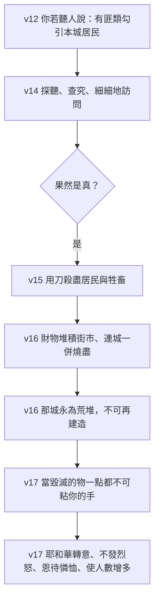

# 申命記 第13章

<!-- chapter-navigation:start -->
| [前一章](../05%20申命記/第12章.md) | [回目錄](../05%20申命記/全書目錄及綱要.md) | [下一章](../05%20申命記/第14章.md) |
| :--- | :---: | ---: |
<!-- chapter-navigation:end -->

1. 你們中間若有[[先知]]或是做夢的起來，向你顯個[[神蹟奇事不是真先知的憑證|神蹟奇事]]，
2. 對你說：我們去隨從你素來所不認識的別神，[[事奉與作奴僕同一字根（a.vad）|事奉他]]吧。他所顯的[[神蹟奇事不是真先知的憑證|神蹟奇事]]雖有應驗，
3. 你也不可聽那[[先知]]或是那做夢之人的話；因為這是耶和華─你們的神[[神的試驗|試驗你們]]，要知道你們是[[你要盡心盡性盡力愛耶和華（a.hav）|盡心盡性愛耶和華]]─你們的神不是。
4. 你們要順從耶和華─你們的神，[[敬畏神|敬畏他]]，謹守他的誡命，聽從他的話，[[事奉與作奴僕同一字根（a.vad）|事奉他]]，[[專靠（da.veq）|專靠]]他。
5. 那[[先知]]或是那做夢的既用言語叛逆那領你們[[出埃及|出埃及地]]、救贖你脫離[[為奴之家]]的耶和華─你們的神，要勾引你離開耶和華─你神所吩咐你行的道，你便要將他治死。這樣，就[[把那惡從你們中間除掉（ba.ar）|把那惡從你們中間除掉]]。
6. 你的同胞弟兄，或是你的兒女，或是你懷中的妻，或是如同你性命的朋友，若暗中引誘你，說：我們不如去事奉你和你列祖素來所不認識的別神─
7. 是你四圍列國的神。無論是離你近，離你遠，從地這邊到地那邊的神，
8. 你不可依從他，也不可聽從他，眼不可顧惜他。你不可憐恤他，也不可遮庇他，
9. 總要殺他；[[石刑|你先下手]]，然後眾民也下手，將他治死。
10. 要[[石刑|用石頭打死他]]，因為他想要勾引你離開那領你[[出埃及|出埃及地]][[為奴之家]]的耶和華─你的神。
11. 以色列眾人都要聽見害怕，就不敢在你們中間再行這樣的惡了。
12. 在耶和華─你神所賜你居住的各城中，你若聽人說，有些[[匪類（be.liy.ya.al）|匪類]]從你們中間的一座城出來勾引本城的居民，說：我們不如去事奉你們素來所不認識的別神；
13. 併於上節。
14. 你就要[[探聽查究細細地訪問（da.rash、cha.qar、sha.al）|探聽，查究，細細地訪問]]，果然是真，準有這可憎惡的事行在你們中間，
15. 你必要用刀殺那城裡的居民，把城裡所有的，連牲畜，都用刀[[滅絕（herem）|殺盡]]。
16. 你從那城裡所奪的財物都要堆積在街市上，用火將城和其內所奪的財物都在耶和華─你神面前燒盡；那城就永為[[荒堆（tel）|荒堆]]，不可再建造。
17. 那[[滅絕（herem）|當毀滅的物]]連一點都不可粘你的手。你要聽從耶和華─你神的話，遵守我今日所吩咐你的一切誡命，行耶和華─你神[[各人行自己眼中看為正的事|眼中看為正的事]]，耶和華就必轉意，不發烈怒，恩待你，憐恤你，照他向你列祖所起的誓使你人數增多。
18. 併於上節。

---

## 本章知識節點

### 主題
- [[神蹟奇事不是真先知的憑證]]
- [[先知]]
- [[為奴之家]]
- [[各人行自己眼中看為正的事]]

### 神學
- [[把那惡從你們中間除掉（ba.ar）]]
- [[滅絕（herem）]]
- [[神蹟（miraculous signs）]]
- [[神的試驗]]
- [[試探的本質]]
- [[敬畏神]]
- [[專一敬拜]]
- [[亞伯拉罕之約]]

### 原文
- [[匪類（be.liy.ya.al）]]
- [[探聽查究細細地訪問（da.rash、cha.qar、sha.al）]]
- [[荒堆（tel）]]
- [[專靠（da.veq）]]
- [[事奉與作奴僕同一字根（a.vad）]]
- [[你要盡心盡性盡力愛耶和華（a.hav）]]
- [[求問與訪問同一個字（da.rash）]]

### 歷史
- [[出埃及]]

### 背景
- [[石刑]]

### 解經爭議
- [[殺盡米甸人的道德難題]]

### 互文
- [[林前5：13|林前5：13 把那惡人從你們中間趕出去]]

---

## 本章整理

### 三種來源，同一個問題（全章結構）

第十三章只處理一件事：有人要拉你去事奉別神，你該怎麼辦。經文把這件事拆成三種來源，各給一段。GT《聖經精讀本》把分類講得最清楚：摩西在本章分三個類型訓戒將要發生的虛假宗教之誘惑，那就是來自假先知的誘惑（1-5節）、來自家人與親戚的誘惑（6-11節）、來自群眾的誘惑（12-18節）。CT 的內容綱要與 KC 的分段完全一致。

GT《聖經精讀本》還指出這一章與上一章的接續關係：前章教訓境內只能有一個中央聖所，是為了防止亂設敬拜場所；本章則轉向另一個方向，警戒來自內部各種勢力的拜偶像誘惑。KC 說得更直白：申13 直接接著上一章最後幾節而來。

| 段落 | 引誘來自誰 | 手法 | 處置 |
|---|---|---|---|
| v1-5 | 先知或做夢的 | 公開行神蹟奇事，而且應驗 | 不可聽，將他治死 |
| v6-11 | 同胞弟兄、兒女、懷中的妻、如同性命的朋友 | 暗中引誘 | 不可顧惜，你先下手用石頭打死 |
| v12-18 | 匪類，影響到整座城 | 勾引本城居民 | 先查證，然後全城殺盡燒盡 |

三段有一個共用的動詞。STEP語言資料顯示第5節「勾引你離開」是 le./ha.di.cha./Kha、第12節「勾引本城的居民」是 va/i.ya.Di.chu，同為 H5080（na.dach: to banish）；CT〔原文字義〕在兩處都註「勾引…離開」趕離，趕出，並在第10節說『勾引你離開』按原文意指「趕逐你離開」。引誘者的身分一路變，動作卻始終是同一個——把人從耶和華那裡趕開。

### 神蹟應驗了也不算（v1-5）

第一段設的情境最難：那人行了神蹟奇事，而且第2節說「他所顯的神蹟奇事雖有應驗」。經文的回答是第3節——你也不可聽。

STEP語言資料顯示第1節「神蹟」是 'ot（H226G，ot: sign: miraculous）、「奇事」是 mo.Fet（H4159，mo.phet: wonder）；「做夢的」在原文是兩個字，cho.Lem cha.Lom（H2492B ＋ H2472），CT〔原文字義〕註的正是「做夢的(原文雙字)」做夢(首字)；夢(次字)。GT《啟導本聖經申命記註釋》另分辨兩個詞的分工：「神蹟」為指示將來的預兆，「奇事」是證明先知或作夢的確有能力的異事，不過二詞常用作同義詞（見 [[神蹟（miraculous signs）]]、[[先知]]）。

判準因此不在能力上。GT《啟導本聖經申命記註釋》說：「真先知的憑證不是有無行神蹟的能力（十七1），而是他的信息和工作是否符合神所啟示的客觀標準，是否合乎基本信仰。」GT《申命記雷氏研讀本》補上一句更難接受的：「為了試驗神的子民，神也容許假先知的預言應驗」。KC 的結論相同：「It is not the sign or the wonder that is decisive, but the Word of God.」（決定性的不是神蹟或奇事，而是神的話。）（見 [[神蹟奇事不是真先知的憑證]]）

> [!note]
> CT 在第3節把界線劃得很小心，值得照著讀：這話並非告訴我們神主動利用假先知行神蹟奇事，因為邪靈也會行超自然的事；神乃是容許假先知行騙，以顯明人的存心。GT《聖經精讀本》從另一邊補上分辨——神的試驗與撒但的試探不同，撒但的試探是在人心裡勾起犯罪的衝動，神的試驗則是熬煉百姓的教育過程（見 [[神的試驗]]、[[試探的本質]]）。

第3節說這是要知道「你們是盡心盡性愛耶和華─你們的神不是」。STEP語言資料顯示「愛」是 'o.ha.Vim（H157G，a.hav: to love），後面接 be./khol le.vav./Khem（H3824 心）與 naf.she./Khem（H5315G 魂）；CT 說『盡心盡性』原文是「全心全魂」。這句話比申6:5 少了「盡力」一項，其餘完全相同（見 [[你要盡心盡性盡力愛耶和華（a.hav）]]）。

第4節接著給出正面的清單，CT 說這是六件事。STEP語言資料顯示六個動詞依序是 te.Le.khu（H1980I，ha.lakh: to go: walk）順從、ti.Ra.'u（H3372H，ya.re: to fear: revere）敬畏、tish.Mo.ru（H8104G，sha.mar: to keep: obey）謹守、tish.Ma.'u（H8085H，sha.ma: to hear: obey）聽從、ta.'a.Vo.du（H5647H，a.vad: to serve）事奉、tid.ba.Ku/n（H1692，da.vaq: to cleave）專靠。CT 把最後一個解作牢牢地聯結、緊緊依附著祂（見 [[敬畏神]]、[[事奉與作奴僕同一字根（a.vad）]]、[[專靠（da.veq）]]）。

### 最親的人也不例外（v6-11）

第二段換成暗中的引誘。第6節列的四種人一個比一個近：同胞弟兄、兒女、懷中的妻、如同你性命的朋友。STEP語言資料顯示第一個其實寫得更具體——'a.Chi./kha ven- 'I.me./kha，直譯是你的弟兄、你母親的兒子；「暗中」是 ba./Se.ter（H5643A，se.ter: secrecy），「引誘」是 ye.si.te./Kha（H5496，sut: to incite），CT〔原文字義〕註「暗中」遮蓋，秘密；「引誘」煽動，唆使。KC 特別解釋「如同你性命的朋友」：那是一種親近到彷彿一個靈魂用兩個身體說話的關係。

第8節一口氣下了五道禁令，CT 逐個給了對應的英文：『依從』指同意（consent）、『聽從』指聽信（hearken）、『顧惜』指看為可憐（pity）、『憐恤』指寬容（spare）、『遮庇』指掩蓋（conceal）。STEP語言資料的五個動詞也是分開的：to.Veh（H14）、tish.Ma'（H8085G）、ta.Chos（H2347，chus: to pity）、tach.Mol（H2550，cha.mal: to spare）、te.kha.Seh（H3680，ka.sah: to cover）。最後一項尤其重要——KC 指出「也不可聽從他」也可能包含另一件事：引誘者會要求你即使不從也別聲張，這樣祕密就守住了，他可以繼續去害別人。

第9節的程序寫得很細：你先下手，然後眾民也下手。STEP語言資料顯示這裡用了兩個對稱的詞——ya.de./Kha（你的手）配 va./ri.sho.Nah（H7223G，first），ve./Yad kol- ha./'Am（眾民的手）配 ba./'a.cha.ro.Nah（H314，last）。GT《聖經精讀本》說明制度背景：以色列的審判制度至少要有兩個以上的證人才能判其有罪，判死刑時規定證人先舉石打罪人，之後周圍的眾人一起拿石頭打死他。KC 解釋為什麼要這樣安排：第一個見證人必須第一個丟石頭，他不能控告了人卻把執行交給別人，這份牽連會讓人不敢輕率地指控別人。BH 說法一致，稱這是防止誣告的保護機制（見 [[石刑]]）。

第11節說出這一切要達到的效果：以色列眾人都要聽見害怕，就不敢在你們中間再行這樣的惡了。GT《申命記串珠聖經註釋》說這表示刑罰要公開執行，以警效尤。

### 一整座城背道時（v12-18）

第三段的規模最大。第12節說有些匪類從你們中間的一座城出來勾引本城的居民。CT 指出『匪類』原文是「比列的子孫」，意指魔鬼的兒女；GT《申命記串珠聖經註釋》說這個字意指沒有價值、卑賤之子，希伯來文讀音是彼列，原意可能是吞吃，新約用它來形容撒但（見 [[匪類（be.liy.ya.al）]]）。

但經文沒有立刻動手。第14節先插進三個動詞：探聽、查究、細細地訪問。STEP語言資料顯示它們是三個不同的字——ve./da.rash.Ta（H1875，da.rash: to seek）、ve./cha.kar.Ta（H2713，cha.qar: to search）、ve./sha.'al.Ta（H7592，sha.al: to ask），後面再接一個作副詞用的 hei.Tev（H3190，不定詞絕對式）。GT《聖經精讀本》解釋這種寫法的用意：「三次重複使用意義相近的動詞是為了強調,與偶像崇拜罪的嚴重性及其處罰的重要性,決不聽信風聞,必充分、慎重且公正,徹底地調查、處置。」CT 的話中之光說得更短：「神不接受傳聞，但人都不注意的常把傳聞當真實。」KC 補上一個先例——他說神自己也是這樣做的，並舉所多瑪與蛾摩拉那一次為例（創18:21）（見 [[探聽查究細細地訪問（da.rash、cha.qar、sha.al）]]、[[求問與訪問同一個字（da.rash）]]）。

處置的用語是 herem。STEP語言資料顯示第15節「殺盡」是 ha.cha.Rem（H2763A，cha.ram: to devote/destroy，不定詞絕對式），第17節「當毀滅的物」是 ha./Che.rem（H2764A，che.rem: devoted thing）——動詞與名詞正好一對。GT《申命記串珠聖經註釋》說整座城都該被摧毀，如同迦南地的城邑一樣（見 [[滅絕（herem）]]、[[殺盡米甸人的道德難題]]）。

第16節的收尾是永久性的：那城就永為荒堆，不可再建造。STEP語言資料的「荒堆」是 tel（H8510，tel: mound）；BH 指出這個詞在考古上很有份量，許多被毀的古城後來就層層堆疊成了土丘（見 [[荒堆（tel）]]）。

> [!important]
> 第4節命令百姓「專靠他」，第17節命令當毀滅的物「連一點都不可粘你的手」。STEP語言資料顯示這兩個動詞是同一個字根：第4節是 tid.ba.Ku/n、第17節是 yid.Bak，都是 H1692（da.vaq: to cleave）。CT〔原文字義〕在兩處給的中文也完全相同——「專靠」附著，黏住，緊靠；「粘」附著，黏住，緊靠。全章因此有一個原文上的收束：該黏的黏住，不該黏的一點都不可沾。

### 除掉那惡，然後神轉意

貫穿全章的是一句公式。第5節說「這樣，就把那惡從你們中間除掉」，STEP語言資料顯示「除掉」是 u./vi.'ar.Ta（H1197I，ba.ar: to burn: purge），CT〔原文字義〕註「除掉(原文雙同字)」消耗，燒盡，並說原文意指用火燒除，含有除惡務盡的意思。GT《啟導本聖經申命記註釋》說這是為了消除作惡的和那罪惡本身，並列出這條公式在別處的出處。KC 數出這道命令在申命記共出現九次，並指出新約的對應是給哥林多教會的「Remove the wicked man from among yourselves」（把那惡人從你們中間趕出去）（見 [[把那惡從你們中間除掉（ba.ar）]]、[[林前5：13]]）。

KC 在這裡加了一層平衡，值得照著讀完：恨惡罪惡與愛惜罪人是兩件事，不可與惡有交通，但對被過犯所勝的人仍要用溫柔的心把他挽回，並且自己也要小心免得被引誘。

最後一節的方向是反過來的。第17節說當毀滅的物一點都不可粘手，接著是「耶和華就必轉意，不發烈怒，恩待你，憐恤你，照他向你列祖所起的誓使你人數增多」。STEP語言資料顯示「恩待」是 ve./na.tan- ra.cha.Mim（H5414G 給 ＋ H7356B，ra.cha.mim: compassion），「憐恤」是 ve./ri.cham./Kha（H7355，ra.cham: to have compassion），「使你人數增多」是 ve./hir.Be./kha（H7235A，ra.vah: to multiply）。CT〔原文字義〕給的是「恩待(原文雙字)」憐憫，子宮(首字)；給，置，放(次字)，正好對得上 STEP 的兩個字（見 [[亞伯拉罕之約]]）。

> [!question]
> 全章從頭到尾在講除掉，最後一句卻在講增多。KC 注意到這個張力：滅一座城必然損失人口，而這個順服的舉動卻連著神必使他們再增多的應許。BH 則把它接回神向亞伯拉罕起誓的後裔繁多（創12:2、15:5）。本章沒有解釋這兩件事怎麼並存，只是把它們寫在同一節裡。

這一章與上一章也有一條線。申12:8 說「各人行自己眼中看為正的事」是不可以的，申12:25、28 兩次要人行「耶和華眼中看為正的事」；本章第17節的收尾用的正是同一句——行耶和華你神眼中看為正的事（見 [[各人行自己眼中看為正的事]]、[[專一敬拜]]、[[為奴之家]]、[[出埃及]]）。兩章都以這個判準作結，只是申12 收的是敬拜的地點與飲食，申13 收的是面對引誘時的取捨。

**參考資料**
https://www.ccbiblestudy.org/Old%20Testament/05Deut/05CT13.htm
https://www.ccbiblestudy.org/Old%20Testament/05Deut/05GT13.htm
https://www.kingcomments.com/en/bible-studies/Deu/13
https://biblehub.com/study/deuteronomy/13.htm
https://github.com/STEPBible/STEPBible-Data

<!-- appendix-links:start -->
## 附錄

### 相關地圖
- [[appendix/fhl_maps/maps/025|〈申圖一〉應許之地全圖]]
<!-- appendix-links:end -->

<!-- chapter-navigation:start -->
| [前一章](../05%20申命記/第12章.md) | [回目錄](../05%20申命記/全書目錄及綱要.md) | [下一章](../05%20申命記/第14章.md) |
| :--- | :---: | ---: |
<!-- chapter-navigation:end -->
