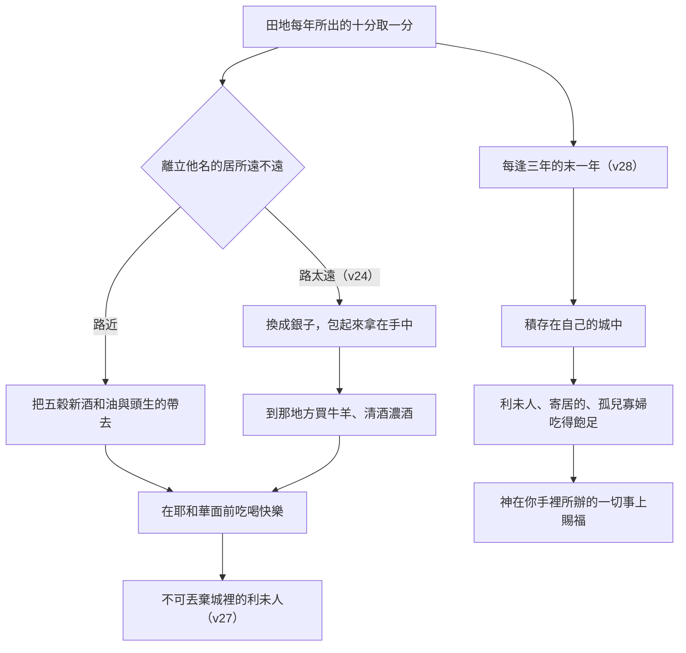

# 申命記 第14章

<!-- chapter-navigation:start -->
| [前一章](../05%20申命記/第13章.md) | [回目錄](../05%20申命記/全書目錄及綱要.md) | [下一章](../05%20申命記/第15章.md) |
| :--- | :---: | ---: |
<!-- chapter-navigation:end -->

1. 你們是耶和華─你們[[神的兒女]]。不可[[不可效法外邦喪儀習俗（剃髮劃身刺花紋）|為死人用刀劃身]]，也不可[[不可效法外邦喪儀習俗（剃髮劃身刺花紋）|將額上剃光]]。
2. 因為你歸耶和華─你神為[[聖潔|聖潔的民]]，耶和華從地上的萬民中[[神的揀選|揀選]]你[[屬我的子民|特作自己的子民]]。
3. 凡[[可憎的物（to.e.vah）|可憎的物]]都不可吃。
4. 可吃的牲畜就是牛、綿羊、山羊、
5. 鹿、羚羊、麅子、野山羊、麋鹿、黃羊、青羊。
6. 凡[[分蹄倒嚼（潔淨走獸的判準）|分蹄成為兩瓣又倒嚼]]的走獸，你們都可以吃。
7. 但那些倒嚼或是分蹄之中不可吃的乃是駱駝、兔子、沙番─因為是[[分蹄倒嚼（潔淨走獸的判準）|倒嚼不分蹄]]，就與你們[[潔淨與不潔淨|不潔淨]]；
8. [[豬與異教祭祀的關聯|豬]]─因為是分蹄卻不倒嚼，就與你們[[潔淨與不潔淨|不潔淨]]。這些獸的肉，你們不可吃，死的也不可摸。
9. 水中可吃的乃是這些：凡[[有翅有鱗（潔淨水族的判準）|有翅有鱗]]的都可以吃；
10. 凡[[有翅有鱗（潔淨水族的判準）|無翅無鱗]]的都不可吃，是與你們[[潔淨與不潔淨|不潔淨]]。
11. 凡潔淨的鳥，你們都可以吃。
12. 不可吃的乃是[[不潔淨雀鳥（二十種可憎飛禽）|鵰、狗頭鵰、紅頭鵰]]、
13. 鸇、小鷹、鷂鷹與其類，
14. 烏鴉與其類，
15. 鴕鳥、夜鷹、魚鷹、鷹與其類，
16. 鴞鳥、貓頭鷹、角鴟、
17. 鵜鶘、禿鵰、鸕鶿、
18. 鸛、鷺鷥與其類，戴鵀與蝙蝠。
19. 凡有翅膀爬行的物是與你們[[潔淨與不潔淨|不潔淨]]，都不可吃。
20. 凡潔淨的鳥，你們都可以吃。
21. 凡[[自死的（ne.ve.lah）|自死的]]，你們都不可吃，可以給[[城門口公共場合|你城裡]][[寄居的]]吃，或賣與外人吃，因為你是歸耶和華─你神為[[聖潔|聖潔的民]]。[[出23：19不可用山羊羔母奶煮山羊羔|不可用山羊羔母的奶煮山羊羔]]。
22. 你要把你撒種所產的，就是你田地每年所出的，[[三種什一奉獻的區分|十分取一分]]；
23. 又要把你的[[五穀、新酒和油（da.gan、ti.rosh、yits.har）|五穀、新酒、和油]]的[[十分之一]]，並牛群羊群中[[頭生歸神|頭生的]]，吃在耶和華─你神面前，就是他所選擇要[[立他名的居所（中央聖所）|立為他名的居所]]。這樣，你可以[[學習與教訓同一字根（la.mad）|學習]]時常[[敬畏神|敬畏耶和華]]─你的神。
24. 當耶和華─你神賜福與你的時候，耶和華─你神所選擇要[[立他名的居所（中央聖所）|立為他名的地方]]若離你太遠，那路也太長，使你不能把這物帶到那裡去，
25. 你就可以[[換成銀子上聖所|換成銀子]]，將銀子包起來，拿在手中，往耶和華─你神所要選擇的地方去。
26. 你用這銀子，[[隨心所欲（av.vah、ne.phesh）|隨心所欲]]，或買牛羊，或買[[遠離葡萄樹與酒|清酒濃酒]]，凡你心所想的都可以買；你和你的家屬在耶和華─你神的面前[[在耶和華面前歡樂|吃喝快樂]]。
27. 住在[[城門口公共場合|你城裡]]的[[利未支派|利未人]]，你不可丟棄他，因為他在你們中間[[耶和華是事奉者的業與分|無分無業]]。
28. 每逢三年的末一年，你要將[[利未人的什一奉獻|本年的土產十分之一]]都取出來，積存在你的城中。
29. 在[[城門口公共場合|你城裡]][[耶和華是事奉者的業與分|無分無業]]的[[利未支派|利未人]]，和你城裡[[寄居的]]，並[[孤兒寡婦]]，都可以來，吃得飽足。這樣，耶和華─你的神必在你手裡所辦的一切事上賜福與你。

---

## 本章知識節點

### 神學
- [[神的兒女]]
- [[屬我的子民]]
- [[神的揀選]]
- [[聖潔]]
- [[潔淨與不潔淨]]
- [[敬畏神]]
- [[頭生歸神]]
- [[利未人的什一奉獻]]
- [[耶和華是事奉者的業與分]]

### 主題
- [[不可效法外邦喪儀習俗（剃髮劃身刺花紋）]]
- [[分蹄倒嚼（潔淨走獸的判準）]]
- [[有翅有鱗（潔淨水族的判準）]]
- [[不潔淨雀鳥（二十種可憎飛禽）]]
- [[三種什一奉獻的區分]]
- [[換成銀子上聖所]]
- [[立他名的居所（中央聖所）]]
- [[在耶和華面前歡樂]]
- [[孤兒寡婦]]
- [[遠離葡萄樹與酒]]

### 原文
- [[可憎的物（to.e.vah）]]
- [[自死的（ne.ve.lah）]]
- [[五穀、新酒和油（da.gan、ti.rosh、yits.har）]]
- [[寄居的]]
- [[隨心所欲（av.vah、ne.phesh）]]
- [[學習與教訓同一字根（la.mad）]]
- [[十分之一]]

### 文化
- [[豬與異教祭祀的關聯]]

### 人物
- [[利未支派]]

### 歷史
- [[城門口公共場合]]

### 解經爭議
- [[出23：19不可用山羊羔母奶煮山羊羔]]

---

## 本章整理

### 先講身分，再講規矩（v1-2）

這一章開頭沒有先講該做什麼，而是先講你是誰：「你們是耶和華─你們神的兒女。」摩西把 [[神的兒女]] 這個稱呼放在最前面，後面所有關於吃、關於奉獻的條文，理由都要回到這一句。STEP語言資料顯示「兒女」是 ba.Nim（H1121A，簡要詞典義 ben: son: child，陽性複數）。CT 的話中之光注意到一個排列上的細節：這個稱呼與第2節的聖潔的民在原文裡都被放在句首，是刻意把身分講在前頭。

第2節接著給出兩個並列的說明。一個是 [[神的揀選|揀選]]——STEP語言資料的 ba.Char（H977，ba.char: to choose）是完成式，事情已經定了；另一個是 [[屬我的子民|特作自己的子民]]，STEP語言資料為 se.gu.Lah（H5459，簡要詞典義 se.gul.lah: possession）。CT 的話中之光把這個詞的分量講了出來：「特作自己的子民」原文是「作自己貴重的財產」，指借著分配擄物或遺產而得的財寶。這不是泛稱的百姓，而是君王私藏的那一份。

身分定了，第1節下半立刻推出第一條禁令：不可為死人用刀劃身，也不可將額上剃光。STEP語言資料顯示「用刀劃身」是 tit.go.de.Du（H1413，ga.dad: to cut），「額上剃光」是 ka.re.Chah（H7144，qor.chah: bald spot），而中文的「額上」在原文是 bein 加 'ei.nei./Khem，字面是在你們眼睛之間。這正是 [[不可效法外邦喪儀習俗（剃髮劃身刺花紋）]] 在申命記的版本。各家給的背景一致：GT《申命記雷氏研讀本》說「這些為死人哀悼的做法——迦南人為了承認死者為神而有的做法——是神的子民所嚴禁的」；GT《聖經精讀本》說「此律例嚴禁為死人而自傷其身」，並補上一個當時的社會常識——「在習慣上希伯來人不剃額上之發,故光頭大都是被羞辱與蔑視的對象」；BH 說「Cutting oneself was often a ritualistic act to appease or communicate with the dead or deities.」（自割常是一種儀式性的作法，用來安撫死者或神明，或與他們溝通。）KC 則把它接回身分：這樣尊貴的地位與外邦人的哀悼方式並不相容，神兒子面對死亡的方式，本來就與世人處理死亡的方式完全不同。

### 潔與不潔：一套原則，四張清單（v3-21）

第3節只有一句「凡可憎的物都不可吃」，它是整段的標題。STEP語言資料顯示 [[可憎的物（to.e.vah）|可憎的物]] 是 to.'e.Vah（H8441，簡要詞典義 to.e.vah: abomination）。接下來的清單按活動的空間分成四組，但四組的寫法並不一樣。

| 類別 | 判準 | 經節 |
| --- | --- | --- |
| 走獸 | 分蹄成為兩瓣，並且倒嚼——兩樣都要（見 [[分蹄倒嚼（潔淨走獸的判準）]]） | v4-8 |
| 水族 | 有翅有鱗（見 [[有翅有鱗（潔淨水族的判準）]]） | v9-10 |
| 飛鳥 | 沒有給判準，只列出不可吃的名單（見 [[不潔淨雀鳥（二十種可憎飛禽）]]） | v11-18、v20 |
| 有翅膀爬行的物 | 一律算為不潔淨 | v19 |

走獸這一組的重點是兩樣缺一不可。第7節的駱駝、兔子、沙番倒嚼卻不分蹄，第8節的 [[豬與異教祭祀的關聯|豬]] 分蹄卻不倒嚼，兩邊都被判為不潔。CT 的話中之光把這個結構讀成一個原則：「分蹄與倒嚼必須是一同具有的，只有其中一樣還是不潔的。」KC 說的是同一件事：「Both characteristics must be present.」（兩樣特徵都必須具備。）他並把只重教義不重實踐比作法利賽人的說而不行。

水族只有一條判準。KC 對這兩樣東西的解釋是：「The scales are an armor, a separation between the animal and the environment in which it is in.」（鱗是一副鎧甲，是這動物與牠所處環境之間的隔離。）鰭則負責推進與定向。他舉了一組人物對照——「Lot is someone who had scales. He did not take part in evil.」（羅得是有鱗的人，他沒有參與惡事。）但羅得沒有鰭，逃不出去；約瑟正好相反，同樣活在敗壞的環境裡，試探一來他就跑掉了。

飛鳥這一組最特別：經文只給名單，不給判準。CT 的話中之光從名單本身歸納出三個共同點——殘忍（喜歡吃肉和血）、孤獨痛苦（喜歡陰暗的地方）、吃不潔污穢的食物。GT《申命記雷氏研讀本》直接說「這些雀鳥在利未記十一章13節的腳註已經加以識別」，把讀者指回利未記。BH 逐鳥說明時注意到一件事：蝙蝠是這份「鳥」的名單裡唯一的哺乳類。

> [!note]
> 為什麼這樣分？GT《申命記串珠聖經註釋》整理出學者的三大類看法——衛生（有研究測出不潔之物的毒性較高）、宗教（不潔之物象徵迦南宗教或與其獻祭有關）、細菌（兔子、沙番、無翅無鱗之物、蝙蝠等是帶菌者）——但他同時聲明：「這些都不是聖經直接說明的。」GT《聖經精讀本》給的是屬靈層次的三個理由，其中一個是要以色列人在最基本的飲食生活上也與外邦人全然區別，常常紀念自己是神所分別為聖的百姓。

第21節把整段收在一個對照上：[[自死的（ne.ve.lah）|自死的]] 以色列人不可吃，卻可以給城裡 [[寄居的]] 吃、或賣給外人。STEP語言資料顯示「自死的」是 Ne.ve.lah（H5038），而同一個字在第8節「死的也不可摸」已經出現過一次。各家指出的理由都是血沒有流盡。同一節最後那句 [[出23：19不可用山羊羔母奶煮山羊羔|不可用山羊羔母的奶煮山羊羔]] 是這條禁令在律法書中第三次出現，KC 說得最直白：奶是給那小羊活命用的，不該拿來與牠的死連在一起。而第21節中間那一句「因為你是歸耶和華─你神為聖潔的民」，把理由再說一次，與第2節的 [[聖潔]] 宣告首尾呼應——判準不在肉，在吃的人。

### 十分之一不只一種（v22-29）

第22節起換了題目，但邏輯沒變。這一段最容易被誤讀的地方，是以為以色列人每年只交一次 [[十分之一]]。四套註釋在這件事上一致：不只一種。CT 在第22節列出三種，GT《聖經精讀本》把它們分別稱為第一、第二、第三十一奉獻，KC 也數出三份，詳細的分法見 [[三種什一奉獻的區分]]。本章寫的是後面兩種。

第二種要帶到 [[立他名的居所（中央聖所）|他所選擇要立為他名的居所]]，在那裡吃。第24至26節為住得遠的人開了一條路：可以 [[換成銀子上聖所|換成銀子]]，到了那裡再買回來。GT《啟導本聖經申命記註釋》說明得很實際——以色列人定居之後住的地方分散，距離敬拜的中心太遠，不方便把田地畜牧所產帶去奉獻，所以規定可以換成現金；他並記下一個生活細節，「銀子」為當日交易用的媒介。要注意可以改變的只是形式：第25節結尾仍然是往神所要選擇的地方去，第26節結尾仍然是 [[在耶和華面前歡樂|吃喝快樂]]。第26節那句「隨心所欲」的自由也在同一個框架裡，STEP語言資料的 te.'a.Veh（H183，a.vah: to desire）配上 naf.she./Kha（H5315I），細節見 [[隨心所欲（av.vah、ne.phesh）]]；買什麼可以自己決定，在哪裡吃、為什麼吃不能。

第三種在第28至29節。每逢三年的末一年，那年的十分之一不上聖所，而是「積存在你的城中」——STEP語言資料的「積存」是 ve./hi.nach.Ta（H5117，nu.ach: to rest），本章四次出現的「你城裡」原文都是 bi/sh.'a.Rei./kha（H8179H，簡要詞典義 sha.ar: gate: town），字面是你的城門。BH 在這裡補上背景：「The gates of a city were often the center of civic life, where legal matters were settled and community decisions were made」（城門常是城市公共生活的中心，法律事務在那裡了結，社群決議也在那裡作成），這正是 [[城門口公共場合]] 的功用。受惠的是 [[利未支派|利未人]]、寄居的與 [[孤兒寡婦]]，理由寫在第27節：他在你們中間無分無業，也就是 [[耶和華是事奉者的業與分]] 的否定面。CT 在本章末尾的話中之光把這條命令講成一種普遍責任：「眷顧比自己弱小的人，乃是每個人的責任」。

### 一句話貫穿全章

==本章沒有為任何一條規定給生理上的解釋，它給的一直是身分上的解釋。== 第2節說因為你歸耶和華為聖潔的民，第21節再說一次同一句話，第23節則把奉獻的目的講明：「這樣，你可以學習時常敬畏耶和華─你的神。」STEP語言資料的「學習」是 til.Mad（H3925H，la.mad: to learn），與 [[學習與教訓同一字根（la.mad）]] 是同一個字根；[[敬畏神|敬畏耶和華]] 在這裡不是一次的情緒，而是靠著每年一次的宴席、每三年一次的周濟，一點一點養成的。

> [!info]
> 「可憎」這個字在申命記前後幾章的分布值得一看。STEP 的鄰章查詢顯示同一個字（H8441）出現在申12:31、13:14、14:3、17:1、17:4，其中只有本章這一次用在食物上，其餘四次都指偶像敬拜或違約的獻祭。同一個原本用來講拜偶像的詞被放到餐桌上，正好接住了本章開頭的邏輯——身分若是神的兒女，分別就要一路延伸到最日常的地方。

**參考資料**
https://www.ccbiblestudy.org/Old%20Testament/05Deut/05CT14.htm
https://www.ccbiblestudy.org/Old%20Testament/05Deut/05GT14.htm
https://www.kingcomments.com/en/bible-studies/Deu/14
https://biblehub.com/study/deuteronomy/14.htm
https://github.com/STEPBible/STEPBible-Data

<!-- appendix-links:start -->
## 附錄

### 相關地圖
- [[appendix/fhl_maps/maps/025|〈申圖一〉應許之地全圖]]
<!-- appendix-links:end -->

<!-- chapter-navigation:start -->
| [前一章](../05%20申命記/第13章.md) | [回目錄](../05%20申命記/全書目錄及綱要.md) | [下一章](../05%20申命記/第15章.md) |
| :--- | :---: | ---: |
<!-- chapter-navigation:end -->
