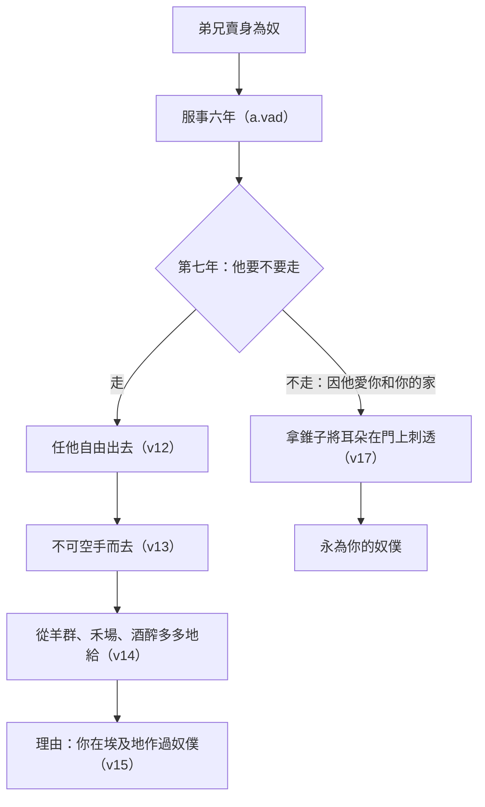

# 申命記 第15章

<!-- chapter-navigation:start -->
| [前一章](../05%20申命記/第14章.md) | [回目錄](../05%20申命記/全書目錄及綱要.md) | [下一章](../05%20申命記/第16章.md) |
| :--- | :---: | ---: |
<!-- chapter-navigation:end -->

1. [[安息年|每逢七年末一年]]，[[出23：10-11安息年執行|你要施行豁免]]。
2. [[申15：1-11|豁免的定例乃是這樣]]：凡債主要把所借給鄰舍的豁免了；不可向鄰舍和弟兄追討，因為耶和華的[[豁免（she.mit.tah）|豁免年]]已經宣告了。
3. 若借給外邦人，你可以向他追討；但借給你弟兄，無論是什麼，你要鬆手[[豁免（she.mit.tah）|豁免]]了。
4. 你若留意聽從耶和華─你神的話，謹守遵行我今日所吩咐你這一切的命令，就必在你們中間[[沒有窮人與窮人永不斷絕（ev.yon）|沒有窮人了]]（在耶和華─你神所賜你為業的地上，耶和華必大大[[神作為賜福的源頭|賜福與你]]。）
5. 併於上節。
6. 因為耶和華─你的神必照他所應許你的[[神作為賜福的源頭|賜福與你]]。你必借給許多國民，卻不致向他們借貸；你必管轄許多國民，他們卻不能管轄你。
7. 在耶和華─你神所賜你的地上，無論哪一座城裡，你弟兄中若有一個窮人，你不可[[鬆開手與揝著手（pa.tach、qa.phats）|忍著心、揝著手]]不幫補你窮乏的弟兄。
8. [[鬆開手與揝著手（pa.tach、qa.phats）|總要向他鬆開手]]，照他所缺乏的借給他，補他的不足。
9. 你要謹慎，不可心裡起[[匪類（be.liy.ya.al）|惡念]]，說：第七年的[[豁免（she.mit.tah）|豁免年]]快到了，你便惡眼看你窮乏的弟兄，什麼都不給他，以致他因你求告耶和華，罪便歸於你了。
10. 你總要給他，給他的時候心裡不可愁煩；因耶和華─你的神必在你這一切所行的，並你手裡所辦的事上，[[神作為賜福的源頭|賜福與你]]。
11. 原來那地上的[[沒有窮人與窮人永不斷絕（ev.yon）|窮人永不斷絕]]；所以我吩咐你說：總要向你地上[[保護弱勢|困苦窮乏的弟兄]][[鬆開手與揝著手（pa.tach、qa.phats）|鬆開手]]。
12. 你弟兄中，若有一個[[「希伯來人」的意義|希伯來男人或希伯來女人]][[弟兄賣身為奴不可像奴僕看待|被賣給你]]，[[事奉與作奴僕同一字根（a.vad）|服事你六年]]，到第七年就要[[申15：12-18|任他自由出去]]。
13. 你任他自由的時候，[[多多地給不可空手而去（a.naq、re.qam）|不可使他空手而去]]，
14. 要從你羊群、禾場、酒醡之中[[多多地給不可空手而去（a.naq、re.qam）|多多地給他]]；耶和華─你的神怎樣[[神作為賜福的源頭|賜福與你]]，你也要照樣給他。
15. 要記念你[[為奴之家|在埃及地作過奴僕]]，耶和華─你的神[[救贖|將你救贖]]；因此，我今日吩咐你這件事。
16. 他若對你說：[[永遠服事的奴僕|我不願意離開你]]，是因他愛你和你的家，且因在你那裡很好，
17. 你就要[[錐子穿耳|拿錐子將他的耳朵在門上刺透]]，[[穿耳的儀式|他便永為你的奴僕了]]。你待婢女也要這樣。
18. 你任他自由的時候，不可以為難事，因他[[事奉與作奴僕同一字根（a.vad）|服事你六年]]，較比雇工的工價多加一倍了。耶和華─你的神就必在你所做的一切事上[[神作為賜福的源頭|賜福與你]]。
19. 你[[頭生歸神|牛群羊群中頭生的]]，凡是公的，都要[[分別為聖]]，歸耶和華─你的神。牛群中頭生的，不可用他耕地；羊群中頭生的，不可剪毛。
20. 這頭生的，你和你的家屬，每年要在[[立他名的居所（中央聖所）|耶和華所選擇的地方]]，在耶和華─你神面前吃。
21. 這頭生的[[沒有殘疾的祭牲|若有什麼殘疾]]，就如瘸腿的、瞎眼的，無論有什麼惡殘疾，都不可獻給耶和華─你的神；
22. [[城門口公共場合|可以在你城裡吃]]；[[潔淨與不潔淨|潔淨人與不潔淨人]]都可以吃，就如吃[[野味|羚羊與鹿]]一般。
23. 只是[[脂油和血都不可吃|不可吃他的血]]；要倒在地上，如同倒水一樣。

---

## 本章知識節點

### 原文
- [[豁免（she.mit.tah）]]
- [[鬆開手與揝著手（pa.tach、qa.phats）]]
- [[多多地給不可空手而去（a.naq、re.qam）]]
- [[匪類（be.liy.ya.al）]]
- [[「希伯來人」的意義]]
- [[事奉與作奴僕同一字根（a.vad）]]
- [[錐子穿耳]]

### 解經爭議
- [[沒有窮人與窮人永不斷絕（ev.yon）]]
- [[出23：10-11安息年執行]]

### 神學
- [[安息年]]
- [[救贖]]
- [[頭生歸神]]
- [[分別為聖]]
- [[沒有殘疾的祭牲]]
- [[潔淨與不潔淨]]
- [[脂油和血都不可吃]]
- [[神作為賜福的源頭]]
- [[永遠服事的奴僕]]

### 主題
- [[弟兄賣身為奴不可像奴僕看待]]
- [[為奴之家]]
- [[立他名的居所（中央聖所）]]
- [[野味]]
- [[保護弱勢]]

### 背景
- [[穿耳的儀式]]

### 歷史
- [[城門口公共場合]]

### 互文
- [[申15：1-11|申15：1-11 豁免年與借貸條例（承出22：25）]]
- [[申15：12-18|申15：12-18 希伯來奴僕釋放不可空手（承出21：2-6）]]

---

## 本章整理

### 第七年讓債歇一歇（v1-11）

本章第一句就把整段定了調：「每逢七年末一年，你要施行豁免。」CT 直接指出「每逢七年末一年」就是 [[安息年]]。有意思的是，[[豁免（she.mit.tah）|豁免]] 這個字原本管的不是錢。STEP語言資料顯示第1、2、9 節的名詞是 she.mi.Tah（H8059，簡要詞典義 she.mit.tah: remission），第2、3 節的動詞是 sha.mat（H8058，簡要詞典義 to release）；CT 的文意註解說『豁免』原意指休耕(參出二十三11)，在此指免除債務，GT《申命記串珠聖經註釋》也說「豁免」：原指釋放、歇息（出23:10），本指第七年不耕地。GT《啟導本聖經申命記註釋》把這個轉移的理由補齊：利未記那一段只限農耕地，本章將此例適用到債項上，可能是因為靠田地收入維生的貧苦本國人一旦停耕會無力還債。

免掉多少，各家沒有一致的答案。GT《聖經精讀本》把兩種相反的看法並列，並給出三個理由傾向後一種——若每逢安息年就完全免除債務，「以色列社會中就會消失借貸金銀的事情」。

| 立場 | 主張 | 來源 |
| --- | --- | --- |
| 完全免除債務 | 債本身一筆勾銷 | GT《聖經精讀本》記為第一種看法 |
| 只是安息年不再追討 | 那一年不催逼，債仍在 | GT《聖經精讀本》記為第二種，並自己傾向這一種 |
| 取消或赦免 | 一項防止貧窮累積的激進安排 | BH |

第4節與第11節之間還有一個更明顯的張力：一句說「就必在你們中間沒有窮人了」，一句說「原來那地上的窮人永不斷絕」。這兩句話怎麼並存，見 [[沒有窮人與窮人永不斷絕（ev.yon）]]；四套來源的處理方式其實一致，都把第4節讀成條件式的理想、第11節讀成實況的預言。KC 說得最短：矛盾只是表面的。

第7至8節把命令縮到一個動作上。[[鬆開手與揝著手（pa.tach、qa.phats）|忍著心、揝著手]] 是一組，[[鬆開手與揝著手（pa.tach、qa.phats）|總要向他鬆開手]] 是另一組，經文把心與手擺在一起說。CT 的話中之光把這個對比講得很白：信仰是各人心裏的事，但信仰的表現是在手上；愛心，必須表現於行動，有張開的手。KC 從反面說同一件事：「A hardened heart holds its hand closed.」（一顆剛硬的心把它的手握住不放。）第9節則堵住這條命令最容易被繞開的那個縫——不可心裡起 [[匪類（be.liy.ya.al）|惡念]]，說第七年的豁免年快到了就什麼都不給。==那個「惡念」在原文，正是申13:13 用來稱呼引人拜偶像之人的同一個字。==

### 第七年讓人走出去（v12-18）

第二段換了對象：不是債，是人。[[「希伯來人」的意義|希伯來男人或希伯來女人]] 若 [[弟兄賣身為奴不可像奴僕看待|被賣給你]]，[[事奉與作奴僕同一字根（a.vad）|服事你六年]]，第七年就要 [[申15：12-18|任他自由出去]]。GT《啟導本聖經申命記註釋》指出這一段是《出埃及記》二十一2～6同一條例的修訂，並注意到一個具體的進展：「舊例只提希伯來男人，現在加了『希伯來女人』，可見婦女地位已有改善。」

真正新增的是第13至14節。出埃及記規定了六年期滿要放人，沒有規定放人時要給什麼；申命記補上 [[多多地給不可空手而去（a.naq、re.qam）|不可使他空手而去]]。CT 的原文字義在這裡留下一個很具畫面的註解：「多多地給(原文雙同字)」作華麗的項鍊(比喻多多地給)——STEP語言資料的簡要詞典義 a.naq: to ornament 指的是同一個字根。GT《聖經精讀本》把要給的三樣分別對應：羊群代表牲畜、禾場指禾穀、酒醡則代表水果。給多少沒有定額，第14節下半交給主人自己判斷：耶和華怎樣賜福與你，你也要照樣給他。第15節則給出根據——要 [[為奴之家|記念你在埃及地作過奴僕]]，耶和華 [[救贖|將你救贖]]。

奴僕若不願走，就走另一條路。第16節的理由寫在經文裡：[[永遠服事的奴僕|我不願意離開你]]，是因他愛你和你的家。接著是 [[錐子穿耳|拿錐子將他的耳朵在門上刺透]]，[[穿耳的儀式|他便永為你的奴僕了]]。CT 說開通耳朵含有『順服』之意(參詩四十6)。GT《聖經精讀本》補上一個既有記載之外的細節：「古代人視耳朵為隸屬的器官,因此,這是表示永遠為奴的儀式」，並說希伯來人在舉行此儀式後，將那錐子釘在主人家的門或門框上。第18節結尾則從主人的成本算給他聽：這人服事六年，較比雇工的工價多加一倍了。

### 頭生的歸神（v19-23）

第三段從人轉到牲畜。[[頭生歸神|牛群羊群中頭生的]]，凡是公的都要 [[分別為聖]]。經文緊接著禁止兩件事：不可用牠耕地、不可剪毛。CT 的解釋很直接——耕地即將屬神的挪來私用，剪毛是為商業用途，故不許可。==有一個原文上的巧合值得記下：第19節「耕地」與第12節「服事」在 STEP語言資料裡是同一個字根 a.vad（H5647）。== 同一個動作，用在奴僕身上要有期限，用在頭生的牲畜身上則完全禁止。

頭生的要 [[立他名的居所（中央聖所）|每年在耶和華所選擇的地方]] 吃。KC 注意到申命記與民數記在這裡的差別：民數記那邊只有祭司可以在聖所附近吃，這裡不談祭司也不談獻祭，神期待的是全體百姓都作祭司。

第21至23節處理例外。頭生的 [[沒有殘疾的祭牲|若有什麼殘疾]]，瘸腿的、瞎眼的，就不可獻上；CT 的話中之光說一切獻給神的都要是完全的，只要有一點點的不完全，神都不能悅納。但牠並不因此被浪費——[[城門口公共場合|可以在你城裡吃]]，而且 [[潔淨與不潔淨|潔淨人與不潔淨人]] 都可以吃，[[野味|就如吃羚羊與鹿]] 一般。

> [!note]
> 第22節這句「潔淨人與不潔淨人都可以吃」值得留意。BH 指出通常禮儀上不潔的人不可參與某些宗教活動或吃某些食物，這裡卻明文開了例外，正好凸顯這一次進食的非儀式性質——有殘疾的頭生牲畜既然不能獻，就不再算作聖物，可以當一般的肉吃。

只有一條線沒有放寬：[[脂油和血都不可吃|不可吃他的血]]，要倒在地上如同倒水一樣。

### 三段共用同一個節奏

==本章三段講的是三件不同的事，卻共用一個結構：第七年，把手裡握著的東西放開。== 第一段放的是債，第二段放的是人，第三段放的是牲畜中最好的那一份。CT 在第18節末尾把三段接在一起：無論是豁免年免除債務、第七年釋放希伯來奴隸，還是每年奉獻頭生的公牲畜，都是要人學習白白地放下自己的所有。

[[神作為賜福的源頭|賜福與你]] 這句話在本章出現五次（第4、6、10、14、18節），每一次都接在放手之後。KC 因此說豁免不會使人變窮，反而使人更富。這一段律法的邏輯不在計算，而在 [[保護弱勢|困苦窮乏的弟兄]] 與放手的人之間——第10節說得最完整：你總要給他，給他的時候心裡不可愁煩；因耶和華你的神必在你這一切所行的，並你手裡所辦的事上，賜福與你。

**參考資料**
https://www.ccbiblestudy.org/Old%20Testament/05Deut/05CT15.htm
https://www.ccbiblestudy.org/Old%20Testament/05Deut/05GT15.htm
https://www.kingcomments.com/en/bible-studies/Deu/15
https://biblehub.com/study/deuteronomy/15.htm
https://github.com/STEPBible/STEPBible-Data

<!-- appendix-links:start -->
## 附錄

### 相關地圖
- [[appendix/fhl_maps/maps/025|〈申圖一〉應許之地全圖]]
<!-- appendix-links:end -->

<!-- chapter-navigation:start -->
| [前一章](../05%20申命記/第14章.md) | [回目錄](../05%20申命記/全書目錄及綱要.md) | [下一章](../05%20申命記/第16章.md) |
| :--- | :---: | ---: |
<!-- chapter-navigation:end -->
