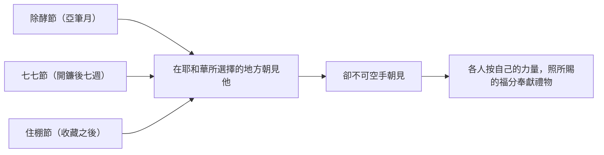

# 申命記 第16章

<!-- chapter-navigation:start -->
| [前一章](../05%20申命記/第15章.md) | [回目錄](../05%20申命記/全書目錄及綱要.md) | [下一章](../05%20申命記/第17章.md) |
| :--- | :---: | ---: |
<!-- chapter-navigation:end -->

1. 你要注意[[亞筆月]]，向耶和華─你的神守[[逾越節]]，因為耶和華─你的神在亞筆月夜間領你出埃及。
2. 你當在耶和華所選擇要[[立他名的居所（中央聖所）|立為他名的居所]]，從牛群羊群中，將[[逾越節|逾越節的祭]]牲獻給耶和華─你的神。
3. 你吃這祭牲，不可吃有酵的餅；[[無酵節|七日之內要吃無酵餅]]，就是[[困苦餅（le.chem o.ni）|困苦餅]]─你本是急忙出了埃及地─要叫你一生一世記念你從埃及地出來的日子。
4. 在你四境之內，七日不可見麵酵，頭一日晚上所獻的肉，一點不可留到早晨。
5. 在耶和華─你神所賜的各城中，你不可獻[[逾越節|逾越節的祭]]；
6. 只當在耶和華─你神所選擇要[[立他名的居所（中央聖所）|立為他名的居所]]，晚上日落的時候，乃是你出埃及的時候，獻[[逾越節|逾越節的祭]]。
7. 當在耶和華─你[[立他名的居所（中央聖所）|神所選擇的地方]]把肉烤了吃（烤：或作煮），次日早晨就回到你的帳棚去。
8. 你要吃[[無酵餅]]六日，第七日要向耶和華─你的神[[嚴肅會（a.Tze.ret）|守嚴肅會]]，不可做工。
9. 你要計算七七日：從你開鐮收割禾稼時算起，共計七七日。
10. 你要照耶和華─你神所賜你的福，手裡拿著[[平安祭的三類（感謝祭、還願祭、甘心祭）|甘心祭]]，獻在耶和華─你的神面前，守[[七七節（五旬節）|七七節]]。
11. 你和你兒女、僕婢，並住在你城裡的[[利未支派|利未人]]，以及在你們中間[[寄居的]]與[[孤兒寡婦]]，都要在耶和華─你神所選擇[[立他名的居所（中央聖所）|立為他名的居所]]，[[在耶和華面前歡樂|在耶和華─你的神面前歡樂]]。
12. 你也要記念[[為奴之家|你在埃及作過奴僕]]。你要謹守遵行這些律例。
13. 你把禾場的穀、酒醡的酒收藏以後，就要守[[住棚節（利23節期規定）|住棚節]]七日。
14. 守節的時候，你和你兒女、僕婢，並住在你城裡的[[利未支派|利未人]]，以及[[寄居的]]與[[孤兒寡婦]]，都要歡樂。
15. 在耶和華所選擇的地方，你當向耶和華─你的神守節七日；因為耶和華─你神在你一切的土產上和你手裡所辦的事上要賜福與你，你就非常地歡樂。
16. 你一切的男丁要在[[逾越節與無酵節的名稱重疊|除酵節]]、[[七七節（五旬節）|七七節]]、[[住棚節（利23節期規定）|住棚節]]，[[三大節期|一年三次]]，在耶和華─你[[立他名的居所（中央聖所）|神所選擇的地方]]朝見他，[[多多地給不可空手而去（a.naq、re.qam）|卻不可空手朝見]]。
17. 各人要按自己的力量，照耶和華─你神所賜的福分，奉獻禮物。
18. 你要在耶和華─你神[[城門口公共場合|所賜的各城裡]]，按著各支派設立[[審判官]]和[[以色列人的官長|官長]]。他們必[[司法公義|按公義的審判判斷百姓]]。
19. [[審判不可行不義按公義審判|不可屈枉正直]]；[[不可看人的外貌（na.khar）|不可看人的外貌]]。[[古代近東賄賂|也不可受賄賂]]；因為[[賄賂使智慧人的眼變瞎（sha.chad）|賄賂能叫智慧人的眼變瞎了]]，[[箴17：23|又能顛倒義人的話]]。
20. 你要追求[[至公至義（tse.deq tse.deq）|至公至義]]，好叫你存活，承受耶和華─你神所賜你的地。
21. 你為耶和華─你的神築壇，不可在壇旁栽什麼樹木作為[[亞舍拉（木偶）|木偶]]。
22. 也不可為自己設立[[柱像]]；這是耶和華─你神所恨惡的。

---

## 本章知識節點

### 歷史
- [[逾越節]]
- [[無酵節]]
- [[七七節（五旬節）]]
- [[住棚節（利23節期規定）]]
- [[城門口公共場合]]

### 原文
- [[亞筆月]]
- [[無酵餅]]
- [[困苦餅（le.chem o.ni）]]
- [[嚴肅會（a.Tze.ret）]]
- [[至公至義（tse.deq tse.deq）]]
- [[賄賂使智慧人的眼變瞎（sha.chad）]]
- [[不可看人的外貌（na.khar）]]
- [[審判官]]
- [[柱像]]
- [[多多地給不可空手而去（a.naq、re.qam）]]
- [[寄居的]]

### 解經爭議
- [[逾越節與無酵節的名稱重疊]]

### 神學
- [[三大節期]]
- [[司法公義]]

### 主題
- [[立他名的居所（中央聖所）]]
- [[在耶和華面前歡樂]]
- [[為奴之家]]
- [[孤兒寡婦]]
- [[平安祭的三類（感謝祭、還願祭、甘心祭）]]
- [[審判不可行不義按公義審判]]

### 人物
- [[利未支派]]
- [[以色列人的官長]]

### 背景
- [[亞舍拉（木偶）]]
- [[古代近東賄賂]]

### 互文
- [[箴17：23|箴17：23 惡人受賄顛倒公義（承出23：8）]]

---

## 本章整理

### 從一塊苦餅開始（v1-8）

本章第一句就把節期綁在一個月份上：「你要注意亞筆月，向耶和華─你的神守逾越節」——[[亞筆月]] 與 [[逾越節]] 在這裡是同一件事的時間與名稱。STEP語言資料的 ha./'a.Viv（H24）配上 Cho.desh（H2320G）就是這個月名。CT 說『亞筆月』原為希伯來民曆七月份，相當於陽曆三、四月間，後來被神於出埃及時改為正月；GT《申命記串珠聖經註釋》一句話補完：「亞筆月」：即陽曆三月或四月。BH 說 The month of Abib, later known as Nisan, corresponds to March-April in the modern calendar.（亞筆月，後來稱為尼散月，相當於現代曆法的三至四月。）

接下來的重點不是日期，是地點。第2節說要「當在耶和華所選擇要立為他名的居所」獻祭，第5節反過來說「在耶和華─你神所賜的各城中，你不可獻逾越節的祭」。同一句提醒在本章前後出現七次。CT 的話中之光注意到這個重複本身：神三番四次的提醒祂的子民，要切切的注意祂選擇立為祂名的居所（參2，6，7，11，15，16節），並說作這樣多次數的提醒，正是神要祂的子民該學習注意神的同在，過於神的所賜。相關的地點條例見 [[立他名的居所（中央聖所）]]。

第3節給 [[無酵餅]] 取了另一個名字：[[困苦餅（le.chem o.ni）|困苦餅]]。STEP語言資料為 Le.chem（H3899H）加 'O.ni（H6040，簡要詞典義 affliction）。GT《聖經精讀本》說之所以這樣稱呼，是為了使以色列百姓記起在埃及400年為奴生活的痛苦與苦澀。同一節的「急忙」是 ve./chi.pa.Zon（H2649），CT 的原文字義給的是驚恐、驚慌地、慌張逃逸。==所以這塊餅同時記著兩件事：在埃及過的日子，和離開埃及那一夜的匆促。== KC 指出整段從第3節的困苦之餅開頭、到第15節的完全歡樂結尾。

第8節把 [[無酵節|七日之內要吃無酵餅]] 收在一個聚會上：[[嚴肅會（a.Tze.ret）|守嚴肅會]]，不可做工。GT《啟導本聖經申命記註釋》說「嚴肅會」也可譯為「閉幕會」或「結束的聖會」。

> [!note]
> 本章有一個容易略過的措辭問題：第1至8節四次稱這個節期為逾越節，第16節列三大節期時第一個卻叫 [[逾越節與無酵節的名稱重疊|除酵節]]。GT《聖經精讀本》說聖經有多處不區分逾越節與無酵節而相混通用，理由是儀式同週舉行、而且逾越節的糧食就是無酵餅；但嚴密區分時，逾越節指亞筆月14日晚上，無酵節指包括14日晚上的一整個星期。CT 的比重分配則相反——他說逾越節只是序幕，而除酵節才是內容。

### 兩個收成的節期（v9-15）

第二個節期從田裡起算。第9節說「你要計算七七日：從你開鐮收割禾稼時算起」，STEP語言資料的「開鐮」是 me./ha.Chel（H2490C）配 cher.Mesh（H2770，sickle）與 ba./ka.Mah（H7054，standing grain）。CT 說『七七日』指七個星期，並指出起算點是收割大麥的初熟節，還備註大麥比小麥的收割日期早約近兩個月。[[七七節（五旬節）|七七節]] 因此不是憑曆法定的，而是憑鐮刀第一次下去的那一天定的。

第10節規定帶什麼去：手裡拿著 [[平安祭的三類（感謝祭、還願祭、甘心祭）|甘心祭]]，而且要「照耶和華─你神所賜你的福」。BH 說「A freewill offering is a voluntary gift given out of gratitude rather than obligation.」（甘心祭是出於感恩而非義務的自願禮物。）

第三個節期在收成的另一端。第13節說「你把禾場的穀、酒醡的酒收藏以後，就要守住棚節七日」，這就是 [[住棚節（利23節期規定）|住棚節]]。GT《啟導本聖經申命記註釋》說住棚節又名收藏節，守節時要住在用樹枝搭的帳棚中。KC 說這是三個節期的高峰，也是最容易被忘記的一個——要把整個收成都收齊了才守得成，而且他說「It takes spiritual growth to celebrate that feast.」（要守那個節，需要屬靈上的長大。）

==兩個節期共用同一份名單。== 第11節與第14節逐字重複：你和你兒女、僕婢，並住在你城裡的 [[利未支派|利未人]]，以及 [[寄居的]] 與 [[孤兒寡婦]]，都要 [[在耶和華面前歡樂|在耶和華─你的神面前歡樂]]。CT 說守節不限對象，並解釋做法是把祭肉和祭物分給不能預備的，大家一起快樂享用。第12節緊接著給理由：[[為奴之家|你在埃及作過奴僕]]。GT《聖經精讀本》把這個因果講明——百姓當與貧窮的鄰人一起歡喜，因為他們自己曾在埃及過那樣的日子。

### 一年三次，不可空手（v16-17）

第16至17節把三段收在一起。

三個節期分別落在收成的頭、中、尾。KC 把節期在摩西五經的四次記載排開比較：出23 與出34 連於約、利23 稱為所定的日期而在祭司的書裡、民28-29 是神主張自己的權利、申16 則連於神所揀選的地方。詳細的分法見 [[三大節期]]。

第16節末句「卻不可空手朝見」用的字，正是申15:13 說釋放奴僕時「不可使他空手而去」的同一個字——STEP語言資料兩處都是 rei.Kam（H7387），見 [[多多地給不可空手而去（a.naq、re.qam）]]。第17節接著給原則：各人要按自己的力量，照耶和華所賜的福分奉獻禮物。

### 換一個題目：審判（v18-22）

第18節起換了主題，但沒有換地方。經文說「你要在耶和華─你神所賜的各城裡，按著各支派設立審判官和官長」——設立的地點是 [[城門口公共場合|各城]]，設立的人是 [[審判官]] 與 [[以色列人的官長|官長]]。STEP語言資料的「各城」是 sha.ar（H8179H，字面是城門），本章四次出現。KC 說在應許之地，公義是在城門口宣告的，而審判官的人數也會按各城的居民人數而定。

| 第19節的三項禁令 | 原文 | 對應的既有規定 |
| --- | --- | --- |
| 不可屈枉正直（見 [[審判不可行不義按公義審判]]） | ta.Teh mish.Pat（H5186＋H4941H） | CT 引出二十三6 |
| [[不可看人的外貌（na.khar）]] | ta.Kir pa.Nim（H5234A＋H6440N） | CT 引箴二十四23 |
| 也不可受賄賂（見 [[古代近東賄賂]]） | ti.Kach Sho.chad（H3947H＋H7810） | CT 引出二十三8 |

三項當中只有第三項附了理由：[[賄賂使智慧人的眼變瞎（sha.chad）|賄賂能叫智慧人的眼變瞎了]]，[[箴17：23|又能顛倒義人的話]]。受詞選得很刻意——不是笨人，是智慧人；不是惡人，是義人。CT 說末句有二意：使公義的審判官作出不公正的判決，或使公義之人的見證變成虛假的見證；GT《申命記串珠聖經註釋》則說這句或作「又能叫義人說假話」。整段的公義要求見 [[司法公義]]。

第20節把三個不可換成一個正面的動詞。「你要追求至公至義」——這個 [[至公至義（tse.deq tse.deq）|至公至義]]，STEP語言資料顯示原文是同一個字連寫兩次（H6664G），CT 的原文字義直接註「至公至義(原文雙同字)」。KC 說「The emphasis is on righteousness, a word in verse 20 mentioned twice in succession.」（重點在公義，這個字在第20節連著出現了兩次。）CT 的話中之光把後果講得很實在：保守在神的公義中，和他們承受地土有直接的關係。

最後兩節回到壇前。不可在壇旁栽樹作 [[亞舍拉（木偶）|木偶]]，也不可設立 [[柱像]]。CT 說『木偶』指代表異教的偶像假神，由樹幹雕成；GT《啟導本聖經申命記註釋》說「柱像」指男神巴力的石柱像。BH 說 Asherah was a Canaanite goddess associated with fertility and was often worshipped alongside Baal.（亞舍拉是迦南的女神，與生育有關，常與巴力一同受敬拜。）KC 把這兩節接回審判官身上：審判官第一件要處理的，就是神自己的權利被踐踏。

### 一章兩半，接在同一個點上

==本章前半講怎麼敬拜，後半講怎麼審判，中間沒有分界線——兩半都繫在同一個地方。== KC 說第18節以下開始講的是地上生活的體制面，而這一段之所以接在節期之後，是因為它同樣關乎耶和華所居住的那個地方。經文的排法也支持這個讀法：第16節的朝見在那地方，第18節的審判官設在各城的城門，而第21至22節又把場景拉回壇前。敬拜與司法在申命記裡不是兩件事，是同一群人在同一位神面前的兩種行動。

**參考資料**
https://www.ccbiblestudy.org/Old%20Testament/05Deut/05CT16.htm
https://www.ccbiblestudy.org/Old%20Testament/05Deut/05GT16.htm
https://www.kingcomments.com/en/bible-studies/Deu/16
https://biblehub.com/study/deuteronomy/16.htm
https://github.com/STEPBible/STEPBible-Data

<!-- appendix-links:start -->
## 附錄

### 相關地圖
- [[appendix/fhl_maps/maps/025|〈申圖一〉應許之地全圖]]
<!-- appendix-links:end -->

<!-- chapter-navigation:start -->
| [前一章](../05%20申命記/第15章.md) | [回目錄](../05%20申命記/全書目錄及綱要.md) | [下一章](../05%20申命記/第17章.md) |
| :--- | :---: | ---: |
<!-- chapter-navigation:end -->
