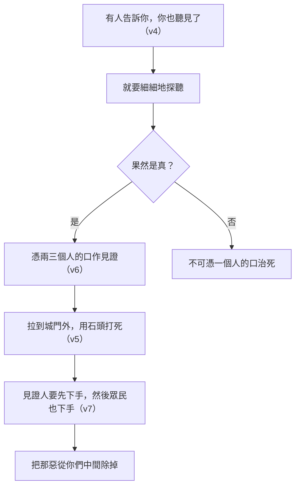

# 申命記 第17章

<!-- chapter-navigation:start -->
| [前一章](../05%20申命記/第16章.md) | [回目錄](../05%20申命記/全書目錄及綱要.md) | [下一章](../05%20申命記/第18章.md) |
| :--- | :---: | ---: |
<!-- chapter-navigation:end -->

1. [[沒有殘疾的祭牲|凡有殘疾，或有什麼惡病的牛羊]]，你都不可獻給耶和華─你的神，因為這是耶和華─你神所憎惡的。
2. 在你們中間，在耶和華─你神所賜你的諸城中，無論哪座城裡，若有人，或男或女，行耶和華─你神眼中看為惡的事，違背了他的約，
3. 去事奉敬拜別神，[[拜日頭月亮與天象|或拜日頭]]，或拜月亮，[[光體作記號定節令|或拜天象]]，是主不曾吩咐的；
4. 有人告訴你，你也聽見了，就要細細地探聽，果然是真，準有這[[可憎的物（to.e.vah）|可憎惡的事]]行在以色列中，
5. 你就要將行這惡事的男人或女人[[城門口公共場合|拉到城門外]]，[[石刑|用石頭將他打死]]。
6. 要[[憑幾個見證人的口|憑兩三個人的口作見證]]將那當死的人治死；不可憑一個人的口作見證將他治死。
7. 見證人要先下手，然後眾民也下手將他治死。這樣，[[把那惡從你們中間除掉（ba.ar）|就把那惡從你們中間除掉]]。
8. 你城中若起了爭訟的事，或因流血，或因爭競，或因毆打，[[難斷的案件上訴到中央聖所|是你難斷的案件]]，你就當起來，往[[立他名的居所（中央聖所）|耶和華─你神所選擇的地方]]
9. 去見[[利未支派|祭司利未人]]，並當時的[[審判官]]，[[求問與訪問同一個字（da.rash）|求問他們]]，他們必將判語指示你。
10. 他們在耶和華所選擇的地方指示你的判語，你必照著他們所指教你的一切話謹守遵行。
11. 要按他們所指教你的律法，照他們所斷定的去行；他們所指示你的判語，你[[不可偏離左右]]。
12. 若有人擅敢不聽從那[[侍立事奉（a.mad、sha.rat）|侍立在耶和華─你神面前]]的祭司，或不聽從[[審判官]]，那人就必治死；這樣，便將那惡從以色列中除掉。
13. 眾百姓都要聽見害怕，[[擅敢行事與褻瀆耶和華的剪除處分|不再擅敢行事]]。
14. 到了耶和華─你神所賜你的地，得了那地居住的時候，若說：我要立王治理我，[[耶和華作王|像四圍的國一樣]]。
15. 你總要立[[神的揀選|耶和華─你神所揀選的人]]為王。[[立王的資格（me.lekh）|必從你弟兄中立一人]]；[[寄居的|不可立你弟兄以外的人為王]]。
16. 只是[[王的三禁與抄錄律法書|王不可為自己加添馬匹]]，[[出埃及|也不可使百姓回埃及去]]，為要加添他的馬匹，因耶和華曾吩咐你們說：[[不可加添也不可刪減（ya.saph、ga.ra）|不可再回那條路去]]。
17. 他也不可為自己多立妃嬪，恐怕他的心偏邪；也不可為自己多積金銀。
18. 他登了國位，就要將[[利未支派|祭司利未人]]面前的這律法書，為自己抄錄一本，
19. 存在他那裡，要平生誦讀，[[學習與教訓同一字根（la.mad）|好學習敬畏耶和華]]─他的神，謹守遵行這律法書上的一切言語和這些律例，
20. 免得他向弟兄心高氣傲，偏左偏右，離了這誡命。這樣，他和他的子孫便可在以色列中，在國位上年長日久。

---

## 本章知識節點

### 主題
- [[拜日頭月亮與天象]]
- [[難斷的案件上訴到中央聖所]]
- [[王的三禁與抄錄律法書]]
- [[憑幾個見證人的口]]
- [[不可偏離左右]]
- [[立他名的居所（中央聖所）]]

### 神學
- [[立王的資格（me.lekh）]]
- [[沒有殘疾的祭牲]]
- [[把那惡從你們中間除掉（ba.ar）]]
- [[擅敢行事與褻瀆耶和華的剪除處分]]
- [[神的揀選]]
- [[耶和華作王]]

### 原文
- [[可憎的物（to.e.vah）]]
- [[求問與訪問同一個字（da.rash）]]
- [[審判官]]
- [[侍立事奉（a.mad、sha.rat）]]
- [[學習與教訓同一字根（la.mad）]]
- [[不可加添也不可刪減（ya.saph、ga.ra）]]
- [[寄居的]]

### 背景
- [[石刑]]
- [[光體作記號定節令]]

### 歷史
- [[城門口公共場合]]
- [[出埃及]]

### 人物
- [[利未支派]]

---

## 本章整理

### 一節接三段（v1）

本章第一句看起來像是上一章的尾巴：[[沒有殘疾的祭牲|凡有殘疾，或有什麼惡病的牛羊]]，都不可獻給耶和華，「因為這是耶和華─你神所憎惡的」。CT 的原文字義註「殘疾」瑕疵，缺陷，污點，並說『惡病』原文任何壞氣味的東西。GT《啟導本聖經申命記註釋》指出這是一般獻祭的例，可與十五21同看，並注意到一個差異：出埃及記二十20所載同一條例中無「惡病」字樣，當為摩西講解時加以說明的結果。

==這一節與後面三段其實是同一件事的四個層面：獻上的東西、敬拜的對象、判案的程序、治國的人，都不可以打折扣。== 而串起四段的，是同一個判準詞——[[可憎的物（to.e.vah）|可憎惡的事]]。STEP語言資料顯示第1節的「所憎惡的」與第4節的「可憎惡的事」是同一個字（H8441）。

### 查清楚才可以動手（v2-7）

第2至3節界定什麼算：行耶和華眼中看為惡的事、違背了他的約，具體內容是 [[拜日頭月亮與天象|或拜日頭]]、或拜月亮、[[光體作記號定節令|或拜天象]]。CT 從創造的次序讀出這件事的顛倒——他說有靈性的人卻去膜拜無靈性的天象，並指出神所造的諸天是為著地，而地是為著有靈的人（參亞十二1）。GT《啟導本聖經申命記註釋》說四19已警告不可膜拜神所造的作記號、定節令的星體，現在重申此禁制。

第4至7節規定程序，而且步步收緊。

[[憑幾個見證人的口|憑兩三個人的口作見證]] 這一條，CT 說是為防患挾仇報復，以免產生冤屈；GT《聖經精讀本》說是為了防止人寶貴的生命因誣告或偽證而蒙冤受死的事情。[[石刑|用石頭將他打死]] 之前還有一道更重的設計：見證人要先下手。CT 說這是為著防止作偽證，一則表示良心無虧，二則表示願受作偽證的刑責。GT《聖經精讀本》補上後果的對稱——當被告的無罪得到證明之時，作偽證的人要接受同樣的刑罰。KC 也說這條規定讓作見證的人負起極大的責任。行刑的地點在 [[城門口公共場合|拉到城門外]]，收尾則是 [[把那惡從你們中間除掉（ba.ar）|就把那惡從你們中間除掉]]。

### 判不下來的往上送（v8-13）

第8節換了角度：不是查不清楚，是判不下來。[[難斷的案件上訴到中央聖所|是你難斷的案件]]，STEP語言資料的「難斷」是 yi.pa.Le'（H6381，簡要詞典義 pa.la: to wonder），CT 的原文字義註它是太奇妙、非凡的、罕見的。經文列出三組成對的名詞——流血、爭競、毆打。

處理方式是往上送到 [[立他名的居所（中央聖所）|耶和華─你神所選擇的地方]]，去見 [[利未支派|祭司利未人]] 與當時的 [[審判官]]，[[求問與訪問同一個字（da.rash）|求問他們]]。GT《申命記串珠聖經註釋》一句話點明這個機構的性質：「神所選擇的地方」：即最高法院。GT《聖經精讀本》指出這是本書所第一次論及的內容，並說此制度後來發展為公會。

判決下來以後，第11節說「你不可偏離左右」——見 [[不可偏離左右]]。第12節則規定刑罰：[[擅敢行事與褻瀆耶和華的剪除處分|不再擅敢行事]] 的相反面。CT 從第12節的措辭讀出理由：[[侍立事奉（a.mad、sha.rat）|侍立在耶和華─你神面前]] 這句話暗示他們在判斷之前求問神，因此他們的斷案也就是神的斷案。GT《啟導本聖經申命記註釋》講得更短：不服判決等於藐視神。

### 立王：先寫規矩，才有王（v14-20）

第14節的場景是將來式：得了那地居住的時候，若說「我要立王治理我，像四圍的國一樣」——這句話本身就把 [[耶和華作王]] 的問題端上檯面。各家對這句話的評價不一致，這一點值得留意。

| 來源 | 對「立王」的評價 |
| --- | --- |
| GT《聖經精讀本》 | 以色列因處於神的直接統治之下，沒有必要另立屬世君主；王政制度並不是神所喜悅的制度（撒上8:7） |
| GT《啟導本聖經申命記註釋》 | 摩西預見百姓會要求立王，以取代士師治國的制度，因為這是他族他國的體制 |
| KC | 神心中一直有一位王（創49:10）；撒上8 的問題在於他們要的是照自己心意的王，是要一個王來取代耶和華 |
| GT 收馬唐納《申命記》 | 神並未叫以色列人立王，但知道百姓將來會有自私的意圖，所以先列出條例，既為百姓的好處，也是為王本身著想 |

第15節給出 [[立王的資格（me.lekh）|你總要立耶和華─你神所揀選的人為王]] 兩個條件：必須是 [[神的揀選|耶和華─你神所揀選的人]]，必須是弟兄中的一人，[[寄居的|不可立你弟兄以外的人為王]]。STEP語言資料顯示「你弟兄以外的人」用的是 na.khe.Ri（H5237），與申14:21 的「外人」、申15:3 的「外邦人」是同一個字。

第16至17節接著下三道禁令。STEP語言資料顯示三次都用同一個動詞 ra.vah（H7235A，to multiply）：[[王的三禁與抄錄律法書|王不可為自己加添馬匹]]、不可多立妃嬪、不可多積金銀。KC 把三者歸納成三個字：權力、享樂、財富。CT 的話中之光注意到經文三次都說「為自己」——作領袖的人所要避免的正是這個。第16節末尾另有一句禁令用了別的字：[[出埃及|也不可使百姓回埃及去]]，[[不可加添也不可刪減（ya.saph、ga.ra）|不可再回那條路去]]。

三禁之後是一項義務：登了國位就要親手抄錄一本律法書，平生誦讀，[[學習與教訓同一字根（la.mad）|好學習敬畏耶和華]]。CT 的話中之光說得很實在：作王的人容易驕傲、自以為是；要糾正驕傲的錯誤，惟一的方法是默想神的話語。

### 四段共用同一句話

==本章的四段各講一件事，卻反覆回到同一個位置：真正的權柄在神，人只是代理。== 祭牲不合格由神說了算（第1節），拜什麼由神吩咐（第3節），判語出自侍立在神面前的祭司（第12節），王由神揀選（第15節）。

> [!note]
> 收尾的那一句也值得看。第20節說王要「免得他向弟兄心高氣傲」——經文在講王的時候，仍然稱百姓為他的弟兄。CT 由此指出一件事：坐上了王位仍然是弟兄，王和百姓只是在職分上有分別，在地位上仍然是弟兄。KC 說親手抄寫律法會讓王意識到，他固然治理一群百姓，自己卻也被治理。

**參考資料**
https://www.ccbiblestudy.org/Old%20Testament/05Deut/05CT17.htm
https://www.ccbiblestudy.org/Old%20Testament/05Deut/05GT17.htm
https://www.kingcomments.com/en/bible-studies/Deu/17
https://biblehub.com/study/deuteronomy/17.htm
https://github.com/STEPBible/STEPBible-Data

<!-- appendix-links:start -->
## 附錄

### 相關地圖
- [[appendix/fhl_maps/maps/025|〈申圖一〉應許之地全圖]]
<!-- appendix-links:end -->

<!-- chapter-navigation:start -->
| [前一章](../05%20申命記/第16章.md) | [回目錄](../05%20申命記/全書目錄及綱要.md) | [下一章](../05%20申命記/第18章.md) |
| :--- | :---: | ---: |
<!-- chapter-navigation:end -->
