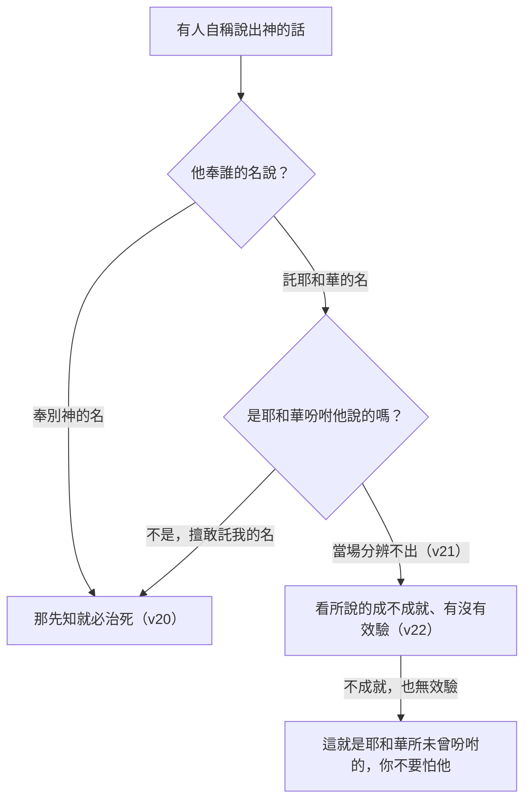

# 申命記 第18章

<!-- chapter-navigation:start -->
| [前一章](../05%20申命記/第17章.md) | [回目錄](../05%20申命記/全書目錄及綱要.md) | [下一章](../05%20申命記/第19章.md) |
| :--- | :---: | ---: |
<!-- chapter-navigation:end -->

1. 祭司[[利未支派|利未人]]和[[利未支派|利未全支派]]必在以色列中無分無業；他們所吃用的就是獻給耶和華的[[火祭（isheh）|火祭]]和[[利未人的什一奉獻|一切所捐的]]。
2. 他們在弟兄中必沒有[[產業（na.cha.lah）|產業]]；[[耶和華是事奉者的業與分|耶和華是他們的產業]]，正如耶和華所應許他們的。
3. [[祭司的分（靠祭物養生）|祭司從百姓所當得的分]]乃是這樣：凡獻牛或羊為祭的，要把前腿和兩腮並脾胃給祭司。
4. [[初熟|初收的五穀]]、新酒和油，並初剪的羊毛，也要給他；
5. 因為耶和華─你的神從你各支派中[[神的揀選|將他揀選出來]]，使他和他子孫永遠奉耶和華的名[[侍立事奉（a.mad、sha.rat）|侍立事奉]]。
6. [[利未支派|利未人]]無論[[寄居的|寄居]]在以色列中的哪一座城，若從那裡出來，一心願意到[[立他名的居所（中央聖所）|耶和華所選擇的地方]]，
7. 就要奉耶和華─他神的名事奉，像他眾弟兄[[利未支派|利未人]]侍立在耶和華面前事奉一樣。
8. 除了他賣祖父[[產業（na.cha.lah）|產業]]所得的以外，[[利未人自願上中央聖所事奉|還要得一分祭物與他們同吃]]。
9. 你到了耶和華─你神所賜之地，那些國民所行[[可憎的物（to.e.vah）|可憎惡的事]]，你不可學著行。
10. 你們中間不可有人[[不可使兒女經火歸摩洛|使兒女經火]]，也不可有[[卦金（qe.sem）|占卜的]]、[[不可行法術觀兆|觀兆的]]、[[不可行法術觀兆|用法術的]]、行邪術的、
11. [[申18：10-12|用迷術的]]、[[不可偏向交鬼行巫術的|交鬼的]]、[[不可偏向交鬼行巫術的|行巫術的]]、[[求問與訪問同一個字（da.rash）|過陰的]]。
12. [[申18：10-12|凡行這些事的]]都為耶和華所憎惡；因那些國民行這[[可憎的物（to.e.vah）|可憎惡的事]]，所以耶和華─你的神將他們從你面前趕出。
13. 你要在耶和華─你的神面前作[[義人與完全人|完全人]]。
14. 因你所要趕出的那些國民都聽信[[不可行法術觀兆|觀兆的]]和[[卦金（qe.sem）|占卜的]]，至於你，耶和華─你的神從來不許你這樣行。
15. 耶和華─你的神要從你們弟兄中間給你[[興起一位先知像我]]，你們要聽從他。
16. 正如你在[[何烈山]][[大會的日子（qa.hal）|大會的日子]]求耶和華─你神一切的話，說：求你不再叫我聽見耶和華─我神的聲音，也不再叫我看見這大火，免得我死亡。
17. 耶和華就對我說：他們所說的是。
18. 我必在他們弟兄中間給他們興起一位[[先知]]像你。我要將當說的話傳給他；他要將我一切所吩咐的都傳給他們。
19. 誰不聽他奉我名所說的話，我必討誰的罪。
20. 若有[[先知]][[擅敢行事與褻瀆耶和華的剪除處分|擅敢託我的名]]說我所未曾吩咐他說的話，或是奉別神的名說話，那先知就必治死。
21. 你心裡若說：耶和華所未曾吩咐的話，我們怎能知道呢？
22. [[先知]]託耶和華的名說話，所說的若不成就，[[神蹟奇事不是真先知的憑證|也無效驗]]，這就是耶和華所未曾吩咐的，是那先知[[擅敢行事與褻瀆耶和華的剪除處分|擅自說的]]，你不要怕他。

---

## 本章知識節點

### 人物
- [[利未支派]]

### 主題
- [[火祭（isheh）]]
- [[祭司的分（靠祭物養生）]]
- [[立他名的居所（中央聖所）]]
- [[利未人自願上中央聖所事奉]]
- [[不可使兒女經火歸摩洛]]
- [[不可行法術觀兆]]
- [[不可偏向交鬼行巫術的]]
- [[先知]]
- [[神蹟奇事不是真先知的憑證]]

### 原文
- [[產業（na.cha.lah）]]
- [[初熟]]
- [[侍立事奉（a.mad、sha.rat）]]
- [[寄居的]]
- [[可憎的物（to.e.vah）]]
- [[卦金（qe.sem）]]
- [[求問與訪問同一個字（da.rash）]]
- [[大會的日子（qa.hal）]]

### 神學
- [[耶和華是事奉者的業與分]]
- [[利未人的什一奉獻]]
- [[神的揀選]]
- [[義人與完全人]]
- [[擅敢行事與褻瀆耶和華的剪除處分]]
- [[興起一位先知像我]]

### 地點
- [[何烈山]]

### 互文
- [[申18：10-12|申18：10-12 禁止占卜邪術的九項清單（與出22：18平行）]]

---

## 本章整理

### 靠祭壇吃飯的支派（v1-8）

本章一開頭就把一件事寫死：[[利未支派|祭司利未人和利未全支派]] 在以色列中無分無業。CT〔原文字義〕註「分」一分(土地)；「業」產業，基業。STEP語言資料顯示這一對字（Che.lek，H2506A；na.cha.lah，H5159）在第1至2節連續出現四次——沒有地，是這一整段規定的前提，也是 [[產業（na.cha.lah）|產業]] 這個字在本章反覆出現的原因。

代替地業的是一句正面的話：[[耶和華是事奉者的業與分|耶和華是他們的產業]]。GT《啟導本聖經申命記註釋》提醒這是比喻的說法，意思是百姓向耶和華所獻的就是利未人生活的來源。CT 的話中之光沒有把這件事講得太輕鬆，他說這句話「並不表明祭司和利未人得著了鐵飯碗，反而很容易叫他們沒有安全感」——因為在人的眼中，倚靠別人的奉獻總是不如自己田裡的出產來得可靠。

實際的收入分成三塊。第一塊是 [[火祭（isheh）|獻給耶和華的火祭]] 與 [[利未人的什一奉獻|一切所捐的]]；GT《申命記串珠聖經註釋》註「火祭」：此處指各類的獻祭，CT 則說『一切所捐的』在原文是他的產業，指的是什一奉獻（參民十八21）。

第二塊是 [[祭司的分（靠祭物養生）|祭司從百姓所當得的分]]，也就是前腿、兩腮、脾胃。STEP語言資料顯示「當得的分」是 mish.Pat（H4941J，簡要詞典義 mish.pat: justice: custom），三個部位分別是 ze.Ro.a'（H2220，arm）、le.cha.Ya.yim（H3895H，jaw）、ke.Vah（H6896，stomach）。CT 說這裡的『祭』指平安祭，『前腿』就是作舉祭之用的右腿(參利七32)；GT《申命記串珠聖經註釋》則老實承認這份清單「與利7:28-36; 民18:18-19細節上不同，但精義則一至」。

第三塊是 [[初熟|初收的五穀]]、新酒和油，外加初剪的羊毛。CT 注意到其中一項是孤例：「聖經中僅此處提到羊毛歸祭司，初剪的羊毛未被玷污。」

理由寫在第5節：耶和華從各支派中 [[神的揀選|將他揀選出來]]，使他和他子孫永遠奉耶和華的名 [[侍立事奉（a.mad、sha.rat）|侍立事奉]]。CT〔原文字義〕把這兩個動作分開解——「『侍立，事奉』侍立指等候差遣，事奉指投入工作」，STEP語言資料也顯示原文確實是兩個不同的字（'a.mad，H5975G；sha.rat，H8334）。

第6至8節換了角度，處理制度內部的公平。住在外地的利未人若一心願意上到 [[立他名的居所（中央聖所）|耶和華所選擇的地方]]，就可以照樣事奉，[[利未人自願上中央聖所事奉|還要得一分祭物與他們同吃]]。經文用 [[寄居的|寄居]] 這個字描寫利未人在自己那座城裡的處境（STEP語言資料：gar，H1481A，簡要詞典義 gur: to sojourn）。GT《聖經精讀本》點出這條規定要防的是什麼：「這樣的規定防止了因獨佔中央聖所而有可能派生的特權意識」。KC 把矛頭轉向原本就在崗位上的人，說他們心裡可能會冒出多來一個人自己就分得少的低下念頭，而這種念頭不該被縱容。

### 迦南人問前途的九種方法（v9-14）

第9節換了場景：到了那地，那些國民所行 [[可憎的物（to.e.vah）|可憎惡的事]]，你不可學著行。STEP語言資料顯示「可憎惡」在第9與12節共出現三次，都是 H8441。

第10至11節把這件事拆成一份清單，一共九項，第12節再總結說 [[申18：10-12|凡行這些事的]] 都為耶和華所憎惡。

| 經文用詞 | STEP語言資料 | 註釋家的說明 |
| --- | --- | --- |
| 使兒女經火（見 [[不可使兒女經火歸摩洛]]） | ma.'a.Vir…ba./'Esh（H5674A、H784） | CT：「即指焚燒兒女，是亞捫人拜摩洛的儀式之一」 |
| 占卜的（見 [[卦金（qe.sem）]]） | ko.Sem ke.sa.Mim（H7080、H7081） | CT：「指藉搖籤拈鬮以求得神意的一種邪術」 |
| 觀兆的（見 [[不可行法術觀兆]]） | me.'o.Nen（H6049B） | GT《啟導本》：「可能指觀看星象」 |
| 用法術的 | me.na.Chesh（H5172） | GT《雷氏研讀本》：「解釋預兆的人」，並說巴蘭所做的就是這種工作 |
| 行邪術的 | me.kha.Shef（H3784） | CT：「指能產生幻象或障眼的魔法」 |
| 用迷術的 | cho.Ver Cha.ver（H2266、H2267） | CT：「指用符咒」，並說全聖經僅此一次提到迷術 |
| 交鬼的（見 [[不可偏向交鬼行巫術的]]） | sho.'El 'Ov（H7592、H178） | GT《雷氏研讀本》：「靈媒」 |
| 行巫術的 | yi.de.'o.Ni（H3049） | GT《雷氏研讀本》：「假裝認識靈幻世界的人」 |
| 過陰的（見 [[求問與訪問同一個字（da.rash）]]） | do.Resh…ha./me.Tim（H1875、H4191） | GT《串珠》：「指向死人的陰魂求問」 |

九項並列在一起，重點不在每一項的技術差別，而在它們共用的功能。GT《啟導本聖經申命記註釋》把當時的社會實況寫了出來：古時的人靠邪術求神問卜來測吉凶，甚至一國是否出戰也靠術士的觀兆、占卜來決定。BH 說得相近，指出這些作法在古代近東文化裡十分普遍，是周邊民族尋求指引與吉凶的常規手段。

CT 從動機上收攏這九項：「人必須看見，人的前途是在神的手裡，所以，在神以外去求問前途，追求屬地的好處，是神所絕對禁止的。」KC 則把判準拉得更廣，他說任何一種要人把自己的意志交出去、而交的對象不是神的宗教形式，本質上都是屬鬼魔的；他並提醒這件事今天換了包裝仍然存在。

第13節給的正面要求只有一句：你要在耶和華面前作 [[義人與完全人|完全人]]。STEP語言資料顯示是 ta.Mim（H8549H，簡要詞典義 ta.mim: unblemished: blameless）；BH 在此處也寫出音譯 tamim，說它含有完整、真誠、無瑕的意思，並補一句這不是指沒有犯過罪，而是指活得正直忠實。CT 的解釋更貼著上下文，說完全人「意即單單信靠神，不聽信任何邪術」。

### 神自己給的管道（v15-19）

講到第14節為止，這一段都還是「不可」。第15節突然轉成正面：耶和華要 [[興起一位先知像我]]，你們要聽從他。

==這個轉折是本章最要緊的地方：神禁止百姓去問前途，不是要他們活在資訊真空裡，而是換一個來源。== GT《啟導本聖經申命記註釋》在第10節就已經把這層意思寫在前面：以色列人以耶和華為他們的神，是一切知識和預示的根源，祂透過摩西和繼他擔任先知的人向人說話，不許以色列人轉向鬼神尋求趨吉避凶之道。

第16至17節說明這個安排是誰提出來的——是百姓自己。他們在 [[何烈山]] [[大會的日子（qa.hal）|大會的日子]] 求摩西代聽代傳，理由是「求你不再叫我聽見耶和華─我神的聲音，也不再叫我看見這大火，免得我死亡。」神的回覆很短：「他們所說的是」。GT《聖經精讀本》把這一段標為先知制度的起源，指出源頭就在何烈山領受十誡時，摩西在神與百姓之間擔當仲裁作用的那件事。

第18節說明「像摩西」是像在哪裡：「我要將當說的話傳給他」。STEP語言資料顯示這裡的動詞不是「說」而是「放」——ve./na.ta.Ti（H5414H，簡要詞典義 na.tan: to give: put）加 be./Fi/v（H6310G，peh: lip），字面是我要把我的話放在他口中；CT〔話中之光〕註的正是「傳給他」原文是「放在他口中」。

至於「一位先知」究竟指誰，各家讀法不同而且並不互相排斥。GT《申命記串珠聖經註釋》說「一位」也可指一系列；GT《聖經精讀本》說這句話首先指摩西去世之後幾個世代所興起的屬神先知，從終極意義來看則指耶穌基督；CT 說近期內可能指的是他的繼承人約書亞，但實際上指的是那要來的彌賽亞。KC 與 BH 都把新約的引用列了出來（徒3:22；7:37）。

[[先知]] 這個職分本身的特別之處，CT 在第19節講得最清楚：它既不像人所選舉設立的審判官，也不像世襲的君王，更不像與生俱來的祭司利未人，而是由神一個一個單獨興起的。

### 冒用這個管道的下場（v20-22）

最後三節處理反面：兩宗死罪，加一條檢驗辦法。

第20節的 [[擅敢行事與褻瀆耶和華的剪除處分|擅敢託我的名]] 與第22節的「擅自說的」，在原文並不是同一個字。STEP語言資料顯示前者是 ya.Zid（H2102，簡要詞典義 zud），後者是 be./za.dOn（H2087，za.don: arrogance），而後面這個編號正是申17:12 判決條例所用的字。CT〔原文字義〕在兩處分別註「擅敢」行為傲慢，行事叛逆，與「擅自」傲慢，自大。

第21節替讀者問了那個實際的問題：耶和華所未曾吩咐的話，我們怎能知道呢？CT 承認這件事當場確實無解——先知所說的話，究竟是否真的是神所吩咐的話，一般人確實無法當場知道。第22節給的答案是等：[[神蹟奇事不是真先知的憑證|也無效驗]] 的預言，就是耶和華沒有說過的話。

這條檢驗只往一個方向有效，各家都特別點了出來。CT 把兩面都寫上：預言不應驗，必定是假先知；預言有應驗，也不一定是真先知。GT《啟導本聖經申命記註釋》的說法一致——「即使預言偶然得到應驗，也不一定是真先知」。KC 則把判準收回到唯一的基準：「The touchstone is and remains the Word of God.」（試金石始終是神的話。）

### 三個職分擺在一起看

KC 在本章開頭先交代了上一章與本章的關係：上一章是王的條例，本章接著是祭司的條例與先知的宣告；他說君王、祭司、先知這三個職分幫助我們認識主耶穌，而三者之間有一個明顯的差別——「A notable difference between these three is that a prophet has no succession, whereas the king and the priest do.」（這三者之間一個顯著的差別是，先知沒有繼承，君王和祭司有。）

CT 在第19節把同一個結構寫成另一句話：神把祂在地上的權柄分散給祭司、審判官和君王來執行，也隨時興起先知作神話語的出口，不斷地提醒這些權力的執行者回轉向神。

> [!note]
> 本章兩段規定的供養方式正好相反，這一點值得留意。CT 指出，神親自興起先知，卻沒有像供應祭司利未人那樣，應許耶和華是他們的產業、為先知安排固定的生活來源；大部分先知可能繼續從事原來的職業（參摩七12，14）。祭司的收入寫在制度裡，先知的沒有。

**參考資料**
https://www.ccbiblestudy.org/Old%20Testament/05Deut/05CT18.htm
https://www.ccbiblestudy.org/Old%20Testament/05Deut/05GT18.htm
https://www.kingcomments.com/en/bible-studies/Deu/18
https://biblehub.com/study/deuteronomy/18.htm
https://github.com/STEPBible/STEPBible-Data

<!-- appendix-links:start -->
## 附錄

### 相關地圖
- [[appendix/fhl_maps/maps/025|〈申圖一〉應許之地全圖]]
- [[appendix/fhl_maps/maps/038|〈書圖十一〉利未人的城和十二個支派的地業]]
<!-- appendix-links:end -->

<!-- chapter-navigation:start -->
| [前一章](../05%20申命記/第17章.md) | [回目錄](../05%20申命記/全書目錄及綱要.md) | [下一章](../05%20申命記/第19章.md) |
| :--- | :---: | ---: |
<!-- chapter-navigation:end -->
