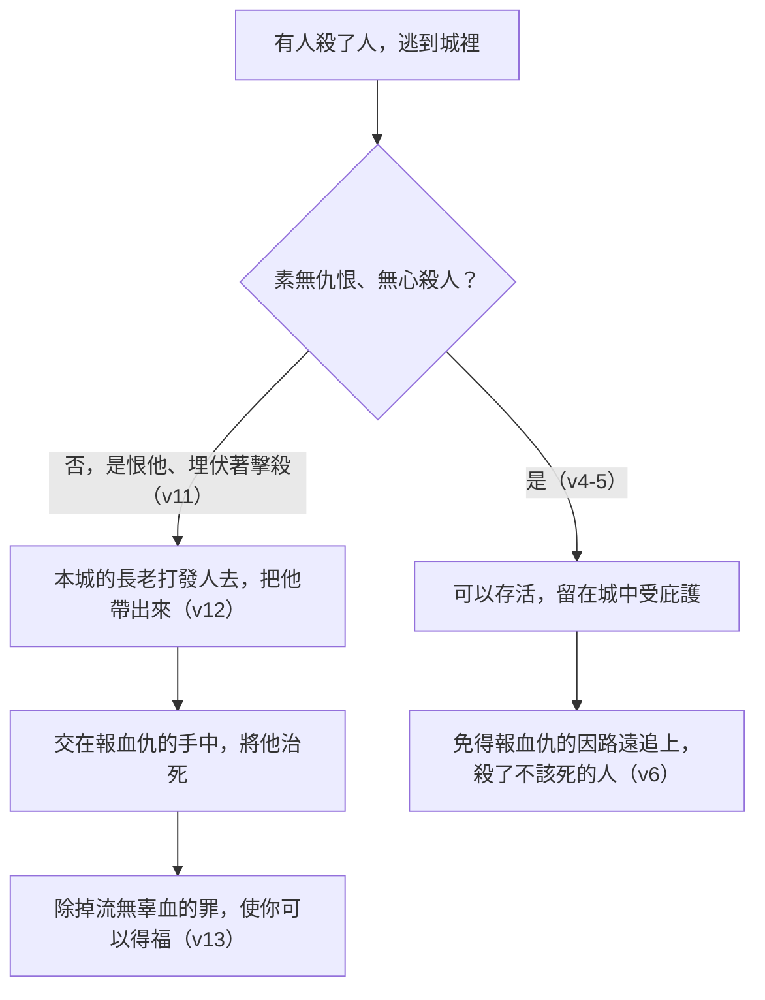

# 申命記 第19章

<!-- chapter-navigation:start -->
| [前一章](../05%20申命記/第18章.md) | [回目錄](../05%20申命記/全書目錄及綱要.md) | [下一章](../05%20申命記/第20章.md) |
| :--- | :---: | ---: |
<!-- chapter-navigation:end -->

1. 耶和華─你神將列國之民剪除的時候，耶和華─你神也將他們的地賜給你，你接著住他們的城邑並他們的房屋，
2. 就要在耶和華─你神所賜你為業的地上[[摩西分定河東三座逃城（ba.dal）|分定三座城]]。
3. 要將耶和華─你神使你承受為業的地分為三段；又要[[預備往逃城的道路|預備道路]]，使[[殺人（ratsach）|誤殺人的]]，都可以逃到那裡去。
4. [[殺人（ratsach）|誤殺人的]]逃到那裡可以存活，定例乃是這樣：凡素無仇恨，[[謀殺與誤殺的區分|無心殺了人的]]，
5. 就如人與鄰舍同入樹林砍伐樹木，手拿斧子一砍，本想砍下樹木，不料，斧頭脫了把，飛落在鄰舍身上，以致於死，這人逃到[[逃城|那些城的一座城]]，就可以存活，
6. 免得[[報血仇的（ga.al）|報血仇的]]，心中火熱追趕他，因路遠就追上，將他殺死；其實他不該死，因為他與被殺的素無仇恨。
7. 所以我吩咐你說，要[[摩西分定河東三座逃城（ba.dal）|分定三座城]]。
8. 耶和華─你神若照他向你列祖所起的誓擴張你的境界，將所應許賜你列祖的地全然給你，
9. 你若謹守遵行我今日所吩咐的這一切誡命，愛耶和華─你的神，常常遵行他的道，就要在這三座城之外，[[申19：1-13|再添三座城]]，
10. 免得[[流無辜血的罪|無辜之人的血]]流在耶和華─你神所賜你為業的地上，[[流無辜血的罪|流血的罪]]就歸於你。
11. 若有人恨他的鄰舍，[[謀殺與誤殺的區分|埋伏著起來擊殺他]]，以致於死，便逃到[[逃城|這些城的一座城]]，
12. [[以色列的長老|本城的長老]]就要打發人去，從那裡帶出他來，交在[[報血仇的（ga.al）|報血仇的]]手中，將他治死。
13. 你眼不可顧惜他，卻要從以色列中除掉[[流無辜血的罪]]，使你可以得福。
14. 在耶和華─你神所賜你[[產業（na.cha.lah）|承受為業之地]]，[[不可挪移地界（ge.vul）|不可挪移你鄰舍的地界]]，那是先人所定的。
15. 人無論犯什麼罪，作什麼惡，不可憑一個人的口作見證，總要[[憑幾個見證人的口|憑兩三個人的口作見證]]才可定案。
16. 若有凶惡的見證人起來，見證某人作惡，
17. 這兩個爭訟的人就要[[立他名的居所（中央聖所）|站在耶和華面前]]，和當時的祭司，並[[審判官]]面前，
18. [[審判官]]要[[求問與訪問同一個字（da.rash）|細細地查究]]，若見證人果然是[[不可作假見證陷害人|作假見證的]]，以假見證陷害弟兄，
19. 你們就要待他如同他想要待的弟兄。這樣，就[[把那惡從你們中間除掉（ba.ar）|把那惡從你們中間除掉]]。
20. 別人聽見都要害怕，就不敢在你們中間再行這樣的惡了。
21. 你眼不可顧惜，要[[以眼還眼的適用範圍|以命償命]]，[[以眼還眼]]，以牙還牙，以手還手，以腳還腳。

---

## 本章知識節點

### 互文
- [[逃城|逃城 誤殺人者的庇護制度（出21:13、民35、申19、書20）]]
- [[申19：1-13|申19：1-13 河西三座逃城與再添三座的條件]]

### 事件
- [[摩西分定河東三座逃城（ba.dal）]]

### 原文
- [[殺人（ratsach）]]
- [[報血仇的（ga.al）]]
- [[審判官]]
- [[求問與訪問同一個字（da.rash）]]
- [[產業（na.cha.lah）]]

### 神學
- [[謀殺與誤殺的區分]]
- [[流無辜血的罪]]
- [[不可作假見證陷害人]]
- [[把那惡從你們中間除掉（ba.ar）]]
- [[以眼還眼]]

### 主題
- [[預備往逃城的道路]]
- [[不可挪移地界（ge.vul）]]
- [[憑幾個見證人的口]]
- [[立他名的居所（中央聖所）]]

### 文化
- [[以色列的長老]]

### 解經爭議
- [[以眼還眼的適用範圍]]

---

## 本章整理

### 三座城，和通到城的那條路（v1-7）

本章從一個時間點開始：耶和華把列國之民剪除、把地賜給你、你住進他們的城邑和房屋以後。CT 說『列國之民』指迦南七族。接著就是第一道命令——[[摩西分定河東三座逃城（ba.dal）|分定三座城]]。STEP語言資料顯示「分定」是 tav.Dil（H914，簡要詞典義 ba.dal: to separate），與申4:41 摩西在約但河東分定三座城用的是同一個字。GT《啟導本聖經申命記註釋》說明兩批城的關係：「這之前，摩西已在約但河東為兩個半支派設立了三座」，而六座逃城平均分配在約但河東西兩岸的北、中與南三部分。

真正實際的是第3節：[[預備往逃城的道路|預備道路]]。經文先要求把地分為三段，STEP語言資料顯示是 ve./shi.lash.Ta（H8027，簡要詞典義 sha.lash: to do three）。GT《聖經精讀本》解釋這個動作的用意——指將迦南地平均分為三個區域，在每個區域的中心部設立逃城，為的是使逃亡者無論身處何方都不為 [[報血仇的（ga.al）|報血仇的]] 所追趕上。==條例在這裡處理的不是原則，而是距離。==

| 來源 | 對這條路記下的規格 |
| --- | --- |
| CT | 一般大路的標準寬度是16肘，「但通往逃城的道路必須寬兩倍」，並要修直、修平，在每個岔路口重複標上「逃城，逃城」（他註明出處是《他勒目 Talmud》Bava Batra 100b 與《密西拿 Mishnah》Sefer HaChinukh 520:1） |
| GT《聖經精讀本》 | 據猶太人的傳承，道寬當約14米左右，路邊立一個用大字寫著逃城二字的標誌牌 |
| GT《申命記串珠聖經註釋》 | 「逃城位置要適中，方便區內各鎮的人進入逃城，避免因路程太遠而產生問題」 |
| KC | 非聖經史料提到，每年檢查通往逃城之路是議會的職責：破損的路要修好、障礙要清除、河上不能沒有橋、路不可太窄、岔路口要立牌子指出方向 |

第8至9節另給一個條件式的擴充：神若照向列祖所起的誓擴張境界，而百姓謹守遵行，就要 [[申19：1-13|再添三座城]]。

> [!note]
> 這三座城後來並沒有出現。GT《申命記雷氏研讀本》說得很直接：「這三座城從來沒有加添上去，因為以色列人並沒有佔領應許賜給亞伯拉罕的所有土地」。GT《啟導本聖經申命記註釋》補上原因的另一半——他們不但未能得到整個應許之地，而且因為倒行逆施，國家分裂，遭到國破家亡的命運。

### 誰進得去，誰進不去（v4-13）

能不能受庇護，判準只有一個：動機。

第4節的定義是「凡素無仇恨，無心殺了人的」。STEP語言資料顯示「無心」在原文是兩個字 bi/v.li- Da.'at（H1097 加 H1847，da.at: knowledge），「素無仇恨」是 lo'- so.Ne'（H8130，sa.ne: to hate）接 mi./te.Mol shil.Shom（H8543 加 H8032，字面是從昨日、前日以來）。CT 註『素無仇恨』指平日相處沒有恩怨糾葛，『無心殺了人的』指沒有預謀，純屬意外。

第5節舉的例子很日常：兩個人一起進樹林砍柴，斧頭脫了把，飛落在鄰舍身上。KC 說這個例子本身就把界線畫清楚了——樹林是誰都可以進的，砍柴是誰都可以做的，事情不是出於預謀，純粹是意外；有了這個例子，任何類似的案件都可以拿來比對評估。他並從中讀出另一層：人的性命每天都處在危險裡，死亡就在四周，可能毫無理由地在最想不到的時刻臨到。

第11節翻到反面——「若有人恨他的鄰舍，埋伏著起來擊殺他」，這是 [[謀殺與誤殺的區分]] 的另一端。STEP語言資料顯示「埋伏」是 ve./'A.rav（H693，簡要詞典義 a.rav: to ambush）；同一個「殺人」在本章從頭到尾都是 [[殺人（ratsach）|誤殺人的]] 那個字（H7523），==原文沒有替蓄意與無心各給一個字，分辨的責任落在人身上。== 這種人就算進了城，[[以色列的長老|本城的長老]] 也要打發人把他帶出來。

整段的理由寫在第10與13節：[[流無辜血的罪|流血的罪就歸於你]]。CT 說『血流在…地上』使地變成污穢不潔淨（參民三十五33），因此神必追討流人血的罪；BH 說防止它是整個群體的共同責任，做不到，血債就落在這地和這地上的人身上。

### 中間插進來的那一節（v14）

第14節突然說起一件與殺人無關的事：[[不可挪移地界（ge.vul）|不可挪移你鄰舍的地界]]，那是先人所定的。

它並不突兀。GT《申命記雷氏研讀本》一句話點出性質：「這樣做就等於偷竊」。GT《申命記串珠聖經註釋》推測立法的動機——可能是要防止富戶恃著勢力，為了增添自己的土地而不惜欺負貧窮者。KC 的角度不同：他說這一節講的不是照顧自己的產業，而是照顧鄰舍的 [[產業（na.cha.lah）|產業]]，意思是每個人都要認可並尊重別人享有那一份的權利；他舉的反例是亞哈奪走拿伯的產業（王上21:1-15）。

### 兩三個人的口（v15-21）

第15節把 [[憑幾個見證人的口|憑兩三個人的口作見證]] 從殺人案推廣到所有案件——經文說「人無論犯什麼罪，作什麼惡」。GT《申命記雷氏研讀本》正是這樣讀的：有關作見證的要求在殺人罪案裏已經詳述，這裡「引用至所有的刑事罪案」。

第16至18節處理相反的情況：[[不可作假見證陷害人|作假見證的]] 人。經文稱他為「兇惡的見證人」，STEP語言資料顯示是 'ed- cha.Mas（H5707 加 H2555，簡要詞典義 cha.mas: violence）。程序是兩造 [[立他名的居所（中央聖所）|站在耶和華面前]]，和當時的祭司並 [[審判官]] 面前，由審判官 [[求問與訪問同一個字（da.rash）|細細地查究]]——STEP語言資料顯示這個動詞是 ve./da.re.Shu（H1875，da.rash），與申12:5 上到神所選擇的地方去求問、申17:9 向祭司利未人求問是同一個字。

查明之後的判決寫在第19節：「你們就要待他如同他想要待的弟兄」，然後 [[把那惡從你們中間除掉（ba.ar）|把那惡從你們中間除掉]]。GT《啟導本聖經申命記註釋》注意到這個公式在本書反覆出現，並說它不只主張嚴懲作惡者，也要把那惡本身去除。

第21節收在同態復仇的清單上：[[以眼還眼的適用範圍|以命償命]]、[[以眼還眼]]、以牙還牙、以手還手、以腳還腳。==要留意它出現的位置：這一節判的不是傷害案，而是作假見證的人。== 三家對它的適用範圍說法一致。GT《聖經精讀本》說這「絕不是個人性的復仇方法而只是說明了由司法機關執行刑罰」；CT 說「這一節所定的原則是給審判官使用的，並不適用於個人的報復」；KC 說主耶穌並沒有廢掉這條報應的律法，官方的執法機關仍然適用，他所做的是宣告它不能用在個人恩怨上。

### 一章管三條誡命

KC 在本章開頭就把結構說了出來：這一章和接下來兩章處理的都是生命受威脅的處境，而本章詳述的是三條誡命——不可殺人、不可偷盜、不可作假見證陷害鄰舍。

> [!note]
> 照這個分法回頭看，本章保護的是同一個人的三樣東西：他的命（第1至13節）、他的地（第14節）、他的名（第15至21節）。三段用的辦法也一樣——先要求查清楚，再決定怎麼辦：誤殺與謀殺要由長老分辨，見證的真假要由審判官細細地查究。

**參考資料**
https://www.ccbiblestudy.org/Old%20Testament/05Deut/05CT19.htm
https://www.ccbiblestudy.org/Old%20Testament/05Deut/05GT19.htm
https://www.kingcomments.com/en/bible-studies/Deu/19
https://biblehub.com/study/deuteronomy/19.htm
https://github.com/STEPBible/STEPBible-Data

<!-- appendix-links:start -->
## 附錄

### 相關地圖
- [[appendix/fhl_maps/maps/025|〈申圖一〉應許之地全圖]]
<!-- appendix-links:end -->

<!-- chapter-navigation:start -->
| [前一章](../05%20申命記/第18章.md) | [回目錄](../05%20申命記/全書目錄及綱要.md) | [下一章](../05%20申命記/第20章.md) |
| :--- | :---: | ---: |
<!-- chapter-navigation:end -->
