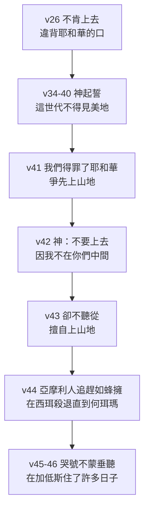
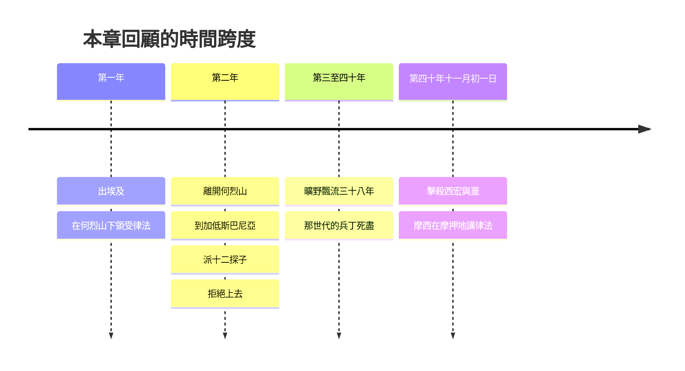

# 申命記 第1章

<!-- chapter-navigation:start -->
|  | [回目錄](../05%20申命記/全書目錄及綱要.md) | [下一章](../05%20申命記/第2章.md) |
| :--- | :---: | ---: |
<!-- chapter-navigation:end -->

1. 以下所記的是[[摩西]]在[[約但河]]東的曠野、[[巴蘭與哈洗錄是否同名不同地|疏弗]]對面的[[亞拉巴]]─就是巴蘭、[[巴蘭與哈洗錄是否同名不同地|陀弗]]、拉班、哈洗錄、[[巴蘭與哈洗錄是否同名不同地|底撒哈]]中間─向以色列眾人所說的話。
2. （從[[何烈山]]經過[[西珥山]]到[[加低斯|加低斯巴尼亞]]有[[十一天的路程]]。）
3. [[出埃及第四十年十一月初一日]]，[[摩西]]照耶和華藉著他所吩咐以色列人的話都曉諭他們。
4. 那時，他已經擊殺了住[[希實本]]的亞摩利王[[以色列戰勝亞摩利王西宏互文（申2：24-37；3：1-7；詩135：10-12；136：17-22）|西宏]]和住[[以得來]]、[[亞斯她錄]]的[[巴珊]]王[[以色列戰勝巴珊王噩互文（申3：1-11；詩135：10-12；136：17-22）|噩]]。
5. [[摩西]]在[[約但河]]東的[[摩押地]][[講律法（ba.ar）|講律法]]說：
6. 耶和華─我們的神在[[何烈山]]曉諭我們說：你們在這山上住的日子夠了；
7. 要起行轉到[[亞摩利人]]的山地和靠近這山地的各處，就是[[亞拉巴]]、山地、[[高原（Shephelah）|高原]]、[[南地]]，[[應許之地的四至|沿海一帶]][[迦南人]]的地，並[[應許之地的四至|利巴嫩山]]又到[[伯拉大河]]。
8. 如今我將這地擺在你們面前；你們要進去得這地，就是耶和華向你們列祖[[亞伯拉罕]]、[[以撒]]、[[雅各]]起誓應許賜給他們和他們後裔為業之地。
9. 那時，我對你們說：管理你們的重任，我獨自[[擔當（na.sa）|擔當]]不起。
10. 耶和華─你們的神使你們多起來。看哪，你們今日像天上的星那樣多。
11. 惟願耶和華─你們列祖的神使你們比如今更多千倍，照他所應許你們的話賜福與你們。
12. 但你們的麻煩，和管理你們的重任，並你們的爭訟，我獨自一人怎能[[擔當（na.sa）|擔當]]得起呢？
13. 你們要按著各支派選舉[[敬畏神、誠實、恨不義之財|有智慧、有見識、為眾人所認識的]]，我立他們為你們的首領。
14. 你們回答我說：照你所說的行了為妙。
15. 我便將你們各支派的首領，有智慧、為眾人所認識的，照你們的支派，立他們為官長、[[曠野審判制度|千夫長]]、[[曠野審判制度|百夫長]]、[[曠野審判制度|五十夫長]]、十夫長，管理你們。
16. 當時，我囑咐你們的[[審判官]]說：你們聽訟，無論是弟兄彼此爭訟，是與[[寄居的|同居的外人]]爭訟，都要按公義判斷。
17. 審判的時候，[[不可看人的外貌（na.khar）|不可看人的外貌]]；聽訟不可分貴賤，不可懼怕人，因為[[申1：17|審判是屬乎神的]]。若有難斷的案件，可以呈到我這裡，我就判斷。
18. 那時，我將你們所當行的事都吩咐你們了。
19. 我們照著耶和華─我們神所吩咐的從[[何烈山]]起行，經過你們所看見那大而可怕的曠野，往[[亞摩利人]]的山地去，到了[[加低斯|加低斯巴尼亞]]。
20. 我對你們說：你們已經到了耶和華─我們神所賜給我們的[[亞摩利人]]之山地。
21. 看哪，耶和華─你的神已將那地擺在你面前，你要照耶和華─你列祖的神所說的上去得那地為業；不要懼怕，也不要驚惶。
22. 你們都就近我來說：我們要先打發人去，為我們窺探那地，將我們上去該走何道，必進何城，都回報我們。
23. 這話我以為美，就從你們中間選了十二個人，每支派一人。
24. 於是他們起身上山地去，到[[以實各谷的一掛葡萄|以實各谷]]，窺探那地。
25. 他們手裡拿著那地的果子下來，到我們那裡，回報說：耶和華─我們的神所賜給我們的是[[美地]]。
26. 你們卻不肯上去，竟違背了耶和華─你們神的[[越過耶和華的口（peh）|命令]]，
27. 在帳棚內發怨言說：耶和華因為恨我們，所以將我們從埃及地領出來，要交在[[亞摩利人]]手中，除滅我們。
28. 我們上哪裡去呢？我們的弟兄使我們的[[心消化（ma.sas）|心消化]]，說那地的民比我們又大又高，城邑又廣大又堅固，高得頂天，並且我們在那裡看見[[亞衲族與偉人拿非林|亞衲族]]的人。
29. 我就對你們說：不要驚恐，也不要怕他們。
30. 在你們前面行的耶和華─你們的神必為你們[[耶和華的爭戰|爭戰]]，正如他在埃及和曠野，在你們眼前所行的一樣。
31. 你們在曠野所行的路上，也曾見耶和華─你們的神[[擔當（na.sa）|撫養]]你們，如同人撫養兒子一般，直等你們來到這地方。
32. 你們在這事上卻不信耶和華─你們的神。
33. 他在路上，在你們前面行，為你們找安營的地方；夜間在[[雲柱火柱|火柱]]裡，日間在[[雲柱火柱|雲柱]]裡，指示你們所當行的路。
34. 耶和華聽見你們這話，就發怒，起誓說：
35. 這惡世代的人，連一個也不得見我起誓應許賜給你們列祖的[[美地]]；
36. 惟有耶孚尼的兒子[[迦勒]]必得看見，並且我要將他所踏過的地賜給他和他的子孫，因為他[[專心跟從主與另一個心志|專心跟從]]我。
37. 耶和華為你的緣故也向我發怒，說：你必不得進入那地。
38. 伺候你、嫩的兒子[[約書亞]]，他必得進入那地；你要勉勵他，因為他要使以色列人承受那地為業。
39. 並且你們的婦人孩子，就是你們所說、必被擄掠的，和今日不知善惡的兒女，必進入那地。我要將那地賜給他們，他們必得為業。
40. 至於你們，要轉回，從[[海（紅海）|紅海]]的路往曠野去。
41. 那時，你們回答我說：我們[[得罪神|得罪]]了耶和華，情願照耶和華─我們神一切所吩咐的上去[[耶和華的爭戰|爭戰]]。於是你們各人帶著兵器，[[爭先與擅自|爭先]]上山地去了。
42. 耶和華吩咐我說：你對他們說：不要上去，也不要[[耶和華的爭戰|爭戰]]；因我不在你們中間，恐怕你們被仇敵殺敗了。
43. 我就告訴了你們，你們卻不聽從，竟違背耶和華的[[越過耶和華的口（peh）|命令]]，[[爭先與擅自|擅自]]上山地去了。
44. 住那山地的[[亞摩利人]]就出來攻擊你們，追趕你們，如蜂擁一般，在西珥殺退你們，直到[[迦南大敗直到何珥瑪|何珥瑪]]。
45. 你們便回來，在耶和華面前哭號；耶和華卻不聽你們的聲音，也不向你們側耳。
46. 於是你們在[[加低斯]]住了許多日子。

---

## 本章知識節點

### 歷史
- [[出埃及第四十年十一月初一日]]
- [[曠野飄流四十年]]
- [[加低斯巴尼亞事件]]
- [[迦南大敗直到何珥瑪]]

### 主題
- [[十一天的路程]]
- [[應許之地的四至]]
- [[美地]]
- [[以實各谷的一掛葡萄]]

### 原文
- [[講律法（ba.ar）]]
- [[擔當（na.sa）]]
- [[不可看人的外貌（na.khar）]]
- [[心消化（ma.sas）]]
- [[爭先與擅自]]
- [[你與你們的單複數交替]]
- [[越過耶和華的口（peh）]]
- [[審判官]]
- [[寄居的]]

### 地點
- [[亞拉巴]]
- [[高原（Shephelah）]]
- [[以得來]]
- [[亞斯她錄]]
- [[伯拉大河]]
- [[何烈山]]
- [[加低斯]]

### 事件
- [[摩西立首領]]
- [[葉忒羅建議分層治理]]
- [[十二探子窺探迦南地]]
- [[摩西不得進入應許之地]]

### 神學
- [[敬畏神、誠實、恨不義之財]]
- [[耶和華的爭戰]]
- [[專心跟從主與另一個心志]]
- [[得罪神]]

### 背景
- [[宗主條約]]
- [[古代近東司法制度]]
- [[亞衲族與偉人拿非林]]

### 解經爭議
- [[巴蘭與哈洗錄是否同名不同地]]

### 互文
- [[申1：17|申1：17 審判是屬乎神的與出23 的司法禁令]]

### 人物
- [[迦勒]]
- [[約書亞]]

---

## 本章整理

### 開場的三個座標（v1-5）

申命記一開頭沒有講道，先報座標。第1節給地點——摩西站在[[約但河]]東的曠野，「疏弗對面的[[亞拉巴]]」；第3節給時間——出埃及第四十年十一月初一日；第4節給剛發生的事——他已經擊殺了住[[希實本]]的亞摩利王西宏，和住[[以得來]]、[[亞斯她錄]]的[[巴珊]]王噩。三件事湊起來，就是這卷書講話的處境。BH 補上希實本的後續：考古顯示它是一座設防的城，攻下它是一次實實在在的戰功；這座城後來歸入流便支派的地界（書13:17）。

日期特別值得注意。GT《啟導本聖經申命記註釋》說：「這是本書唯一記載的日期。兩個月後，百姓進入迦南地（比較書四19）。這期間，他們用了30天來為摩西舉哀（三十四8）。」CT 算得更貼身：「就是摩西死前大約一個月。」換句話說，整卷申命記是一個人在生命最後一個多月裡講的話。

第5節的動詞決定了這卷書的性質。GT《雷氏研讀本》說：「『講』。直譯作：解釋。」GT《聖經精讀本》寫出音譯：「『講』的希伯來語『baar』意指『明確地闡明或講解』。」STEP語言資料顯示這裡是兩個動詞連用：ho.'Il（H2974）與 be.'Er（H874），本節譯義作 he undertook 與 he made clear，簡要詞典義 ba.ar: to make plain。所以 GT《啟導本》的結論站得住：「本書大部分為摩西去世前數十天中『所說的話』的記錄，因此不是一本新的律法書，而是神在西奈山所頒佈的律法的重申和講解」（見 [[講律法（ba.ar）]]）。

> [!note] 開場那串地名有爭議
> 第1節列了疏弗、巴蘭、陀弗、拉班、哈洗錄、底撒哈。CT 主張「這些地方都位於亞拉巴的範圍內，並非南地以南的巴蘭曠野，故巴蘭和哈洗錄同名不同地（參民十二16）」；GT《啟導本》卻說它們「都是從西奈山北往摩押經過的地方⋯但知巴蘭為介乎加低斯與西奈間的曠野」。兩邊都承認其中大半位置不詳（見 [[巴蘭與哈洗錄是否同名不同地]]）。

### 起行的命令與那地的範圍（v6-8）

第6節神說「你們在這山上住的日子夠了」，第7節緊接著把要去的地整片攤開：亞拉巴、山地、[[高原（Shephelah）|高原]]、[[南地]]，沿海一帶[[迦南人]]的地，並利巴嫩山又到[[伯拉大河]]。

這份清單不是隨口列的。GT《啟導本聖經申命記註釋》指出：「本節所描寫的迦南應許地範圍與神當年應許亞伯拉罕、以撒和雅各的符合（創十五18；二十六2～4；三十五11～12）。大衛和所羅門王時代，已見到這塊擴展的版圖。」第8節隨即把它扣回列祖：「就是耶和華向你們列祖[[亞伯拉罕]]、[[以撒]]、[[雅各]]起誓應許賜給他們和他們後裔為業之地。」

| 經文用詞 | 位置 | 說明來源 |
| --- | --- | --- |
| 亞拉巴 | 加利利海到死海南端以迄阿卡巴灣的河谷 | CT／GT 同文 |
| 山地 | 約但河西、迦南中部的高山山脈 | CT |
| 高原 | 沿海平原與中央高地之間的低地，稱 Shephelah | GT《雷氏研讀本》 |
| 南地 | 別是巴以南一片貧瘠乾地 | CT |
| 沿海一帶迦南人的地 | 迦南地的北部地區 | CT |
| 利巴嫩山 | 迦南地的最北部 | CT |
| 伯拉大河 | 即今幼發拉底河，應許之地的北界 | CT |

KC 讀出這裡的次序：那地不是他們挑的，是為他們挑的——神為他們揀選了這地，也揀選了他們住在其中。

### 一個人擔不動的重擔（v9-18）

第9節摩西回憶自己說過的話：「管理你們的重任，我獨自擔當不起。」第12節再說一次，並且列出三樣東西——你們的麻煩、管理你們的重任、你們的爭訟。CT 的原文字義分別給「重擔」「負擔，承受」「爭端，爭論」；STEP語言資料顯示是 ta.re.cha./Khem（H2960）、u./ma.sa.'a./Khem（H4853A）、ve./Ri.ve./Khem（H7379）。

解決辦法是分層。第13節摩西要百姓「按著各支派選舉有智慧、有見識、為眾人所認識的」，第15節他把這些人立為官長、千夫長、百夫長、五十夫長、十夫長（見 [[摩西立首領]]、[[曠野審判制度]]）。GT《啟導本》把這份名單和出埃及記的那份併起來看：「這裡和《出埃及記》十八21都列出了做領袖的一些標準，包括：1，敬畏神；2，誠實無妄；3，恨不義之財；4，有智慧；5，有見識；6，為眾人所尊敬（或作『有經驗』）。前三者為道德的，後三者為智慧與知識的」（見 [[敬畏神、誠實、恨不義之財]]、[[葉忒羅建議分層治理]]）。CT 則把申命記這三項拆開解釋：「(1)有智慧，較偏重於治事的才幹；(2)有見識，較偏重於分辨的能力；(3)為眾人所認識的，較偏重於經驗和信譽。」

第16-17節轉向[[審判官]]的職責。三道禁令連著下：不可看人的外貌、不可分貴賤、不可懼怕人。STEP語言資料顯示前後兩道在原文都用到「臉」這個字——「不可看人的外貌」是 lo'- ta.Ki.ru fa.Nim（H5234A na.khar「to recognize」＋H6440N pa.neh），字面是不可認臉；「不可懼怕人」是 lo' ta.Gu.ru mi./pe.nei- 'Ish（H1481C gur「to dread」），字面是不可懼怕人的臉（見 [[不可看人的外貌（na.khar）]]）。第16節的受理範圍還包括「與同居的外人爭訟」，STEP 顯示那個字是 ge.R/o（H1616 ger），也就是[[寄居的]]。

這一段有經外的參照。GT 華爾頓《申命記背景注釋》寫道：「接近這個時代的埃及和赫人記錄，亦同樣顯示司法系統是等級性的。赫人的《軍官及司令指南》⋯讓軍官擔任法官⋯陪審團並不存在，但長老有時也會集體判案⋯律師也不存在，大部分人在法庭上都是充任自己的律師」（見 [[古代近東司法制度]]）。而第17節「因為審判是屬乎神的」這句話，出埃及記第二十三章那幾條司法禁令的根據就在這裡（見 [[申1：17]]）。

### 十二探子與一句「是美地」（v19-25）

第19節他們從[[何烈山]]起行，經過「那大而可怕的曠野」，到了[[加低斯|加低斯巴尼亞]]。GT《聖經精讀本》描述那片地：「指阿拉伯曠野的西部，即形成北部西奈半島的荒涼沙漠地帶⋯山脈如同被火燒，只有尖岩陡石和荒沙遍滿全地。」

第22節百姓提議先派人去窺探。這裡有一個和民數記對不上的地方，KC 直接點出來：民數記說是神吩咐派探子（民13:1-2），這裡說是百姓要求的；KC 的讀法是這個要求出於對神的不信任，神看見他們心意已定，就把他們所求的給了他們（見 [[十二探子窺探迦南地]]）。

探子回來時帶了實物。第25節「他們手裡拿著那地的果子下來」——CT 說是兩個人用杠抬著一掛葡萄，又帶了石榴和無花果（見 [[以實各谷的一掛葡萄]]）。他們的結論只有一句：「耶和華─我們的神所賜給我們的是[[美地]]。」KC 統計這個說法在申命記出現十次。CT 補上另一個名字：「『美地』又稱[[流奶與蜜之地]]（參民十三27），乃形容物產豐富，適宜居住生活。」

### 心消化：拒絕上去的那一夜（v26-33）

第26節一句話翻轉整章：「你們卻不肯上去，竟違背了耶和華─你們神的命令」。GT《聖經精讀本》指出這個「命令」的原文是「口」：「即，出自神之口的話就是誡命。」STEP語言資料顯示第26節與第43節同為 va./tam.Ru 'et- pi Yah.weh（H4784 marah「to rebel」＋H6310I peh），也就是悖逆耶和華的口（見 [[越過耶和華的口（peh）]]）。

第27節他們在帳棚裡的說法是「耶和華因為恨我們」。第28節引述探子的話：「我們的弟兄使我們的心消化」。STEP語言資料顯示是 he.Ma.su 'et- le.va.Ve./nu（H4549 ma.sas「to melt」，Hiphil 使役），本節譯義 they have made melt；GT《聖經精讀本》給的字面是「使心消融並淌流」（見 [[心消化（ma.sas）]]）。同一節說城邑「高得頂天」，GT《啟導本》拿考古對照：「所居地的城牆，據考古學家發現，只有10至15公尺高。探子說『高得頂天』的確過甚其詞。」他們在那裡看見的是[[亞衲族與偉人拿非林|亞衲族]]。

摩西的回應在第29-33節。第30節「在你們前面行的耶和華─你們的神必為你們爭戰」（見 [[耶和華的爭戰]]）；第31節「耶和華─你們的神撫養你們，如同人撫養兒子一般」；第33節提醒他們夜間的火柱與日間的雲柱（見 [[雲柱火柱]]）。KC 把第31節和摩西自己的話接起來：摩西做不到的事（民11:14），神做了——祂像人抱著自己的孩子那樣背負他們。

> [!important] 第21與31節在原文是單數
> GT《啟導本》指出：「本節的『你』為第二人稱單數，與全章通用的多數『你們』不同。有人因此指出本節為後加的。31節經文中的『你們』原文也是單數，《和合本》為求統一，改譯為『你們』」。STEP 的 morphology 逐字對得上：第21節的 Re.'eh、'a.Leh、Resh、ti.Ra'、te.Chat 全是 2ms，第31節的 ra.'I.ta 是 Vqp2ms（見 [[你與你們的單複數交替]]）。

### 神的誓言與兩個例外（v34-40）

第34-35節神起誓：「這惡世代的人，連一個也不得見我起誓應許賜給你們列祖的美地」。第25節探子說是美地，第35節神說他們見不到美地——同一個詞，中間隔著一次拒絕。

例外有兩個。[[迦勒]]在第36節，理由是「因為他專心跟從我」；CT 說這句話「字面的意思是『完全跟在我後面』」，STEP語言資料顯示是 mi.Le' 'a.cha.Rei Yah.weh（H4390 ma.le「to fill」＋H310A a.char），KC 則說迦勒的名字意思就是「全心」（見 [[專心跟從主與另一個心志]]）。BH 另外補了一個容易被略過的身分：迦勒的父親耶孚尼被記為基尼洗族，可能不是以色列本族；BH 認為這正顯出神之約的包容性。[[約書亞]]在第38節，身分是「伺候你、嫩的兒子」，摩西要勉勵他。BH 補上他的出身：他屬以法蓮支派，原名何西阿，是摩西給他改名為約書亞，意思是耶和華是拯救。第37節則是摩西自己：「耶和華為你的緣故也向我發怒，說：你必不得進入那地」（見 [[摩西不得進入應許之地]]）。GT《雷氏研讀本》把這件事和加低斯的判決並排：「雖然拒絕摩西進入應許地的決定，在以色列人於加低斯被拒絕的三十八年後才宣佈出來，但兩個決定的原因是相同的——不信」。

第39節給了下一代一個位置：「今日不知善惡的兒女，必進入那地。」GT《串珠聖經註釋》解釋「不知善惡」：「即不懂分辨是非的孩童；他們年少無知，毋須接受神的處分。」第40節則叫這一代轉回，「從[[海（紅海）|紅海]]的路往曠野去」。

### 爭先與擅自：第二次失敗（v41-46）

第41節他們認錯了：「我們[[得罪神|得罪]]了耶和華，情願照耶和華─我們神一切所吩咐的上去爭戰。」但第42節神說不要上去，「因我不在你們中間」；第43節他們照上去了。

兩個動詞把這段失敗分成兩層。CT 的原文字義給「爭先」＝認為容易，輕鬆以待；給「擅自」＝傲慢，無禮。STEP語言資料顯示第41節是 va./ta.Hi.nu（H1951 hun），本節譯義 you regarded as easy；第43節是 va./ta.Zi.du（H2102 zud，簡要詞典義 to boil），本節譯義 acted presumptuously（見 [[爭先與擅自]]）。中文讀起來像踴躍的「爭先」，原文的重點其實是把事情看得太簡單。

結果在第44節：[[亞摩利人]]出來追趕他們「如蜂擁一般」，在西珥殺退他們直到何珥瑪（見 [[迦南大敗直到何珥瑪]]）。CT 指出「何珥瑪」是雙關語：「原本是可以得到『庇護』的地理用詞，現在轉用來成為『完全毀滅』的所在。」BH 從結局那一面讀同一個名字：何珥瑪的意思就是毀滅，位在南地，這裡是以色列敗退的最南界；但民數記21:3 那同一個地方後來成了他們得勝之處。第45節他們哭號，「耶和華卻不聽你們的聲音」——第26與43節他們不聽神的口，這裡神不聽他們的聲音。第46節收在原點：「於是你們在[[加低斯]]住了許多日子」（見 [[加低斯巴尼亞事件]]）。住了多久，兩家給的不一樣：CT 說那是「停留了一段不短的日子，但聖經並未載明多少日子」；BH 直接給了約三十八年的估計，並把加低斯的位置指到西奈半島東北的 Ain el-Qudeirat。

### 兩條貫穿全章的線

第一條是同一個字的兩種主詞。摩西說自己「擔當」不起（v9、v12），神則「撫養」了他們（v31）——中文是兩個詞，STEP語言資料顯示原文都是 H5375H（na.sa，簡要詞典義 to lift: bear）：v9 se.'Et、v12 'e.Sa'、v31 ne.sa.'a./Kha 與 yi.sa'-。CT 在「擔當」與「撫養」兩處給的原文字義同樣是「舉起，承擔」（見 [[擔當（na.sa）]]）。本章前半的行政難題與後半的曠野回顧，靠這個字接在一起。

第二條是時間的落差。第2節那句括號裡的旁註——何烈山經西珥山到加低斯巴尼亞只要十一天——與實際走過的三十八年並排（見 [[十一天的路程]]、[[曠野飄流四十年]]）。GT《聖經精讀本》的評語是：「這令我們想起以色列竟然為了這麼短的路程而花費了40年，指出了不順服的代價何等可怕。」

> [!info] 這一章在全書結構裡的位置
> GT《聖經精讀本》把申命記讀成一份古代近東形式的文件：「整卷書都依照當時施行於古代近東的宗主權盟約的傳統形式進行記錄。其結構如下：①前言；②歷史性序論；③立約；④保存並公開頒佈；⑤證人的名單；⑥根據是否遵守所立之約而賜下的祝福與咒詛。如此來看，本文當屬前言與歷史性序論部分。」它並指出本書由三篇講章構成（1:6-4:43；4:44-26:19；27:1-30:20），本章屬第一篇（見 [[宗主條約]]）。

**參考資料**
https://www.ccbiblestudy.org/Old%20Testament/05Deut/05CT01.htm
https://www.ccbiblestudy.org/Old%20Testament/05Deut/05GT01.htm
https://www.kingcomments.com/en/bible-studies/Deu/1
https://biblehub.com/study/deuteronomy/1.htm
https://github.com/STEPBible/STEPBible-Data

<!-- appendix-links:start -->
## 附錄

### 相關地圖
- [[appendix/fhl_maps/maps/025|〈申圖一〉應許之地全圖]]
- [[appendix/fhl_maps/maps/026|〈申圖二〉征服東岸及分地給兩個半支派]]
<!-- appendix-links:end -->

<!-- chapter-navigation:start -->
|  | [回目錄](../05%20申命記/全書目錄及綱要.md) | [下一章](../05%20申命記/第2章.md) |
| :--- | :---: | ---: |
<!-- chapter-navigation:end -->
