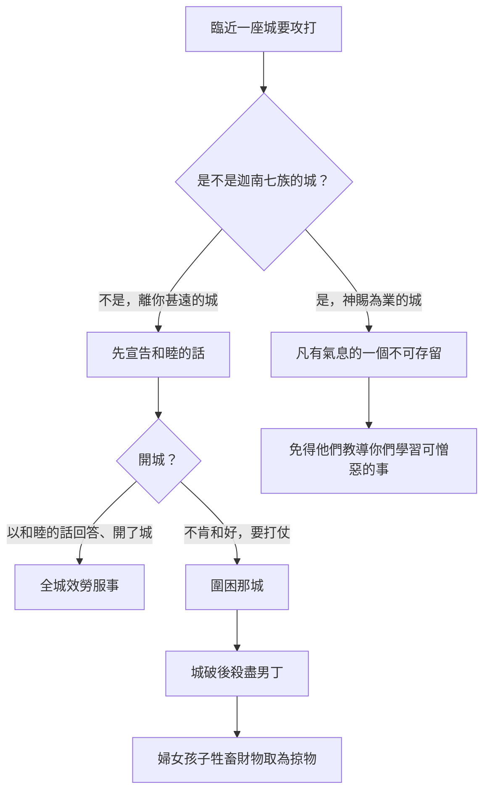
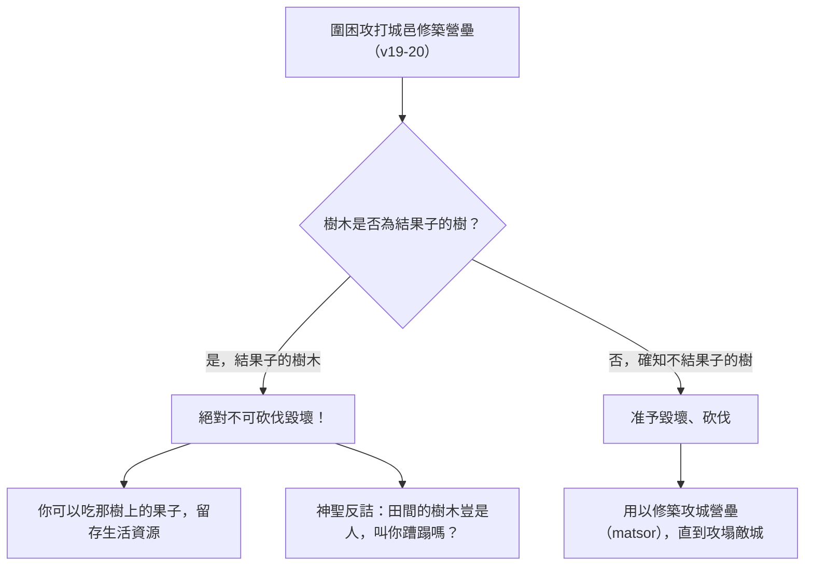

# 申命記 第20章

<!-- chapter-navigation:start -->
| [前一章](../05%20申命記/第19章.md) | [回目錄](../05%20申命記/全書目錄及綱要.md) | [下一章](../05%20申命記/第21章.md) |
| :--- | :---: | ---: |
<!-- chapter-navigation:end -->

1. 你出去與仇敵爭戰的時候，看見馬匹、車輛，並有比你多的人民，不要怕他們，因為領你出埃及地的耶和華─你神[[神的同在|與你同在]]。
2. 你們將要上陣的時候，[[爭戰前受膏祭司的宣告|祭司要到百姓面前宣告]]
3. 說：以色列人哪，你們當聽，你們今日將要與仇敵爭戰，不要膽怯，不要懼怕戰兢，也不要因他們驚恐；
4. 因為耶和華─你們的神[[神的同在|與你們同去]]，[[耶和華的爭戰|要為你們與仇敵爭戰]]，拯救你們。
5. [[以色列人的官長|官長]]也要對百姓宣告說：誰建造房屋，尚未奉獻，[[免服兵役的四種人|他可以回家去]]，恐怕他陣亡，別人去奉獻。
6. 誰種葡萄園，[[迦南地栽種果樹頭三年果子如未受割禮的條例|尚未用所結的果子]]，[[免服兵役的四種人|他可以回家去]]，恐怕他陣亡，別人去用。
7. 誰聘定了妻，尚未迎娶，[[免服兵役的四種人|他可以回家去]]，恐怕他陣亡，別人去娶。
8. [[以色列人的官長|官長]]又要對百姓宣告說：誰懼怕膽怯，[[免服兵役的四種人|他可以回家去]]，恐怕他弟兄的[[心消化（ma.sas）|心消化]]，和他一樣。
9. [[以色列人的官長|官長]]對百姓宣告完了，就當派軍長率領他們。
10. 你臨近一座城、要攻打的時候，先要對城裡的民宣告[[平安（shalom）|和睦的話]]。
11. 他們若以[[平安（shalom）|和睦的話]]回答你，給你開了城，城裡所有的人都要給你效勞，服事你；
12. 若不肯與你和好，反要與你打仗，你就要圍困那城。
13. 耶和華─你的神把城交付你手，你就要用刀殺盡這城的男丁。
14. 惟有婦女、孩子、牲畜，和城內一切的財物，你可以取為自己的[[戰利品的分配辦法|掠物]]。耶和華─你神把你仇敵的財物賜給你，你可以吃用。
15. [[遠方城的招降條例|離你甚遠的各城]]，不是這些國民的城，你都要這樣待他。
16. 但這些國民的城，耶和華─你神既[[產業（na.cha.lah）|賜你為業]]，[[迦南滅絕命令的歷史範圍|其中凡有氣息的，一個不可存留]]；
17. 只要照耶和華─你神所吩咐的將這[[迦南七族（迦南地原住民）|赫人、亞摩利人、迦南人、比利洗人、希未人、耶布斯人]]都[[滅絕（herem）|滅絕淨盡]]，
18. 免得他們教導你們學習一切[[可憎的物（to.e.vah）|可憎惡的事]]，就是他們向自己神所行的，以致你們得罪耶和華─你們的神。
19. 你若許久圍困、攻打所要取的一座城，就[[圍城不可砍伐果樹的條例|不可舉斧子砍壞樹木]]；因為你可以吃那樹上的果子，不可砍伐。田間的樹木豈是人，叫你蹧蹋嗎？
20. 惟獨你所知道不是結果子的樹木可以毀壞、砍伐，用以[[古代近東的圍城戰與營壘|修築營壘]]，攻擊那與你打仗的城，直到攻塌了。

---

## 本章知識節點

### 神學
- [[耶和華的爭戰]]
- [[神的同在]]
- [[滅絕（herem）]]

### 人物
- [[以色列人的官長]]

### 原文
- [[心消化（ma.sas）]]
- [[可憎的物（to.e.vah）]]
- [[產業（na.cha.lah）]]
- [[平安（shalom）]]

### 主題
- [[爭戰前受膏祭司的宣告]]
- [[免服兵役的四種人]]
- [[遠方城的招降條例]]
- [[圍城不可砍伐果樹的條例]]
- [[戰利品的分配辦法]]
- [[迦南地栽種果樹頭三年果子如未受割禮的條例]]

### 背景
- [[迦南七族（迦南地原住民）]]
- [[古代近東的圍城戰與營壘]]

### 解經爭議
- [[迦南滅絕命令的歷史範圍]]

---

## 本章整理

### 出戰之前，先聽祭司說話（v1-4）

本章一開頭就擺出一個很不利的畫面：出去與仇敵爭戰的時候，看見馬匹、車輛，並有比你多的人民。這不是誇飾。CT 說：「『馬匹、車輛』迦南人有許多馬匹、車輛(參書十一4)，而以色列人當時僅有步兵，須等到大衛作王時才有馬兵。」BH 也把馬匹與戰車讀成當時軍事實力與技術水準的象徵。經文接下來卻沒有給任何戰術，只給了一個理由——[[神的同在|耶和華你神與你同在]]。

更值得注意的是第一個開口的人。不是將領，是祭司。[[爭戰前受膏祭司的宣告|臨陣宣告]] 被寫成固定程序：祭司要走到百姓面前，說一段只講神不講兵力的話。CT 指出這位祭司不是一般祭司，而是「像非尼哈那樣的隨軍祭司(參民三十一6)，其地位僅次於大祭司」，並記下 KJV 另加的說明 the anointed of war；GT《聖經精讀本》說猶太拉比稱他們為特地「為爭戰而受膏之人」。GT《啟導本聖經申命記註釋》補上一句：「祭司不只宣告，有時也隨軍出戰（看書六4～21）。」

他說的話裡連用四個否定詞。STEP語言資料顯示這四個動詞各不相同：ye.Rakh（H7401，ra.khakh: be tender）、ti.re.'U（H3372G，ya.re: to fear）、tach.pe.Zu（H2648，cha.phaz: to hurry）、ta.'ar.Tzu（H6206，a.rats: to tremble）。CT 進一步把它們配上四種戰場聲響：「這裡用四個詞來形容新兵的怯戰心理：(1)膽怯，指對著馬嘶和刀光劍影；(2)懼怕，指對著盾牌碰擊所發響聲；(3)戰兢，指對著號角聲音；(4)驚恐，指對著衝鋒上陣的吶喊聲。」KC 數的也是四個，但他讀成祭司給的四重鼓勵。

| 宣告經文 | 希伯來原文與形態（STEP語言資料） | 怯戰心理（CT 分析） | 屬靈對策 |
| --- | --- | --- | --- |
| 不要膽怯 | 'al- ye.Rakh（H7401）心軟弱 | 對著敵軍馬嘶與刀光劍影 | 剛強壯膽，不看外在劣勢 |
| 不要懼怕 | 'al- ti.re.'U（H3372G）畏懼 | 對著敵方盾牌碰撞發出的巨響 | 定睛於神，不陷於感官震撼 |
| 不要戰兢 | ve./'al- tach.pe.Zu（H2648）驚惶慌亂 | 對著軍號長鳴與警報驟響 | 沉著穩定，不致陣腳大亂 |
| 不要因他們驚恐 | ve./'al- ta.'ar.Tzu（H6206）戰慄顫抖 | 對著衝鋒陷陣的吶喊呼號 | 信靠磐石，不被聲勢壓倒 |

GT《申命記串珠聖經註釋》把整段壓成一句：「勝敵之秘訣乃在乎神的同在。」這正是 [[耶和華的爭戰]] 在申命記裡一再出現的說法——第4節的「爭戰」與「拯救」，主詞都是耶和華。

### 官長清點的不是人數，是心（v5-9）

祭司講完，換 [[以色列人的官長]] 開口，而他講的是誰可以不去。這一段是全章最反直覺的地方：一支即將面對馬匹車輛的軍隊，被律法要求主動把人放回家。

[[免服兵役的四種人|四種人可以回家去]]，前三種寫在同一次宣告裡（v5-7），第四種另起一段（v8）。

| 誰 | 節 | 原文關鍵詞（STEP語言資料） | 法律與人道考量 | 屬靈教訓與預表 |
| --- | --- | --- | --- | --- |
| 建了新房屋還沒奉獻 | v5 | cha.na.Kh/o（H2596，cha.nakh: to dedicate） | 保障勞動成果，免得陣亡後產業落入他人之手（CT 指獻屋是感恩禮，詩三十1） | 初信者需先在屬靈家庭（神的家）中安居與扎根（提前三15） |
| 種了葡萄園還沒用果子 | v6 | chi.le.L/o（H2490I，cha.lal，本節譯義 put to use） | 依利十九23-25需等候至第五年俗用，體恤農民長期辛勞（見 [[迦南地栽種果樹頭三年果子如未受割禮的條例]]） | 先親自享受救恩初熟之喜樂，方能對外有力見證（士九13） |
| 聘定了妻還沒迎娶 | v7 | 'e.Ras（H781，a.ra.s: to betroth） | 訂婚具法律約束力；保護家族血脈並免使新婦孤單（申二十四5） | 先操練與主基督親密交通，不可帶著分心世務上陣 |
| 懼怕膽怯 | v8 | hai./ya.Re'（H3373）加 ve./Rakh ha./le.Vav（H7390 加 H3824） | 防止恐慌傳染導致全軍崩潰（[[心消化（ma.sas）]]） | 聖戰重在全然信靠與委身；神不以人數算術為戰術（基甸挑兵，士七3） |

前三種的共同點是開始了卻還沒享用。GT《啟導本聖經申命記註釋》認為這些條例「目的不外保護財產不喪失或者讓一家一門有後，基本上所著重的是個人享受神賜福氣的權利」。第四種的理由完全不同——經文說「恐怕他弟兄的心消化，和他一樣」。[[心消化（ma.sas）|心消化]] 這個說法 BH 講得很到位：「The metaphor of hearts melting conveys the contagious nature of fear and its potential to undermine collective strength.」（心融化的比喻表達了恐懼會傳染，也可能瓦解群體的力量。）KC 舉了兩個例子：保羅打發約翰馬可回去（徒15:38），以及基甸照這一節放人回家、結果走掉兩萬兩千人（士7:3）。

> [!important]
> 各家對這段的理由是一致的：GT《申命記雷氏研讀本》說豁免條例「有助確保勝利是有賴耶和華（比較4節），表示參軍並不是首要的事」；GT《申命記串珠聖經註釋》說「軍隊的品質比數量更重要」。==裁軍在這裡不是損失，是論證。==

官長講完才輪到軍長。CT 指出兩者的分工：「『官長』指奉命徵集士兵的官長，是文官；『軍長』指各級軍隊指揮官，是武官。」也就是說，本章把指揮權放在整個程序的最後一步。

### 兩套攻城規則：遠方的城與迦南的城（v10-18）

第10節起進入實際作戰，而經文在這裡分岔。第15節那句「離你甚遠的各城，不是這些國民的城」把規則切成兩套，第16節「但這些國民的城」立刻轉向另一套。

[[遠方城的招降條例|遠方的城]] 走的是招降路線。CT 說「宣告和睦的話」指講明招降的和平條款，而且在第10節底下加了備註：10~15節僅適用於迦南地以外的敵城。STEP語言資料顯示第10、11節的「和睦」是 sha.Lom（H7965G），第12節的「和好」則是動詞 tash.Lim（H7999B，sha.lam）——同一組字的名詞與動詞。CT 由此讀出神的性情：「神希望所有的人都知道神是和睦(原文是平安)的神，是賜平安的神」（見 [[平安（shalom）]]）。

開城的代價是服勞役。STEP語言資料顯示「效勞」是 la./Mas（H4522，mas: taskworker），「服事」是 va./'a.va.Du./kha（H5647G，a.vad: to serve）。各家對這個結果的評價並不相同，值得並排看：GT《申命記雷氏研讀本》說這是「挪亞咒詛迦南的應驗」；GT《聖經精讀本》引猶太學者說這些城的居民即使不受割禮，也要放棄拜偶像，在宗主權性契約之下獻貢於以色列；KC 說聽從和平的提議會帶出一種立約關係，本來屬於世界範圍的因此被帶進神子民的範圍並為之效力；BH 則指出強迫勞役是古代近東對降服者的常見處置，也讓人想起以色列自己在埃及的遭遇（出1:11）。

拒絕的城要被圍困，城破後殺盡男丁，婦孺牲畜財物可以取為 [[戰利品的分配辦法|掠物]]。GT《聖經精讀本》解釋這個處置的社會意義：「在古代社會,男子就是一個家庭、城邑及國家的代表,因此,這樣的懲罰意味著完全滅絕一個族類。」

另一套規則沒有和睦的話。[[迦南七族（迦南地原住民）|赫人、亞摩利人、迦南人、比利洗人、希未人、耶布斯人]] 要 [[滅絕（herem）|滅絕淨盡]]——STEP語言資料顯示這是 ha.cha.Rem ta.cha.ri.Me/m（H2763A，cha.ram: to devote/destroy），不定詞絕對式加未完成式的強調結構。經文自己在第18節給了理由：免得他們教導以色列學習一切 [[可憎的物（to.e.vah）|可憎惡的事]]。這片地是神 [[產業（na.cha.lah）|賜你為業]] 的，界線因此不同。

> [!note]
> 這道命令在歷史上該怎麼理解，各家都有交代，並且都不把它當成通則（見 [[迦南滅絕命令的歷史範圍]]）。GT《申命記串珠聖經註釋》直接面對難處：「有人以為這做法有欠人道，然而此舉正是罪惡滿盈的迦南居民該受的審判（參創15:16），也是保持新興以色列國純正無疵之法（18）。」KC 說和平的提議只適用於地界以外的城；BH 把這道嚴厲命令限定在迦南征服在救贖歷史中的特殊位置。GT《申命記背景注釋》另從古代近東的角度指出，把俘虜和掠物全數奉獻給神祇的做法「軍事策略中十分罕見」，希伯來語稱為赫倫，聖經裡真正徹底摧毀一座城的例子只有寥寥幾次。

### 斧子舉起來之前（v19-20）

全章最後一段管的是樹。這看起來像附帶條款，其實是整章分界線最清楚的一次表態。

問題在於木材就是軍需品。CT 說：「古時人攻城的戰術之一，就是堆木石築壘，方便上城牆殺敵」，並列出砍下來的木頭會做成什麼——壘（撒下二十15，即坡道）、戍樓（賽二十三13，即攻城台）、撞城錘（結二十六9）。GT《申命記串珠聖經註釋》說 [[古代近東的圍城戰與營壘|營壘]] 是「指攻城用的堡壘和其他工具（如雲梯）」，GT《靈修版聖經註釋》則給出考古的規模：「考古學家在迦南地發掘出許多堅固城邑的遺跡。有些城牆有九公尺高，有堡壘、壕溝與瞭望樓。」在這種城牆前面，一支缺木材的軍隊是真的打不下來。

律法還是說不可以。[[圍城不可砍伐果樹的條例|不可舉斧子砍壞果樹]]，分界線畫在能不能吃——STEP語言資料顯示第20節說的是 lo'- 'etz ma.'a.Khal（H3978，ma.a.khal: food），逐字是不是食物之樹。GT《申命記串珠聖經註釋》對第19節那句反問的解釋只有一句：「不要把樹木當作那應遭毀滅的敵人而把它們砍掉。」KC 說得更短：「Trees do no harm to people.」（樹木不傷害人。）BH 則從倫理的角度看：「This principle of conservation can be seen as an early form of environmental stewardship.」（這種保育原則可以視為環境管家職分的早期形式。）

各家的落點略有不同。GT《啟導本聖經申命記註釋》講後果：「在戰爭中，仍應注意天然環境的保護」，並感嘆要是後來入侵巴勒斯坦的軍隊都肯守這原則，中東的樹木當不致如彼稀少，巴勒斯坦果園多種植於山坡梯田，橄欖樹成材結實需數十年，若任意砍伐將引發戰後幾代人的大饑荒。GT《聖經精讀本》講動機：這段戰爭倫理「是要堅決杜絕由憤怒或血氣所引起的魯莽而蓄意性的破壞行為」。CT 講恩典：神在創造的時候就把果樹作為恩典賜給人（參創一29），所以不可蹧蹋神所賞賜的；他對第20節的讀法是「不結果子的樹木，就是白占地土」，砍下來反而還有一點貢獻。

### 全章的那條界線

把四段放在一起，本章的順序本身就是論點：先確定神在不在（v1-4），再決定誰去（v5-9），然後才談怎麼打（v10-20）。KC 為整章開頭下的定位是「There will be no expansion if there is no fight.」（沒有爭戰就沒有擴張。）他並指出希伯來文裡「爭戰」與「事奉」是同一個字，因此傳講神的話既是利未人的事奉，也是爭戰。

另一條界線更安靜，卻貫穿全章：受審判的是人，不是地。對迦南七族是凡有氣息的一個不可存留，對果樹卻連斧子都不可舉。GT《啟導本聖經申命記註釋》在第1節底下記下的那句「以色列人是全民皆兵，人人有保衛國土的責任」，說的是義務的一面；而本章從頭到尾在做的，是把這份義務綁在神身上——不是綁在馬匹、車輛，也不是綁在人數上。

**參考資料**
https://www.ccbiblestudy.org/Old%20Testament/05Deut/05CT20.htm
https://www.ccbiblestudy.org/Old%20Testament/05Deut/05GT20.htm
https://www.kingcomments.com/en/bible-studies/Deu/20
https://biblehub.com/study/deuteronomy/20.htm
https://github.com/STEPBible/STEPBible-Data

<!-- appendix-links:start -->
## 附錄

### 相關地圖
- [[appendix/fhl_maps/maps/025|〈申圖一〉應許之地全圖]]
<!-- appendix-links:end -->

<!-- chapter-navigation:start -->
| [前一章](../05%20申命記/第19章.md) | [回目錄](../05%20申命記/全書目錄及綱要.md) | [下一章](../05%20申命記/第21章.md) |
| :--- | :---: | ---: |
<!-- chapter-navigation:end -->
