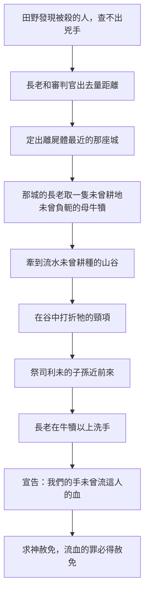

# 申命記 第21章

<!-- chapter-navigation:start -->
| [前一章](../05%20申命記/第20章.md) | [回目錄](../05%20申命記/全書目錄及綱要.md) | [下一章](../05%20申命記/第22章.md) |
| :--- | :---: | ---: |
<!-- chapter-navigation:end -->

1. 在耶和華─你神所賜你為業的地上，若遇見被殺的人倒在田野，不知道是誰殺的，
2. [[以色列的長老|長老]]和[[審判官]]就要出去，從被殺的人那裡量起，直量到四圍的城邑，
3. 看哪城離被殺的人最近，那城的[[以色列的長老|長老]]就要從牛群中取一隻未曾耕地、未曾負軛的母牛犢，
4. 把母牛犢牽到流水、未曾耕種的山谷去，在谷中[[無主命案的折頸母牛犢條例|打折母牛犢的頸項]]。
5. [[利未支派|祭司利未的子孫]]要近前來；因為耶和華─你的神揀選了他們事奉他，奉耶和華的名祝福，所有爭訟毆打的事都要憑他們判斷。
6. 那城的眾[[以色列的長老|長老]]，就是離被殺的人最近的，要在那山谷中，在所打折頸項的母牛犢以上[[洗手表明無辜（太27：24）|洗手]]，
7. 禱告（原文作回答）說：我們的手未曾流這人的血；我們的眼也未曾看見這事。
8. 耶和華啊，求你赦免你所救贖的以色列民，不要使[[流無辜血的罪]]歸在你的百姓以色列中間。這樣，[[贖罪|流血的罪必得赦免]]。
9. 你行耶和華眼中看為正的事，就可以從你們中間除掉[[流無辜血的罪]]。
10. 你出去與仇敵爭戰的時候，耶和華─你的神將他們交在你手中，你就擄了他們去。
11. 若在被擄的人中[[娶被擄女子為妻的條例|見有美貌的女子]]，戀慕他，要娶他為妻，
12. 就可以領他到你家裡去；他便要剃頭髮，修指甲，
13. 脫去被擄時所穿的衣服，住在你家裡哀哭父母一個整月，然後可以與他同房。你作他的丈夫，他作你的妻子。
14. 後來你若不喜悅他，就要由他隨意出去，決不可為錢賣他，也不可當婢女待他，因為你玷污了他。
15. 人若有二妻，一為所愛，一為所惡，所愛的、所惡的都給他生了兒子，但長子是所惡之妻生的。
16. 到了把[[產業（na.cha.lah）|產業]]分給兒子承受的時候，不可將所愛之妻生的兒子立為長子，在所惡之妻生的兒子以上，
17. 卻要認所惡之妻生的兒子為長子，將產業多加一分給他；因這兒子是他力量強壯的時候生的，[[長子名分|長子的名分本當歸他]]。
18. 人若有[[申21：18-21|頑梗悖逆的兒子]]，[[當孝敬父母|不聽從父母的話]]，他們雖懲治他，他仍不聽從，
19. 父母就要抓住他，將他帶到[[城門口公共場合|本地的城門]]、本城的[[以色列的長老|長老]]那裡，
20. 對[[以色列的長老|長老]]說：我們這兒子頑梗悖逆，不聽從我們的話，是貪食好酒的人。
21. 本城的眾人就要用石頭將他打死。這樣，就[[把那惡從你們中間除掉（ba.ar）|把那惡從你們中間除掉]]，以色列眾人都要聽見害怕。
22. 人若犯該死的罪，被治死了，你將他[[掛在木頭上_懸屍示眾|掛在木頭上]]，
23. 他的屍首不可留在木頭上過夜，必要當日將他葬埋，免得玷污了耶和華─你神[[產業（na.cha.lah）|所賜你為業之地]]。因為[[被掛在木頭上與基督被掛在樹上_徒5_30_加3_13|被掛的人是在神面前受咒詛的]]。

---

## 本章知識節點

### 主題
- [[無主命案的折頸母牛犢條例]]
- [[娶被擄女子為妻的條例]]
- [[長子名分]]

### 互文
- [[洗手表明無辜（太27：24）|洗手表明無辜（太27：24） 長老在母牛犢以上洗手宣告清白]]
- [[申21：18-21|申21：18-21 頑梗悖逆之子與出埃及記21章打罵父母的死罪]]
- [[被掛在木頭上與基督被掛在樹上_徒5_30_加3_13|被掛在木頭上與基督被掛在樹上（徒5:30、加3:13）]]

### 文化
- [[以色列的長老]]

### 人物
- [[利未支派]]

### 原文
- [[審判官]]
- [[產業（na.cha.lah）]]

### 神學
- [[流無辜血的罪]]
- [[贖罪]]
- [[當孝敬父母]]
- [[把那惡從你們中間除掉（ba.ar）]]

### 歷史
- [[城門口公共場合]]
- [[掛在木頭上_懸屍示眾]]

---

## 本章整理

### 田野裡的無名屍（v1-9）

本章一開始就換了一種題材。CT 在第1節底下說得直接：「從本章開始所吩咐的律法，卻都是一些瑣碎小事(參申二十一1~二十五19)。」但第一件瑣碎小事一點也不小——田野裡發現被殺的人，不知道是誰殺的。

律法沒有停在查不出來這句話上。CT 把問題重新定位：「這是一宗懸案，兇手未能查明緝獲，土地已因血案被玷污，必須贖罪才能潔淨」。GT《啟導本聖經申命記註釋》把這個觀念放進古代法律史裡：「中東的《漢慕拉比法典》規定，最近血案發生地點的那城，應負賠償苦主及死者所屬城鄉損失的責任。這裡用的也是同一原則。」KC 則注意到地點：「The scene of the crime is the open country, not a city.」（案發現場是曠野，不是城裡。）他並指出人類歷史上第一宗謀殺也發生在田間（創4:8）。

[[無主命案的折頸母牛犢條例|接下來的程序]] 一步接一步，每一步都在縮小責任的範圍。

牲畜的條件有講究。CT 說：「『未曾耕地、未曾負軛』意指未曾被玷污，全然聖潔」；GT《申命記串珠聖經註釋》更短：「「未曾耕地」：神聖的象徵。」地點也有講究，STEP語言資料顯示「流水」是 Na.chal 'ei.Tan（H5158N na.chal 加 H386 e.tan），本節譯義作 ever-flowing。KC 把它讀成恩典的圖像：「The running water speaks of the never-ending grace of God.」（那流動的水說到神永不止息的恩典。）BH 對第2節量距離的評語很務實：「Measuring the distance was a practical method to determine jurisdiction and responsibility.」（量距離是判定管轄與責任歸屬的實際辦法。）

在場的人分三種角色：[[以色列的長老|長老]] 代表那城、[[審判官]] 負責量與判、[[利未支派|祭司利未的子孫]] 近前來。第5節說他們的職分有三樣——事奉、奉耶和華的名祝福、判斷所有爭訟毆打的事。

> [!question]
> 這算不算獻祭？各家並不一致，值得並陳。GT《啟導本聖經申命記註釋》說：「殺死母牛犢不同於獻贖罪之祭，只是讓它擔負流人血的罪，使這罪不再歸到城中的百姓身上。」KC 講得更斷然：「It is rather atonement through justice.」（這毋寧是藉公義成就的贖罪。）——牛犢的血什麼也沒有做。BH 也說打折頸項而不是流血獻祭，正是這個禮儀與其他獻祭作法不同的地方。但 GT《聖經精讀本──申命記註解》的重點恰好在血上，他引來9:22 說若不流血罪就不得赦免，並認為儀式含有若捉住殺人犯也必照樣流其血的意義。經文本身只說打折頸項（見 [[贖罪]]）。

長老最後那個動作也有兩種讀法（見 [[洗手表明無辜（太27：24）]]）。CT、GT 兩家與 BH 都說洗手是宣告清白，並都指向彼拉多在審判耶穌時洗手；KC 卻說長老洗手是與祭物認同的記號（詩26:6；73:13），不像彼拉多那樣什麼都不想沾。第9節收尾說可以從你們中間除掉 [[流無辜血的罪]]。

### 從被擄的人到妻子（v10-14）

第二段換到戰後。順著第二十章讀下來，這裡會出現一個明顯的問題：上一章才吩咐迦南七族的城凡有氣息的一個不可存留，這裡怎麼又准許娶被擄的女子？四套來源在這一段的開頭都先回答了這件事——適用對象是迦南以外的俘虜。CT 在第11節加了備註：「神命不可留迦南人的活口(參申二十16)，故這些俘虜當係迦南人以外的敵人，可以將其婦女、孩童、牲畜、財物據為己有(參申二十14)。」GT《啟導本聖經申命記註釋》說「敵人」指迦南四境外的國民，戰敗之後其婦女可以留下、不在消滅之列；GT《申命記雷氏研讀本》說這種在第七章3、4節之條例以外的做法，只應用於從迦南以外擄來的俘虜；GT《聖經精讀本──申命記註解》講得最短：「但是,絕對禁止娶迦南女子(7:3)。」KC 也把界線劃在同一處——不可以是迦南列國的女子（申20:16-18），只能是地界以外列國的女子（申20:15）。==換句話說，這一段接的不是第二十章16至18節，而是第10至15節那套遠方城的規則。==

界線劃定之後，[[娶被擄女子為妻的條例|律法准許娶她為妻]]，但先要走完一個月。剃頭髮、修指甲、脫去被擄時所穿的衣服、住在家裡哀哭父母一個整月，然後才可同房。

這段程序的意思各家講法略有不同：CT 說剃頭髮修指甲有兩種可能，或是為父母哀哭的表示，或是潔淨自己使與未來的丈夫相稱；GT《聖經精讀本》說潔淨儀式含有徹底清理過去生活習慣、進入以色列共同體開始新生活的意思；KC 說凡在她從前的身分裡使她有吸引力、標誌著她的，都必須除去。BH 給的理由最實際：一個月讓她有時間哀悼與適應，也確保娶她的決定不是倉促作成的。

真正的重點在第14節。後來若不喜悅她，要由她隨意出去，不可為錢賣她，也不可當婢女待她。CT 說：「一旦成為夫妻，便不可待她婢女，隨意轉賣。」STEP語言資料顯示「玷污」是 'i.ni.Ta/h（H6031B，a.nah: to afflict），本節譯義是 you have humiliated her，而 CT 的原文字義給的是苦待、錯待。==條例的最後一句不是給丈夫的自由，是給那女子的保障。==

### 長子的名分不由感情決定（v15-17）

第三段從戰場回到家裡。人若有二妻，一為所愛、一為所惡，而長子偏偏是所惡之妻生的，分產業的時候不可改立。

先要說清楚所惡是什麼意思。GT《申命記雷氏研讀本》註得很直接：「“所惡”。這是相對的說法，即對比於另一個妻子來說。」CT 也說『所愛…所惡』乃是假設的情況，並非一定如此。STEP語言資料顯示這兩個字分別是 a.hu.Vah（H157G，a.hav: to love）與 se.nu.Ah（H8130，sa.ne: to hate），第15節末尾另用了形容詞 la./se.ni.Ah（H8146，sa.ni: hated）。

這個假設在聖經裡有一個現成的原型。BH 連著三節都指向同一個家庭：「The story of Jacob, Rachel, and Leah in Genesis 29-30 illustrates the tension and rivalry that can arise when one wife is favored over another.」（雅各、拉結與利亞的故事說明了一位妻子受偏愛時可能引起的緊張與競爭。）他在第16節說得更貼近本條例：「Leah, though less loved by Jacob, bore him his firstborn son, Reuben.」（利亞雖然比較不被雅各所愛，卻為他生了長子流便。）KC 也用同一個家庭，但讀出的是預表：「In Jacob and his two wives – Lea and Rachel – we see such an illustration.」（在雅各和他的兩個妻子利亞與拉結身上，我們看見這樣一幅圖畫。）他接著把不蒙愛的妻子讀成暫時被撇下的以色列，蒙愛的讀成教會，而長子的名分終究仍歸不蒙愛之妻所生的那一位。

制度面各家講法一致。GT《啟導本聖經申命記註釋》交代背景：「在東方社會，長子在家庭中享有特別地位，可從父親得雙分產業。」並說本節至17節規定產業的承受權應依出生先後，不可本諸對妻妾的愛惡。GT《申命記串珠聖經註釋》說這是為了保障那些不受寵愛之長子的權利，以及禁止父親無故廢掉長子的嗣業。GT《聖經精讀本──申命記註解》另指出這條律法的背景是一夫多妻制，而聖經明確地規定了一夫一妻制(創2:24;太19:5)，當時只是因為時代的邪惡與啟示未完全顯明而暫時存在的制度；他並補上沒有兒子時的順序——就當從女兒開始，以已故之人的兄弟、叔父等順序分配遺產(民27:8-11)。BH 說得更完整：「The double portion signifies the inheritance rights of the firstborn, which included a larger share of the father's estate.」（雙份代表長子的繼承權，其中包括父親產業中較大的一份。）

| 原文片語 | STEP語言資料 | 各家補充 |
| --- | --- | --- |
| 多加一分 | pi she.Na.yim（H6310K 加 H8147），字面是兩份的口 | CT 原文字義：「多加一分(原文雙字)」二，雙(首字)；口(次字)；GT《申命記雷氏研讀本》：「長子得到父親產業的雙分（比較創四八22；王下二9；代上五1）」 |
| 立為長子 | le./va.Ker（H1069，ba.khar: to be/bear firstborn） | GT《申命記串珠聖經註釋》：「長子比弟弟應多得一倍遺產」 |
| 力量強壯的時候 | re.Shit o.N/o（H7225G 加 H202，on: strength） | GT《申命記雷氏研讀本》：「“力量強壯的時候”。開始生育的時候」；BH 說 firstfruits 這個詞在聖經語彙裡常指獻給神的初熟之物（出23:19） |
| 長子的名分 | mish.Pat ha./be.kho.Rah（H4941H mish.pat 加 H1062 be.kho.rah） | CT 原文字義：「名分」判決，判案，律例 |

[[長子名分|長子的名分]] 在這裡因此不是一種待遇，而是一項可以主張的權利——原文用的是 mish.pat 這個帶著判決意味的字。CT 的話中之光只有一句，卻把重點壓住了：「長子就是長子，誰也不能改變這事實。」

### 頑梗悖逆的兒子（v18-21）

第四段是全章最嚴厲的一條。屢懲不改的兒子要被父母帶到 [[城門口公共場合|本地的城門]]、本城的長老那裡，由本城的眾人用石頭打死（見 [[申21：18-21]]）。

STEP語言資料顯示「頑梗悖逆」用了兩個都表示叛逆的字：so.Rer（H5637，sa.rar）與 u./mo.Reh（H4784，ma.rah）；「貪食好酒」是 zo.Lel ve./so.Ve'（H2151B 加 H5433B）。CT 的解釋很生活化：「『貪食好酒的人』意指好吃懶做、毫無用處的人」。

各家都把這條接回十誡。GT《啟導本》說這是「違反十誡當孝敬父母的規定，因此要處死」（見 [[當孝敬父母]]）；GT《聖經精讀本》說父母的權威是受十誡保障的人倫第一法則，是基於神的權威（出20:12）。CT 也引弗六2~3 說明神何等重視孝敬父母。

> [!note]
> 執行面上有一個各家都提到的事實。GT《申命記雷氏研讀本》寫的是：「根據猶太人的傳統，這懲罰從來沒有執行過，但卻少年罪案一個強大的制止力量！」CT 也記下同一個傳統，說以色列的歷史上並沒有出現過這種案例。GT《雷氏研讀本》另指出一個結構上的重點：最後的權威在於眾長老，而不是父親——把兒子帶到城門，事情就不再是家務事了。CT 說：「『城門』是古時以色列人審理案件、處裡公務的地方」。

第21節的收尾是申命記的固定句式：[[把那惡從你們中間除掉（ba.ar）|把那惡從你們中間除掉]]。STEP語言資料顯示這個動詞與第9節除掉流無辜血的罪是同一個字（H1197I，ba.ar，簡要詞典義 to burn: purge）——本章的頭一段與這一段，用同一個動作收尾。

### 掛在木頭上的屍首（v22-23）

最後兩節處理的是屍體。GT《申命記雷氏研讀本》先把事實講清楚：「絞刑不是常見的處死方法，不過人被治死後屍首會懸掛起來。」也就是說，[[掛在木頭上_懸屍示眾|掛在木頭上]] 是死後示眾，不是處決的方式。GT《聖經精讀本》說這是給屍體加上污辱與羞恥的刑罰，是人所遭受最可怕的恥辱。

規定卻是不可過夜，當日必要葬埋。理由寫在同一節：免得玷污了神所賜為業之地。BH 說：「The practice of same-day burial is still observed in Jewish tradition today.」（當日埋葬的作法至今仍是猶太人的傳統。）

最後一句是全章最被引用的一句：因為被掛的人是在神面前受咒詛的。STEP語言資料顯示這是 ki.Lat 'E.lo.Him ta.Lui（H7045 qe.la.lah: curse 加 H430G 加 H8518 ta.lah: to hang）。CT 直接接到新約：「主耶穌被掛在木頭上，是為罪人成為咒詛(參加三13)」（見 [[被掛在木頭上與基督被掛在樹上_徒5_30_加3_13]]）。GT《申命記串珠聖經註釋》說基督卻選擇了這種死法，藉此為世人除去咒詛。KC 把這一段讀成十字架的第三個面向，並在最後轉向信徒自己：「Our old man must be buried.」（我們的舊人必須被埋葬。）

### 五段條例的共同軸線

本章看起來像五件不相干的事：無名屍、女戰俘、長子名分、逆子、屍首。但每一段都發生在同一種時刻——有人手上握著別人的命運，而且可以合法地不作為。查不出兇手就可以算了、戰勝者可以任意處置俘虜、父親可以按偏愛分產業、父母可以放棄管教、行刑者可以把屍首晾著。律法在五處都插進一道限制。

地也在全章首尾出現兩次。STEP語言資料顯示第1節「所賜你為業的地上」與第23節「所賜你為業之地」用的都是 'a.da.Mah（H127G，a.da.mah: land: soil）；不過兩處的「為業」不是同一個字——第23節是名詞 na.cha.Lah（H5159，見 [[產業（na.cha.lah）]]），第1節則是 le./rish.Ta/h（H3423H，ya.rash，本節譯義 to take possession of it）。第16節分產業用的是同字根的動詞 han.chi.L/o（H5157），而第17節「將產業多加一分給他」原文並沒有這個字，「產業」是中文補上的。==第一段怕血玷污這片地，最後一段怕屍首玷污這片地；中間三段管的是人怎麼對待人。==

**參考資料**
https://www.ccbiblestudy.org/Old%20Testament/05Deut/05CT21.htm
https://www.ccbiblestudy.org/Old%20Testament/05Deut/05GT21.htm
https://www.kingcomments.com/en/bible-studies/Deu/21
https://biblehub.com/study/deuteronomy/21.htm
https://github.com/STEPBible/STEPBible-Data

<!-- appendix-links:start -->
## 附錄

### 相關地圖
- [[appendix/fhl_maps/maps/025|〈申圖一〉應許之地全圖]]
<!-- appendix-links:end -->

<!-- chapter-navigation:start -->
| [前一章](../05%20申命記/第20章.md) | [回目錄](../05%20申命記/全書目錄及綱要.md) | [下一章](../05%20申命記/第22章.md) |
| :--- | :---: | ---: |
<!-- chapter-navigation:end -->
