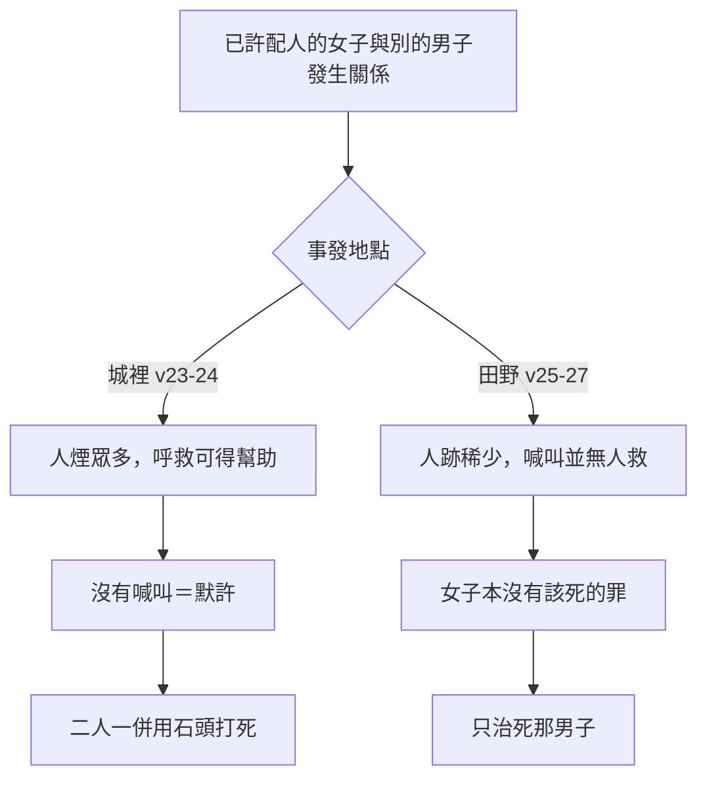

# 申命記 第22章

<!-- chapter-navigation:start -->
| [前一章](../05%20申命記/第21章.md) | [回目錄](../05%20申命記/全書目錄及綱要.md) | [下一章](../05%20申命記/第23章.md) |
| :--- | :---: | ---: |
<!-- chapter-navigation:end -->

1. 你若看見弟兄的牛或羊失迷了路，[[愛鄰舍與仇敵|不可佯為不見]]，總要把他牽回來交給你的弟兄。
2. 你弟兄若離你遠，或是你不認識他，就要牽到你家去，留在你那裡，等你弟兄來尋找就還給他。
3. 你的弟兄無論失落什麼，或是驢，或是衣服，你若遇見，都要這樣行，[[愛鄰舍與仇敵|不可佯為不見]]。
4. 你若看見弟兄的牛或驢跌倒在路上，[[愛鄰舍與仇敵|不可佯為不見]]，總要幫助他拉起來。
5. [[男女不可易服的條例|婦女不可穿戴男子所穿戴的]]，男子也不可穿婦女的衣服，因為這樣行都是耶和華─你神[[可憎的物（to.e.vah）|所憎惡的]]。
6. 你若路上遇見鳥窩，或在樹上或在地上，裡頭有雛或有蛋，[[不可同日宰母和子|母鳥]]伏在雛上或在蛋上，你[[放母取雛的鳥窩條例|不可連母帶雛一併取去]]。
7. [[放母取雛的鳥窩條例|總要放母]]，只可取雛，這樣你就可以享福，[[當孝敬父母|日子得以長久]]。
8. 你若建造房屋，要在房上的四圍[[房上安欄杆的條例|安欄杆]]，免得有人從房上掉下來，[[流無辜血的罪|流血的罪]]就歸於你家。
9. 不可把[[不可使異類混雜（牲畜種子衣料）|兩樣種子]]種在你的葡萄園裡，免得你撒種所結的和葡萄園的果子都要[[分別為聖|充公]]。
10. 不可並用[[潔淨與不潔淨|牛、驢]]耕地。
11. 不可穿羊毛、細麻[[不可使異類混雜（牲畜種子衣料）|兩樣攙雜料]]做的衣服。
12. 你要在所披的外衣上[[衣襟（ka.naph）|四圍]]做[[衣服邊的繸子與藍細帶子|繸子]]。
13. 人若娶妻，與他同房之後恨惡他，
14. 信口說他，[[誣告妻子不貞的三種懲罰|將醜名加在他身上]]，說：我娶了這女子，與他同房，見他沒有[[貞潔的憑據]]；
15. 女子的父母就要把女子[[貞潔的憑據]]拿出來，帶到[[城門口公共場合|本城門]][[以色列的長老|長老]]那裡。
16. 女子的父親要對[[以色列的長老|長老]]說：我將我的女兒給這人為妻，他恨惡他，
17. 信口說他，說：我見你的女兒沒有[[貞潔的憑據]]；其實這就是我女兒貞潔的憑據。父母就把那布鋪在本城的[[以色列的長老|長老]]面前。
18. 本城的[[以色列的長老|長老]]要拿住那人，懲治他，
19. 並要罰他一百[[舍客勒]]銀子，給女子的父親，因為他將醜名加在以色列的一個處女身上。女子仍作他的妻，[[誣告妻子不貞的三種懲罰|終身不可休他]]。
20. 但這事若是真的，女子沒有[[貞潔的憑據]]，
21. 就要將女子帶到他父家的門口，本城的人要用石頭將他打死；因為他在父家行了淫亂，在以色列中做了醜事。這樣，就把那惡從你們中間除掉。
22. 若遇見人與有丈夫的婦人行淫，就要將[[不可姦淫|姦夫淫婦]]一併治死。這樣，就把那惡從以色列中除掉。
23. 若有處女已經許配丈夫，有人在城裡遇見他，與他行淫，
24. 你們就要把這二人帶到[[城門口公共場合|本城門]]，用石頭打死─女子是因為[[城裡與田野對強姦案的判定|雖在城裡卻沒有喊叫]]；男子是因為玷污別人的妻。這樣，就把那惡從你們中間除掉。
25. 若有男子[[城裡與田野對強姦案的判定|在田野遇見]]已經許配人的女子，強與他行淫，只要將那男子治死。
26. 但不可辦女子；他本沒有該死的罪，這事就類乎人起來攻擊鄰舍，將他殺了一樣。
27. 因為男子是[[城裡與田野對強姦案的判定|在田野遇見]]那已經許配人的女子，女子喊叫，並無人救他。
28. 若有男子遇見[[引誘處女的律例|沒有許配人的處女]]，抓住他，與他行淫，被人看見，
29. 這男子就要拿五十[[舍客勒]]銀子給女子的父親；因他玷污了這女子，就要娶他為妻，終身不可休他。
30. 人不可娶繼母為妻；不可掀開他父親的[[衣襟（ka.naph）|衣襟]]。

---

## 本章知識節點

### 主題
- [[愛鄰舍與仇敵]]
- [[不可使異類混雜（牲畜種子衣料）]]
- [[不可同日宰母和子]]
- [[男女不可易服的條例]]
- [[放母取雛的鳥窩條例]]
- [[房上安欄杆的條例]]
- [[誣告妻子不貞的三種懲罰]]
- [[城裡與田野對強姦案的判定]]

### 原文
- [[可憎的物（to.e.vah）]]
- [[舍客勒]]
- [[衣襟（ka.naph）]]

### 神學
- [[分別為聖]]
- [[潔淨與不潔淨]]
- [[流無辜血的罪]]
- [[當孝敬父母]]
- [[不可姦淫]]

### 文化
- [[衣服邊的繸子與藍細帶子]]
- [[以色列的長老]]
- [[貞潔的憑據]]

### 歷史
- [[城門口公共場合]]

### 事件
- [[引誘處女的律例]]

---

## 本章整理

這一章讀起來像一份清單：撿到走失的牛羊、男女的衣服、路邊的鳥窩、房頂的欄杆、田裡的種子、外衣的繸子，然後突然轉進一整段婚姻與性的案例。GT《申命記串珠聖經註釋》給全章下的標題就承認了這一點——「論及有關家庭，社會關係上的各種律例，同時亦包含一些瑣碎的事」。

但 GT《啟導本聖經申命記註釋》看出這些條文有一條共同的線：「本章將若干看似無關的法例放在一道來講，其實都與生活及生命有關。」GT《聖經精讀本──申命記註解》把這條線說得更完整：本章的律法要使以色列成為仁愛、清潔的共同體，「以色列當愛鄰人(1-4節),持守道德上的純潔(13-30節),進而在建築、農耕、服飾等整個生活領域貫徹純潔與慈悲的精神(5-12節)。」

### 撿到就要送回去（v1-4）

開頭四節重複了三次同一句話：不可佯為不見。CT 給的原文字義是「佯為不見」隱藏，遮掩——不是沒看見，是看見了裝作沒看見。他對第1節還有一個值得注意的判斷：『失迷了路』原文含有被趕走的意思，顯然不是單純走迷了路，而是被人偷盜牽走。

KC 從第八誡的反面讀這一段，並把話說得很重：「Not bringing back something our brother has lost, after having witnessed said loss occurring, is the same as stealing.」（親眼看見弟兄的東西掉了卻不送回去，等於偷竊。）律法要求的不只是不佔為己有。第2節說如果找不到失主，就把牲畜牽到你家去留在你那裡——CT 註『牽到你家』一心助人，不避被人嫌疑，光明正大，而『留在你那裡』包括提供照看、餵食等。撿到之後還要替別人養著，這是一筆實實在在的成本。

範圍也不只限於自己人。CT 在話中之光說 1-4節的原則是「愛人如己」(利十九18)，並指出神百姓憐恤的對象「不但是弟兄，也包括仇敵(出二十三4-5；太五44)」。GT《啟導本》把同一件事放進社會層面：「1～4節的例也見《出埃及記》二十三4～5。這是將守望相助的精神推廣擴大到整個社會，連對待仇敵也應如此(出二十三5)。」這條線從出埃及記一路接到這裡，[[愛鄰舍與仇敵]] 是同一組吩咐的兩端。

### 神所分開的，人不可合（v5、v9-12）

第5節與第9至12節看似分開，CT 卻把它們放在同一個原則之下：「本節的原則是「分別」(利二十26)。」

[[男女不可易服的條例|第5節禁止男女互換服飾]]，理由用的是全章最重的一個字——[[可憎的物（to.e.vah）|耶和華─你神所憎惡的]]。各家給的理由並不相同：GT《申命記雷氏研讀本》從當時的服裝實況切入，「在當時的社會，男性和女性的服裝十分相似，因此不同性別作不同的穿戴是很重要的」；GT《啟導本》指向宗教背景，「迦南異教拜神的儀式中，男女易服，雌雄莫辨，涉及淫猥；立例禁止或因此」；GT《聖經精讀本》與 BH 則把根據放在創造——神獨特而有區別地造了男女。KC 把在世界中的行為與在基督裡的地位分成兩層來讀，說加拉太書三章28節講的是後者，這裡講的是前者。

第9至11節接連三道 [[不可使異類混雜（牲畜種子衣料）|禁止混雜]] 的禁令，各家的側重差異也很明顯：

| 禁令 | 各家給的理由 |
| --- | --- |
| 兩樣種子種在葡萄園（v9） | CT：本段的用意「乃在維持信仰的純潔，不可兼容併蓄(參利十九19註解)」；GT《啟導本》：「兩種種子放在一道生長，可破壞品種的純正」；果子要「充公」，GT《串珠》註原是「成聖」：指交去聖所（見 [[分別為聖]]） |
| 並用牛、驢耕地（v10） | GT《雷氏研讀本》：「兩種牲畜的步伐和拉力是不相等的。」CT 另指出牛潔淨、驢不潔淨，不可同負一軛（見 [[潔淨與不潔淨]]）；GT《串珠》另記一說：「「牛驢耕地」：或指牛驢交配。」 |
| 羊毛細麻攙雜（v11） | GT《雷氏研讀本》：「據說拜偶像的祭司所穿的，就是這兩樣攙雜料做的衣服，以為這種衣服會產生魔力。」CT 則說在舊約時代「其屬靈的意義重於生活實用，目的是為防止以色列人與外族同化」 |

KC 對這三項給了一整套屬靈讀法：撒種說到傳講神的話必須純淨、牛驢並耕說到不能與不信的人同工、羊毛細麻說到聖所的事奉不容天然的感情插手。他說羊毛反映的是動物天然的溫暖，天然的感情並沒有錯，但在與聖所有關的事上必須放在一邊。

第12節的 [[衣服邊的繸子與藍細帶子|繸子]] 收尾。STEP語言資料顯示本節的繸子是 ge.di.Lim（H1434，簡要詞典義 ge.dil: tassel），做繸子的位置是 kan.Fot（H3671）——而這個字會在本章最後一節再出現一次，見 [[衣襟（ka.naph）]]。

### 給別的生命留餘地（v6-8）

中間三節是本章最柔軟的一段。[[放母取雛的鳥窩條例|路上遇見鳥窩]] 可以取雛，但要放母；[[房上安欄杆的條例|蓋房子]] 要先在平頂上加欄杆，免得有人摔下來。

兩條都不是為了保護自己。GT《聖經精讀本》為欄杆那條歸納出一句話：「此律例的根本精神是要細緻地注意到微小的部分,不可因自己的不小心或怠惰使別人遭遇意外事故。」屋主不必推人，只要沒裝欄杆而有人掉下去，[[流無辜血的罪|流血的罪]] 就歸到他家。鳥窩那條同理：不取母鳥，眼前少一頓飯，換的是 GT《啟導本》所說的「生命可以繼續，物種可以保持，食物的來源也可不斷」。GT《串珠》更把它讀成一項責任：「這條例不單是慈悲之心的表現，亦表明人不可以滅絕神在自然界中所造之物，須保護自然資源。」GT《聖經精讀本》則把這條和出埃及記23章19節、利未記22章28節的 [[不可同日宰母和子|同類規定]] 並列。

第7節後面那句應許——這樣你就可以享福，日子得以長久——KC 注意到它和第五誡的句型一樣，並指出申命記5章16節有同樣的附加語；BH 也說它讓人想起出埃及記20章12節對 [[當孝敬父母|孝敬父母]] 所應許的長壽。

STEP語言資料另外提供一條把全章串起來的線索：第7節「總要放母」是同一個動詞連用兩次（sha.Le.ach te.sha.Lach，H7971H，簡要詞典義 sha.lach: to send: let go），而第19節與第29節「終身不可休他」用的是同一個字根的另一個形式（H7971I，簡要詞典義 sha.lach: to send: divorce）。放走母鳥的那個字，也是不准丈夫打發妻子走的那個字。

### 一塊布決定生死（v13-21）

第13節起換了題材，也換了節奏——從吩咐轉成案例。丈夫娶了妻，同房之後恨惡她，於是說她婚前不是處女。這件事會怎麼收場，全看一樣東西拿不拿得出來：[[貞潔的憑據]]。

程序寫得很細：女方父母把憑據拿到本城門長老那裡，父親出面陳述，父母把那布鋪在 [[以色列的長老|長老]] 面前。案子開在 [[城門口公共場合|城門]]，是公開審理。指控若不成立，[[誣告妻子不貞的三種懲罰|丈夫要付出三項代價]]——杖刑、一百 [[舍客勒]] 銀子、終身不可休妻；指控若屬實，女子要在父家門口被石頭打死。

GT《啟導本》為整段下的判語值得記下來：「從本段所講婚姻不貞的案件看，處理方法雖比不上新約精神，但和古代其他民族比較，則已十分尊重人權。立法的目的當在保護女性的地位。」KC 的讀法一致：這段規定使丈夫不能任意處置妻子，有了這樣的規定，他不會輕率地誣告。

值得注意的是 CT 在第20節底下留的那行備註，是四套來源裡唯一正面處理這個制度盲點的：「根據現代科學知識，女子初夜並非百分之百會落紅，遇這種情況，女子只能含冤莫白。」

### 同一件事，四種判法（v22-30）

最後九節把性關係的違例排成一組案例，同樣的行為因為當事人的身分與現場條件不同，判決差距極大。

| 情況 | 判決 |
| --- | --- |
| 與有丈夫的婦人行淫（v22） | 姦夫淫婦一併治死（見 [[不可姦淫]]） |
| 已許配、事發在城裡（v23-24） | 二人帶到本城門用石頭打死 |
| 已許配、事發在田野（v25-27） | 只治死男子，不可辦女子 |
| 沒有許配（v28-29） | 五十舍客勒銀子、娶她為妻、終身不可休（見 [[引誘處女的律例]]） |
| 父親的妻子（v30） | 禁止，不可掀開他父親的衣襟 |

中間兩種情況的分界線在地點，而地點真正決定的是喊叫有沒有用。[[城裡與田野對強姦案的判定|GT《聖經精讀本》把這一段的結構講得最清楚]]：此律例規定已許配人的女子遭到強姦時，可根據是在城內或城外來判斷有罪無罪。

CT 把兩邊的推理都補上了：『在城裡』指人煙眾多的場所，『沒有喊叫』指默許事情發生，因為室外有人時女子若不是心甘情願，必會掙扎喊叫；『在田野』則指人跡稀少的野外，女子有可能被強迫，無力抗拒。KC 用的是機率的說法——在人口稠密的城裡呼救，得到即時協助的可能性比較大。第26節還特地給了一個比喻：這事就類乎人起來攻擊鄰舍，將他殺了一樣。BH 說這個與謀殺的類比是在強調犯罪的嚴重與受害者的無辜。

GT《聖經精讀本》從這裡讀出摩西律法的一項原則：適用律法時不可只看結果，而是要充分考慮產生結果的動機，若是不可抗拒的情形，就當承認弱小女子的局限。這也解釋了為什麼同一章裡，第22節的兩人同死與第25節的只死一人並不矛盾。

第28至29節則是另一種案子：女子沒有許配人，所以不涉及對第三方的不忠。律法給的不是死刑，而是三件事——五十舍客勒銀子給女子的父親、娶她為妻、終身不可休她。CT 在話中之光把界線劃清楚：這兩節「並不是認可婚前性關係，而是要求男子不可逃避責任，必須「娶她為妻，終身不可休她」」，而且「男子沒有不娶的權力，但女子卻有拒絕的權力(出二十二16-17)」。GT《啟導本聖經申命記註釋》把出22:16-17 的三項後果列齊：付足聘禮給女子的父親；女家若不許女兒嫁他，不可索還聘禮；娶他之後終身不可休棄。同一句「終身不可休他」在本章出現兩次——第19節是對誣告者的懲罰，這裡是對加害者的責任，見 [[引誘處女的律例]]。

全章最後停在第30節。禁止娶繼母，經文用的說法是不可掀開他父親的衣襟——而那個「衣襟」，正是第12節做繸子的同一個字。同一件外衣的同一個部位，一處是提醒人守律法的記號，一處是不可越過的界線。

**參考資料**
https://www.ccbiblestudy.org/Old%20Testament/05Deut/05CT22.htm
https://www.ccbiblestudy.org/Old%20Testament/05Deut/05GT22.htm
https://www.kingcomments.com/en/bible-studies/Deu/22
https://biblehub.com/study/deuteronomy/22.htm
https://github.com/STEPBible/STEPBible-Data

<!-- appendix-links:start -->
## 附錄

### 相關地圖
- [[appendix/fhl_maps/maps/025|〈申圖一〉應許之地全圖]]
<!-- appendix-links:end -->

<!-- chapter-navigation:start -->
| [前一章](../05%20申命記/第21章.md) | [回目錄](../05%20申命記/全書目錄及綱要.md) | [下一章](../05%20申命記/第23章.md) |
| :--- | :---: | ---: |
<!-- chapter-navigation:end -->
