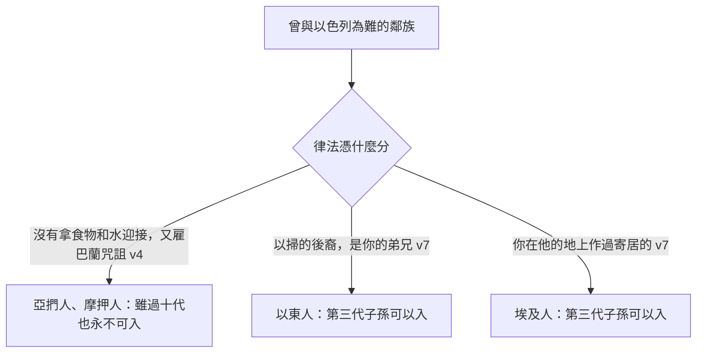

# 申命記 第23章

<!-- chapter-navigation:start -->
| [前一章](../05%20申命記/第22章.md) | [回目錄](../05%20申命記/全書目錄及綱要.md) | [下一章](../05%20申命記/第24章.md) |
| :--- | :---: | ---: |
<!-- chapter-navigation:end -->

1. 凡外腎受傷的，或被閹割的，不可[[耶和華的會（qa.hal）|入耶和華的會]]。
2. [[私生子（mam.zer）|私生子]]不可[[耶和華的會（qa.hal）|入耶和華的會]]；他的子孫，直到十代，也不可入耶和華的會。
3. [[亞捫人]]或是[[摩押人]]不可[[耶和華的會（qa.hal）|入耶和華的會]]；他們的子孫，雖過十代，也永不可入耶和華的會。
4. 因為你們出埃及的時候，他們沒有拿食物和水在路上迎接你們，又因他們雇了米所波大米的毘奪人比珥的兒子[[巴蘭（比珥的兒子）|巴蘭]]來咒詛你們。
5. 然而耶和華─你的神不肯聽從[[巴蘭（比珥的兒子）|巴蘭]]，卻使那咒詛的言語變為祝福的話，因為耶和華─你的神愛你。
6. 你一生一世永不可求他們的平安和他們的利益。
7. 不可憎惡[[以東|以東人]]，因為他是你的弟兄。[[以東人與埃及人可入會的條例|不可憎惡埃及人]]，因為你在他的地上作過[[寄居的]]。
8. 他們[[以東人與埃及人可入會的條例|第三代子孫]]可以[[耶和華的會（qa.hal）|入耶和華的會]]。
9. 你出兵攻打仇敵，就要[[軍營潔淨的條例|遠避諸惡]]。
10. 你們中間，若有人夜間偶然夢遺，不潔淨，就要[[不潔之人出到營外|出到營外]]，不可入營；
11. 到傍晚的時候，他要用水洗澡，及至日落了才可以入營。
12. 你在營外也該定出一個地方[[軍營潔淨的條例|作為便所]]。
13. 在你器械之中[[軍營潔淨的條例|當預備一把鍬]]，你[[不潔之人出到營外|出營外]]便溺以後，用以鏟土，轉身掩蓋。
14. 因為耶和華─你的神[[神的同在|常在你營中行走]]，要救護你，將仇敵交給你，所以你的[[聖潔|營理當聖潔]]，免得他見你那裡有污穢，就離開你。
15. 若有[[奴僕]][[逃奴不可交還主人的條例|脫了主人的手]]，逃到你那裡，你不可將他交付他的主人。
16. 他必在你那裡與你同住，在你的城邑中，要由他選擇一個所喜悅的地方居住；你[[逃奴不可交還主人的條例|不可欺負他]]。
17. 以色列的女子中不可有[[迦南廟妓風俗|妓女]]；以色列的男子中不可有[[迦南廟妓風俗|孌童]]。
18. [[娼妓與孌童所得不可帶入神殿|娼妓所得的錢]]，或[[迦南廟妓風俗|孌童]]（原文作狗）[[娼妓與孌童所得不可帶入神殿|所得的價]]，你不可帶入耶和華─你神的殿還願，因為這兩樣都是耶和華─你神[[可憎的物（to.e.vah）|所憎惡的]]。
19. 你借給你弟兄的，或是錢財或是糧食，無論什麼[[古代近東放債取利|可生利的物]]，都不可[[取利]]。
20. 借給外邦人可以[[取利]]，只是借給你弟兄不可取利。這樣，耶和華─你神必在你所去得為業的地上和你手裡所辦的一切事上賜福與你。
21. 你向耶和華─你的神[[許願]]，償還不可遲延；因為耶和華─你的神必定向你追討，你不償還就有罪。
22. 你若不[[許願]]，倒無罪。
23. 你嘴裡所出的，就是你口中應許甘心所獻的，要照你向耶和華─你神所許的願謹守遵行。
24. 你進了鄰舍的葡萄園，可以[[過路取食的條例|隨意吃飽了葡萄]]，只是不可裝在器皿中。
25. 你進了鄰舍站著的禾稼，可以用手[[田角拾穗顧念窮人的條例|摘穗子]]，只是[[過路取食的條例|不可用鐮刀割取禾稼]]。

---

## 本章知識節點

### 主題
- [[不潔之人出到營外]]
- [[田角拾穗顧念窮人的條例]]
- [[以東人與埃及人可入會的條例]]
- [[軍營潔淨的條例]]
- [[逃奴不可交還主人的條例]]
- [[娼妓與孌童所得不可帶入神殿]]
- [[過路取食的條例]]

### 原文
- [[耶和華的會（qa.hal）]]
- [[私生子（mam.zer）]]
- [[寄居的]]
- [[可憎的物（to.e.vah）]]
- [[取利]]
- [[奴僕]]

### 人物
- [[亞捫人]]
- [[摩押人]]
- [[巴蘭（比珥的兒子）]]

### 地點
- [[以東]]

### 神學
- [[神的同在]]
- [[聖潔]]

### 文化
- [[迦南廟妓風俗]]
- [[許願]]

### 背景
- [[古代近東放債取利]]

---

## 本章整理

本章表面上是一串互不相干的規定：誰不可以參加聚會、軍營裡怎麼上廁所、逃奴要不要送回去、借錢能不能收利息、路過別人的田可以吃多少。GT《申命記串珠聖經註釋》給的標題只有三個字——「其他條例」。

但兩個字把它們串在一起。GT《啟導本聖經申命記註釋》為全段定出兩條主線：「本節至二十五19主要講兩件事：1，屬耶和華神的人應如何保持聖潔（1～14節；二十五13～16）；2，屬神的子民應有的人道行為（15～二十五12）。」前半管的是站在神面前的資格，後半管的是對人的態度。

### 誰可以站在神面前（v1-8）

前八節六次提到 [[耶和華的會（qa.hal）|耶和華的會]]——前五次都是「不可入」（第1、2、3節），第六次卻翻了過來：第8節說以東人與埃及人的第三代子孫「可以入耶和華的會」。STEP語言資料顯示這個詞是 qa.hal（H6951，簡要詞典義 assembly）。CT 說這指的是「具有公開參與敬拜神儀式的權利，包括進入聖所、獻祭、節日聖會等」；GT《聖經精讀本──申命記註解》把學者的五種理解整份列出後，選定第五種——「指不能參與以色列公開敬拜神的儀式」。GT《啟導本》另補一句限定：這些限制「但不禁止不得與會的人住在以色列人中」。

被擋在外面的有四類：身體被人為毀傷的、[[私生子（mam.zer）]]、[[亞捫人]]與[[摩押人]]。前兩類的理由都落在來源而不是行為上；後兩類則是有具體帳目的。

第4至5節的帳目分兩筆：不接待，以及雇 [[巴蘭（比珥的兒子）|巴蘭]] 來咒詛。CT 註「此事記載於民數記第二十二至二十四章」；GT《申命記串珠聖經註釋》說「這裡提及巴蘭，藉此強調摩押人的罪行」。但律法沒有停在控訴上，第5節立刻轉向：耶和華不肯聽從巴蘭，卻使那咒詛的言語變為祝福的話，因為耶和華愛你。KC 讀出的正是這一層——神提醒百姓的不只是這些國家所行的惡，還有祂把咒詛翻轉成祝福；他們並沒有因為被拒絕和被恨惡而少得什麼，反倒讓神有機會向他們保證祂的愛。

這道禁令有一個界線，而它決定了整本聖經後面的一段故事。CT 在第3節底下註明：「此處亞捫人和摩押人是用陽性名詞，指男人，故女子若嫁給以色列人不在此限，例如摩押女子路得嫁給波阿斯，大衛王便是他們的第三代子孫(參得四13，17)。」GT《啟導本聖經申命記註釋》說法一致：「關於摩押人及亞捫人的禁例，也只對男子而言。摩押人女子路得嫁夫後成為以色列人一分子，並未違反此例。」GT《申命記雷氏研讀本》從文法上給同一個結論：「這裏的陽性動詞顯示所指的是“亞捫”或“摩押”的男子。進猶太教的女子，如摩押人路得，可以嫁給以色列的男人。」KC 讀出的是恩典的角度——摩押女子路得正是一個好例子，她是蒙恩的對象，她的身分被改變了，而聖潔並沒有因此打折。==「永不可入」擋住的是一個民族的男子，不是一個歸向耶和華的女子。==

第6節還有一句容易被讀成情緒的話：你一生一世永不可求他們的平安和他們的利益。GT《啟導本聖經申命記註釋》指出這其實是專門術語：「“他們的平安和他們的利益”乃條約用語。有人認為本節應譯為“不可與他們締結友好和平條約”。」GT《申命記串珠聖經註釋》註得更短：「「平安」、「利益」：為近東國家訂立條約的用詞。」照這個讀法，這一節管的不是私人恩怨，是國與國之間不可締約。

[[以東人與埃及人可入會的條例|第7至8節的轉折]] 是全章最值得停下來看的地方。同樣曾與以色列為敵，[[以東]]人與埃及人卻可以入會。理由不在敵意的多寡，而在兩件已經發生過的事實：以東人是以掃的後裔，是弟兄；至於埃及，經文只說你在他的地上作過 [[寄居的]]，沒有提後來的奴役。GT《啟導本》甚至指出以東人曾在曠野中和以色列人作對（民二十10～21），神仍要以色列人以德報怨。

「第三代」也不是從頒佈律法那天算起。CT 說得很清楚：「不是指從設立本條例開始的第三代，而是指從個人宣告改信猶太教開始的第三代。」GT《聖經精讀本》補上前提：他們必行割禮，改信耶和華信仰。

### 神在營中行走（v9-14）

第9節換了場景，從聚會換到戰場，[[軍營潔淨的條例|規矩卻更細]]。夢遺的人要 [[不潔之人出到營外|出到營外]]，傍晚洗澡，日落才可入營；營外要有固定的地方作便所；器械之中要帶一把鍬，便溺之後鏟土掩蓋。

這些看起來像衛生規定，各家卻都說主因不在衛生。GT《聖經精讀本──申命記註解》把這一段和平時的潔淨條例分開，說利未記與民數記那些是家庭與日常生活所守的，「此處所論及的潔淨條例則是爭戰時身處疆場的以色列軍隊為了成為聖潔耶和華的軍隊而所當守的聖潔條例」。KC 說得更貼近戰場：這一段講的不是打仗本身，而是預備與裝備；任何一點對惡的容讓都會削減爭戰的力量，而力量的來源是耶和華在他們中間。他也指出摩西提到的兩種不潔——夢遺與排泄——都不是出於人的意志，人不必為它們受責備。

理由寫在第14節：耶和華你的神 [[神的同在|常在你營中行走]]，所以你的營 [[聖潔|理當聖潔]]。STEP語言資料顯示「行走」是 mit.ha.Lekh（H1980I，本節譯義 [is] walking back and forth），而第14節的「污穢」是 'er.Vat da.Var（H6172 er.vah: nakedness 加 H1697M da.var），字面是一件事的赤露。第12節的「便所」在原文則沒有對應的名詞——CT 的原文字義直接標「便所」(原文無此字)，STEP 顯示那裡是 ve.Yad，本節譯義 a hand。

### 逃到這裡的人不必回去（v15-16）

[[逃奴不可交還主人的條例|第15至16節]] 是本章最反常識的一條。GT《啟導本聖經申命記註釋》把對照擺了出來：「巴比倫的《漢慕拉比法典》規定匿藏逃奴者死，與神賜以色列人的律法不同很大。」在整個古代近東，收容逃奴是重罪；這裡卻要以色列人收留他、讓他自己選城邑住下、不可欺負他。

適用的是外地來的 [[奴僕]]，不是本國的。GT《申命記雷氏研讀本》說得最具體：「這條例所指的是一個非以色列人的奴僕從殘酷的迦南人主人那裏逃走出來。」CT 也限定了情形：『脫了主人的手』不是一般的逃走，而是因受到主人的殘酷虐待、為保性命而冒險逃脫。

值得注意的是原文的接續。STEP語言資料顯示第14節神「救護你」與第15節奴僕「脫了主人的手」用的是同一個字根 na.tsal（H5337）：一個是神把以色列從仇敵手中救出來，一個是奴僕把自己從主人手中救出來，逃到以色列這裡。==上一段剛講完神怎樣救護你，下一段就問你怎樣對待逃到你這裡求救的人。==

### 錢從哪裡來也算數（v17-23）

接下來三條都跟錢有關，而且都指向同一個問題：帶到神面前的東西，來源乾不乾淨。

第17至18節先禁止 [[迦南廟妓風俗|廟妓與孌童]]，再禁止把這一行賺的錢帶進殿裡 [[許願|還願]]。CT 註『孌童』原文用「狗」字，含有輕蔑的意思；GT《申命記雷氏研讀本》說「“狗”。希伯來人對男妓或雞姦者的謔稱」。[[娼妓與孌童所得不可帶入神殿|這兩樣都是]] [[可憎的物（to.e.vah）|耶和華所憎惡的]]。CT 在話中之光給了判語：「錯誤的手段並不能成就良善的目的，用行惡、行淫或詭詐而得的錢財奉獻，神絕不悅納。」KC 也說我們獻給神的，不只是獻什麼重要，怎麼取得的同樣重要。

第19至20節管借貸。STEP語言資料顯示「利」是 Ne.shekh（H5392）在一節之內出現三次。

| 對象 | 可否 [[取利]] | 來源說法 |
| --- | --- | --- |
| 弟兄 | 不可 | GT《聖經精讀本》：同族窮人為維持生計而借用時不可取利，「因為取利會導致使窮人愈加貧困的結果」 |
| 外邦人 | 可以 | GT《聖經精讀本》：他們身在律法之外，「並且他們是為了獲取更大的利潤而借用了金錢」（見 [[古代近東放債取利]]） |

BH 也把兩者的差別放在借款目的上：向弟兄借是為了活下去，向外人放款則多半涉及商業。

第21至23節則管許願。許願本身是甘心的，不許願倒無罪；但一旦出口就要償還，而且不可遲延。GT《申命記串珠聖經註釋》提醒：「許願時必須要謹慎，因為必要向神還願（參箴20:25; 傳5:4-5）。」CT 說得更重：向神許了願卻不謹守遵行，不只是信用的問題，而是藐視神、不以神為神。

### 可以吃飽，不可以帶走（v24-25）

[[過路取食的條例|全章最後兩節]] 是唯一寫明可以做什麼的條例：進了鄰舍的葡萄園可以隨意吃飽，進了鄰舍的禾稼可以用手摘穗子。界線落在工具上——不可裝在器皿中，不可用鐮刀割取。

這一條和利未記十九章的 [[田角拾穗顧念窮人的條例|田角拾穗]] 常被放在一起讀，BH 也把本節接到利19:9-10 與路得記第二章。但兩者的機制其實相反：那一條靠收割的人先留下、等窮人自己來拾，顧的是住在當地的窮人與寄居的；這一條靠園主放行、路過的人當場吃飽，顧的是行路的人。

CT 把兩節的分寸講得最清楚：當場隨意吃飽是體恤，裝在器皿中拿走就成了搶奪；用手摘穗子是體恤，用鐮刀割取就成了偷竊。GT《啟導本聖經申命記註釋》另記下這條規矩的餘韻：「在中東地區，今天仍保有這種款接過路旅客的古風。」

KC 指出主的門徒正是憑這條例掐麥穗（太12:1），法利賽人責備他們不是因為做了這件事，而是因為在安息日做——照他們自製的解釋這是禁止的，神的律法卻不禁止。

==從第1節到第25節，這一章走完了一條線：先問誰能進到神面前，再問神能不能留在你中間，最後問你手裡的東西是怎麼來的。==三個問題的答案都不在儀式上，而在日常的細節裡。

**參考資料**
https://www.ccbiblestudy.org/Old%20Testament/05Deut/05CT23.htm
https://www.ccbiblestudy.org/Old%20Testament/05Deut/05GT23.htm
https://www.kingcomments.com/en/bible-studies/Deu/23
https://biblehub.com/study/deuteronomy/23.htm
https://github.com/STEPBible/STEPBible-Data

<!-- appendix-links:start -->
## 附錄

### 相關地圖
- [[appendix/fhl_maps/maps/025|〈申圖一〉應許之地全圖]]
<!-- appendix-links:end -->

<!-- chapter-navigation:start -->
| [前一章](../05%20申命記/第22章.md) | [回目錄](../05%20申命記/全書目錄及綱要.md) | [下一章](../05%20申命記/第24章.md) |
| :--- | :---: | ---: |
<!-- chapter-navigation:end -->
