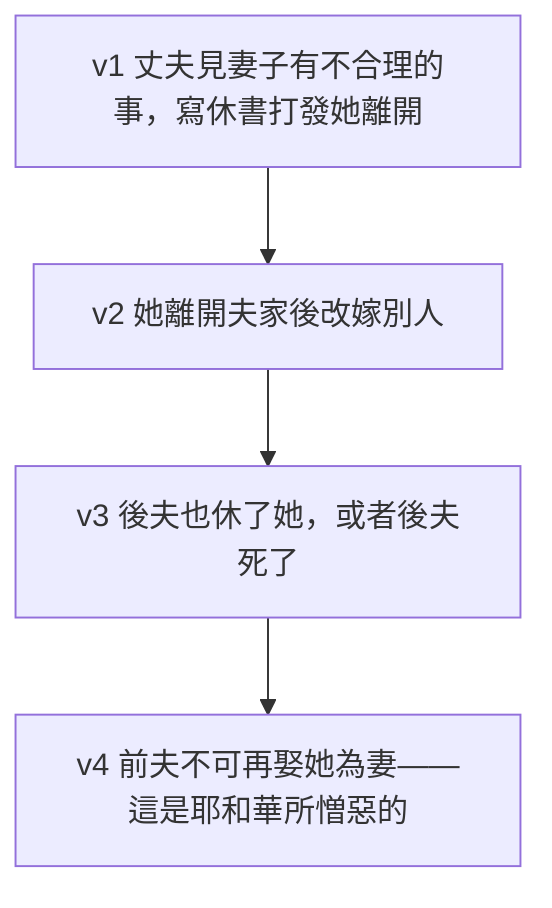

# 申命記 第24章

<!-- chapter-navigation:start -->
| [前一章](../05%20申命記/第23章.md) | [回目錄](../05%20申命記/全書目錄及綱要.md) | [下一章](../05%20申命記/第25章.md) |
| :--- | :---: | ---: |
<!-- chapter-navigation:end -->

1. 人若娶妻以後，見他有什麼[[不合理的事（er.vat da.var）|不合理的事]]，不喜悅他，就可以寫[[休書（se.fer ke.ri.tut）|休書]]交在他手中，打發他離開夫家。
2. 婦人離開夫家以後，可以去嫁別人。
3. 後夫若恨惡他，寫[[休書（se.fer ke.ri.tut）|休書]]交在他手中，打發他離開夫家，或是娶他為妻的後夫死了，
4. 打發他去的前夫不可在婦人玷污之後[[不可再娶被休的前妻|再娶他為妻]]，因為這是耶和華所憎惡的；不可使耶和華─你神所賜為業之地被玷污了。
5. 新娶妻之人[[免服兵役的四種人|不可從軍出征]]，也不可託他辦理什麼公事，可以在家清閒一年，使他所娶的妻快活。
6. 不可拿人的[[磨石不可作當頭|全盤磨石]]或是[[磨石不可作當頭|上磨石]]作[[當頭]]，因為這是拿人的命作當頭。
7. 若遇見人[[拐帶人口|拐帶]]以色列中的一個弟兄，當奴才待他，或是賣了他，那拐帶人的就必治死。這樣，便將那惡從你們中間除掉。
8. 在[[大痲瘋（sara'at）|大痲瘋]]的災病上，你們要謹慎，照祭司利未人一切所指教你們的留意遵行。我怎樣吩咐他們，你們要怎樣遵行。
9. 當記念出埃及後，在路上，耶和華─你神向[[米利暗]]所行的事。
10. 你借給鄰舍，不拘是什麼，[[古代近東當頭制度|不可進他家]]拿他的[[當頭]]。
11. 要站在外面，等那向你借貸的人把[[當頭]]拿出來交給你。
12. 他若是窮人，你不可留他的[[當頭]]過夜。
13. 日落的時候，總要把[[當頭]]還他，使他用那件衣服蓋著睡覺，他就為你祝福；這在耶和華─你神面前就是你的義了。
14. [[不可欺壓鄰舍雇工工價不可過夜|困苦窮乏的雇工]]，無論是你的弟兄或是在你城裡[[寄居的]]，你不可欺負他。
15. 要當日給他[[工價與雇約|工價]]，不可等到日落─因為他窮苦，把心放在工價上─恐怕他因你求告耶和華，罪便歸你了。
16. [[個人擔罪與父罪及子的張力|不可因子殺父]]，也不可因父殺子；[[追討罪自父及子直到三四代|凡被殺的都為本身的罪]]。
17. 你不可向[[寄居的]]和孤兒屈枉正直，也不可拿[[寡婦衣裳|寡婦的衣裳]]作[[當頭]]。
18. 要記念你在埃及作過奴僕。耶和華─你的神從那裡[[救贖|將你救贖]]，所以我吩咐你這樣行。
19. 你在田間收割莊稼，[[田角拾穗顧念窮人的條例|若忘下一捆]]，不可回去再取，要留給[[寄居的]]與[[孤兒寡婦]]。這樣，耶和華─你神必在你手裡所辦的一切事上賜福與你。
20. 你打橄欖樹，[[田角拾穗顧念窮人的條例|枝上剩下的]]，不可再打；要留給[[寄居的]]與[[孤兒寡婦]]。
21. 你摘葡萄園的葡萄，[[田角拾穗顧念窮人的條例|所剩下的，不可再摘]]；要留給[[寄居的]]與[[孤兒寡婦]]。
22. 你也要記念你在埃及地作過奴僕，所以我吩咐你這樣行。

---

## 本章知識節點

### 主題
- [[不可再娶被休的前妻]]
- [[免服兵役的四種人]]
- [[磨石不可作當頭]]
- [[不可欺壓鄰舍雇工工價不可過夜]]
- [[孤兒寡婦]]
- [[田角拾穗顧念窮人的條例]]

### 原文
- [[休書（se.fer ke.ri.tut）]]
- [[不合理的事（er.vat da.var）]]
- [[當頭]]
- [[大痲瘋（sara'at）]]
- [[寄居的]]

### 神學
- [[拐帶人口]]
- [[救贖]]
- [[追討罪自父及子直到三四代]]

### 人物
- [[米利暗]]

### 文化
- [[工價與雇約]]
- [[寡婦衣裳]]

### 背景
- [[古代近東當頭制度]]

### 解經爭議
- [[個人擔罪與父罪及子的張力]]

---

## 本章整理

這一章的條例看起來各自獨立，卻有一條線把它們穿起來。GT《聖經精讀本──申命記註解》為全章下的標題只有五個字：「保護弱者的條例」，並說這些都是對弱者與貧者的保護條例。而全章兩次以同一句話收尾——要記念你在埃及作過奴僕。

### 一句長句管住的離婚（v1-4）

中文讀起來像四條規定，原文卻是一句話。CT 在話中之光把結構點了出來：「1~4節原文是同一個長句，1~3節是假設前提，4節是得出結論。因此，1~4節並不是允許離婚，而是禁止人在以「玷污」(4節)為名離婚後，再以任何藉口重婚。」

三個前提之後才是命令。GT《申命記雷氏研讀本》說得一樣：「這段經文不能解釋為命令式的離婚，只是把現存的做法納入規則裏而已。」[[不可再娶被休的前妻|禁令真正的功能是往回煞車]]——GT《申命記串珠聖經註釋》說這「間接防止當時的人隨意離婚」，CT 也說它防止為微不足道的事而拆散婚姻、以後又隨隨便便地復合。

兩個關鍵詞值得單獨看。第一個是丈夫要開出的理由：[[不合理的事（er.vat da.var）]]。STEP語言資料顯示原文是 'er.Vat da.Var（H6172 er.vah: nakedness 加 H1697L da.var: word: case），而 GT《串珠》直接把它接回上一章：「「不合理的事」：23:14譯作「污穢」，指不潔淨的事（但不會是姦淫，因淫婦必須接受死刑）」。四家一致排除姦淫這個選項，因為那是死罪。GT《聖經精讀本》另記下猶太拉比 Hillel 與 Shammai 兩學派的極端解釋，並判定兩者都有走極端之嫌。

第二個是他必須留下的東西：[[休書（se.fer ke.ri.tut）|休書]]。STEP語言資料顯示是 Se.fer ke.ri.Tut（H5612A se.pher: scroll: document 加 H3748 ke.ri.tut: divorce）。GT 艾基斯《舊約聖經難題彙編》說明這份文件的實際作用：「這張休書可保證婦人的權利，可以帶走她的嫁妝；否則丈夫可以強行將婦人的財物據為已有，而堅持說婦人只是自顧地返回娘家長期居住，他們並未離婚。」==要寫、要交、要走完手續——這道程序本身就是煞車。==

### 新婚的一年（v5）

第5節緊接著給了相反方向的一條：[[免服兵役的四種人|新娶妻之人不可從軍出征]]，也不可託他辦理什麼公事，可以在家清閒一年。GT《啟導本聖經申命記註釋》說這是「准許新婚男子免役一年，得享室家之樂，也可以有子嗣承繼家門」。KC 注意到這一節與前四節的強烈對比：前面講的是被打發走的妻子，這裡講的是新娶的妻子，而丈夫整整一年的任務就是使她快活。

### 抵押品不能拿走人的活路（v6、10-13、17）

本章關於 [[當頭]] 的規定散在三處，判準卻只有一個：抵押品不能是人活下去所必需的。

| 節 | 規定 | 理由 |
| --- | --- | --- |
| 6 | 不可拿全盤磨石或上磨石作當頭（見 [[磨石不可作當頭]]） | 這是拿人的命作當頭 |
| 10-11 | 不可進他家拿當頭，要站在外面等他拿出來（見 [[古代近東當頭制度]]） | CT：「應當尊重債戶的主權，並且也是在防止債主任意選擇高價抵押品以牟暴利」 |
| 12-13 | 窮人的當頭不可留過夜，日落要還他 | 使他用那件衣服蓋著睡覺，他就為你祝福 |
| 17 | 不可拿寡婦的衣裳作當頭（見 [[寡婦衣裳]]） | 寡婦屬弱勢族群 |

GT《啟導本聖經申命記註釋》把磨石那一條的道理說得最清楚：「取磨石作抵押，並非磨石本身有何金錢價值，而是作為一種生產工具，取去之後令人生活無著，以迫他還債。」KC 的說法更重：這件器具就是他的性命，凡拿這件器具作當頭的，就是拿他弟兄的性命作當頭。

第13節還給了一個少見的結語：這在耶和華─你神面前就是你的義了。CT 註『那件衣服』指較為值錢的外衣，窮人可能沒有被單，而以外衣做代替遮暖之用。

### 拐帶與大痲瘋（v7-9）

中間三節換了題材。第7節處理 [[拐帶人口]]：拐帶以色列中的一個弟兄、當奴才待他或賣了他的，必治死。GT《啟導本》指出「此法例也見《出埃及記》二十一16」，CT 則在背景註解說明古代中東雖然到處都有奴隸買賣，但法律都禁止誘拐、綁架自由的公民成為奴隸。

第8節處理 [[大痲瘋（sara'at）|大痲瘋的災病]]，而它真正吩咐的只有一件事：照祭司利未人一切所指教你們的留意遵行。CT 說明這句話指向哪裡：「『照祭司利未人一切所指教』意指有關大痲瘋的診斷、對待和潔淨的事宜，都要遵照祭司的指示而行」，而「『我怎樣吩咐』即指一切有關痲瘋病的條例(參閱利十三章)」。GT《聖經精讀本──申命記註解》說得一樣：這裡是命令百姓謹慎、如實地遵行摩西曾在利13章與14章詳細教導利未人的條例。KC 注意到這一節在申命記裡是個例外——這卷書難得再提到祭司一次，而重點在祭司所教導的，不在祭司對病灶的檢查。==利未記寫的是怎麼判、怎麼潔淨；這一節寫的是百姓該不該聽。==

GT《啟導本》另外提醒讀者這個字的範圍：「今天所知的痲瘋病不見於舊約時代的近東，原文saraat應作“皮膚惡疾”解。」第9節接著舉了一個名字作為例證：[[米利暗]]。GT 馬唐納《申命記》解釋為什麼特意舉米利暗：其用意可能是提醒在社會中地位最高者也不能倖免這種疾病。KC 讀出的重點不同——他說米利暗的事不是道德上的惡，而是結黨：她出於嫉妒挑戰摩西的領導，結果是全會眾七天不能起行。

### 各人為本身的罪（v16）

第16節只有一句：不可因子殺父，也不可因父殺子；凡被殺的都為本身的罪。GT《啟導本聖經申命記註釋》給了一個對照：「這是摩西律法與當時米所波大米的律法一大不同處。」GT《聖經精讀本》說立法動機是不使以色列隨從外邦人滅絕罪犯子女甚至親族的連帶處刑法。

但這一節與十誡裡 [[追討罪自父及子直到三四代|神追討罪自父及子直到三四代]]（出20:5）擺在一起，就成了一個 [[個人擔罪與父罪及子的張力|需要處理的問題]]。KC 的辦法是分層：始終要把罪的刑罰與罪的後果分開——大衛得了赦免，卻躲不開罪的後果。GT 艾基斯《舊約聖經難題彙編》的辦法是逐案處理例外：他分別解釋大衛喪子與掃羅七個孫兒被殺兩件事，並指出那兩件都是神親自施行的審判，而人若沒有事先得到神允准就施行預防性的懲罰，「就是不公義及放肆的表現」。

### 記念你在埃及作過奴僕（v14-15、17-22）

最後一組條例全部指向同一群人：[[寄居的]]、[[孤兒寡婦]]、[[不可欺壓鄰舍雇工工價不可過夜|困苦窮乏的雇工]]。

第14至15節管的是 [[工價與雇約|工價]]。CT 說明了為什麼一天都不能拖：「古時雇用臨時工，泰半按日發放工錢(參太二十8)，特別是窮人，沒有積蓄，只能指望拿到當日的工錢，好買食物養活家人。」GT《聖經精讀本──申命記註解》把這條的兩層要求列出來：第一要尊重其人格，第二不可遲發工價（利19:13）。第13節說還當頭的人會得著祝福，第15節則說扣工價的人會被求告——==同一件事的兩面，都是由窮人在神面前開口決定的。==

第19至21節是 [[田角拾穗顧念窮人的條例|收割時要留下的部分]]：忘下的一捆不可回去再取，橄欖樹枝上剩下的不可再打，葡萄園所剩下的不可再摘。GT《申命記雷氏研讀本》註了一句：「路得從這律法中得益（比較得二3）。」KC 注意到這幾節用的是「忘記」這個角度——被留下的東西是收割的人漏掉的，它不會自己送到窮人家門口，路得仍得動身去撿。

這一組條例兩次以同一句話收尾：要記念你在埃及作過奴僕，耶和華─你的神從那裡將你 [[救贖]]。GT《聖經精讀本》把這個邏輯說完整：神根據滿有恩典與憐憫的出埃及救贖事件，命令以色列百姓當對貧窮而為社會所忽視的人施行恩典與憐憫。==這一章沒有訴諸同情心，它訴諸記憶。==

**參考資料**
https://www.ccbiblestudy.org/Old%20Testament/05Deut/05CT24.htm
https://www.ccbiblestudy.org/Old%20Testament/05Deut/05GT24.htm
https://www.kingcomments.com/en/bible-studies/Deu/24
https://biblehub.com/study/deuteronomy/24.htm
https://github.com/STEPBible/STEPBible-Data

<!-- appendix-links:start -->
## 附錄

### 相關地圖
- [[appendix/fhl_maps/maps/025|〈申圖一〉應許之地全圖]]
<!-- appendix-links:end -->

<!-- chapter-navigation:start -->
| [前一章](../05%20申命記/第23章.md) | [回目錄](../05%20申命記/全書目錄及綱要.md) | [下一章](../05%20申命記/第25章.md) |
| :--- | :---: | ---: |
<!-- chapter-navigation:end -->
