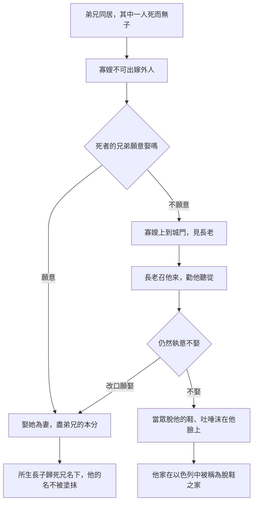

# 申命記 第25章

<!-- chapter-navigation:start -->
| [前一章](../05%20申命記/第24章.md) | [回目錄](../05%20申命記/全書目錄及綱要.md) | [下一章](../05%20申命記/第26章.md) |
| :--- | :---: | ---: |
<!-- chapter-navigation:end -->

1. 人若有爭訟，來聽審判，[[審判官]]就要[[審判不可行不義按公義審判|定義人有理，定惡人有罪]]。
2. 惡人若該受責打，[[審判官]]就要叫他當面伏在地上，[[責打不可過四十下的條例|按著他的罪照數責打]]。
3. 只可打他[[四十的屬靈意義|四十下]]，[[以色列刑罰的節制與程序保障|不可過數]]；若過數，便是[[人的尊嚴|輕賤你的弟兄]]了。
4. 牛在場上踹穀的時候，[[不可籠住踹穀之牛的嘴|不可籠住他的嘴]]。
5. 弟兄同居，若死了一個，沒有兒子，[[叔嫂婚姻|死人的妻不可出嫁外人]]，他丈夫的兄弟當[[盡弟兄的本分（ya.vam）|盡弟兄的本分]]，娶他為妻，與他同房。
6. 婦人生的長子必歸死兄的名下，免得他的名在以色列中[[塗抹（ma.chah）|塗抹]]了。
7. 那人若不願意娶他哥哥的妻，他哥哥的妻就要到[[城門口公共場合|城門]][[以色列的長老|長老]]那裡，說：我丈夫的兄弟不肯在以色列中興起他哥哥的名字，不給我[[盡弟兄的本分（ya.vam）|盡弟兄的本分]]。
8. 本城的[[以色列的長老|長老]]就要召那人來問他，他若執意說：我不願意娶他，
9. 他哥哥的妻就要當著[[以色列的長老|長老]]到那人的跟前，脫了他的鞋，吐唾沫在他臉上，說：凡不為哥哥建立家室的都要這樣待他。
10. 在以色列中，他的名必稱為[[脫鞋之家]]。
11. 若有二人爭鬥，這人的妻近前來，要救他丈夫脫離那打他丈夫之人的手，抓住那人的下體，
12. [[抓住下體要砍手的條例|就要砍斷婦人的手]]，眼不可顧惜他。
13. 你囊中不可有一大一小兩樣的[[公道天平法碼升斗|法碼]]。
14. 你家裡不可有一大一小兩樣的[[伊法|升斗]]。
15. 當用對準公平的[[公道天平法碼升斗|法碼]]，公平的[[伊法|升斗]]。這樣，在耶和華─你神所賜你的地上，你的日子就可以長久。
16. 因為行非義之事的人都是耶和華─你神[[可憎的物（to.e.vah）|所憎惡的]]。
17. 你要[[神的記念|記念]]你們出埃及的時候，[[亞瑪力人]]在路上怎樣待你。
18. 他們在路上遇見你，趁你疲乏困倦擊殺你[[儘後邊軟弱的人（za.nav）|儘後邊軟弱的人]]，並不[[敬畏神]]。
19. 所以耶和華─你神使你不被四圍一切的仇敵擾亂，在耶和華─你神賜你為業的地上得享平安。那時，你要將[[亞瑪力|亞瑪力的名號]]從天下[[塗抹（ma.chah）|塗抹]]了，不可忘記。

---

## 本章知識節點

### 主題
- [[責打不可過四十下的條例]]
- [[審判不可行不義按公義審判]]
- [[人的尊嚴]]
- [[不可籠住踹穀之牛的嘴]]
- [[抓住下體要砍手的條例]]
- [[公道天平法碼升斗]]

### 原文
- [[審判官]]
- [[四十的屬靈意義]]
- [[盡弟兄的本分（ya.vam）]]
- [[塗抹（ma.chah）]]
- [[伊法]]
- [[可憎的物（to.e.vah）]]
- [[儘後邊軟弱的人（za.nav）]]

### 文化
- [[叔嫂婚姻]]
- [[脫鞋之家]]
- [[以色列的長老]]
- [[工價與雇約]]

### 歷史
- [[古代近東婚姻習俗]]
- [[猶大與他瑪事件]]
- [[城門口公共場合]]

### 神學
- [[救贖goel]]
- [[神的記念]]
- [[敬畏神]]

### 背景
- [[以色列刑罰的節制與程序保障]]

### 人物
- [[亞瑪力人]]
- [[亞瑪力]]

### 互文
- [[猶大與他瑪事件|猶大與他瑪事件 創38:8 叔嫂婚姻的先例]]
- [[路得記4章法勒斯家譜|路得記4章法勒斯家譜 波阿斯盡本分所生的俄備得]]
- [[出埃及記17章亞瑪力攻擊以色列|出埃及記17章亞瑪力攻擊以色列 利非訂之役]]
- [[申25：17-19 記念亞瑪力|申25：17-19 記念亞瑪力 補上出17沒交代的攻擊方式]]
- [[掃羅擊殺亞甲（撒上15：8）|掃羅擊殺亞甲（撒上15：8） 命令交下去卻沒有徹底執行]]

---

## 本章整理

這一章把六件看起來毫不相干的事排在一起：法庭上的鞭刑、打穀場上的牛、寡婦的再嫁、打架時的越界、口袋裡的法碼，還有一個要被抹掉的民族。CT 在靈訓要義裡替全章下的標題只有四個字——「公平公義」，並把六段各配一句：公平判案並責打、公平對待踹榖之牛、公平保全家族、公平爭鬥、公平買賣交易、除惡務盡以維公義。

換個說法：這章關心的不是誰對誰錯，而是**對了之後可以做到什麼程度**。

### 打人也有上限（v1-3）

開頭三節是分工明確的三步。GT《啟導本聖經申命記註釋》講得最清楚：「本節規定，民間若有爭訟應交法庭處理。次節規定刑罰應在審判官前執行，以昭公允，免得刑罰過分。3節則規定笞刑最高不得逾四十下。」同一份註釋也提到，第1節的「義人」可譯為「無辜的」。

第1節用的是一整組法庭語言。STEP語言資料顯示「爭訟」是 riv（H7379），「來聽審判」是走近 ha./mish.Pat（H4941G，審判之處），[[審判不可行不義按公義審判|審判官定義人有理]] 的動詞是 hitz.Di.ku（H6663，使役語態的宣告為義），「定惡人有罪」是 hir.Shi.'u（H7561）。順帶一提，本章的 [[審判官]] 原文是 ha./sho.Fet（H8199），和出埃及記21:6 同樣譯作「審判官」、和合本卻在小字註明「審判官或作：神」的那個字並不相同。

第2節的每個細節都在收緊執行的空間。STEP語言資料顯示，「叫他當面伏在地上」的動詞 hi.pi.L/o（H5307G）主詞就是審判官本人，接著責打的動詞 hi.Ka.h/u（H5221）沒有指名是誰，並且要在他面前（le./fa.Na/v）進行——審判官負責的是命他伏下與全程在場。「按著他的罪」原文是照他罪惡的分量；「照數」是按數目。KC 指出鞭打必須在審判官面前進行，這強調判決要照著宣告的內容執行，而且要立刻執行。BH 補上同一件事的另一面——叫受刑者伏下是個受控制的正式場合，避免流於殘暴。

然後是第3節那道上限，以及律法自己給的理由：「只可打他四十下，不可過數；若過數，便是輕賤你的弟兄了。」STEP語言資料顯示「輕賤」是 nik.Lah（H7034，被輕看蒙羞），後面接的是「在你眼前」；而被打的那個人，原文稱他為「你的弟兄」。GT《申命記串珠聖經註釋》一句話收攏這道上限的用意：「為了維護人的尊嚴，體罰必須定下準則，不可隨意鞭打被告」。==罰他，是因為他有罪；停手，是因為他還是你的弟兄。==這正是 [[以色列刑罰的節制與程序保障|律法自己加給刑罰的一連串限制]] 之一，也是 [[人的尊嚴]] 在法庭裡的具體樣子。

> [!note] 四十為什麼變成三十九
> CT 的背景註解說，後來猶太人擔心責打超過四十下、輕賤了弟兄，所以寧可少打一下。GT《聖經精讀本──申命記註解》講的是同一回事：後來的猶太人為了預先防止在計數過程中有可能發生的錯誤，杖打時打到三十九下。保羅受過的正是這種刑罰（林後11:24）。KC 讀出的重點不同——保羅五次受這個上限，表示他在猶太人眼中被當成重犯。至於 [[四十的屬靈意義|「四十」這個數目]]，KC 說它在這裡代表一次完整的刑罰。

### 牛也要吃得到（v4）

「牛在場上踹穀的時候，不可籠住他的嘴。」全章最短的一條，卻是新約引用最多的一條。

要懂它得先看見場面。CT 的背景註解描述得最完整：農夫把收割下來的麥穗排列在禾場上，讓牛拖著沉重的打穀橇碾過麥穗，「牛通常會一邊走，一邊低頭吃麥穗。」GT《聖經精讀本──申命記註解》補上器具的樣子：在平木板上穿很多孔，把要打的穀放在其上，再讓驢或牛拉著一種附有堅硬石頭的打穀機走過去。

四套來源在這一節上說法一致，而且都同時保留兩層意思。CT 說籠住牠的嘴是一種不人道的行為，也記下本節後來被轉用來說明工人得工價是應當的（提前5:18）。GT《啟導本聖經申命記註釋》把推論的方向講出來：連牛在踹谷都許它吃場上的穀粒，為神工作的人豈不可以指望取得養身所需。KC 的一句話把它和上一段接了起來：「Just as a criminal is deserving of punishment, so the laborer is worthy of his wages.」（罪人該受刑罰，同樣，作工的人配得工價。）他並指出，哥林多前書9:9-10 的引用顯示這條吩咐主要不是為牛說的，而是指向神國度裡的工人。BH 則守住字面那一層：牛是農業社會的貴重資產，籠住牠的嘴使牠工作時吃不到東西，這被視為不公。這條也因此接上了 [[工價與雇約|作工者當得供養]] 這條線。

### 為死人留一個名（v5-10）

全章篇幅最長的一段，處理的是一個沒有兒子就死去的人。

這不是摩西發明的制度。CT 的背景註解說，[[叔嫂婚姻]] 是古代中東和中亞許多民族的習俗，「古代赫人和亞述人都有相似的習俗」，並指創世記38:8 的 [[猶大與他瑪事件]] 就是先例。GT《聖經精讀本──申命記註解》說得更明白：這風俗早在摩西時代的很久以前就遠傳於以色列社會與 [[古代近東婚姻習俗|古代近東社會]]，只是到了摩西時代才成為明文的律法。

立法的理由各家補得很齊。GT《啟導本聖經申命記註釋》給兩個：「一是使宗嗣可以延續，因所生長子，仍歸死者名下；一是為了不讓各族的產業流歸別的支派，把祖產分薄了。」GT《聖經精讀本──申命記註解》列三個：保存兄弟的名字與產業、防止以色列女子與外邦人結婚、從制度上看顧無依無靠的寡婦。KC 的重點在產業——這是為了不讓產業落到別人手裡。

它也有明確的邊界。GT《聖經精讀本──申命記註解》指出：「若沒有兒子只有女兒,因女兒可以繼承父親的產業(民27:4-7),故不能適用繼代結婚法。」而 GT《啟導本聖經申命記註釋》記下後來的擴大：死者若無兄弟，最近的親屬也須負此義務——那正是 [[路得記4章法勒斯家譜|路得記]] 裡波阿斯的處境，KC 說他必須同時作 [[救贖goel|贖回的人]] 和盡弟兄本分的人。

這條例後來還被搬到一場完全不同的辯論裡。GT《申命記雷氏研讀本》在第5至10節下註明要參看馬太福音二十二章24節的腳註；KC 說得更完整：撒都該人是當時的自由派，只相信自己推理得出來的東西，所以不信復活，也不信天使和靈（徒23:8），他們編出七個兄弟先後娶同一個女子的例子來「證明」復活說不通。主耶穌的回答沒有碰那個例子，卻引神是亞伯拉罕的神、以撒的神、雅各的神（出3:6,15-16）——KC 讀出的重點是：神對摩西這樣說的時候，列祖早已過世多年，但神既然把應許給了他們，就必要使那些應許成真。

值得注意的是，整條路走到底都沒有罰款、沒有鞭刑、沒有監禁。神容許人拒絕，只是把拒絕的結果公開掛在他家門口。而 [[以色列的長老|長老]] 在 [[城門口公共場合|城門]] 主持的這場程序，GT《聖經精讀本──申命記註解》拆成四步：寡嫂告知長老、長老開庭傳喚、充分說明並勸其聽從、他若終不肯轉意才進行脫鞋與吐唾沫。

[[脫鞋之家]] 這個名字不是隨口取的。鞋在古代以色列是產權的憑證——路得記4:7 記著要定奪什麼事或贖回交易，這人就脫鞋給那人，以色列人都以此為證據。CT 因此說「脫了他的鞋」表示取消了他獲得產業的權力。KC 把象徵的兩面都寫出來：把鞋踏在一件東西上是取得它、據為己有，脫下鞋則是相反，意思是放棄。更精巧的是原文的呼應：STEP語言資料顯示第9節寡嫂宣告他不肯為哥哥「建立」的是 beit（H1004M，家），第10節他自己的 beit 就被冠上「脫鞋」的名。他不建的是家，他背的名也是家。

### 護夫，卻越了界（v11-12）

第11至12節是全章最難讀的兩節，也是整部律法裡唯一一條斷肢的刑罰。GT《啟導本聖經申命記註釋》寫得很直接：「這是聖經中"以命償命"之外（十九21），唯一斫斷肢體的刑罰。何以婦人協助丈夫打鬥抓對方會陰，須受如此嚴刑，聖經未加解釋」，它自己給的推測是也許在防止人用此手法絕人子嗣。

也就是說，來源在這裡是坦承有不確定的。在推測的範圍內，各家給的理由落在兩點上：CT 兩點並列——這是一種可羞恥的舉動，以及保護男人的生殖能力；GT《申命記串珠聖經註釋》只取第二點，說她所作的極可能導致男方不育、斷絕後嗣；GT《聖經精讀本──申命記註解》兩點都取。KC 讀出的是與上一段的對照：前面那位寡嫂當眾表達輕蔑是合法的，這裡卻說明白，那份自由不可讓她做出越界而無恥的舉動——她想救丈夫可以理解，但她下手的方式是要讓對方不能再有後代。BH 從古代近東的角度補充：這種舉動被視為對個人尊嚴的嚴重侵犯，男性的生殖器被看作力量與後代血脈的象徵。

「就要砍斷婦人的手，眼不可顧惜他。」原文有兩個容易被中文吃掉的細節。STEP語言資料顯示，第11節她伸出的是 ya.Da/h（H3027G，手），第12節要砍斷的卻是 ka.Pa/h（H3709G，簡要詞典義 kaph: palm，手掌）；而末句的主詞是「你的眼」——不可顧惜的動詞 ta.Chos（H2347）配的是 'ei.Ne./kha。KC 指出，執行判決時憐憫不可以在其中起作用，例如因為對方是女人；BH 說這句話不是要人殘忍，而是要求律法一致、不因人而異地施行。這條 [[抓住下體要砍手的條例|嚴刑]] 之所以獨一無二，正因為前一段整整六節在為死人存留後嗣，而這一節可能斷絕活人的後嗣。

### 囊中與家裡（v13-16）

第13至14節是兩句同構的話：你囊中不可有一大一小兩樣的法碼，你家裡不可有一大一小兩樣的升斗。一個管出門做生意，一個管關起門來的家。KC 注意到禁令的範圍——它禁的不只是使用，連持有都不行。

[[公道天平法碼升斗|這條規定]] 不是第一次出現，GT《啟導本聖經申命記註釋》直接指向利未記19:35 及注。STEP語言資料在這裡顯出一個對照：利未記19:36 的「公道」是 tze.deq（H6664G，公義）一節連用四次；申命記25:15「當用對準公平的法碼，公平的升斗」則是 she.le.Mah（H8003，完整）配 Tze.dek，兩樣器具各配一次。中文的「對準公平」在原文裡是完整加公義兩個字疊起來的。至於「升斗」，STEP語言資料顯示原文就是 [[伊法|'ei.Fah]]（H374），CT 的原文字義也是這樣標的。

KC 把這件事從市場搬回人心：兩樣量器的惡很容易在我們自己心裡和教會生活裡起作用——輪到自己的時候用一套標準，輪到別人的時候用另一套；我們對家人往往比對外人寬鬆得多。CT 的話中之光說的是同一件事，並用羅馬書12:3 的「中道」當作那個公平的法碼。

這一段的收尾是全章語氣最重的一句：「因為行非義之事的人都是耶和華─你神所憎惡的。」STEP語言資料顯示「所憎惡的」是 [[可憎的物（to.e.vah）|to.'a.Vat]]（H8441），「非義之事」是 'A.vel（H5766A）。同一個 to.e.vah，在申命記裡先後用在拜偶像、獻兒女經火、易服、廟妓所得之上；這裡用在一個口袋裡多放一顆石頭的人身上。

### 記念，與塗抹（v17-19）

最後三節換了體裁——不再是條例，而是一道未完成的命令。

第17節說「你要記念」，第19節說「不可忘記」，中間夾著第18節的理由。而全章最漂亮的原文結構就在這裡：STEP語言資料顯示第17節的「記念」是 za.Khor（H2142），第19節要塗抹的「名號」是 Ze.kher（H2143）——同一個字根；第19節結尾的「不可忘記」則是另一個字 tish.Kach（H7911）。==以色列要記得的，正是那個要被抹去記念的民族。==CT 的原文字義給「名號」的解釋，正是記念物。

第18節是這道命令的全部理由：「趁你疲乏困倦擊殺你儘後邊軟弱的人，並不敬畏神。」STEP語言資料顯示，[[儘後邊軟弱的人（za.nav）|「擊殺你儘後邊」在原文是一個動詞]] va/y.za.Nev（H2179，簡要詞典義 za.nav: to cut off the tail），本節的語境義是攻擊隊伍後方；被攻擊的是 ha./ne.che.sha.Lim（H2826，軟弱的人）。CT 說這反映出 [[亞瑪力人]] 欺弱怕強、懦弱殘酷的生性，並對末句下了一句判語：「敬畏神的人不會欺負弱小者。」——[[敬畏神|沒有這份敬畏]]，就是這場攻擊真正的來歷。KC 描述的是同一個畫面：他們攻擊一個剛剛脫離為奴之地、毫無戰鬥經驗、又從未招惹過他們的百姓。GT《啟導本聖經申命記註釋》甚至反過來替這道命令找理由：「如果只是因為亞瑪力人攻擊過以色列人，似不應有這滅族的命令。」——所以問題出在方法上。

「那時，你要將 [[亞瑪力|亞瑪力的名號]] 從天下塗抹了，不可忘記。」這道命令是 [[出埃及記17章亞瑪力攻擊以色列|利非訂那場戰役]] 的續集，而 [[申25：17-19 記念亞瑪力|這三節]] 補上了出埃及記17:8 沒有交代的一件事——那場攻擊是怎麼打的。

| 節次 | 誰的名 | 動詞 | 方向 |
| --- | --- | --- | --- |
| v6 | 死去的以色列人 | ma.chah（被動） | 要防止它發生 |
| v19 | 亞瑪力 | ma.chah（主動，命令以色列去做） | 要親手執行 |

STEP語言資料顯示第6節「免得他的名在以色列中塗抹了」與第19節「將亞瑪力的名號從天下塗抹了」用的是同一個動詞 [[塗抹（ma.chah）|ma.chah]]（H4229A）。整段叔嫂婚姻的制度存在，是為了不讓一個以色列人的名被抹掉；而全章的最後一句，是要以色列人親手把一個仇敵的名抹掉。CT 的靈訓正是這樣把全章收起來的——神紀念被管教的百姓、紀念牲畜、紀念沒有後代的人、紀念活出公義的人，也紀念該被追討的亞瑪力人。[[神的記念|神的記念]] 有兩個方向。

至於這道命令後來怎麼了，CT 記得很清楚：「神這個除滅亞瑪力人的命令，要等到希西家王年間(主前726~697年)，才由西緬支派的人實現(參代上四41~43)。」中間隔著 [[掃羅擊殺亞甲（撒上15：8）|掃羅那次沒有徹底執行的戰役]]。KC 也是這樣記的：掃羅受命抹除亞瑪力卻因不順從而失敗，大衛後來擊敗他們，最終的了結發生在希西家的日子。

**參考資料**
https://www.ccbiblestudy.org/Old%20Testament/05Deut/05CT25.htm
https://www.ccbiblestudy.org/Old%20Testament/05Deut/05GT25.htm
https://www.kingcomments.com/en/bible-studies/Deu/25
https://biblehub.com/study/deuteronomy/25.htm
https://github.com/STEPBible/STEPBible-Data

<!-- appendix-links:start -->
## 附錄

### 相關地圖
- [[appendix/fhl_maps/maps/025|〈申圖一〉應許之地全圖]]
<!-- appendix-links:end -->

<!-- chapter-navigation:start -->
| [前一章](../05%20申命記/第24章.md) | [回目錄](../05%20申命記/全書目錄及綱要.md) | [下一章](../05%20申命記/第26章.md) |
| :--- | :---: | ---: |
<!-- chapter-navigation:end -->
