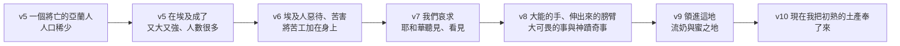

# 申命記 第26章

<!-- chapter-navigation:start -->
| [前一章](../05%20申命記/第25章.md) | [回目錄](../05%20申命記/全書目錄及綱要.md) | [下一章](../05%20申命記/第27章.md) |
| :--- | :---: | ---: |
<!-- chapter-navigation:end -->

1. 你進去得了耶和華─你神所賜你為業之地居住，
2. 就要從耶和華─你神賜你的地上將所收的各種[[初熟|初熟的土產]]取些來，盛在[[筐子（te.ne）|筐子]]裡，往耶和華─你神[[立他名的居所（中央聖所）|所選擇要立為他名的居所]]去，
3. 見當時作祭司的，對他說：[[初熟土產的信仰告白|我今日向耶和華─你神明認]]，我已來到耶和華向我們列祖起誓應許賜給我們的地。
4. 祭司就從你手裡取過[[筐子（te.ne）|筐子]]來，放在耶和華─你神的壇前。
5. 你要在耶和華─你神面前說：[[我祖原是一個將亡的亞蘭人（o.ved）|我祖原是一個將亡的亞蘭人]]，下到埃及寄居。他人口稀少，在那裡卻成了又大又強、人數很多的國民。
6. 埃及人惡待我們，苦害我們，將苦工加在我們身上。
7. 於是我們哀求耶和華─我們列祖的神，耶和華聽見我們的聲音，看見我們所受的困苦、勞碌、欺壓，
8. 他就用[[大能的手]]和伸出來的膀臂，並大可畏的事與神蹟奇事，領我們出了埃及，
9. 將我們領進這地方，把這[[流奶與蜜之地]]賜給我們。
10. 耶和華啊，現在我把你所賜給我地上[[初熟|初熟的土產]]奉了來。隨後你要把[[筐子（te.ne）|筐子]]放在耶和華─你神面前，向耶和華─你的神[[下拜]]。
11. 你和[[利未支派|利未人]]，並在你們中間[[寄居的]]，要因耶和華─你神所賜你和你家的一切福分[[在耶和華面前歡樂|歡樂]]。
12. [[三種什一奉獻的區分|每逢三年，就是十分取一之年]]，你取完了一切土產的[[十分之一]]，要分給[[利未支派|利未人]]和[[寄居的]]，與[[孤兒寡婦]]，使他們在你城中可以吃得飽足。
13. [[十一奉獻後的宣告|你又要在耶和華─你神面前說]]：我已將[[聖物]]從我家裡[[把那惡從你們中間除掉（ba.ar）|拿出來]]，給了[[利未支派|利未人]]和[[寄居的]]，與[[孤兒寡婦]]，是照你所吩咐我的一切命令。你的命令我都沒有違背，也沒有忘記。
14. 我守喪的時候，沒有吃這[[聖物]]；不潔淨的時候，也沒有[[把那惡從你們中間除掉（ba.ar）|拿出來]]，[[為死人送去的意思之爭|又沒有為死人送去]]。我聽從了耶和華─我神的話，都照你所吩咐的行了。
15. 求你從天上、你的聖所垂看，賜福給你的百姓以色列與你所賜給我們的地，就是你向我們列祖起誓賜我們[[流奶與蜜之地]]。
16. 耶和華─你的神今日吩咐你行這些[[吩咐、律例、典章、誡命四個詞|律例典章]]，所以你要盡心盡性謹守遵行。
17. 你今日[[你認我認的立約宣告|認耶和華為你的神]]，應許遵行他的道，謹守他的律例、誡命、典章，聽從他的話。
18. 耶和華今日照他所應許你的，也[[屬我的子民|認你為他的子民]]，使你謹守他的一切誡命，
19. 又使你得稱讚、美名、尊榮，超乎他所造的萬民之上，並照他所應許的使你歸耶和華─你神為[[聖潔的國民|聖潔的民]]。

---

## 本章知識節點

### 主題
- [[初熟土產的信仰告白]]
- [[十一奉獻後的宣告]]
- [[你認我認的立約宣告]]
- [[立他名的居所（中央聖所）]]
- [[在耶和華面前歡樂]]
- [[孤兒寡婦]]
- [[聖物]]
- [[三種什一奉獻的區分]]
- [[立約]]

### 原文
- [[初熟]]
- [[筐子（te.ne）]]
- [[我祖原是一個將亡的亞蘭人（o.ved）]]
- [[下拜]]
- [[寄居的]]
- [[十分之一]]
- [[吩咐、律例、典章、誡命四個詞]]

### 神學
- [[大能的手]]
- [[流奶與蜜之地]]
- [[把那惡從你們中間除掉（ba.ar）]]
- [[屬我的子民]]
- [[聖潔的國民]]

### 人物
- [[亞蘭人]]
- [[雅各]]
- [[利未支派]]

### 背景
- [[古代近東初熟果子奉獻]]
- [[古代近東立約]]
- [[巴力（迦南主神）]]

### 解經爭議
- [[為死人送去的意思之爭]]

---

## 本章整理

申命記第二十六章是摩西第二篇講章的最後一章，而它收尾的方式不是再加一條律法，是教百姓在兩個場合裡該說什麼話。

GT《聖經精讀本──申命記註解》把這個位置點出來：本章是結束摩西第二篇講章的結語，也是結束自申4:44 以後就繼續論及過來之本書律法的部分；摩西以兩種律例再次論及了律法的兩大精神之後，重新申明了所立之約。KC 說得更重——這一章是那篇長講的結論與高潮，前面所有章節都是為它作預備；他並把前面的分工整理成一句：申1-11 讓人認識這地，申12-16 讓人認識耶和華居住的地方，也就是說，耶和華先告訴我們要用什麼裝滿籃子，再告訴我們要把裝滿的籃子帶到哪裡。

### 帶一筐果子上去（v1-11）

第一段從一個很具體的動作開始：從地上收的各種 [[初熟|初熟的土產]] 取些來，盛在 [[筐子（te.ne）|筐子]] 裡，往 [[立他名的居所（中央聖所）|耶和華所選擇要立為他名的居所]] 去。

這一段獻的是什麼、多久獻一次，各家的說法並不一致。GT《啟導本聖經申命記註釋》先把它和什一奉獻分開：「本章1～11節所講和十四22～23所記的不同。這裡說的是到達迦南之後，將首次初熟的土產作感恩的奉獻，與一年一度的什一奉獻有別。」GT《申命記雷氏研讀本》講得更緊：這特別的獻祭顯然只在進入迦南的第一次收割後才進行，「目的是紀念百姓起初的貧乏」，以及慶祝他們到達迦南；他們每年也獻上初熟的土產，作為未來豐收的保證。CT 讀的則是常態：百姓每次收穫「初熟的土產」的時候，都要到神面前重新「明認」自己所領受的恩典。==兩邊都同意這段告白是為著承認恩典而設，分歧在於它是進迦南那一次的典禮，還是每次收成都要重來一遍。==

KC 讀出這個動作本身就是一種證明：Bringing the fruit is therefore proof that they have arrived in the land.（因此，把果子帶來就是他們已經到了那地的憑據。）沒有進到那地，就沒有那地的果子可帶。

STEP語言資料顯示，「筐子」原文是 te.ne（H2935），只在第2、4節出現；第10節那個「筐子」是和合本補譯的——原文是 ve./hi.nach.T/o（H5117），動詞後面只帶一個代名詞的受詞。而這個容器在三節之間換了三次手：獻的人裝滿它，祭司接過去放在壇前，獻的人再把它放下，然後 [[下拜]]。KC 注意到這裡與利未記的差別——利未記處理的是流血的祭，那些要放在壇上；申命記處理的是地上的果子，這些不上壇，而是擺在壇前。

### 我祖原是一個將亡的亞蘭人（v5-10）

[[初熟土產的信仰告白|要說的那段話]] 從一句非常不體面的自我介紹開始：我祖原是一個將亡的亞蘭人。

STEP語言資料顯示這句在原文裡是三個字並排——'a.ra.Mi（H761J，亞蘭人）、'o.Ved（H6，簡要詞典義 a.vad: to perish，本節的 context gloss 是 wandering）、'a.V/i（H1G，我的父）。這個字的兩層義域，各家譯法確實分成兩邊：GT《申命記雷氏研讀本》主張「更可作：流浪的亞蘭人」，GT《啟導本聖經申命記註釋》說「將亡」意為「飄泊」；CT 則取另一邊——『將亡的』指衰老瀕死，GT《申命記串珠聖經註釋》說雅各下到埃及的時候，已是一個老邁體弱的人。==[[我祖原是一個將亡的亞蘭人（o.ved）|兩種讀法在雅各身上都成立]]：他既長年在外飄泊，下埃及時也確實年老。==

至於這位 [[雅各|我祖]] 為什麼被稱為 [[亞蘭人]]，CT 從姻親關係說：他的母親利百加是亞蘭人（創二十五20），兩個妻子利亞和拉結是母舅拉班的女兒。KC 講的是同一件事：他在敘利亞住了二十年，母親也出自那裡；而他曾走到死亡的門口，因為拉班曾想殺他。

接下來六節走的是一條很陡的線：

CT 把 [[大能的手|第8節的四個詞]] 逐一註明：『大能的手』形容祂大有能力的作為；『伸出的膀臂』形容祂拯救的範圍；『大可畏的事』指過紅海；『神蹟奇事』指降十災。而 [[流奶與蜜之地|第9節那個地]]，CT 說「奶」代表動物的精華，「蜜」代表植物的精華。

這段話的重點在說話的人站在哪一邊。CT 的話中之光說得很清楚：在奉獻的時刻，以色列人不是給予者，而是領受者；不是因為他們有才奉獻，而是因為神的賜與使他們有。KC 數過這十一節裡「給」這個字出現的次數，說神使自己被認識為施予者，而不是索求者。

### 分完了，還要說一次（v12-15）

第二段換了場合。[[三種什一奉獻的區分|每逢三年的那一次十分之一]] 不送到聖所，而是留在本城，分給 [[利未支派|利未人]]、[[寄居的]]、和 [[孤兒寡婦]]。

| | 初熟的土產（v1-11） | 第三年的十分之一（v12-15） |
| --- | --- | --- |
| 帶去哪裡 | 神所選擇立他名的居所 | 留在你城中 |
| 交給誰 | 祭司，放在壇前 | 利未人、寄居的、孤兒寡婦 |
| 說什麼 | 我祖原是一個將亡的亞蘭人…（回顧） | 我已將聖物從我家裡拿出來…（自陳） |
| 結尾 | 下拜、與眾人一同歡樂 | 求神從天上垂看、賜福 |

兩段的結構是同一套：先照做，再把做過的事在神面前說出來。GT《聖經精讀本──申命記註解》正是這樣講的——與奉獻初熟的土產時一樣，本律例也當首先忠實地履行在神面前，之後藉著以信仰告白得到最終的聖化。

差別在於，[[十一奉獻後的宣告|這一段沒有人監督]]。CT 注意到這件事：這個十分之一不用送到神所選擇要立為他名的居所，而是留在本城說明有需要的人；雖然這是神的命令，但神並沒有安排人來監督，而是讓百姓自己宣誓。KC 說得更直接：These tithes are not given to the LORD, but directly to those for whom they are intended.（這些十分之一不是給耶和華的，而是直接給那些它們原本要給的人。）所以第13至14節那段自陳，就成了整條規定唯一的把關。

這裡有一個容易被中文吃掉的原文細節。STEP語言資料顯示，第13節「我已將 [[聖物]] 從我家裡拿出來」的動詞是 bi.'Ar.ti（H1197I，簡要詞典義 ba.ar: to burn: purge），第14節「也沒有拿出來」是同一個字的 vi.'Ar.ti。而同一個 H1197I，在申21:9、21:21、22:21、22:22、22:24、24:7 都是第二人稱命令式的 [[把那惡從你們中間除掉（ba.ar）|你要將那惡從你們中間除掉]]。==前面幾章是神命令你去清除，這裡是你自己回報已經清出來了；動詞沒變，變的是人稱與語氣。==

> [!question] 「為死人送去」是指什麼
> 第14節最後一句是本章唯一一處四家明確互相牴觸的地方。CT 取巴力說：『為死人送去』可能指敬拜巴力（參詩一百零六28）；他並補上背景——「在迦南神話中，巴力每年死而復活一次，帶來旱季和雨季的更替。」GT《申命記串珠聖經註釋》同樣說「死人」可能指 [[巴力（迦南主神）|巴力神]]。但 GT《啟導本聖經申命記註釋》先給了另一種讀法——可能是把需用的食物送往喪家（耶十六7；何九4）——再對巴力說下了否定：「此說無可靠依據。」[[為死人送去的意思之爭|分歧的來源就在原文本身]]：經文只說沒有把它給死人，沒有說是哪一種場合。

### 你認，我也認（v16-19）

最後四節換了體裁，不再是條例。第16節先總收一句：耶和華你的神今日吩咐你行這些 [[吩咐、律例、典章、誡命四個詞|律例典章]]，所以你要盡心盡性謹守遵行。接著是兩句對稱的話。

STEP語言資料顯示這兩句用的是同一個動詞：第17節的「認」是 he.'e.Mar.ta（H559，「說」的使役語態，第二人稱完成式），第18節的「認」是 he.'e.mi.re./Kha（同一個 H559 的使役語態，第三人稱加第二人稱受詞）。==同一個動詞在兩節裡調換了主詞與受詞——[[你認我認的立約宣告|你認祂，祂也認你]]。==CT 的原文字義給「認」的解釋是宣告、斷言；GT《申命記雷氏研讀本》一句話：「認」即宣佈。

CT 把兩邊的條款逐條拆開。以色列這一邊四項：認信耶和華是我個人的神、應承遵行祂的道路、承諾謹守祂的律法、答應聽從祂的話。神這一邊五項：接納你應許的話、承認你為自己的子民、使你有能力謹守律法、立你超乎萬民之上、使你分別為聖專歸屬於祂。

這是一份 [[古代近東立約|契約的形式]]。GT《啟導本聖經申命記註釋》說得很完整：本段有若向神承諾的誓詞（參出二十四7），具有契約形式，立約雙方莊嚴宣佈信守盟誓；「摩西為此約的見證人」，一方為以色列民，承諾願為耶和華神聖潔的子民，一方為神，宣佈願為以色列人的神。它並指出，神賜此約乃本乎祂的恩典。GT《申命記串珠聖經註釋》的總結是六個字的次序問題：當先順服然後才蒙福。

第18至19節神那一邊承諾的內容，STEP語言資料顯示用了四個名詞：se.gu.Lah（H5459，簡要詞典義 se.gul.lah: possession，[[屬我的子民|他的子民]]）、li/t.hi.Lah（H8416 稱讚）、u./le./Shem（H8034 美名）、u./le./tif.'A.ret（H8597 尊榮），最後是 'am- ka.Dosh（H6918G，[[聖潔的國民|聖潔的民]]）。而照他所說過的這句話（ka./'a.Sher di.Ber，H834D＋H1696I）出現兩次，兩次都在神那一邊——第18節中段與第19節結尾；以色列那一邊的第17節則以 ve./li/sh.Mo.a' be./ko.L/o（H8085H＋H6963A，聽從他的話）收尾。==可以援引先前承諾的只有神那一方。==

CT 讀出這一段的次序有一件事值得停下來看：人並不能倚靠自己的能力來遵行神的律例典章，而是因為認耶和華為你的神、應許遵行祂的道，所以神就照祂所應許你的，也認你為祂的子民，因此賜下能力，使你謹守祂的一切誡命。KC 從另一頭說同一件事：神的心意不只是把祂的百姓立在萬民之上，也是要擁有他們作一群分別出來、單單歸祂的百姓。

整章從一筐果子開始，到一份雙方各自簽下的約結束。而中間那段 [[初熟土產的信仰告白|要親口說出來的話]]，起頭是「我祖原是一個將亡的亞蘭人」——一個什麼都沒有的人，最後被立在萬民之上。

**參考資料**
https://www.ccbiblestudy.org/Old%20Testament/05Deut/05CT26.htm
https://www.ccbiblestudy.org/Old%20Testament/05Deut/05GT26.htm
https://www.kingcomments.com/en/bible-studies/Deu/26
https://biblehub.com/study/deuteronomy/26.htm
https://github.com/STEPBible/STEPBible-Data

<!-- appendix-links:start -->
## 附錄

### 相關地圖
- [[appendix/fhl_maps/maps/025|〈申圖一〉應許之地全圖]]
<!-- appendix-links:end -->

<!-- chapter-navigation:start -->
| [前一章](../05%20申命記/第25章.md) | [回目錄](../05%20申命記/全書目錄及綱要.md) | [下一章](../05%20申命記/第27章.md) |
| :--- | :---: | ---: |
<!-- chapter-navigation:end -->
